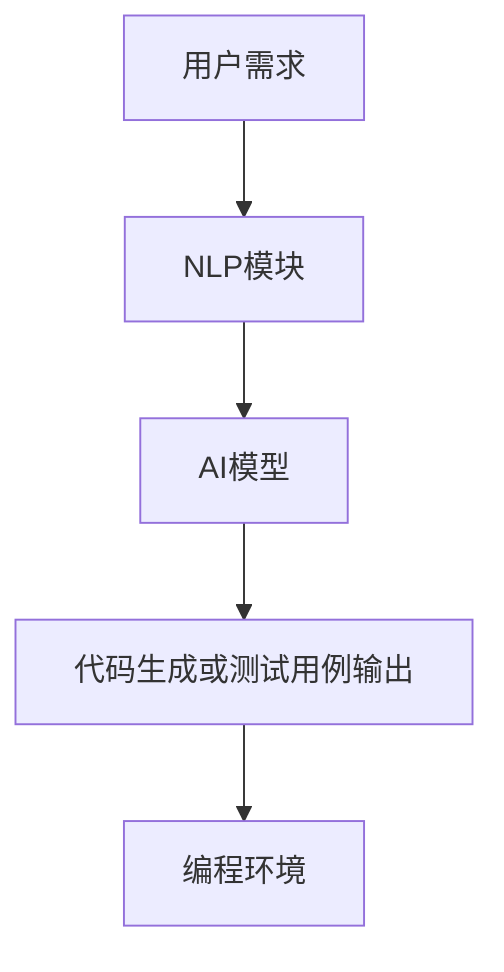

# AI技术进步对程序员职业发展的影响

> 关键词：AI技术、程序员、职业发展、影响、机遇、挑战

> 摘要：本文深入探讨了AI技术进步对程序员职业发展的多方面影响。首先介绍了研究此问题的背景和相关基础信息，接着阐述了AI与编程相关的核心概念及联系。通过具体的算法原理和数学模型，分析了AI在编程领域的作用机制。结合项目实战案例，展示了AI如何融入编程工作。探讨了AI技术在不同场景下的实际应用，推荐了相关的学习资源、开发工具和论文著作。最后总结了未来程序员职业发展的趋势与挑战，并对常见问题进行解答，为程序员应对AI技术变革提供全面的参考和指导。

## 1. 背景介绍 
### 1.1 目的和范围
随着AI技术的飞速发展，其对各个行业都产生了深远的影响，程序员职业也不例外。本文的目的在于全面、深入地分析AI技术进步对程序员职业发展的影响，包括带来的机遇和面临的挑战。范围涵盖了AI技术在编程领域的应用原理、实际案例、未来趋势等多个方面，旨在为程序员提供有价值的参考，帮助他们更好地适应AI时代的职业发展需求。

### 1.2 预期读者
本文预期读者主要包括在职程序员、计算机专业学生、对编程和AI技术发展感兴趣的人士以及相关行业的从业者。通过阅读本文，他们可以了解AI技术对程序员职业的影响，从而调整自己的学习和职业规划。

### 1.3 文档结构概述
本文首先介绍研究的背景信息，包括目的、读者群体和文档结构。接着阐述AI与编程相关的核心概念和联系，展示其原理和架构。然后详细讲解核心算法原理和具体操作步骤，通过Python代码进行说明。再介绍相关的数学模型和公式，并举例说明。通过项目实战案例，展示AI在编程中的实际应用和代码实现。探讨AI技术的实际应用场景，推荐相关的学习资源、开发工具和论文著作。最后总结未来发展趋势与挑战，解答常见问题，并提供扩展阅读和参考资料。

### 1.4 术语表
#### 1.4.1 核心术语定义
- **AI（Artificial Intelligence）**：即人工智能，是指计算机系统能够执行通常需要人类智能才能完成的任务，如学习、推理、解决问题等。
- **机器学习（Machine Learning）**：是AI的一个分支，专注于让计算机通过数据学习模式和规律，而无需明确的编程指令。
- **深度学习（Deep Learning）**：是机器学习的一种特殊形式，基于神经网络模型，能够处理复杂的模式和数据。
- **代码生成器（Code Generator）**：是一种利用AI技术自动生成代码的工具。

#### 1.4.2 相关概念解释
- **自然语言处理（Natural Language Processing，NLP）**：是AI的一个领域，旨在使计算机能够理解、处理和生成人类语言。在编程中，NLP可用于代码注释理解、自然语言到代码的转换等。
- **自动化测试（Automated Testing）**：使用软件工具自动执行测试用例，以验证程序的正确性和性能。AI技术可用于优化测试用例的生成和执行。

#### 1.4.3 缩略词列表
- **AI**：Artificial Intelligence
- **ML**：Machine Learning
- **DL**：Deep Learning
- **NLP**：Natural Language Processing

## 2. 核心概念与联系 

### 核心概念原理
AI技术的核心原理基于机器学习和深度学习。机器学习通过数据训练模型，使模型能够学习数据中的模式和规律，从而进行预测和决策。深度学习则是利用多层神经网络，自动提取数据的特征，处理复杂的模式和任务。

在编程领域，AI技术可以应用于多个方面。例如，代码生成器利用NLP技术理解用户的自然语言描述，然后生成相应的代码。自动化测试工具可以使用机器学习算法分析代码结构和历史测试数据，生成更有效的测试用例。

### 架构的文本示意图
AI与编程的结合架构可以描述如下：

用户需求（自然语言或编程需求） -> NLP模块（理解需求） -> AI模型（根据需求生成代码或优化测试用例等） -> 代码生成或测试用例输出 -> 编程环境（集成到项目中）

### Mermaid流程图


## 3. 核心算法原理 & 具体操作步骤 

### 核心算法原理
以代码生成器为例，其核心算法通常基于深度学习中的序列到序列（Sequence-to-Sequence，Seq2Seq）模型。Seq2Seq模型由编码器（Encoder）和解码器（Decoder）组成。

编码器将输入的自然语言描述转换为一个固定长度的向量表示，这个向量包含了输入描述的语义信息。解码器则根据这个向量生成相应的代码序列。

### Python源代码详细阐述
```python
import torch
import torch.nn as nn
import torch.optim as optim

# 定义编码器
class Encoder(nn.Module):
    def __init__(self, input_size, hidden_size):
        super(Encoder, self).__init__()
        self.hidden_size = hidden_size
        self.embedding = nn.Embedding(input_size, hidden_size)
        self.gru = nn.GRU(hidden_size, hidden_size)

    def forward(self, input, hidden):
        embedded = self.embedding(input).view(1, 1, -1)
        output = embedded
        output, hidden = self.gru(output, hidden)
        return output, hidden

    def initHidden(self):
        return torch.zeros(1, 1, self.hidden_size)

# 定义解码器
class Decoder(nn.Module):
    def __init__(self, hidden_size, output_size):
        super(Decoder, self).__init__()
        self.hidden_size = hidden_size
        self.embedding = nn.Embedding(output_size, hidden_size)
        self.gru = nn.GRU(hidden_size, hidden_size)
        self.out = nn.Linear(hidden_size, output_size)
        self.softmax = nn.LogSoftmax(dim=1)

    def forward(self, input, hidden):
        output = self.embedding(input).view(1, 1, -1)
        output = torch.relu(output)
        output, hidden = self.gru(output, hidden)
        output = self.softmax(self.out(output[0]))
        return output, hidden

    def initHidden(self):
        return torch.zeros(1, 1, self.hidden_size)

# 训练函数
def train(input_tensor, target_tensor, encoder, decoder, encoder_optimizer, decoder_optimizer, criterion):
    encoder_hidden = encoder.initHidden()
    encoder_optimizer.zero_grad()
    decoder_optimizer.zero_grad()
    input_length = input_tensor.size(0)
    target_length = target_tensor.size(0)
    encoder_outputs = torch.zeros(input_length, encoder.hidden_size)
    loss = 0
    for ei in range(input_length):
        encoder_output, encoder_hidden = encoder(input_tensor[ei], encoder_hidden)
        encoder_outputs[ei] = encoder_output[0, 0]
    decoder_input = torch.tensor([[0]])
    decoder_hidden = encoder_hidden
    for di in range(target_length):
        decoder_output, decoder_hidden = decoder(decoder_input, decoder_hidden)
        topv, topi = decoder_output.topk(1)
        decoder_input = topi.squeeze().detach()
        loss += criterion(decoder_output, target_tensor[di].unsqueeze(0))
    loss.backward()
    encoder_optimizer.step()
    decoder_optimizer.step()
    return loss.item() / target_length

# 示例使用
input_size = 1000
hidden_size = 256
output_size = 1000
encoder = Encoder(input_size, hidden_size)
decoder = Decoder(hidden_size, output_size)
encoder_optimizer = optim.SGD(encoder.parameters(), lr=0.01)
decoder_optimizer = optim.SGD(decoder.parameters(), lr=0.01)
criterion = nn.NLLLoss()

# 模拟输入和目标张量
input_tensor = torch.randint(0, input_size, (10,))
target_tensor = torch.randint(0, output_size, (10,))

# 训练模型
for iter in range(100):
    loss = train(input_tensor, target_tensor, encoder, decoder, encoder_optimizer, decoder_optimizer, criterion)
    if iter % 10 == 0:
        print(f'Iteration {iter}, Loss: {loss}')
```

### 具体操作步骤
1. **数据准备**：收集自然语言描述和对应的代码对，将其转换为适合模型输入的张量形式。
2. **模型初始化**：初始化编码器和解码器的参数。
3. **训练模型**：使用训练数据对模型进行训练，通过反向传播算法更新模型参数。
4. **测试和优化**：使用测试数据评估模型性能，根据评估结果调整模型参数和训练策略。

## 4. 数学模型和公式 & 详细讲解 & 举例说明 

### 数学模型
Seq2Seq模型的核心是基于概率模型。假设输入序列为 $X = (x_1, x_2, \cdots, x_n)$，输出序列为 $Y = (y_1, y_2, \cdots, y_m)$。模型的目标是计算条件概率 $P(Y|X)$。

### 公式
编码器将输入序列 $X$ 转换为一个上下文向量 $c$，可以表示为：

$$c = Encoder(X)$$

解码器根据上下文向量 $c$ 和之前生成的词 $y_{t-1}$ 生成下一个词 $y_t$ 的概率可以表示为：

$$P(y_t|y_1, \cdots, y_{t-1}, c) = Decoder(y_{t-1}, c)$$

整个输出序列的概率可以表示为：

$$P(Y|X) = \prod_{t=1}^{m} P(y_t|y_1, \cdots, y_{t-1}, c)$$

### 详细讲解
编码器通过循环神经网络（如GRU）将输入序列的信息编码到上下文向量 $c$ 中。解码器则根据上下文向量和之前生成的词逐步生成输出序列。在训练过程中，通过最大化训练数据的对数似然函数来优化模型参数：

$$\theta^* = \arg\max_{\theta} \sum_{(X, Y) \in D} \log P(Y|X; \theta)$$

其中，$D$ 是训练数据集，$\theta$ 是模型的参数。

### 举例说明
假设输入自然语言描述为 “打印 Hello World”，经过编码器处理后得到上下文向量 $c$。解码器根据 $c$ 逐步生成代码序列，如 `print("Hello World")`。在生成过程中，解码器根据之前生成的字符和上下文向量计算下一个字符的概率，选择概率最大的字符作为输出。

## 5. 项目实战：代码实际案例和详细解释说明 

### 5.1  开发环境搭建
- **操作系统**：选择适合开发的操作系统，如Windows、Linux或macOS。
- **Python环境**：安装Python 3.x版本，可以使用Anaconda或官方Python安装包。
- **深度学习框架**：安装PyTorch深度学习框架，可以根据自己的显卡情况选择CPU或GPU版本。

### 5.2  源代码详细实现和代码解读
以下是一个简单的代码生成器的完整实现，结合前面的编码器和解码器：

```python
import torch
import torch.nn as nn
import torch.optim as optim
import random

# 定义编码器
class Encoder(nn.Module):
    def __init__(self, input_size, hidden_size):
        super(Encoder, self).__init__()
        self.hidden_size = hidden_size
        self.embedding = nn.Embedding(input_size, hidden_size)
        self.gru = nn.GRU(hidden_size, hidden_size)

    def forward(self, input, hidden):
        embedded = self.embedding(input).view(1, 1, -1)
        output = embedded
        output, hidden = self.gru(output, hidden)
        return output, hidden

    def initHidden(self):
        return torch.zeros(1, 1, self.hidden_size)

# 定义解码器
class Decoder(nn.Module):
    def __init__(self, hidden_size, output_size):
        super(Decoder, self).__init__()
        self.hidden_size = hidden_size
        self.embedding = nn.Embedding(output_size, hidden_size)
        self.gru = nn.GRU(hidden_size, hidden_size)
        self.out = nn.Linear(hidden_size, output_size)
        self.softmax = nn.LogSoftmax(dim=1)

    def forward(self, input, hidden):
        output = self.embedding(input).view(1, 1, -1)
        output = torch.relu(output)
        output, hidden = self.gru(output, hidden)
        output = self.softmax(self.out(output[0]))
        return output, hidden

    def initHidden(self):
        return torch.zeros(1, 1, self.hidden_size)

# 训练函数
def train(input_tensor, target_tensor, encoder, decoder, encoder_optimizer, decoder_optimizer, criterion):
    encoder_hidden = encoder.initHidden()
    encoder_optimizer.zero_grad()
    decoder_optimizer.zero_grad()
    input_length = input_tensor.size(0)
    target_length = target_tensor.size(0)
    encoder_outputs = torch.zeros(input_length, encoder.hidden_size)
    loss = 0
    for ei in range(input_length):
        encoder_output, encoder_hidden = encoder(input_tensor[ei], encoder_hidden)
        encoder_outputs[ei] = encoder_output[0, 0]
    decoder_input = torch.tensor([[0]])
    decoder_hidden = encoder_hidden
    for di in range(target_length):
        decoder_output, decoder_hidden = decoder(decoder_input, decoder_hidden)
        topv, topi = decoder_output.topk(1)
        decoder_input = topi.squeeze().detach()
        loss += criterion(decoder_output, target_tensor[di].unsqueeze(0))
    loss.backward()
    encoder_optimizer.step()
    decoder_optimizer.step()
    return loss.item() / target_length

# 生成代码函数
def generate_code(input_sentence, encoder, decoder, input_lang, output_lang, max_length=20):
    with torch.no_grad():
        input_tensor = tensorFromSentence(input_lang, input_sentence)
        input_length = input_tensor.size()[0]
        encoder_hidden = encoder.initHidden()
        encoder_outputs = torch.zeros(max_length, encoder.hidden_size)
        for ei in range(input_length):
            encoder_output, encoder_hidden = encoder(input_tensor[ei], encoder_hidden)
            encoder_outputs[ei] = encoder_output[0, 0]
        decoder_input = torch.tensor([[0]])
        decoder_hidden = encoder_hidden
        decoded_words = []
        for di in range(max_length):
            decoder_output, decoder_hidden = decoder(decoder_input, decoder_hidden)
            topv, topi = decoder_output.data.topk(1)
            if topi.item() == 1:
                decoded_words.append('<EOS>')
                break
            else:
                decoded_words.append(output_lang.index2word[topi.item()])
            decoder_input = topi.squeeze().detach()
        return decoded_words

# 辅助函数：将句子转换为张量
def tensorFromSentence(lang, sentence):
    indexes = [lang.word2index[word] for word in sentence.split(' ')]
    indexes.append(1)  # EOS
    return torch.tensor(indexes, dtype=torch.long).view(-1, 1)

# 定义语言类
class Lang:
    def __init__(self, name):
        self.name = name
        self.word2index = {}
        self.word2count = {}
        self.index2word = {0: "SOS", 1: "EOS"}
        self.n_words = 2  # Count SOS and EOS

    def addSentence(self, sentence):
        for word in sentence.split(' '):
            self.addWord(word)

    def addWord(self, word):
        if word not in self.word2index:
            self.word2index[word] = self.n_words
            self.word2count[word] = 1
            self.index2word[self.n_words] = word
            self.n_words += 1
        else:
            self.word2count[word] += 1

# 示例数据
pairs = [
    ("print hello", "print('hello')"),
    ("add two numbers", "a = 1; b = 2; print(a + b)")
]

# 初始化语言类
input_lang = Lang('input')
output_lang = Lang('output')
for pair in pairs:
    input_lang.addSentence(pair[0])
    output_lang.addSentence(pair[1])

# 初始化模型
input_size = input_lang.n_words
hidden_size = 256
output_size = output_lang.n_words
encoder = Encoder(input_size, hidden_size)
decoder = Decoder(hidden_size, output_size)
encoder_optimizer = optim.SGD(encoder.parameters(), lr=0.01)
decoder_optimizer = optim.SGD(decoder.parameters(), lr=0.01)
criterion = nn.NLLLoss()

# 训练模型
n_iters = 1000
for iter in range(1, n_iters + 1):
    pair = random.choice(pairs)
    input_tensor = tensorFromSentence(input_lang, pair[0])
    target_tensor = tensorFromSentence(output_lang, pair[1])
    loss = train(input_tensor, target_tensor, encoder, decoder, encoder_optimizer, decoder_optimizer, criterion)
    if iter % 100 == 0:
        print(f'Iteration {iter}, Loss: {loss}')

# 生成代码示例
input_sentence = "print hello"
generated_code = generate_code(input_sentence, encoder, decoder, input_lang, output_lang)
print('Generated Code:', ' '.join(generated_code))
```

### 代码解读与分析
- **编码器（Encoder）**：将输入的自然语言描述转换为上下文向量。通过嵌入层将输入的词转换为向量，然后使用GRU循环神经网络处理向量序列。
- **解码器（Decoder）**：根据上下文向量和之前生成的词逐步生成代码序列。同样使用嵌入层和GRU，最后通过线性层和Softmax函数输出下一个词的概率分布。
- **训练函数（train）**：计算损失并通过反向传播算法更新模型参数。
- **生成代码函数（generate_code）**：根据输入的自然语言描述生成代码序列。
- **语言类（Lang）**：用于处理自然语言和代码的词汇表，将词转换为索引，将索引转换为词。

## 6. 实际应用场景 
### 代码生成
AI技术可以根据用户的自然语言描述自动生成代码。例如，在开发过程中，程序员可以使用代码生成器快速生成一些基础的代码框架，提高开发效率。

### 代码审查和优化
AI工具可以分析代码的结构、复杂度和潜在的错误，提供代码优化建议。例如，检测代码中的重复代码、性能瓶颈等问题，并给出相应的改进方案。

### 自动化测试
AI可以根据代码的功能和结构自动生成测试用例，提高测试的覆盖率和效率。通过分析代码的输入输出和逻辑关系，生成更全面的测试用例。

### 智能编程助手
智能编程助手可以在程序员编写代码时提供实时的建议和提示。例如，根据上下文自动补全代码、提供代码示例等。

## 7. 工具和资源推荐
### 7.1 学习资源推荐
#### 7.1.1 书籍推荐
- 《深度学习》（Deep Learning）：由Ian Goodfellow、Yoshua Bengio和Aaron Courville撰写，是深度学习领域的经典教材。
- 《Python深度学习》（Deep Learning with Python）：由Francois Chollet编写，介绍了如何使用Python和Keras进行深度学习开发。
- 《人工智能：一种现代的方法》（Artificial Intelligence: A Modern Approach）：全面介绍了人工智能的各个领域和方法。

#### 7.1.2 在线课程
- Coursera上的“深度学习专项课程”（Deep Learning Specialization）：由Andrew Ng教授授课，涵盖了深度学习的基础知识和应用。
- edX上的“人工智能基础”（Fundamentals of Artificial Intelligence）：介绍了人工智能的基本概念和算法。
- Udemy上的“Python机器学习实战”（Machine Learning A-Z™: Hands-On Python & R In Data Science）：通过实际案例学习机器学习和Python编程。

#### 7.1.3 技术博客和网站
- Medium：有很多关于AI和编程的技术文章，作者来自不同的领域和背景。
- Towards Data Science：专注于数据科学和AI领域的技术分享和讨论。
- Stack Overflow：程序员交流和解决问题的社区，有很多关于AI和编程的问题和答案。

### 7.2 开发工具框架推荐
#### 7.2.1 IDE和编辑器
- PyCharm：专业的Python集成开发环境，提供代码编辑、调试、版本控制等功能。
- Visual Studio Code：轻量级的代码编辑器，支持多种编程语言和插件扩展。
- Jupyter Notebook：交互式的开发环境，适合进行数据探索和模型实验。

#### 7.2.2 调试和性能分析工具
- Py-Spy：用于分析Python代码的性能瓶颈，找出耗时的函数和代码段。
- TensorBoard：TensorFlow的可视化工具，用于监控模型训练过程和分析模型性能。
- PDB：Python内置的调试器，用于调试Python代码。

#### 7.2.3 相关框架和库
- PyTorch：开源的深度学习框架，提供丰富的神经网络模型和工具。
- TensorFlow：Google开发的深度学习框架，广泛应用于工业和研究领域。
- Scikit-learn：用于机器学习的Python库，提供了各种机器学习算法和工具。

### 7.3 相关论文著作推荐
#### 7.3.1 经典论文
- “Attention Is All You Need”：介绍了Transformer架构，是自然语言处理领域的重要突破。
- “ImageNet Classification with Deep Convolutional Neural Networks”：提出了AlexNet模型，开启了深度学习在计算机视觉领域的热潮。
- “Generative Adversarial Networks”：提出了生成对抗网络（GAN），在图像生成和数据增强等领域有广泛应用。

#### 7.3.2 最新研究成果
- 关注顶级学术会议如NeurIPS、ICML、CVPR等的最新论文，了解AI领域的最新研究进展。
- 一些知名的研究机构如OpenAI、DeepMind等的官方网站会发布他们的最新研究成果。

#### 7.3.3 应用案例分析
- 分析一些成功的AI应用案例，如AlphaGo、自动驾驶汽车等，了解AI技术在实际场景中的应用和挑战。
- 一些行业报告和技术博客也会分享AI在不同领域的应用案例和经验。

## 8. 总结：未来发展趋势与挑战
### 未来发展趋势
- **AI与编程的深度融合**：AI技术将更加深入地融入编程的各个环节，从代码生成、优化到测试，都将实现更高程度的自动化。
- **智能编程生态系统的形成**：会出现更多集成了AI功能的编程工具和平台，形成一个智能编程生态系统，提高程序员的工作效率和质量。
- **跨领域应用的拓展**：AI技术将与其他领域如物联网、区块链等结合，创造出更多创新的应用场景，对程序员的跨领域知识和技能要求也会提高。

### 挑战
- **就业结构的调整**：部分基础编程工作可能会被AI工具取代，程序员需要不断提升自己的技能，向更高级的领域发展，如算法设计、模型优化等。
- **数据隐私和安全问题**：AI技术依赖大量的数据，如何保证数据的隐私和安全是一个重要的挑战。在编程过程中，需要考虑如何保护用户数据和系统安全。
- **伦理和道德问题**：AI系统的决策和行为可能会对社会产生影响，程序员需要关注AI的伦理和道德问题，确保AI系统的设计和开发符合社会价值观。

## 9. 附录：常见问题与解答
### 问题1：AI技术会完全取代程序员吗？
答：不会。虽然AI技术可以自动生成一些代码和完成部分编程任务，但编程不仅仅是代码的生成，还包括需求分析、系统设计、架构规划等复杂的工作。程序员的创造力、逻辑思维和问题解决能力是AI无法替代的。AI技术更多的是辅助程序员提高工作效率。

### 问题2：程序员应该如何应对AI技术的发展？
答：程序员可以从以下几个方面应对：
- 学习AI相关知识和技能，了解AI在编程领域的应用。
- 提升自己的软技能，如沟通能力、团队协作能力等。
- 关注行业发展趋势，不断学习新的技术和方法，向更高级的领域发展。

### 问题3：AI生成的代码质量可靠吗？
答：AI生成的代码质量取决于训练数据和模型的性能。目前，AI生成的代码在一些简单的场景下可以达到较高的质量，但在复杂的业务逻辑和系统设计方面还存在一定的局限性。程序员需要对AI生成的代码进行审查和优化，确保代码的质量和可靠性。

## 10. 扩展阅读 & 参考资料
### 扩展阅读
- 《AI未来进行式》：探讨了AI技术对社会和未来的影响。
- 《第四次工业革命》：介绍了以AI为代表的新兴技术对工业和社会的变革。

### 参考资料
- 相关学术论文和研究报告。
- 各技术社区和论坛的讨论和分享。
- 官方文档和技术手册，如PyTorch、TensorFlow等的官方文档。