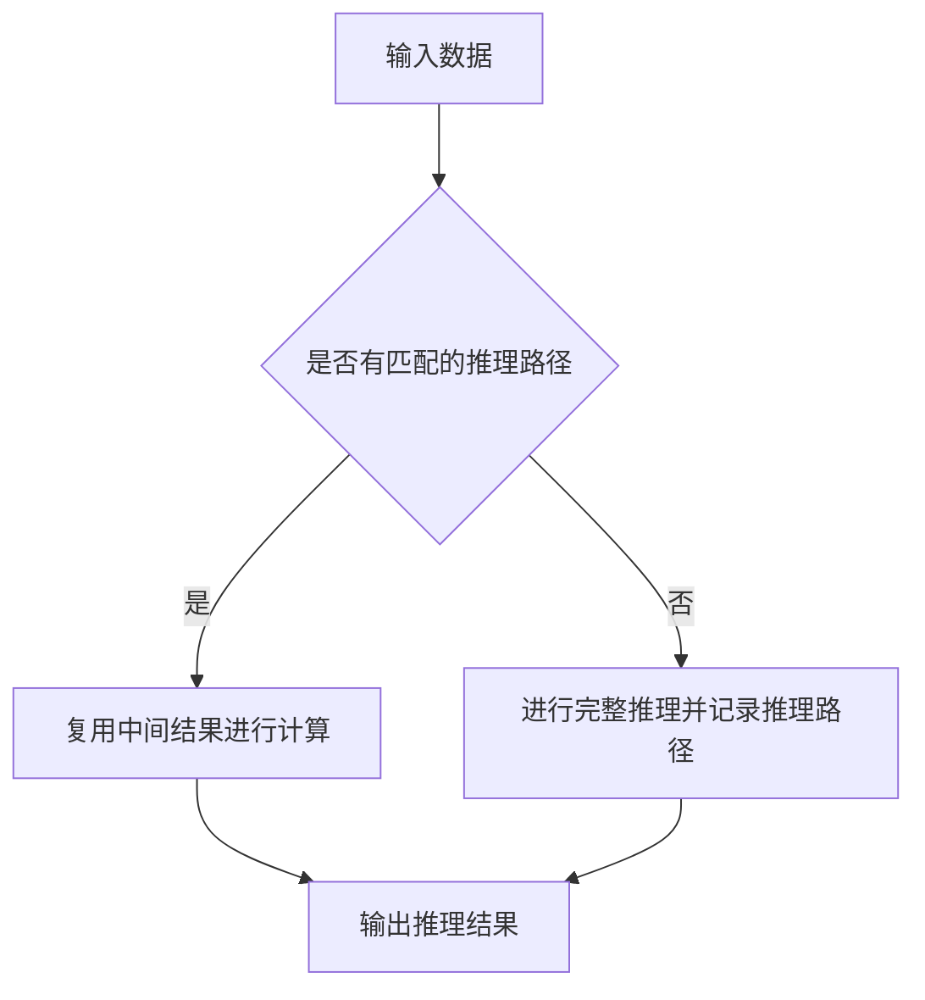

# AI效率提升:复用推理路径的新方法

> 关键词：AI效率、复用推理路径、新方法、推理优化、深度学习

> 摘要：本文聚焦于AI效率提升这一关键问题，深入探讨复用推理路径的新方法。在AI技术不断发展的今天，推理效率的提升对于降低计算成本、提高系统响应速度至关重要。复用推理路径作为一种创新的思路，能够有效减少重复计算，提高资源利用率。文章详细介绍了该方法的核心概念、算法原理、数学模型，通过项目实战展示其实际应用，并分析了在不同场景下的应用潜力，最后对未来发展趋势与挑战进行了总结，旨在为相关领域的研究和实践提供有价值的参考。

## 1. 背景介绍 
### 1.1 目的和范围
在人工智能领域，推理过程往往需要大量的计算资源和时间。随着模型规模的不断增大和应用场景的日益复杂，如何提高推理效率成为了亟待解决的问题。本文的目的在于介绍一种复用推理路径的新方法，旨在通过减少重复计算来提升AI推理的效率。范围涵盖了该方法的理论基础、算法实现、实际应用案例以及未来发展趋势等方面。

### 1.2 预期读者
本文预期读者包括人工智能领域的研究人员、工程师、开发者以及对AI技术感兴趣的技术爱好者。对于希望深入了解AI推理优化技术的专业人士，本文提供了详细的技术原理和实践指导；对于初学者，也能通过本文初步了解AI效率提升的相关概念和方法。

### 1.3 文档结构概述
本文首先介绍背景信息，包括目的、预期读者和文档结构概述。接着阐述复用推理路径的核心概念与联系，包括原理和架构的文本示意图以及Mermaid流程图。然后详细讲解核心算法原理和具体操作步骤，通过Python源代码进行说明。随后介绍数学模型和公式，并举例说明。再通过项目实战展示代码实际案例和详细解释。之后分析实际应用场景，推荐相关工具和资源。最后总结未来发展趋势与挑战，提供常见问题与解答以及扩展阅读和参考资料。

### 1.4 术语表
#### 1.4.1 核心术语定义
- **AI推理**：指人工智能模型在训练完成后，对新数据进行预测或分类的过程。
- **推理路径**：在AI推理过程中，数据在模型中经过的计算步骤和节点的序列。
- **复用推理路径**：通过对已有的推理路径进行存储和再次利用，避免重复计算的过程。

#### 1.4.2 相关概念解释
- **计算图**：表示计算过程的有向无环图，其中节点表示操作，边表示数据的流动。在AI推理中，计算图描述了模型的计算逻辑。
- **中间结果**：在推理过程中，模型在中间步骤产生的计算结果。复用推理路径可以利用这些中间结果来减少重复计算。

#### 1.4.3 缩略词列表
- **AI**：Artificial Intelligence，人工智能
- **DNN**：Deep Neural Network，深度神经网络
- **GPU**：Graphics Processing Unit，图形处理器

## 2. 核心概念与联系 
### 核心概念原理
复用推理路径的核心原理是通过记录和重用推理过程中的中间结果，避免重复计算相同的部分。在传统的AI推理中，每次输入数据都需要从头开始进行完整的计算。而复用推理路径的方法则是在第一次推理时，记录下计算过程中的关键节点和中间结果。当后续输入数据与之前的部分相似时，可以直接复用已有的中间结果，从而减少计算量。

例如，在一个图像分类的深度学习模型中，对于不同的图像，可能在特征提取阶段有很多相同的计算步骤。如果能够记录下这些特征提取的中间结果，当遇到类似的图像时，就可以直接使用这些中间结果，而不需要重新进行特征提取的计算。

### 架构的文本示意图
复用推理路径的架构主要包括以下几个部分：
1. **输入模块**：接收待推理的数据。
2. **推理路径记录模块**：在第一次推理时，记录推理过程中的关键节点和中间结果。
3. **推理路径匹配模块**：对于后续输入的数据，与已记录的推理路径进行匹配，找到可以复用的部分。
4. **复用计算模块**：根据匹配结果，直接使用已有的中间结果进行后续计算，避免重复计算。
5. **输出模块**：输出最终的推理结果。

### Mermaid流程图


## 3. 核心算法原理 & 具体操作步骤 
### 核心算法原理
复用推理路径的核心算法主要包括推理路径记录和推理路径匹配两个部分。

#### 推理路径记录
在第一次推理时，需要记录下推理过程中的关键节点和中间结果。可以通过在计算图中标记关键节点，并将这些节点的输出结果存储起来。例如，在一个深度学习模型中，可以选择卷积层、池化层等关键层的输出作为中间结果进行记录。

#### 推理路径匹配
对于后续输入的数据，需要与已记录的推理路径进行匹配。可以通过比较输入数据的特征或中间结果的相似性来判断是否可以复用已有的推理路径。如果相似度超过一定的阈值，则认为可以复用。

### 具体操作步骤
以下是复用推理路径的具体操作步骤：
1. **初始化**：加载模型和相关参数，创建推理路径记录的数据结构。
2. **第一次推理**：对输入数据进行完整的推理，并记录推理过程中的关键节点和中间结果。
3. **后续推理**：对于新的输入数据，进行推理路径匹配。如果找到匹配的推理路径，则复用中间结果进行后续计算；否则，进行完整的推理并记录新的推理路径。
4. **输出结果**：输出最终的推理结果。

### Python源代码实现
```python
import numpy as np

# 模拟一个简单的深度学习模型
class SimpleModel:
    def __init__(self):
        self.weights = np.random.rand(10, 10)

    def forward(self, x):
        return np.dot(x, self.weights)

# 推理路径记录类
class InferencePathRecorder:
    def __init__(self):
        self.paths = {}

    def record_path(self, input_data, output_data):
        input_hash = hash(tuple(input_data.flatten()))
        self.paths[input_hash] = output_data

    def match_path(self, input_data):
        input_hash = hash(tuple(input_data.flatten()))
        if input_hash in self.paths:
            return self.paths[input_hash]
        else:
            return None

# 复用推理路径的推理函数
def inference_with_path_reuse(model, recorder, input_data):
    reused_output = recorder.match_path(input_data)
    if reused_output is not None:
        print("复用推理路径")
        return reused_output
    else:
        print("进行完整推理")
        output = model.forward(input_data)
        recorder.record_path(input_data, output)
        return output

# 测试代码
model = SimpleModel()
recorder = InferencePathRecorder()

input_data1 = np.random.rand(10)
output1 = inference_with_path_reuse(model, recorder, input_data1)

input_data2 = np.random.rand(10)
output2 = inference_with_path_reuse(model, recorder, input_data2)

input_data3 = input_data1.copy()
output3 = inference_with_path_reuse(model, recorder, input_data3)
```

## 4. 数学模型和公式 & 详细讲解 & 举例说明 
### 数学模型
复用推理路径的数学模型可以基于相似度计算来描述。设 $x$ 为输入数据，$y$ 为推理结果，$P$ 为推理路径，$M$ 为已记录的推理路径集合。

#### 相似度计算
定义输入数据 $x_1$ 和 $x_2$ 的相似度 $s(x_1, x_2)$ 可以使用欧几里得距离、余弦相似度等方法。例如，余弦相似度的计算公式为：
$$s(x_1, x_2) = \frac{x_1 \cdot x_2}{\|x_1\| \|x_2\|}$$

#### 推理路径匹配
如果存在 $P_i \in M$，使得 $s(x, x_i) \geq \theta$（$\theta$ 为相似度阈值），则认为可以复用推理路径 $P_i$。

### 详细讲解
在实际应用中，相似度计算用于判断输入数据是否与已记录的推理路径相似。如果相似度超过阈值，则可以复用已有的中间结果，从而减少计算量。例如，在图像分类任务中，可以将图像的特征向量作为输入数据，计算特征向量之间的相似度。

### 举例说明
假设我们有两个图像的特征向量 $x_1 = [1, 2, 3]$ 和 $x_2 = [1.1, 2.1, 3.1]$，相似度阈值 $\theta = 0.9$。

首先计算余弦相似度：
$$s(x_1, x_2) = \frac{1\times1.1 + 2\times2.1 + 3\times3.1}{\sqrt{1^2 + 2^2 + 3^2} \sqrt{1.1^2 + 2.1^2 + 3.1^2}} \approx 0.99$$

由于 $s(x_1, x_2) \geq \theta$，所以可以认为这两个图像的推理路径相似，可以复用已有的中间结果。

## 5. 项目实战：代码实际案例和详细解释说明 
### 5.1  开发环境搭建
本次项目实战使用Python语言，需要安装以下库：
- **NumPy**：用于数值计算
- **TensorFlow** 或 **PyTorch**：用于深度学习模型的构建和训练

可以使用以下命令安装所需库：
```sh
pip install numpy tensorflow
```

### 5.2  源代码详细实现和代码解读
以下是一个基于TensorFlow的图像分类项目，实现了复用推理路径的功能：

```python
import tensorflow as tf
import numpy as np

# 加载数据集
mnist = tf.keras.datasets.mnist
(x_train, y_train), (x_test, y_test) = mnist.load_data()

# 数据预处理
x_train, x_test = x_train / 255.0, x_test / 255.0

# 构建模型
model = tf.keras.models.Sequential([
    tf.keras.layers.Flatten(input_shape=(28, 28)),
    tf.keras.layers.Dense(128, activation='relu'),
    tf.keras.layers.Dropout(0.2),
    tf.keras.layers.Dense(10, activation='softmax')
])

# 编译模型
model.compile(optimizer='adam',
              loss='sparse_categorical_crossentropy',
              metrics=['accuracy'])

# 训练模型
model.fit(x_train, y_train, epochs=5)

# 推理路径记录类
class InferencePathRecorder:
    def __init__(self):
        self.paths = {}

    def record_path(self, input_data, output_data):
        input_hash = hash(tuple(input_data.flatten()))
        self.paths[input_hash] = output_data

    def match_path(self, input_data):
        input_hash = hash(tuple(input_data.flatten()))
        if input_hash in self.paths:
            return self.paths[input_hash]
        else:
            return None

# 复用推理路径的推理函数
def inference_with_path_reuse(model, recorder, input_data):
    reused_output = recorder.match_path(input_data)
    if reused_output is not None:
        print("复用推理路径")
        return reused_output
    else:
        print("进行完整推理")
        output = model.predict(np.expand_dims(input_data, axis=0))
        recorder.record_path(input_data, output)
        return output

# 测试代码
recorder = InferencePathRecorder()

for i in range(10):
    input_data = x_test[i]
    output = inference_with_path_reuse(model, recorder, input_data)
    print(f"预测结果: {np.argmax(output)}")
```

### 5.3  代码解读与分析
- **数据加载和预处理**：使用 `tf.keras.datasets.mnist` 加载MNIST数据集，并进行归一化处理。
- **模型构建和训练**：构建一个简单的全连接神经网络模型，并使用 `model.fit` 方法进行训练。
- **推理路径记录类**：`InferencePathRecorder` 类用于记录和匹配推理路径。通过哈希值来存储和查找中间结果。
- **复用推理路径的推理函数**：`inference_with_path_reuse` 函数实现了复用推理路径的逻辑。如果找到匹配的推理路径，则直接返回中间结果；否则，进行完整的推理并记录新的推理路径。

## 6. 实际应用场景 
### 图像分类
在图像分类任务中，不同的图像可能具有相似的特征。复用推理路径可以减少特征提取的重复计算，提高分类效率。例如，在安防监控系统中，对于大量的监控图像进行实时分类时，复用推理路径可以显著降低计算成本。

### 自然语言处理
在自然语言处理任务中，如文本分类、情感分析等，不同的文本可能具有相似的语义结构。复用推理路径可以减少文本特征提取和语义理解的重复计算，提高处理速度。例如，在智能客服系统中，对于用户的常见问题，可以复用已有的推理路径进行快速回答。

### 语音识别
在语音识别任务中，不同的语音信号可能具有相似的声学特征。复用推理路径可以减少声学模型的重复计算，提高识别效率。例如，在语音助手系统中，对于用户的常见语音指令，可以复用已有的推理路径进行快速识别和响应。

## 7. 工具和资源推荐
### 7.1 学习资源推荐
#### 7.1.1 书籍推荐
- 《深度学习》（Deep Learning）：由Ian Goodfellow、Yoshua Bengio和Aaron Courville合著，是深度学习领域的经典教材。
- 《Python深度学习》（Deep Learning with Python）：由Francois Chollet著，介绍了如何使用Python和Keras进行深度学习开发。

#### 7.1.2 在线课程
- Coursera上的“深度学习专项课程”（Deep Learning Specialization）：由Andrew Ng教授授课，全面介绍了深度学习的理论和实践。
- edX上的“人工智能基础”（Fundamentals of Artificial Intelligence）：介绍了人工智能的基本概念和方法。

#### 7.1.3 技术博客和网站
- Medium上的Towards Data Science：提供了大量关于数据科学和人工智能的技术文章。
- arXiv.org：是一个预印本服务器，提供了最新的人工智能研究论文。

### 7.2 开发工具框架推荐
#### 7.2.1 IDE和编辑器
- PyCharm：是一个专业的Python集成开发环境，提供了丰富的代码编辑和调试功能。
- Jupyter Notebook：是一个交互式的开发环境，适合进行数据分析和模型训练。

#### 7.2.2 调试和性能分析工具
- TensorBoard：是TensorFlow的可视化工具，可以用于查看模型的训练过程和性能指标。
- PyTorch Profiler：是PyTorch的性能分析工具，可以帮助用户找出模型中的性能瓶颈。

#### 7.2.3 相关框架和库
- TensorFlow：是一个开源的深度学习框架，提供了丰富的工具和库，用于构建和训练深度学习模型。
- PyTorch：是另一个流行的深度学习框架，具有动态计算图和易于使用的特点。

### 7.3 相关论文著作推荐
#### 7.3.1 经典论文
- “ImageNet Classification with Deep Convolutional Neural Networks”：介绍了AlexNet模型，开启了深度学习在图像分类领域的革命。
- “Attention Is All You Need”：提出了Transformer模型，在自然语言处理领域取得了巨大的成功。

#### 7.3.2 最新研究成果
- 关注arXiv.org上的最新论文，了解复用推理路径相关的最新研究进展。

#### 7.3.3 应用案例分析
- 可以在ACM、IEEE等学术数据库中查找复用推理路径在不同应用场景下的案例分析论文。

## 8. 总结：未来发展趋势与挑战
### 未来发展趋势
- **与硬件结合**：复用推理路径的方法将与硬件技术更加紧密地结合，例如在专用的AI芯片中实现推理路径的快速匹配和复用，进一步提高推理效率。
- **多模态融合**：随着多模态人工智能的发展，复用推理路径的方法将扩展到多模态数据的处理中，实现不同模态数据之间的推理路径复用。
- **自适应调整**：推理路径的复用策略将更加智能化，能够根据不同的应用场景和数据特点自适应地调整复用策略，提高复用的准确性和效率。

### 挑战
- **相似度计算的准确性**：如何准确地计算输入数据之间的相似度是复用推理路径的关键。目前的相似度计算方法可能存在一定的局限性，需要进一步研究和改进。
- **存储和管理**：随着推理路径的不断增加，如何高效地存储和管理这些推理路径是一个挑战。需要设计合理的数据结构和算法来提高存储和查询效率。
- **模型更新**：当模型更新时，已记录的推理路径可能不再适用。如何处理模型更新后的推理路径复用问题是一个需要解决的问题。

## 9. 附录：常见问题与解答
### 问题1：复用推理路径是否会影响推理结果的准确性？
解答：复用推理路径本身不会影响推理结果的准确性，只要输入数据相似且推理路径匹配正确。但是，如果相似度计算不准确，可能会导致复用错误的推理路径，从而影响推理结果的准确性。

### 问题2：如何选择合适的相似度阈值？
解答：相似度阈值的选择需要根据具体的应用场景和数据特点进行调整。一般来说，可以通过实验的方法，尝试不同的阈值，选择能够在复用效率和推理准确性之间取得平衡的阈值。

### 问题3：复用推理路径的方法是否适用于所有的AI模型？
解答：复用推理路径的方法适用于大多数AI模型，尤其是那些具有重复计算部分的模型。但是，对于一些特殊的模型，可能需要进行适当的调整和优化。

## 10. 扩展阅读 & 参考资料
### 扩展阅读
- 关于深度学习优化技术的相关书籍和论文。
- 关于计算机视觉、自然语言处理等领域的最新研究成果。

### 参考资料
- 相关的学术论文、技术报告和开源代码库。
- 官方文档和教程，如TensorFlow、PyTorch的官方文档。