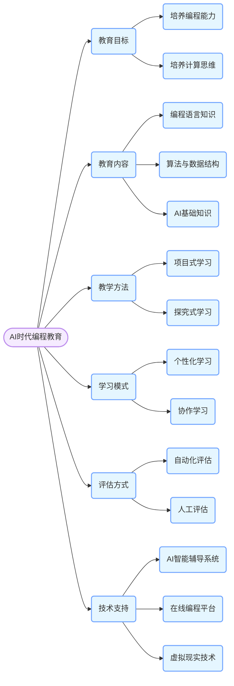

# AI时代的编程教育：新模式与新思维

> 关键词：AI时代、编程教育、新模式、新思维、教育变革

> 摘要：随着AI技术的飞速发展，编程教育迎来了新的变革契机。本文深入探讨了AI时代编程教育的新模式与新思维，阐述了其背景、核心概念、算法原理、数学模型等内容，并通过项目实战展示了具体应用，分析了实际应用场景，推荐了相关工具和资源。旨在为教育工作者、学习者以及相关从业者提供全面的参考，以适应AI时代编程教育的发展需求，推动编程教育的创新与进步。

## 1. 背景介绍 
### 1.1 目的和范围
在当今AI时代，科技的快速发展使得编程技能成为了一种至关重要的能力。编程教育不仅关乎个人的职业发展，也对国家的科技创新能力有着深远的影响。本文的目的在于探讨AI时代编程教育所呈现出的新模式与新思维，分析其背后的原理和应用场景，为编程教育的改革和发展提供理论支持和实践指导。范围涵盖了编程教育的各个层面，包括教学方法、课程设计、学习模式等，同时涉及到相关的技术原理、数学模型以及实际案例分析。

### 1.2 预期读者
本文预期读者包括教育工作者，如中小学信息技术教师、高校计算机专业教师等，他们可以从文中获取关于编程教育新模式和新思维的灵感，改进教学方法和课程设计；编程学习者，无论是初学者还是有一定基础的人员，能够从中了解到适应AI时代的学习策略和方法；教育研究者，有助于他们深入研究编程教育的发展趋势和规律；以及相关的教育行业从业者，如教育机构的管理人员、课程开发人员等，为其决策和业务发展提供参考。

### 1.3 文档结构概述
本文首先介绍了AI时代编程教育的背景，包括目的、预期读者和文档结构概述等内容。接着阐述了核心概念与联系，通过文本示意图和Mermaid流程图展示编程教育在AI时代的架构和原理。然后详细讲解了核心算法原理及具体操作步骤，使用Python源代码进行阐述。之后介绍了数学模型和公式，并举例说明。通过项目实战，展示代码实际案例并进行详细解释说明。分析了实际应用场景，推荐了相关的工具和资源。最后总结了未来发展趋势与挑战，提供了常见问题与解答以及扩展阅读和参考资料。

### 1.4 术语表
#### 1.4.1 核心术语定义
- **AI（Artificial Intelligence）**：人工智能，是研究、开发用于模拟、延伸和扩展人的智能的理论、方法、技术及应用系统的一门新的技术科学。
- **编程教育**：旨在传授编程知识和技能，培养学习者的计算思维和创新能力，使他们能够运用编程语言解决实际问题的教育活动。
- **计算思维**：运用计算机科学的基础概念进行问题求解、系统设计以及人类行为理解等涵盖计算机科学之广度的一系列思维活动。
- **在线编程平台**：基于互联网的编程学习和实践平台，提供编程环境、课程资源、社区交流等功能，方便学习者随时随地进行编程学习和实践。

#### 1.4.2 相关概念解释
- **AI辅助编程**：利用人工智能技术为编程过程提供辅助，如代码自动补全、错误提示、代码优化建议等，提高编程效率和质量。
- **个性化学习**：根据学习者的学习进度、兴趣爱好、能力水平等因素，为其提供个性化的学习内容和学习路径，满足不同学习者的需求。
- **项目式学习**：以项目为载体，让学习者在完成项目的过程中学习和应用知识与技能，培养其解决实际问题的能力和团队协作精神。

#### 1.4.3 缩略词列表
- **AI**：Artificial Intelligence（人工智能）
- **IDE**：Integrated Development Environment（集成开发环境）
- **ML**：Machine Learning（机器学习）
- **DL**：Deep Learning（深度学习）

## 2. 核心概念与联系 

### 核心概念原理
在AI时代，编程教育的核心概念围绕着如何利用AI技术提升编程教育的质量和效果，以及培养学习者适应AI时代的编程思维和能力。

- **AI与编程教育的融合**：AI技术可以为编程教育提供智能辅导、个性化学习支持、自动化评估等服务。例如，智能辅导系统可以根据学习者的学习情况提供实时的指导和反馈，帮助学习者更好地理解和掌握编程知识和技能。
- **计算思维的培养**：计算思维是编程教育的核心目标之一，它包括分解问题、抽象、算法设计、模式识别等方面的能力。AI时代的编程教育需要更加注重计算思维的培养，使学习者能够运用计算思维解决复杂的实际问题。
- **编程教育的创新模式**：如在线编程平台、虚拟现实编程教育、游戏化编程教育等创新模式不断涌现。这些模式利用现代信息技术，为学习者提供更加生动、有趣、便捷的学习体验，激发学习者的学习兴趣和积极性。

### 架构的文本示意图
```plaintext
AI时代编程教育架构

               ┌─────────────────────┐
               │      教育目标       │
               │  培养编程能力与计算思维  │
               └─────────────────────┘
                        │
                        ▼
      ┌────────────────────────────────────────────┐
      │                    教育内容                   │
      │  编程语言知识  算法与数据结构  AI基础知识  │
      └────────────────────────────────────────────┘
                        │
                        ▼
┌─────────────────────┬─────────────────────┬─────────────────────┐
│      教学方法       │      学习模式       │      评估方式       │
│  项目式学习  探究式学习  │  个性化学习  协作学习  │  自动化评估  人工评估  │
└─────────────────────┴─────────────────────┴─────────────────────┘
                        │
                        ▼
      ┌────────────────────────────────────────────┐
      │                    技术支持                   │
      │  AI智能辅导系统  在线编程平台  虚拟现实技术  │
      └────────────────────────────────────────────┘
```

### Mermaid流程图


## 3. 核心算法原理 & 具体操作步骤 

### 核心算法原理
在AI时代的编程教育中，一些核心算法被广泛应用，以实现智能辅导、个性化学习等功能。下面以基于机器学习的智能辅导系统为例，介绍其核心算法原理。

#### 机器学习算法
机器学习是人工智能的一个重要分支，它通过让计算机从数据中学习模式和规律，从而实现预测和决策。在智能辅导系统中，常用的机器学习算法包括决策树、神经网络等。

决策树是一种基于树结构进行决策的算法，它通过对数据的特征进行划分，构建决策树模型。在智能辅导系统中，决策树可以用于根据学习者的学习行为和表现，判断学习者的知识掌握情况和学习困难点，从而提供针对性的辅导建议。

神经网络是一种模仿人类神经系统的计算模型，它由大量的神经元组成，可以自动从数据中学习复杂的模式和规律。在智能辅导系统中，神经网络可以用于对学习者的学习数据进行分析和预测，如预测学习者的学习成绩、学习进度等。

### Python源代码详细阐述
以下是一个简单的基于决策树的智能辅导系统示例代码：

```python
import pandas as pd
from sklearn.tree import DecisionTreeClassifier
from sklearn.model_selection import train_test_split
from sklearn.metrics import accuracy_score

# 读取学习数据
data = pd.read_csv('learning_data.csv')

# 划分特征和标签
X = data.drop('difficulty_level', axis=1)
y = data['difficulty_level']

# 划分训练集和测试集
X_train, X_test, y_train, y_test = train_test_split(X, y, test_size=0.2, random_state=42)

# 创建决策树分类器
clf = DecisionTreeClassifier()

# 训练模型
clf.fit(X_train, y_train)

# 预测
y_pred = clf.predict(X_test)

# 评估模型
accuracy = accuracy_score(y_test, y_pred)
print(f"模型准确率: {accuracy}")

# 模拟新的学习者数据，进行预测
new_learner_data = pd.DataFrame({
    'time_spent': [30],
    'correct_answers': [8],
    'wrong_answers': [2]
})

predicted_difficulty_level = clf.predict(new_learner_data)
print(f"预测的学习困难等级: {predicted_difficulty_level[0]}")
```

### 具体操作步骤
1. **数据收集**：收集学习者的学习数据，如学习时间、正确答案数量、错误答案数量等。
2. **数据预处理**：对收集到的数据进行清洗、转换和归一化等处理，以提高数据质量和模型性能。
3. **模型选择**：根据问题的特点和数据的类型，选择合适的机器学习算法，如决策树、神经网络等。
4. **模型训练**：使用训练数据对模型进行训练，调整模型的参数，使其能够准确地预测学习者的学习情况。
5. **模型评估**：使用测试数据对训练好的模型进行评估，计算模型的准确率、召回率等指标，评估模型的性能。
6. **应用模型**：将训练好的模型应用到实际的智能辅导系统中，根据学习者的实时数据，提供针对性的辅导建议。

## 4. 数学模型和公式 & 详细讲解 & 举例说明 

### 决策树算法的数学模型和公式
决策树算法的核心是构建决策树模型，决策树由节点和边组成，节点分为内部节点和叶节点。内部节点表示一个特征的划分，叶节点表示一个类别或值。

#### 信息增益
信息增益是决策树算法中用于选择最优特征的指标，它衡量了一个特征对数据集的分类能力。信息增益的计算公式为：

$$IG(D, A) = H(D) - H(D|A)$$

其中，$IG(D, A)$ 表示特征 $A$ 对数据集 $D$ 的信息增益，$H(D)$ 表示数据集 $D$ 的熵，$H(D|A)$ 表示在特征 $A$ 已知的条件下数据集 $D$ 的条件熵。

#### 熵
熵是衡量数据集不确定性的指标，它的计算公式为：

$$H(D) = -\sum_{i=1}^{n}p_i\log_2p_i$$

其中，$H(D)$ 表示数据集 $D$ 的熵，$p_i$ 表示数据集 $D$ 中第 $i$ 个类别的概率，$n$ 表示数据集 $D$ 中的类别数。

#### 条件熵
条件熵是在已知某个特征的条件下，数据集的不确定性。它的计算公式为：

$$H(D|A) = \sum_{v\in Values(A)}\frac{|D^v|}{|D|}H(D^v)$$

其中，$H(D|A)$ 表示在特征 $A$ 已知的条件下数据集 $D$ 的条件熵，$Values(A)$ 表示特征 $A$ 的取值集合，$D^v$ 表示特征 $A$ 取值为 $v$ 的子集，$|D^v|$ 表示子集 $D^v$ 的样本数，$|D|$ 表示数据集 $D$ 的样本数。

### 详细讲解
信息增益的计算过程如下：
1. 计算数据集 $D$ 的熵 $H(D)$。
2. 对于每个特征 $A$，计算在特征 $A$ 已知的条件下数据集 $D$ 的条件熵 $H(D|A)$。
3. 计算特征 $A$ 对数据集 $D$ 的信息增益 $IG(D, A)$。
4. 选择信息增益最大的特征作为当前节点的划分特征。

### 举例说明
假设有一个数据集 $D$，包含 10 个样本，分为两个类别：正类和负类，其中正类有 6 个样本，负类有 4 个样本。

首先计算数据集 $D$ 的熵：

$$p_1 = \frac{6}{10} = 0.6$$
$$p_2 = \frac{4}{10} = 0.4$$

$$H(D) = -0.6\log_20.6 - 0.4\log_20.4 \approx 0.971$$

假设有一个特征 $A$，它有两个取值：$A_1$ 和 $A_2$。特征 $A$ 取值为 $A_1$ 的子集 $D_1$ 包含 4 个样本，其中正类有 3 个样本，负类有 1 个样本；特征 $A$ 取值为 $A_2$ 的子集 $D_2$ 包含 6 个样本，其中正类有 3 个样本，负类有 3 个样本。

计算子集 $D_1$ 的熵：

$$p_{11} = \frac{3}{4} = 0.75$$
$$p_{12} = \frac{1}{4} = 0.25$$

$$H(D_1) = -0.75\log_20.75 - 0.25\log_20.25 \approx 0.811$$

计算子集 $D_2$ 的熵：

$$p_{21} = \frac{3}{6} = 0.5$$
$$p_{22} = \frac{3}{6} = 0.5$$

$$H(D_2) = -0.5\log_20.5 - 0.5\log_20.5 = 1$$

计算在特征 $A$ 已知的条件下数据集 $D$ 的条件熵：

$$H(D|A) = \frac{4}{10}H(D_1) + \frac{6}{10}H(D_2) = \frac{4}{10} \times 0.811 + \frac{6}{10} \times 1 \approx 0.924$$

计算特征 $A$ 对数据集 $D$ 的信息增益：

$$IG(D, A) = H(D) - H(D|A) = 0.971 - 0.924 = 0.047$$

## 5. 项目实战：代码实际案例和详细解释说明 

### 5.1  开发环境搭建
本项目使用Python语言进行开发，以下是开发环境搭建的步骤：

1. **安装Python**：从Python官方网站（https://www.python.org/downloads/）下载并安装Python 3.x版本。
2. **安装开发工具**：推荐使用PyCharm作为集成开发环境（IDE），可以从JetBrains官方网站（https://www.jetbrains.com/pycharm/download/）下载并安装。
3. **安装必要的库**：本项目需要使用`pandas`、`scikit-learn`等库，可以使用以下命令进行安装：

```bash
pip install pandas scikit-learn
```

### 5.2  源代码详细实现和代码解读
以下是一个完整的基于机器学习的智能编程学习系统的示例代码：

```python
import pandas as pd
from sklearn.tree import DecisionTreeClassifier
from sklearn.model_selection import train_test_split
from sklearn.metrics import accuracy_score

# 数据加载和预处理
def load_data(file_path):
    data = pd.read_csv(file_path)
    X = data.drop('proficiency_level', axis=1)
    y = data['proficiency_level']
    return X, y

# 模型训练和评估
def train_and_evaluate(X, y):
    X_train, X_test, y_train, y_test = train_test_split(X, y, test_size=0.2, random_state=42)
    clf = DecisionTreeClassifier()
    clf.fit(X_train, y_train)
    y_pred = clf.predict(X_test)
    accuracy = accuracy_score(y_test, y_pred)
    print(f"模型准确率: {accuracy}")
    return clf

# 预测新的学习者水平
def predict_proficiency(clf, new_data):
    predicted_level = clf.predict(new_data)
    return predicted_level

if __name__ == "__main__":
    # 加载数据
    file_path = 'learning_data.csv'
    X, y = load_data(file_path)

    # 训练和评估模型
    model = train_and_evaluate(X, y)

    # 模拟新的学习者数据
    new_learner_data = pd.DataFrame({
        'coding_time': [20],
        'correct_programs': [5],
        'wrong_programs': [3]
    })

    # 预测新的学习者水平
    predicted_level = predict_proficiency(model, new_learner_data)
    print(f"预测的学习者水平: {predicted_level[0]}")
```

### 代码解读与分析
1. **数据加载和预处理**：`load_data`函数用于加载学习数据，并将其划分为特征矩阵 $X$ 和标签向量 $y$。
2. **模型训练和评估**：`train_and_evaluate`函数使用`train_test_split`函数将数据集划分为训练集和测试集，然后使用决策树分类器进行训练和预测，最后计算模型的准确率。
3. **预测新的学习者水平**：`predict_proficiency`函数使用训练好的模型对新的学习者数据进行预测，返回预测的学习者水平。
4. **主程序**：在`if __name__ == "__main__":`语句块中，调用上述函数完成数据加载、模型训练和评估、新数据预测等任务。

通过这个项目实战，我们可以看到如何使用机器学习算法构建一个简单的智能编程学习系统，根据学习者的学习数据预测其编程水平，为个性化学习提供支持。

## 6. 实际应用场景 
### 学校教育
在学校教育中，AI时代的编程教育新模式和新思维可以应用于各个阶段的课程教学。

- **中小学阶段**：可以采用游戏化编程教育的方式，如使用Scratch等编程工具，让学生通过拖拽积木的方式编写程序，培养学生的编程兴趣和初步的计算思维。同时，利用在线编程平台提供丰富的课程资源和互动社区，让学生可以随时随地进行学习和交流。
- **高校阶段**：在计算机专业的课程中，可以引入AI辅助编程工具，如代码自动补全、错误提示等功能，提高学生的编程效率。此外，可以开展项目式学习，让学生参与实际的编程项目，培养学生的实践能力和团队协作精神。

### 职业培训
在职业培训领域，AI时代的编程教育可以帮助学员快速掌握编程技能，提高就业竞争力。

- **在线编程培训平台**：利用AI技术实现个性化学习路径规划，根据学员的基础和目标，为其推荐合适的课程和学习资源。同时，智能辅导系统可以实时为学员提供指导和反馈，帮助学员解决学习过程中遇到的问题。
- **企业内部培训**：企业可以根据自身的业务需求，定制编程培训课程，利用虚拟现实技术为学员提供沉浸式的学习体验，让学员在模拟的实际工作环境中进行编程实践。

### 自主学习
对于自主学习的编程爱好者来说，AI时代的编程教育提供了更多的便利和支持。

- **智能学习助手**：通过智能学习助手，编程爱好者可以随时获取编程知识和技巧，解决遇到的问题。智能学习助手可以根据用户的提问，提供相关的代码示例、文档链接等信息。
- **开源项目参与**：借助在线编程平台和社区，编程爱好者可以参与开源项目，与其他开发者进行交流和合作，提高自己的编程水平和实践经验。

## 7. 工具和资源推荐
### 7.1 学习资源推荐
#### 7.1.1 书籍推荐
- 《Python编程：从入门到实践》：适合Python初学者，内容丰富，讲解详细，通过大量的实例帮助读者快速掌握Python编程。
- 《算法导论》：经典的算法教材，全面介绍了算法的基础知识和高级算法，是学习算法的必备书籍。
- 《人工智能：一种现代的方法》：系统地介绍了人工智能的基本概念、算法和应用，是人工智能领域的权威教材。

#### 7.1.2 在线课程
- Coursera：提供了众多知名大学和机构的在线课程，包括编程、人工智能等领域的课程，课程质量高，学习资源丰富。
- edX：与全球顶尖大学和机构合作，提供高质量的在线课程，部分课程还提供证书认证。
- 中国大学MOOC：国内知名的在线教育平台，提供了大量的编程和计算机相关的课程，适合国内学习者。

#### 7.1.3 技术博客和网站
- Medium：一个优秀的技术博客平台，有很多专业的开发者和技术专家分享编程和人工智能相关的文章和经验。
- Stack Overflow：全球最大的技术问答社区，开发者可以在上面提问、分享经验和解决问题。
- 开源中国：国内知名的开源技术社区，提供了丰富的开源项目和技术文章，适合国内开发者交流和学习。

### 7.2 开发工具框架推荐
#### 7.2.1 IDE和编辑器
- PyCharm：专业的Python集成开发环境，功能强大，提供代码自动补全、调试、版本控制等功能，适合Python开发者。
- Visual Studio Code：轻量级的代码编辑器，支持多种编程语言，有丰富的插件扩展，可用于快速开发和调试。
- Jupyter Notebook：交互式的编程环境，适合数据科学和机器学习领域的开发和研究，方便代码的编写、运行和展示。

#### 7.2.2 调试和性能分析工具
- pdb：Python自带的调试器，可以帮助开发者定位和解决代码中的问题。
- cProfile：Python的性能分析工具，可以分析代码的执行时间和函数调用情况，帮助开发者优化代码性能。
- Py-Spy：一个轻量级的Python性能分析工具，可以实时分析Python程序的性能，无需修改代码。

#### 7.2.3 相关框架和库
- TensorFlow：Google开发的开源机器学习框架，广泛应用于深度学习领域，提供了丰富的工具和接口，方便开发者进行模型的构建和训练。
- PyTorch：Facebook开发的开源深度学习框架，具有动态计算图的特点，易于使用和调试，在学术界和工业界都有广泛的应用。
- Scikit-learn：Python的机器学习库，提供了丰富的机器学习算法和工具，适合初学者和快速开发。

### 7.3 相关论文著作推荐
#### 7.3.1 经典论文
- "A Mathematical Theory of Communication" by Claude E. Shannon：信息论的经典论文，奠定了现代信息理论的基础。
- "Learning Representations by Back-propagating Errors" by David E. Rumelhart, Geoffrey E. Hinton, and Ronald J. Williams：介绍了反向传播算法，是神经网络领域的经典论文。
- "ImageNet Classification with Deep Convolutional Neural Networks" by Alex Krizhevsky, Ilya Sutskever, and Geoffrey E. Hinton：介绍了AlexNet卷积神经网络，开启了深度学习在计算机视觉领域的热潮。

#### 7.3.2 最新研究成果
- 关注顶级学术会议和期刊，如NeurIPS（神经信息处理系统大会）、ICML（国际机器学习会议）、CVPR（计算机视觉与模式识别会议）等，这些会议和期刊上发表的论文代表了人工智能和编程领域的最新研究成果。

#### 7.3.3 应用案例分析
- 《深度学习实战》：通过实际案例介绍了深度学习在图像识别、自然语言处理等领域的应用，帮助读者理解深度学习的实际应用场景和方法。
- 《Python数据分析实战》：结合实际数据集，介绍了Python在数据分析领域的应用，包括数据清洗、数据分析、数据可视化等方面的内容。

## 8. 总结：未来发展趋势与挑战
### 未来发展趋势
- **AI与编程教育的深度融合**：未来，AI技术将更加深入地应用于编程教育的各个环节，如智能辅导、个性化学习、自动化评估等，实现编程教育的智能化和个性化。
- **跨学科融合的编程教育**：编程教育将与其他学科，如数学、物理、生物等进行更深入的融合，培养学生的综合能力和创新思维。例如，在生物信息学中，编程技能可以用于分析生物数据，解决生物学问题。
- **虚拟现实和增强现实技术的应用**：虚拟现实和增强现实技术将为编程教育带来更加沉浸式的学习体验，让学生仿佛置身于真实的编程环境中，提高学习的趣味性和效果。
- **全球编程教育资源共享**：随着互联网的发展，全球的编程教育资源将更加共享和开放，学习者可以获取到来自世界各地的优质课程和学习资源，促进编程教育的国际化发展。

### 挑战
- **教育观念的转变**：传统的教育观念注重知识的传授，而AI时代的编程教育需要更加注重培养学生的创新能力和实践能力。因此，需要教育工作者和家长转变教育观念，适应新的教育模式和思维。
- **师资队伍建设**：AI时代的编程教育需要教师具备较高的编程技能和AI知识，但目前很多教师缺乏相关的培训和经验。因此，需要加强师资队伍建设，提高教师的专业素养。
- **数据隐私和安全**：在AI时代的编程教育中，需要收集和处理大量的学习者数据，如学习行为、学习成绩等。因此，需要加强数据隐私和安全保护，防止数据泄露和滥用。
- **技术更新换代快**：AI和编程技术发展迅速，知识和技能更新换代快。因此，学习者和教育工作者需要不断学习和更新知识，跟上技术发展的步伐。

## 9. 附录：常见问题与解答
### 1. 如何在编程教育中培养学生的计算思维？
可以通过项目式学习、探究式学习等教学方法，让学生在解决实际问题的过程中运用计算思维。例如，让学生设计一个简单的游戏，在这个过程中，学生需要分解问题、抽象出关键信息、设计算法等，从而培养计算思维。

### 2. AI辅助编程会不会让学生失去独立思考的能力？
不会。AI辅助编程只是为学生提供辅助和支持，帮助学生提高编程效率和解决问题的能力。在使用AI辅助编程的过程中，学生仍然需要理解问题、设计算法和编写代码，这有助于培养学生的独立思考能力。

### 3. 如何选择适合的编程教育工具和资源？
可以根据学习者的年龄、学习目标和基础来选择。对于初学者，可以选择简单易懂、趣味性强的编程工具和资源，如Scratch、《Python编程：从入门到实践》等。对于有一定基础的学习者，可以选择更专业的工具和资源，如TensorFlow、《算法导论》等。

### 4. 编程教育对非计算机专业的学生有什么意义？
编程教育可以培养学生的逻辑思维、创新能力和问题解决能力，这些能力对于非计算机专业的学生同样重要。例如，在金融领域，编程技能可以用于数据分析和量化交易；在医学领域，编程技能可以用于医学图像分析和疾病预测。

## 10. 扩展阅读 & 参考资料
- 《教育中的人工智能：机遇与挑战》
- 《计算思维教育：理论与实践》
- https://www.aieducation.org/
- https://www.code.org/
- 相关学术期刊和会议论文，如《Journal of Educational Technology & Society》、《Proceedings of the ACM Technical Symposium on Computer Science Education》等。