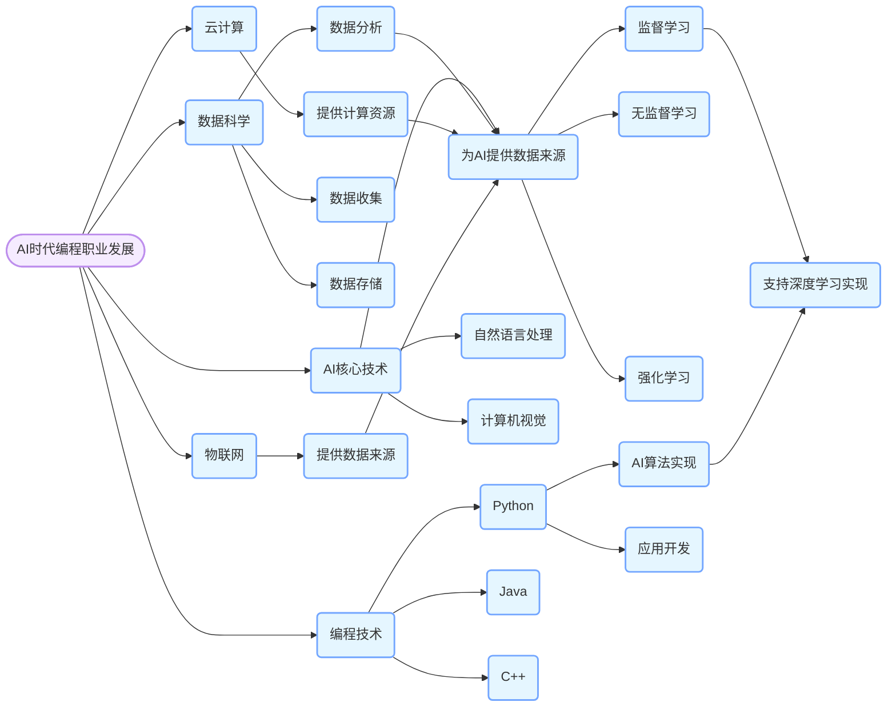

# AI时代的编程职业发展与创新战略分析

> 关键词：AI时代、编程职业发展、创新战略、人工智能、软件开发

> 摘要：本文聚焦于AI时代编程职业的发展与创新战略。在AI技术迅猛发展的当下，编程职业面临着前所未有的机遇与挑战。文章深入探讨编程职业在AI时代的发展趋势，剖析其核心概念与联系，详细阐述相关算法原理及操作步骤，结合数学模型与公式进行理论支持，通过项目实战案例加深理解，介绍实际应用场景，推荐学习资源、开发工具和相关论文著作。最后总结未来发展趋势与挑战，为编程从业者和相关研究者提供全面且深入的参考，助力其在AI时代把握编程职业发展方向，制定有效的创新战略。

## 1. 背景介绍 
### 1.1 目的和范围
本文章旨在全面分析AI时代编程职业的发展现状、趋势以及创新战略。范围涵盖编程职业的各个方面，包括但不限于编程语言的演变、编程技能的需求变化、编程职业的就业前景、创新战略的制定与实施等。通过对这些内容的研究，为编程从业者、相关企业以及教育机构提供有价值的参考，帮助他们更好地适应AI时代的发展。

### 1.2 预期读者
本文预期读者包括编程从业者，如软件工程师、程序员、数据分析师等，他们可以从中了解AI时代编程职业的发展动态，为自身职业发展规划提供指导；相关企业的管理者和决策者，有助于他们制定合理的人才战略和创新发展计划；教育机构的教师和研究人员，可参考本文调整教学内容和研究方向，培养适应AI时代需求的编程人才。

### 1.3 文档结构概述
本文首先介绍背景信息，包括目的、预期读者和文档结构概述。接着阐述核心概念与联系，包括AI、编程等核心概念的原理和架构。然后详细讲解核心算法原理和具体操作步骤，并给出数学模型和公式进行理论支持。通过项目实战案例，展示代码实现和详细解读。介绍实际应用场景，为编程职业的发展提供实践依据。推荐相关的学习资源、开发工具和论文著作。最后总结未来发展趋势与挑战，解答常见问题，并提供扩展阅读和参考资料。

### 1.4 术语表
#### 1.4.1 核心术语定义
- **AI（Artificial Intelligence）**：即人工智能，是指计算机系统能够执行通常需要人类智能才能完成的任务，如学习、推理、解决问题、感知等。
- **编程（Programming）**：是指使用特定的编程语言，按照一定的规则和逻辑，编写计算机程序的过程，目的是让计算机执行特定的任务。
- **机器学习（Machine Learning）**：是AI的一个重要分支，它使计算机能够从数据中学习模式和规律，而无需明确的编程指令。
- **深度学习（Deep Learning）**：是机器学习的一个子领域，基于人工神经网络，通过多层神经元对数据进行特征提取和学习，在图像识别、语音识别等领域取得了显著成果。

#### 1.4.2 相关概念解释
- **数据科学（Data Science）**：涉及数据的收集、存储、分析和解释，结合了数学、统计学、计算机科学等多学科知识，旨在从数据中提取有价值的信息。
- **云计算（Cloud Computing）**：通过互联网提供计算资源，如服务器、存储、软件等，用户可以按需使用这些资源，无需自行搭建和维护硬件设施。
- **物联网（Internet of Things，IoT）**：将各种物理设备通过网络连接起来，实现设备之间的通信和数据交换，为AI和编程提供了丰富的数据来源。

#### 1.4.3 缩略词列表
- **AI**：Artificial Intelligence（人工智能）
- **ML**：Machine Learning（机器学习）
- **DL**：Deep Learning（深度学习）
- **IoT**：Internet of Things（物联网）
- **API**：Application Programming Interface（应用程序编程接口）

## 2. 核心概念与联系 
### 2.1 AI的核心原理
AI的核心原理基于对人类智能的模拟和实现。它通过对大量数据的学习和分析，发现数据中的模式和规律，从而实现智能决策和预测。主要的AI技术包括机器学习、深度学习、自然语言处理、计算机视觉等。

机器学习是AI的基础，它通过算法让计算机从数据中自动学习模型。常见的机器学习算法包括监督学习、无监督学习和强化学习。监督学习使用有标签的数据进行训练，通过学习输入和输出之间的映射关系，对新的数据进行预测；无监督学习处理无标签的数据，主要用于数据聚类和降维；强化学习通过智能体与环境的交互，学习最优的行为策略。

深度学习是机器学习的一个重要分支，它基于多层神经网络，能够自动提取数据的高层特征。深度学习在图像识别、语音识别、自然语言处理等领域取得了巨大的成功。例如，卷积神经网络（Convolutional Neural Network，CNN）在图像识别中表现出色，循环神经网络（Recurrent Neural Network，RNN）及其变体（如LSTM、GRU）在处理序列数据（如文本）方面具有优势。

自然语言处理（Natural Language Processing，NLP）致力于让计算机理解和处理人类语言。它包括文本分类、情感分析、机器翻译、问答系统等任务。NLP技术通常结合深度学习和传统的语言模型，如词嵌入、注意力机制等。

计算机视觉（Computer Vision）旨在让计算机理解和处理图像和视频数据。它包括图像分类、目标检测、图像分割、人脸识别等任务。计算机视觉技术也广泛应用深度学习算法，如CNN、Faster R - CNN、Mask R - CNN等。

### 2.2 编程与AI的联系
编程是实现AI的重要手段。AI算法和模型需要通过编程语言来实现和运行。常见的用于AI开发的编程语言包括Python、Java、C++等。

Python是AI领域最受欢迎的编程语言之一，它具有简洁易读的语法，丰富的科学计算和机器学习库，如NumPy、Pandas、Scikit - learn、TensorFlow、PyTorch等。这些库提供了各种数据处理、模型训练和评估的工具，大大提高了AI开发的效率。

Java具有强大的跨平台性和企业级应用开发能力，在AI的一些应用场景中也有广泛的应用，如大数据处理、分布式计算等。C++则以其高效的性能，在一些对计算速度要求较高的AI应用中发挥着重要作用，如计算机视觉中的底层算法实现。

编程不仅用于实现AI算法，还用于开发AI应用的前端界面、后端服务和数据管理系统。通过编程，可以将AI模型集成到实际的应用中，为用户提供智能服务。

### 2.3 核心概念架构的文本示意图
AI时代的编程职业发展涉及多个核心概念，它们之间相互关联、相互影响。以下是一个简单的文本示意图：

AI（人工智能）
|-- 机器学习（监督学习、无监督学习、强化学习）
|   |-- 深度学习（卷积神经网络、循环神经网络等）
|-- 自然语言处理
|-- 计算机视觉

编程（Python、Java、C++等）
|-- AI算法实现
|-- 应用开发（前端、后端、数据管理）

数据科学（数据收集、存储、分析）
|-- 为AI提供数据支持

云计算（提供计算资源）
|-- 支持AI和编程的大规模计算

物联网（提供数据来源）
|-- 与AI和编程结合实现智能应用

### 2.4 Mermaid流程图


## 3. 核心算法原理 & 具体操作步骤 
### 3.1 监督学习算法原理及Python实现
#### 3.1.1 线性回归算法原理
线性回归是一种简单而常用的监督学习算法，用于预测连续值的输出。它的基本思想是通过找到一条直线（或超平面），使得数据点到该直线（或超平面）的距离之和最小。线性回归的数学模型可以表示为：

$$y = \theta_0 + \theta_1x_1 + \theta_2x_2 + \cdots + \theta_nx_n + \epsilon$$

其中，$y$ 是输出变量，$x_1, x_2, \cdots, x_n$ 是输入变量，$\theta_0, \theta_1, \cdots, \theta_n$ 是模型的参数，$\epsilon$ 是误差项。

#### 3.1.2 线性回归的Python实现
```python
import numpy as np
from sklearn.linear_model import LinearRegression
from sklearn.model_selection import train_test_split
from sklearn.metrics import mean_squared_error

# 生成示例数据
np.random.seed(0)
X = 2 * np.random.rand(100, 1)
y = 4 + 3 * X + np.random.randn(100, 1)

# 划分训练集和测试集
X_train, X_test, y_train, y_test = train_test_split(X, y, test_size=0.2, random_state=42)

# 创建线性回归模型
model = LinearRegression()

# 训练模型
model.fit(X_train, y_train)

# 预测
y_pred = model.predict(X_test)

# 计算均方误差
mse = mean_squared_error(y_test, y_pred)
print(f"均方误差: {mse}")
```
#### 3.1.3 代码解释
1. **数据生成**：使用 `np.random.rand` 生成随机输入数据 `X`，并根据线性关系生成对应的输出数据 `y`，同时添加了一些随机噪声。
2. **数据划分**：使用 `train_test_split` 函数将数据划分为训练集和测试集，其中测试集占比为 20%。
3. **模型创建**：使用 `LinearRegression` 类创建线性回归模型。
4. **模型训练**：使用 `fit` 方法对模型进行训练，即找到最优的参数 $\theta$。
5. **预测**：使用训练好的模型对测试集进行预测，得到预测结果 `y_pred`。
6. **评估**：使用 `mean_squared_error` 函数计算预测结果与真实值之间的均方误差，评估模型的性能。

### 3.2 无监督学习算法原理及Python实现
#### 3.2.1 K - 均值聚类算法原理
K - 均值聚类是一种常用的无监督学习算法，用于将数据点划分为 $K$ 个不同的簇。它的基本思想是通过迭代的方式，不断更新簇的中心，使得每个数据点到其所属簇中心的距离之和最小。

K - 均值聚类的具体步骤如下：
1. 随机选择 $K$ 个数据点作为初始簇中心。
2. 将每个数据点分配到距离最近的簇中心所在的簇。
3. 重新计算每个簇的中心。
4. 重复步骤 2 和 3，直到簇中心不再变化或达到最大迭代次数。

#### 3.2.2 K - 均值聚类的Python实现
```python
import numpy as np
from sklearn.cluster import KMeans
from sklearn.datasets import make_blobs
import matplotlib.pyplot as plt

# 生成示例数据
X, _ = make_blobs(n_samples=300, centers=4, cluster_std=0.60, random_state=0)

# 创建K - 均值聚类模型
kmeans = KMeans(n_clusters=4, random_state=42)

# 训练模型
kmeans.fit(X)

# 获取聚类标签
labels = kmeans.labels_

# 获取簇中心
centroids = kmeans.cluster_centers_

# 可视化结果
plt.scatter(X[:, 0], X[:, 1], c=labels, s=50, cmap='viridis')
plt.scatter(centroids[:, 0], centroids[:, 1], c='red', s=200, alpha=0.5)
plt.show()
```
#### 3.2.3 代码解释
1. **数据生成**：使用 `make_blobs` 函数生成具有 4 个中心的示例数据。
2. **模型创建**：使用 `KMeans` 类创建 K - 均值聚类模型，指定簇的数量为 4。
3. **模型训练**：使用 `fit` 方法对模型进行训练，得到聚类结果。
4. **获取结果**：使用 `labels_` 属性获取每个数据点的聚类标签，使用 `cluster_centers_` 属性获取每个簇的中心。
5. **可视化**：使用 `matplotlib` 库将数据点和簇中心可视化，不同簇的数据点用不同颜色表示。

### 3.3 强化学习算法原理及Python实现
#### 3.3.1 Q - 学习算法原理
Q - 学习是一种基于值函数的强化学习算法，用于在马尔可夫决策过程（MDP）中学习最优策略。它通过不断更新 Q 值（状态 - 动作值）来逼近最优策略。

Q - 学习的更新公式为：

$$Q(s_t, a_t) \leftarrow Q(s_t, a_t) + \alpha [r_{t + 1} + \gamma \max_{a} Q(s_{t + 1}, a) - Q(s_t, a_t)]$$

其中，$Q(s_t, a_t)$ 是在状态 $s_t$ 下采取动作 $a_t$ 的 Q 值，$\alpha$ 是学习率，$r_{t + 1}$ 是采取动作 $a_t$ 后获得的奖励，$\gamma$ 是折扣因子，$s_{t + 1}$ 是下一个状态。

#### 3.3.2 Q - 学习的Python实现
```python
import numpy as np

# 定义环境
num_states = 5
num_actions = 2
reward_matrix = np.array([[0, 1], [0, 1], [0, 1], [0, 1], [0, 10]])

# 初始化Q表
Q = np.zeros((num_states, num_actions))

# 超参数
alpha = 0.1  # 学习率
gamma = 0.9  # 折扣因子
num_episodes = 1000

# Q - 学习算法
for episode in range(num_episodes):
    state = 0
    done = False
    while not done:
        # 选择动作
        action = np.argmax(Q[state, :])
        
        # 获取奖励
        reward = reward_matrix[state, action]
        
        # 转移到下一个状态
        if action == 0:
            next_state = max(0, state - 1)
        else:
            next_state = min(num_states - 1, state + 1)
        
        # 更新Q表
        Q[state, action] = Q[state, action] + alpha * (reward + gamma * np.max(Q[next_state, :]) - Q[state, action])
        
        # 判断是否结束
        if state == num_states - 1:
            done = True
        state = next_state

print("最终Q表:")
print(Q)
```
#### 3.3.3 代码解释
1. **环境定义**：定义了状态数量、动作数量和奖励矩阵。
2. **Q表初始化**：初始化 Q 表为全零矩阵。
3. **超参数设置**：设置学习率 $\alpha$、折扣因子 $\gamma$ 和训练回合数。
4. **Q - 学习算法**：在每个回合中，从初始状态开始，选择动作，获取奖励，转移到下一个状态，更新 Q 表，直到达到终止状态。
5. **结果输出**：输出最终的 Q 表。

## 4. 数学模型和公式 & 详细讲解 & 举例说明 
### 4.1 线性回归的数学模型和公式
#### 4.1.1 最小二乘法原理
线性回归的目标是找到最优的参数 $\theta$，使得预测值与真实值之间的误差最小。常用的方法是最小二乘法，即最小化误差的平方和。

误差平方和的表达式为：

$$J(\theta) = \frac{1}{2m} \sum_{i = 1}^{m} (h_{\theta}(x^{(i)}) - y^{(i)})^2$$

其中，$m$ 是样本数量，$h_{\theta}(x^{(i)})$ 是第 $i$ 个样本的预测值，$y^{(i)}$ 是第 $i$ 个样本的真实值。

为了找到使 $J(\theta)$ 最小的 $\theta$，可以对 $J(\theta)$ 求偏导数，并令其等于零。对于简单线性回归（只有一个输入变量），$\theta$ 的最优解可以通过以下公式计算：

$$\theta_1 = \frac{\sum_{i = 1}^{m} (x^{(i)} - \bar{x})(y^{(i)} - \bar{y})}{\sum_{i = 1}^{m} (x^{(i)} - \bar{x})^2}$$

$$\theta_0 = \bar{y} - \theta_1\bar{x}$$

其中，$\bar{x}$ 和 $\bar{y}$ 分别是输入变量和输出变量的均值。

#### 4.1.2 举例说明
假设有以下样本数据：

| $x$ | $y$ |
|---|---|
| 1 | 2 |
| 2 | 4 |
| 3 | 6 |
| 4 | 8 |

首先计算均值：

$\bar{x} = \frac{1 + 2 + 3 + 4}{4} = 2.5$

$\bar{y} = \frac{2 + 4 + 6 + 8}{4} = 5$

然后计算分子和分母：

分子：$\sum_{i = 1}^{4} (x^{(i)} - \bar{x})(y^{(i)} - \bar{y}) = (1 - 2.5)(2 - 5) + (2 - 2.5)(4 - 5) + (3 - 2.5)(6 - 5) + (4 - 2.5)(8 - 5) = 10$

分母：$\sum_{i = 1}^{4} (x^{(i)} - \bar{x})^2 = (1 - 2.5)^2 + (2 - 2.5)^2 + (3 - 2.5)^2 + (4 - 2.5)^2 = 5$

则 $\theta_1 = \frac{10}{5} = 2$

$\theta_0 = 5 - 2 \times 2.5 = 0$

所以线性回归方程为 $y = 2x$。

### 4.2 K - 均值聚类的数学模型和公式
#### 4.2.1 目标函数
K - 均值聚类的目标是最小化每个数据点到其所属簇中心的距离之和。目标函数可以表示为：

$$J = \sum_{k = 1}^{K} \sum_{x_i \in C_k} \| x_i - \mu_k \|^2$$

其中，$K$ 是簇的数量，$C_k$ 是第 $k$ 个簇，$x_i$ 是第 $i$ 个数据点，$\mu_k$ 是第 $k$ 个簇的中心。

#### 4.2.2 簇中心更新公式
在每次迭代中，簇中心的更新公式为：

$$\mu_k = \frac{1}{|C_k|} \sum_{x_i \in C_k} x_i$$

其中，$|C_k|$ 是第 $k$ 个簇的样本数量。

#### 4.2.3 举例说明
假设有以下数据点：

$x_1 = [1, 2]$，$x_2 = [2, 3]$，$x_3 = [8, 9]$，$x_4 = [9, 10]$

假设初始簇中心为：

$\mu_1 = [1, 2]$，$\mu_2 = [8, 9]$

第一次迭代：
- 计算每个数据点到簇中心的距离，将 $x_1$ 和 $x_2$ 分配到 $\mu_1$ 所在的簇，将 $x_3$ 和 $x_4$ 分配到 $\mu_2$ 所在的簇。
- 更新簇中心：

$\mu_1 = \frac{[1, 2] + [2, 3]}{2} = [1.5, 2.5]$

$\mu_2 = \frac{[8, 9] + [9, 10]}{2} = [8.5, 9.5]$

继续迭代，直到簇中心不再变化。

### 4.3 Q - 学习的数学模型和公式
#### 4.3.1 贝尔曼方程
Q - 学习基于贝尔曼方程，它描述了最优 Q 值的递归关系：

$$Q^*(s, a) = \mathbb{E} [r + \gamma \max_{a'} Q^*(s', a') | s, a]$$

其中，$Q^*(s, a)$ 是最优 Q 值，$r$ 是奖励，$\gamma$ 是折扣因子，$s'$ 是下一个状态。

#### 4.3.2 Q - 学习更新公式的推导
Q - 学习的更新公式是通过对贝尔曼方程的近似得到的。在每个时间步，使用当前的 Q 值来估计最优 Q 值，并根据实际的奖励和下一个状态的最大 Q 值进行更新。

$$Q(s_t, a_t) \leftarrow Q(s_t, a_t) + \alpha [r_{t + 1} + \gamma \max_{a} Q(s_{t + 1}, a) - Q(s_t, a_t)]$$

#### 4.3.3 举例说明
假设有一个简单的环境，状态空间 $S = \{s_1, s_2\}$，动作空间 $A = \{a_1, a_2\}$，奖励矩阵如下：

| 状态 | 动作 $a_1$ | 动作 $a_2$ |
|---|---|---|
| $s_1$ | 0 | 1 |
| $s_2$ | 0 | 10 |

初始 Q 表为：

$$Q = \begin{bmatrix} 0 & 0 \\ 0 & 0 \end{bmatrix}$$

假设当前状态 $s_t = s_1$，选择动作 $a_t = a_2$，获得奖励 $r_{t + 1} = 1$，转移到下一个状态 $s_{t + 1} = s_2$。

根据 Q - 学习更新公式，假设 $\alpha = 0.1$，$\gamma = 0.9$：

$Q(s_1, a_2) = Q(s_1, a_2) + \alpha [r_{t + 1} + \gamma \max_{a} Q(s_2, a) - Q(s_1, a_2)]$

$= 0 + 0.1 [1 + 0.9 \times \max(0, 0) - 0] = 0.1$

更新后的 Q 表为：

$$Q = \begin{bmatrix} 0 & 0.1 \\ 0 & 0 \end{bmatrix}$$

## 5. 项目实战：代码实际案例和详细解释说明 
### 5.1  开发环境搭建
#### 5.1.1 安装Python
首先，需要安装 Python 环境。可以从 Python 官方网站（https://www.python.org/downloads/） 下载适合自己操作系统的 Python 安装包，并按照安装向导进行安装。建议安装 Python 3.6 及以上版本。

#### 5.1.2 安装必要的库
在安装好 Python 后，需要安装一些必要的库，如 NumPy、Pandas、Scikit - learn、TensorFlow、PyTorch 等。可以使用 `pip` 命令进行安装：

```sh
pip install numpy pandas scikit-learn tensorflow torch matplotlib
```

#### 5.1.3 选择开发工具
可以选择适合自己的开发工具，如 PyCharm、Jupyter Notebook 等。PyCharm 是一个功能强大的 Python 集成开发环境，提供了代码编辑、调试、版本控制等功能；Jupyter Notebook 则是一个交互式的开发环境，适合进行数据探索和模型实验。

### 5.2  源代码详细实现和代码解读
#### 5.2.1 项目背景
本项目将实现一个简单的手写数字识别系统，使用深度学习算法（卷积神经网络）对 MNIST 数据集进行训练和预测。

#### 5.2.2 代码实现
```python
import tensorflow as tf
from tensorflow.keras.datasets import mnist
from tensorflow.keras.models import Sequential
from tensorflow.keras.layers import Conv2D, MaxPooling2D, Flatten, Dense
from tensorflow.keras.utils import to_categorical
import matplotlib.pyplot as plt

# 加载MNIST数据集
(train_images, train_labels), (test_images, test_labels) = mnist.load_data()

# 数据预处理
train_images = train_images.reshape((60000, 28, 28, 1)).astype('float32') / 255
test_images = test_images.reshape((10000, 28, 28, 1)).astype('float32') / 255

train_labels = to_categorical(train_labels)
test_labels = to_categorical(test_labels)

# 构建卷积神经网络模型
model = Sequential([
    Conv2D(32, (3, 3), activation='relu', input_shape=(28, 28, 1)),
    MaxPooling2D((2, 2)),
    Conv2D(64, (3, 3), activation='relu'),
    MaxPooling2D((2, 2)),
    Flatten(),
    Dense(64, activation='relu'),
    Dense(10, activation='softmax')
])

# 编译模型
model.compile(optimizer='adam',
              loss='categorical_crossentropy',
              metrics=['accuracy'])

# 训练模型
history = model.fit(train_images, train_labels, epochs=5, batch_size=64)

# 评估模型
test_loss, test_acc = model.evaluate(test_images, test_labels)
print(f"测试集损失: {test_loss}, 测试集准确率: {test_acc}")

# 可视化训练过程
plt.plot(history.history['accuracy'])
plt.title('Model accuracy')
plt.ylabel('Accuracy')
plt.xlabel('Epoch')
plt.legend(['Train'], loc='upper left')
plt.show()

plt.plot(history.history['loss'])
plt.title('Model loss')
plt.ylabel('Loss')
plt.xlabel('Epoch')
plt.legend(['Train'], loc='upper left')
plt.show()
```
#### 5.2.3 代码解读
1. **数据加载**：使用 `mnist.load_data()` 函数加载 MNIST 数据集，该数据集包含 60000 个训练样本和 10000 个测试样本。
2. **数据预处理**：将图像数据的形状调整为 `(样本数量, 高度, 宽度, 通道数)`，并将像素值归一化到 0 到 1 之间。将标签数据进行 one - hot 编码。
3. **模型构建**：使用 `Sequential` 模型构建卷积神经网络。包含卷积层、池化层、全连接层等。卷积层用于提取图像特征，池化层用于降低特征图的维度，全连接层用于分类。
4. **模型编译**：选择优化器（如 `adam`）、损失函数（如 `categorical_crossentropy`）和评估指标（如 `accuracy`）。
5. **模型训练**：使用 `fit` 方法对模型进行训练，指定训练数据、训练轮数和批次大小。
6. **模型评估**：使用 `evaluate` 方法对模型在测试集上的性能进行评估，得到测试集的损失和准确率。
7. **可视化**：使用 `matplotlib` 库将训练过程中的准确率和损失进行可视化。

### 5.3  代码解读与分析
#### 5.3.1 卷积层的作用
卷积层是卷积神经网络的核心组件，它通过卷积核在输入图像上滑动，提取图像的局部特征。卷积核的大小、数量和步长等参数会影响特征提取的效果。在本项目中，第一个卷积层使用 32 个大小为 3x3 的卷积核，激活函数为 `relu`，可以有效地提取图像的边缘、纹理等特征。

#### 5.3.2 池化层的作用
池化层用于降低特征图的维度，减少计算量，同时增强模型的鲁棒性。常用的池化方法有最大池化和平均池化。在本项目中，使用最大池化层，池化窗口大小为 2x2，可以保留特征图中的重要信息。

#### 5.3.3 全连接层的作用
全连接层将卷积层和池化层提取的特征进行整合，用于分类任务。在本项目中，最后一个全连接层使用 `softmax` 激活函数，输出 10 个类别的概率分布，对应 0 到 9 这 10 个数字。

#### 5.3.4 损失函数和优化器的选择
损失函数用于衡量模型预测结果与真实标签之间的差异。在分类任务中，常用的损失函数是交叉熵损失函数。优化器用于更新模型的参数，使损失函数最小化。在本项目中，选择 `adam` 优化器，它结合了 AdaGrad 和 RMSProp 的优点，具有较好的收敛性能。

## 6. 实际应用场景 
### 6.1 金融领域
在金融领域，编程和 AI 技术被广泛应用于风险评估、信用评分、投资决策等方面。例如，银行可以使用机器学习算法对客户的信用数据进行分析，预测客户的违约风险，从而制定合理的信贷政策。投资机构可以使用深度学习算法对股票市场数据进行分析，预测股票价格的走势，辅助投资决策。

### 6.2 医疗领域
医疗领域是 AI 技术应用的热点领域之一。编程和 AI 技术可以用于疾病诊断、医学影像分析、药物研发等方面。例如，使用深度学习算法对医学影像（如 X 光、CT 等）进行分析，帮助医生快速准确地诊断疾病。在药物研发方面，AI 技术可以加速药物筛选和靶点发现的过程。

### 6.3 交通领域
交通领域的自动驾驶技术是 AI 技术的重要应用方向之一。编程和 AI 技术可以用于车辆的感知、决策和控制。例如，使用计算机视觉技术对道路、交通标志和其他车辆进行识别，使用机器学习算法进行路径规划和决策，实现自动驾驶功能。此外，智能交通系统也可以使用 AI 技术对交通流量进行预测和优化，提高交通效率。

### 6.4 教育领域
在教育领域，编程和 AI 技术可以用于个性化学习、智能辅导、教育评估等方面。例如，使用机器学习算法对学生的学习数据进行分析，了解学生的学习习惯和能力，为学生提供个性化的学习建议和学习资源。智能辅导系统可以使用自然语言处理技术与学生进行交互，解答学生的问题，提供实时的辅导。

### 6.5 娱乐领域
娱乐领域的游戏开发、影视制作等都离不开编程和 AI 技术。在游戏开发中，AI 技术可以用于实现游戏角色的智能行为，提高游戏的趣味性和挑战性。在影视制作中，计算机视觉和深度学习技术可以用于特效制作、图像合成等方面，提升影视作品的视觉效果。

## 7. 工具和资源推荐
### 7.1 学习资源推荐
#### 7.1.1 书籍推荐
- 《Python 机器学习》：介绍了使用 Python 进行机器学习的基本原理和实践方法，涵盖了各种机器学习算法和工具。
- 《深度学习》：由深度学习领域的三位先驱 Ian Goodfellow、Yoshua Bengio 和 Aaron Courville 撰写，是深度学习领域的经典教材。
- 《人工智能：一种现代的方法》：全面介绍了人工智能的各个方面，包括搜索算法、知识表示、机器学习、自然语言处理等。

#### 7.1.2 在线课程
- Coursera 上的《机器学习》课程：由 Andrew Ng 教授授课，是机器学习领域的经典课程，适合初学者入门。
- edX 上的《深度学习微硕士项目》：提供了深度学习的系统学习路径，包括多个课程和实践项目。
- 哔哩哔哩上的一些编程和 AI 相关的视频教程，如“莫烦 Python”系列，讲解清晰，适合初学者。

#### 7.1.3 技术博客和网站
- Medium：上面有很多关于编程、AI 等领域的优秀文章，作者来自世界各地。
- 机器之心：专注于人工智能领域的资讯和技术文章，提供了很多前沿的研究成果和应用案例。
- 开源中国：提供了丰富的编程技术文章和开源项目信息。

### 7.2 开发工具框架推荐
#### 7.2.1 IDE和编辑器
- PyCharm：功能强大的 Python 集成开发环境，提供了代码编辑、调试、版本控制等功能。
- Jupyter Notebook：交互式的开发环境，适合进行数据探索和模型实验。
- Visual Studio Code：轻量级的代码编辑器，支持多种编程语言，有丰富的插件扩展。

#### 7.2.2 调试和性能分析工具
- TensorBoard：TensorFlow 提供的可视化工具，可以用于可视化模型的训练过程、网络结构等。
- Py-Spy：用于分析 Python 程序的性能，找出性能瓶颈。
- cProfile：Python 内置的性能分析工具，可以统计函数的调用次数和执行时间。

#### 7.2.3 相关框架和库
- TensorFlow：Google 开发的开源深度学习框架，提供了丰富的工具和接口，支持分布式训练。
- PyTorch：Facebook 开发的开源深度学习框架，具有动态图的优势，适合快速迭代和研究。
- Scikit - learn：用于机器学习的 Python 库，提供了各种机器学习算法和工具，如分类、回归、聚类等。

### 7.3 相关论文著作推荐
#### 7.3.1 经典论文
- 《Gradient - Based Learning Applied to Document Recognition》：介绍了卷积神经网络在手写数字识别中的应用，是卷积神经网络的经典论文。
- 《Playing Atari with Deep Reinforcement Learning》：提出了使用深度强化学习玩 Atari 游戏的方法，开创了深度强化学习的先河。
- 《Attention Is All You Need》：提出了 Transformer 架构，在自然语言处理领域取得了巨大的成功。

#### 7.3.2 最新研究成果
- arXiv 上的相关论文：arXiv 是一个预印本平台，提供了很多最新的 AI 研究成果。
- 各大顶级学术会议（如 NeurIPS、ICML、CVPR 等）的论文：这些会议收录了 AI 领域的最新研究进展。

#### 7.3.3 应用案例分析
- 《AI in Practice: How 50 Successful Companies Used Artificial Intelligence to Solve Problems》：介绍了 50 个成功的 AI 应用案例，分析了不同行业中 AI 的应用方法和效果。
- 《Deep Learning in Medical Imaging: A Comprehensive Review》：对深度学习在医学影像领域的应用进行了全面的综述和分析。

## 8. 总结：未来发展趋势与挑战
### 8.1 未来发展趋势
#### 8.1.1 AI与编程的深度融合
未来，AI 技术将更加深入地融入编程领域。例如，自动代码生成工具将变得更加智能，能够根据用户的需求自动生成高质量的代码。编程辅助工具将利用 AI 技术提供更智能的代码提示、错误检测和修复建议。

#### 8.1.2 跨学科应用的增长
编程和 AI 技术将在更多的跨学科领域得到应用。例如，生物信息学领域将结合编程和 AI 技术进行基因序列分析和疾病预测；环境科学领域将利用 AI 技术对气候变化进行模拟和预测。

#### 8.1.3 边缘计算与 AI 的结合
随着物联网设备的普及，边缘计算与 AI 的结合将成为未来的发展趋势。边缘设备将具备一定的 AI 计算能力，能够在本地进行数据处理和分析，减少数据传输延迟，提高系统的响应速度和安全性。

#### 8.1.4 量子计算对编程和 AI 的影响
量子计算技术的发展可能会对编程和 AI 领域产生深远的影响。量子算法可能会在某些问题上比传统算法具有指数级的加速，从而推动 AI 技术的进一步发展。

### 8.2 挑战
#### 8.2.1 数据隐私和安全问题
随着 AI 技术的发展，数据的重要性日益凸显。然而，数据隐私和安全问题也成为了一个严峻的挑战。如何保护用户的数据隐私，防止数据泄露和滥用，是需要解决的关键问题。

#### 8.2.2 算法偏见和可解释性问题
AI 算法可能存在偏见，导致不公平的决策。例如，在招聘、贷款审批等领域，AI 算法可能会对某些群体产生歧视。此外，深度学习等复杂算法的可解释性较差，难以理解算法的决策过程，这也限制了 AI 技术在一些关键领域的应用。

#### 8.2.3 人才短缺问题
AI 时代对编程人才的需求不断增加，然而，目前相关领域的人才短缺问题较为严重。培养具备编程、数学、统计学等多学科知识的 AI 人才需要时间和资源，如何解决人才短缺问题是推动 AI 技术发展的关键。

#### 8.2.4 伦理和法律问题
AI 技术的发展带来了一系列伦理和法律问题。例如，自动驾驶汽车在发生事故时的责任认定问题，AI 创作的作品的版权归属问题等。如何制定相应的伦理准则和法律法规，规范 AI 技术的发展和应用，是亟待解决的问题。

## 9. 附录：常见问题与解答
### 9.1 编程职业在 AI 时代需要掌握哪些新技能？
在 AI 时代，编程职业需要掌握一些新技能，如机器学习、深度学习、数据科学等。此外，还需要了解相关的数学知识，如线性代数、概率论、统计学等。同时，掌握一些流行的编程语言和工具，如 Python、TensorFlow、PyTorch 等也是必要的。

### 9.2 如何选择适合自己的 AI 学习资源？
选择适合自己的 AI 学习资源需要考虑自己的学习目标、基础水平和学习风格。如果是初学者，可以选择一些入门级的书籍和在线课程，如《Python 机器学习》、Coursera 上的《机器学习》课程等。如果已经有一定的基础，可以选择一些深入的研究论文和专业书籍，如《深度学习》等。此外，还可以参考技术博客和论坛上的推荐，选择适合自己的学习资源。

### 9.3 AI 技术会取代编程职业吗？
AI 技术不会取代编程职业，而是会与编程职业相互融合和促进。虽然 AI 技术可以自动生成一些代码，但复杂的软件系统开发仍然需要编程人员的专业知识和经验。此外，编程人员可以利用 AI 技术提高开发效率，开发出更加智能的软件系统。因此，编程职业在 AI 时代仍然具有重要的价值。

### 9.4 如何解决 AI 算法的偏见问题？
解决 AI 算法的偏见问题需要从多个方面入手。首先，在数据收集阶段，要确保数据的多样性和代表性，避免数据偏差。其次，在算法设计阶段，要对算法进行评估和优化，检测和消除算法中的偏见。此外，还可以引入外部的监督和审核机制，对 AI 系统的决策过程进行监督和评估。

## 10. 扩展阅读 & 参考资料
### 10.1 扩展阅读
- 《AI 未来进行式》：李开复和王咏刚所著，探讨了 AI 技术对未来社会的影响和挑战。
- 《智能时代》：吴军所著，介绍了智能时代的发展趋势和技术应用。
- 《人类简史：从动物到上帝》：尤瓦尔·赫拉利所著，从人类发展的角度探讨了技术对人类社会的影响。

### 10.2 参考资料
- Python 官方文档：https://docs.python.org/
- TensorFlow 官方文档：https://www.tensorflow.org/
- PyTorch 官方文档：https://pytorch.org/
- Scikit - learn 官方文档：https://scikit-learn.org/
- 相关学术会议论文集和期刊文章。