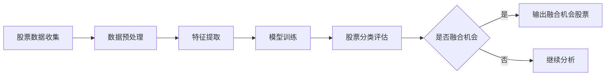

# AI智能体在识别价值股与成长股融合机会中的作用

> 关键词：AI智能体、价值股、成长股、融合机会、股票识别、金融科技、数据分析

> 摘要：本文旨在深入探讨AI智能体在识别价值股与成长股融合机会中的重要作用。首先介绍了相关的背景知识，包括目的范围、预期读者等内容。接着阐述了核心概念，如价值股、成长股以及AI智能体的原理和架构。通过详细的算法原理、数学模型和公式说明，展示了AI智能体如何对数据进行分析和处理以发现融合机会。在项目实战部分，给出了具体的代码实现和解读。然后分析了实际应用场景，推荐了相关的工具和资源。最后总结了未来发展趋势与挑战，并提供了常见问题解答和扩展阅读参考资料。通过全面的分析，揭示了AI智能体在金融投资领域助力发现价值股与成长股融合机会的巨大潜力和重要意义。

## 1. 背景介绍 
### 1.1 目的和范围
在金融投资领域，价值股和成长股是两种重要的股票类型。价值股通常具有较低的市盈率、市净率等估值指标，公司具有稳定的现金流和股息分配，被认为是相对稳健的投资选择。成长股则以其较高的盈利增长潜力为特点，公司往往处于快速发展阶段，股价可能会因未来的增长预期而大幅上涨。然而，在实际市场中，存在一些股票兼具价值股和成长股的特征，即价值股与成长股的融合机会。

本文章的目的在于研究AI智能体如何帮助投资者识别这些融合机会。范围涵盖了从AI智能体的基本原理、算法实现，到实际应用案例的分析，以及相关工具和资源的推荐。通过对这些方面的探讨，为投资者和金融从业者提供全面的指导，使其能够更好地利用AI智能体在股票投资中把握价值股与成长股的融合机会。

### 1.2 预期读者
本文预期读者主要包括以下几类人群：
- **投资者**：无论是个人投资者还是机构投资者，都希望在股票市场中获得更高的收益。了解AI智能体在识别价值股与成长股融合机会中的作用，可以帮助他们优化投资策略，提高投资决策的准确性。
- **金融从业者**：如金融分析师、基金经理等，他们需要对市场进行深入研究和分析。AI智能体的应用可以为他们提供新的分析工具和思路，提升工作效率和研究质量。
- **技术人员**：对人工智能和金融科技领域感兴趣的程序员、数据科学家等。本文详细的算法原理和代码实现部分，可以为他们提供技术参考，促进相关技术的应用和创新。
- **学者和研究人员**：从事金融、人工智能等领域研究的学者，通过阅读本文可以了解最新的研究动态和应用案例，为进一步的学术研究提供参考。

### 1.3 文档结构概述
本文将按照以下结构进行组织：
- **核心概念与联系**：介绍价值股、成长股和AI智能体的核心概念，以及它们之间的联系，并通过文本示意图和Mermaid流程图进行说明。
- **核心算法原理 & 具体操作步骤**：详细讲解AI智能体识别价值股与成长股融合机会的算法原理，并使用Python源代码进行阐述。
- **数学模型和公式 & 详细讲解 & 举例说明**：给出相关的数学模型和公式，对其进行详细讲解，并通过具体例子说明其应用。
- **项目实战：代码实际案例和详细解释说明**：介绍开发环境搭建，给出具体的源代码实现和代码解读，分析代码的功能和逻辑。
- **实际应用场景**：分析AI智能体在识别价值股与成长股融合机会中的实际应用场景，以及带来的优势和挑战。
- **工具和资源推荐**：推荐学习资源、开发工具框架和相关论文著作，帮助读者进一步深入学习和研究。
- **总结：未来发展趋势与挑战**：总结AI智能体在该领域的未来发展趋势，分析面临的挑战和应对策略。
- **附录：常见问题与解答**：解答读者在阅读和实践过程中可能遇到的常见问题。
- **扩展阅读 & 参考资料**：提供相关的扩展阅读材料和参考资料，方便读者进一步探索。

### 1.4 术语表
#### 1.4.1 核心术语定义
- **价值股**：指那些相对于它们的现有收益，股价被低估的一类股票。通常具有较低的市盈率、市净率等估值指标，公司具有稳定的业务和现金流，能够持续支付股息。
- **成长股**：指那些销售额和利润额持续增长，并且其增长速度快于整个国家及其所在行业的公司所发行的股票。这类股票通常具有较高的盈利增长潜力，但可能估值较高。
- **AI智能体**：是一种基于人工智能技术的自主系统，能够感知环境、处理信息、做出决策并采取行动。在本文中，AI智能体主要用于分析股票数据，识别价值股与成长股的融合机会。
- **融合机会**：指股票同时具备价值股和成长股的部分特征，既具有相对较低的估值，又有一定的盈利增长潜力，为投资者提供了一种兼具稳健性和成长性的投资选择。

#### 1.4.2 相关概念解释
- **市盈率（P/E）**：是指股票价格除以每股收益（EPS）的比率。它反映了市场对公司盈利的预期，较低的市盈率通常被认为是价值股的特征之一。
- **市净率（P/B）**：是指股票价格与每股净资产的比率。它衡量了公司的账面价值与市场价值之间的关系，较低的市净率可能表示股票被低估。
- **盈利增长率**：是指公司在一定时期内盈利的增长幅度，通常用百分比表示。较高的盈利增长率是成长股的重要特征。

#### 1.4.3 缩略词列表
- **P/E**：市盈率（Price-to-Earnings Ratio）
- **P/B**：市净率（Price-to-Book Ratio）
- **EPS**：每股收益（Earnings Per Share）

## 2. 核心概念与联系 
### 价值股、成长股和AI智能体的核心概念
#### 价值股
价值股的核心在于其被市场低估的价值。这些股票的公司通常具有成熟的业务模式、稳定的现金流和良好的财务状况。投资者购买价值股的主要动机是期望股票价格回归其内在价值，从而获得资本增值和股息收益。例如，一些传统行业的大型公司，如公用事业、金融等行业的企业，往往具有价值股的特征。

#### 成长股
成长股的核心在于其高增长潜力。这类股票的公司通常处于新兴行业或具有创新的业务模式，能够实现快速的盈利增长。投资者购买成长股的主要动机是期望分享公司未来的增长成果，获得较高的资本利得。例如，科技行业的一些创新型公司，如互联网、生物医药等领域的企业，往往具有成长股的特征。

#### AI智能体
AI智能体是一种能够模拟人类智能的系统，它通过感知环境中的信息，利用内置的算法和模型进行分析和决策。在金融领域，AI智能体可以收集和处理大量的股票数据，包括财务报表、市场行情、行业动态等信息，通过机器学习、深度学习等技术挖掘数据中的规律和模式，从而识别价值股与成长股的融合机会。

### 核心概念的联系
价值股和成长股并不是完全独立的，在市场中存在一些股票兼具两者的特征。例如，一些公司可能在传统业务上具有稳定的现金流和较低的估值，同时在新兴业务领域具有较高的增长潜力，这类股票就可能是价值股与成长股的融合机会。

AI智能体在识别这种融合机会中发挥着关键作用。它可以通过对大量股票数据的分析，综合考虑多个因素，如市盈率、市净率、盈利增长率等，建立相应的模型和算法，对股票进行分类和评估，从而发现那些同时具备价值股和成长股特征的股票。

### 文本示意图
```plaintext
价值股 <---- 融合机会 ----> 成长股
           |
           |
        AI智能体
```
这个示意图表示价值股和成长股通过融合机会相互关联，而AI智能体则是发现这种融合机会的关键工具。

### Mermaid流程图

这个流程图展示了AI智能体识别价值股与成长股融合机会的主要步骤。首先收集股票数据，然后进行预处理和特征提取，接着使用这些数据进行模型训练，训练好的模型对股票进行分类评估，最后判断是否为融合机会并输出结果。

## 3. 核心算法原理 & 具体操作步骤 
### 算法原理
AI智能体识别价值股与成长股融合机会的核心算法主要基于机器学习和数据分析技术。其基本思路是通过对大量股票数据的学习，建立一个分类模型，将股票分为价值股、成长股和融合机会股票。

常用的机器学习算法包括逻辑回归、决策树、随机森林、支持向量机和深度学习算法（如神经网络）等。以逻辑回归算法为例，其原理是通过对输入的特征数据进行线性组合，然后通过逻辑函数将其映射到一个概率值，根据这个概率值来判断股票的类别。

### 具体操作步骤
#### 数据收集
首先需要收集大量的股票数据，包括公司的财务报表数据（如市盈率、市净率、盈利增长率等）、市场行情数据（如股价、成交量等）和行业动态数据（如行业增长率、竞争格局等）。可以从金融数据提供商（如Wind、东方财富等）获取这些数据。

#### 数据预处理
收集到的数据可能存在缺失值、异常值等问题，需要进行预处理。常见的预处理步骤包括：
- **缺失值处理**：可以使用均值、中位数或其他统计方法填充缺失值，也可以直接删除包含缺失值的样本。
- **异常值处理**：可以使用箱线图、Z-score等方法检测和处理异常值。
- **数据标准化**：将数据进行标准化处理，使其具有相同的尺度，常用的方法有Min-Max标准化和Z-score标准化。

#### 特征提取
从预处理后的数据中提取有用的特征，这些特征将作为模型的输入。例如，可以选择市盈率、市净率、盈利增长率等作为特征。

#### 模型训练
使用提取的特征数据和对应的股票类别标签（价值股、成长股、融合机会股票）对模型进行训练。以逻辑回归模型为例，Python代码如下：
```python
import pandas as pd
from sklearn.model_selection import train_test_split
from sklearn.linear_model import LogisticRegression
from sklearn.preprocessing import StandardScaler

# 读取数据
data = pd.read_csv('stock_data.csv')

# 提取特征和标签
X = data[['pe_ratio', 'pb_ratio', 'earnings_growth_rate']]
y = data['stock_type']

# 数据标准化
scaler = StandardScaler()
X_scaled = scaler.fit_transform(X)

# 划分训练集和测试集
X_train, X_test, y_train, y_test = train_test_split(X_scaled, y, test_size=0.2, random_state=42)

# 训练逻辑回归模型
model = LogisticRegression()
model.fit(X_train, y_train)
```
#### 模型评估
使用测试集对训练好的模型进行评估，常用的评估指标包括准确率、召回率、F1值等。
```python
from sklearn.metrics import accuracy_score, recall_score, f1_score

# 预测测试集
y_pred = model.predict(X_test)

# 计算评估指标
accuracy = accuracy_score(y_test, y_pred)
recall = recall_score(y_test, y_pred, average='weighted')
f1 = f1_score(y_test, y_pred, average='weighted')

print(f'Accuracy: {accuracy}')
print(f'Recall: {recall}')
print(f'F1-score: {f1}')
```
#### 股票分类和融合机会识别
使用训练好的模型对新的股票数据进行分类，根据分类结果判断是否为融合机会股票。
```python
# 新的股票数据
new_data = pd.DataFrame({
    'pe_ratio': [10],
    'pb_ratio': [1.5],
    'earnings_growth_rate': [0.2]
})

# 数据标准化
new_data_scaled = scaler.transform(new_data)

# 预测股票类别
predicted_type = model.predict(new_data_scaled)
print(f'Predicted stock type: {predicted_type[0]}')
```

## 4. 数学模型和公式 & 详细讲解 & 举例说明 
### 逻辑回归数学模型
逻辑回归是一种广泛应用于分类问题的机器学习算法。其数学模型基于逻辑函数（也称为Sigmoid函数），将线性回归的输出映射到一个概率值。

逻辑回归的线性回归部分可以表示为：
$$z = \theta_0 + \theta_1x_1 + \theta_2x_2 + \cdots + \theta_nx_n = \theta^T X$$
其中，$z$ 是线性回归的输出，$\theta_0, \theta_1, \cdots, \theta_n$ 是模型的参数，$x_1, x_2, \cdots, x_n$ 是输入的特征，$X$ 是特征向量。

逻辑函数（Sigmoid函数）的定义为：
$$\sigma(z) = \frac{1}{1 + e^{-z}}$$
逻辑回归的输出是一个概率值，表示样本属于正类的概率：
$$P(y = 1|X) = \sigma(\theta^T X) = \frac{1}{1 + e^{-\theta^T X}}$$
其中，$y$ 是样本的标签，$y = 1$ 表示正类，$y = 0$ 表示负类。

### 损失函数
逻辑回归使用对数损失函数（也称为交叉熵损失函数）来衡量模型的预测结果与真实标签之间的差异。对数损失函数的定义为：
$$J(\theta) = -\frac{1}{m} \sum_{i = 1}^{m} [y^{(i)} \log(P(y^{(i)} = 1|X^{(i)})) + (1 - y^{(i)}) \log(1 - P(y^{(i)} = 1|X^{(i)}))]$$
其中，$m$ 是样本的数量，$y^{(i)}$ 是第 $i$ 个样本的真实标签，$P(y^{(i)} = 1|X^{(i)})$ 是模型对第 $i$ 个样本的预测概率。

### 模型训练
逻辑回归模型的训练目标是找到一组参数 $\theta$，使得损失函数 $J(\theta)$ 最小化。常用的优化算法是梯度下降法，其更新公式为：
$$\theta_j := \theta_j - \alpha \frac{\partial J(\theta)}{\partial \theta_j}$$
其中，$\alpha$ 是学习率，$\frac{\partial J(\theta)}{\partial \theta_j}$ 是损失函数对参数 $\theta_j$ 的偏导数。

### 举例说明
假设有一个简单的股票分类问题，使用两个特征：市盈率（$x_1$）和盈利增长率（$x_2$），来判断股票是否为融合机会股票（$y$）。

已知一组训练数据：
| 市盈率 ($x_1$) | 盈利增长率 ($x_2$) | 是否融合机会 ($y$) |
|---|---|---|
| 10 | 0.2 | 1 |
| 15 | 0.1 | 0 |
| 8 | 0.3 | 1 |
| 20 | 0.05 | 0 |

假设模型的初始参数 $\theta_0 = 0, \theta_1 = 0.1, \theta_2 = 0.2$，学习率 $\alpha = 0.1$。

首先计算线性回归的输出 $z$：
对于第一个样本 $(x_1 = 10, x_2 = 0.2)$：
$$z = \theta_0 + \theta_1x_1 + \theta_2x_2 = 0 + 0.1 \times 10 + 0.2 \times 0.2 = 1.04$$
然后计算逻辑函数的输出：
$$P(y = 1|X) = \sigma(z) = \frac{1}{1 + e^{-1.04}} \approx 0.74$$

接着计算损失函数的值：
$$J(\theta) = -\frac{1}{4} [(1 \times \log(0.74) + (1 - 1) \times \log(1 - 0.74)) + (0 \times \log(P(y_2 = 1|X_2)) + (1 - 0) \times \log(1 - P(y_2 = 1|X_2))) + \cdots]$$

最后使用梯度下降法更新参数：
计算损失函数对参数 $\theta_j$ 的偏导数，然后更新参数：
$$\theta_0 := \theta_0 - \alpha \frac{\partial J(\theta)}{\partial \theta_0}$$
$$\theta_1 := \theta_1 - \alpha \frac{\partial J(\theta)}{\partial \theta_1}$$
$$\theta_2 := \theta_2 - \alpha \frac{\partial J(\theta)}{\partial \theta_2}$$

重复上述步骤，直到损失函数收敛，得到最优的参数 $\theta$。

## 5. 项目实战：代码实际案例和详细解释说明 
### 5.1  开发环境搭建
#### 操作系统
可以选择Windows、Linux或macOS等常见的操作系统。

#### 编程语言
使用Python作为开发语言，Python具有丰富的数据分析和机器学习库，非常适合用于金融数据分析和模型训练。

#### 开发工具
推荐使用Anaconda作为Python的集成开发环境，它包含了许多常用的科学计算库和工具。可以从Anaconda官方网站（https://www.anaconda.com/ ）下载并安装。

#### 相关库安装
在Anaconda环境中，使用以下命令安装所需的库：
```sh
pip install pandas numpy scikit-learn matplotlib
```
- **pandas**：用于数据处理和分析。
- **numpy**：用于数值计算。
- **scikit-learn**：提供了丰富的机器学习算法和工具。
- **matplotlib**：用于数据可视化。

### 5.2  源代码详细实现和代码解读
以下是一个完整的Python代码示例，用于实现AI智能体识别价值股与成长股融合机会的功能：
```python
import pandas as pd
import numpy as np
from sklearn.model_selection import train_test_split
from sklearn.linear_model import LogisticRegression
from sklearn.preprocessing import StandardScaler
from sklearn.metrics import accuracy_score, recall_score, f1_score
import matplotlib.pyplot as plt

# 读取数据
def read_data(file_path):
    data = pd.read_csv(file_path)
    return data

# 数据预处理
def preprocess_data(data):
    # 处理缺失值
    data = data.dropna()
    
    # 提取特征和标签
    X = data[['pe_ratio', 'pb_ratio', 'earnings_growth_rate']]
    y = data['stock_type']
    
    # 数据标准化
    scaler = StandardScaler()
    X_scaled = scaler.fit_transform(X)
    
    return X_scaled, y, scaler

# 模型训练
def train_model(X_train, y_train):
    model = LogisticRegression()
    model.fit(X_train, y_train)
    return model

# 模型评估
def evaluate_model(model, X_test, y_test):
    y_pred = model.predict(X_test)
    accuracy = accuracy_score(y_test, y_pred)
    recall = recall_score(y_test, y_pred, average='weighted')
    f1 = f1_score(y_test, y_pred, average='weighted')
    
    print(f'Accuracy: {accuracy}')
    print(f'Recall: {recall}')
    print(f'F1-score: {f1}')
    
    return accuracy, recall, f1

# 预测新数据
def predict_new_data(model, scaler, new_data):
    new_data_scaled = scaler.transform(new_data)
    predicted_type = model.predict(new_data_scaled)
    return predicted_type

# 主函数
def main():
    # 读取数据
    file_path = 'stock_data.csv'
    data = read_data(file_path)
    
    # 数据预处理
    X_scaled, y, scaler = preprocess_data(data)
    
    # 划分训练集和测试集
    X_train, X_test, y_train, y_test = train_test_split(X_scaled, y, test_size=0.2, random_state=42)
    
    # 模型训练
    model = train_model(X_train, y_train)
    
    # 模型评估
    accuracy, recall, f1 = evaluate_model(model, X_test, y_test)
    
    # 预测新数据
    new_data = pd.DataFrame({
        'pe_ratio': [10],
        'pb_ratio': [1.5],
        'earnings_growth_rate': [0.2]
    })
    predicted_type = predict_new_data(model, scaler, new_data)
    print(f'Predicted stock type: {predicted_type[0]}')
    
    # 可视化评估指标
    metrics = ['Accuracy', 'Recall', 'F1-score']
    values = [accuracy, recall, f1]
    
    plt.bar(metrics, values)
    plt.xlabel('Metrics')
    plt.ylabel('Value')
    plt.title('Model Evaluation Metrics')
    plt.show()

if __name__ == '__main__':
    main()
```
### 5.3  代码解读与分析
#### 数据读取
`read_data` 函数使用 `pandas` 库的 `read_csv` 函数读取存储股票数据的CSV文件。

#### 数据预处理
`preprocess_data` 函数首先处理缺失值，删除包含缺失值的样本。然后提取特征（市盈率、市净率、盈利增长率）和标签（股票类型），并使用 `StandardScaler` 对特征数据进行标准化处理。

#### 模型训练
`train_model` 函数使用 `LogisticRegression` 类创建逻辑回归模型，并使用训练集数据对模型进行训练。

#### 模型评估
`evaluate_model` 函数使用测试集数据对训练好的模型进行评估，计算准确率、召回率和F1值，并打印评估结果。

#### 预测新数据
`predict_new_data` 函数使用训练好的模型对新的股票数据进行预测，首先对新数据进行标准化处理，然后使用模型进行预测。

#### 主函数
`main` 函数调用上述各个函数，完成数据读取、预处理、模型训练、评估和预测的整个流程，并使用 `matplotlib` 库可视化模型的评估指标。

## 6. 实际应用场景 
### 投资决策支持
对于投资者来说，AI智能体可以帮助他们识别价值股与成长股的融合机会，为投资决策提供支持。投资者可以根据AI智能体的分析结果，选择那些兼具价值和成长潜力的股票进行投资，从而优化投资组合，提高投资收益。

### 基金管理
基金经理可以利用AI智能体的分析结果，调整基金的投资策略和资产配置。通过投资价值股与成长股的融合机会股票，基金可以在追求稳健收益的同时，获取一定的成长收益，提升基金的业绩表现。

### 金融研究
金融研究机构可以使用AI智能体对股票市场进行深入研究，分析价值股与成长股融合机会的形成原因和变化趋势。这有助于深入了解市场规律，为金融理论的发展提供实践依据。

### 风险管理
AI智能体可以帮助金融机构识别价值股与成长股融合机会中的风险因素。通过对股票数据的实时监测和分析，及时发现潜在的风险，采取相应的风险控制措施，降低投资风险。

## 7. 工具和资源推荐
### 7.1 学习资源推荐
#### 7.1.1 书籍推荐
- 《Python机器学习》：这本书详细介绍了Python在机器学习领域的应用，包括各种机器学习算法的原理和实现，适合初学者学习。
- 《金融数据分析与挖掘》：该书专注于金融领域的数据处理和分析方法，结合实际案例介绍了如何使用数据分析和机器学习技术解决金融问题。
- 《深度学习》：由深度学习领域的三位权威专家所著，全面介绍了深度学习的理论和实践，对于深入学习人工智能技术有很大帮助。

#### 7.1.2 在线课程
- Coursera上的“机器学习”课程：由斯坦福大学的Andrew Ng教授授课，是机器学习领域的经典课程，系统地介绍了机器学习的基本概念和算法。
- edX上的“数据科学与机器学习微硕士”课程：该课程涵盖了数据科学和机器学习的多个方面，包括数据预处理、模型训练、评估等内容，适合有一定基础的学习者。
- 网易云课堂上的“Python金融数据分析实战”课程：结合金融实际案例，介绍了Python在金融数据分析中的应用，对于想在金融领域应用数据分析技术的学习者有很大帮助。

#### 7.1.3 技术博客和网站
- Medium：上面有很多关于人工智能、金融科技等领域的技术博客文章，作者来自世界各地的专业人士，可以获取最新的技术动态和实践经验。
- Kaggle：是一个数据科学竞赛平台，上面有很多金融相关的数据集和竞赛项目，可以通过参与竞赛和学习他人的代码来提高自己的数据分析和机器学习能力。
- Towards Data Science：专注于数据科学和机器学习领域的技术文章，内容丰富，质量较高。

### 7.2 开发工具框架推荐
#### 7.2.1 IDE和编辑器
- PyCharm：是一款专业的Python集成开发环境，具有强大的代码编辑、调试和自动补全功能，适合大规模项目的开发。
- Jupyter Notebook：是一个交互式的开发环境，支持Python、R等多种编程语言，适合数据探索和模型实验。
- Visual Studio Code：是一款轻量级的代码编辑器，支持多种编程语言和插件扩展，具有丰富的功能和良好的用户体验。

#### 7.2.2 调试和性能分析工具
- IPython：是Python的交互式解释器，支持代码调试和交互式编程，方便用户快速验证代码的正确性。
- cProfile：是Python的内置性能分析工具，可以帮助用户分析代码的性能瓶颈，优化代码效率。
- Py-Spy：是一个轻量级的Python性能分析工具，无需修改代码即可进行性能分析，非常方便。

#### 7.2.3 相关框架和库
- scikit-learn：是Python中最常用的机器学习库，提供了丰富的机器学习算法和工具，包括分类、回归、聚类等算法。
- TensorFlow：是Google开发的深度学习框架，支持大规模的深度学习模型训练和部署，广泛应用于图像识别、自然语言处理等领域。
- PyTorch：是Facebook开发的深度学习框架，具有动态计算图的特点，易于使用和调试，在学术界和工业界都有广泛的应用。

### 7.3 相关论文著作推荐
#### 7.3.1 经典论文
- Fama, E. F., & French, K. R. (1992). The cross-section of expected stock returns. The Journal of Finance, 47(2), 427-465. 这篇论文提出了著名的Fama-French三因子模型，对股票收益的影响因素进行了深入研究。
- Sharpe, W. F. (1964). Capital asset prices: A theory of market equilibrium under conditions of risk. The Journal of Finance, 19(3), 425-442. 该论文提出了资本资产定价模型（CAPM），是现代金融理论的重要基础。

#### 7.3.2 最新研究成果
- 可以关注《Journal of Financial Economics》、《Review of Financial Studies》等金融领域的顶级学术期刊，了解最新的研究成果和趋势。

#### 7.3.3 应用案例分析
- 一些金融机构和研究机构会发布关于AI智能体在金融领域应用的案例分析报告，可以通过他们的官方网站或相关数据库获取这些资料。

## 8. 总结：未来发展趋势与挑战
### 未来发展趋势
#### 技术融合
未来，AI智能体将与更多的技术进行融合，如区块链、物联网等。区块链技术可以提高数据的安全性和可信度，物联网技术可以提供更多的实时数据，这些技术的融合将进一步提升AI智能体在识别价值股与成长股融合机会中的能力。

#### 个性化服务
随着人工智能技术的发展，AI智能体将能够根据投资者的个性化需求和风险偏好，提供更加精准的投资建议和决策支持。投资者可以根据自己的情况定制AI智能体的分析模型和策略，实现个性化的投资服务。

#### 智能化投资管理
AI智能体将在投资管理领域发挥越来越重要的作用，实现智能化的投资决策、资产配置和风险管理。通过实时监测市场动态和股票数据，AI智能体可以自动调整投资组合，优化投资收益。

### 挑战
#### 数据质量和安全性
AI智能体的性能高度依赖于数据的质量和安全性。金融数据往往涉及大量的敏感信息，如公司财务报表、投资者个人信息等，数据的泄露和篡改可能会导致严重的后果。此外，数据的缺失、错误和不一致性也会影响AI智能体的分析结果。

#### 模型解释性
许多人工智能模型，如深度学习模型，往往被视为“黑箱”，难以解释其决策过程和结果。在金融领域，投资者和监管机构需要了解模型的决策依据，以便评估风险和做出合理的决策。因此，提高模型的解释性是一个重要的挑战。

#### 市场不确定性
股票市场具有高度的不确定性和复杂性，受到宏观经济、政策、行业竞争等多种因素的影响。AI智能体虽然可以通过数据分析和模型预测来识别价值股与成长股的融合机会，但无法完全准确地预测市场的变化。市场的不确定性给AI智能体的应用带来了一定的挑战。

## 9. 附录：常见问题与解答
### 问题1：AI智能体识别价值股与成长股融合机会的准确率有多高？
AI智能体的准确率受到多种因素的影响，如数据质量、模型选择、特征提取等。在实际应用中，很难给出一个确切的准确率数值。一般来说，通过合理的数据预处理、模型训练和优化，可以提高AI智能体的准确率。但由于股票市场的不确定性，即使准确率较高的模型也不能保证100%的预测准确性。

### 问题2：如何选择适合的AI智能体算法？
选择适合的AI智能体算法需要考虑多个因素，如数据类型、问题复杂度、计算资源等。对于简单的分类问题，可以选择逻辑回归、决策树等算法；对于复杂的非线性问题，可以选择深度学习算法，如神经网络。此外，还可以通过交叉验证等方法比较不同算法的性能，选择最优的算法。

### 问题3：AI智能体的分析结果可以直接作为投资决策的依据吗？
AI智能体的分析结果可以作为投资决策的参考，但不能直接作为投资决策的依据。股票市场具有高度的不确定性，AI智能体的分析结果只是基于历史数据和模型预测，不能完全准确地反映未来市场的变化。投资者在做出投资决策时，还需要综合考虑自己的风险偏好、投资目标、市场环境等因素。

### 问题4：如何保证AI智能体使用的数据安全？
为了保证AI智能体使用的数据安全，可以采取以下措施：
- 数据加密：对敏感数据进行加密处理，防止数据在传输和存储过程中被泄露。
- 访问控制：设置严格的访问权限，只有授权人员才能访问和处理数据。
- 数据备份：定期对数据进行备份，防止数据丢失。
- 安全审计：对数据的访问和使用进行审计，及时发现和处理安全问题。

## 10. 扩展阅读 & 参考资料
### 扩展阅读
- 《智能金融：AI时代的金融革命》：本书介绍了人工智能在金融领域的应用现状和未来发展趋势，对于了解AI智能体在金融投资中的应用有很大帮助。
- 《金融科技前沿：人工智能与区块链》：该书探讨了人工智能和区块链技术在金融领域的融合应用，为进一步深入研究提供了思路。

### 参考资料
- Fama, E. F., & French, K. R. (1992). The cross-section of expected stock returns. The Journal of Finance, 47(2), 427-465.
- Sharpe, W. F. (1964). Capital asset prices: A theory of market equilibrium under conditions of risk. The Journal of Finance, 19(3), 425-442.
- 相关金融数据提供商（如Wind、东方财富等）的官方网站和数据手册。
- 相关机器学习和深度学习的学术论文和技术文档。