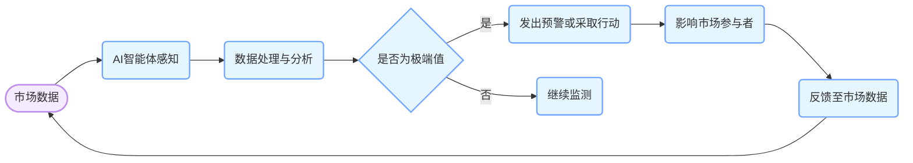

# AI智能体在识别市场情绪极端值中的作用

> 关键词：AI智能体、市场情绪极端值、情绪识别、金融市场、数据分析

> 摘要：本文聚焦于AI智能体在识别市场情绪极端值中的作用。首先介绍了研究背景、目的范围、预期读者等内容，接着阐述了核心概念与联系，包括AI智能体和市场情绪极端值的原理及架构。详细讲解了核心算法原理和具体操作步骤，给出了相关数学模型和公式，并通过举例进行说明。通过项目实战展示了代码实现及解读，探讨了实际应用场景。推荐了学习、开发相关的工具和资源，最后总结了未来发展趋势与挑战，还提供了常见问题解答和参考资料，旨在全面深入地分析AI智能体在这一领域的重要作用和应用价值。

## 1. 背景介绍 
### 1.1 目的和范围
在金融市场中，市场情绪的波动对资产价格的走势有着至关重要的影响。市场情绪极端值往往预示着市场的重大转折，可能引发剧烈的价格波动和投资风险。准确识别市场情绪极端值，有助于投资者把握市场趋势、制定合理的投资策略，也有助于监管机构进行市场监测和风险预警。

本文章的范围涵盖了AI智能体在识别市场情绪极端值方面的理论基础、算法原理、实际应用等多个方面。通过对相关技术和方法的研究，探讨如何利用AI智能体更有效地捕捉市场情绪的极端变化，为金融市场的参与者提供有价值的参考。

### 1.2 预期读者
本文预期读者包括金融领域的投资者、交易员、风险管理人员，以及对人工智能和金融科技交叉领域感兴趣的研究人员、学者和学生。对于希望借助AI技术提升市场分析能力和决策水平的金融从业者，本文将提供实用的技术和方法；对于从事相关研究的人员，本文将为其提供理论和实践的参考依据。

### 1.3 文档结构概述
本文将按照以下结构展开：首先介绍相关背景知识，包括目的范围、预期读者等；接着阐述核心概念与联系，明确AI智能体和市场情绪极端值的定义和关系；然后详细讲解核心算法原理和具体操作步骤，并给出相应的数学模型和公式；通过项目实战展示代码实现和解读；探讨实际应用场景；推荐学习和开发相关的工具和资源；总结未来发展趋势与挑战；最后提供常见问题解答和参考资料。

### 1.4 术语表
#### 1.4.1 核心术语定义
- **AI智能体**：是一种能够感知环境、自主决策并采取行动以实现特定目标的人工智能实体。在本文中，AI智能体通过对市场数据的分析和处理，识别市场情绪的极端值。
- **市场情绪极端值**：指市场参与者在特定时期内表现出的过度乐观或过度悲观的情绪状态。这种情绪状态往往伴随着资产价格的大幅波动和市场的异常变化。

#### 1.4.2 相关概念解释
- **情绪指标**：用于衡量市场情绪的量化指标，如投资者信心指数、恐慌指数等。这些指标可以反映市场参与者的情绪倾向和程度。
- **数据挖掘**：从大量的市场数据中提取有价值信息的过程。在识别市场情绪极端值中，数据挖掘技术可以帮助AI智能体发现隐藏在数据中的模式和规律。

#### 1.4.3 缩略词列表
- **AI**：Artificial Intelligence，人工智能
- **ML**：Machine Learning，机器学习
- **NLP**：Natural Language Processing，自然语言处理

## 2. 核心概念与联系 
### 2.1 AI智能体原理
AI智能体的工作原理基于感知、决策和行动三个主要阶段。感知阶段，AI智能体通过各种传感器或数据源收集市场信息，包括价格数据、新闻资讯、社交媒体评论等。决策阶段，AI智能体利用机器学习、深度学习等算法对收集到的数据进行分析和处理，识别市场情绪的状态和趋势。行动阶段，AI智能体根据决策结果采取相应的行动，如发出预警信号、调整投资组合等。

### 2.2 市场情绪极端值原理
市场情绪极端值的产生是由于市场参与者的心理和行为因素的影响。当市场处于牛市时，投资者往往会过度乐观，推动资产价格不断上涨；当市场处于熊市时，投资者则会过度悲观，导致资产价格大幅下跌。市场情绪极端值的出现通常伴随着交易量的急剧变化、波动率的增加等特征。

### 2.3 两者联系架构
AI智能体与市场情绪极端值之间存在着紧密的联系。AI智能体通过对市场数据的分析和处理，能够及时捕捉市场情绪的变化，识别出市场情绪的极端值。同时，AI智能体可以根据识别结果采取相应的行动，影响市场参与者的决策和行为，从而对市场情绪产生反馈作用。

以下是Mermaid流程图：


## 3. 核心算法原理 & 具体操作步骤 
### 3.1 算法原理
在识别市场情绪极端值中，我们可以采用基于机器学习的分类算法，如支持向量机（SVM）、随机森林（Random Forest）等。以支持向量机为例，其基本原理是在特征空间中找到一个最优的超平面，将不同类别的样本分开。在市场情绪识别中，我们可以将市场数据作为特征，将市场情绪状态（极端值或非极端值）作为类别标签，通过训练支持向量机模型来实现对市场情绪极端值的识别。

### 3.2 Python源代码实现
以下是一个使用Python实现支持向量机进行市场情绪极端值识别的示例代码：
```python
import numpy as np
from sklearn import svm
from sklearn.model_selection import train_test_split
from sklearn.metrics import accuracy_score

# 生成示例数据
# 假设我们有100个样本，每个样本有5个特征
X = np.random.rand(100, 5)
# 生成对应的标签，0表示非极端值，1表示极端值
y = np.random.randint(0, 2, 100)

# 划分训练集和测试集
X_train, X_test, y_train, y_test = train_test_split(X, y, test_size=0.2, random_state=42)

# 创建支持向量机模型
clf = svm.SVC(kernel='linear')

# 训练模型
clf.fit(X_train, y_train)

# 预测测试集
y_pred = clf.predict(X_test)

# 计算准确率
accuracy = accuracy_score(y_test, y_pred)
print(f"模型准确率: {accuracy}")
```
### 3.3 具体操作步骤
1. **数据收集**：收集市场相关的数据，包括价格数据、新闻资讯、社交媒体评论等。
2. **数据预处理**：对收集到的数据进行清洗、转换和特征提取，将其转换为适合机器学习算法处理的格式。
3. **模型训练**：选择合适的机器学习算法，如支持向量机、随机森林等，使用训练数据对模型进行训练。
4. **模型评估**：使用测试数据对训练好的模型进行评估，计算模型的准确率、召回率等指标。
5. **模型应用**：将训练好的模型应用到实际的市场数据中，识别市场情绪的极端值。

## 4. 数学模型和公式 & 详细讲解 & 举例说明 
### 4.1 支持向量机数学模型
支持向量机的目标是在特征空间中找到一个最优的超平面，使得不同类别的样本之间的间隔最大。对于线性可分的情况，超平面的方程可以表示为：
$$w^T x + b = 0$$
其中，$w$ 是超平面的法向量，$x$ 是样本点，$b$ 是偏置项。

支持向量机的优化目标是最小化以下目标函数：
$$\min_{w,b} \frac{1}{2} \|w\|^2$$
约束条件为：
$$y_i (w^T x_i + b) \geq 1, i = 1,2,\cdots,n$$
其中，$y_i$ 是样本点 $x_i$ 的类别标签，$n$ 是样本数量。

### 4.2 详细讲解
支持向量机通过求解上述优化问题，找到最优的 $w$ 和 $b$，从而确定超平面的位置。在实际应用中，为了处理线性不可分的情况，支持向量机引入了核函数，将低维特征空间映射到高维特征空间，使得样本在高维空间中线性可分。

### 4.3 举例说明
假设我们有两个类别的样本点，分别用红色和蓝色表示。支持向量机的目标是找到一个超平面，将这两个类别的样本点分开，并且使得两个类别之间的间隔最大。通过求解优化问题，我们可以得到最优的超平面，如图所示：

（此处可插入一个简单的二维样本点和超平面的示意图）

在市场情绪极端值识别中，我们可以将市场数据作为样本点，将市场情绪状态作为类别标签，通过支持向量机找到一个超平面，将极端值和非极端值分开。

## 5. 项目实战：代码实际案例和详细解释说明 
### 5.1  开发环境搭建
- **操作系统**：Windows、Linux或Mac OS
- **Python版本**：Python 3.6及以上
- **开发工具**：PyCharm、Jupyter Notebook等
- **相关库**：numpy、pandas、scikit-learn、matplotlib等

可以使用以下命令安装相关库：
```bash
pip install numpy pandas scikit-learn matplotlib
```

### 5.2  源代码详细实现和代码解读
以下是一个更完整的项目实战代码示例，用于识别股票市场情绪极端值：
```python
import pandas as pd
import numpy as np
from sklearn.model_selection import train_test_split
from sklearn.ensemble import RandomForestClassifier
from sklearn.metrics import accuracy_score, classification_report
import matplotlib.pyplot as plt

# 读取股票数据
data = pd.read_csv('stock_data.csv')

# 提取特征和标签
X = data.drop('is_extreme', axis=1)
y = data['is_extreme']

# 划分训练集和测试集
X_train, X_test, y_train, y_test = train_test_split(X, y, test_size=0.2, random_state=42)

# 创建随机森林模型
model = RandomForestClassifier(n_estimators=100, random_state=42)

# 训练模型
model.fit(X_train, y_train)

# 预测测试集
y_pred = model.predict(X_test)

# 计算准确率
accuracy = accuracy_score(y_test, y_pred)
print(f"模型准确率: {accuracy}")

# 打印分类报告
print(classification_report(y_test, y_pred))

# 特征重要性分析
feature_importances = model.feature_importances_
feature_names = X.columns

# 绘制特征重要性柱状图
plt.figure(figsize=(10, 6))
plt.bar(feature_names, feature_importances)
plt.xlabel('特征')
plt.ylabel('重要性')
plt.title('特征重要性分析')
plt.xticks(rotation=90)
plt.show()
```
### 5.3  代码解读与分析
1. **数据读取**：使用 `pandas` 库读取股票数据文件 `stock_data.csv`。
2. **特征提取**：将除了 `is_extreme` 列以外的所有列作为特征，`is_extreme` 列作为标签。
3. **数据划分**：使用 `train_test_split` 函数将数据划分为训练集和测试集，测试集占比为20%。
4. **模型创建**：创建一个随机森林分类器模型，设置树的数量为100。
5. **模型训练**：使用训练集数据对模型进行训练。
6. **模型预测**：使用训练好的模型对测试集数据进行预测。
7. **模型评估**：计算模型的准确率，并打印分类报告，包括精确率、召回率、F1值等指标。
8. **特征重要性分析**：使用 `feature_importances_` 属性获取每个特征的重要性，并绘制柱状图进行可视化。

## 6. 实际应用场景 
### 6.1 投资者决策
投资者可以利用AI智能体识别市场情绪极端值，及时调整投资组合。当市场情绪处于极端乐观时，投资者可以适当减仓，避免市场回调带来的损失；当市场情绪处于极端悲观时，投资者可以适当加仓，抓住市场反弹的机会。

### 6.2 风险预警
监管机构可以利用AI智能体实时监测市场情绪，当发现市场情绪极端值时，及时发出风险预警，采取相应的措施，维护金融市场的稳定。

### 6.3 量化交易
量化交易策略可以将AI智能体识别的市场情绪极端值作为交易信号，自动执行交易操作。例如，当市场情绪极端乐观时，卖出股票；当市场情绪极端悲观时，买入股票。

## 7. 工具和资源推荐
### 7.1 学习资源推荐
#### 7.1.1 书籍推荐
- 《机器学习》（周志华）：全面介绍了机器学习的基本概念、算法和应用，是学习机器学习的经典教材。
- 《Python数据分析实战》（韦斯·麦金尼）：详细介绍了使用Python进行数据分析的方法和技巧，包括数据处理、可视化等。
- 《金融科技前沿：人工智能与机器学习》（菲利普·吉拉尔迪）：介绍了人工智能和机器学习在金融领域的应用，包括市场分析、风险评估等。

#### 7.1.2 在线课程
- Coursera上的“机器学习”课程（Andrew Ng教授）：由机器学习领域的知名专家授课，系统地介绍了机器学习的基本概念和算法。
- edX上的“Python for Data Science”课程：帮助学习者掌握使用Python进行数据分析的技能。
- Udemy上的“AI in Finance”课程：介绍了人工智能在金融领域的应用，包括市场情绪分析、量化交易等。

#### 7.1.3 技术博客和网站
- Medium：有许多关于人工智能和金融科技的技术博客文章，涵盖了最新的研究成果和应用案例。
- Towards Data Science：专注于数据科学和机器学习领域的技术博客，提供了丰富的教程和案例分析。
- Kaggle：一个数据科学竞赛平台，有许多关于金融数据和市场分析的数据集和竞赛，可以帮助学习者提高实践能力。

### 7.2 开发工具框架推荐
#### 7.2.1 IDE和编辑器
- PyCharm：一款专业的Python集成开发环境，提供了丰富的代码编辑、调试和项目管理功能。
- Jupyter Notebook：一个交互式的开发环境，适合进行数据分析和模型实验，支持多种编程语言。
- Visual Studio Code：一款轻量级的代码编辑器，支持多种编程语言和插件扩展，适合快速开发和调试。

#### 7.2.2 调试和性能分析工具
- PySnooper：一个简单易用的Python调试工具，可以自动记录函数的执行过程和变量的值。
- cProfile：Python标准库中的性能分析工具，可以帮助开发者找出代码中的性能瓶颈。
- TensorBoard：TensorFlow提供的可视化工具，可以帮助开发者可视化模型的训练过程和性能指标。

#### 7.2.3 相关框架和库
- scikit-learn：一个简单易用的机器学习库，提供了多种机器学习算法和工具，适合初学者和快速开发。
- TensorFlow：一个开源的深度学习框架，提供了丰富的深度学习模型和工具，适合大规模的深度学习应用。
- PyTorch：一个基于Python的深度学习框架，具有动态计算图和易于使用的特点，受到了广泛的关注和应用。

### 7.3 相关论文著作推荐
#### 7.3.1 经典论文
- “Support-Vector Networks”（Cortes和Vapnik）：介绍了支持向量机的基本原理和算法，是支持向量机领域的经典论文。
- “Random Forests”（Breiman）：提出了随机森林算法，是集成学习领域的重要论文。
- “A Computational Approach to Edge Detection”（Canny）：介绍了Canny边缘检测算法，是计算机视觉领域的经典论文。

#### 7.3.2 最新研究成果
- “Deep Learning for Financial Market Prediction”：介绍了深度学习在金融市场预测中的应用，包括市场情绪分析、股票价格预测等。
- “AI-Powered Risk Management in Financial Markets”：探讨了人工智能在金融市场风险管理中的应用，包括风险评估、预警等。
- “Market Sentiment Analysis Using Social Media Data”：研究了如何利用社交媒体数据进行市场情绪分析，是市场情绪分析领域的最新研究成果。

#### 7.3.3 应用案例分析
- “How AI is Transforming the Financial Industry”：介绍了人工智能在金融行业的应用案例，包括投资银行、资产管理、风险管理等领域。
- “AI in Trading: Case Studies and Best Practices”：分析了人工智能在交易领域的应用案例，包括量化交易、高频交易等。
- “The Impact of AI on Market Surveillance”：探讨了人工智能对市场监管的影响，包括市场操纵检测、内幕交易预警等。

## 8. 总结：未来发展趋势与挑战
### 8.1 未来发展趋势
- **多模态数据融合**：未来的AI智能体将不仅依赖于价格数据和新闻资讯，还将融合社交媒体数据、图像数据等多模态数据，更全面地捕捉市场情绪的变化。
- **深度学习的应用**：深度学习模型如卷积神经网络（CNN）、循环神经网络（RNN）等将在市场情绪极端值识别中得到更广泛的应用，提高识别的准确率和效率。
- **与区块链技术的结合**：区块链技术的去中心化、不可篡改等特点将与AI智能体相结合，提高市场数据的安全性和可信度，为市场情绪分析提供更可靠的基础。

### 8.2 挑战
- **数据质量问题**：市场数据往往存在噪声、缺失值等问题，如何提高数据质量是识别市场情绪极端值的关键挑战之一。
- **模型解释性**：深度学习模型通常是黑盒模型，难以解释其决策过程和结果，如何提高模型的解释性是未来需要解决的问题。
- **法律法规和伦理问题**：AI智能体在金融市场中的应用涉及到法律法规和伦理问题，如数据隐私、算法偏见等，需要制定相应的法律法规和伦理准则来规范其应用。

## 9. 附录：常见问题与解答
### 9.1 如何选择合适的机器学习算法？
选择合适的机器学习算法需要考虑多个因素，如数据的特点、问题的类型、模型的复杂度等。对于市场情绪极端值识别问题，可以尝试多种算法，如支持向量机、随机森林、深度学习模型等，并通过交叉验证等方法评估模型的性能，选择性能最优的算法。

### 9.2 如何处理数据缺失值？
处理数据缺失值的方法有多种，如删除缺失值、填充缺失值等。删除缺失值适用于缺失值较少的情况；填充缺失值可以使用均值、中位数、众数等统计量进行填充，也可以使用机器学习算法进行预测填充。

### 9.3 如何提高模型的准确率？
提高模型的准确率可以从多个方面入手，如优化特征工程、选择合适的算法、调整模型参数、增加训练数据等。可以通过网格搜索、随机搜索等方法寻找最优的模型参数，通过特征选择和特征提取等方法优化特征工程。

## 10. 扩展阅读 & 参考资料
- 《人工智能：一种现代的方法》（Stuart Russell和Peter Norvig）
- 《金融时间序列分析》（Ruey S. Tsay）
- 《Python机器学习实践》（Sebastian Raschka）
- Kaggle平台上的金融数据竞赛和相关数据集
- 相关学术期刊，如《Journal of Financial Economics》、《Review of Financial Studies》等。

以上就是关于AI智能体在识别市场情绪极端值中的作用的详细介绍，希望对读者有所帮助。通过不断的研究和实践，AI智能体在金融市场中的应用将不断发展和完善，为金融市场的稳定和发展提供有力的支持。