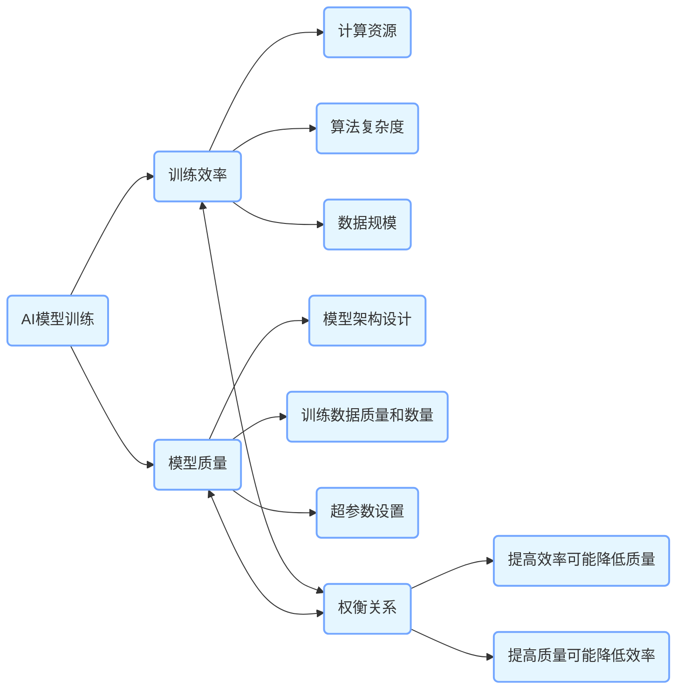

# AI模型训练中的效率与质量权衡问题

> 关键词：AI模型训练、效率、质量、权衡、优化策略、资源管理、评估指标

> 摘要：在AI领域，模型训练的效率与质量是两个至关重要且相互关联的方面。提高训练效率可以缩短开发周期、降低成本，但可能会牺牲模型的质量；而过于追求模型质量则可能导致训练时间过长、资源消耗巨大。本文深入探讨AI模型训练中效率与质量权衡问题的背景、核心概念、算法原理、数学模型，通过项目实战案例分析实际应用场景，推荐相关工具和资源，最后总结未来发展趋势与挑战，旨在为AI开发者和研究者提供全面、深入的参考，以在效率与质量之间找到最佳平衡点。

## 1. 背景介绍 
### 1.1 目的和范围
本文章的目的在于全面深入地探讨AI模型训练中效率与质量的权衡问题。范围涵盖了从AI模型训练的基本概念、核心算法、数学模型到实际应用场景的各个方面，通过理论分析和实际案例相结合，为读者提供在不同场景下如何平衡效率与质量的思路和方法。

### 1.2 预期读者
本文预期读者包括AI领域的开发者、研究者、数据科学家、机器学习工程师等专业人士，以及对AI模型训练感兴趣，希望深入了解效率与质量权衡问题的相关人员。

### 1.3 文档结构概述
本文首先介绍背景信息，包括目的、预期读者和文档结构。接着阐述核心概念与联系，展示相关的文本示意图和Mermaid流程图。然后详细讲解核心算法原理及具体操作步骤，给出Python源代码示例。之后介绍数学模型和公式，并进行详细讲解和举例说明。通过项目实战案例，介绍开发环境搭建、源代码实现和代码解读。再探讨实际应用场景，推荐相关的工具和资源。最后总结未来发展趋势与挑战，提供常见问题解答和扩展阅读参考资料。

### 1.4 术语表
#### 1.4.1 核心术语定义
- **AI模型训练**：通过使用大量的数据对人工智能模型进行迭代优化，使其能够学习到数据中的模式和规律，从而具备预测、分类等能力的过程。
- **训练效率**：指在模型训练过程中，单位时间内完成的训练任务量，通常用训练时间、计算资源利用率等指标来衡量。
- **模型质量**：反映模型在预测、分类等任务中的表现，常用准确率、召回率、F1值等评估指标来衡量。

#### 1.4.2 相关概念解释
- **过拟合**：模型在训练数据上表现良好，但在未见过的测试数据上表现不佳的现象，通常是由于模型过于复杂，学习到了训练数据中的噪声和细节。
- **欠拟合**：模型在训练数据和测试数据上的表现都不理想的现象，通常是由于模型过于简单，无法学习到数据中的复杂模式。

#### 1.4.3 缩略词列表
- **GPU**：Graphics Processing Unit，图形处理器，常用于加速AI模型训练。
- **CPU**：Central Processing Unit，中央处理器。
- **SGD**：Stochastic Gradient Descent，随机梯度下降，一种常用的优化算法。
- **CNN**：Convolutional Neural Network，卷积神经网络。
- **RNN**：Recurrent Neural Network，循环神经网络。

## 2. 核心概念与联系 

### 核心概念原理
在AI模型训练中，效率和质量是两个相互影响的关键因素。训练效率主要受到计算资源、算法复杂度、数据规模等因素的影响。例如，使用更强大的计算设备（如GPU）可以加速训练过程，而采用高效的优化算法可以减少训练所需的迭代次数。

模型质量则取决于模型的架构设计、训练数据的质量和数量、训练过程中的超参数设置等。一个好的模型架构能够更好地捕捉数据中的模式，而充足且高质量的训练数据可以提高模型的泛化能力。

然而，提高效率和提高质量往往存在一定的矛盾。为了提高效率，可能会采用一些简化的算法或减少训练数据的使用，这可能会导致模型质量下降；而过于追求模型质量，可能会增加训练时间和计算资源的消耗，降低训练效率。

### 架构的文本示意图
```plaintext
AI模型训练
├── 训练效率
│   ├── 计算资源（CPU、GPU等）
│   ├── 算法复杂度
│   ├── 数据规模
├── 模型质量
│   ├── 模型架构设计
│   ├── 训练数据质量和数量
│   ├── 超参数设置
└── 权衡关系
    ├── 提高效率可能降低质量
    ├── 提高质量可能降低效率
```

### Mermaid流程图


## 3. 核心算法原理 & 具体操作步骤 

### 核心算法原理 - 随机梯度下降（SGD）
随机梯度下降是一种常用的优化算法，用于在模型训练过程中更新模型的参数，以最小化损失函数。其基本思想是每次从训练数据中随机选择一个样本（或一个小批量样本），计算该样本的梯度，并根据梯度更新模型的参数。

以下是SGD的Python源代码实现：
```python
import numpy as np

# 定义损失函数（示例：均方误差）
def loss_function(y_true, y_pred):
    return np.mean((y_true - y_pred) ** 2)

# 定义模型（示例：线性回归模型）
def linear_model(X, weights, bias):
    return np.dot(X, weights) + bias

# 定义SGD优化算法
def sgd(X, y, learning_rate=0.01, num_epochs=100):
    num_samples, num_features = X.shape
    weights = np.zeros(num_features)
    bias = 0
    
    for epoch in range(num_epochs):
        # 随机选择一个样本
        random_index = np.random.randint(num_samples)
        x_sample = X[random_index]
        y_sample = y[random_index]
        
        # 计算预测值
        y_pred = linear_model(x_sample, weights, bias)
        
        # 计算梯度
        dw = -2 * (y_sample - y_pred) * x_sample
        db = -2 * (y_sample - y_pred)
        
        # 更新参数
        weights = weights - learning_rate * dw
        bias = bias - learning_rate * db
        
        # 计算损失
        loss = loss_function(y, linear_model(X, weights, bias))
        if epoch % 10 == 0:
            print(f'Epoch {epoch}: Loss = {loss}')
    
    return weights, bias
```

### 具体操作步骤
1. **数据准备**：准备训练数据 `X` 和对应的标签 `y`。
2. **初始化参数**：初始化模型的权重 `weights` 和偏置 `bias`。
3. **设置超参数**：设置学习率 `learning_rate` 和训练轮数 `num_epochs`。
4. **迭代训练**：在每一轮训练中，随机选择一个样本，计算该样本的梯度，并根据梯度更新模型的参数。
5. **计算损失**：在每一轮训练结束后，计算当前模型在整个训练数据上的损失。
6. **返回结果**：训练结束后，返回最终的模型参数 `weights` 和 `bias`。

## 4. 数学模型和公式 & 详细讲解 & 举例说明 

### 损失函数
在AI模型训练中，损失函数用于衡量模型预测值与真实值之间的差异。常见的损失函数包括均方误差（MSE）、交叉熵损失等。

#### 均方误差（MSE）
均方误差是一种常用的回归损失函数，其数学公式为：
$$MSE = \frac{1}{n} \sum_{i=1}^{n} (y_i - \hat{y}_i)^2$$
其中，$n$ 是样本数量，$y_i$ 是第 $i$ 个样本的真实值，$\hat{y}_i$ 是第 $i$ 个样本的预测值。

#### 交叉熵损失
交叉熵损失是一种常用的分类损失函数，对于二分类问题，其数学公式为：
$$CE = -\frac{1}{n} \sum_{i=1}^{n} [y_i \log(\hat{y}_i) + (1 - y_i) \log(1 - \hat{y}_i)]$$
其中，$n$ 是样本数量，$y_i$ 是第 $i$ 个样本的真实标签（0或1），$\hat{y}_i$ 是第 $i$ 个样本的预测概率。

### 梯度下降算法
梯度下降算法是一种优化算法，用于在模型训练过程中更新模型的参数，以最小化损失函数。其基本思想是沿着损失函数的负梯度方向更新参数，每次更新的步长由学习率控制。

参数更新公式为：
$$\theta_{t+1} = \theta_t - \alpha \nabla L(\theta_t)$$
其中，$\theta_t$ 是第 $t$ 次迭代时的参数，$\alpha$ 是学习率，$\nabla L(\theta_t)$ 是损失函数 $L$ 在 $\theta_t$ 处的梯度。

### 举例说明
假设我们有一个简单的线性回归问题，训练数据为 $(x_1, y_1), (x_2, y_2), \cdots, (x_n, y_n)$，模型为 $y = wx + b$，损失函数为均方误差。

则损失函数为：
$$L(w, b) = \frac{1}{n} \sum_{i=1}^{n} (y_i - (wx_i + b))^2$$

计算梯度：
$$\frac{\partial L}{\partial w} = -\frac{2}{n} \sum_{i=1}^{n} x_i (y_i - (wx_i + b))$$
$$\frac{\partial L}{\partial b} = -\frac{2}{n} \sum_{i=1}^{n} (y_i - (wx_i + b))$$

使用梯度下降算法更新参数：
$$w_{t+1} = w_t - \alpha \frac{\partial L}{\partial w}$$
$$b_{t+1} = b_t - \alpha \frac{\partial L}{\partial b}$$

## 5. 项目实战：代码实际案例和详细解释说明 

### 5.1  开发环境搭建
- **操作系统**：推荐使用Ubuntu 18.04或更高版本，或者Windows 10。
- **编程语言**：Python 3.7或更高版本。
- **深度学习框架**：TensorFlow 2.x或PyTorch 1.x。
- **开发工具**：推荐使用Jupyter Notebook或PyCharm。

### 5.2  源代码详细实现和代码解读
以下是一个使用TensorFlow实现的简单的手写数字识别任务的示例代码：
```python
import tensorflow as tf
from tensorflow.keras.datasets import mnist
from tensorflow.keras.models import Sequential
from tensorflow.keras.layers import Flatten, Dense
from tensorflow.keras.optimizers import SGD

# 加载数据集
(x_train, y_train), (x_test, y_test) = mnist.load_data()

# 数据预处理
x_train = x_train / 255.0
x_test = x_test / 255.0

# 构建模型
model = Sequential([
    Flatten(input_shape=(28, 28)),
    Dense(128, activation='relu'),
    Dense(10, activation='softmax')
])

# 编译模型
model.compile(optimizer=SGD(learning_rate=0.01),
              loss='sparse_categorical_crossentropy',
              metrics=['accuracy'])

# 训练模型
model.fit(x_train, y_train, epochs=10, batch_size=32)

# 评估模型
test_loss, test_acc = model.evaluate(x_test, y_test)
print(f'Test accuracy: {test_acc}')
```

### 5.3  代码解读与分析
1. **数据加载**：使用 `mnist.load_data()` 加载手写数字识别数据集，将数据集分为训练集和测试集。
2. **数据预处理**：将图像像素值归一化到0-1之间，以提高模型的训练效果。
3. **模型构建**：使用 `Sequential` 模型构建一个简单的神经网络，包括一个 `Flatten` 层将图像展平，一个 `Dense` 层作为隐藏层，一个 `Dense` 层作为输出层，使用 `softmax` 激活函数进行多分类。
4. **模型编译**：使用 `SGD` 优化器，`sparse_categorical_crossentropy` 作为损失函数，`accuracy` 作为评估指标。
5. **模型训练**：使用 `model.fit()` 方法进行模型训练，设置训练轮数为10，批量大小为32。
6. **模型评估**：使用 `model.evaluate()` 方法在测试集上评估模型的性能，输出测试集的准确率。

在这个案例中，我们可以通过调整训练轮数、批量大小、学习率等超参数来平衡训练效率和模型质量。例如，增加训练轮数可以提高模型质量，但会增加训练时间；减小批量大小可以提高模型的泛化能力，但会降低训练效率。

## 6. 实际应用场景 
### 实时预测场景
在实时预测场景中，如自动驾驶、实时推荐系统等，对模型的响应时间要求较高，因此需要在保证一定模型质量的前提下，尽可能提高训练效率。可以采用模型压缩、量化等技术，减少模型的参数数量和计算量，从而提高模型的推理速度。

### 资源受限场景
在资源受限的场景中，如移动设备、边缘计算设备等，计算资源和存储资源有限，需要在有限的资源下训练出高质量的模型。可以采用轻量级的模型架构，如MobileNet、ShuffleNet等，减少模型的复杂度和资源消耗。

### 大规模数据场景
在大规模数据场景中，如互联网公司的用户行为数据、医疗影像数据等，数据量巨大，训练时间长。可以采用分布式训练、异步训练等技术，并行处理数据，提高训练效率。同时，需要注意数据的质量和多样性，以保证模型的质量。

## 7. 工具和资源推荐
### 7.1 学习资源推荐
#### 7.1.1 书籍推荐
- 《深度学习》（Deep Learning），作者：Ian Goodfellow、Yoshua Bengio和Aaron Courville，这本书是深度学习领域的经典教材，涵盖了深度学习的基本概念、算法和应用。
- 《Python深度学习》（Deep Learning with Python），作者：Francois Chollet，这本书以Keras为框架，介绍了深度学习的实践方法，适合初学者。
- 《动手学深度学习》（Dive into Deep Learning），作者：阿斯顿·张、李沐等，这本书提供了丰富的代码示例和详细的讲解，适合实践学习。

#### 7.1.2 在线课程
- Coursera上的“深度学习专项课程”（Deep Learning Specialization），由Andrew Ng教授授课，是深度学习领域的经典课程。
- edX上的“强化学习基础”（Foundations of Reinforcement Learning），介绍了强化学习的基本概念和算法。
- 哔哩哔哩上的“李宏毅机器学习课程”，以生动有趣的方式讲解机器学习和深度学习的知识。

#### 7.1.3 技术博客和网站
- Medium上的Towards Data Science，有很多关于数据科学、机器学习和深度学习的高质量文章。
- 机器之心（https://www.alldatascience.com/），提供了丰富的AI领域的资讯和技术文章。
- 知乎上的AI相关话题，有很多专业人士分享的经验和见解。

### 7.2 开发工具框架推荐
#### 7.2.1 IDE和编辑器
- PyCharm：功能强大的Python集成开发环境，提供了代码编辑、调试、版本控制等功能。
- Jupyter Notebook：交互式的编程环境，适合数据探索和模型开发。
- Visual Studio Code：轻量级的代码编辑器，支持多种编程语言和插件扩展。

#### 7.2.2 调试和性能分析工具
- TensorBoard：TensorFlow的可视化工具，用于监控模型训练过程中的损失、准确率等指标。
- PyTorch Profiler：PyTorch的性能分析工具，用于分析模型的计算性能和内存使用情况。
- NVIDIA Nsight Systems：用于GPU性能分析的工具，帮助开发者优化GPU代码。

#### 7.2.3 相关框架和库
- TensorFlow：Google开发的深度学习框架，提供了丰富的API和工具，支持分布式训练和模型部署。
- PyTorch：Facebook开发的深度学习框架，以动态计算图和易用性著称，适合学术研究和快速原型开发。
- Scikit-learn：Python的机器学习库，提供了各种机器学习算法和工具，适合传统机器学习任务。

### 7.3 相关论文著作推荐
#### 7.3.1 经典论文
- “ImageNet Classification with Deep Convolutional Neural Networks”，作者：Alex Krizhevsky、Ilya Sutskever和Geoffrey E. Hinton，这篇论文提出了AlexNet，开启了深度学习在计算机视觉领域的革命。
- “Long Short-Term Memory”，作者：Sepp Hochreiter和Jürgen Schmidhuber，这篇论文提出了长短期记忆网络（LSTM），解决了循环神经网络中的梯度消失问题。
- “Attention Is All You Need”，作者：Ashish Vaswani等，这篇论文提出了Transformer架构，在自然语言处理领域取得了巨大成功。

#### 7.3.2 最新研究成果
- 关注顶级学术会议，如NeurIPS、ICML、CVPR、ACL等，这些会议上的论文代表了AI领域的最新研究成果。
- arXiv.org上的AI相关预印本论文，及时了解最新的研究动态。

#### 7.3.3 应用案例分析
- Kaggle上的各种竞赛项目，提供了丰富的实际应用案例和解决方案。
- 各大科技公司的技术博客，如Google AI Blog、Facebook AI Research等，分享了他们在AI领域的实践经验和应用案例。

## 8. 总结：未来发展趋势与挑战
### 未来发展趋势
- **自动化机器学习（AutoML）**：AutoML技术将逐渐成熟，能够自动完成模型选择、超参数调优、特征工程等任务，提高AI模型训练的效率和质量。
- **联邦学习**：联邦学习可以在保护数据隐私的前提下，实现多方数据的联合训练，解决数据孤岛问题，在金融、医疗等领域有广阔的应用前景。
- **强化学习与深度学习的融合**：强化学习与深度学习的融合将推动AI在复杂决策、机器人控制等领域的发展，实现更加智能的行为决策。

### 挑战
- **计算资源瓶颈**：随着AI模型的不断复杂和数据量的不断增大，计算资源的需求也越来越高，如何高效地利用计算资源是一个挑战。
- **数据隐私和安全**：在AI模型训练过程中，数据隐私和安全问题日益突出，如何在保护数据隐私的前提下，训练出高质量的模型是一个亟待解决的问题。
- **可解释性和可信赖性**：AI模型的可解释性和可信赖性是当前AI领域的研究热点，如何让AI模型的决策过程可解释、可信赖是一个挑战。

## 9. 附录：常见问题与解答
### 问题1：如何在提高训练效率的同时保证模型质量？
解答：可以采用以下方法：选择合适的模型架构，避免过于复杂的模型；使用高效的优化算法，如Adam、Adagrad等；进行数据预处理，提高数据质量；合理设置超参数，如学习率、批量大小等；采用模型压缩、量化等技术，减少模型的参数数量和计算量。

### 问题2：训练效率和模型质量的衡量指标有哪些？
解答：训练效率的衡量指标包括训练时间、计算资源利用率等；模型质量的衡量指标包括准确率、召回率、F1值、均方误差等，具体的衡量指标需要根据不同的任务类型来选择。

### 问题3：如何处理大规模数据的训练效率问题？
解答：可以采用分布式训练、异步训练等技术，并行处理数据，提高训练效率；使用数据采样技术，减少训练数据的规模；采用增量学习的方法，逐步更新模型。

## 10. 扩展阅读 & 参考资料
- Goodfellow, I., Bengio, Y., & Courville, A. (2016). Deep Learning. MIT Press.
- Chollet, F. (2018). Deep Learning with Python. Manning Publications.
- Zhang, A., Li, M., et al. (2020). Dive into Deep Learning.
- Krizhevsky, A., Sutskever, I., & Hinton, G. E. (2012). ImageNet Classification with Deep Convolutional Neural Networks. Advances in Neural Information Processing Systems.
- Hochreiter, S., & Schmidhuber, J. (1997). Long Short-Term Memory. Neural Computation.
- Vaswani, A., et al. (2017). Attention Is All You Need. Advances in Neural Information Processing Systems.
- 相关技术博客和网站：Medium上的Towards Data Science、机器之心、知乎等。
- 相关开源代码库：GitHub上的TensorFlow、PyTorch等项目。