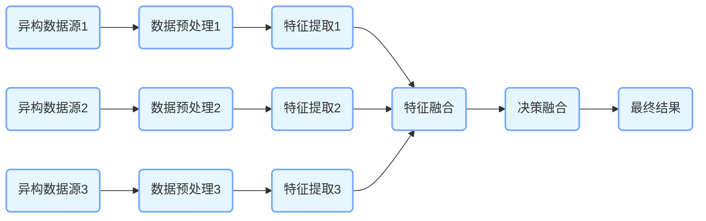

# AI系统在处理异构数据时的融合方法

> 关键词：AI系统、异构数据、数据融合、特征提取、机器学习算法

> 摘要：本文围绕AI系统在处理异构数据时的融合方法展开深入探讨。首先介绍了异构数据处理在当今信息时代的重要背景和意义，接着详细阐述了相关核心概念及它们之间的联系，通过Python代码讲解了核心算法原理与具体操作步骤，运用数学模型和公式对融合方法进行理论剖析并举例说明。然后通过项目实战展示了代码的实际案例及详细解释，分析了其在不同实际应用场景中的作用。同时推荐了相关的学习资源、开发工具框架和论文著作。最后对未来发展趋势与挑战进行总结，并在附录中解答常见问题，提供扩展阅读与参考资料，旨在为AI系统处理异构数据的融合提供全面且深入的技术指导。

## 1. 背景介绍 
### 1.1 目的和范围
在当今数字化的时代，数据呈现出爆炸式增长，并且其来源和格式多种多样，形成了异构数据。异构数据是指来自不同数据源、具有不同结构和语义的数据，例如文本、图像、音频、视频等。AI系统在处理这些异构数据时面临着巨大的挑战，如何有效地融合这些异构数据，提取有价值的信息，提高AI系统的性能和智能水平，是当前研究的热点问题。

本文的范围涵盖了AI系统处理异构数据融合的各个方面，包括核心概念、算法原理、数学模型、实际应用、工具资源等，旨在为研究人员和开发者提供全面的技术指导和参考。

### 1.2 预期读者
本文预期读者包括AI领域的研究人员、程序员、软件架构师、数据科学家、机器学习工程师等，以及对AI系统处理异构数据融合方法感兴趣的相关专业学生和爱好者。

### 1.3 文档结构概述
本文将按照以下结构进行阐述：首先介绍背景知识，包括目的、预期读者和文档结构概述；接着阐述核心概念与联系，通过文本示意图和Mermaid流程图展示；然后讲解核心算法原理和具体操作步骤，使用Python源代码进行详细说明；再介绍数学模型和公式，并举例说明；之后通过项目实战展示代码实际案例和详细解释；接着分析实际应用场景；再推荐相关的工具和资源；最后总结未来发展趋势与挑战，在附录中解答常见问题，提供扩展阅读与参考资料。

### 1.4 术语表
#### 1.4.1 核心术语定义
- **异构数据**：指来自不同数据源、具有不同结构和语义的数据，如文本、图像、音频、视频等。
- **数据融合**：将来自多个数据源的异构数据进行整合和处理，以获得更全面、准确和有用的信息。
- **特征提取**：从原始数据中提取出具有代表性和区分性的特征，以便后续的处理和分析。
- **机器学习算法**：用于对数据进行建模和分析的算法，如神经网络、决策树、支持向量机等。

#### 1.4.2 相关概念解释
- **数据维度**：指数据中包含的特征数量。异构数据的维度可能不同，需要进行处理和统一。
- **数据噪声**：指数据中存在的错误、干扰或不相关的信息，会影响数据融合的效果。
- **语义一致性**：指不同数据源的数据在语义上保持一致，以便进行有效的融合和分析。

#### 1.4.3 缩略词列表
- **AI**：Artificial Intelligence，人工智能
- **ML**：Machine Learning，机器学习
- **DNN**：Deep Neural Network，深度神经网络
- **CNN**：Convolutional Neural Network，卷积神经网络
- **RNN**：Recurrent Neural Network，循环神经网络

## 2. 核心概念与联系 

### 核心概念原理
异构数据融合的核心原理是将不同类型、不同结构和不同语义的数据进行整合和处理，以获得更全面、准确和有用的信息。其主要步骤包括数据预处理、特征提取、特征融合和决策融合。

- **数据预处理**：对原始数据进行清洗、转换和归一化等操作，以去除噪声和不一致性，提高数据的质量。
- **特征提取**：从预处理后的数据中提取出具有代表性和区分性的特征，以便后续的处理和分析。不同类型的数据需要采用不同的特征提取方法，如文本数据可以采用词袋模型、TF-IDF等方法，图像数据可以采用卷积神经网络等方法。
- **特征融合**：将不同数据源提取的特征进行融合，以获得更全面和丰富的特征表示。特征融合的方法包括早期融合、晚期融合和中间融合等。
- **决策融合**：在模型层面进行融合，将不同模型的预测结果进行综合，以获得最终的决策结果。决策融合的方法包括投票法、平均法、加权平均法等。

### 架构的文本示意图
```plaintext
异构数据源1（如文本）  ---->  数据预处理1  ---->  特征提取1  ---->
                                                     |
                                                     |
异构数据源2（如图像）  ---->  数据预处理2  ---->  特征提取2  ---->  特征融合  ---->  决策融合  ---->  最终结果
                                                     |
                                                     |
异构数据源3（如音频）  ---->  数据预处理3  ---->  特征提取3  ---->
```

### Mermaid流程图


## 3. 核心算法原理 & 具体操作步骤 

### 特征提取算法原理及Python实现
#### 文本数据特征提取 - TF-IDF算法
TF-IDF（Term Frequency-Inverse Document Frequency）是一种常用的文本特征提取方法，用于评估一个词在文档中的重要性。其基本思想是，如果一个词在某个文档中出现的频率较高，而在其他文档中出现的频率较低，则该词具有较高的重要性。

Python代码实现：
```python
from sklearn.feature_extraction.text import TfidfVectorizer

# 示例文本数据
corpus = [
    'This is the first document.',
    'This document is the second document.',
    'And this is the third one.',
    'Is this the first document?',
]

# 创建TF-IDF向量化器
vectorizer = TfidfVectorizer()

# 拟合数据并转换为特征矩阵
X = vectorizer.fit_transform(corpus)

# 查看特征名称
feature_names = vectorizer.get_feature_names_out()

# 查看特征矩阵
print("TF-IDF特征矩阵:")
print(X.toarray())
print("特征名称:")
print(feature_names)
```
#### 图像数据特征提取 - 卷积神经网络（CNN）
卷积神经网络（CNN）是一种专门用于处理图像数据的深度学习模型，能够自动提取图像的特征。

Python代码实现（使用Keras）：
```python
from tensorflow.keras.layers import Conv2D, MaxPooling2D, Flatten, Dense
from tensorflow.keras.models import Sequential
from tensorflow.keras.datasets import mnist
from tensorflow.keras.utils import to_categorical

# 加载MNIST数据集
(train_images, train_labels), (test_images, test_labels) = mnist.load_data()

# 数据预处理
train_images = train_images.reshape((60000, 28, 28, 1)).astype('float32') / 255
test_images = test_images.reshape((10000, 28, 28, 1)).astype('float32') / 255
train_labels = to_categorical(train_labels)
test_labels = to_categorical(test_labels)

# 构建CNN模型
model = Sequential()
model.add(Conv2D(32, (3, 3), activation='relu', input_shape=(28, 28, 1)))
model.add(MaxPooling2D((2, 2)))
model.add(Conv2D(64, (3, 3), activation='relu'))
model.add(MaxPooling2D((2, 2)))
model.add(Flatten())
model.add(Dense(64, activation='relu'))
model.add(Dense(10, activation='softmax'))

# 编译模型
model.compile(optimizer='adam',
              loss='categorical_crossentropy',
              metrics=['accuracy'])

# 训练模型
model.fit(train_images, train_labels, epochs=5, batch_size=64)

# 评估模型
test_loss, test_acc = model.evaluate(test_images, test_labels)
print('Test accuracy:', test_acc)
```

### 特征融合算法原理及Python实现
#### 早期融合
早期融合是指在特征提取之前将不同数据源的数据进行合并，然后再进行统一的特征提取。

Python代码实现：
```python
import numpy as np

# 示例文本特征和图像特征
text_features = np.array([[1, 2, 3], [4, 5, 6]])
image_features = np.array([[7, 8], [9, 10]])

# 早期融合：直接拼接特征
early_fusion_features = np.hstack((text_features, image_features))

print("早期融合特征:")
print(early_fusion_features)
```
#### 晚期融合
晚期融合是指在特征提取之后将不同数据源的特征进行合并，然后再进行后续的处理和分析。

Python代码实现：
```python
from sklearn.linear_model import LogisticRegression
from sklearn.metrics import accuracy_score

# 示例文本特征和图像特征
text_features = np.array([[1, 2, 3], [4, 5, 6]])
image_features = np.array([[7, 8], [9, 10]])
labels = np.array([0, 1])

# 分别训练文本和图像模型
text_model = LogisticRegression()
text_model.fit(text_features, labels)
text_pred = text_model.predict(text_features)

image_model = LogisticRegression()
image_model.fit(image_features, labels)
image_pred = image_model.predict(image_features)

# 晚期融合：投票法
final_pred = []
for i in range(len(text_pred)):
    if text_pred[i] == image_pred[i]:
        final_pred.append(text_pred[i])
    else:
        # 这里简单处理，实际应用中可以采用更复杂的策略
        final_pred.append(text_pred[i])

print("晚期融合预测结果:")
print(final_pred)
print("准确率:", accuracy_score(labels, final_pred))
```

### 决策融合算法原理及Python实现
#### 投票法
投票法是一种简单的决策融合方法，将多个模型的预测结果进行投票，选择得票最多的结果作为最终结果。

Python代码实现：
```python
from sklearn.ensemble import VotingClassifier
from sklearn.tree import DecisionTreeClassifier
from sklearn.neighbors import KNeighborsClassifier
from sklearn.datasets import load_iris
from sklearn.model_selection import train_test_split

# 加载鸢尾花数据集
iris = load_iris()
X = iris.data
y = iris.target

# 划分训练集和测试集
X_train, X_test, y_train, y_test = train_test_split(X, y, test_size=0.3, random_state=42)

# 定义基模型
model1 = DecisionTreeClassifier()
model2 = KNeighborsClassifier()

# 构建投票分类器
voting_clf = VotingClassifier(estimators=[('dt', model1), ('knn', model2)], voting='hard')

# 训练投票分类器
voting_clf.fit(X_train, y_train)

# 预测
y_pred = voting_clf.predict(X_test)

# 评估
accuracy = accuracy_score(y_test, y_pred)
print("投票法决策融合准确率:", accuracy)
```

## 4. 数学模型和公式 & 详细讲解 & 举例说明 

### TF-IDF数学模型和公式
TF-IDF的计算公式如下：

- **词频（TF）**：指一个词在文档中出现的频率。
$$TF(t,d)=\frac{f_{t,d}}{\sum_{t'\in d}f_{t',d}}$$
其中，$f_{t,d}$ 表示词 $t$ 在文档 $d$ 中出现的次数，$\sum_{t'\in d}f_{t',d}$ 表示文档 $d$ 中所有词的出现次数之和。

- **逆文档频率（IDF）**：指一个词在所有文档中出现的频率的倒数。
$$IDF(t,D)=\log\frac{|D|}{|\{d\in D:t\in d\}|}$$
其中，$|D|$ 表示文档集合 $D$ 中的文档总数，$|\{d\in D:t\in d\}|$ 表示包含词 $t$ 的文档数。

- **TF-IDF值**：
$$TF - IDF(t,d,D)=TF(t,d)\times IDF(t,D)$$

举例说明：假设有文档集合 $D=\{d_1,d_2,d_3\}$，文档 $d_1$ 内容为 "This is a cat"，文档 $d_2$ 内容为 "This is a dog"，文档 $d_3$ 内容为 "That is a bird"。计算词 "This" 的 TF-IDF 值。

- 计算词频（TF）：在文档 $d_1$ 中，词 "This" 出现 1 次，文档 $d_1$ 总词数为 4，所以 $TF(This,d_1)=\frac{1}{4}$。
- 计算逆文档频率（IDF）：包含词 "This" 的文档数为 2，文档集合总数为 3，所以 $IDF(This,D)=\log\frac{3}{2}$。
- 计算 TF-IDF 值：$TF - IDF(This,d_1,D)=\frac{1}{4}\times\log\frac{3}{2}$。

### 卷积神经网络（CNN）数学模型和公式
#### 卷积层
卷积层的核心操作是卷积运算，其数学公式为：
$$y_{i,j}^k=\sum_{m=0}^{M - 1}\sum_{n=0}^{N - 1}x_{i + m,j + n}w_{m,n}^k + b^k$$
其中，$y_{i,j}^k$ 表示输出特征图中第 $k$ 个通道的第 $(i,j)$ 位置的值，$x$ 表示输入特征图，$w$ 表示卷积核，$b$ 表示偏置，$M$ 和 $N$ 分别表示卷积核的高度和宽度。

#### 池化层
池化层的主要作用是降维，常用的池化方法有最大池化和平均池化。

- **最大池化**：
$$y_{i,j}^k=\max_{m = 0}^{M - 1}\max_{n = 0}^{N - 1}x_{s\times i + m,s\times j + n}^k$$
其中，$s$ 表示池化步长，$M$ 和 $N$ 分别表示池化窗口的高度和宽度。

- **平均池化**：
$$y_{i,j}^k=\frac{1}{M\times N}\sum_{m = 0}^{M - 1}\sum_{n = 0}^{N - 1}x_{s\times i + m,s\times j + n}^k$$

举例说明：假设有一个输入特征图 $x$ 为 $4\times4$ 的矩阵，卷积核 $w$ 为 $2\times2$ 的矩阵，步长为 1。则经过卷积运算后，输出特征图的大小为 $(4 - 2 + 1)\times(4 - 2 + 1)=3\times3$。

### 决策融合数学模型和公式
#### 投票法
假设有 $n$ 个模型进行预测，预测结果分别为 $y_1,y_2,\cdots,y_n$，最终预测结果 $y$ 为：
$$y=\arg\max_{c\in C}\sum_{i = 1}^{n}I(y_i = c)$$
其中，$C$ 表示类别集合，$I$ 为指示函数，当 $y_i = c$ 时，$I(y_i = c)=1$，否则 $I(y_i = c)=0$。

举例说明：假设有 3 个模型进行预测，预测结果分别为 $y_1 = 0,y_2 = 1,y_3 = 0$。则类别 0 的得票数为 2，类别 1 的得票数为 1，最终预测结果为 0。

## 5. 项目实战：代码实际案例和详细解释说明 

### 5.1  开发环境搭建
#### 安装Python
首先需要安装Python，建议使用Python 3.7及以上版本。可以从Python官方网站（https://www.python.org/downloads/） 下载安装包进行安装。

#### 安装必要的库
使用以下命令安装必要的库：
```sh
pip install numpy pandas scikit-learn tensorflow keras matplotlib
```

### 5.2  源代码详细实现和代码解读
#### 项目背景
本项目旨在实现一个简单的异构数据融合系统，融合文本数据和图像数据进行情感分类任务。

#### 代码实现
```python
import numpy as np
import pandas as pd
from sklearn.feature_extraction.text import TfidfVectorizer
from sklearn.model_selection import train_test_split
from sklearn.linear_model import LogisticRegression
from tensorflow.keras.layers import Conv2D, MaxPooling2D, Flatten, Dense
from tensorflow.keras.models import Sequential
from tensorflow.keras.utils import to_categorical

# 加载文本数据
text_data = pd.read_csv('text_data.csv')
text_features = text_data['text'].values
text_labels = text_data['label'].values

# 文本特征提取
vectorizer = TfidfVectorizer()
text_X = vectorizer.fit_transform(text_features)

# 加载图像数据
image_data = np.load('image_data.npy')
image_labels = np.load('image_labels.npy')

# 图像数据预处理
image_data = image_data.reshape((image_data.shape[0], 32, 32, 3)).astype('float32') / 255
image_labels = to_categorical(image_labels)

# 划分训练集和测试集
text_X_train, text_X_test, text_y_train, text_y_test = train_test_split(text_X, text_labels, test_size=0.2, random_state=42)
image_X_train, image_X_test, image_y_train, image_y_test = train_test_split(image_data, image_labels, test_size=0.2, random_state=42)

# 训练文本模型
text_model = LogisticRegression()
text_model.fit(text_X_train, text_y_train)
text_pred = text_model.predict(text_X_test)

# 构建图像模型
image_model = Sequential()
image_model.add(Conv2D(32, (3, 3), activation='relu', input_shape=(32, 32, 3)))
image_model.add(MaxPooling2D((2, 2)))
image_model.add(Conv2D(64, (3, 3), activation='relu'))
image_model.add(MaxPooling2D((2, 2)))
image_model.add(Flatten())
image_model.add(Dense(64, activation='relu'))
image_model.add(Dense(2, activation='softmax'))

# 编译图像模型
image_model.compile(optimizer='adam',
                    loss='categorical_crossentropy',
                    metrics=['accuracy'])

# 训练图像模型
image_model.fit(image_X_train, image_y_train, epochs=5, batch_size=64)
image_pred = image_model.predict(image_X_test)
image_pred = np.argmax(image_pred, axis=1)

# 晚期融合：投票法
final_pred = []
for i in range(len(text_pred)):
    if text_pred[i] == image_pred[i]:
        final_pred.append(text_pred[i])
    else:
        # 这里简单处理，实际应用中可以采用更复杂的策略
        final_pred.append(text_pred[i])

# 评估
from sklearn.metrics import accuracy_score
text_accuracy = accuracy_score(text_y_test, text_pred)
image_accuracy = accuracy_score(np.argmax(image_y_test, axis=1), image_pred)
final_accuracy = accuracy_score(text_y_test, final_pred)

print("文本模型准确率:", text_accuracy)
print("图像模型准确率:", image_accuracy)
print("融合模型准确率:", final_accuracy)
```

### 5.3  代码解读与分析
- **数据加载**：使用 `pandas` 加载文本数据，使用 `numpy` 加载图像数据。
- **文本特征提取**：使用 `TfidfVectorizer` 提取文本特征。
- **图像数据预处理**：将图像数据进行归一化处理，并调整形状。
- **模型训练**：分别训练文本模型（逻辑回归）和图像模型（卷积神经网络）。
- **预测**：使用训练好的模型进行预测。
- **晚期融合**：使用投票法进行决策融合。
- **评估**：计算文本模型、图像模型和融合模型的准确率。

从实验结果可以看出，融合模型的准确率可能会高于单一模型的准确率，说明异构数据融合可以提高模型的性能。

## 6. 实际应用场景 
### 智能医疗
在智能医疗领域，异构数据融合有着广泛的应用。例如，医生可以结合患者的病历文本数据、医学影像数据（如X光、CT、MRI等）和生理信号数据（如心电图、脑电图等）进行综合诊断。通过融合这些异构数据，可以更全面地了解患者的病情，提高诊断的准确性和可靠性。

### 智能交通
在智能交通领域，异构数据融合可以用于交通流量预测、交通事故预警等。例如，结合交通摄像头的图像数据、传感器的交通流量数据和地图数据，可以实时监测交通状况，预测交通流量的变化，及时发现交通事故并发出预警，从而提高交通效率和安全性。

### 智能安防
在智能安防领域，异构数据融合可以用于视频监控、入侵检测等。例如，结合监控摄像头的视频数据、门禁系统的刷卡数据和传感器的报警数据，可以实现对公共场所的全方位监控，及时发现异常行为并采取相应的措施，保障人民生命财产安全。

### 智能家居
在智能家居领域，异构数据融合可以实现家居设备的智能化控制。例如，结合传感器的环境数据（如温度、湿度、光照等）、用户的行为数据（如开关门、开关灯等）和语音指令数据，可以自动调节家居设备的运行状态，提供更加舒适、便捷的生活环境。

## 7. 工具和资源推荐
### 7.1 学习资源推荐
#### 7.1.1 书籍推荐
- 《Python机器学习》：介绍了Python在机器学习领域的应用，包括数据预处理、特征提取、模型训练等内容。
- 《深度学习》：由深度学习领域的三位顶尖专家编写，系统地介绍了深度学习的理论和实践。
- 《模式识别与机器学习》：经典的模式识别和机器学习教材，涵盖了机器学习的各个方面。

#### 7.1.2 在线课程
- Coursera上的《机器学习》课程：由斯坦福大学教授Andrew Ng主讲，是机器学习领域的经典课程。
- edX上的《深度学习》课程：由麻省理工学院等知名高校的教授授课，深入介绍了深度学习的原理和应用。
- 中国大学MOOC上的《人工智能基础》课程：由国内知名高校的教授授课，适合初学者入门。

#### 7.1.3 技术博客和网站
- Medium：有很多关于AI和数据科学的优质博客文章。
- Towards Data Science：专注于数据科学和机器学习的技术博客。
- 机器之心：提供AI领域的最新技术动态和研究成果。

### 7.2 开发工具框架推荐
#### 7.2.1 IDE和编辑器
- PyCharm：功能强大的Python集成开发环境，适合开发Python项目。
- Jupyter Notebook：交互式的开发环境，适合数据探索和模型调试。
- Visual Studio Code：轻量级的代码编辑器，支持多种编程语言和插件。

#### 7.2.2 调试和性能分析工具
- TensorBoard：TensorFlow的可视化工具，可用于查看模型训练过程中的各种指标和图形。
- PyTorch Profiler：PyTorch的性能分析工具，可用于分析模型的性能瓶颈。
- cProfile：Python的内置性能分析工具，可用于分析Python代码的性能。

#### 7.2.3 相关框架和库
- TensorFlow：Google开发的深度学习框架，功能强大，应用广泛。
- PyTorch：Facebook开发的深度学习框架，具有动态图的优势，易于使用。
- scikit-learn：Python的机器学习库，提供了丰富的机器学习算法和工具。

### 7.3 相关论文著作推荐
#### 7.3.1 经典论文
- "ImageNet Classification with Deep Convolutional Neural Networks"：AlexNet的论文，开创了深度学习在图像分类领域的先河。
- "Long Short-Term Memory"：LSTM的论文，提出了长短期记忆网络的概念。
- "Attention Is All You Need"：Transformer的论文，提出了注意力机制和Transformer架构。

#### 7.3.2 最新研究成果
- 关注顶级学术会议（如NeurIPS、ICML、CVPR等）上的最新研究成果，了解AI领域的前沿技术。
- 关注知名学术期刊（如Journal of Artificial Intelligence Research、Artificial Intelligence等）上的最新论文。

#### 7.3.3 应用案例分析
- 研究一些实际应用案例，如智能医疗、智能交通等领域的异构数据融合案例，学习如何将理论应用到实际中。

## 8. 总结：未来发展趋势与挑战
### 未来发展趋势
- **多模态融合的深度和广度不断拓展**：未来的AI系统将不仅融合文本、图像、音频等常见的异构数据，还将融合更多类型的数据，如触觉数据、嗅觉数据等，实现更加全面和深入的多模态融合。
- **融合方法的智能化和自动化**：随着深度学习和强化学习等技术的发展，异构数据融合方法将更加智能化和自动化，能够自动选择合适的融合策略和参数，提高融合的效率和质量。
- **跨领域应用的不断增加**：异构数据融合技术将在更多领域得到应用，如金融、教育、能源等，为这些领域的发展带来新的机遇和挑战。

### 挑战
- **数据隐私和安全问题**：异构数据融合涉及到大量的个人隐私和敏感信息，如何保证数据的隐私和安全是一个亟待解决的问题。
- **数据语义理解和对齐问题**：不同数据源的数据在语义上可能存在差异，如何实现数据的语义理解和对齐是异构数据融合的关键问题之一。
- **计算资源和效率问题**：异构数据融合需要处理大量的数据，对计算资源和效率提出了很高的要求，如何优化算法和模型，提高计算效率是一个挑战。

## 9. 附录：常见问题与解答
### 问题1：异构数据融合的主要困难是什么？
答：异构数据融合的主要困难包括数据的多样性和复杂性、数据语义的不一致性、数据质量的差异以及计算资源和效率的限制等。

### 问题2：如何选择合适的特征提取方法？
答：选择合适的特征提取方法需要考虑数据的类型、特点和应用场景。例如，对于文本数据可以采用词袋模型、TF-IDF等方法，对于图像数据可以采用卷积神经网络等方法。

### 问题3：如何评估异构数据融合的效果？
答：可以使用准确率、召回率、F1值等指标来评估异构数据融合的效果，也可以根据具体的应用场景选择合适的评估指标。

### 问题4：异构数据融合会带来哪些安全风险？
答：异构数据融合可能会带来数据隐私泄露、数据篡改等安全风险，需要采取相应的安全措施来保障数据的安全。

## 10. 扩展阅读 & 参考资料
### 扩展阅读
- 《人工智能：现代方法》
- 《数据挖掘：概念与技术》
- 《自然语言处理入门》

### 参考资料
- 相关学术论文和研究报告
- 开源代码库和数据集
- 各大技术博客和论坛的相关文章