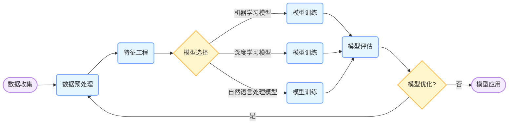

# AI编程的崛起：程序员的机遇与挑战

> 关键词：AI编程、程序员、机遇、挑战、人工智能、软件开发、技术变革

> 摘要：本文深入探讨了AI编程崛起这一时代背景下，程序员所面临的机遇与挑战。首先介绍了相关背景知识，包括目的范围、预期读者等内容。接着阐述了AI编程的核心概念与联系，详细讲解了核心算法原理及具体操作步骤，借助数学模型和公式进行深入剖析。通过项目实战展示了代码实际案例并进行详细解释。分析了AI编程的实际应用场景，推荐了相关的工具和资源。最后总结了未来发展趋势与挑战，解答了常见问题并提供扩展阅读与参考资料，旨在为程序员在AI编程浪潮中找准定位、把握机遇、应对挑战提供全面而深入的参考。

## 1. 背景介绍 
### 1.1 目的和范围
随着人工智能技术的飞速发展，AI编程逐渐成为软件开发领域的重要组成部分。本文的目的在于全面分析AI编程崛起给程序员带来的机遇与挑战，帮助程序员更好地理解这一趋势，调整自身的技能结构和职业规划。范围涵盖AI编程的基本概念、核心算法、数学模型、实际应用场景等多个方面，以及与之相关的工具、资源和未来发展趋势。

### 1.2 预期读者
本文主要面向广大程序员群体，包括初级、中级和高级程序员，以及对AI编程感兴趣的技术爱好者、软件开发者、软件架构师等。同时，也可供相关行业的研究人员、管理者参考，以了解AI编程对整个行业的影响。

### 1.3 文档结构概述
本文将按照以下结构展开：首先介绍背景知识，包括目的、预期读者和文档结构概述等；接着阐述AI编程的核心概念与联系，包括原理和架构的文本示意图及Mermaid流程图；然后详细讲解核心算法原理和具体操作步骤，并结合Python源代码进行说明；再通过数学模型和公式对AI编程进行深入剖析，辅以举例说明；之后通过项目实战展示代码实际案例并进行详细解释；分析AI编程的实际应用场景；推荐相关的工具和资源；总结未来发展趋势与挑战；解答常见问题；最后提供扩展阅读与参考资料。

### 1.4 术语表
#### 1.4.1 核心术语定义
- **AI编程**：指利用人工智能技术进行软件开发的过程，包括机器学习、深度学习、自然语言处理等多种技术的应用。
- **机器学习**：是一门多领域交叉学科，涉及概率论、统计学、逼近论、凸分析、算法复杂度理论等多门学科。它专门研究计算机怎样模拟或实现人类的学习行为，以获取新的知识或技能，重新组织已有的知识结构使之不断改善自身的性能。
- **深度学习**：是机器学习的一个分支领域，它是一种基于对数据进行表征学习的方法。深度学习通过构建具有很多层的神经网络模型，自动从大量数据中学习特征和模式。
- **自然语言处理**：是计算机科学与语言学的交叉领域，主要研究如何让计算机理解、处理和生成人类语言，包括文本分类、机器翻译、情感分析等任务。

#### 1.4.2 相关概念解释
- **人工智能**：是研究、开发用于模拟、延伸和扩展人的智能的理论、方法、技术及应用系统的一门新的技术科学。它试图了解智能的实质，并生产出一种新的能以人类智能相似的方式做出反应的智能机器。
- **算法**：是指解题方案的准确而完整的描述，是一系列解决问题的清晰指令，算法代表着用系统的方法描述解决问题的策略机制。
- **模型**：在AI编程中，模型是指对现实世界的抽象表示，通过对数据的学习和训练得到，用于预测、分类等任务。

#### 1.4.3 缩略词列表
- **AI**：Artificial Intelligence（人工智能）
- **ML**：Machine Learning（机器学习）
- **DL**：Deep Learning（深度学习）
- **NLP**：Natural Language Processing（自然语言处理）

## 2. 核心概念与联系 
### 核心概念原理
AI编程的核心概念主要围绕机器学习、深度学习和自然语言处理等技术展开。

#### 机器学习
机器学习的基本原理是通过对大量数据的学习，构建模型来进行预测和决策。其一般流程包括数据收集、数据预处理、特征工程、模型选择与训练、模型评估和优化等步骤。例如，在一个简单的垃圾邮件分类任务中，首先收集大量的邮件数据，然后对数据进行清洗、分词等预处理操作，提取有用的特征，选择合适的分类模型（如决策树、支持向量机等）进行训练，最后评估模型的性能并进行优化。

#### 深度学习
深度学习是机器学习的一个分支，它通过构建深度神经网络来学习数据的内在特征和模式。深度神经网络由多个神经元层组成，包括输入层、隐藏层和输出层。每个神经元接收输入信号，经过加权求和和非线性变换后输出信号。深度学习的训练过程通常使用反向传播算法来调整网络的权重，以最小化预测结果与真实结果之间的误差。例如，在图像识别任务中，深度卷积神经网络可以自动学习图像的特征，从而实现对不同物体的分类。

#### 自然语言处理
自然语言处理旨在让计算机理解和处理人类语言。其核心任务包括词法分析、句法分析、语义分析等。例如，在机器翻译任务中，首先对源语言文本进行词法和句法分析，提取句子的结构和语义信息，然后通过翻译模型将其转换为目标语言的文本。

### 架构的文本示意图
```plaintext
AI编程架构
|-- 数据层
|   |-- 数据收集
|   |-- 数据存储
|   |-- 数据预处理
|-- 模型层
|   |-- 机器学习模型
|   |   |-- 分类模型
|   |   |-- 回归模型
|   |   |-- 聚类模型
|   |-- 深度学习模型
|   |   |-- 卷积神经网络
|   |   |-- 循环神经网络
|   |   |-- 长短时记忆网络
|   |-- 自然语言处理模型
|   |   |-- 词向量模型
|   |   |-- 语言模型
|   |   |-- 机器翻译模型
|-- 应用层
|   |-- 图像识别
|   |-- 语音识别
|   |-- 智能客服
|   |-- 推荐系统
```

### Mermaid流程图


## 3. 核心算法原理 & 具体操作步骤 
### 机器学习算法 - 线性回归
#### 算法原理
线性回归是一种基本的机器学习算法，用于预测连续值的目标变量。其基本模型可以表示为：
$$y = \theta_0 + \theta_1x_1 + \theta_2x_2 + \cdots + \theta_nx_n$$
其中，$y$ 是目标变量，$x_1, x_2, \cdots, x_n$ 是特征变量，$\theta_0, \theta_1, \cdots, \theta_n$ 是模型的参数。线性回归的目标是找到一组最优的参数 $\theta$，使得预测值与真实值之间的误差最小。通常使用最小二乘法来求解参数，即最小化误差平方和：
$$J(\theta) = \frac{1}{2m}\sum_{i=1}^{m}(h_{\theta}(x^{(i)}) - y^{(i)})^2$$
其中，$m$ 是样本数量，$h_{\theta}(x^{(i)})$ 是第 $i$ 个样本的预测值，$y^{(i)}$ 是第 $i$ 个样本的真实值。

#### 具体操作步骤
1. **数据准备**：收集和整理包含特征变量和目标变量的数据集。
2. **数据预处理**：对数据进行清洗、归一化等操作，以提高模型的性能。
3. **模型训练**：使用最小二乘法或梯度下降法求解模型的参数。
4. **模型评估**：使用测试数据集评估模型的性能，常用的评估指标包括均方误差（MSE）、均方根误差（RMSE）等。
5. **模型应用**：使用训练好的模型进行预测。

#### Python源代码实现
```python
import numpy as np
from sklearn.model_selection import train_test_split
from sklearn.linear_model import LinearRegression
from sklearn.metrics import mean_squared_error

# 生成示例数据
np.random.seed(0)
X = 2 * np.random.rand(100, 1)
y = 4 + 3 * X + np.random.randn(100, 1)

# 划分训练集和测试集
X_train, X_test, y_train, y_test = train_test_split(X, y, test_size=0.2, random_state=42)

# 创建线性回归模型
model = LinearRegression()

# 模型训练
model.fit(X_train, y_train)

# 模型预测
y_pred = model.predict(X_test)

# 模型评估
mse = mean_squared_error(y_test, y_pred)
print(f"均方误差: {mse}")
```

### 深度学习算法 - 简单的全连接神经网络
#### 算法原理
全连接神经网络是一种基本的深度学习模型，其中每个神经元与上一层的所有神经元相连。其基本原理是通过前向传播计算预测值，然后通过反向传播算法调整网络的权重，以最小化预测误差。在训练过程中，通常使用随机梯度下降（SGD）或其变种（如Adam、Adagrad等）来更新权重。

#### 具体操作步骤
1. **数据准备**：收集和整理数据集，并将其划分为训练集、验证集和测试集。
2. **数据预处理**：对数据进行归一化、编码等操作。
3. **模型构建**：定义神经网络的结构，包括输入层、隐藏层和输出层的神经元数量，以及激活函数的选择。
4. **模型编译**：选择损失函数、优化器和评估指标。
5. **模型训练**：使用训练数据集对模型进行训练，并在验证集上进行验证。
6. **模型评估**：使用测试数据集评估模型的性能。
7. **模型应用**：使用训练好的模型进行预测。

#### Python源代码实现
```python
import numpy as np
from tensorflow.keras.models import Sequential
from tensorflow.keras.layers import Dense
from sklearn.model_selection import train_test_split
from sklearn.datasets import make_regression

# 生成示例数据
X, y = make_regression(n_samples=1000, n_features=10, noise=0.1, random_state=42)

# 划分训练集和测试集
X_train, X_test, y_train, y_test = train_test_split(X, y, test_size=0.2, random_state=42)

# 构建全连接神经网络模型
model = Sequential()
model.add(Dense(64, activation='relu', input_shape=(10,)))
model.add(Dense(32, activation='relu'))
model.add(Dense(1))

# 编译模型
model.compile(optimizer='adam', loss='mse', metrics=['mse'])

# 训练模型
model.fit(X_train, y_train, epochs=100, batch_size=32, validation_split=0.1)

# 评估模型
loss, mse = model.evaluate(X_test, y_test)
print(f"均方误差: {mse}")
```

## 4. 数学模型和公式 & 详细讲解 & 举例说明 
### 线性回归的数学模型和公式
#### 数学模型
线性回归的数学模型可以表示为：
$$y = \theta_0 + \theta_1x_1 + \theta_2x_2 + \cdots + \theta_nx_n + \epsilon$$
其中，$y$ 是目标变量，$x_1, x_2, \cdots, x_n$ 是特征变量，$\theta_0, \theta_1, \cdots, \theta_n$ 是模型的参数，$\epsilon$ 是误差项，通常假设 $\epsilon$ 服从均值为 0、方差为 $\sigma^2$ 的正态分布。

#### 最小二乘法求解参数
最小二乘法的目标是最小化误差平方和：
$$J(\theta) = \frac{1}{2m}\sum_{i=1}^{m}(h_{\theta}(x^{(i)}) - y^{(i)})^2$$
其中，$m$ 是样本数量，$h_{\theta}(x^{(i)})$ 是第 $i$ 个样本的预测值，$y^{(i)}$ 是第 $i$ 个样本的真实值。为了找到使 $J(\theta)$ 最小的 $\theta$，可以对 $J(\theta)$ 求偏导数并令其为 0：
$$\frac{\partial J(\theta)}{\partial \theta_j} = \frac{1}{m}\sum_{i=1}^{m}(h_{\theta}(x^{(i)}) - y^{(i)})x_j^{(i)} = 0$$
对于简单的一元线性回归（$n = 1$），可以通过求解以下方程组得到 $\theta_0$ 和 $\theta_1$：
$$\begin{cases}
\sum_{i=1}^{m}(y^{(i)} - \theta_0 - \theta_1x^{(i)}) = 0 \\
\sum_{i=1}^{m}(y^{(i)} - \theta_0 - \theta_1x^{(i)})x^{(i)} = 0
\end{cases}$$

#### 举例说明
假设我们有以下数据集：
| $x$ | $y$ |
|---|---|
| 1 | 3 |
| 2 | 5 |
| 3 | 7 |
| 4 | 9 |

我们可以使用最小二乘法求解线性回归模型的参数。首先，计算相关的统计量：
$$\bar{x} = \frac{1 + 2 + 3 + 4}{4} = 2.5$$
$$\bar{y} = \frac{3 + 5 + 7 + 9}{4} = 6$$
$$\sum_{i=1}^{4}(x^{(i)} - \bar{x})(y^{(i)} - \bar{y}) = (1 - 2.5)(3 - 6) + (2 - 2.5)(5 - 6) + (3 - 2.5)(7 - 6) + (4 - 2.5)(9 - 6) = 10$$
$$\sum_{i=1}^{4}(x^{(i)} - \bar{x})^2 = (1 - 2.5)^2 + (2 - 2.5)^2 + (3 - 2.5)^2 + (4 - 2.5)^2 = 5$$

则 $\theta_1$ 的值为：
$$\theta_1 = \frac{\sum_{i=1}^{4}(x^{(i)} - \bar{x})(y^{(i)} - \bar{y})}{\sum_{i=1}^{4}(x^{(i)} - \bar{x})^2} = \frac{10}{5} = 2$$

$\theta_0$ 的值为：
$$\theta_0 = \bar{y} - \theta_1\bar{x} = 6 - 2 \times 2.5 = 1$$

所以，线性回归模型为 $y = 1 + 2x$。

### 神经网络的数学模型和公式
#### 前向传播
在神经网络中，前向传播是指从输入层到输出层的计算过程。对于一个简单的全连接神经网络，假设第 $l$ 层有 $n_l$ 个神经元，第 $l + 1$ 层有 $n_{l + 1}$ 个神经元，第 $l$ 层的输出为 $a^{(l)}$，权重矩阵为 $W^{(l)}$，偏置向量为 $b^{(l)}$，则第 $l + 1$ 层的输入 $z^{(l + 1)}$ 和输出 $a^{(l + 1)}$ 可以表示为：
$$z^{(l + 1)} = W^{(l)}a^{(l)} + b^{(l)}$$
$$a^{(l + 1)} = f(z^{(l + 1)})$$
其中，$f$ 是激活函数，常用的激活函数包括 sigmoid 函数、ReLU 函数等。

#### 反向传播
反向传播是神经网络训练的核心算法，用于计算损失函数对每个参数的梯度。假设损失函数为 $L$，则损失函数对权重矩阵 $W^{(l)}$ 和偏置向量 $b^{(l)}$ 的梯度可以表示为：
$$\frac{\partial L}{\partial W^{(l)}} = \delta^{(l + 1)}(a^{(l)})^T$$
$$\frac{\partial L}{\partial b^{(l)}} = \delta^{(l + 1)}$$
其中，$\delta^{(l + 1)}$ 是误差项，可以通过递归的方式计算：
$$\delta^{(L)} = \nabla_{a^{(L)}}L \odot f'(z^{(L)})$$
$$\delta^{(l)} = ((W^{(l)})^T\delta^{(l + 1)}) \odot f'(z^{(l)})$$
其中，$L$ 是神经网络的最后一层，$\odot$ 表示逐元素相乘，$f'$ 是激活函数的导数。

#### 举例说明
假设我们有一个简单的两层神经网络，输入层有 2 个神经元，隐藏层有 3 个神经元，输出层有 1 个神经元。输入向量为 $x = [x_1, x_2]^T$，权重矩阵 $W^{(1)}$ 是一个 $3 \times 2$ 的矩阵，偏置向量 $b^{(1)}$ 是一个 $3 \times 1$ 的向量，权重矩阵 $W^{(2)}$ 是一个 $1 \times 3$ 的矩阵，偏置向量 $b^{(2)}$ 是一个 $1 \times 1$ 的向量。激活函数使用 sigmoid 函数：
$$f(z) = \frac{1}{1 + e^{-z}}$$
则前向传播的计算过程如下：
$$z^{(1)} = W^{(1)}x + b^{(1)}$$
$$a^{(1)} = f(z^{(1)})$$
$$z^{(2)} = W^{(2)}a^{(1)} + b^{(2)}$$
$$a^{(2)} = f(z^{(2)})$$

假设损失函数为均方误差：
$$L = \frac{1}{2}(a^{(2)} - y)^2$$
则反向传播的计算过程如下：
$$\delta^{(2)} = (a^{(2)} - y)f'(z^{(2)})$$
$$\frac{\partial L}{\partial W^{(2)}} = \delta^{(2)}(a^{(1)})^T$$
$$\frac{\partial L}{\partial b^{(2)}} = \delta^{(2)}$$
$$\delta^{(1)} = ((W^{(2)})^T\delta^{(2)}) \odot f'(z^{(1)})$$
$$\frac{\partial L}{\partial W^{(1)}} = \delta^{(1)}x^T$$
$$\frac{\partial L}{\partial b^{(1)}} = \delta^{(1)}$$

## 5. 项目实战：代码实际案例和详细解释说明 
### 5.1  开发环境搭建
#### 安装Python
首先，需要安装Python环境。可以从Python官方网站（https://www.python.org/downloads/）下载适合自己操作系统的Python安装包，并按照安装向导进行安装。建议安装Python 3.7及以上版本。

#### 安装深度学习框架
本项目使用TensorFlow作为深度学习框架。可以使用以下命令安装TensorFlow：
```sh
pip install tensorflow
```

#### 安装其他依赖库
还需要安装一些其他的依赖库，如NumPy、Pandas、Scikit-learn等。可以使用以下命令安装：
```sh
pip install numpy pandas scikit-learn
```

### 5.2  源代码详细实现和代码解读
#### 项目概述
本项目是一个简单的手写数字识别任务，使用MNIST数据集。MNIST数据集包含60000个训练样本和10000个测试样本，每个样本是一个28x28的灰度图像，代表0 - 9之间的一个数字。

#### 代码实现
```python
import tensorflow as tf
from tensorflow.keras.datasets import mnist
from tensorflow.keras.models import Sequential
from tensorflow.keras.layers import Flatten, Dense
from tensorflow.keras.utils import to_categorical
import matplotlib.pyplot as plt

# 加载MNIST数据集
(train_images, train_labels), (test_images, test_labels) = mnist.load_data()

# 数据预处理
train_images = train_images / 255.0
test_images = test_images / 255.0

train_labels = to_categorical(train_labels)
test_labels = to_categorical(test_labels)

# 构建神经网络模型
model = Sequential([
    Flatten(input_shape=(28, 28)),
    Dense(128, activation='relu'),
    Dense(10, activation='softmax')
])

# 编译模型
model.compile(optimizer='adam',
              loss='categorical_crossentropy',
              metrics=['accuracy'])

# 训练模型
history = model.fit(train_images, train_labels, epochs=10, batch_size=32, validation_split=0.1)

# 评估模型
test_loss, test_acc = model.evaluate(test_images, test_labels)
print(f"测试集准确率: {test_acc}")

# 可视化训练过程
plt.plot(history.history['accuracy'])
plt.plot(history.history['val_accuracy'])
plt.title('Model accuracy')
plt.ylabel('Accuracy')
plt.xlabel('Epoch')
plt.legend(['Train', 'Validation'], loc='upper left')
plt.show()

plt.plot(history.history['loss'])
plt.plot(history.history['val_loss'])
plt.title('Model loss')
plt.ylabel('Loss')
plt.xlabel('Epoch')
plt.legend(['Train', 'Validation'], loc='upper left')
plt.show()
```

#### 代码解读
1. **数据加载**：使用 `mnist.load_data()` 函数加载MNIST数据集，将其分为训练集和测试集。
2. **数据预处理**：将图像数据的像素值归一化到0 - 1之间，将标签数据进行one-hot编码。
3. **模型构建**：使用 `Sequential` 模型构建一个简单的全连接神经网络，包含一个输入层（`Flatten` 层）、一个隐藏层（`Dense` 层，使用ReLU激活函数）和一个输出层（`Dense` 层，使用softmax激活函数）。
4. **模型编译**：选择优化器（`adam`）、损失函数（`categorical_crossentropy`）和评估指标（`accuracy`）。
5. **模型训练**：使用 `fit` 函数对模型进行训练，指定训练轮数（`epochs`）、批次大小（`batch_size`）和验证集比例（`validation_split`）。
6. **模型评估**：使用 `evaluate` 函数对模型在测试集上的性能进行评估。
7. **可视化训练过程**：使用 `matplotlib` 库绘制训练过程中的准确率和损失曲线。

### 5.3  代码解读与分析
#### 模型结构分析
本项目使用的神经网络模型是一个简单的全连接神经网络，包含一个输入层、一个隐藏层和一个输出层。输入层将28x28的图像数据展平为一维向量，隐藏层使用ReLU激活函数增加模型的非线性能力，输出层使用softmax激活函数输出每个类别的概率。

#### 训练过程分析
在训练过程中，使用了 `adam` 优化器来更新模型的参数，`categorical_crossentropy` 损失函数来衡量模型的预测结果与真实标签之间的差异。通过观察训练过程中的准确率和损失曲线，可以判断模型是否过拟合或欠拟合。如果训练集的准确率远高于验证集的准确率，且验证集的损失不断上升，则可能出现了过拟合现象；如果训练集和验证集的准确率都较低，且损失下降缓慢，则可能出现了欠拟合现象。

#### 模型性能分析
通过在测试集上的评估结果，可以了解模型的泛化能力。本项目中，模型在测试集上的准确率可以达到98%以上，说明模型具有较好的泛化能力。

## 6. 实际应用场景 
### 图像识别
AI编程在图像识别领域有着广泛的应用，如人脸识别、物体检测、医学图像分析等。例如，人脸识别技术可以用于门禁系统、安防监控等场景，通过对人脸图像的特征提取和匹配，实现身份验证；物体检测技术可以用于自动驾驶汽车，通过对道路上的车辆、行人、交通标志等物体的识别，实现自动驾驶决策。

### 语音识别
语音识别技术可以将人类的语音转换为文本，广泛应用于智能语音助手、语音输入法、语音翻译等场景。例如，智能语音助手可以通过语音识别技术理解用户的语音指令，提供相应的服务；语音输入法可以让用户通过语音输入文字，提高输入效率。

### 自然语言处理
自然语言处理技术可以让计算机理解和处理人类语言，应用于机器翻译、文本分类、情感分析等场景。例如，机器翻译技术可以实现不同语言之间的自动翻译；文本分类技术可以将文本分为不同的类别，如新闻分类、垃圾邮件分类等；情感分析技术可以分析文本中表达的情感倾向，如积极、消极或中性。

### 推荐系统
推荐系统可以根据用户的历史行为和偏好，为用户推荐个性化的内容或产品，应用于电商平台、社交媒体、视频网站等场景。例如，电商平台可以根据用户的购买历史和浏览记录，为用户推荐相关的商品；社交媒体平台可以根据用户的关注列表和互动行为，为用户推荐感兴趣的内容。

### 智能客服
智能客服可以自动回答用户的问题，提供客户服务，应用于各种企业的客服系统中。通过自然语言处理技术，智能客服可以理解用户的问题，并根据预设的规则或机器学习模型给出相应的回答，提高客户服务的效率和质量。

## 7. 工具和资源推荐
### 7.1 学习资源推荐
#### 7.1.1 书籍推荐
- 《机器学习》（周志华著）：本书是机器学习领域的经典教材，全面介绍了机器学习的基本概念、算法和应用。
- 《深度学习》（Ian Goodfellow、Yoshua Bengio和Aaron Courville著）：本书是深度学习领域的权威著作，详细介绍了深度学习的原理、模型和算法。
- 《Python机器学习》（Sebastian Raschka和Vahid Mirjalili著）：本书结合Python语言，介绍了机器学习的基本算法和实践应用。

#### 7.1.2 在线课程
- Coursera上的“机器学习”课程（Andrew Ng教授）：这是一门非常经典的机器学习课程，涵盖了机器学习的基本概念、算法和应用。
- edX上的“深度学习”课程（由多个知名高校的教授联合授课）：该课程深入介绍了深度学习的原理、模型和算法。
- 吴恩达的“机器学习专项课程”（Coursera平台）：该课程包括多个模块，从基础的机器学习算法到深度学习的应用，适合不同层次的学习者。

#### 7.1.3 技术博客和网站
- Medium：这是一个技术博客平台，有很多关于AI编程的优秀文章。
- Towards Data Science：专注于数据科学和机器学习领域的技术博客，提供了很多实用的教程和案例。
- Kaggle：是一个数据科学竞赛平台，上面有很多关于AI编程的数据集、代码和竞赛项目，可以学习到很多实践经验。

### 7.2 开发工具框架推荐
#### 7.2.1 IDE和编辑器
- PyCharm：是一款专门为Python开发设计的集成开发环境，提供了丰富的功能和插件，方便代码的编写、调试和管理。
- Jupyter Notebook：是一个交互式的开发环境，适合进行数据探索、模型训练和可视化等工作。
- Visual Studio Code：是一款轻量级的代码编辑器，支持多种编程语言，有丰富的插件可以扩展功能。

#### 7.2.2 调试和性能分析工具
- TensorBoard：是TensorFlow提供的可视化工具，可以用于监控模型的训练过程、查看模型的结构和性能指标等。
- PyTorch Profiler：是PyTorch提供的性能分析工具，可以帮助开发者分析模型的性能瓶颈，优化代码。
- cProfile：是Python内置的性能分析工具，可以分析Python代码的运行时间和函数调用情况。

#### 7.2.3 相关框架和库
- TensorFlow：是一个开源的深度学习框架，由Google开发，提供了丰富的工具和接口，支持多种深度学习模型的开发和训练。
- PyTorch：是一个开源的深度学习框架，由Facebook开发，具有动态图的特点，易于使用和调试。
- Scikit-learn：是一个简单易用的机器学习库，提供了各种机器学习算法和工具，适合初学者和快速原型开发。

### 7.3 相关论文著作推荐
#### 7.3.1 经典论文
- “Gradient-based learning applied to document recognition”（Yann LeCun等人）：介绍了卷积神经网络（CNN）的经典论文，为图像识别领域的发展奠定了基础。
- “Long Short-Term Memory”（Sepp Hochreiter和Jürgen Schmidhuber）：提出了长短时记忆网络（LSTM）的经典论文，解决了循环神经网络（RNN）中的梯度消失问题。
- “Attention Is All You Need”（Ashish Vaswani等人）：提出了Transformer模型的经典论文，在自然语言处理领域取得了巨大的成功。

#### 7.3.2 最新研究成果
- arXiv.org：是一个预印本论文平台，上面有很多关于AI编程的最新研究成果，可以及时了解该领域的前沿动态。
- NeurIPS、ICML、CVPR等学术会议的论文：这些学术会议是AI编程领域的顶级会议，收录了很多高质量的研究论文。

#### 7.3.3 应用案例分析
- 《AI未来进行式》（李开复、王咏刚著）：本书通过大量的实际案例，介绍了AI在各个领域的应用和发展趋势。
- Kaggle上的优秀竞赛项目：Kaggle上有很多优秀的竞赛项目，包含了详细的代码实现和解决方案，可以学习到很多实际应用案例。

## 8. 总结：未来发展趋势与挑战
### 未来发展趋势
#### 自动化AI编程
随着技术的发展，自动化AI编程将成为未来的一个重要趋势。自动化AI编程工具可以帮助程序员自动选择模型、调整参数、优化代码，提高开发效率。例如，AutoML（自动化机器学习）工具可以自动完成数据预处理、特征工程、模型选择和超参数调优等任务，降低AI编程的门槛。

#### 边缘AI
边缘AI是指在边缘设备（如智能手机、物联网设备等）上运行AI算法的技术。随着边缘设备的计算能力不断提升，边缘AI将得到更广泛的应用。边缘AI可以减少数据传输延迟，提高系统的安全性和隐私性，适用于对实时性要求较高的场景，如智能安防、智能交通等。

#### 跨学科融合
AI编程将与其他学科（如生物学、物理学、医学等）进行更深入的融合。例如，在生物医学领域，AI编程可以用于疾病诊断、药物研发等；在物理学领域，AI编程可以用于模拟物理系统、发现新的物理规律等。跨学科融合将为AI编程带来更多的创新机会和应用场景。

#### 可信AI
随着AI技术的广泛应用，可信AI将成为未来的一个重要研究方向。可信AI要求AI系统具有可解释性、公平性、安全性和可靠性等特性。例如，在医疗、金融等领域，AI系统的决策结果需要具有可解释性，以便用户理解和信任；在自动驾驶等领域，AI系统需要具有高度的安全性和可靠性，以确保用户的生命财产安全。

### 挑战
#### 数据隐私和安全
AI编程需要大量的数据进行训练，这些数据可能包含用户的个人隐私信息。如何保护数据的隐私和安全是一个重要的挑战。例如，在人脸识别、语音识别等应用中，用户的生物特征数据需要得到严格的保护，防止数据泄露和滥用。

#### 算法偏见
AI算法可能存在偏见，导致不公平的决策结果。算法偏见可能来源于训练数据的偏差、算法设计的缺陷等。例如，在招聘、贷款审批等应用中，AI算法可能对某些群体存在歧视，影响社会公平。如何消除算法偏见，确保AI系统的公平性是一个亟待解决的问题。

#### 人才短缺
AI编程是一个新兴领域，需要具备多学科知识和技能的人才。目前，AI编程领域的人才短缺问题比较严重，尤其是既懂AI技术又懂业务领域知识的复合型人才更是稀缺。如何培养和吸引更多的AI编程人才是推动该领域发展的关键。

#### 伦理和法律问题
AI技术的发展带来了一系列伦理和法律问题，如AI系统的责任认定、AI创作的知识产权归属等。如何制定相应的伦理和法律规范，引导AI技术的健康发展是一个重要的挑战。

## 9. 附录：常见问题与解答
### 问题1：AI编程难学吗？
AI编程有一定的难度，需要掌握数学基础（如线性代数、概率论、统计学等）、编程语言（如Python）和相关的算法知识。但是，随着学习资源的不断丰富和工具的不断完善，现在学习AI编程比以前更加容易。只要有足够的兴趣和耐心，通过不断学习和实践，就可以逐渐掌握AI编程的技能。

### 问题2：AI编程需要什么样的硬件环境？
AI编程对硬件环境有一定的要求，尤其是在进行深度学习模型训练时，需要较高的计算资源。一般来说，建议使用配备GPU（图形处理器）的计算机，以加速模型的训练过程。常见的GPU包括NVIDIA的GeForce系列和Tesla系列。如果没有GPU，也可以使用云平台（如Google Colab、Amazon SageMaker等）进行AI编程。

### 问题3：如何选择适合的AI编程框架？
选择适合的AI编程框架需要考虑多个因素，如项目需求、个人偏好、学习成本等。目前，比较流行的AI编程框架有TensorFlow、PyTorch、Scikit-learn等。TensorFlow是一个功能强大、应用广泛的深度学习框架，适合大规模的工业应用；PyTorch具有动态图的特点，易于使用和调试，适合学术研究和快速原型开发；Scikit-learn是一个简单易用的机器学习库，适合初学者和快速实现一些简单的机器学习任务。

### 问题4：AI编程和传统编程有什么区别？
AI编程和传统编程有以下几个方面的区别：
- **编程思路**：传统编程是通过编写明确的规则和逻辑来实现特定的功能；而AI编程是通过让模型从数据中学习规律和模式，来实现预测和决策。
- **数据依赖**：AI编程需要大量的数据进行训练，数据的质量和数量对模型的性能有很大的影响；而传统编程对数据的依赖相对较小。
- **调试和优化**：传统编程的调试和优化主要是针对代码的逻辑错误和性能问题；而AI编程的调试和优化主要是针对模型的参数调整、算法选择等问题。

### 问题5：如何提高AI编程的能力？
提高AI编程的能力可以从以下几个方面入手：
- **学习基础知识**：掌握数学基础、编程语言和相关的算法知识。
- **阅读优秀代码**：学习优秀的AI编程代码，了解别人的编程思路和技巧。
- **实践项目**：通过实践项目来巩固所学的知识，提高编程能力。
- **参加竞赛**：参加AI编程竞赛，与其他开发者交流和学习，获取更多的经验和灵感。
- **关注前沿动态**：关注AI编程领域的最新研究成果和发展趋势，不断更新自己的知识。

## 10. 扩展阅读 & 参考资料
### 扩展阅读
- 《AI 3.0》（梅拉妮·米歇尔著）：本书探讨了人工智能的发展历程、现状和未来，对AI编程的发展有一定的启示。
- 《人工智能时代》（李开复、王咏刚著）：本书介绍了人工智能对社会、经济和人类生活的影响，以及如何在AI时代中把握机遇、应对挑战。

### 参考资料
- 周志华. 机器学习[M]. 清华大学出版社, 2016.
- Ian Goodfellow, Yoshua Bengio, Aaron Courville. Deep Learning[M]. MIT Press, 2016.
- Sebastian Raschka, Vahid Mirjalili. Python Machine Learning[M]. Packt Publishing, 2015.
- TensorFlow官方文档（https://www.tensorflow.org/）
- PyTorch官方文档（https://pytorch.org/）
- Scikit-learn官方文档（https://scikit-learn.org/）