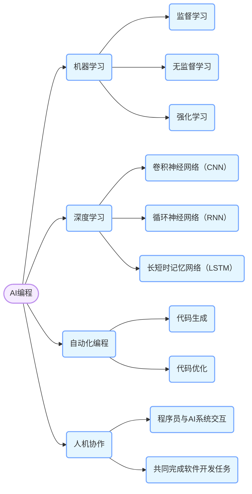

# AI编程的未来：程序员的角色转变

> 关键词：AI编程、程序员角色转变、人工智能、软件开发、未来趋势、自动化编程、人机协作

> 摘要：本文深入探讨了AI编程的发展对程序员角色带来的转变。首先介绍了相关背景，包括目的、预期读者、文档结构和术语表。接着阐述了AI编程的核心概念与联系，通过文本示意图和Mermaid流程图进行说明。详细讲解了核心算法原理及具体操作步骤，使用Python源代码进行阐述。分析了数学模型和公式，并举例说明。通过项目实战展示了代码实际案例及详细解释。探讨了AI编程的实际应用场景，推荐了相关的学习资源、开发工具框架和论文著作。最后总结了未来发展趋势与挑战，提供了常见问题与解答以及扩展阅读和参考资料，旨在帮助程序员更好地理解和适应AI编程带来的角色转变。

## 1. 背景介绍 
### 1.1 目的和范围
随着人工智能技术的飞速发展，AI编程已经成为软件开发领域的重要组成部分。本文章的目的在于全面探讨AI编程的发展对程序员角色产生的影响，分析程序员在未来AI编程环境中需要具备的新技能和能力，以及如何应对这些转变。范围涵盖了AI编程的核心概念、算法原理、实际应用场景、未来发展趋势等多个方面，旨在为程序员和相关从业者提供一个深入了解AI编程未来发展的参考。

### 1.2 预期读者
本文预期读者主要包括程序员、软件开发者、软件架构师、CTO等IT领域的专业人士，以及对AI编程和程序员职业发展感兴趣的学生和研究人员。通过阅读本文，读者可以了解AI编程的最新发展动态，掌握应对角色转变的方法和策略。

### 1.3 文档结构概述
本文将按照以下结构进行组织：首先介绍相关背景知识，包括目的、预期读者、文档结构和术语表；接着阐述AI编程的核心概念与联系，通过文本示意图和Mermaid流程图进行说明；详细讲解核心算法原理及具体操作步骤，使用Python源代码进行阐述；分析数学模型和公式，并举例说明；通过项目实战展示代码实际案例及详细解释；探讨AI编程的实际应用场景；推荐相关的学习资源、开发工具框架和论文著作；最后总结未来发展趋势与挑战，提供常见问题与解答以及扩展阅读和参考资料。

### 1.4 术语表
#### 1.4.1 核心术语定义
- **AI编程**：指利用人工智能技术进行软件开发的过程，包括使用机器学习、深度学习等算法实现自动化编程、智能代码生成等功能。
- **程序员角色转变**：指随着AI编程的发展，程序员的工作职责、技能要求和职业发展路径发生的变化。
- **自动化编程**：指利用人工智能技术自动生成代码的过程，减少程序员的手动编码工作量。
- **人机协作**：指程序员与人工智能系统之间的协作，充分发挥两者的优势，提高软件开发效率和质量。

#### 1.4.2 相关概念解释
- **机器学习**：是一门多领域交叉学科，涉及概率论、统计学、逼近论、凸分析、算法复杂度理论等多门学科。它专门研究计算机怎样模拟或实现人类的学习行为，以获取新的知识或技能，重新组织已有的知识结构使之不断改善自身的性能。
- **深度学习**：是机器学习的一个分支领域，它是一种基于对数据进行表征学习的方法。深度学习通过构建具有很多层的神经网络模型，自动从大量数据中学习特征和模式，从而实现图像识别、语音识别、自然语言处理等复杂任务。

#### 1.4.3 缩略词列表
- **AI**：Artificial Intelligence，人工智能
- **ML**：Machine Learning，机器学习
- **DL**：Deep Learning，深度学习
- **IDE**：Integrated Development Environment，集成开发环境

## 2. 核心概念与联系 

### 核心概念原理
AI编程的核心概念主要包括机器学习、深度学习、自动化编程和人机协作等。机器学习是AI编程的基础，通过训练模型从数据中学习模式和规律，实现对未知数据的预测和分类。深度学习是机器学习的一种特殊形式，通过构建深度神经网络模型，自动提取数据的高级特征，在图像识别、语音识别等领域取得了显著的成果。自动化编程则是利用机器学习和深度学习技术，自动生成代码，减少程序员的手动编码工作量。人机协作则强调程序员与人工智能系统之间的协作，充分发挥两者的优势，提高软件开发效率和质量。

### 架构的文本示意图
```plaintext
AI编程
|-- 机器学习
|   |-- 监督学习
|   |-- 无监督学习
|   |-- 强化学习
|-- 深度学习
|   |-- 卷积神经网络（CNN）
|   |-- 循环神经网络（RNN）
|   |-- 长短时记忆网络（LSTM）
|-- 自动化编程
|   |-- 代码生成
|   |-- 代码优化
|-- 人机协作
|   |-- 程序员与AI系统交互
|   |-- 共同完成软件开发任务
```

### Mermaid流程图


## 3. 核心算法原理 & 具体操作步骤 

### 机器学习算法原理
机器学习算法主要分为监督学习、无监督学习和强化学习。下面以监督学习中的线性回归算法为例，详细讲解其原理和具体操作步骤。

#### 线性回归算法原理
线性回归是一种用于建立自变量和因变量之间线性关系的机器学习算法。其基本模型可以表示为：

$$y = \theta_0 + \theta_1x_1 + \theta_2x_2 + \cdots + \theta_nx_n + \epsilon$$

其中，$y$ 是因变量，$x_1, x_2, \cdots, x_n$ 是自变量，$\theta_0, \theta_1, \cdots, \theta_n$ 是模型的参数，$\epsilon$ 是误差项。线性回归的目标是通过训练数据找到最优的参数 $\theta$，使得模型的预测值与真实值之间的误差最小。

#### 具体操作步骤
1. **数据准备**：收集和整理训练数据，包括自变量和因变量。
2. **模型选择**：选择线性回归模型。
3. **模型训练**：使用训练数据对模型进行训练，找到最优的参数 $\theta$。
4. **模型评估**：使用测试数据对训练好的模型进行评估，计算模型的误差。
5. **模型预测**：使用训练好的模型对新的数据进行预测。

### Python源代码实现
```python
import numpy as np
from sklearn.linear_model import LinearRegression
from sklearn.model_selection import train_test_split
from sklearn.metrics import mean_squared_error

# 生成示例数据
np.random.seed(0)
X = np.random.rand(100, 1)
y = 2 * X + 1 + 0.5 * np.random.randn(100, 1)

# 划分训练集和测试集
X_train, X_test, y_train, y_test = train_test_split(X, y, test_size=0.2, random_state=42)

# 创建线性回归模型
model = LinearRegression()

# 训练模型
model.fit(X_train, y_train)

# 预测
y_pred = model.predict(X_test)

# 评估模型
mse = mean_squared_error(y_test, y_pred)
print(f"Mean Squared Error: {mse}")
```

### 代码解释
1. **数据生成**：使用 `np.random.rand` 生成自变量 $X$，并根据线性关系生成因变量 $y$，同时添加一些噪声。
2. **数据划分**：使用 `train_test_split` 函数将数据划分为训练集和测试集。
3. **模型创建**：使用 `LinearRegression` 类创建线性回归模型。
4. **模型训练**：使用 `fit` 方法对模型进行训练。
5. **模型预测**：使用 `predict` 方法对测试数据进行预测。
6. **模型评估**：使用 `mean_squared_error` 函数计算模型的均方误差。

## 4. 数学模型和公式 & 详细讲解 & 举例说明 

### 线性回归的数学模型和公式
线性回归的数学模型可以表示为：

$$y = \theta_0 + \theta_1x_1 + \theta_2x_2 + \cdots + \theta_nx_n + \epsilon$$

其中，$y$ 是因变量，$x_1, x_2, \cdots, x_n$ 是自变量，$\theta_0, \theta_1, \cdots, \theta_n$ 是模型的参数，$\epsilon$ 是误差项。

为了找到最优的参数 $\theta$，我们通常使用最小二乘法。最小二乘法的目标是最小化误差平方和：

$$J(\theta) = \frac{1}{2m} \sum_{i=1}^{m} (h_{\theta}(x^{(i)}) - y^{(i)})^2$$

其中，$m$ 是训练数据的数量，$h_{\theta}(x^{(i)})$ 是模型对第 $i$ 个训练数据的预测值，$y^{(i)}$ 是第 $i$ 个训练数据的真实值。

为了最小化 $J(\theta)$，我们可以对 $\theta$ 求偏导数，并令其等于 0：

$$\frac{\partial J(\theta)}{\partial \theta_j} = \frac{1}{m} \sum_{i=1}^{m} (h_{\theta}(x^{(i)}) - y^{(i)})x_j^{(i)} = 0$$

通过求解上述方程，我们可以得到最优的参数 $\theta$。

### 举例说明
假设我们有以下训练数据：

| $x$ | $y$ |
|---|---|
| 1 | 3 |
| 2 | 5 |
| 3 | 7 |

我们可以使用线性回归模型来拟合这些数据。首先，我们可以将数据表示为矩阵形式：

$$X = \begin{bmatrix} 1 & 1 \\ 1 & 2 \\ 1 & 3 \end{bmatrix}, y = \begin{bmatrix} 3 \\ 5 \\ 7 \end{bmatrix}$$

然后，我们可以使用最小二乘法求解最优的参数 $\theta$：

$$\theta = (X^T X)^{-1} X^T y$$

计算可得：

$$X^T X = \begin{bmatrix} 3 & 6 \\ 6 & 14 \end{bmatrix}, (X^T X)^{-1} = \frac{1}{6} \begin{bmatrix} 14 & -6 \\ -6 & 3 \end{bmatrix}, X^T y = \begin{bmatrix} 15 \\ 34 \end{bmatrix}$$

$$\theta = \frac{1}{6} \begin{bmatrix} 14 & -6 \\ -6 & 3 \end{bmatrix} \begin{bmatrix} 15 \\ 34 \end{bmatrix} = \begin{bmatrix} 1 \\ 2 \end{bmatrix}$$

因此，最优的参数 $\theta$ 为 $\theta_0 = 1$，$\theta_1 = 2$，线性回归模型为 $y = 1 + 2x$。

## 5. 项目实战：代码实际案例和详细解释说明 

### 5.1  开发环境搭建
在进行项目实战之前，我们需要搭建开发环境。以下是搭建开发环境的步骤：

1. **安装Python**：从Python官方网站（https://www.python.org/downloads/）下载并安装Python 3.x 版本。
2. **安装虚拟环境**：使用 `pip` 安装 `virtualenv` 工具，用于创建虚拟环境。
```bash
pip install virtualenv
```
3. **创建虚拟环境**：在项目目录下创建虚拟环境。
```bash
virtualenv venv
```
4. **激活虚拟环境**：在Windows系统中，使用以下命令激活虚拟环境：
```bash
venv\Scripts\activate
```
在Linux或Mac系统中，使用以下命令激活虚拟环境：
```bash
source venv/bin/activate
```
5. **安装依赖库**：使用 `pip` 安装项目所需的依赖库，如 `numpy`、`pandas`、`scikit-learn` 等。
```bash
pip install numpy pandas scikit-learn
```

### 5.2  源代码详细实现和代码解读
我们以一个简单的房价预测项目为例，详细介绍源代码的实现和解读。

#### 项目背景
我们有一个包含房屋面积、卧室数量和房价的数据集，我们的目标是使用线性回归模型来预测房价。

#### 源代码实现
```python
import numpy as np
import pandas as pd
from sklearn.linear_model import LinearRegression
from sklearn.model_selection import train_test_split
from sklearn.metrics import mean_squared_error

# 加载数据集
data = pd.read_csv('housing.csv')

# 提取特征和标签
X = data[['area', 'bedrooms']].values
y = data['price'].values

# 划分训练集和测试集
X_train, X_test, y_train, y_test = train_test_split(X, y, test_size=0.2, random_state=42)

# 创建线性回归模型
model = LinearRegression()

# 训练模型
model.fit(X_train, y_train)

# 预测
y_pred = model.predict(X_test)

# 评估模型
mse = mean_squared_error(y_test, y_pred)
print(f"Mean Squared Error: {mse}")
```

#### 代码解读
1. **数据加载**：使用 `pandas` 库的 `read_csv` 函数加载数据集。
2. **特征提取**：从数据集中提取房屋面积和卧室数量作为特征，房价作为标签。
3. **数据划分**：使用 `train_test_split` 函数将数据划分为训练集和测试集。
4. **模型创建**：使用 `LinearRegression` 类创建线性回归模型。
5. **模型训练**：使用 `fit` 方法对模型进行训练。
6. **模型预测**：使用 `predict` 方法对测试数据进行预测。
7. **模型评估**：使用 `mean_squared_error` 函数计算模型的均方误差。

### 5.3  代码解读与分析
通过上述代码，我们可以看到线性回归模型的基本实现流程。首先，我们需要加载数据集并提取特征和标签。然后，我们将数据划分为训练集和测试集，以便评估模型的性能。接着，我们创建线性回归模型并使用训练数据进行训练。最后，我们使用测试数据进行预测，并计算模型的均方误差。

在实际应用中，我们可以对模型进行进一步的优化，如特征工程、模型选择、超参数调优等，以提高模型的性能。

## 6. 实际应用场景 
AI编程在各个领域都有广泛的应用，以下是一些常见的实际应用场景：

### 软件开发
AI编程可以帮助程序员自动生成代码、优化代码结构、检测代码漏洞等，提高软件开发效率和质量。例如，一些智能代码编辑器可以根据程序员的输入自动推荐代码片段，减少手动编码工作量。

### 数据分析
AI编程可以用于数据分析和数据挖掘，帮助企业从海量数据中提取有价值的信息。例如，使用机器学习算法对用户行为数据进行分析，预测用户的购买行为，为企业提供精准的营销策略。

### 图像识别
AI编程在图像识别领域取得了显著的成果，如人脸识别、物体检测、图像分类等。例如，人脸识别技术可以用于门禁系统、安防监控等领域，提高安全性和便利性。

### 自然语言处理
AI编程在自然语言处理领域也有广泛的应用，如机器翻译、语音识别、文本分类等。例如，语音助手可以通过语音识别技术识别用户的语音指令，并通过自然语言处理技术理解用户的意图，为用户提供相应的服务。

### 医疗保健
AI编程可以用于医疗保健领域，如疾病诊断、医学影像分析、药物研发等。例如，使用深度学习算法对医学影像进行分析，帮助医生快速准确地诊断疾病。

## 7. 工具和资源推荐
### 7.1 学习资源推荐
#### 7.1.1 书籍推荐
- 《机器学习》（周志华著）：这本书是机器学习领域的经典教材，系统地介绍了机器学习的基本概念、算法和应用。
- 《深度学习》（Ian Goodfellow、Yoshua Bengio和Aaron Courville著）：这本书是深度学习领域的权威著作，详细介绍了深度学习的原理、算法和应用。
- 《Python机器学习》（Sebastian Raschka和Vahid Mirjalili著）：这本书结合Python语言，介绍了机器学习的基本算法和实践应用。

#### 7.1.2 在线课程
- Coursera上的“机器学习”课程（Andrew Ng教授主讲）：这是一门非常经典的机器学习课程，系统地介绍了机器学习的基本概念、算法和应用。
- edX上的“深度学习微硕士项目”：这是一个系列课程，涵盖了深度学习的各个方面，包括卷积神经网络、循环神经网络、强化学习等。
- 哔哩哔哩上的“吴恩达深度学习课程中文笔记”：这是一个基于吴恩达深度学习课程的中文笔记视频，适合初学者学习。

#### 7.1.3 技术博客和网站
- 机器之心（https://www.alldatasheet.com/）：这是一个专注于人工智能领域的技术博客，提供了大量的人工智能技术文章和行业动态。
- 深度学习前沿（https://deeplearningfrontier.com/）：这是一个专注于深度学习领域的技术博客，提供了深度学习的最新研究成果和应用案例。
- 开源中国（https://www.oschina.net/）：这是一个开源技术社区，提供了大量的开源项目和技术文章。

### 7.2 开发工具框架推荐
#### 7.2.1 IDE和编辑器
- PyCharm：这是一个专门为Python开发设计的集成开发环境，提供了代码编辑、调试、版本控制等功能。
- Visual Studio Code：这是一个轻量级的代码编辑器，支持多种编程语言，并且有丰富的插件扩展功能。
- Jupyter Notebook：这是一个交互式的开发环境，适合进行数据分析和机器学习实验。

#### 7.2.2 调试和性能分析工具
- PDB：这是Python自带的调试工具，可以帮助程序员调试代码。
- Py-Spy：这是一个性能分析工具，可以帮助程序员分析代码的性能瓶颈。
- TensorBoard：这是TensorFlow的可视化工具，可以帮助程序员可视化训练过程和模型结构。

#### 7.2.3 相关框架和库
- TensorFlow：这是一个开源的机器学习框架，由Google开发，广泛应用于深度学习领域。
- PyTorch：这是一个开源的深度学习框架，由Facebook开发，具有动态图的优势，适合进行研究和开发。
- Scikit-learn：这是一个开源的机器学习库，提供了丰富的机器学习算法和工具，适合初学者使用。

### 7.3 相关论文著作推荐
#### 7.3.1 经典论文
- “Gradient-Based Learning Applied to Document Recognition”（Yann LeCun、Léon Bottou、Yoshua Bengio和Patrick Haffner著）：这篇论文介绍了卷积神经网络（CNN）的基本原理和应用，是深度学习领域的经典论文之一。
- “Long Short-Term Memory”（Sepp Hochreiter和Jürgen Schmidhuber著）：这篇论文介绍了长短时记忆网络（LSTM）的基本原理和应用，是循环神经网络（RNN）领域的经典论文之一。
- “Attention Is All You Need”（Ashish Vaswani、Noam Shazeer、Niki Parmar等著）：这篇论文介绍了Transformer模型的基本原理和应用，是自然语言处理领域的重要论文之一。

#### 7.3.2 最新研究成果
- 关注顶级学术会议，如NeurIPS、ICML、CVPR等，这些会议会发表人工智能领域的最新研究成果。
- 关注知名学术期刊，如Journal of Artificial Intelligence Research（JAIR）、Artificial Intelligence等，这些期刊会发表人工智能领域的高质量研究论文。

#### 7.3.3 应用案例分析
- 关注各大科技公司的技术博客，如Google AI Blog、Facebook AI Research等，这些博客会分享人工智能技术在实际应用中的案例和经验。
- 关注开源项目，如OpenAI的GPT系列、Hugging Face的Transformers等，这些项目提供了人工智能技术的实际应用案例和代码实现。

## 8. 总结：未来发展趋势与挑战
### 未来发展趋势
- **自动化编程的普及**：随着AI技术的不断发展，自动化编程将越来越普及，程序员可以借助AI工具自动生成代码，提高开发效率。
- **人机协作的加强**：程序员将与人工智能系统更加紧密地协作，充分发挥两者的优势，共同完成软件开发任务。
- **跨领域融合**：AI编程将与其他领域，如物联网、区块链、云计算等深度融合，创造出更多的创新应用。
- **个性化编程**：AI技术将根据程序员的习惯和需求，提供个性化的编程辅助，提高程序员的工作效率和满意度。

### 挑战
- **技术更新换代快**：AI技术发展迅速，程序员需要不断学习和更新知识，以适应技术的变化。
- **数据隐私和安全问题**：AI编程需要大量的数据支持，如何保护数据的隐私和安全是一个重要的挑战。
- **就业压力**：自动化编程的发展可能会导致部分程序员岗位的减少，程序员需要不断提升自己的技能，以适应市场的需求。
- **伦理和法律问题**：AI技术的应用可能会带来一些伦理和法律问题，如算法偏见、数据滥用等，需要制定相应的法律法规来规范。

## 9. 附录：常见问题与解答
### 问题1：AI编程会取代程序员吗？
答：AI编程不会完全取代程序员。虽然AI编程可以自动生成代码，但程序员的创造力、逻辑思维和问题解决能力是AI无法替代的。未来，程序员将与AI系统更加紧密地协作，共同完成软件开发任务。

### 问题2：学习AI编程需要具备哪些基础知识？
答：学习AI编程需要具备一定的数学基础，如线性代数、概率论、统计学等，以及编程语言基础，如Python。此外，还需要了解机器学习、深度学习等相关概念和算法。

### 问题3：如何提高AI编程的能力？
答：可以通过学习相关的书籍和在线课程，参加实践项目，阅读优秀的开源代码，关注行业动态等方式来提高AI编程的能力。

### 问题4：AI编程在实际应用中存在哪些问题？
答：AI编程在实际应用中存在数据质量、算法复杂度、模型可解释性、数据隐私和安全等问题。需要在实际应用中不断优化和改进。

## 10. 扩展阅读 & 参考资料
### 扩展阅读
- 《人工智能时代的人类未来》（李开复、王咏刚著）：这本书探讨了人工智能对人类社会的影响和未来发展趋势。
- 《智能时代》（吴军著）：这本书介绍了人工智能在各个领域的应用和发展前景。
- 《未来简史：从智人到神人》（尤瓦尔·赫拉利著）：这本书从人类历史的角度探讨了人工智能对人类未来的影响。

### 参考资料
- 《机器学习》（周志华著）
- 《深度学习》（Ian Goodfellow、Yoshua Bengio和Aaron Courville著）
- 《Python机器学习》（Sebastian Raschka和Vahid Mirjalili著）
- Coursera上的“机器学习”课程（Andrew Ng教授主讲）
- edX上的“深度学习微硕士项目”
- 机器之心（https://www.alldatasheet.com/）
- 深度学习前沿（https://deeplearningfrontier.com/）
- 开源中国（https://www.oschina.net/）
- TensorFlow官方文档（https://www.tensorflow.org/）
- PyTorch官方文档（https://pytorch.org/）
- Scikit-learn官方文档（https://scikit-learn.org/）