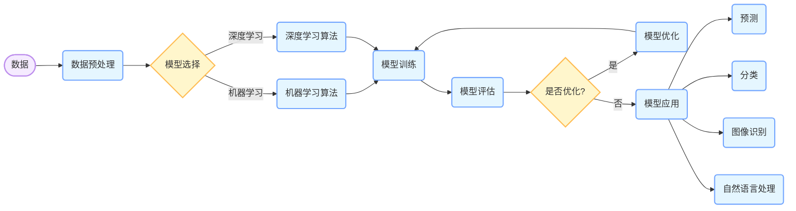

# AI编程：从基础到应用

> 关键词：AI编程、人工智能、机器学习、深度学习、基础概念、算法原理、应用场景

> 摘要：本文旨在全面且深入地探讨AI编程从基础到应用的各个方面。首先介绍AI编程的背景知识，包括目的、预期读者和文档结构等。接着详细阐述核心概念与联系，通过文本示意图和Mermaid流程图进行清晰展示。然后深入讲解核心算法原理，结合Python源代码进行具体操作步骤的说明，并介绍相关数学模型和公式。通过项目实战部分，给出实际代码案例并进行详细解释。还探讨了AI编程的实际应用场景，推荐了学习、开发所需的工具和资源，包括书籍、在线课程、技术博客、开发工具、相关框架和论文著作等。最后总结未来发展趋势与挑战，解答常见问题并提供扩展阅读和参考资料，帮助读者全面了解和掌握AI编程。

## 1. 背景介绍 
### 1.1 目的和范围
AI编程在当今科技领域中具有极其重要的地位，它涵盖了从简单的机器学习算法到复杂的深度学习模型等多个方面。本文的目的在于为读者提供一个全面、系统的AI编程学习指南，从基础概念出发，逐步深入到核心算法原理和实际应用场景。范围包括机器学习、深度学习的基本概念、常见算法、数学模型以及如何在实际项目中运用这些知识进行AI编程。

### 1.2 预期读者
本文预期读者包括对AI编程感兴趣的初学者、想要进一步提升AI编程技能的程序员、相关专业的学生以及对人工智能领域有研究需求的人员。无论你是零基础开始学习，还是已经有一定的编程基础，都能从本文中获得有价值的信息。

### 1.3 文档结构概述
本文将按照以下结构展开：首先介绍AI编程的背景知识，让读者对AI编程有一个初步的了解；接着阐述核心概念与联系，帮助读者建立起AI编程的知识框架；然后详细讲解核心算法原理和具体操作步骤，结合Python代码进行演示；之后介绍数学模型和公式，并通过举例说明加深理解；通过项目实战部分，展示如何将所学知识应用到实际项目中；探讨AI编程的实际应用场景，让读者了解AI编程在不同领域的应用；推荐学习和开发所需的工具和资源；总结未来发展趋势与挑战；解答常见问题并提供扩展阅读和参考资料。

### 1.4 术语表
#### 1.4.1 核心术语定义
- **人工智能（Artificial Intelligence，AI）**：研究如何使计算机能够模拟人类的智能行为，如学习、推理、感知和决策等。
- **机器学习（Machine Learning，ML）**：人工智能的一个分支，致力于开发算法和模型，使计算机能够从数据中学习模式和规律，而无需明确的编程指令。
- **深度学习（Deep Learning，DL）**：机器学习的一个子领域，基于人工神经网络，尤其是深度神经网络，能够自动从大量数据中学习复杂的特征和模式。
- **数据集（Dataset）**：用于训练和测试机器学习或深度学习模型的数据集合。
- **模型（Model）**：根据数据集学习到的模式和规律的数学表示，用于对新数据进行预测或分类。

#### 1.4.2 相关概念解释
- **监督学习（Supervised Learning）**：一种机器学习方法，训练数据包含输入特征和对应的标签，模型通过学习输入特征与标签之间的关系进行预测。
- **无监督学习（Unsupervised Learning）**：训练数据只包含输入特征，没有对应的标签，模型的任务是发现数据中的内在结构和模式。
- **强化学习（Reinforcement Learning）**：智能体通过与环境进行交互，根据环境反馈的奖励信号来学习最优的行为策略。
- **特征（Feature）**：数据集中用于描述样本的属性或变量。
- **标签（Label）**：监督学习中与输入特征对应的正确输出结果。

#### 1.4.3 缩略词列表
- **AI**：Artificial Intelligence（人工智能）
- **ML**：Machine Learning（机器学习）
- **DL**：Deep Learning（深度学习）
- **ANN**：Artificial Neural Network（人工神经网络）
- **CNN**：Convolutional Neural Network（卷积神经网络）
- **RNN**：Recurrent Neural Network（循环神经网络）
- **LSTM**：Long Short - Term Memory（长短期记忆网络）

## 2. 核心概念与联系 

### 核心概念原理
人工智能是一个广泛的领域，机器学习和深度学习是其重要的组成部分。机器学习通过算法从数据中学习模式，这些模式可以用于预测、分类等任务。深度学习则是通过深度神经网络，如多层感知机、卷积神经网络、循环神经网络等，自动学习数据的复杂特征。

机器学习主要分为监督学习、无监督学习和强化学习。监督学习中，模型通过学习有标签的数据来进行预测；无监督学习则是在无标签的数据中发现结构和模式；强化学习通过智能体与环境的交互来学习最优策略。

深度学习的核心是神经网络，神经网络由多个神经元组成，每个神经元接收输入信号，经过激活函数处理后输出结果。多层神经网络可以学习到更复杂的特征和模式。

### 架构的文本示意图
AI编程的整体架构可以描述为：数据是基础，通过数据预处理对数据进行清洗、转换等操作，然后选择合适的机器学习或深度学习算法进行模型训练，训练好的模型经过评估和优化后，可以应用到实际场景中进行预测、分类等任务。

```plaintext
数据
|
|-- 数据预处理
|   |-- 数据清洗
|   |-- 数据转换
|
|-- 模型选择
|   |-- 机器学习算法
|   |   |-- 监督学习算法
|   |   |   |-- 线性回归
|   |   |   |-- 逻辑回归
|   |   |   |-- 决策树
|   |   |   |-- 支持向量机
|   |   |-- 无监督学习算法
|   |   |   |-- 聚类算法
|   |   |   |   |-- K - 均值聚类
|   |   |   |   |-- 层次聚类
|   |   |   |-- 降维算法
|   |   |   |   |-- 主成分分析
|   |   |-- 强化学习算法
|   |       |-- Q - 学习
|   |       |-- 策略梯度算法
|   |-- 深度学习算法
|       |-- 人工神经网络
|       |   |-- 多层感知机
|       |-- 卷积神经网络
|       |-- 循环神经网络
|       |   |-- 长短期记忆网络
|       |   |-- 门控循环单元
|
|-- 模型训练
|
|-- 模型评估
|
|-- 模型优化
|
|-- 模型应用
|   |-- 预测
|   |-- 分类
|   |-- 图像识别
|   |-- 自然语言处理
```

### Mermaid流程图


## 3. 核心算法原理 & 具体操作步骤 

### 线性回归算法原理
线性回归是一种监督学习算法，用于预测连续的数值。其基本原理是通过找到一条直线（在二维空间中）或超平面（在多维空间中），使得数据点到该直线或超平面的距离之和最小。

假设我们有一个数据集 $\{(x_1, y_1), (x_2, y_2), \cdots, (x_n, y_n)\}$，其中 $x_i$ 是输入特征，$y_i$ 是对应的标签。线性回归模型的表达式为：

$y = \theta_0 + \theta_1x_1 + \theta_2x_2 + \cdots + \theta_mx_m$

其中 $\theta_0, \theta_1, \cdots, \theta_m$ 是模型的参数。

为了找到最优的参数 $\theta$，我们通常使用最小二乘法，即最小化预测值与真实值之间的平方误差之和：

$J(\theta) = \frac{1}{2n}\sum_{i = 1}^{n}(h_{\theta}(x^{(i)}) - y^{(i)})^2$

其中 $h_{\theta}(x^{(i)})$ 是模型对第 $i$ 个样本的预测值。

### Python代码实现
```python
import numpy as np

class LinearRegression:
    def __init__(self):
        self.theta = None

    def fit(self, X, y):
        # 在特征矩阵 X 前添加一列全为 1 的列，用于表示截距项
        X_b = np.c_[np.ones((X.shape[0], 1)), X]
        # 使用正规方程求解最优参数 theta
        self.theta = np.linalg.inv(X_b.T.dot(X_b)).dot(X_b.T).dot(y)

    def predict(self, X):
        # 在特征矩阵 X 前添加一列全为 1 的列，用于表示截距项
        X_b = np.c_[np.ones((X.shape[0], 1)), X]
        # 计算预测值
        return X_b.dot(self.theta)

# 生成一些示例数据
X = np.array([[1], [2], [3], [4], [5]])
y = np.array([2, 4, 6, 8, 10])

# 创建线性回归模型实例
model = LinearRegression()
# 训练模型
model.fit(X, y)
# 进行预测
new_X = np.array([[6]])
prediction = model.predict(new_X)
print("预测值:", prediction)
```

### 代码解释
1. **`__init__` 方法**：初始化模型的参数 `theta` 为 `None`。
2. **`fit` 方法**：在特征矩阵 `X` 前添加一列全为 1 的列，用于表示截距项。然后使用正规方程求解最优参数 `theta`。
3. **`predict` 方法**：在特征矩阵 `X` 前添加一列全为 1 的列，然后使用训练好的参数 `theta` 计算预测值。
4. **示例数据**：生成一些简单的示例数据 `X` 和 `y`，创建线性回归模型实例，训练模型并进行预测。

### 逻辑回归算法原理
逻辑回归是一种用于分类的监督学习算法，它通过逻辑函数将线性回归的输出映射到 $[0, 1]$ 之间的概率值。

逻辑函数（也称为 sigmoid 函数）的表达式为：

$\sigma(z) = \frac{1}{1 + e^{-z}}$

其中 $z = \theta_0 + \theta_1x_1 + \theta_2x_2 + \cdots + \theta_mx_m$。

逻辑回归的目标是最大化对数似然函数：

$L(\theta) = \sum_{i = 1}^{n}[y^{(i)}\log(h_{\theta}(x^{(i)})) + (1 - y^{(i)})\log(1 - h_{\theta}(x^{(i)}))]$

其中 $h_{\theta}(x^{(i)})$ 是模型对第 $i$ 个样本的预测概率。

### Python代码实现
```python
import numpy as np

class LogisticRegression:
    def __init__(self, learning_rate=0.01, num_iterations=1000):
        self.learning_rate = learning_rate
        self.num_iterations = num_iterations
        self.weights = None
        self.bias = None

    def sigmoid(self, z):
        return 1 / (1 + np.exp(-z))

    def fit(self, X, y):
        num_samples, num_features = X.shape
        self.weights = np.zeros(num_features)
        self.bias = 0

        for _ in range(self.num_iterations):
            linear_model = np.dot(X, self.weights) + self.bias
            y_pred = self.sigmoid(linear_model)

            dw = (1 / num_samples) * np.dot(X.T, (y_pred - y))
            db = (1 / num_samples) * np.sum(y_pred - y)

            self.weights -= self.learning_rate * dw
            self.bias -= self.learning_rate * db

    def predict(self, X):
        linear_model = np.dot(X, self.weights) + self.bias
        y_pred = self.sigmoid(linear_model)
        y_pred_cls = [1 if i > 0.5 else 0 for i in y_pred]
        return np.array(y_pred_cls)

# 生成一些示例数据
X = np.array([[1], [2], [3], [4], [5]])
y = np.array([0, 0, 1, 1, 1])

# 创建逻辑回归模型实例
model = LogisticRegression()
# 训练模型
model.fit(X, y)
# 进行预测
new_X = np.array([[6]])
prediction = model.predict(new_X)
print("预测类别:", prediction)
```

### 代码解释
1. **`__init__` 方法**：初始化学习率、迭代次数、权重和偏置。
2. **`sigmoid` 方法**：实现 sigmoid 函数。
3. **`fit` 方法**：使用梯度下降法更新权重和偏置，通过迭代多次来最小化对数似然函数的负损失。
4. **`predict` 方法**：计算预测概率，将概率大于 0.5 的样本预测为 1，否则预测为 0。
5. **示例数据**：生成一些简单的示例数据 `X` 和 `y`，创建逻辑回归模型实例，训练模型并进行预测。

## 4. 数学模型和公式 & 详细讲解 & 举例说明 

### 线性回归的数学模型和公式
线性回归的数学模型为：

$y = \theta_0 + \theta_1x_1 + \theta_2x_2 + \cdots + \theta_mx_m + \epsilon$

其中 $\epsilon$ 是误差项，通常假设其服从均值为 0，方差为 $\sigma^2$ 的正态分布。

最小二乘法的目标是最小化误差平方和：

$J(\theta) = \frac{1}{2n}\sum_{i = 1}^{n}(h_{\theta}(x^{(i)}) - y^{(i)})^2$

通过对 $J(\theta)$ 求偏导数并令其等于 0，可以得到正规方程：

$\theta = (X^TX)^{-1}X^Ty$

其中 $X$ 是特征矩阵，$y$ 是标签向量。

### 举例说明
假设我们有以下数据集：

| $x$ | $y$ |
|---|---|
| 1 | 2 |
| 2 | 4 |
| 3 | 6 |

我们可以使用线性回归模型来拟合这些数据。首先，构建特征矩阵 $X$ 和标签向量 $y$：

$X = \begin{bmatrix} 1 & 1 \\ 1 & 2 \\ 1 & 3 \end{bmatrix}$，$y = \begin{bmatrix} 2 \\ 4 \\ 6 \end{bmatrix}$

然后，计算 $(X^TX)^{-1}X^Ty$：

$X^TX = \begin{bmatrix} 1 & 1 & 1 \\ 1 & 2 & 3 \end{bmatrix}\begin{bmatrix} 1 & 1 \\ 1 & 2 \\ 1 & 3 \end{bmatrix} = \begin{bmatrix} 3 & 6 \\ 6 & 14 \end{bmatrix}$

$(X^TX)^{-1} = \frac{1}{3\times14 - 6\times6}\begin{bmatrix} 14 & -6 \\ -6 & 3 \end{bmatrix} = \begin{bmatrix} \frac{7}{3} & -1 \\ -1 & \frac{1}{2} \end{bmatrix}$

$(X^TX)^{-1}X^T = \begin{bmatrix} \frac{7}{3} & -1 \\ -1 & \frac{1}{2} \end{bmatrix}\begin{bmatrix} 1 & 1 & 1 \\ 1 & 2 & 3 \end{bmatrix} = \begin{bmatrix} \frac{4}{3} & \frac{1}{3} & -\frac{2}{3} \\ -\frac{1}{2} & 0 & \frac{1}{2} \end{bmatrix}$

$(X^TX)^{-1}X^Ty = \begin{bmatrix} \frac{4}{3} & \frac{1}{3} & -\frac{2}{3} \\ -\frac{1}{2} & 0 & \frac{1}{2} \end{bmatrix}\begin{bmatrix} 2 \\ 4 \\ 6 \end{bmatrix} = \begin{bmatrix} 0 \\ 2 \end{bmatrix}$

所以，$\theta_0 = 0$，$\theta_1 = 2$，线性回归模型为 $y = 2x$。

### 逻辑回归的数学模型和公式
逻辑回归的数学模型为：

$P(y = 1|x) = \sigma(\theta_0 + \theta_1x_1 + \theta_2x_2 + \cdots + \theta_mx_m)$

其中 $\sigma(z) = \frac{1}{1 + e^{-z}}$ 是 sigmoid 函数。

对数似然函数为：

$L(\theta) = \sum_{i = 1}^{n}[y^{(i)}\log(h_{\theta}(x^{(i)})) + (1 - y^{(i)})\log(1 - h_{\theta}(x^{(i)}))]$

梯度下降法的更新公式为：

$\theta_j := \theta_j - \alpha\frac{\partial L(\theta)}{\partial \theta_j}$

其中 $\alpha$ 是学习率。

### 举例说明
假设我们有以下数据集：

| $x$ | $y$ |
|---|---|
| 1 | 0 |
| 2 | 0 |
| 3 | 1 |

我们使用逻辑回归模型来拟合这些数据。首先，初始化参数 $\theta_0 = 0$，$\theta_1 = 0$，学习率 $\alpha = 0.1$。

对于第一个样本 $(x_1 = 1, y_1 = 0)$：

$z = \theta_0 + \theta_1x_1 = 0$

$h_{\theta}(x_1) = \sigma(z) = \frac{1}{1 + e^{-0}} = 0.5$

$\frac{\partial L(\theta)}{\partial \theta_0} = h_{\theta}(x_1) - y_1 = 0.5 - 0 = 0.5$

$\frac{\partial L(\theta)}{\partial \theta_1} = (h_{\theta}(x_1) - y_1)x_1 = 0.5\times1 = 0.5$

更新参数：

$\theta_0 := \theta_0 - \alpha\frac{\partial L(\theta)}{\partial \theta_0} = 0 - 0.1\times0.5 = -0.05$

$\theta_1 := \theta_1 - \alpha\frac{\partial L(\theta)}{\partial \theta_1} = 0 - 0.1\times0.5 = -0.05$

重复以上步骤，直到收敛。

## 5. 项目实战：代码实际案例和详细解释说明 

### 5.1  开发环境搭建
#### 安装 Python
首先，需要安装 Python 环境。可以从 Python 官方网站（https://www.python.org/downloads/） 下载适合你操作系统的 Python 安装包，按照安装向导进行安装。

#### 安装必要的库
使用 `pip` 安装以下必要的库：
```sh
pip install numpy pandas matplotlib scikit-learn tensorflow keras
```
- **`numpy`**：用于数值计算。
- **`pandas`**：用于数据处理和分析。
- **`matplotlib`**：用于数据可视化。
- **`scikit-learn`**：提供了丰富的机器学习算法和工具。
- **`tensorflow`** 和 **`keras`**：用于深度学习模型的开发。

### 5.2  源代码详细实现和代码解读
#### 项目描述
我们将使用鸢尾花数据集进行分类任务，使用逻辑回归算法构建分类模型。

#### 代码实现
```python
import numpy as np
import pandas as pd
from sklearn.datasets import load_iris
from sklearn.model_selection import train_test_split
from sklearn.linear_model import LogisticRegression
from sklearn.metrics import accuracy_score
import matplotlib.pyplot as plt

# 加载鸢尾花数据集
iris = load_iris()
X = iris.data
y = iris.target

# 划分训练集和测试集
X_train, X_test, y_train, y_test = train_test_split(X, y, test_size=0.2, random_state=42)

# 创建逻辑回归模型实例
model = LogisticRegression()

# 训练模型
model.fit(X_train, y_train)

# 进行预测
y_pred = model.predict(X_test)

# 计算准确率
accuracy = accuracy_score(y_test, y_pred)
print("准确率:", accuracy)

# 可视化部分特征
plt.scatter(X[:, 0], X[:, 1], c=y, cmap='viridis')
plt.xlabel('Sepal length')
plt.ylabel('Sepal width')
plt.title('Iris Dataset')
plt.show()
```

#### 代码解读
1. **数据加载**：使用 `sklearn.datasets.load_iris()` 加载鸢尾花数据集，将特征数据存储在 `X` 中，标签数据存储在 `y` 中。
2. **数据划分**：使用 `train_test_split` 函数将数据集划分为训练集和测试集，测试集占比为 20%。
3. **模型创建**：创建 `LogisticRegression` 模型实例。
4. **模型训练**：使用训练集数据 `X_train` 和 `y_train` 对模型进行训练。
5. **模型预测**：使用训练好的模型对测试集数据 `X_test` 进行预测，得到预测结果 `y_pred`。
6. **准确率计算**：使用 `accuracy_score` 函数计算预测结果的准确率。
7. **数据可视化**：使用 `matplotlib` 库绘制散点图，展示鸢尾花数据集的部分特征。

### 5.3  代码解读与分析
#### 模型选择
选择逻辑回归模型是因为鸢尾花数据集是一个分类问题，逻辑回归是一种简单而有效的分类算法，适用于多分类问题。

#### 数据划分
将数据集划分为训练集和测试集的目的是为了评估模型的泛化能力。训练集用于训练模型，测试集用于验证模型在未见过的数据上的性能。

#### 准确率评估
准确率是分类问题中常用的评估指标，它表示预测正确的样本数占总样本数的比例。在这个项目中，准确率可以直观地反映模型的分类性能。

#### 数据可视化
通过可视化数据，我们可以更直观地了解数据集的分布情况，帮助我们更好地理解数据和模型的性能。

## 6. 实际应用场景 
### 图像识别
AI编程在图像识别领域有广泛的应用，如人脸识别、物体检测、图像分类等。例如，在安防领域，人脸识别技术可以用于门禁系统、监控系统等；在医疗领域，图像识别技术可以帮助医生诊断疾病，如通过X光、CT等图像检测病变。

### 自然语言处理
自然语言处理是AI编程的另一个重要应用领域，包括机器翻译、语音识别、文本分类、情感分析等。例如，智能语音助手可以实现语音交互，将用户的语音指令转换为文本并执行相应的操作；机器翻译系统可以实现不同语言之间的自动翻译。

### 推荐系统
推荐系统在电商、社交媒体、视频平台等领域有广泛的应用。通过分析用户的历史行为和偏好，推荐系统可以为用户推荐个性化的商品、内容等。例如，电商平台根据用户的浏览和购买记录推荐相关的商品，视频平台根据用户的观看历史推荐感兴趣的视频。

### 金融领域
在金融领域，AI编程可以用于风险评估、欺诈检测、股票预测等。例如，银行可以使用AI模型评估贷款申请人的信用风险，降低贷款违约的概率；金融机构可以通过分析交易数据检测欺诈行为，保障用户的资金安全。

### 医疗领域
AI编程在医疗领域的应用越来越广泛，如疾病诊断、药物研发、医疗影像分析等。例如，通过分析患者的病历数据和基因信息，AI模型可以辅助医生进行疾病诊断；在药物研发过程中，AI可以帮助筛选潜在的药物分子，提高研发效率。

## 7. 工具和资源推荐
### 7.1 学习资源推荐
#### 7.1.1 书籍推荐
- **《机器学习》（周志华著）**：也被称为“西瓜书”，全面介绍了机器学习的基本概念、算法和理论，是机器学习领域的经典教材。
- **《深度学习》（Ian Goodfellow、Yoshua Bengio和Aaron Courville著）**：由深度学习领域的三位顶尖专家撰写，系统地介绍了深度学习的理论和实践。
- **《Python机器学习》（Sebastian Raschka和Vahid Mirjalili著）**：结合Python语言，详细介绍了机器学习的算法和实现，适合初学者学习。

#### 7.1.2 在线课程
- **Coursera上的《机器学习》课程（Andrew Ng主讲）**：由机器学习领域的知名专家Andrew Ng主讲，课程内容丰富，讲解深入浅出，是学习机器学习的经典课程。
- **edX上的《深度学习》系列课程**：由深度学习领域的权威机构和专家授课，提供了深度学习的深入学习资源。
- **Udemy上的《Python for Data Science and Machine Learning Bootcamp》**：结合Python语言，介绍了数据科学和机器学习的基础知识和实践。

#### 7.1.3 技术博客和网站
- **Medium**：有许多关于AI编程的技术博客和文章，涵盖了机器学习、深度学习等多个领域。
- **Towards Data Science**：专注于数据科学和机器学习领域的技术博客，提供了大量的优质文章和教程。
- **ArXiv**：提供了最新的学术论文，包括AI编程领域的研究成果。

### 7.2 开发工具框架推荐
#### 7.2.1 IDE和编辑器
- **PyCharm**：一款专业的Python集成开发环境，提供了丰富的功能和插件，适合Python开发。
- **Jupyter Notebook**：一个交互式的开发环境，支持Python等多种编程语言，方便进行数据探索和模型开发。
- **Visual Studio Code**：一款轻量级的代码编辑器，支持多种编程语言，通过安装插件可以实现强大的开发功能。

#### 7.2.2 调试和性能分析工具
- **TensorBoard**：TensorFlow提供的可视化工具，可以帮助用户监控模型训练过程、分析模型性能。
- **PyTorch Profiler**：PyTorch提供的性能分析工具，可以帮助用户分析模型的运行时间和内存使用情况。
- **Scikit-learn的GridSearchCV**：用于模型超参数调优的工具，可以帮助用户找到最优的超参数组合。

#### 7.2.3 相关框架和库
- **TensorFlow**：一个开源的深度学习框架，提供了丰富的工具和库，支持大规模的分布式训练。
- **PyTorch**：一个动态图的深度学习框架，易于使用和调试，受到了学术界和工业界的广泛关注。
- **Scikit-learn**：一个简单而有效的机器学习库，提供了丰富的机器学习算法和工具，适合初学者和快速原型开发。

### 7.3 相关论文著作推荐
#### 7.3.1 经典论文
- **《Gradient-Based Learning Applied to Document Recognition》（Yann LeCun、Léon Bottou、Yoshua Bengio和Patrick Haffner著）**：介绍了卷积神经网络（CNN）的经典论文，对图像识别领域产生了深远的影响。
- **《Long Short-Term Memory》（Sepp Hochreiter和Jürgen Schmidhuber著）**：提出了长短期记忆网络（LSTM）的经典论文，解决了循环神经网络（RNN）中的梯度消失问题。
- **《Attention Is All You Need》（Ashish Vaswani等人著）**：提出了Transformer架构的经典论文，在自然语言处理领域取得了巨大的成功。

#### 7.3.2 最新研究成果
- 可以通过ArXiv、ACM Digital Library、IEEE Xplore等学术数据库查找最新的AI编程研究成果。

#### 7.3.3 应用案例分析
- **《AI in Healthcare: A Comprehensive Overview》**：介绍了AI在医疗领域的应用案例和研究进展。
- **《AI in Finance: Transforming the Financial Industry》**：探讨了AI在金融领域的应用和发展趋势。

## 8. 总结：未来发展趋势与挑战
### 未来发展趋势
#### 多模态融合
未来的AI编程将更加注重多模态数据的融合，如将图像、语音、文本等多种数据类型结合起来，实现更加智能和全面的应用。例如，智能客服系统可以同时处理用户的语音和文本输入，提供更加准确和个性化的服务。

#### 强化学习的广泛应用
强化学习在自动驾驶、机器人控制、游戏等领域已经取得了一定的成果，未来将在更多领域得到广泛应用。例如，在工业自动化中，强化学习可以用于优化生产流程，提高生产效率。

#### 边缘计算与AI的结合
随着物联网的发展，边缘设备产生的数据量越来越大。将AI算法部署到边缘设备上，可以实现实时的数据处理和决策，减少数据传输延迟。例如，在智能安防领域，边缘设备可以实时进行图像识别和分析，及时发现异常情况。

#### 可解释性AI
随着AI技术的广泛应用，人们对AI模型的可解释性要求越来越高。未来的AI编程将更加注重模型的可解释性，开发出能够解释其决策过程和结果的AI模型。例如，在医疗领域，医生需要了解AI模型的诊断依据，以便更好地进行临床决策。

### 挑战
#### 数据隐私和安全
AI编程需要大量的数据进行训练，这些数据可能包含用户的敏感信息。如何保护数据的隐私和安全是一个重要的挑战。例如，在金融领域，用户的交易数据和个人信息需要得到严格的保护，防止数据泄露和滥用。

#### 算法偏见
AI模型的训练数据可能存在偏见，导致模型的预测结果也存在偏见。例如，在招聘过程中，AI模型可能因为训练数据的偏见而对某些群体产生歧视。如何消除算法偏见是一个亟待解决的问题。

#### 计算资源需求
深度学习模型通常需要大量的计算资源进行训练，这对硬件设备和计算能力提出了很高的要求。如何降低计算资源的需求，提高模型的训练效率是一个挑战。例如，在一些资源受限的设备上，如何实现高效的AI算法是一个需要研究的问题。

#### 伦理和法律问题
AI技术的发展带来了一系列的伦理和法律问题，如AI的责任认定、AI的道德准则等。如何制定相应的伦理和法律规范，确保AI技术的合理应用是一个重要的挑战。例如，在自动驾驶领域，当发生事故时，如何确定责任主体是一个需要解决的问题。

## 9. 附录：常见问题与解答
### 1. 学习AI编程需要具备哪些基础知识？
学习AI编程需要具备一定的数学基础，如线性代数、概率论与数理统计、微积分等。同时，还需要掌握一门编程语言，如Python。了解数据结构和算法的基础知识也有助于学习AI编程。

### 2. 如何选择适合的机器学习算法？
选择适合的机器学习算法需要考虑多个因素，如问题的类型（分类、回归、聚类等）、数据的特点（数据量、特征数量、数据分布等）、模型的复杂度和可解释性等。可以通过尝试不同的算法并进行比较来选择最合适的算法。

### 3. 深度学习和机器学习有什么区别？
机器学习是一个更广泛的领域，包括各种从数据中学习模式的算法。深度学习是机器学习的一个子领域，它基于深度神经网络，能够自动学习数据的复杂特征。深度学习通常需要大量的数据和计算资源，但在一些复杂的任务中表现更好。

### 4. 如何处理数据中的缺失值？
处理数据中的缺失值有多种方法，如删除包含缺失值的样本、用均值、中位数或众数填充缺失值、使用插值方法填充缺失值等。选择哪种方法需要根据数据的特点和问题的要求来决定。

### 5. 如何评估AI模型的性能？
评估AI模型的性能需要根据问题的类型选择合适的评估指标。例如，在分类问题中，可以使用准确率、召回率、F1值等指标；在回归问题中，可以使用均方误差、平均绝对误差等指标。还可以使用交叉验证等方法来评估模型的泛化能力。

## 10. 扩展阅读 & 参考资料
### 扩展阅读
- **《人工智能时代》（李开复、王咏刚著）**：介绍了人工智能的发展历程、现状和未来趋势，以及对社会和人类的影响。
- **《人类简史：从动物到上帝》（尤瓦尔·赫拉利著）**：从人类的历史发展角度探讨了人工智能对人类社会的影响。
- **《奇点临近》（雷·库兹韦尔著）**：探讨了人工智能的发展对人类未来的影响，提出了奇点的概念。

### 参考资料
- **周志华. 机器学习. 清华大学出版社, 2016.**
- **Ian Goodfellow, Yoshua Bengio, Aaron Courville. Deep Learning. MIT Press, 2016.**
- **Sebastian Raschka, Vahid Mirjalili. Python Machine Learning. Packt Publishing, 2017.**
- **Andrew Ng. Machine Learning. Coursera, 2012.**
- **ArXiv.org. https://arxiv.org/**
- **Scikit-learn.org. https://scikit-learn.org/**
- **TensorFlow.org. https://www.tensorflow.org/**
- **PyTorch.org. https://pytorch.org/**