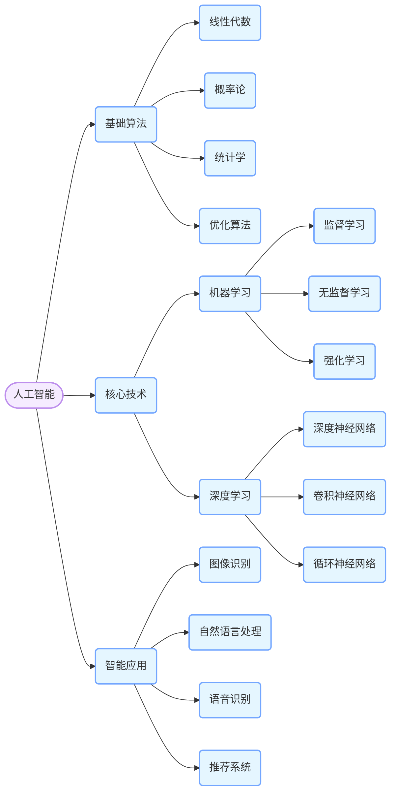

# AI编程：从理论到实践

> 关键词：AI编程、人工智能理论、实践应用、算法原理、代码实现

> 摘要：本文旨在全面且深入地探讨AI编程从理论到实践的过程。首先介绍AI编程的背景，包括目的、预期读者、文档结构等内容，让读者对文章有初步的了解。接着详细阐述AI编程的核心概念与联系，通过文本示意图和Mermaid流程图帮助读者理解。然后深入讲解核心算法原理，结合Python源代码进行具体操作步骤的说明。再通过数学模型和公式进一步剖析其原理，并举例说明。在项目实战部分，提供详细的开发环境搭建步骤、源代码实现及代码解读。之后探讨AI编程的实际应用场景，推荐相关的工具和资源。最后总结未来发展趋势与挑战，解答常见问题，并给出扩展阅读和参考资料，为读者提供一个完整的AI编程学习和实践的指南。

## 1. 背景介绍 
### 1.1 目的和范围
AI编程作为当今科技领域的热门方向，涉及到众多的理论知识和实践技巧。本文的目的在于为广大读者提供一个系统、全面且深入的学习路径，从AI编程的基本理论出发，逐步引导读者掌握实际的编程技能，实现从理论到实践的跨越。范围涵盖了AI编程的主要领域，包括机器学习、深度学习等，同时介绍相关的算法原理、数学模型以及实际应用场景。

### 1.2 预期读者
本文预期读者包括对AI编程有兴趣的初学者，希望通过系统学习掌握AI编程技能；也适合有一定编程基础，但希望深入了解AI领域的开发者；还可以作为相关专业学生的学习参考资料，帮助他们更好地理解和应用课堂所学的AI理论知识。

### 1.3 文档结构概述
本文将按照以下结构展开：首先介绍AI编程的背景信息，让读者对文章有一个整体的认识；接着阐述核心概念与联系，帮助读者构建AI编程的知识框架；然后详细讲解核心算法原理和具体操作步骤，结合Python代码进行说明；再通过数学模型和公式深入剖析AI编程的理论基础；之后进行项目实战，包括开发环境搭建、源代码实现和代码解读；探讨实际应用场景，让读者了解AI编程的实际用途；推荐相关的工具和资源，为读者提供学习和实践的便利；最后总结未来发展趋势与挑战，解答常见问题，并给出扩展阅读和参考资料。

### 1.4 术语表
#### 1.4.1 核心术语定义
- **人工智能（AI）**：指让计算机系统能够执行通常需要人类智能才能完成的任务，如学习、推理、解决问题等。
- **机器学习（ML）**：是AI的一个子领域，通过数据和算法让计算机自动学习模式和规律，从而进行预测和决策。
- **深度学习（DL）**：是机器学习的一个分支，基于人工神经网络，特别是深度神经网络，能够自动从大量数据中学习复杂的特征和模式。
- **训练数据**：用于训练机器学习或深度学习模型的数据，包含输入数据和对应的标签。
- **模型**：是对数据中模式和规律的一种数学表示，通过训练数据进行学习得到。

#### 1.4.2 相关概念解释
- **监督学习**：在监督学习中，训练数据包含输入数据和对应的标签，模型通过学习输入和标签之间的关系进行预测。例如，在图像分类任务中，输入是图像，标签是图像所属的类别。
- **无监督学习**：无监督学习的训练数据只包含输入数据，没有对应的标签。模型的目标是发现数据中的结构和模式，如聚类分析，将相似的数据点归为一类。
- **强化学习**：强化学习中，智能体通过与环境进行交互，根据环境反馈的奖励信号来学习最优的行为策略。例如，在游戏中，智能体通过不断尝试不同的动作，根据游戏得分来学习如何取得更高的分数。

#### 1.4.3 缩略词列表
- **AI**：Artificial Intelligence（人工智能）
- **ML**：Machine Learning（机器学习）
- **DL**：Deep Learning（深度学习）
- **DNN**：Deep Neural Network（深度神经网络）
- **CNN**：Convolutional Neural Network（卷积神经网络）
- **RNN**：Recurrent Neural Network（循环神经网络）

## 2. 核心概念与联系 
### 2.1 人工智能的层次结构
人工智能可以分为多个层次，从底层的基础算法到高层的智能应用。基础算法包括线性代数、概率论、统计学等数学知识，这些是AI编程的基础。机器学习和深度学习是AI的核心技术，通过这些技术可以构建各种智能模型。智能应用则是将这些模型应用到实际场景中，如图像识别、自然语言处理等。

以下是人工智能层次结构的文本示意图：
```plaintext
人工智能
├── 基础算法
│   ├── 线性代数
│   ├── 概率论
│   ├── 统计学
│   └── 优化算法
├── 核心技术
│   ├── 机器学习
│   │   ├── 监督学习
│   │   ├── 无监督学习
│   │   └── 强化学习
│   └── 深度学习
│       ├── 深度神经网络
│       ├── 卷积神经网络
│       └── 循环神经网络
└── 智能应用
    ├── 图像识别
    ├── 自然语言处理
    ├── 语音识别
    └── 推荐系统
```

### 2.2 Mermaid流程图


### 2.3 核心概念之间的联系
基础算法为机器学习和深度学习提供了理论支持。例如，线性代数中的矩阵运算在神经网络的计算中起着关键作用，概率论和统计学用于处理数据的不确定性和分布。机器学习和深度学习是实现人工智能的具体方法，通过这些方法可以构建智能模型。智能应用则是将这些模型应用到实际场景中，通过实际的数据和任务来验证和优化模型。

## 3. 核心算法原理 & 具体操作步骤 
### 3.1 线性回归算法原理
线性回归是一种简单而常用的机器学习算法，用于预测连续值的输出。其基本原理是通过找到一条直线（在多维空间中是超平面），使得数据点到该直线的距离之和最小。

假设我们有一组数据点 $(x_1, y_1), (x_2, y_2), \cdots, (x_n, y_n)$，其中 $x_i$ 是输入特征，$y_i$ 是对应的输出值。线性回归模型的表达式为：
$$y = \theta_0 + \theta_1x_1 + \theta_2x_2 + \cdots + \theta_mx_m$$
其中 $\theta_0, \theta_1, \cdots, \theta_m$ 是模型的参数，$m$ 是特征的数量。

我们的目标是找到一组最优的参数 $\theta$，使得预测值 $\hat{y}$ 与真实值 $y$ 之间的误差最小。常用的误差度量方法是均方误差（MSE）：
$$MSE = \frac{1}{n} \sum_{i=1}^{n} (y_i - \hat{y}_i)^2$$

### 3.2 Python代码实现线性回归
```python
import numpy as np

class LinearRegression:
    def __init__(self):
        self.theta = None

    def fit(self, X, y):
        # 在 X 前面添加一列全为 1 的列，用于表示截距项
        X_b = np.c_[np.ones((X.shape[0], 1)), X]
        # 使用正规方程求解参数
        self.theta = np.linalg.inv(X_b.T.dot(X_b)).dot(X_b.T).dot(y)

    def predict(self, X):
        X_b = np.c_[np.ones((X.shape[0], 1)), X]
        return X_b.dot(self.theta)

# 生成一些示例数据
X = 2 * np.random.rand(100, 1)
y = 4 + 3 * X + np.random.randn(100, 1)

# 创建线性回归模型实例
model = LinearRegression()
# 训练模型
model.fit(X, y)
# 进行预测
X_new = np.array([[0], [2]])
y_pred = model.predict(X_new)

print("预测结果:", y_pred)
```

### 3.3 代码解释
1. **`__init__` 方法**：初始化模型的参数 `theta` 为 `None`。
2. **`fit` 方法**：
    - 首先在输入特征矩阵 `X` 前面添加一列全为 1 的列，用于表示截距项。
    - 然后使用正规方程求解参数 `theta`，正规方程的公式为：
$$\theta = (X^T X)^{-1} X^T y$$
3. **`predict` 方法**：
    - 同样在输入特征矩阵 `X` 前面添加一列全为 1 的列。
    - 然后使用训练得到的参数 `theta` 进行预测。

### 3.4 具体操作步骤
1. **数据准备**：收集或生成训练数据，将其分为输入特征矩阵 `X` 和对应的输出值向量 `y`。
2. **模型创建**：创建线性回归模型的实例。
3. **模型训练**：调用模型的 `fit` 方法，传入训练数据 `X` 和 `y`，训练模型得到参数 `theta`。
4. **模型预测**：准备测试数据，调用模型的 `predict` 方法，传入测试数据，得到预测结果。

## 4. 数学模型和公式 & 详细讲解 & 举例说明 
### 4.1 线性回归的数学模型
线性回归的数学模型可以用矩阵形式表示。假设我们有 $n$ 个样本，每个样本有 $m$ 个特征，输入特征矩阵 $X$ 是一个 $n \times (m + 1)$ 的矩阵（添加了一列全为 1 的列用于表示截距项），输出值向量 $y$ 是一个 $n \times 1$ 的向量，参数向量 $\theta$ 是一个 $(m + 1) \times 1$ 的向量。则线性回归模型可以表示为：
$$\hat{y} = X\theta$$
其中 $\hat{y}$ 是预测值向量。

### 4.2 均方误差（MSE）公式
均方误差（MSE）是衡量线性回归模型预测误差的常用指标，其公式为：
$$MSE = \frac{1}{n} \sum_{i=1}^{n} (y_i - \hat{y}_i)^2 = \frac{1}{n} \sum_{i=1}^{n} (y_i - X_i\theta)^2$$
其中 $y_i$ 是第 $i$ 个样本的真实值，$\hat{y}_i$ 是第 $i$ 个样本的预测值，$X_i$ 是第 $i$ 个样本的特征向量。

### 4.3 正规方程公式
正规方程是求解线性回归参数的一种方法，其公式为：
$$\theta = (X^T X)^{-1} X^T y$$
其中 $X^T$ 是 $X$ 的转置矩阵，$(X^T X)^{-1}$ 是 $X^T X$ 的逆矩阵。

### 4.4 举例说明
假设我们有以下数据：
| $x$ | $y$ |
|---|---|
| 1 | 3 |
| 2 | 5 |
| 3 | 7 |

首先，我们将输入特征矩阵 $X$ 扩展为包含截距项的矩阵：
$$X = \begin{bmatrix} 1 & 1 \\ 1 & 2 \\ 1 & 3 \end{bmatrix}$$
输出值向量 $y$ 为：
$$y = \begin{bmatrix} 3 \\ 5 \\ 7 \end{bmatrix}$$

计算 $X^T X$：
$$X^T X = \begin{bmatrix} 1 & 1 & 1 \\ 1 & 2 & 3 \end{bmatrix} \begin{bmatrix} 1 & 1 \\ 1 & 2 \\ 1 & 3 \end{bmatrix} = \begin{bmatrix} 3 & 6 \\ 6 & 14 \end{bmatrix}$$

计算 $(X^T X)^{-1}$：
$$(X^T X)^{-1} = \frac{1}{3 \times 14 - 6 \times 6} \begin{bmatrix} 14 & -6 \\ -6 & 3 \end{bmatrix} = \begin{bmatrix} \frac{7}{3} & -1 \\ -1 & \frac{1}{2} \end{bmatrix}$$

计算 $X^T y$：
$$X^T y = \begin{bmatrix} 1 & 1 & 1 \\ 1 & 2 & 3 \end{bmatrix} \begin{bmatrix} 3 \\ 5 \\ 7 \end{bmatrix} = \begin{bmatrix} 15 \\ 34 \end{bmatrix}$$

最后计算参数 $\theta$：
$$\theta = (X^T X)^{-1} X^T y = \begin{bmatrix} \frac{7}{3} & -1 \\ -1 & \frac{1}{2} \end{bmatrix} \begin{bmatrix} 15 \\ 34 \end{bmatrix} = \begin{bmatrix} 1 \\ 2 \end{bmatrix}$$

所以，线性回归模型的表达式为 $y = 1 + 2x$。

## 5. 项目实战：代码实际案例和详细解释说明 
### 5.1  开发环境搭建
#### 5.1.1 安装Python
首先，需要安装Python环境。可以从Python官方网站（https://www.python.org/downloads/） 下载适合自己操作系统的Python安装包，按照安装向导进行安装。安装完成后，打开命令行工具，输入 `python --version` 验证Python是否安装成功。

#### 5.1.2 安装必要的库
在AI编程中，常用的库包括 `numpy`、`pandas`、`scikit-learn`、`tensorflow` 或 `pytorch` 等。可以使用 `pip` 命令进行安装：
```sh
pip install numpy pandas scikit-learn tensorflow
```

### 5.2  源代码详细实现和代码解读
#### 5.2.1 数据集准备
我们以鸢尾花数据集为例，该数据集包含了鸢尾花的四个特征（花萼长度、花萼宽度、花瓣长度、花瓣宽度）和对应的类别标签（三种鸢尾花品种）。
```python
from sklearn.datasets import load_iris
from sklearn.model_selection import train_test_split

# 加载鸢尾花数据集
iris = load_iris()
X = iris.data  # 特征矩阵
y = iris.target  # 标签向量

# 划分训练集和测试集
X_train, X_test, y_train, y_test = train_test_split(X, y, test_size=0.2, random_state=42)
```
**代码解读**：
- `load_iris()` 函数用于加载鸢尾花数据集。
- `train_test_split()` 函数用于将数据集划分为训练集和测试集，`test_size=0.2` 表示测试集占总数据集的 20%，`random_state=42` 用于保证每次划分的结果相同。

#### 5.2.2 模型训练
我们使用逻辑回归模型进行分类任务。
```python
from sklearn.linear_model import LogisticRegression

# 创建逻辑回归模型实例
model = LogisticRegression()

# 训练模型
model.fit(X_train, y_train)
```
**代码解读**：
- `LogisticRegression()` 用于创建逻辑回归模型实例。
- `fit()` 方法用于训练模型，传入训练集的特征矩阵 `X_train` 和标签向量 `y_train`。

#### 5.2.3 模型预测
```python
# 进行预测
y_pred = model.predict(X_test)
```
**代码解读**：
- `predict()` 方法用于对测试集的特征矩阵 `X_test` 进行预测，得到预测结果 `y_pred`。

#### 5.2.4 模型评估
```python
from sklearn.metrics import accuracy_score

# 计算准确率
accuracy = accuracy_score(y_test, y_pred)
print("模型准确率:", accuracy)
```
**代码解读**：
- `accuracy_score()` 函数用于计算模型的准确率，传入真实标签向量 `y_test` 和预测标签向量 `y_pred`。

### 5.3  代码解读与分析
#### 5.3.1 数据预处理
数据预处理是AI编程中非常重要的一步，包括数据清洗、特征选择、特征缩放等。在本案例中，我们使用 `train_test_split()` 函数将数据集划分为训练集和测试集，这有助于评估模型的泛化能力。

#### 5.3.2 模型选择
选择合适的模型是解决问题的关键。在本案例中，我们选择了逻辑回归模型，它是一种简单而有效的分类模型，适用于线性可分的数据集。

#### 5.3.3 模型训练和预测
通过调用模型的 `fit()` 方法进行训练，得到模型的参数。然后使用 `predict()` 方法对测试集进行预测，得到预测结果。

#### 5.3.4 模型评估
使用准确率等指标对模型进行评估，了解模型的性能。在实际应用中，还可以使用其他指标，如精确率、召回率、F1值等。

## 6. 实际应用场景 
### 6.1 图像识别
图像识别是AI编程的一个重要应用场景，包括人脸识别、物体检测、图像分类等。例如，在安防领域，人脸识别技术可以用于门禁系统、监控系统等，提高安全性。在医疗领域，图像识别技术可以用于医学图像分析，帮助医生诊断疾病。

### 6.2 自然语言处理
自然语言处理包括文本分类、情感分析、机器翻译、语音识别等。例如，在智能客服领域，自然语言处理技术可以实现自动问答，提高客户服务效率。在信息检索领域，文本分类技术可以帮助用户快速找到相关的信息。

### 6.3 推荐系统
推荐系统是电商、社交等平台常用的技术，通过分析用户的行为和偏好，为用户推荐相关的商品、文章、视频等。例如，在电商平台上，推荐系统可以根据用户的浏览历史、购买记录等信息，为用户推荐可能感兴趣的商品，提高用户的购买转化率。

### 6.4 金融风险评估
在金融领域，AI编程可以用于风险评估、信用评分等。例如，通过分析用户的信用历史、收入情况、负债情况等信息，使用机器学习模型对用户的信用风险进行评估，帮助金融机构做出决策。

## 7. 工具和资源推荐
### 7.1 学习资源推荐
#### 7.1.1 书籍推荐
- 《机器学习》（周志华）：这本书是机器学习领域的经典教材，全面介绍了机器学习的基本概念、算法和应用。
- 《深度学习》（Ian Goodfellow、Yoshua Bengio、Aaron Courville）：该书是深度学习领域的权威著作，深入讲解了深度学习的原理和实践。
- 《Python机器学习实战》（Sebastian Raschka）：以Python为工具，介绍了机器学习的实际应用和代码实现。

#### 7.1.2 在线课程
- Coursera上的“机器学习”课程（Andrew Ng）：这是一门非常经典的机器学习课程，由机器学习领域的专家Andrew Ng授课，内容全面，讲解清晰。
- edX上的“深度学习”系列课程：包括深度学习的基础、卷积神经网络、循环神经网络等内容，适合深入学习深度学习的读者。
- 哔哩哔哩（B 站）上有很多AI编程相关的视频教程，如李宏毅的机器学习课程，讲解生动有趣，易于理解。

#### 7.1.3 技术博客和网站
- Medium：上面有很多AI领域的优秀博客文章，涵盖了最新的研究成果、技术应用等内容。
- arXiv：是一个预印本平台，提供了大量的AI领域的研究论文，可以及时了解最新的研究动态。
- 机器之心：专注于AI领域的资讯和技术解读，提供了丰富的行业信息和技术文章。

### 7.2 开发工具框架推荐
#### 7.2.1 IDE和编辑器
- PyCharm：是一款专业的Python集成开发环境，具有强大的代码编辑、调试、代码分析等功能，适合开发大型的AI项目。
- Jupyter Notebook：是一个交互式的开发环境，支持Python等多种编程语言，适合进行数据探索、模型训练和实验。
- Visual Studio Code：是一款轻量级的代码编辑器，支持多种编程语言和插件，具有丰富的扩展功能，适合快速开发和调试。

#### 7.2.2 调试和性能分析工具
- TensorBoard：是TensorFlow提供的可视化工具，可以用于可视化模型的训练过程、损失曲线、准确率等指标，帮助用户调试和优化模型。
- PyTorch Profiler：是PyTorch提供的性能分析工具，可以分析模型的计算时间、内存使用等情况，帮助用户优化模型的性能。
- cProfile：是Python内置的性能分析工具，可以分析Python代码的执行时间和函数调用关系，帮助用户找出性能瓶颈。

#### 7.2.3 相关框架和库
- TensorFlow：是一个开源的机器学习框架，由Google开发，具有强大的计算能力和丰富的工具集，适合开发各种类型的AI模型。
- PyTorch：是一个开源的深度学习框架，由Facebook开发，具有动态计算图的特点，易于使用和调试，适合快速开发和研究。
- scikit-learn：是一个简单而有效的机器学习库，提供了多种机器学习算法和工具，适合初学者和快速原型开发。

### 7.3 相关论文著作推荐
#### 7.3.1 经典论文
- 《Gradient-based learning applied to document recognition》（Yann LeCun、Léon Bottou、Yoshua Bengio、Patrick Haffner）：这篇论文介绍了卷积神经网络（CNN）的基本原理和应用，是CNN领域的经典之作。
- 《Long Short-Term Memory》（Sepp Hochreiter、Jürgen Schmidhuber）：该论文提出了长短期记忆网络（LSTM），解决了循环神经网络（RNN）中的梯度消失问题，是RNN领域的重要突破。
- 《Attention Is All You Need》（Ashish Vaswani、Noam Shazeer、Niki Parmar等）：这篇论文提出了Transformer模型，是自然语言处理领域的重要进展，为后续的BERT、GPT等模型奠定了基础。

#### 7.3.2 最新研究成果
- 关注顶级学术会议，如NeurIPS（神经信息处理系统大会）、ICML（国际机器学习会议）、CVPR（计算机视觉与模式识别会议）等，这些会议上发表的论文代表了AI领域的最新研究成果。
- 关注知名研究机构和学者的最新工作，如OpenAI、DeepMind等机构的研究成果，以及李开复、吴恩达等学者的最新论文。

#### 7.3.3 应用案例分析
- 《AI Superpowers: China, Silicon Valley, and the New World Order》（李开复）：这本书通过大量的案例分析，介绍了AI在各个领域的应用和发展趋势，以及中美在AI领域的竞争态势。
- 《The Hundred-Page Machine Learning Book》（Andriy Burkov）：书中包含了多个实际应用案例，帮助读者理解机器学习的实际应用和解决问题的思路。

## 8. 总结：未来发展趋势与挑战
### 8.1 未来发展趋势
#### 8.1.1 人工智能与其他技术的融合
未来，人工智能将与物联网、区块链、5G等技术深度融合，创造出更多的应用场景和商业价值。例如，物联网产生的大量数据可以为人工智能提供丰富的训练资源，人工智能可以对物联网数据进行分析和处理，实现智能化的决策和控制。

#### 8.1.2 强化学习的广泛应用
强化学习在机器人控制、自动驾驶、游戏等领域已经取得了显著的成果。未来，强化学习将在更多的领域得到应用，如智能物流、智能电网等，实现系统的自主优化和决策。

#### 8.1.3 人工智能的可解释性和安全性
随着人工智能的广泛应用，其可解释性和安全性问题越来越受到关注。未来，研究人员将致力于开发可解释的人工智能模型，提高模型的透明度和可信度，同时加强人工智能的安全防护，防止模型被攻击和滥用。

### 8.2 挑战
#### 8.2.1 数据隐私和安全问题
AI编程需要大量的数据进行训练，这些数据可能包含用户的个人隐私信息。如何保护数据的隐私和安全，防止数据泄露和滥用，是一个亟待解决的问题。

#### 8.2.2 算法偏见问题
AI模型的训练数据可能存在偏见，导致模型的预测结果也存在偏见。例如，在人脸识别系统中，可能对某些种族或性别存在误判。如何消除算法偏见，保证模型的公平性和公正性，是一个重要的挑战。

#### 8.2.3 人才短缺问题
AI编程是一个跨学科的领域，需要掌握数学、计算机科学、统计学等多方面的知识。目前，AI领域的专业人才短缺，如何培养和吸引更多的AI人才，是推动AI发展的关键。

## 9. 附录：常见问题与解答
### 9.1 学习AI编程需要具备哪些基础知识？
学习AI编程需要具备一定的数学基础，包括线性代数、概率论、统计学等，以及编程基础，如Python语言。此外，还需要了解机器学习、深度学习等相关的概念和算法。

### 9.2 如何选择适合的AI模型？
选择适合的AI模型需要考虑多个因素，如问题的类型（分类、回归、聚类等）、数据的特点（数据量、特征数量、数据分布等）、模型的复杂度和性能要求等。可以通过尝试不同的模型，比较它们的性能，选择最优的模型。

### 9.3 如何处理AI模型中的过拟合和欠拟合问题？
过拟合是指模型在训练集上表现很好，但在测试集上表现很差。可以通过增加训练数据、减少模型复杂度、使用正则化等方法来解决过拟合问题。欠拟合是指模型在训练集和测试集上的表现都很差。可以通过增加模型复杂度、选择更合适的特征等方法来解决欠拟合问题。

### 9.4 AI编程的未来就业前景如何？
AI编程是一个快速发展的领域，具有广阔的就业前景。目前，AI领域的人才需求非常大，涉及到互联网、金融、医疗、教育等多个行业。掌握AI编程技能的人才可以从事数据科学家、机器学习工程师、深度学习工程师等职业，薪资待遇也比较优厚。

## 10. 扩展阅读 & 参考资料
### 10.1 扩展阅读
- 《人工智能时代》（李开复、王咏刚）：这本书介绍了人工智能的发展历程、现状和未来趋势，以及人工智能对社会和人类的影响。
- 《智能时代》（吴军）：作者从人类社会发展的角度，探讨了人工智能的发展和应用，以及对未来社会的变革。

### 10.2 参考资料
- 《Python数据分析实战》（Sebastian Raschka）
- 《深度学习实战》（Antoine Géron）
- 相关学术论文和研究报告，如NeurIPS、ICML、CVPR等会议的论文。