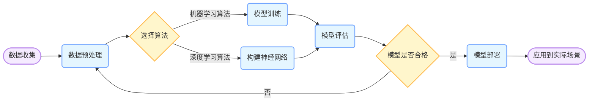

# AI编程：未来的技术创新

> 关键词：AI编程、技术创新、人工智能算法、机器学习、深度学习、代码实现、应用场景

> 摘要：本文围绕AI编程这一未来极具潜力的技术创新领域展开。深入探讨了AI编程的核心概念、算法原理、数学模型等基础知识，通过Python代码详细阐述具体操作步骤，并结合项目实战案例进行代码实现与解读。同时，介绍了AI编程的实际应用场景，推荐了相关学习资源、开发工具框架以及论文著作。最后，分析了AI编程未来的发展趋势与面临的挑战，旨在为读者全面呈现AI编程的全貌，助力其深入了解和掌握这一前沿技术。

## 1. 背景介绍 
### 1.1 目的和范围
随着科技的飞速发展，人工智能（AI）已经成为推动各个领域变革的关键力量。AI编程作为实现人工智能的重要手段，其重要性日益凸显。本文的目的在于全面、深入地介绍AI编程的相关知识，包括核心概念、算法原理、实际应用等，帮助读者系统地了解AI编程的全貌，掌握AI编程的基本技能和方法。范围涵盖AI编程的基础知识、常用算法、项目实战以及未来发展趋势等多个方面。

### 1.2 预期读者
本文预期读者包括对人工智能和编程感兴趣的初学者、希望深入了解AI编程技术的开发者、从事相关领域研究的科研人员以及关注科技发展趋势的人士。无论您是零基础的新手，还是有一定编程经验的专业人士，都能从本文中获取有价值的信息和知识。

### 1.3 文档结构概述
本文将按照以下结构进行组织：首先介绍AI编程的背景知识，包括目的、预期读者和文档结构概述等；接着深入探讨AI编程的核心概念与联系，通过文本示意图和Mermaid流程图进行详细说明；然后阐述核心算法原理和具体操作步骤，并使用Python源代码进行详细讲解；再介绍数学模型和公式，并结合具体例子进行说明；随后通过项目实战展示代码的实际应用和详细解释；接着介绍AI编程的实际应用场景；之后推荐相关的工具和资源；最后总结AI编程的未来发展趋势与挑战，并提供常见问题解答和扩展阅读参考资料。

### 1.4 术语表
#### 1.4.1 核心术语定义
- **人工智能（AI）**：指让计算机系统能够模拟人类智能的一系列技术和方法，包括学习、推理、感知和决策等能力。
- **机器学习（ML）**：人工智能的一个分支，通过让计算机从数据中学习模式和规律，从而实现预测和决策的能力。
- **深度学习（DL）**：机器学习的一个子领域，基于人工神经网络，通过构建多层神经网络来学习数据的深层次特征。
- **AI编程**：指使用编程语言和相关工具来实现人工智能算法和系统的过程。

#### 1.4.2 相关概念解释
- **数据预处理**：在进行机器学习或深度学习之前，对原始数据进行清洗、转换和归一化等操作，以提高数据的质量和可用性。
- **模型训练**：使用训练数据对机器学习或深度学习模型进行参数调整，使其能够学习到数据中的模式和规律。
- **模型评估**：使用测试数据对训练好的模型进行评估，以衡量模型的性能和准确性。
- **过拟合**：模型在训练数据上表现良好，但在测试数据上表现不佳的现象，通常是由于模型过于复杂或训练数据不足导致的。
- **欠拟合**：模型在训练数据和测试数据上的表现都不佳的现象，通常是由于模型过于简单或训练数据特征不足导致的。

#### 1.4.3 缩略词列表
- **AI**：Artificial Intelligence（人工智能）
- **ML**：Machine Learning（机器学习）
- **DL**：Deep Learning（深度学习）
- **ANN**：Artificial Neural Network（人工神经网络）
- **CNN**：Convolutional Neural Network（卷积神经网络）
- **RNN**：Recurrent Neural Network（循环神经网络）

## 2. 核心概念与联系 

### 2.1 核心概念原理
AI编程涉及多个核心概念，其中人工智能是总体目标，机器学习和深度学习是实现人工智能的重要手段。

#### 2.1.1 人工智能（AI）
人工智能的目标是让计算机系统能够像人类一样进行思考、学习和决策。它涵盖了多个领域，包括自然语言处理、计算机视觉、知识表示与推理等。AI系统通常由数据、算法和模型组成，通过对数据的处理和分析，使用算法来构建和训练模型，最终实现智能决策和预测。

#### 2.1.2 机器学习（ML）
机器学习是人工智能的一个重要分支，它通过让计算机从数据中自动学习模式和规律，从而实现预测和决策的能力。机器学习的基本流程包括数据收集、数据预处理、模型选择、模型训练、模型评估和模型部署等步骤。常见的机器学习算法包括线性回归、逻辑回归、决策树、支持向量机、随机森林等。

#### 2.1.3 深度学习（DL）
深度学习是机器学习的一个子领域，基于人工神经网络。深度学习通过构建多层神经网络，让计算机自动学习数据的深层次特征。深度学习在图像识别、语音识别、自然语言处理等领域取得了巨大的成功。常见的深度学习模型包括卷积神经网络（CNN）、循环神经网络（RNN）、长短时记忆网络（LSTM）等。

### 2.2 架构的文本示意图
AI编程的整体架构可以表示为以下几个层次：
- **数据层**：包括各种数据源，如结构化数据、非结构化数据、图像数据、语音数据等。
- **算法层**：包含各种机器学习和深度学习算法，如分类算法、回归算法、聚类算法、神经网络算法等。
- **模型层**：根据算法构建的具体模型，如线性回归模型、决策树模型、卷积神经网络模型等。
- **应用层**：将训练好的模型应用到实际场景中，如智能推荐系统、图像识别系统、语音识别系统等。

### 2.3 Mermaid流程图


## 3. 核心算法原理 & 具体操作步骤 

### 3.1 线性回归算法原理
线性回归是一种基本的机器学习算法，用于预测连续值的输出。其基本原理是通过找到一条直线（或超平面），使得数据点到该直线（或超平面）的距离之和最小。线性回归的数学模型可以表示为：

$$y = \theta_0 + \theta_1x_1 + \theta_2x_2 + \cdots + \theta_nx_n + \epsilon$$

其中，$y$ 是输出变量，$x_1, x_2, \cdots, x_n$ 是输入变量，$\theta_0, \theta_1, \cdots, \theta_n$ 是模型的参数，$\epsilon$ 是误差项。

### 3.2 具体操作步骤及Python代码实现
以下是使用Python实现线性回归的具体步骤和代码：

```python
# 步骤1：导入必要的库
import numpy as np
from sklearn.model_selection import train_test_split
from sklearn.linear_model import LinearRegression
from sklearn.metrics import mean_squared_error

# 步骤2：生成示例数据
np.random.seed(0)
X = np.random.rand(100, 1)
y = 2 * X + 1 + 0.5 * np.random.randn(100, 1)

# 步骤3：划分训练集和测试集
X_train, X_test, y_train, y_test = train_test_split(X, y, test_size=0.2, random_state=42)

# 步骤4：创建线性回归模型
model = LinearRegression()

# 步骤5：训练模型
model.fit(X_train, y_train)

# 步骤6：预测
y_pred = model.predict(X_test)

# 步骤7：评估模型
mse = mean_squared_error(y_test, y_pred)
print(f"均方误差: {mse}")

# 步骤8：查看模型参数
print(f"截距: {model.intercept_}")
print(f"系数: {model.coef_}")
```

### 3.3 代码解释
- **步骤1**：导入必要的库，包括 `numpy` 用于数据处理，`train_test_split` 用于划分训练集和测试集，`LinearRegression` 用于创建线性回归模型，`mean_squared_error` 用于评估模型的均方误差。
- **步骤2**：生成示例数据，使用 `np.random.rand` 生成输入数据 `X`，并根据线性关系生成输出数据 `y`，同时添加一些噪声。
- **步骤3**：使用 `train_test_split` 将数据划分为训练集和测试集，测试集占比为20%。
- **步骤4**：创建线性回归模型对象 `model`。
- **步骤5**：使用训练集数据对模型进行训练，调用 `fit` 方法。
- **步骤6**：使用训练好的模型对测试集数据进行预测，调用 `predict` 方法。
- **步骤7**：使用 `mean_squared_error` 计算预测值和真实值之间的均方误差，评估模型的性能。
- **步骤8**：查看模型的截距和系数，了解模型的具体参数。

### 3.4 逻辑回归算法原理
逻辑回归是一种用于分类问题的机器学习算法，它通过将线性回归的输出通过逻辑函数（如Sigmoid函数）转换为概率值，从而实现分类的目的。逻辑回归的数学模型可以表示为：

$$P(y = 1|x) = \frac{1}{1 + e^{-(\theta_0 + \theta_1x_1 + \theta_2x_2 + \cdots + \theta_nx_n)}}$$

其中，$P(y = 1|x)$ 是给定输入 $x$ 时输出为1的概率。

### 3.5 逻辑回归Python代码实现
```python
# 步骤1：导入必要的库
import numpy as np
from sklearn.model_selection import train_test_split
from sklearn.linear_model import LogisticRegression
from sklearn.metrics import accuracy_score

# 步骤2：生成示例数据
np.random.seed(0)
X = np.random.randn(100, 2)
y = (X[:, 0] + X[:, 1] > 0).astype(int)

# 步骤3：划分训练集和测试集
X_train, X_test, y_train, y_test = train_test_split(X, y, test_size=0.2, random_state=42)

# 步骤4：创建逻辑回归模型
model = LogisticRegression()

# 步骤5：训练模型
model.fit(X_train, y_train)

# 步骤6：预测
y_pred = model.predict(X_test)

# 步骤7：评估模型
accuracy = accuracy_score(y_test, y_pred)
print(f"准确率: {accuracy}")

# 步骤8：查看模型参数
print(f"截距: {model.intercept_}")
print(f"系数: {model.coef_}")
```

### 3.6 代码解释
- **步骤1**：导入必要的库，包括 `numpy` 用于数据处理，`train_test_split` 用于划分训练集和测试集，`LogisticRegression` 用于创建逻辑回归模型，`accuracy_score` 用于评估模型的准确率。
- **步骤2**：生成示例数据，使用 `np.random.randn` 生成输入数据 `X`，并根据条件生成输出数据 `y`。
- **步骤3**：使用 `train_test_split` 将数据划分为训练集和测试集，测试集占比为20%。
- **步骤4**：创建逻辑回归模型对象 `model`。
- **步骤5**：使用训练集数据对模型进行训练，调用 `fit` 方法。
- **步骤6**：使用训练好的模型对测试集数据进行预测，调用 `predict` 方法。
- **步骤7**：使用 `accuracy_score` 计算预测值和真实值之间的准确率，评估模型的性能。
- **步骤8**：查看模型的截距和系数，了解模型的具体参数。

## 4. 数学模型和公式 & 详细讲解 & 举例说明 

### 4.1 线性回归数学模型和公式
线性回归的目标是找到一组参数 $\theta = [\theta_0, \theta_1, \cdots, \theta_n]$，使得预测值 $\hat{y}$ 与真实值 $y$ 之间的误差最小。通常使用均方误差（MSE）作为损失函数，其数学公式为：

$$MSE = \frac{1}{m} \sum_{i=1}^{m} (y^{(i)} - \hat{y}^{(i)})^2$$

其中，$m$ 是样本数量，$y^{(i)}$ 是第 $i$ 个样本的真实值，$\hat{y}^{(i)}$ 是第 $i$ 个样本的预测值。

为了找到最优的参数 $\theta$，可以使用最小二乘法。最小二乘法的目标是最小化损失函数 $MSE$，通过对 $MSE$ 求偏导数并令其等于0，可以得到最优参数的解析解：

$$\theta = (X^T X)^{-1} X^T y$$

其中，$X$ 是输入数据矩阵，$y$ 是输出数据向量。

### 4.2 举例说明
假设有以下数据集：

| $x$ | $y$ |
| --- | --- |
| 1 | 3 |
| 2 | 5 |
| 3 | 7 |

我们可以使用最小二乘法来求解线性回归模型的参数。首先，将输入数据 $x$ 和输出数据 $y$ 表示为矩阵和向量的形式：

$$X = \begin{bmatrix} 1 & 1 \\ 1 & 2 \\ 1 & 3 \end{bmatrix}, y = \begin{bmatrix} 3 \\ 5 \\ 7 \end{bmatrix}$$

然后，计算 $X^T X$ 和 $X^T y$：

$$X^T X = \begin{bmatrix} 1 & 1 & 1 \\ 1 & 2 & 3 \end{bmatrix} \begin{bmatrix} 1 & 1 \\ 1 & 2 \\ 1 & 3 \end{bmatrix} = \begin{bmatrix} 3 & 6 \\ 6 & 14 \end{bmatrix}$$

$$X^T y = \begin{bmatrix} 1 & 1 & 1 \\ 1 & 2 & 3 \end{bmatrix} \begin{bmatrix} 3 \\ 5 \\ 7 \end{bmatrix} = \begin{bmatrix} 15 \\ 34 \end{bmatrix}$$

接着，求 $(X^T X)^{-1}$：

$$(X^T X)^{-1} = \frac{1}{3 \times 14 - 6 \times 6} \begin{bmatrix} 14 & -6 \\ -6 & 3 \end{bmatrix} = \begin{bmatrix} \frac{7}{3} & -1 \\ -1 & \frac{1}{2} \end{bmatrix}$$

最后，计算最优参数 $\theta$：

$$\theta = (X^T X)^{-1} X^T y = \begin{bmatrix} \frac{7}{3} & -1 \\ -1 & \frac{1}{2} \end{bmatrix} \begin{bmatrix} 15 \\ 34 \end{bmatrix} = \begin{bmatrix} 1 \\ 2 \end{bmatrix}$$

因此，线性回归模型的方程为 $y = 1 + 2x$。

### 4.3 逻辑回归数学模型和公式
逻辑回归使用逻辑函数（如Sigmoid函数）将线性回归的输出转换为概率值。Sigmoid函数的数学公式为：

$$\sigma(z) = \frac{1}{1 + e^{-z}}$$

其中，$z = \theta_0 + \theta_1x_1 + \theta_2x_2 + \cdots + \theta_nx_n$。

逻辑回归的损失函数通常使用对数损失函数（也称为交叉熵损失函数），其数学公式为：

$$J(\theta) = -\frac{1}{m} \sum_{i=1}^{m} [y^{(i)} \log(\sigma(z^{(i)})) + (1 - y^{(i)}) \log(1 - \sigma(z^{(i)}))]$$

其中，$m$ 是样本数量，$y^{(i)}$ 是第 $i$ 个样本的真实标签，$\sigma(z^{(i)})$ 是第 $i$ 个样本的预测概率。

为了找到最优的参数 $\theta$，可以使用梯度下降法。梯度下降法的基本思想是通过不断迭代更新参数 $\theta$，使得损失函数 $J(\theta)$ 逐渐减小。参数更新的公式为：

$$\theta_j := \theta_j - \alpha \frac{\partial J(\theta)}{\partial \theta_j}$$

其中，$\alpha$ 是学习率，$\frac{\partial J(\theta)}{\partial \theta_j}$ 是损失函数 $J(\theta)$ 对参数 $\theta_j$ 的偏导数。

### 4.4 举例说明
假设有一个二分类问题，输入数据 $x$ 是一个一维向量，输出数据 $y$ 是一个二元标签（0或1）。我们可以使用逻辑回归来进行分类。

假设我们有以下数据集：

| $x$ | $y$ |
| --- | --- |
| 1 | 0 |
| 2 | 0 |
| 3 | 1 |
| 4 | 1 |

我们可以使用梯度下降法来求解逻辑回归模型的参数。首先，初始化参数 $\theta = [\theta_0, \theta_1]$，并设置学习率 $\alpha$ 和迭代次数 $num\_iterations$。然后，在每次迭代中，计算损失函数 $J(\theta)$ 对参数 $\theta$ 的偏导数，并更新参数 $\theta$。

以下是使用Python实现逻辑回归梯度下降法的代码：

```python
import numpy as np

# 定义Sigmoid函数
def sigmoid(z):
    return 1 / (1 + np.exp(-z))

# 定义逻辑回归损失函数
def log_loss(X, y, theta):
    m = len(y)
    z = np.dot(X, theta)
    h = sigmoid(z)
    loss = -1/m * np.sum(y * np.log(h) + (1 - y) * np.log(1 - h))
    return loss

# 定义梯度下降法
def gradient_descent(X, y, theta, alpha, num_iterations):
    m = len(y)
    losses = []
    for i in range(num_iterations):
        z = np.dot(X, theta)
        h = sigmoid(z)
        gradient = 1/m * np.dot(X.T, (h - y))
        theta = theta - alpha * gradient
        loss = log_loss(X, y, theta)
        losses.append(loss)
    return theta, losses

# 生成示例数据
X = np.array([[1, 1], [1, 2], [1, 3], [1, 4]])
y = np.array([0, 0, 1, 1])

# 初始化参数
theta = np.zeros((2, 1))

# 设置学习率和迭代次数
alpha = 0.1
num_iterations = 1000

# 运行梯度下降法
theta, losses = gradient_descent(X, y, theta, alpha, num_iterations)

# 输出结果
print(f"最优参数: {theta}")
print(f"最终损失: {losses[-1]}")
```

## 5. 项目实战：代码实际案例和详细解释说明 

### 5.1  开发环境搭建
在进行AI编程项目实战之前，需要搭建相应的开发环境。以下是具体的步骤：

#### 5.1.1 安装Python
首先，需要安装Python解释器。可以从Python官方网站（https://www.python.org/downloads/） 下载适合自己操作系统的Python版本。建议安装Python 3.6及以上版本。

#### 5.1.2 安装虚拟环境
为了避免不同项目之间的依赖冲突，建议使用虚拟环境。可以使用 `venv` 或 `conda` 来创建虚拟环境。

- **使用 `venv` 创建虚拟环境**：
```bash
python -m venv myenv
```
激活虚拟环境：
- **Windows**：
```bash
myenv\Scripts\activate
```
- **Linux/Mac**：
```bash
source myenv/bin/activate
```

- **使用 `conda` 创建虚拟环境**：
```bash
conda create -n myenv python=3.8
```
激活虚拟环境：
```bash
conda activate myenv
```

#### 5.1.3 安装必要的库
在虚拟环境中安装必要的库，如 `numpy`、`pandas`、`scikit-learn`、`tensorflow`、`pytorch` 等。可以使用 `pip` 或 `conda` 进行安装。

- **使用 `pip` 安装**：
```bash
pip install numpy pandas scikit-learn tensorflow pytorch
```

- **使用 `conda` 安装**：
```bash
conda install numpy pandas scikit-learn tensorflow pytorch
```

### 5.2  源代码详细实现和代码解读
#### 5.2.1 项目概述
本项目将使用Python和 `scikit-learn` 库实现一个简单的鸢尾花分类任务。鸢尾花数据集是一个经典的机器学习数据集，包含了150个样本，分为3个类别（Setosa、Versicolour、Virginica），每个样本有4个特征（花萼长度、花萼宽度、花瓣长度、花瓣宽度）。

#### 5.2.2 源代码实现
```python
# 步骤1：导入必要的库
from sklearn.datasets import load_iris
from sklearn.model_selection import train_test_split
from sklearn.neighbors import KNeighborsClassifier
from sklearn.metrics import accuracy_score

# 步骤2：加载数据集
iris = load_iris()
X = iris.data
y = iris.target

# 步骤3：划分训练集和测试集
X_train, X_test, y_train, y_test = train_test_split(X, y, test_size=0.2, random_state=42)

# 步骤4：创建K近邻分类器
knn = KNeighborsClassifier(n_neighbors=3)

# 步骤5：训练模型
knn.fit(X_train, y_train)

# 步骤6：预测
y_pred = knn.predict(X_test)

# 步骤7：评估模型
accuracy = accuracy_score(y_test, y_pred)
print(f"准确率: {accuracy}")
```

#### 5.2.3 代码解读
- **步骤1**：导入必要的库，包括 `load_iris` 用于加载鸢尾花数据集，`train_test_split` 用于划分训练集和测试集，`KNeighborsClassifier` 用于创建K近邻分类器，`accuracy_score` 用于评估模型的准确率。
- **步骤2**：使用 `load_iris` 加载鸢尾花数据集，并将特征数据和标签数据分别存储在 `X` 和 `y` 中。
- **步骤3**：使用 `train_test_split` 将数据集划分为训练集和测试集，测试集占比为20%。
- **步骤4**：创建K近邻分类器对象 `knn`，并设置 `n_neighbors` 参数为3，表示选择最近的3个邻居进行分类。
- **步骤5**：使用训练集数据对模型进行训练，调用 `fit` 方法。
- **步骤6**：使用训练好的模型对测试集数据进行预测，调用 `predict` 方法。
- **步骤7**：使用 `accuracy_score` 计算预测值和真实值之间的准确率，评估模型的性能。

### 5.3  代码解读与分析
#### 5.3.1 K近邻算法原理
K近邻算法（K-Nearest Neighbors，KNN）是一种基本的分类和回归算法。其基本思想是：对于一个待分类的样本，找到其最近的K个邻居，然后根据这K个邻居的类别来决定该样本的类别。

#### 5.3.2 代码分析
- **数据加载**：使用 `load_iris` 函数加载鸢尾花数据集，该数据集包含了150个样本，每个样本有4个特征和1个标签。
- **数据划分**：使用 `train_test_split` 函数将数据集划分为训练集和测试集，测试集占比为20%，这样可以保证模型在未见过的数据上进行评估。
- **模型创建**：使用 `KNeighborsClassifier` 类创建K近邻分类器对象，并设置 `n_neighbors` 参数为3。
- **模型训练**：使用 `fit` 方法对模型进行训练，将训练集的特征数据和标签数据作为输入。
- **模型预测**：使用 `predict` 方法对测试集的特征数据进行预测，得到预测标签。
- **模型评估**：使用 `accuracy_score` 函数计算预测标签和真实标签之间的准确率，评估模型的性能。

#### 5.3.3 优缺点分析
- **优点**：K近邻算法简单易懂，不需要进行模型训练，只需要存储训练数据即可。同时，K近邻算法对于非线性数据也有较好的分类效果。
- **缺点**：K近邻算法的计算复杂度较高，尤其是当数据集较大时。此外，K近邻算法对于特征的尺度比较敏感，需要进行特征缩放。

## 6. 实际应用场景 
AI编程在各个领域都有广泛的应用，以下是一些常见的应用场景：

### 6.1 自然语言处理
- **机器翻译**：使用AI编程技术实现不同语言之间的自动翻译，如谷歌翻译、百度翻译等。
- **语音识别**：将语音信号转换为文本，如苹果的Siri、微软的小娜等。
- **文本分类**：将文本分为不同的类别，如垃圾邮件分类、新闻分类等。
- **情感分析**：分析文本中的情感倾向，如社交媒体上的用户评论情感分析。

### 6.2 计算机视觉
- **图像识别**：识别图像中的物体、场景等，如人脸识别、车牌识别等。
- **目标检测**：在图像中检测出特定的目标，如行人检测、车辆检测等。
- **图像生成**：根据输入的文本或图像生成新的图像，如DALL - E 2、Midjourney等。
- **视频分析**：对视频内容进行分析，如视频监控、动作识别等。

### 6.3 智能推荐系统
- **电商推荐**：根据用户的浏览历史、购买记录等信息，为用户推荐相关的商品，如亚马逊、淘宝等电商平台的推荐系统。
- **音乐推荐**：根据用户的音乐偏好，为用户推荐相关的音乐，如网易云音乐、QQ音乐等音乐平台的推荐系统。
- **电影推荐**：根据用户的观影历史，为用户推荐相关的电影，如Netflix、爱奇艺等视频平台的推荐系统。

### 6.4 医疗保健
- **疾病诊断**：使用AI编程技术分析医学影像（如X光、CT等），辅助医生进行疾病诊断，如癌症早期筛查。
- **药物研发**：通过对大量的生物数据进行分析，加速药物研发的过程。
- **健康管理**：根据用户的健康数据（如心率、血压等），提供个性化的健康建议和管理方案。

### 6.5 金融服务
- **风险评估**：分析客户的信用数据，评估客户的信用风险，如银行的信用评分系统。
- **股票预测**：使用AI算法对股票市场进行预测，辅助投资者进行决策。
- **欺诈检测**：检测金融交易中的欺诈行为，保障金融安全。

## 7. 工具和资源推荐
### 7.1 学习资源推荐
#### 7.1.1 书籍推荐
- 《Python机器学习》：本书详细介绍了Python在机器学习领域的应用，包括各种机器学习算法的原理和实现。
- 《深度学习》：由深度学习领域的三位顶尖专家撰写，是深度学习领域的经典教材。
- 《人工智能：一种现代的方法》：全面介绍了人工智能的各个领域，包括知识表示、推理、学习、规划等。

#### 7.1.2 在线课程
- Coursera上的《机器学习》课程：由吴恩达教授讲授，是机器学习领域的经典课程。
- edX上的《深度学习》课程：由深度学习领域的专家授课，内容丰富全面。
- 网易云课堂上的《Python人工智能实战》课程：结合实际项目，讲解Python在人工智能领域的应用。

#### 7.1.3 技术博客和网站
- Medium：一个技术博客平台，有很多关于AI编程的优质文章。
- Towards Data Science：专注于数据科学和机器学习领域的博客，提供了很多实用的教程和案例。
- AI开源社区：提供了大量的AI开源项目和资源，方便开发者学习和交流。

### 7.2 开发工具框架推荐
#### 7.2.1 IDE和编辑器
- PyCharm：一款功能强大的Python集成开发环境，提供了代码编辑、调试、版本控制等功能。
- Jupyter Notebook：一个交互式的编程环境，适合进行数据探索和模型实验。
- Visual Studio Code：一款轻量级的代码编辑器，支持多种编程语言和插件扩展。

#### 7.2.2 调试和性能分析工具
- TensorBoard：TensorFlow的可视化工具，用于监控模型训练过程和分析模型性能。
- PyTorch Profiler：PyTorch的性能分析工具，用于分析模型的运行时间和内存使用情况。
- cProfile：Python的内置性能分析工具，用于分析Python代码的性能瓶颈。

#### 7.2.3 相关框架和库
- TensorFlow：一个开源的机器学习框架，提供了丰富的工具和库，支持大规模分布式训练。
- PyTorch：一个基于Python的深度学习框架，具有动态计算图的特点，易于使用和调试。
- Scikit-learn：一个简单易用的机器学习库，提供了各种机器学习算法和工具，适合初学者。

### 7.3 相关论文著作推荐
#### 7.3.1 经典论文
- “Gradient-Based Learning Applied to Document Recognition”：介绍了卷积神经网络在手写字符识别中的应用，是卷积神经网络的经典论文。
- “Long Short-Term Memory”：介绍了长短时记忆网络（LSTM）的原理和应用，是循环神经网络领域的经典论文。
- “Attention Is All You Need”：介绍了Transformer架构，是自然语言处理领域的重要突破。

#### 7.3.2 最新研究成果
- 关注顶级学术会议（如NeurIPS、ICML、CVPR等）的最新论文，了解AI编程领域的最新研究成果。
- 关注知名研究机构（如OpenAI、DeepMind等）的官方网站，获取最新的研究动态和成果。

#### 7.3.3 应用案例分析
- 《AI未来简史》：通过大量的实际案例，介绍了AI在各个领域的应用和发展趋势。
- 《智能时代》：探讨了AI对社会和经济的影响，以及未来的发展方向。

## 8. 总结：未来发展趋势与挑战
### 8.1 未来发展趋势
#### 8.1.1 多模态融合
未来的AI系统将不再局限于单一的模态（如图像、文本、语音等），而是将多种模态的数据进行融合，以实现更加智能和全面的理解。例如，在智能客服系统中，结合语音识别、自然语言处理和图像识别技术，能够更好地理解用户的需求。

#### 8.1.2 强化学习的广泛应用
强化学习在机器人控制、游戏、自动驾驶等领域已经取得了显著的成果。未来，强化学习将在更多的领域得到应用，如智能物流、能源管理等，以实现更加高效和智能的决策。

#### 8.1.3 边缘AI
随着物联网设备的不断增加，边缘AI将成为未来的发展趋势。边缘AI将AI算法部署在边缘设备上，能够实现实时、高效的数据处理和决策，减少数据传输延迟和带宽需求。

#### 8.1.4 可解释AI
随着AI系统在关键领域的应用越来越广泛，可解释AI将变得越来越重要。可解释AI能够让人们理解AI系统的决策过程和依据，提高AI系统的可信度和可靠性。

### 8.2 挑战
#### 8.2.1 数据隐私和安全
AI系统的训练和运行需要大量的数据，这些数据可能包含用户的隐私信息。因此，如何保护数据的隐私和安全是一个重要的挑战。需要采取有效的技术和管理措施，如数据加密、访问控制等，来保障数据的安全。

#### 8.2.2 算法偏见
AI算法的训练数据可能存在偏差，导致算法产生偏见。例如，人脸识别算法在某些种族上的准确率较低，这就是算法偏见的一个例子。需要采取措施来减少算法偏见，如使用更加多样化的训练数据、进行算法评估和改进等。

#### 8.2.3 计算资源需求
AI算法的训练和运行需要大量的计算资源，尤其是深度学习算法。随着AI技术的不断发展，计算资源的需求将越来越大。因此，如何提高计算资源的利用效率，降低计算成本，是一个亟待解决的问题。

#### 8.2.4 伦理和法律问题
AI技术的发展带来了一系列的伦理和法律问题，如AI系统的责任认定、AI对就业的影响等。需要建立相应的伦理和法律框架，来规范AI技术的发展和应用。

## 9. 附录：常见问题与解答
### 9.1 AI编程难学吗？
AI编程有一定的难度，尤其是对于没有编程基础和数学基础的初学者来说。但是，只要掌握了基本的编程知识和机器学习、深度学习的原理，通过不断的实践和学习，就能够逐渐掌握AI编程的技能。

### 9.2 学习AI编程需要哪些基础知识？
学习AI编程需要掌握基本的编程知识，如Python语言、数据结构和算法等。同时，还需要掌握一定的数学知识，如线性代数、概率论与数理统计等。此外，了解机器学习和深度学习的基本原理也是很有必要的。

### 9.3 如何选择适合自己的AI编程框架？
选择适合自己的AI编程框架需要考虑多个因素，如自己的编程水平、项目需求、框架的易用性和性能等。对于初学者来说，可以选择一些简单易用的框架，如Scikit-learn、TensorFlow的高级API等。对于有一定经验的开发者来说，可以根据项目需求选择更具灵活性和性能的框架，如PyTorch、TensorFlow的低级API等。

### 9.4 AI编程在实际应用中会遇到哪些问题？
AI编程在实际应用中会遇到很多问题，如数据质量问题、模型过拟合或欠拟合问题、计算资源不足问题等。需要通过数据预处理、模型调优、选择合适的计算资源等方法来解决这些问题。

### 9.5 如何提高AI编程的能力？
提高AI编程的能力需要不断地学习和实践。可以通过阅读相关的书籍和论文、参加在线课程、参与开源项目等方式来学习AI编程的知识和技能。同时，还需要通过实际项目的实践，不断地积累经验，提高自己的编程能力和解决问题的能力。

## 10. 扩展阅读 & 参考资料
### 10.1 扩展阅读
- 《AI 3.0》：探讨了AI技术的发展历程、现状和未来趋势，以及AI对人类社会的影响。
- 《数学之美》：介绍了数学在自然语言处理、信息检索、机器学习等领域的应用，帮助读者理解AI编程背后的数学原理。
- 《人类简史：从动物到上帝》：从人类历史的角度探讨了AI技术的发展和人类的未来，引发读者对AI与人类关系的思考。

### 10.2 参考资料
- 官方文档：TensorFlow、PyTorch、Scikit-learn等框架的官方文档是学习和使用这些框架的重要参考资料。
- 学术论文：可以参考顶级学术会议（如NeurIPS、ICML、CVPR等）上的相关论文，了解AI编程领域的最新研究成果和技术。
- 开源项目：GitHub上有很多优秀的AI开源项目，可以参考这些项目的代码和文档，学习他人的经验和技巧。