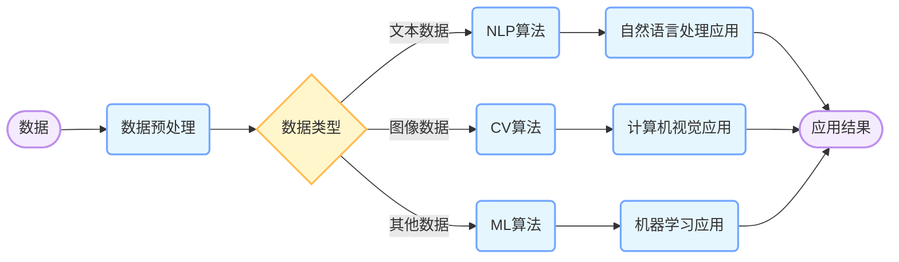

# AI编程：未来的技术挑战

> 关键词：AI编程、技术挑战、机器学习、深度学习、自然语言处理、计算机视觉、人工智能伦理

> 摘要：本文深入探讨了AI编程领域未来面临的技术挑战。从AI编程的背景出发，详细介绍了其核心概念、算法原理、数学模型等内容。通过项目实战案例，展示了AI编程在实际开发中的具体实现和代码解读。同时，分析了AI编程的实际应用场景，推荐了相关的学习资源、开发工具和论文著作。最后，总结了AI编程未来的发展趋势与挑战，并对常见问题进行了解答，为读者全面了解AI编程及其未来挑战提供了有价值的参考。

## 1. 背景介绍 
### 1.1 目的和范围
AI编程作为当前科技领域的前沿方向，正以前所未有的速度改变着我们的生活和工作方式。本文章的目的在于全面、深入地探讨AI编程未来所面临的技术挑战，涵盖从基础概念到实际应用的各个层面。范围涉及机器学习、深度学习、自然语言处理、计算机视觉等多个AI编程的核心领域，旨在为相关从业者、研究者以及对AI编程感兴趣的人士提供一个系统的、有深度的参考资料。

### 1.2 预期读者
本文的预期读者包括但不限于：AI编程领域的专业开发者，他们可以从文章中获取关于最新技术挑战和解决方案的深入见解；计算机科学相关专业的学生，通过阅读本文可以对AI编程的全貌有更清晰的认识，为未来的学习和研究打下基础；企业的技术决策者，能够根据文章内容了解AI编程的发展趋势，为企业的技术战略规划提供参考；以及对AI编程充满好奇的普通读者，通过通俗易懂的语言和丰富的案例，了解AI编程的魅力和挑战。

### 1.3 文档结构概述
本文将按照以下结构展开：首先介绍AI编程的背景知识，包括目的、预期读者和文档结构概述等；接着阐述AI编程的核心概念与联系，通过文本示意图和Mermaid流程图进行直观展示；然后详细讲解核心算法原理和具体操作步骤，并使用Python源代码进行说明；再介绍相关的数学模型和公式，并举例说明；之后通过项目实战，展示代码实际案例和详细解释；随后分析AI编程的实际应用场景；推荐相关的工具和资源；总结未来发展趋势与挑战；最后设置附录，解答常见问题，并提供扩展阅读和参考资料。

### 1.4 术语表
#### 1.4.1 核心术语定义
- **AI编程（Artificial Intelligence Programming）**：指利用计算机编程语言和相关技术，实现人工智能系统的开发过程。这些系统能够模拟人类的智能行为，如学习、推理、决策等。
- **机器学习（Machine Learning）**：是AI编程的一个重要分支，它让计算机通过数据来学习模式和规律，从而实现预测和决策等功能，而无需显式地编写程序。
- **深度学习（Deep Learning）**：是机器学习的一种特殊形式，它基于神经网络模型，通过多层的神经元结构来自动提取数据中的特征，在图像识别、语音识别等领域取得了显著的成果。
- **自然语言处理（Natural Language Processing）**：旨在让计算机理解、处理和生成人类语言，实现人机之间的自然语言交互，如智能客服、机器翻译等。
- **计算机视觉（Computer Vision）**：研究如何让计算机从图像或视频中提取信息，实现物体识别、场景理解等功能，在安防、自动驾驶等领域有广泛应用。

#### 1.4.2 相关概念解释
- **神经网络（Neural Network）**：是深度学习的核心模型，由大量的神经元组成，这些神经元通过连接权重相互作用，能够学习数据中的复杂模式。
- **训练数据（Training Data）**：用于训练机器学习或深度学习模型的数据集合，模型通过对训练数据的学习来调整自身的参数，以提高性能。
- **模型评估（Model Evaluation）**：在模型训练完成后，使用测试数据对模型的性能进行评估，常用的评估指标包括准确率、召回率、F1值等。
- **过拟合（Overfitting）**：指模型在训练数据上表现良好，但在测试数据上表现不佳的现象，通常是由于模型过于复杂，学习了训练数据中的噪声和细节。
- **欠拟合（Underfitting）**：与过拟合相反，指模型在训练数据和测试数据上的表现都不理想，通常是由于模型过于简单，无法捕捉数据中的复杂模式。

#### 1.4.3 缩略词列表
- **AI**：Artificial Intelligence（人工智能）
- **ML**：Machine Learning（机器学习）
- **DL**：Deep Learning（深度学习）
- **NLP**：Natural Language Processing（自然语言处理）
- **CV**：Computer Vision（计算机视觉）
- **CNN**：Convolutional Neural Network（卷积神经网络）
- **RNN**：Recurrent Neural Network（循环神经网络）
- **LSTM**：Long Short - Term Memory（长短期记忆网络）

## 2. 核心概念与联系 

### 核心概念原理
AI编程的核心概念主要围绕机器学习、深度学习、自然语言处理和计算机视觉展开。

#### 机器学习
机器学习的基本原理是通过对大量数据的学习，构建一个能够对新数据进行预测或分类的模型。常见的机器学习算法包括监督学习、无监督学习和强化学习。监督学习中，模型通过有标签的数据进行学习，例如在图像分类任务中，每个图像都有对应的类别标签，模型学习图像特征与类别之间的映射关系。无监督学习则处理无标签的数据，例如聚类算法将相似的数据点聚集在一起。强化学习通过智能体与环境的交互，根据奖励信号来学习最优策略。

#### 深度学习
深度学习基于神经网络模型，其核心原理是通过多层神经元的堆叠，自动从数据中提取特征。以卷积神经网络（CNN）为例，它在图像识别中表现出色。CNN通过卷积层、池化层和全连接层等结构，逐步提取图像的特征，从低级的边缘、纹理特征到高级的物体特征。循环神经网络（RNN）则适用于处理序列数据，如自然语言处理中的文本序列，它能够捕捉序列中的时间依赖关系。长短期记忆网络（LSTM）是RNN的一种改进，解决了传统RNN在处理长序列时的梯度消失问题。

#### 自然语言处理
自然语言处理的目标是让计算机理解和处理人类语言。其核心步骤包括文本预处理、词法分析、句法分析、语义分析等。文本预处理通常包括去除停用词、词干提取等操作，以减少数据噪声。词法分析将文本分解为单词或词元，句法分析分析句子的语法结构，语义分析则理解句子的含义。常见的自然语言处理任务包括文本分类、情感分析、机器翻译等。

#### 计算机视觉
计算机视觉的主要任务是从图像或视频中提取信息。其核心技术包括图像预处理、特征提取、目标检测、图像分割等。图像预处理包括图像增强、降噪等操作，以提高图像质量。特征提取用于提取图像的关键特征，例如SIFT、HOG等特征。目标检测旨在识别图像中的目标物体，并确定其位置和类别。图像分割则将图像分割为不同的区域，每个区域对应一个特定的物体或语义类别。

### 架构的文本示意图
AI编程的架构可以看作是一个多层次的结构，底层是数据层，包括各种类型的数据，如文本数据、图像数据、音频数据等。中间层是算法层，包含机器学习、深度学习等各种算法模型。上层是应用层，将AI技术应用于不同的领域，如医疗、交通、金融等。

### Mermaid流程图


## 3. 核心算法原理 & 具体操作步骤 

### 监督学习算法 - 线性回归
#### 算法原理
线性回归是一种简单而常用的监督学习算法，用于预测连续值的输出。其基本原理是假设输入特征 $x$ 与输出 $y$ 之间存在线性关系，即 $y = \theta_0 + \theta_1x_1+\theta_2x_2+\cdots+\theta_nx_n$，其中 $\theta_i$ 是模型的参数。通过最小化预测值与真实值之间的误差，即均方误差（MSE），来确定最优的参数 $\theta$。

#### Python源代码实现
```python
import numpy as np
from sklearn.model_selection import train_test_split
from sklearn.linear_model import LinearRegression
from sklearn.metrics import mean_squared_error

# 生成一些示例数据
np.random.seed(0)
X = 2 * np.random.rand(100, 1)
y = 4 + 3 * X + np.random.randn(100, 1)

# 划分训练集和测试集
X_train, X_test, y_train, y_test = train_test_split(X, y, test_size=0.2, random_state=42)

# 创建线性回归模型
model = LinearRegression()

# 训练模型
model.fit(X_train, y_train)

# 预测
y_pred = model.predict(X_test)

# 计算均方误差
mse = mean_squared_error(y_test, y_pred)
print(f"均方误差: {mse}")
```
#### 具体操作步骤
1. **数据生成**：使用`np.random.rand`生成随机的输入特征 $X$，并根据线性关系生成对应的输出 $y$，同时添加一些噪声。
2. **数据划分**：使用`train_test_split`函数将数据划分为训练集和测试集，比例为80%训练集和20%测试集。
3. **模型创建**：创建`LinearRegression`对象，即线性回归模型。
4. **模型训练**：使用`fit`方法对模型进行训练，通过训练集的数据来学习模型的参数。
5. **模型预测**：使用`predict`方法对测试集的数据进行预测，得到预测结果 $y_{pred}$。
6. **模型评估**：使用`mean_squared_error`函数计算预测值与真实值之间的均方误差，评估模型的性能。

### 深度学习算法 - 卷积神经网络（CNN）
#### 算法原理
卷积神经网络（CNN）主要用于处理图像数据。它通过卷积层、池化层和全连接层等结构来自动提取图像的特征。卷积层使用卷积核在图像上滑动，进行卷积操作，提取图像的局部特征。池化层则对卷积层的输出进行下采样，减少数据的维度，同时保留重要的特征。全连接层将池化层的输出展平后，进行分类或回归等任务。

#### Python源代码实现
```python
import tensorflow as tf
from tensorflow.keras import datasets, layers, models
import matplotlib.pyplot as plt

# 加载数据集
(train_images, train_labels), (test_images, test_labels) = datasets.cifar10.load_data()

# 数据预处理
train_images, test_images = train_images / 255.0, test_images / 255.0

# 构建CNN模型
model = models.Sequential()
model.add(layers.Conv2D(32, (3, 3), activation='relu', input_shape=(32, 32, 3)))
model.add(layers.MaxPooling2D((2, 2)))
model.add(layers.Conv2D(64, (3, 3), activation='relu'))
model.add(layers.MaxPooling2D((2, 2)))
model.add(layers.Conv2D(64, (3, 3), activation='relu'))
model.add(layers.Flatten())
model.add(layers.Dense(64, activation='relu'))
model.add(layers.Dense(10))

# 编译模型
model.compile(optimizer='adam',
              loss=tf.keras.losses.SparseCategoricalCrossentropy(from_logits=True),
              metrics=['accuracy'])

# 训练模型
history = model.fit(train_images, train_labels, epochs=10, 
                    validation_data=(test_images, test_labels))

# 评估模型
test_loss, test_acc = model.evaluate(test_images,  test_labels, verbose=2)
print(f"测试准确率: {test_acc}")
```
#### 具体操作步骤
1. **数据加载**：使用`datasets.cifar10.load_data()`加载CIFAR - 10数据集，该数据集包含10个类别的60000张彩色图像。
2. **数据预处理**：将图像数据的像素值归一化到0 - 1之间，以提高模型的训练效果。
3. **模型构建**：使用`Sequential`模型依次添加卷积层、池化层、全连接层等。卷积层使用`Conv2D`，池化层使用`MaxPooling2D`，全连接层使用`Dense`。
4. **模型编译**：使用`compile`方法指定优化器、损失函数和评估指标。这里使用`adam`优化器，`SparseCategoricalCrossentropy`损失函数，准确率作为评估指标。
5. **模型训练**：使用`fit`方法对模型进行训练，指定训练数据、训练轮数和验证数据。
6. **模型评估**：使用`evaluate`方法对模型在测试数据上的性能进行评估，得到测试损失和测试准确率。

## 4. 数学模型和公式 & 详细讲解 & 举例说明 

### 线性回归的数学模型和公式
#### 数学模型
线性回归的数学模型可以表示为：
$$y = \theta_0 + \theta_1x_1+\theta_2x_2+\cdots+\theta_nx_n+\epsilon$$
其中 $y$ 是输出值，$x_i$ 是输入特征，$\theta_i$ 是模型的参数，$\epsilon$ 是误差项，通常假设 $\epsilon$ 服从均值为0的正态分布。

#### 损失函数
线性回归通常使用均方误差（MSE）作为损失函数，其公式为：
$$MSE = \frac{1}{m}\sum_{i = 1}^{m}(y^{(i)} - \hat{y}^{(i)})^2$$
其中 $m$ 是样本数量，$y^{(i)}$ 是第 $i$ 个样本的真实值，$\hat{y}^{(i)}$ 是第 $i$ 个样本的预测值。

#### 求解参数
为了找到最优的参数 $\theta$，需要最小化均方误差。可以使用梯度下降法等优化算法来求解。梯度下降法的更新公式为：
$$\theta_j := \theta_j - \alpha\frac{\partial}{\partial\theta_j}MSE(\theta)$$
其中 $\alpha$ 是学习率，控制参数更新的步长。

#### 举例说明
假设有一个简单的线性回归问题，输入特征 $x$ 只有一个，即 $y = \theta_0+\theta_1x$。给定一组数据点 $(x_1, y_1), (x_2, y_2), \cdots, (x_m, y_m)$，我们的目标是找到 $\theta_0$ 和 $\theta_1$ 使得均方误差最小。例如，有数据点 $(1, 3), (2, 5), (3, 7)$，我们可以通过最小化均方误差来计算 $\theta_0$ 和 $\theta_1$ 的值。

### 卷积神经网络的数学模型和公式
#### 卷积操作
卷积操作是CNN的核心操作，其公式为：
$$y_{i,j} = \sum_{m = 0}^{M - 1}\sum_{n = 0}^{N - 1}x_{i + m,j + n}w_{m,n}+b$$
其中 $x$ 是输入特征图，$w$ 是卷积核，$b$ 是偏置，$y$ 是输出特征图。

#### 池化操作
最大池化操作是常见的池化操作之一，其公式为：
$$y_{i,j} = \max_{m,n\in R_{i,j}}x_{m,n}$$
其中 $R_{i,j}$ 是池化窗口在输入特征图上的对应区域。

#### 激活函数
CNN中常用的激活函数是ReLU（Rectified Linear Unit），其公式为：
$$f(x)=\max(0,x)$$
ReLU函数能够引入非线性，提高模型的表达能力。

#### 举例说明
假设有一个输入特征图是3x3的矩阵，卷积核是2x2的矩阵。输入特征图为：
$$
\begin{bmatrix}
1 & 2 & 3 \\
4 & 5 & 6 \\
7 & 8 & 9
\end{bmatrix}
$$
卷积核为：
$$
\begin{bmatrix}
1 & 0 \\
0 & 1
\end{bmatrix}
$$
通过卷积操作，得到的输出特征图为：
$$
\begin{bmatrix}
6 & 8 \\
12 & 14
\end{bmatrix}
$$

## 5. 项目实战：代码实际案例和详细解释说明 

### 5.1  开发环境搭建
#### 安装Python
首先需要安装Python，建议使用Python 3.7及以上版本。可以从Python官方网站（https://www.python.org/downloads/）下载安装包，按照安装向导进行安装。

#### 安装深度学习框架
这里以TensorFlow为例，安装TensorFlow可以使用pip命令：
```sh
pip install tensorflow
```
如果需要使用GPU加速，还需要安装对应的CUDA和cuDNN库。

#### 安装其他依赖库
还需要安装一些常用的库，如NumPy、Matplotlib等：
```sh
pip install numpy matplotlib
```

### 5.2  源代码详细实现和代码解读
#### 项目描述
本项目是一个简单的图像分类任务，使用CIFAR - 10数据集，通过CNN模型进行训练和预测。

#### 源代码实现
```python
import tensorflow as tf
from tensorflow.keras import datasets, layers, models
import matplotlib.pyplot as plt

# 加载数据集
(train_images, train_labels), (test_images, test_labels) = datasets.cifar10.load_data()

# 数据预处理
train_images, test_images = train_images / 255.0, test_images / 255.0

# 构建CNN模型
model = models.Sequential()
model.add(layers.Conv2D(32, (3, 3), activation='relu', input_shape=(32, 32, 3)))
model.add(layers.MaxPooling2D((2, 2)))
model.add(layers.Conv2D(64, (3, 3), activation='relu'))
model.add(layers.MaxPooling2D((2, 2)))
model.add(layers.Conv2D(64, (3, 3), activation='relu'))
model.add(layers.Flatten())
model.add(layers.Dense(64, activation='relu'))
model.add(layers.Dense(10))

# 编译模型
model.compile(optimizer='adam',
              loss=tf.keras.losses.SparseCategoricalCrossentropy(from_logits=True),
              metrics=['accuracy'])

# 训练模型
history = model.fit(train_images, train_labels, epochs=10, 
                    validation_data=(test_images, test_labels))

# 评估模型
test_loss, test_acc = model.evaluate(test_images,  test_labels, verbose=2)
print(f"测试准确率: {test_acc}")

# 绘制训练和验证准确率曲线
plt.plot(history.history['accuracy'], label='Training Accuracy')
plt.plot(history.history['val_accuracy'], label='Validation Accuracy')
plt.xlabel('Epoch')
plt.ylabel('Accuracy')
plt.legend(loc='lower right')
plt.show()
```
#### 代码解读
1. **数据加载**：使用`datasets.cifar10.load_data()`加载CIFAR - 10数据集，该数据集包含10个类别的60000张彩色图像，分为50000张训练图像和10000张测试图像。
2. **数据预处理**：将图像数据的像素值归一化到0 - 1之间，以提高模型的训练效果。
3. **模型构建**：
    - 使用`Sequential`模型依次添加卷积层、池化层、全连接层等。
    - 第一个卷积层`Conv2D(32, (3, 3), activation='relu', input_shape=(32, 32, 3))`表示使用32个3x3的卷积核，激活函数为ReLU，输入图像的形状为32x32x3。
    - 池化层`MaxPooling2D((2, 2))`表示使用2x2的最大池化窗口。
    - 全连接层`Dense(64, activation='relu')`表示有64个神经元，激活函数为ReLU。
    - 最后一个全连接层`Dense(10)`表示有10个神经元，对应10个类别。
4. **模型编译**：
    - 使用`adam`优化器，它是一种自适应学习率的优化算法。
    - 使用`SparseCategoricalCrossentropy`损失函数，适用于多分类问题，且标签是整数编码的情况。
    - 评估指标为准确率`accuracy`。
5. **模型训练**：使用`fit`方法对模型进行训练，指定训练数据、训练轮数`epochs = 10`和验证数据。
6. **模型评估**：使用`evaluate`方法对模型在测试数据上的性能进行评估，得到测试损失和测试准确率。
7. **绘制曲线**：使用`matplotlib`库绘制训练和验证准确率曲线，直观地观察模型的训练过程。

### 5.3  代码解读与分析
#### 模型性能分析
从训练和验证准确率曲线可以看出，随着训练轮数的增加，训练准确率逐渐提高，但验证准确率可能会出现波动。如果训练准确率远高于验证准确率，可能出现了过拟合现象。可以通过增加训练数据、正则化等方法来缓解过拟合。

#### 模型复杂度分析
CNN模型的复杂度主要取决于卷积层的数量、卷积核的大小和全连接层的神经元数量。增加卷积层和卷积核的数量可以提高模型的表达能力，但也会增加计算量和过拟合的风险。

#### 优化建议
- 可以尝试不同的优化器，如SGD、RMSprop等，比较它们的性能。
- 调整模型的超参数，如学习率、批量大小等，以提高模型的性能。
- 尝试使用数据增强技术，如随机翻转、旋转等，增加训练数据的多样性。

## 6. 实际应用场景 
### 医疗领域
AI编程在医疗领域有广泛的应用。例如，在疾病诊断方面，通过对医学图像（如X光、CT、MRI等）的分析，利用计算机视觉技术可以辅助医生快速准确地检测出病变部位和疾病类型。在医疗影像分析中，CNN模型可以自动识别肿瘤、骨折等病变，提高诊断的效率和准确性。此外，AI还可以用于药物研发，通过对大量的生物数据和化学数据的分析，预测药物的疗效和副作用，加速药物研发的进程。

### 交通领域
在交通领域，AI编程推动了自动驾驶技术的发展。计算机视觉技术用于识别道路、交通标志、其他车辆和行人等，机器学习算法用于决策和控制车辆的行驶。通过传感器收集的数据，自动驾驶汽车可以实时感知周围环境，做出安全、高效的驾驶决策。此外，AI还可以用于交通流量预测和管理，通过对交通数据的分析，优化交通信号控制，缓解交通拥堵。

### 金融领域
AI编程在金融领域的应用包括风险评估、信用评分、欺诈检测等。机器学习算法可以对客户的信用数据、交易记录等进行分析，评估客户的信用风险，为金融机构的贷款决策提供依据。在欺诈检测方面，通过对交易数据的实时监测和分析，AI可以识别出异常的交易行为，及时防范金融欺诈。

### 教育领域
在教育领域，AI编程可以实现个性化学习。通过对学生的学习数据（如学习进度、答题情况等）的分析，AI可以为每个学生制定个性化的学习计划和推荐学习资源。智能辅导系统可以根据学生的问题提供实时的辅导和反馈，提高学生的学习效果。

### 娱乐领域
AI编程在娱乐领域的应用包括游戏开发、内容推荐等。在游戏开发中，AI可以实现智能的游戏角色行为，提高游戏的趣味性和挑战性。在内容推荐方面，通过对用户的浏览历史、兴趣爱好等数据的分析，AI可以为用户推荐个性化的音乐、电影、书籍等内容。

## 7. 工具和资源推荐
### 7.1 学习资源推荐
#### 7.1.1 书籍推荐
- 《Python机器学习》（Sebastian Raschka著）：这本书详细介绍了Python在机器学习中的应用，包括各种机器学习算法的原理和实现。
- 《深度学习》（Ian Goodfellow、Yoshua Bengio和Aaron Courville著）：被誉为深度学习领域的“圣经”，全面介绍了深度学习的理论和实践。
- 《动手学深度学习》（李沐等著）：以动手实践为导向，通过大量的代码示例和详细的解释，帮助读者快速掌握深度学习的知识和技能。

#### 7.1.2 在线课程
- Coursera上的“机器学习”课程（Andrew Ng教授）：这是一门经典的机器学习课程，涵盖了机器学习的基本概念、算法和应用。
- edX上的“深度学习微硕士项目”：由多所知名大学联合推出，系统地介绍了深度学习的各个方面。
- 哔哩哔哩（Bilibili）上有很多关于AI编程的优质视频教程，如“同济子豪兄”的AI系列教程，讲解生动易懂。

#### 7.1.3 技术博客和网站
- Medium：是一个技术博客平台，有很多关于AI编程的优秀文章，作者来自世界各地的技术专家和研究者。
- 机器之心：专注于AI领域的资讯和技术分享，提供最新的AI研究成果、行业动态和技术教程。
- 开源中国：有很多关于AI编程的技术文章和项目分享，同时也是一个开源技术社区。

### 7.2 开发工具框架推荐
#### 7.2.1 IDE和编辑器
- PyCharm：是一款专门为Python开发设计的集成开发环境（IDE），具有强大的代码编辑、调试、代码分析等功能。
- Jupyter Notebook：是一个交互式的开发环境，适合进行数据探索、模型实验和代码演示。
- Visual Studio Code：是一款轻量级的代码编辑器，支持多种编程语言，有丰富的插件扩展功能，可用于AI编程的开发。

#### 7.2.2 调试和性能分析工具
- TensorBoard：是TensorFlow的可视化工具，可以帮助开发者可视化模型的训练过程、网络结构、性能指标等。
- PyTorch Profiler：是PyTorch的性能分析工具，可以帮助开发者分析模型的性能瓶颈，优化代码。
- cProfile：是Python的内置性能分析工具，可以分析Python代码的执行时间和函数调用情况。

#### 7.2.3 相关框架和库
- TensorFlow：是一个开源的深度学习框架，由Google开发，具有广泛的应用和丰富的文档资源。
- PyTorch：是另一个流行的深度学习框架，由Facebook开发，以其动态图机制和易用性受到很多开发者的喜爱。
- Scikit - learn：是一个用于机器学习的Python库，提供了各种机器学习算法的实现，如分类、回归、聚类等。
- OpenCV：是一个计算机视觉库，提供了丰富的图像处理和计算机视觉算法，可用于图像识别、目标检测等任务。

### 7.3 相关论文著作推荐
#### 7.3.1 经典论文
- “Gradient - Based Learning Applied to Document Recognition”（Yann LeCun等）：介绍了卷积神经网络（CNN）的经典论文，为图像识别领域的发展奠定了基础。
- “Long Short - Term Memory”（Sepp Hochreiter和Jürgen Schmidhuber）：提出了长短期记忆网络（LSTM），解决了传统RNN在处理长序列时的梯度消失问题。
- “Attention Is All You Need”（Ashish Vaswani等）：提出了Transformer架构，在自然语言处理领域取得了巨大的成功。

#### 7.3.2 最新研究成果
- arXiv是一个预印本平台，有很多关于AI编程的最新研究成果。可以关注相关的领域，如计算机视觉、自然语言处理、机器学习等，获取最新的研究论文。
- NeurIPS（神经信息处理系统大会）、ICML（国际机器学习会议）、CVPR（计算机视觉与模式识别会议）等学术会议是AI领域的顶级会议，会议上的论文代表了该领域的最新研究趋势。

#### 7.3.3 应用案例分析
- 《AI未来进行式》（李开复、王咏刚著）：通过大量的实际案例，介绍了AI在各个领域的应用和发展趋势。
- 各大科技公司的官方博客，如Google AI Blog、Facebook AI Research等，会分享他们在AI领域的应用案例和研究成果。

## 8. 总结：未来发展趋势与挑战
### 未来发展趋势
#### 多模态融合
未来的AI编程将更加注重多模态数据的融合，如图像、文本、音频等。通过融合不同模态的数据，可以获取更全面、更丰富的信息，提高模型的性能和泛化能力。例如，在智能客服中，结合语音和文本输入，能够更好地理解用户的意图。

#### 强化学习的应用拓展
强化学习在机器人控制、自动驾驶、游戏等领域已经取得了显著的成果。未来，强化学习将在更多的领域得到应用，如资源管理、金融投资等。通过智能体与环境的交互和学习，实现最优决策和控制。

#### 边缘计算与AI的结合
随着物联网的发展，边缘设备（如传感器、智能终端等）产生的数据量越来越大。将AI算法部署到边缘设备上，实现边缘计算与AI的结合，可以减少数据传输延迟，提高系统的实时性和安全性。例如，在智能安防系统中，边缘设备可以实时进行图像分析和目标检测。

#### 自动化机器学习（AutoML）
自动化机器学习将成为未来的一个重要发展方向。AutoML可以自动完成数据预处理、模型选择、超参数调优等任务，降低AI编程的门槛，提高开发效率。对于非专业的开发者来说，也可以通过AutoML快速开发出有效的AI模型。

### 挑战
#### 数据隐私和安全
AI编程依赖大量的数据进行训练，这些数据可能包含用户的敏感信息。如何保护数据的隐私和安全是一个重要的挑战。例如，在医疗领域，患者的病历数据需要严格保密，防止数据泄露。同时，还需要防范AI模型被攻击和篡改，确保模型的可靠性和安全性。

#### 算法可解释性
深度学习模型通常是黑盒模型，其决策过程难以解释。在一些关键领域，如医疗诊断、金融风险评估等，模型的可解释性至关重要。如何让AI模型的决策过程变得可解释，是当前研究的热点和难点。

#### 计算资源和能源消耗
深度学习模型的训练需要大量的计算资源和能源消耗。随着模型规模的不断增大，计算资源和能源消耗的问题将更加突出。如何提高模型的计算效率，降低能源消耗，是未来需要解决的问题。

#### 人工智能伦理
AI的发展也带来了一系列的伦理问题，如算法偏见、失业风险、人类与机器的关系等。如何制定合理的人工智能伦理准则，确保AI的发展符合人类的价值观和利益，是一个需要全社会共同关注和解决的问题。

## 9. 附录：常见问题与解答
### 问题1：AI编程需要具备哪些基础知识？
答：AI编程需要具备一定的数学基础，如线性代数、概率论、统计学等，这些知识是理解机器学习和深度学习算法的基础。同时，还需要掌握一门编程语言，如Python，以及相关的编程知识和技能。此外，对数据结构和算法的了解也有助于提高编程能力。

### 问题2：如何选择合适的AI框架？
答：选择合适的AI框架需要考虑多个因素。如果注重模型的部署和工业应用，TensorFlow是一个不错的选择，它有丰富的工具和社区支持。如果更注重研究和快速迭代，PyTorch的动态图机制和易用性使其成为首选。此外，还需要考虑项目的需求、团队的技术栈等因素。

### 问题3：如何解决模型过拟合的问题？
答：解决模型过拟合的方法有很多。可以增加训练数据的数量，使模型能够学习到更广泛的模式。也可以使用正则化方法，如L1和L2正则化，限制模型的复杂度。还可以使用Dropout技术，随机丢弃一些神经元，减少模型对特定特征的依赖。另外，提前停止训练也是一种有效的方法，当验证损失不再下降时，停止训练，避免模型过度拟合训练数据。

### 问题4：AI编程在实际项目中遇到数据不足怎么办？
答：当数据不足时，可以采用以下方法。首先，可以使用数据增强技术，如在图像数据中进行随机翻转、旋转、缩放等操作，增加数据的多样性。其次，可以使用迁移学习，利用在大规模数据集上预训练好的模型，在自己的小数据集上进行微调。还可以考虑数据合成的方法，如生成对抗网络（GAN）可以生成与真实数据相似的合成数据。

### 问题5：如何评估AI模型的性能？
答：评估AI模型的性能需要根据具体的任务选择合适的评估指标。在分类任务中，常用的评估指标包括准确率、召回率、F1值等。在回归任务中，常用的评估指标包括均方误差（MSE）、均方根误差（RMSE）、平均绝对误差（MAE）等。此外，还可以使用交叉验证等方法来更全面地评估模型的性能。

## 10. 扩展阅读 & 参考资料
### 扩展阅读
- 《智能时代》（吴军著）：从历史和社会的角度探讨了AI的发展及其对人类社会的影响。
- 《生命3.0》（迈克斯·泰格马克著）：探讨了人工智能的未来发展，以及人类与人工智能的关系。
- 《AI新生：破解人机共存密码》（李开复著）：介绍了AI在未来社会中的应用和发展趋势，以及人类如何与AI共存。

### 参考资料
- 各AI框架的官方文档，如TensorFlow官方文档（https://www.tensorflow.org/）、PyTorch官方文档（https://pytorch.org/）等。
- 学术数据库，如IEEE Xplore、ACM Digital Library等，提供了大量的AI领域的学术论文和研究成果。
- 相关的技术书籍和在线课程的参考资料。