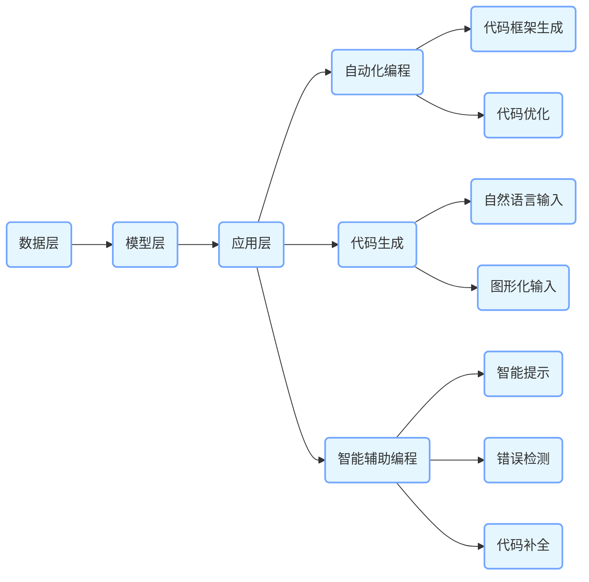

# AI编程：未来的编程范式

> 关键词：AI编程、编程范式、人工智能、自动化编程、代码生成、机器学习、未来趋势

> 摘要：本文深入探讨了AI编程这一未来极具潜力的编程范式。首先介绍了AI编程产生的背景，包括其目的、预期读者等信息。接着详细阐述了AI编程的核心概念与联系，通过文本示意图和Mermaid流程图进行直观展示。从算法原理到数学模型，逐步剖析AI编程的技术细节，并结合Python代码进行讲解。通过项目实战，呈现了AI编程在实际中的应用及代码实现过程。分析了AI编程的实际应用场景，推荐了相关的学习资源、开发工具框架和论文著作。最后对AI编程的未来发展趋势与挑战进行总结，并提供常见问题解答和参考资料，旨在帮助读者全面了解AI编程这一未来的编程范式。

## 1. 背景介绍 
### 1.1 目的和范围
AI编程作为一种新兴的编程范式，正逐渐改变着软件开发的方式和流程。本文的目的在于全面介绍AI编程的相关概念、技术原理、实际应用以及未来发展趋势，帮助读者深入理解这一领域。范围涵盖了AI编程的核心概念、算法原理、数学模型、项目实战、应用场景等多个方面，旨在为读者提供一个系统、全面的AI编程知识体系。

### 1.2 预期读者
本文预期读者包括但不限于程序员、软件开发者、人工智能爱好者、计算机科学专业的学生以及对未来编程趋势感兴趣的技术人员。无论您是初学者还是有一定经验的专业人士，都能从本文中获取到有价值的信息。

### 1.3 文档结构概述
本文将按照以下结构进行组织：首先介绍AI编程的背景信息，包括目的、预期读者和文档结构概述等；接着阐述AI编程的核心概念与联系，通过文本示意图和Mermaid流程图进行直观展示；然后详细讲解AI编程的核心算法原理和具体操作步骤，并结合Python代码进行说明；随后介绍AI编程的数学模型和公式，并举例说明；通过项目实战展示AI编程的实际应用和代码实现过程；分析AI编程的实际应用场景；推荐相关的学习资源、开发工具框架和论文著作；最后总结AI编程的未来发展趋势与挑战，并提供常见问题解答和参考资料。

### 1.4 术语表
#### 1.4.1 核心术语定义
- **AI编程（AI Programming）**：指利用人工智能技术来辅助或自动完成编程任务的过程，包括代码生成、代码优化、错误检测等。
- **编程范式（Programming Paradigm）**：是一种编程风格或方法，它定义了程序员如何组织和编写代码，常见的编程范式有面向对象编程、函数式编程等。
- **自动化编程（Automated Programming）**：通过自动化工具和技术来减少人工编程的工作量，提高编程效率和质量。
- **代码生成（Code Generation）**：利用人工智能算法自动生成代码的过程，通常基于自然语言描述或特定的需求规格。
- **机器学习（Machine Learning）**：是人工智能的一个分支，通过让计算机从数据中学习模式和规律，从而实现预测、分类等任务。

#### 1.4.2 相关概念解释
- **深度学习（Deep Learning）**：是机器学习的一种特殊形式，通过构建深度神经网络来学习数据的复杂特征和模式，在图像识别、自然语言处理等领域取得了显著的成果。
- **自然语言处理（Natural Language Processing，NLP）**：是人工智能的一个重要领域，研究如何让计算机理解和处理人类语言，包括文本分类、情感分析、机器翻译等任务。
- **生成对抗网络（Generative Adversarial Networks，GANs）**：是一种深度学习模型，由生成器和判别器组成，通过对抗训练的方式生成逼真的数据。

#### 1.4.3 缩略词列表
- **AI**：Artificial Intelligence（人工智能）
- **ML**：Machine Learning（机器学习）
- **DL**：Deep Learning（深度学习）
- **NLP**：Natural Language Processing（自然语言处理）
- **GANs**：Generative Adversarial Networks（生成对抗网络）

## 2. 核心概念与联系 
AI编程是将人工智能技术与传统编程相结合的一种新型编程范式。其核心概念包括自动化编程、代码生成、智能辅助编程等，这些概念相互关联，共同构成了AI编程的技术体系。

### 核心概念原理
- **自动化编程**：利用机器学习和自然语言处理技术，将人类的编程知识和经验进行建模，通过自动化工具和算法来完成编程任务。例如，根据用户的需求描述自动生成代码框架，或者对已有的代码进行自动优化。
- **代码生成**：基于深度学习模型，学习大量的代码样本，掌握代码的语法和语义规则，从而根据用户的需求生成相应的代码。代码生成可以基于自然语言描述、图形化界面或其他形式的输入。
- **智能辅助编程**：通过实时分析程序员的代码输入，提供智能提示、错误检测、代码补全等功能，帮助程序员提高编程效率和质量。智能辅助编程可以利用机器学习算法对代码进行语义分析，预测程序员的下一步操作。

### 架构的文本示意图
AI编程的架构主要包括数据层、模型层和应用层。数据层负责收集和整理编程相关的数据，包括代码库、需求文档、错误日志等。模型层利用机器学习和深度学习算法对数据进行训练，构建各种AI模型，如代码生成模型、错误检测模型等。应用层将训练好的模型应用到实际的编程场景中，提供自动化编程、智能辅助编程等功能。

### Mermaid流程图


## 3. 核心算法原理 & 具体操作步骤 
### 核心算法原理
AI编程中常用的核心算法包括机器学习算法和深度学习算法，如决策树、支持向量机、神经网络等。下面以神经网络为例，介绍其在代码生成中的应用原理。

神经网络是一种模仿人类神经系统的计算模型，由多个神经元组成。在代码生成中，通常使用循环神经网络（RNN）或其变体，如长短期记忆网络（LSTM）和门控循环单元（GRU）。这些网络可以处理序列数据，适合用于处理代码的顺序结构。

代码生成的过程可以看作是一个序列到序列的转换问题，输入是用户的需求描述（如自然语言文本），输出是对应的代码。神经网络通过学习大量的输入-输出对，掌握需求描述和代码之间的映射关系，从而实现代码的自动生成。

### 具体操作步骤
以下是使用Python和TensorFlow库实现简单代码生成的具体操作步骤：

#### 步骤1：数据准备
首先，需要收集和整理用于训练的代码数据。可以从开源代码库中获取大量的代码样本，并将其转换为适合神经网络处理的格式。例如，将代码按行分割，去除注释和空白字符，然后将每个字符转换为对应的整数编码。

```python
import numpy as np

# 读取代码数据
with open('code_samples.txt', 'r') as file:
    code_data = file.read()

# 构建字符到整数的映射
chars = sorted(list(set(code_data)))
char_to_int = {ch: i for i, ch in enumerate(chars)}
int_to_char = {i: ch for i, ch in enumerate(chars)}

# 将代码数据转换为整数编码
encoded_data = [char_to_int[ch] for ch in code_data]

# 准备训练数据
seq_length = 100
X = []
y = []
for i in range(len(encoded_data) - seq_length):
    X.append(encoded_data[i:i + seq_length])
    y.append(encoded_data[i + seq_length])

X = np.array(X)
y = np.array(y)
```

#### 步骤2：模型构建
使用TensorFlow构建一个简单的LSTM模型。

```python
import tensorflow as tf
from tensorflow.keras.models import Sequential
from tensorflow.keras.layers import LSTM, Dense

# 构建模型
model = Sequential()
model.add(LSTM(128, input_shape=(seq_length, 1)))
model.add(Dense(len(chars), activation='softmax'))

# 编译模型
model.compile(loss='sparse_categorical_crossentropy', optimizer='adam')
```

#### 步骤3：模型训练
将准备好的训练数据输入到模型中进行训练。

```python
# 调整输入数据的形状
X = np.reshape(X, (X.shape[0], X.shape[1], 1))

# 训练模型
model.fit(X, y, epochs=10, batch_size=128)
```

#### 步骤4：代码生成
使用训练好的模型生成代码。

```python
# 随机选择一个起始序列
start_index = np.random.randint(0, len(encoded_data) - seq_length)
pattern = encoded_data[start_index:start_index + seq_length]

# 生成代码
generated_code = ''
for _ in range(500):
    x = np.reshape(pattern, (1, len(pattern), 1))
    prediction = model.predict(x, verbose=0)
    index = np.argmax(prediction)
    result = int_to_char[index]
    generated_code += result
    pattern.append(index)
    pattern = pattern[1:]

print(generated_code)
```

## 4. 数学模型和公式 & 详细讲解 & 举例说明 
### 数学模型
在AI编程中，神经网络是常用的数学模型。以简单的全连接神经网络为例，其数学模型可以表示为：

$$
z^{[l]} = W^{[l]}a^{[l - 1]} + b^{[l]}
$$

$$
a^{[l]} = g(z^{[l]})
$$

其中，$z^{[l]}$ 表示第 $l$ 层的加权输入，$W^{[l]}$ 是第 $l$ 层的权重矩阵，$a^{[l - 1]}$ 是第 $l - 1$ 层的输出，$b^{[l]}$ 是第 $l$ 层的偏置向量，$a^{[l]}$ 是第 $l$ 层的输出，$g$ 是激活函数。

### 详细讲解
- **加权输入**：$z^{[l]}$ 是通过将上一层的输出 $a^{[l - 1]}$ 与权重矩阵 $W^{[l]}$ 相乘，并加上偏置向量 $b^{[l]}$ 得到的。权重矩阵 $W^{[l]}$ 决定了神经元之间的连接强度，偏置向量 $b^{[l]}$ 用于调整神经元的激活阈值。
- **激活函数**：激活函数 $g$ 用于引入非线性因素，使神经网络能够学习复杂的函数关系。常见的激活函数包括Sigmoid函数、ReLU函数等。

### 举例说明
假设我们有一个简单的两层全连接神经网络，输入层有2个神经元，隐藏层有3个神经元，输出层有1个神经元。输入向量 $x = [x_1, x_2]^T$，第一层的权重矩阵 $W^{[1]} = \begin{bmatrix} w_{11}^{[1]} & w_{12}^{[1]} \\ w_{21}^{[1]} & w_{22}^{[1]} \\ w_{31}^{[1]} & w_{32}^{[1]} \end{bmatrix}$，偏置向量 $b^{[1]} = [b_1^{[1]}, b_2^{[1]}, b_3^{[1]}]^T$，第二层的权重矩阵 $W^{[2]} = [w_1^{[2]}, w_2^{[2]}, w_3^{[2]}]$，偏置向量 $b^{[2]} = [b_1^{[2]}]$。

则第一层的加权输入为：

$$
z^{[1]} = W^{[1]}x + b^{[1]} = \begin{bmatrix} w_{11}^{[1]}x_1 + w_{12}^{[1]}x_2 + b_1^{[1]} \\ w_{21}^{[1]}x_1 + w_{22}^{[1]}x_2 + b_2^{[1]} \\ w_{31}^{[1]}x_1 + w_{32}^{[1]}x_2 + b_3^{[1]} \end{bmatrix}
$$

假设激活函数为Sigmoid函数 $g(z) = \frac{1}{1 + e^{-z}}$，则第一层的输出为：

$$
a^{[1]} = g(z^{[1]}) = \begin{bmatrix} \frac{1}{1 + e^{-(w_{11}^{[1]}x_1 + w_{12}^{[1]}x_2 + b_1^{[1]})}} \\ \frac{1}{1 + e^{-(w_{21}^{[1]}x_1 + w_{22}^{[1]}x_2 + b_2^{[1]})}} \\ \frac{1}{1 + e^{-(w_{31}^{[1]}x_1 + w_{32}^{[1]}x_2 + b_3^{[1]})}} \end{bmatrix}
$$

第二层的加权输入为：

$$
z^{[2]} = W^{[2]}a^{[1]} + b^{[2]} = w_1^{[2]}\frac{1}{1 + e^{-(w_{11}^{[1]}x_1 + w_{12}^{[1]}x_2 + b_1^{[1]})}} + w_2^{[2]}\frac{1}{1 + e^{-(w_{21}^{[1]}x_1 + w_{22}^{[1]}x_2 + b_2^{[1]})}} + w_3^{[2]}\frac{1}{1 + e^{-(w_{31}^{[1]}x_1 + w_{32}^{[1]}x_2 + b_3^{[1]})}} + b_1^{[2]}
$$

最终的输出为：

$$
a^{[2]} = g(z^{[2]}) = \frac{1}{1 + e^{-z^{[2]}}}
$$

## 5. 项目实战：代码实际案例和详细解释说明 
### 5.1  开发环境搭建
#### 安装Python
首先，需要安装Python开发环境。可以从Python官方网站（https://www.python.org/downloads/） 下载适合自己操作系统的Python安装包，并按照安装向导进行安装。

#### 安装相关库
在项目中，我们将使用TensorFlow、NumPy等库。可以使用pip命令进行安装：

```sh
pip install tensorflow numpy
```

### 5.2  源代码详细实现和代码解读
以下是一个基于AI编程实现简单文本分类的项目实例。

#### 数据准备
我们使用一个简单的电影评论数据集，包含评论内容和对应的情感标签（0表示负面，1表示正面）。

```python
import numpy as np
import tensorflow as tf
from tensorflow.keras.preprocessing.text import Tokenizer
from tensorflow.keras.preprocessing.sequence import pad_sequences

# 电影评论数据
reviews = [
    "This movie is really great!",
    "The plot is so boring.",
    "I love this film!",
    "It's a waste of time."
]

# 情感标签
labels = [1, 0, 1, 0]

# 分词器
tokenizer = Tokenizer(num_words=1000)
tokenizer.fit_on_texts(reviews)

# 将文本转换为序列
sequences = tokenizer.texts_to_sequences(reviews)

# 填充序列
max_length = 10
padded_sequences = pad_sequences(sequences, maxlen=max_length)

# 转换为NumPy数组
X = np.array(padded_sequences)
y = np.array(labels)
```

#### 模型构建
使用一个简单的LSTM模型进行文本分类。

```python
from tensorflow.keras.models import Sequential
from tensorflow.keras.layers import Embedding, LSTM, Dense

# 构建模型
model = Sequential()
model.add(Embedding(input_dim=1000, output_dim=16, input_length=max_length))
model.add(LSTM(16))
model.add(Dense(1, activation='sigmoid'))

# 编译模型
model.compile(loss='binary_crossentropy', optimizer='adam', metrics=['accuracy'])
```

#### 模型训练
将准备好的训练数据输入到模型中进行训练。

```python
# 训练模型
model.fit(X, y, epochs=10, batch_size=1)
```

#### 模型预测
使用训练好的模型进行预测。

```python
# 测试数据
test_reviews = [
    "This is an amazing movie!",
    "It's so bad."
]

# 转换为序列
test_sequences = tokenizer.texts_to_sequences(test_reviews)
test_padded_sequences = pad_sequences(test_sequences, maxlen=max_length)

# 预测
predictions = model.predict(test_padded_sequences)
for i in range(len(test_reviews)):
    print(f"Review: {test_reviews[i]}")
    print(f"Prediction: {'Positive' if predictions[i][0] > 0.5 else 'Negative'}")
```

### 5.3  代码解读与分析
- **数据准备**：使用`Tokenizer`将文本数据转换为序列，然后使用`pad_sequences`对序列进行填充，使其长度一致。这样可以方便后续的模型处理。
- **模型构建**：使用`Embedding`层将输入的整数序列转换为密集向量，`LSTM`层用于处理序列数据，`Dense`层作为输出层，使用`sigmoid`激活函数进行二分类。
- **模型训练**：使用`binary_crossentropy`作为损失函数，`adam`作为优化器，对模型进行训练。
- **模型预测**：将测试数据转换为序列并填充，然后使用训练好的模型进行预测，根据预测结果判断评论的情感极性。

## 6. 实际应用场景 
### 软件开发
在软件开发中，AI编程可以帮助程序员提高编程效率和质量。例如，自动生成代码框架、进行代码优化和错误检测。通过智能辅助编程工具，程序员可以更快地完成代码编写任务，减少手动输入的工作量。

### 数据科学
在数据科学领域，AI编程可以用于数据预处理、特征工程、模型选择和调优等任务。例如，自动生成数据清洗和预处理的代码，帮助数据科学家更快地完成数据分析和建模任务。

### 智能客服
AI编程可以应用于智能客服系统中，实现自动回答用户问题、解决常见问题等功能。通过自然语言处理技术，智能客服可以理解用户的问题，并生成相应的回答。

### 游戏开发
在游戏开发中，AI编程可以用于实现游戏中的智能行为，如敌人的行为模式、游戏角色的决策等。通过机器学习算法，游戏中的角色可以根据不同的情况做出智能决策，提高游戏的趣味性和挑战性。

## 7. 工具和资源推荐
### 7.1 学习资源推荐
#### 7.1.1 书籍推荐
- 《深度学习》（Deep Learning）：由Ian Goodfellow、Yoshua Bengio和Aaron Courville所著，是深度学习领域的经典教材，全面介绍了深度学习的理论和实践。
- 《Python深度学习》（Deep Learning with Python）：由Francois Chollet所著，通过Python代码和实例详细介绍了深度学习的应用。
- 《人工智能：一种现代的方法》（Artificial Intelligence: A Modern Approach）：由Stuart Russell和Peter Norvig所著，是人工智能领域的权威教材，涵盖了人工智能的各个方面。

#### 7.1.2 在线课程
- Coursera上的“深度学习专项课程”（Deep Learning Specialization）：由Andrew Ng教授主讲，系统介绍了深度学习的基础知识和应用。
- edX上的“人工智能导论”（Introduction to Artificial Intelligence）：由麻省理工学院（MIT）的教师授课，全面介绍了人工智能的概念、算法和应用。
- Udemy上的“Python for Data Science and Machine Learning Bootcamp”：通过Python代码和实际案例，介绍了数据科学和机器学习的基础知识和应用。

#### 7.1.3 技术博客和网站
- Medium：是一个技术博客平台，有许多关于AI编程、机器学习、深度学习等领域的优质文章。
- Towards Data Science：专注于数据科学和机器学习领域，提供了大量的技术文章和案例分析。
- AI Stack Exchange：是一个问答社区，用户可以在这里提问和交流关于AI编程的问题和经验。

### 7.2 开发工具框架推荐
#### 7.2.1 IDE和编辑器
- PyCharm：是一款专门为Python开发设计的集成开发环境（IDE），提供了丰富的代码编辑、调试和分析功能。
- Visual Studio Code：是一款轻量级的代码编辑器，支持多种编程语言，通过安装插件可以实现AI编程的开发和调试。
- Jupyter Notebook：是一个交互式的开发环境，适合进行数据探索、模型训练和可视化等任务。

#### 7.2.2 调试和性能分析工具
- TensorBoard：是TensorFlow提供的可视化工具，可以用于查看模型的训练过程、性能指标等信息。
- PyTorch Profiler：是PyTorch提供的性能分析工具，可以帮助开发者找出代码中的性能瓶颈。
- cProfile：是Python标准库中的性能分析工具，可以分析代码的执行时间和函数调用关系。

#### 7.2.3 相关框架和库
- TensorFlow：是一个开源的机器学习框架，提供了丰富的工具和库，用于构建和训练各种深度学习模型。
- PyTorch：是另一个流行的深度学习框架，具有动态计算图的特点，适合快速迭代和实验。
- Scikit-learn：是一个用于机器学习的Python库，提供了各种机器学习算法和工具，如分类、回归、聚类等。

### 7.3 相关论文著作推荐
#### 7.3.1 经典论文
- “Attention Is All You Need”：提出了Transformer模型，是自然语言处理领域的重要突破。
- “Generative Adversarial Nets”：首次提出了生成对抗网络（GANs）的概念，开创了生成模型的新纪元。
- “ImageNet Classification with Deep Convolutional Neural Networks”：介绍了AlexNet模型，开启了深度学习在计算机视觉领域的应用热潮。

#### 7.3.2 最新研究成果
- 关注顶级学术会议，如NeurIPS（神经信息处理系统大会）、ICML（国际机器学习会议）、CVPR（计算机视觉与模式识别会议）等，这些会议上会发布许多关于AI编程的最新研究成果。
- 查阅相关学术期刊，如Journal of Artificial Intelligence Research（JAIR）、Artificial Intelligence等，获取最新的研究论文。

#### 7.3.3 应用案例分析
- 许多科技公司会在其官方博客上分享AI编程的应用案例，如Google AI Blog、Facebook AI Research等。
- Kaggle是一个数据科学竞赛平台，上面有许多关于AI编程的实际应用案例和解决方案。

## 8. 总结：未来发展趋势与挑战
### 未来发展趋势
- **更强大的代码生成能力**：随着深度学习技术的不断发展，AI编程的代码生成能力将越来越强大。未来的AI编程工具可以根据用户的自然语言描述生成高质量、复杂的代码，大大提高编程效率。
- **智能编程助手的普及**：智能编程助手将成为程序员的重要工具，能够实时分析程序员的代码输入，提供智能提示、错误检测、代码优化等功能。智能编程助手还可以与程序员进行自然语言交互，理解程序员的需求并提供相应的帮助。
- **跨领域融合**：AI编程将与其他领域进行更深入的融合，如物联网、区块链、生物信息学等。通过AI编程，可以实现这些领域的自动化和智能化，推动相关领域的发展。
- **低代码/无代码开发**：低代码/无代码开发平台将借助AI编程技术，让非专业程序员也能够快速开发应用程序。这些平台提供可视化的界面和预制的组件，用户可以通过简单的拖拽和配置来完成应用程序的开发。

### 挑战
- **数据质量和隐私问题**：AI编程需要大量的高质量数据进行训练，但数据的收集、标注和管理面临着诸多挑战。同时，数据隐私和安全问题也需要得到重视，确保用户数据不被泄露和滥用。
- **模型可解释性**：深度学习模型通常是黑盒模型，其决策过程难以解释。在一些对安全性和可靠性要求较高的领域，如医疗、金融等，模型的可解释性是一个重要的问题。
- **技术伦理和法律问题**：AI编程的发展可能会带来一些技术伦理和法律问题，如算法歧视、数据垄断等。需要建立相应的伦理和法律框架，规范AI编程的发展。
- **人才短缺**：AI编程是一个新兴的领域，需要具备人工智能和编程知识的复合型人才。目前，相关人才短缺的问题比较突出，需要加强人才培养和教育。

## 9. 附录：常见问题与解答
### 问题1：AI编程是否会取代程序员？
答：AI编程不会取代程序员，而是会成为程序员的重要工具。虽然AI编程可以自动完成一些编程任务，但程序员的创造力、逻辑思维和问题解决能力是不可替代的。AI编程可以帮助程序员提高效率，让他们有更多的时间和精力去处理复杂的问题和创新。

### 问题2：AI编程需要具备哪些基础知识？
答：AI编程需要具备一定的编程基础，如Python语言。同时，还需要了解机器学习、深度学习的基本概念和算法，以及相关的数学知识，如线性代数、概率论等。

### 问题3：如何评估AI编程生成的代码质量？
答：可以从代码的正确性、可读性、可维护性等方面评估AI编程生成的代码质量。可以使用代码审查工具、自动化测试工具等对代码进行检查和测试，确保代码的质量。

### 问题4：AI编程在实际应用中存在哪些局限性？
答：AI编程在实际应用中存在一些局限性，如对复杂业务逻辑的理解能力有限、生成的代码可能存在性能问题等。此外，AI编程的效果还受到数据质量和模型训练的影响。

## 10. 扩展阅读 & 参考资料
### 扩展阅读
- 《AI未来进行式》：探讨了人工智能在各个领域的应用和未来发展趋势。
- 《人类简史：从动物到上帝》：从人类历史的角度探讨了技术进步对人类社会的影响，对理解AI编程的发展有一定的启示作用。

### 参考资料
- 相关学术论文和研究报告，如IEEE、ACM等学术组织发表的论文。
- 开源代码库和项目，如GitHub上的相关项目。
- 技术博客和论坛，如Stack Overflow、Reddit等。