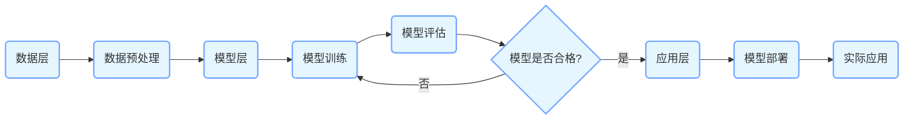

# AI编程：程序员的职业新方向

> 关键词：AI编程、程序员、职业方向、人工智能、机器学习、深度学习、技术趋势

> 摘要：随着人工智能技术的飞速发展，AI编程正逐渐成为程序员的职业新方向。本文深入探讨了AI编程的背景、核心概念、算法原理、数学模型、实际应用场景等多方面内容。通过详细的技术分析和实际案例，帮助程序员了解AI编程的魅力与潜力，同时为他们在这个新领域的职业发展提供全面的指导和资源推荐，让程序员能够更好地把握AI编程带来的机遇，应对未来的挑战。

## 1. 背景介绍 
### 1.1 目的和范围
本文的目的在于全面介绍AI编程这一新兴领域，为广大程序员提供一个深入了解AI编程的窗口。我们将探讨AI编程的核心概念、算法原理、数学基础等理论知识，同时结合实际案例展示AI编程在不同场景下的应用。范围涵盖从基础的机器学习到前沿的深度学习技术，以及AI编程在各个行业的实际应用。

### 1.2 预期读者
本文主要面向广大程序员群体，无论是有一定编程经验的资深开发者，还是刚刚踏入编程领域的新手，都能从本文中获取有价值的信息。对于那些希望拓展职业领域，涉足AI编程的程序员来说，本文将是一个很好的学习和参考资料。

### 1.3 文档结构概述
本文将按照以下结构进行阐述：首先介绍AI编程的背景知识，包括目的、读者群体和文档结构等；接着深入讲解AI编程的核心概念与联系，通过文本示意图和Mermaid流程图进行直观展示；然后详细阐述核心算法原理和具体操作步骤，并使用Python源代码进行说明；再介绍相关的数学模型和公式，并举例说明；之后通过项目实战展示代码实际案例并进行详细解释；接着探讨AI编程的实际应用场景；随后推荐学习AI编程的工具和资源；最后总结AI编程的未来发展趋势与挑战，并提供常见问题与解答以及扩展阅读和参考资料。

### 1.4 术语表
#### 1.4.1 核心术语定义
- **AI编程（Artificial Intelligence Programming）**：指利用计算机编程技术来实现人工智能相关功能的过程，包括机器学习、深度学习、自然语言处理等多个领域。
- **机器学习（Machine Learning）**：是一门多领域交叉学科，涉及概率论、统计学、逼近论、凸分析、算法复杂度理论等多门学科。它专门研究计算机怎样模拟或实现人类的学习行为，以获取新的知识或技能，重新组织已有的知识结构使之不断改善自身的性能。
- **深度学习（Deep Learning）**：是机器学习的一个分支领域，它是一种基于对数据进行表征学习的方法。深度学习通过构建具有很多层的神经网络模型，自动从大量数据中学习特征和模式。
- **神经网络（Neural Network）**：是一种模仿人类神经系统的计算模型，由大量的神经元组成，可以自动从数据中学习复杂的模式和关系。
- **自然语言处理（Natural Language Processing）**：是计算机科学与语言学的交叉领域，主要研究如何让计算机理解、处理和生成人类语言。

#### 1.4.2 相关概念解释
- **监督学习（Supervised Learning）**：是机器学习中的一种学习方式，在监督学习中，模型通过学习输入数据和对应的标签（输出）之间的关系来进行训练。例如，给定一组手写数字图像及其对应的数字标签，模型学习如何从图像中识别出正确的数字。
- **无监督学习（Unsupervised Learning）**：与监督学习不同，无监督学习中没有给定的标签。模型的任务是从数据中发现潜在的结构和模式，例如聚类分析，将相似的数据点归为一类。
- **强化学习（Reinforcement Learning）**：智能体通过与环境进行交互，根据环境反馈的奖励信号来学习最优的行为策略。例如，训练机器人在迷宫中寻找出口，机器人根据每一步的奖励（如到达目标位置得到正奖励，撞到墙壁得到负奖励）来调整自己的行动策略。

#### 1.4.3 缩略词列表
- **AI**：Artificial Intelligence（人工智能）
- **ML**：Machine Learning（机器学习）
- **DL**：Deep Learning（深度学习）
- **NLP**：Natural Language Processing（自然语言处理）
- **ANN**：Artificial Neural Network（人工神经网络）
- **CNN**：Convolutional Neural Network（卷积神经网络）
- **RNN**：Recurrent Neural Network（循环神经网络）

## 2. 核心概念与联系 

### 2.1 核心概念原理
AI编程的核心概念主要围绕机器学习和深度学习展开。机器学习是AI编程的基础，它通过让计算机从数据中学习模式和规律，从而实现对未知数据的预测和分类。深度学习则是机器学习的一个高级分支，它通过构建深度神经网络，能够自动从大量数据中学习到更复杂的特征和模式。

自然语言处理是AI编程在语言领域的应用，它涉及到文本的处理、理解和生成。计算机视觉则是AI编程在图像和视频领域的应用，包括图像分类、目标检测、图像生成等任务。

### 2.2 架构的文本示意图
AI编程的架构可以分为数据层、模型层和应用层。

- **数据层**：是AI编程的基础，它包含了各种类型的数据，如文本、图像、音频等。数据的质量和数量对模型的性能有着重要的影响。数据需要经过预处理，如清洗、标注、归一化等操作，才能用于模型的训练。
- **模型层**：是AI编程的核心，它包含了各种机器学习和深度学习模型。模型的选择取决于具体的任务和数据特点。例如，对于图像分类任务，卷积神经网络（CNN）是一个常用的模型；对于序列数据处理，循环神经网络（RNN）及其变体（如LSTM、GRU）更为合适。
- **应用层**：是AI编程的最终目标，它将训练好的模型应用到实际场景中，如智能客服、自动驾驶、图像识别等。应用层需要考虑模型的部署、性能优化和用户交互等问题。

### 2.3 Mermaid流程图


## 3. 核心算法原理 & 具体操作步骤 

### 3.1 线性回归算法原理
线性回归是一种简单而常用的机器学习算法，用于预测连续数值。其基本原理是通过找到一条直线（在多维空间中是超平面），使得所有数据点到该直线的距离之和最小。

线性回归的数学模型可以表示为：
$$y = \theta_0 + \theta_1x_1 + \theta_2x_2 + \cdots + \theta_nx_n + \epsilon$$
其中，$y$ 是目标变量，$x_1, x_2, \cdots, x_n$ 是特征变量，$\theta_0, \theta_1, \cdots, \theta_n$ 是模型的参数，$\epsilon$ 是误差项。

### 3.2 线性回归的Python实现
```python
import numpy as np
from sklearn.linear_model import LinearRegression
from sklearn.model_selection import train_test_split
from sklearn.metrics import mean_squared_error

# 生成一些示例数据
np.random.seed(0)
X = 2 * np.random.rand(100, 1)
y = 4 + 3 * X + np.random.randn(100, 1)

# 划分训练集和测试集
X_train, X_test, y_train, y_test = train_test_split(X, y, test_size=0.2, random_state=42)

# 创建线性回归模型
model = LinearRegression()

# 训练模型
model.fit(X_train, y_train)

# 预测
y_pred = model.predict(X_test)

# 计算均方误差
mse = mean_squared_error(y_test, y_pred)
print(f"均方误差: {mse}")

# 打印模型参数
print(f"截距: {model.intercept_}")
print(f"系数: {model.coef_}")
```
### 3.3 具体操作步骤
1. **数据准备**：收集和整理相关数据，并将其划分为训练集和测试集。
2. **模型选择**：根据任务需求选择合适的模型，这里选择线性回归模型。
3. **模型训练**：使用训练集数据对模型进行训练，通过最小化损失函数来调整模型的参数。
4. **模型评估**：使用测试集数据对训练好的模型进行评估，计算评估指标（如均方误差）。
5. **模型优化**：如果评估结果不理想，可以尝试调整模型的参数或选择其他模型。
6. **模型部署**：将训练好的模型部署到实际应用中。

### 3.4 逻辑回归算法原理
逻辑回归是一种用于分类任务的机器学习算法，它通过逻辑函数将线性回归的输出映射到概率值。逻辑函数的表达式为：
$$\sigma(z) = \frac{1}{1 + e^{-z}}$$
其中，$z$ 是线性回归的输出。逻辑回归的目标是找到一组参数，使得模型对训练数据的分类准确率最高。

### 3.5 逻辑回归的Python实现
```python
from sklearn.datasets import load_iris
from sklearn.linear_model import LogisticRegression
from sklearn.model_selection import train_test_split
from sklearn.metrics import accuracy_score

# 加载鸢尾花数据集
iris = load_iris()
X = iris.data
y = iris.target

# 划分训练集和测试集
X_train, X_test, y_train, y_test = train_test_split(X, y, test_size=0.2, random_state=42)

# 创建逻辑回归模型
model = LogisticRegression()

# 训练模型
model.fit(X_train, y_train)

# 预测
y_pred = model.predict(X_test)

# 计算准确率
accuracy = accuracy_score(y_test, y_pred)
print(f"准确率: {accuracy}")
```

### 3.6 具体操作步骤
逻辑回归的操作步骤与线性回归类似，包括数据准备、模型选择、模型训练、模型评估、模型优化和模型部署。不同之处在于，逻辑回归的评估指标通常使用准确率、召回率、F1值等分类指标。

## 4. 数学模型和公式 & 详细讲解 & 举例说明 

### 4.1 线性回归的数学模型和公式
线性回归的目标是最小化损失函数，常用的损失函数是均方误差（Mean Squared Error, MSE）：
$$MSE = \frac{1}{n} \sum_{i=1}^{n} (y_i - \hat{y}_i)^2$$
其中，$n$ 是样本数量，$y_i$ 是真实值，$\hat{y}_i$ 是预测值。

为了找到使损失函数最小的参数 $\theta$，可以使用最小二乘法。最小二乘法的解为：
$$\hat{\theta} = (X^T X)^{-1} X^T y$$
其中，$X$ 是特征矩阵，$y$ 是目标向量。

### 4.2 详细讲解
最小二乘法的原理是通过求解损失函数对参数 $\theta$ 的偏导数，并令其等于零，得到一个关于 $\theta$ 的线性方程组。解这个方程组就可以得到使损失函数最小的参数 $\theta$。

### 4.3 举例说明
假设我们有以下数据集：
| $x$ | $y$ |
|---|---|
| 1 | 3 |
| 2 | 5 |
| 3 | 7 |

我们可以使用最小二乘法来求解线性回归的参数。首先，构建特征矩阵 $X$ 和目标向量 $y$：
$$X = \begin{bmatrix} 1 & 1 \\ 1 & 2 \\ 1 & 3 \end{bmatrix}, y = \begin{bmatrix} 3 \\ 5 \\ 7 \end{bmatrix}$$
然后，计算 $(X^T X)^{-1} X^T y$：
```python
import numpy as np

X = np.array([[1, 1], [1, 2], [1, 3]])
y = np.array([[3], [5], [7]])

theta = np.linalg.inv(X.T.dot(X)).dot(X.T).dot(y)
print(f"参数: {theta}")
```
运行上述代码，我们可以得到参数 $\theta_0 = 1$ 和 $\theta_1 = 2$，即线性回归方程为 $y = 1 + 2x$。

### 4.4 逻辑回归的数学模型和公式
逻辑回归的损失函数通常使用对数损失函数（Log Loss）：
$$J(\theta) = -\frac{1}{n} \sum_{i=1}^{n} [y_i \log(\hat{y}_i) + (1 - y_i) \log(1 - \hat{y}_i)]$$
其中，$y_i$ 是真实标签（0 或 1），$\hat{y}_i$ 是预测概率。

为了最小化损失函数，通常使用梯度下降法。梯度下降法的更新公式为：
$$\theta_{j} := \theta_{j} - \alpha \frac{\partial J(\theta)}{\partial \theta_{j}}$$
其中，$\alpha$ 是学习率，$\frac{\partial J(\theta)}{\partial \theta_{j}}$ 是损失函数对参数 $\theta_j$ 的偏导数。

### 4.5 详细讲解
梯度下降法的原理是通过不断地沿着损失函数的负梯度方向更新参数，使得损失函数逐渐减小。学习率 $\alpha$ 控制了每次更新的步长，如果学习率过大，可能会导致算法无法收敛；如果学习率过小，算法的收敛速度会很慢。

### 4.6 举例说明
假设我们有一个二分类问题，使用逻辑回归进行分类。我们可以使用梯度下降法来训练模型，以下是一个简单的 Python 实现：
```python
import numpy as np

# 生成一些示例数据
np.random.seed(0)
X = 2 * np.random.rand(100, 2)
y = (3 * X[:, 0] + 4 * X[:, 1] > 5).astype(int)

# 添加偏置项
X_b = np.c_[np.ones((100, 1)), X]

# 初始化参数
theta = np.zeros((3, 1))

# 定义学习率和迭代次数
alpha = 0.1
n_iterations = 1000

# 梯度下降法
for iteration in range(n_iterations):
    scores = np.dot(X_b, theta)
    predictions = 1 / (1 + np.exp(-scores))
    error = predictions - y.reshape(-1, 1)
    gradient = np.dot(X_b.T, error) / len(X_b)
    theta = theta - alpha * gradient

print(f"参数: {theta}")
```
运行上述代码，我们可以得到逻辑回归的参数 $\theta$。

## 5. 项目实战：代码实际案例和详细解释说明 

### 5.1  开发环境搭建
在进行 AI 编程项目实战之前，需要搭建相应的开发环境。以下是搭建环境的步骤：

1. **安装 Python**：建议安装 Python 3.7 及以上版本。可以从 Python 官方网站（https://www.python.org/downloads/）下载安装包进行安装。
2. **安装 Anaconda**：Anaconda 是一个用于科学计算的 Python 发行版，它包含了许多常用的科学计算库和工具。可以从 Anaconda 官方网站（https://www.anaconda.com/products/individual）下载安装包进行安装。
3. **创建虚拟环境**：使用 Anaconda 可以方便地创建虚拟环境。打开 Anaconda Prompt，输入以下命令创建一个名为 `ai_project` 的虚拟环境：
```bash
conda create -n ai_project python=3.8
```
4. **激活虚拟环境**：输入以下命令激活虚拟环境：
```bash
conda activate ai_project
```
5. **安装必要的库**：在虚拟环境中安装必要的库，如 `numpy`、`pandas`、`scikit-learn`、`tensorflow`、`pytorch` 等。可以使用以下命令进行安装：
```bash
pip install numpy pandas scikit-learn tensorflow torch torchvision
```

### 5.2  源代码详细实现和代码解读
#### 5.2.1 图像分类项目
我们将使用 TensorFlow 和 Keras 实现一个简单的图像分类项目，对 MNIST 手写数字数据集进行分类。

```python
import tensorflow as tf
from tensorflow import keras
import numpy as np
import matplotlib.pyplot as plt

# 加载 MNIST 数据集
mnist = keras.datasets.mnist
(train_images, train_labels), (test_images, test_labels) = mnist.load_data()

# 数据预处理
train_images = train_images / 255.0
test_images = test_images / 255.0

# 构建模型
model = keras.Sequential([
    keras.layers.Flatten(input_shape=(28, 28)),
    keras.layers.Dense(128, activation='relu'),
    keras.layers.Dense(10, activation='softmax')
])

# 编译模型
model.compile(optimizer='adam',
              loss='sparse_categorical_crossentropy',
              metrics=['accuracy'])

# 训练模型
model.fit(train_images, train_labels, epochs=10)

# 评估模型
test_loss, test_acc = model.evaluate(test_images, test_labels)
print(f"测试准确率: {test_acc}")

# 预测
predictions = model.predict(test_images)
```

#### 5.2.2 代码解读
1. **数据加载**：使用 `keras.datasets.mnist.load_data()` 加载 MNIST 数据集，该数据集包含 60000 个训练样本和 10000 个测试样本。
2. **数据预处理**：将图像像素值归一化到 0 到 1 之间，这有助于模型的训练。
3. **模型构建**：使用 `keras.Sequential()` 构建一个简单的神经网络模型，包含一个 Flatten 层、一个全连接层和一个输出层。
4. **模型编译**：使用 `model.compile()` 编译模型，指定优化器、损失函数和评估指标。
5. **模型训练**：使用 `model.fit()` 训练模型，指定训练数据、训练轮数等参数。
6. **模型评估**：使用 `model.evaluate()` 评估模型在测试集上的性能。
7. **模型预测**：使用 `model.predict()` 对测试集进行预测。

### 5.3  代码解读与分析
#### 5.3.1 模型结构分析
上述图像分类模型的结构相对简单，包含一个 Flatten 层、一个全连接层和一个输出层。Flatten 层的作用是将输入的二维图像数据展平为一维向量，方便后续的全连接层处理。全连接层使用 ReLU 激活函数，增加模型的非线性能力。输出层使用 Softmax 激活函数，将模型的输出转换为概率分布，表示每个类别的概率。

#### 5.3.2 损失函数和优化器分析
损失函数使用 `sparse_categorical_crossentropy`，适用于多分类问题，且标签为整数编码的情况。优化器使用 `adam`，它是一种自适应学习率的优化算法，能够自动调整学习率，提高模型的训练效率。

#### 5.3.3 训练过程分析
在训练过程中，模型会不断地调整参数，使得损失函数逐渐减小，准确率逐渐提高。训练轮数（`epochs`）控制了模型训练的次数，需要根据实际情况进行调整。如果训练轮数过少，模型可能无法充分学习数据的特征；如果训练轮数过多，模型可能会出现过拟合的问题。

#### 5.3.4 评估和预测分析
评估模型时，使用测试集数据来评估模型的性能。测试准确率是衡量模型性能的一个重要指标。预测时，模型会输出每个样本属于各个类别的概率，我们可以选择概率最大的类别作为预测结果。

## 6. 实际应用场景 
### 6.1 医疗领域
AI编程在医疗领域有着广泛的应用。例如，医学影像分析，通过深度学习算法可以对X光、CT、MRI等医学影像进行分析，帮助医生检测疾病、诊断病情。一些研究表明，AI模型在某些疾病的诊断准确率上已经达到甚至超过了人类专家。此外，AI还可以用于药物研发，通过分析大量的生物数据和药物信息，加速药物的研发过程。

### 6.2 金融领域
在金融领域，AI编程可以用于风险评估、信用评分、欺诈检测等。银行可以使用机器学习算法对客户的信用数据进行分析，评估客户的信用风险，从而决定是否给予贷款。同时，AI可以实时监测金融交易数据，识别异常交易行为，预防欺诈事件的发生。

### 6.3 交通领域
自动驾驶是AI编程在交通领域的一个重要应用。通过传感器收集车辆周围的环境信息，利用深度学习算法对这些信息进行处理和分析，实现车辆的自主导航和决策。此外，智能交通系统也可以利用AI技术对交通流量进行预测和优化，缓解交通拥堵。

### 6.4 教育领域
AI编程在教育领域的应用包括智能辅导系统、个性化学习推荐等。智能辅导系统可以根据学生的学习情况提供个性化的辅导和反馈，帮助学生提高学习效果。个性化学习推荐系统可以根据学生的兴趣和学习进度，推荐适合的学习资源和课程。

### 6.5 娱乐领域
在娱乐领域，AI编程可以用于游戏开发、影视制作等。游戏中可以使用AI技术实现智能的游戏角色和行为，提高游戏的趣味性和挑战性。在影视制作中，AI可以用于特效制作、内容推荐等，为观众带来更好的视听体验。

## 7. 工具和资源推荐
### 7.1 学习资源推荐
#### 7.1.1 书籍推荐
- 《Python机器学习》：这本书详细介绍了使用Python进行机器学习的方法和技巧，适合初学者入门。
- 《深度学习》：由深度学习领域的三位顶尖专家 Ian Goodfellow、Yoshua Bengio 和 Aaron Courville 合著，是深度学习领域的经典教材。
- 《统计学习方法》：全面介绍了统计学习的基本概念、理论和方法，对于理解机器学习的数学原理有很大帮助。

#### 7.1.2 在线课程
- Coursera 上的《机器学习》课程：由 Andrew Ng 教授授课，是机器学习领域的经典课程，讲解深入浅出，非常适合初学者。
- edX 上的《深度学习》课程：提供了深度学习的系统学习内容，包括理论和实践。
- 哔哩哔哩上的一些 AI 编程相关视频：有很多博主分享了 AI 编程的学习经验和实战项目，内容丰富多样。

#### 7.1.3 技术博客和网站
- Medium：上面有很多 AI 领域的专家分享的最新技术文章和研究成果。
- arXiv：一个预印本服务器，提供了大量的 AI 相关的学术论文。
- 机器之心：专注于人工智能领域的资讯和技术报道，提供了很多有价值的信息。

### 7.2 开发工具框架推荐
#### 7.2.1 IDE和编辑器
- PyCharm：是一款专业的 Python 集成开发环境，提供了丰富的功能和插件，方便开发和调试 AI 项目。
- Jupyter Notebook：是一个交互式的开发环境，适合进行数据探索和模型实验。
- Visual Studio Code：是一款轻量级的代码编辑器，支持多种编程语言和插件，非常适合快速开发和调试。

#### 7.2.2 调试和性能分析工具
- TensorBoard：是 TensorFlow 提供的可视化工具，可以用于监控模型的训练过程、分析模型的性能等。
- PyTorch Profiler：是 PyTorch 提供的性能分析工具，可以帮助开发者找出模型中的性能瓶颈。
- Scikit-learn 中的模型评估工具：可以用于评估模型的性能，如准确率、召回率、F1值等。

#### 7.2.3 相关框架和库
- TensorFlow：是一个开源的机器学习框架，由 Google 开发，提供了丰富的工具和库，适合大规模的深度学习项目。
- PyTorch：是一个开源的深度学习框架，由 Facebook 开发，具有动态图的特点，方便进行模型的开发和调试。
- Scikit-learn：是一个简单易用的机器学习库，提供了各种机器学习算法和工具，适合初学者和快速原型开发。

### 7.3 相关论文著作推荐
#### 7.3.1 经典论文
- 《Gradient-Based Learning Applied to Document Recognition》：由 Yann LeCun 等人发表，介绍了卷积神经网络（CNN）在手写数字识别中的应用，是 CNN 领域的经典论文。
- 《ImageNet Classification with Deep Convolutional Neural Networks》：由 Alex Krizhevsky 等人发表，提出了 AlexNet 模型，开启了深度学习在计算机视觉领域的热潮。
- 《Long Short-Term Memory》：由 Sepp Hochreiter 和 Jürgen Schmidhuber 发表，介绍了长短期记忆网络（LSTM）的原理和应用，是 RNN 领域的经典论文。

#### 7.3.2 最新研究成果
- 关注顶级学术会议，如 NeurIPS（神经信息处理系统大会）、ICML（国际机器学习会议）、CVPR（计算机视觉与模式识别会议）等，这些会议上会发布很多最新的 AI 研究成果。
- 关注知名学术期刊，如 Journal of Artificial Intelligence Research（JAIR）、Artificial Intelligence 等，这些期刊上会发表高质量的 AI 研究论文。

#### 7.3.3 应用案例分析
- 一些知名公司的技术博客，如 Google AI Blog、Facebook AI Research Blog 等，会分享他们在 AI 领域的应用案例和技术经验。
- 一些开源项目的文档和案例，如 TensorFlow、PyTorch 等框架的官方文档和示例代码，提供了很多实际应用的案例。

## 8. 总结：未来发展趋势与挑战
### 8.1 未来发展趋势
- **自动化和智能化**：AI编程将进一步推动自动化和智能化的发展，越来越多的任务将由AI系统自动完成。例如，自动化的软件开发工具将能够根据需求自动生成代码，提高开发效率。
- **跨领域融合**：AI将与其他领域如生物学、物理学、化学等进行深度融合，产生新的研究方向和应用领域。例如，在生物医学领域，AI可以帮助分析基因数据，加速药物研发。
- **强化学习的广泛应用**：强化学习将在机器人、自动驾驶、游戏等领域得到更广泛的应用。通过强化学习，智能体可以在复杂的环境中学习最优的行为策略。
- **量子计算与AI的结合**：量子计算的发展将为AI带来新的机遇。量子计算的强大计算能力可以加速AI模型的训练和推理过程，推动AI技术的进一步发展。

### 8.2 挑战
- **数据隐私和安全**：随着AI技术的发展，大量的数据被收集和使用，数据隐私和安全问题变得越来越重要。如何保护用户的数据隐私，防止数据泄露和滥用，是AI编程面临的一个重要挑战。
- **算法可解释性**：许多AI算法，如深度学习算法，是黑盒模型，其决策过程难以解释。在一些关键领域，如医疗、金融等，算法的可解释性是非常重要的。如何提高AI算法的可解释性，是当前研究的一个热点问题。
- **人才短缺**：AI编程是一个新兴领域，需要具备多学科知识的专业人才。目前，AI领域的人才短缺问题比较严重，如何培养更多的AI编程人才，是推动AI技术发展的关键。
- **伦理和道德问题**：AI技术的发展也带来了一些伦理和道德问题，如AI系统的决策是否公平、是否会导致失业等。如何制定合理的伦理和道德准则，引导AI技术的健康发展，是一个亟待解决的问题。

## 9. 附录：常见问题与解答
### 9.1 什么是AI编程？
AI编程是指利用计算机编程技术来实现人工智能相关功能的过程，包括机器学习、深度学习、自然语言处理等多个领域。

### 9.2 学习AI编程需要具备哪些基础知识？
学习AI编程需要具备一定的数学基础，如线性代数、概率论、统计学等，以及编程基础，如Python编程。

### 9.3 AI编程有哪些常用的库和框架？
常用的库和框架包括 TensorFlow、PyTorch、Scikit-learn 等。

### 9.4 如何选择适合的AI算法？
选择适合的AI算法需要考虑任务的类型（如分类、回归、聚类等）、数据的特点（如数据量、数据维度等）以及模型的性能要求等因素。

### 9.5 如何解决AI模型的过拟合问题？
可以通过增加数据量、正则化、早停法等方法来解决AI模型的过拟合问题。

### 9.6 AI编程在实际应用中有哪些挑战？
AI编程在实际应用中面临数据隐私和安全、算法可解释性、人才短缺、伦理和道德等挑战。

## 10. 扩展阅读 & 参考资料
### 10.1 扩展阅读
- 《AI未来进行式》：李开复和王咏刚著，探讨了AI技术对未来社会的影响和变革。
- 《智能时代》：吴军著，介绍了AI技术的发展历程和应用前景。
- 《人类简史：从动物到上帝》：尤瓦尔·赫拉利著，从人类历史的角度探讨了AI技术对人类社会的影响。

### 10.2 参考资料
- 《Python机器学习实战》：Sebastian Raschka 著，提供了丰富的Python机器学习实战案例。
- 《深度学习实战》：Antoine Géron 著，详细介绍了深度学习的理论和实践。
- 各框架和库的官方文档，如 TensorFlow 官方文档、PyTorch 官方文档等。