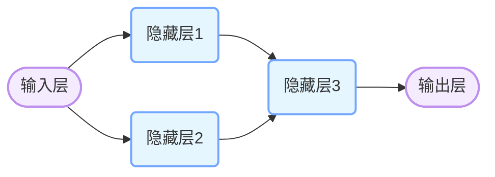

# AI编程：程序员的职业新选择

> 关键词：AI编程、程序员、职业选择、人工智能、机器学习、深度学习、编程技能

> 摘要：本文围绕AI编程作为程序员职业新选择展开探讨。首先介绍了AI编程兴起的背景，包括其目的、适用的预期读者以及文档结构。接着阐述了AI编程的核心概念、联系和架构，详细讲解了核心算法原理与具体操作步骤，并通过Python代码进行示例。同时，介绍了相关的数学模型和公式，并举例说明。在项目实战部分，提供了开发环境搭建的方法、源代码实现及解读。还探讨了AI编程的实际应用场景，推荐了学习资源、开发工具框架和相关论文著作。最后总结了AI编程未来的发展趋势与挑战，并给出常见问题解答和参考资料，旨在帮助程序员全面了解AI编程这一新兴职业选择。

## 1. 背景介绍 
### 1.1 目的和范围
在当今数字化时代，人工智能（AI）技术正以前所未有的速度发展和渗透到各个领域。AI编程作为实现人工智能的关键手段，逐渐成为程序员们关注的焦点。本文的目的在于深入探讨AI编程为何成为程序员的职业新选择，全面介绍AI编程的相关知识，包括核心概念、算法原理、数学模型、实际应用等内容，帮助程序员更好地了解和掌握AI编程，为其职业发展提供有价值的参考。范围涵盖了AI编程的基础理论、技术实现、项目实践以及未来发展趋势等多个方面。

### 1.2 预期读者
本文主要面向广大程序员群体，尤其是那些对新兴技术充满热情，希望拓展自身技能领域，寻求职业发展新机遇的程序员。同时，对于对人工智能和编程有一定兴趣的学生、技术爱好者也具有一定的参考价值。

### 1.3 文档结构概述
本文将按照以下结构进行阐述：首先介绍AI编程的背景信息，包括目的、读者群体和文档结构概述等；接着深入讲解AI编程的核心概念与联系，包括相关原理和架构；然后详细阐述核心算法原理及具体操作步骤，并通过Python代码示例进行说明；再介绍AI编程涉及的数学模型和公式，并举例说明；随后通过项目实战，展示代码实际案例并进行详细解释；接着探讨AI编程的实际应用场景；之后推荐相关的学习资源、开发工具框架和论文著作；最后总结AI编程的未来发展趋势与挑战，提供常见问题解答和参考资料。

### 1.4 术语表
#### 1.4.1 核心术语定义
- **人工智能（AI）**：是指让计算机模拟人类智能的理论、方法、技术及应用系统，使计算机能够像人类一样进行感知、学习、推理和决策等智能活动。
- **机器学习（ML）**：是人工智能的一个重要分支，它致力于研究如何让计算机从数据中自动学习模式和规律，以实现预测、分类、聚类等任务。
- **深度学习（DL）**：是机器学习的一个子领域，它基于深度神经网络，通过构建多层的神经网络模型，自动从大量数据中学习复杂的特征表示，在图像识别、语音识别、自然语言处理等领域取得了显著的成果。
- **神经网络（NN）**：是一种模仿人类神经系统的计算模型，由大量的神经元组成，通过神经元之间的连接和权重调整来实现信息的传递和处理。
- **监督学习**：是机器学习中的一种学习方式，在这种学习方式中，训练数据包含输入特征和对应的标签，模型通过学习输入特征和标签之间的关系来进行预测。
- **无监督学习**：与监督学习不同，无监督学习的训练数据只包含输入特征，没有对应的标签，模型的任务是发现数据中的潜在结构和模式，如聚类分析。

#### 1.4.2 相关概念解释
- **数据预处理**：在进行机器学习和深度学习任务之前，通常需要对原始数据进行清洗、转换、归一化等操作，以提高数据的质量和可用性，这个过程称为数据预处理。
- **模型训练**：是指使用训练数据对机器学习或深度学习模型进行参数调整的过程，目的是使模型能够在训练数据上达到较好的性能。
- **模型评估**：在模型训练完成后，需要使用测试数据对模型的性能进行评估，常用的评估指标包括准确率、召回率、F1值等。
- **过拟合**：是指模型在训练数据上表现良好，但在测试数据上表现较差的现象，通常是由于模型过于复杂，学习了训练数据中的噪声和细节导致的。
- **欠拟合**：与过拟合相反，欠拟合是指模型在训练数据和测试数据上的表现都较差的现象，通常是由于模型过于简单，无法学习到数据中的复杂模式导致的。

#### 1.4.3 缩略词列表
- **AI**：Artificial Intelligence（人工智能）
- **ML**：Machine Learning（机器学习）
- **DL**：Deep Learning（深度学习）
- **NN**：Neural Network（神经网络）
- **CNN**：Convolutional Neural Network（卷积神经网络）
- **RNN**：Recurrent Neural Network（循环神经网络）
- **LSTM**：Long Short-Term Memory（长短期记忆网络）

## 2. 核心概念与联系 
### 2.1 人工智能、机器学习和深度学习的关系
人工智能是一个广泛的领域，旨在使计算机具有人类智能的能力。机器学习是实现人工智能的一种重要方法，它通过让计算机从数据中学习模式和规律来完成各种任务。深度学习则是机器学习的一个子领域，它基于深度神经网络，能够自动学习数据中的复杂特征表示，在许多领域取得了突破性的成果。可以说，深度学习是机器学习的一种高级形式，而机器学习是实现人工智能的重要手段之一。

### 2.2 神经网络的基本原理
神经网络是深度学习的核心模型，它由输入层、隐藏层和输出层组成。输入层接收原始数据，隐藏层对数据进行特征提取和转换，输出层给出最终的预测结果。神经元是神经网络的基本单元，每个神经元接收来自其他神经元的输入信号，经过加权求和和非线性激活函数处理后，产生输出信号。通过不断调整神经元之间的连接权重，神经网络可以学习到数据中的模式和规律。

### 2.3 核心概念架构示意图
下面是一个简单的神经网络架构示意图：

这个示意图展示了一个简单的三层神经网络，包括输入层、隐藏层和输出层。数据从输入层进入，经过隐藏层的处理，最终在输出层得到预测结果。

## 3. 核心算法原理 & 具体操作步骤 
### 3.1 监督学习算法 - 线性回归
线性回归是一种简单而常用的监督学习算法，用于预测连续数值的输出。其基本原理是通过拟合一个线性函数来描述输入特征和输出之间的关系。

#### 3.1.1 算法原理
线性回归的目标是找到一组权重 $w$ 和偏置 $b$，使得预测值 $\hat{y}$ 与真实值 $y$ 之间的误差最小。预测值 $\hat{y}$ 可以通过以下公式计算：
$\hat{y} = w_1x_1 + w_2x_2 + \cdots + w_nx_n + b$
其中，$x_1, x_2, \cdots, x_n$ 是输入特征，$w_1, w_2, \cdots, w_n$ 是对应的权重，$b$ 是偏置。

为了衡量预测值和真实值之间的误差，通常使用均方误差（MSE）作为损失函数：
$MSE = \frac{1}{m}\sum_{i=1}^{m}(\hat{y}_i - y_i)^2$
其中，$m$ 是样本数量，$\hat{y}_i$ 是第 $i$ 个样本的预测值，$y_i$ 是第 $i$ 个样本的真实值。

通过最小化损失函数，可以得到最优的权重和偏置。常用的优化算法是梯度下降法，它通过不断迭代更新权重和偏置，使得损失函数逐渐减小。

#### 3.1.2 具体操作步骤
1. **数据准备**：收集和整理训练数据，包括输入特征和对应的真实值。
2. **初始化参数**：随机初始化权重和偏置。
3. **计算预测值**：根据当前的权重和偏置，计算每个样本的预测值。
4. **计算损失函数**：计算预测值和真实值之间的均方误差。
5. **计算梯度**：计算损失函数关于权重和偏置的梯度。
6. **更新参数**：根据梯度更新权重和偏置。
7. **重复步骤3 - 6**：直到损失函数收敛或达到最大迭代次数。

#### 3.1.3 Python代码实现
```python
import numpy as np

# 生成一些示例数据
np.random.seed(0)
X = 2 * np.random.rand(100, 1)
y = 4 + 3 * X + np.random.randn(100, 1)

# 初始化参数
theta = np.random.randn(2, 1)  # 权重和偏置
X_b = np.c_[np.ones((100, 1)), X]  # 添加偏置项

# 超参数设置
learning_rate = 0.1
n_iterations = 1000
m = 100

# 梯度下降法
for iteration in range(n_iterations):
    gradients = 2/m * X_b.T.dot(X_b.dot(theta) - y)
    theta = theta - learning_rate * gradients

# 输出最终的权重和偏置
print("最终的权重和偏置：", theta)
```

### 3.2 无监督学习算法 - K-means聚类
K-means聚类是一种常用的无监督学习算法，用于将数据点划分为不同的簇。

#### 3.2.1 算法原理
K-means聚类的目标是将数据点划分为 $K$ 个簇，使得每个簇内的数据点相似度较高，而不同簇之间的数据点相似度较低。算法的基本步骤如下：
1. **初始化簇中心**：随机选择 $K$ 个数据点作为初始簇中心。
2. **分配数据点**：将每个数据点分配到距离最近的簇中心所在的簇。
3. **更新簇中心**：计算每个簇内数据点的平均值，作为新的簇中心。
4. **重复步骤2 - 3**：直到簇中心不再变化或达到最大迭代次数。

#### 3.2.2 具体操作步骤
1. **数据准备**：收集和整理需要聚类的数据。
2. **初始化簇中心**：随机选择 $K$ 个数据点作为初始簇中心。
3. **分配数据点**：计算每个数据点到每个簇中心的距离，将其分配到距离最近的簇。
4. **更新簇中心**：计算每个簇内数据点的平均值，作为新的簇中心。
5. **重复步骤3 - 4**：直到簇中心不再变化或达到最大迭代次数。

#### 3.2.3 Python代码实现
```python
import numpy as np
import matplotlib.pyplot as plt

# 生成一些示例数据
np.random.seed(0)
X = np.vstack([
    np.random.normal(loc=[0, 0], scale=1, size=(100, 2)),
    np.random.normal(loc=[5, 5], scale=1, size=(100, 2)),
    np.random.normal(loc=[10, 0], scale=1, size=(100, 2))
])

# 超参数设置
K = 3
n_iterations = 100

# 初始化簇中心
centroids = X[np.random.choice(X.shape[0], K, replace=False)]

for iteration in range(n_iterations):
    # 分配数据点到最近的簇
    distances = np.array([np.linalg.norm(X - centroid, axis=1) for centroid in centroids])
    labels = np.argmin(distances, axis=0)
    
    # 更新簇中心
    new_centroids = np.array([X[labels == k].mean(axis=0) for k in range(K)])
    
    # 判断是否收敛
    if np.allclose(centroids, new_centroids):
        break
    
    centroids = new_centroids

# 可视化结果
plt.scatter(X[:, 0], X[:, 1], c=labels)
plt.scatter(centroids[:, 0], centroids[:, 1], marker='X', s=200, c='red')
plt.show()
```

## 4. 数学模型和公式 & 详细讲解 & 举例说明 
### 4.1 线性回归的数学模型和公式
#### 4.1.1 模型公式
如前面所述，线性回归的预测值 $\hat{y}$ 可以通过以下公式计算：
$\hat{y} = w_1x_1 + w_2x_2 + \cdots + w_nx_n + b$
可以用矩阵形式表示为：
$\hat{y} = Xw + b$
其中，$X$ 是输入特征矩阵，$w$ 是权重向量，$b$ 是偏置。

#### 4.1.2 损失函数公式
均方误差（MSE）作为线性回归的损失函数，其公式为：
$MSE = \frac{1}{m}\sum_{i=1}^{m}(\hat{y}_i - y_i)^2$
用矩阵形式表示为：
$MSE = \frac{1}{m}(Xw + b - y)^T(Xw + b - y)$

#### 4.1.3 梯度公式
为了使用梯度下降法更新权重和偏置，需要计算损失函数关于权重和偏置的梯度。损失函数关于权重的梯度为：
$\frac{\partial MSE}{\partial w} = \frac{2}{m}X^T(Xw + b - y)$
损失函数关于偏置的梯度为：
$\frac{\partial MSE}{\partial b} = \frac{2}{m}\sum_{i=1}^{m}(Xw + b - y)_i$

#### 4.1.4 举例说明
假设我们有以下训练数据：
$X = \begin{bmatrix} 1 \\ 2 \\ 3 \end{bmatrix}$，$y = \begin{bmatrix} 2 \\ 4 \\ 6 \end{bmatrix}$
我们希望通过线性回归模型 $\hat{y} = wx + b$ 来拟合这些数据。

首先，初始化权重 $w = 0$ 和偏置 $b = 0$。

计算预测值：
$\hat{y} = \begin{bmatrix} 0 \\ 0 \\ 0 \end{bmatrix}$

计算损失函数：
$MSE = \frac{1}{3}[(0 - 2)^2 + (0 - 4)^2 + (0 - 6)^2] = \frac{1}{3}[4 + 16 + 36] = \frac{56}{3}$

计算梯度：
$\frac{\partial MSE}{\partial w} = \frac{2}{3}\begin{bmatrix} 1 \\ 2 \\ 3 \end{bmatrix}^T\begin{bmatrix} 0 - 2 \\ 0 - 4 \\ 0 - 6 \end{bmatrix} = \frac{2}{3}[1\times(-2) + 2\times(-4) + 3\times(-6)] = \frac{2}{3}[-2 - 8 - 18] = -\frac{56}{3}$
$\frac{\partial MSE}{\partial b} = \frac{2}{3}[(-2) + (-4) + (-6)] = -\frac{24}{3} = -8$

更新权重和偏置：
假设学习率 $\alpha = 0.1$，则
$w = w - \alpha\frac{\partial MSE}{\partial w} = 0 - 0.1\times(-\frac{56}{3}) = \frac{5.6}{3}$
$b = b - \alpha\frac{\partial MSE}{\partial b} = 0 - 0.1\times(-8) = 0.8$

重复以上步骤，直到损失函数收敛。

### 4.2 K-means聚类的数学模型和公式
#### 4.2.1 距离公式
在K-means聚类中，通常使用欧几里得距离来衡量数据点之间的相似度。对于两个数据点 $x_i$ 和 $x_j$，它们之间的欧几里得距离为：
$d(x_i, x_j) = \sqrt{\sum_{k=1}^{n}(x_{ik} - x_{jk})^2}$
其中，$n$ 是数据点的维度，$x_{ik}$ 和 $x_{jk}$ 分别是数据点 $x_i$ 和 $x_j$ 的第 $k$ 个特征。

#### 4.2.2 簇中心更新公式
在每次迭代中，需要更新簇中心。对于第 $k$ 个簇，其新的簇中心 $c_k$ 可以通过以下公式计算：
$c_k = \frac{1}{|C_k|}\sum_{x_i\in C_k}x_i$
其中，$|C_k|$ 是第 $k$ 个簇中的数据点数量，$C_k$ 是第 $k$ 个簇中的数据点集合。

#### 4.2.3 举例说明
假设我们有以下数据点：
$X = \begin{bmatrix} 1 & 2 \\ 2 & 3 \\ 8 & 9 \\ 9 & 10 \end{bmatrix}$
我们希望将这些数据点划分为 $K = 2$ 个簇。

首先，随机初始化簇中心：
$c_1 = \begin{bmatrix} 1 \\ 2 \end{bmatrix}$，$c_2 = \begin{bmatrix} 8 \\ 9 \end{bmatrix}$

计算每个数据点到每个簇中心的距离：
$d(x_1, c_1) = \sqrt{(1 - 1)^2 + (2 - 2)^2} = 0$
$d(x_1, c_2) = \sqrt{(1 - 8)^2 + (2 - 9)^2} = \sqrt{49 + 49} = \sqrt{98}$
$d(x_2, c_1) = \sqrt{(2 - 1)^2 + (3 - 2)^2} = \sqrt{2}$
$d(x_2, c_2) = \sqrt{(2 - 8)^2 + (3 - 9)^2} = \sqrt{36 + 36} = \sqrt{72}$
$d(x_3, c_1) = \sqrt{(8 - 1)^2 + (9 - 2)^2} = \sqrt{49 + 49} = \sqrt{98}$
$d(x_3, c_2) = \sqrt{(8 - 8)^2 + (9 - 9)^2} = 0$
$d(x_4, c_1) = \sqrt{(9 - 1)^2 + (10 - 2)^2} = \sqrt{64 + 64} = \sqrt{128}$
$d(x_4, c_2) = \sqrt{(9 - 8)^2 + (10 - 9)^2} = \sqrt{2}$

分配数据点到最近的簇：
$x_1$ 和 $x_2$ 分配到簇 $C_1$，$x_3$ 和 $x_4$ 分配到簇 $C_2$。

更新簇中心：
$c_1 = \frac{1}{2}\begin{bmatrix} 1 + 2 \\ 2 + 3 \end{bmatrix} = \begin{bmatrix} 1.5 \\ 2.5 \end{bmatrix}$
$c_2 = \frac{1}{2}\begin{bmatrix} 8 + 9 \\ 9 + 10 \end{bmatrix} = \begin{bmatrix} 8.5 \\ 9.5 \end{bmatrix}$

重复以上步骤，直到簇中心不再变化。

## 5. 项目实战：代码实际案例和详细解释说明 
### 5.1  开发环境搭建
#### 5.1.1 安装Python
首先，需要安装Python解释器。可以从Python官方网站（https://www.python.org/downloads/）下载适合自己操作系统的Python版本。建议安装Python 3.6及以上版本。

#### 5.1.2 安装开发环境
推荐使用Anaconda作为开发环境，它是一个集成了Python解释器、常用库和开发工具的开源发行版。可以从Anaconda官方网站（https://www.anaconda.com/products/individual）下载并安装。

安装完成后，可以使用Anaconda Navigator或命令行工具创建和管理虚拟环境。例如，使用以下命令创建一个名为 `ai_programming` 的虚拟环境：
```sh
conda create -n ai_programming python=3.8
```
激活虚拟环境：
```sh
conda activate ai_programming
```

#### 5.1.3 安装必要的库
在虚拟环境中，使用以下命令安装必要的库：
```sh
pip install numpy pandas matplotlib scikit-learn tensorflow pytorch
```
- `numpy`：用于数值计算。
- `pandas`：用于数据处理和分析。
- `matplotlib`：用于数据可视化。
- `scikit-learn`：提供了丰富的机器学习算法和工具。
- `tensorflow` 和 `pytorch`：是常用的深度学习框架。

### 5.2  源代码详细实现和代码解读
#### 5.2.1 手写数字识别项目
手写数字识别是一个经典的机器学习和深度学习项目，下面我们将使用 `tensorflow` 框架实现一个简单的手写数字识别模型。

```python
import tensorflow as tf
from tensorflow.keras.datasets import mnist
from tensorflow.keras.models import Sequential
from tensorflow.keras.layers import Dense, Flatten
from tensorflow.keras.utils import to_categorical
import matplotlib.pyplot as plt

# 加载数据集
(x_train, y_train), (x_test, y_test) = mnist.load_data()

# 数据预处理
x_train = x_train / 255.0
x_test = x_test / 255.0
y_train = to_categorical(y_train)
y_test = to_categorical(y_test)

# 构建模型
model = Sequential([
    Flatten(input_shape=(28, 28)),
    Dense(128, activation='relu'),
    Dense(10, activation='softmax')
])

# 编译模型
model.compile(optimizer='adam',
              loss='categorical_crossentropy',
              metrics=['accuracy'])

# 训练模型
history = model.fit(x_train, y_train, epochs=10, validation_data=(x_test, y_test))

# 评估模型
test_loss, test_acc = model.evaluate(x_test, y_test)
print(f"测试集损失: {test_loss}, 测试集准确率: {test_acc}")

# 可视化训练过程
plt.plot(history.history['accuracy'], label='训练准确率')
plt.plot(history.history['val_accuracy'], label='验证准确率')
plt.xlabel('训练轮数')
plt.ylabel('准确率')
plt.legend()
plt.show()
```

#### 5.2.2 代码解读
1. **数据加载**：使用 `mnist.load_data()` 函数加载手写数字数据集，该数据集包含60000个训练样本和10000个测试样本。
2. **数据预处理**：将图像像素值归一化到0 - 1之间，将标签进行one-hot编码。
3. **模型构建**：使用 `Sequential` 模型构建一个简单的神经网络，包含一个 `Flatten` 层将二维图像数据展平为一维向量，一个 `Dense` 层作为隐藏层，一个 `Dense` 层作为输出层，使用 `softmax` 激活函数输出每个类别的概率。
4. **模型编译**：使用 `adam` 优化器和 `categorical_crossentropy` 损失函数进行编译。
5. **模型训练**：使用 `fit` 函数进行模型训练，指定训练数据、训练轮数和验证数据。
6. **模型评估**：使用 `evaluate` 函数评估模型在测试集上的性能。
7. **可视化训练过程**：使用 `matplotlib` 库绘制训练准确率和验证准确率的变化曲线。

### 5.3  代码解读与分析
#### 5.3.1 模型结构分析
该模型是一个简单的全连接神经网络，输入层接收28x28的图像数据，经过 `Flatten` 层将其展平为784维的向量，然后通过一个包含128个神经元的隐藏层进行特征提取，最后通过一个包含10个神经元的输出层输出每个类别的概率。

#### 5.3.2 损失函数和优化器选择
使用 `categorical_crossentropy` 作为损失函数，适用于多分类问题。`adam` 优化器是一种自适应学习率的优化算法，能够在训练过程中自动调整学习率，提高训练效率。

#### 5.3.3 训练过程分析
通过观察训练准确率和验证准确率的变化曲线，可以判断模型是否过拟合或欠拟合。如果训练准确率持续上升，而验证准确率在某一轮后开始下降，则可能出现过拟合现象；如果训练准确率和验证准确率都较低，则可能出现欠拟合现象。

## 6. 实际应用场景 
### 6.1 图像识别
AI编程在图像识别领域有着广泛的应用，如人脸识别、物体检测、图像分类等。例如，在安防领域，人脸识别技术可以用于门禁系统、监控系统等，提高安全性；在医疗领域，图像识别技术可以辅助医生进行疾病诊断，如X光片、CT图像的分析。

### 6.2 语音识别
语音识别技术可以将语音信号转换为文本，实现人机交互。例如，智能语音助手（如Siri、小爱同学等）可以通过语音识别技术理解用户的指令，并进行相应的操作；在语音翻译领域，语音识别技术可以将一种语言的语音转换为文本，然后进行翻译。

### 6.3 自然语言处理
自然语言处理是AI编程的重要应用领域之一，包括文本分类、情感分析、机器翻译、问答系统等。例如，在社交媒体平台上，情感分析技术可以分析用户的评论和帖子的情感倾向，帮助企业了解用户的需求和反馈；在智能客服领域，问答系统可以自动回答用户的问题，提高客户服务效率。

### 6.4 推荐系统
推荐系统是根据用户的历史行为和偏好，为用户推荐个性化的内容和产品。例如，电商平台可以根据用户的浏览历史、购买记录等信息，为用户推荐相关的商品；视频平台可以根据用户的观看历史，为用户推荐感兴趣的视频。

### 6.5 自动驾驶
自动驾驶是AI编程在交通领域的重要应用，通过传感器获取车辆周围的环境信息，使用AI算法进行决策和控制，实现车辆的自动驾驶。自动驾驶技术可以提高交通安全，减少交通事故，提高交通效率。

## 7. 工具和资源推荐
### 7.1 学习资源推荐
#### 7.1.1 书籍推荐
- 《机器学习》（周志华著）：这本书是机器学习领域的经典教材，全面介绍了机器学习的基本概念、算法和应用。
- 《深度学习》（Ian Goodfellow、Yoshua Bengio和Aaron Courville著）：由深度学习领域的三位先驱所著，是深度学习领域的权威著作。
- 《Python机器学习实战》（Sebastian Raschka著）：通过实际案例介绍了如何使用Python实现机器学习算法，适合初学者。

#### 7.1.2 在线课程
- Coursera上的《机器学习》课程（Andrew Ng教授主讲）：这是一门非常经典的机器学习课程，由斯坦福大学的Andrew Ng教授主讲，内容全面，讲解详细。
- edX上的《深度学习》课程（由MIT等高校的教授主讲）：系统介绍了深度学习的理论和实践，包括神经网络、卷积神经网络、循环神经网络等。
- 哔哩哔哩（B 站）上有很多关于AI编程的免费视频教程，如李宏毅的《机器学习》课程、吴恩达的《深度学习》系列课程等。

#### 7.1.3 技术博客和网站
- Medium：是一个技术博客平台，上面有很多关于AI编程的优质文章和教程。
- Towards Data Science：专注于数据科学和机器学习领域的技术博客，提供了很多实用的技术文章和案例分析。
- 机器之心：是一个专注于人工智能领域的科技媒体，提供了最新的技术资讯、研究成果和行业动态。

### 7.2 开发工具框架推荐
#### 7.2.1 IDE和编辑器
- PyCharm：是一款专业的Python集成开发环境，提供了丰富的功能和插件，适合开发Python项目。
- Jupyter Notebook：是一个交互式的开发环境，支持Python、R等多种编程语言，适合进行数据分析和模型训练。
- Visual Studio Code：是一款轻量级的代码编辑器，支持多种编程语言，通过安装相关插件可以进行AI编程开发。

#### 7.2.2 调试和性能分析工具
- TensorBoard：是 `tensorflow` 框架提供的可视化工具，可以用于可视化模型的训练过程、损失函数、准确率等指标。
- PyTorch Profiler：是 `pytorch` 框架提供的性能分析工具，可以帮助开发者分析模型的性能瓶颈，优化代码。
- cProfile：是Python标准库中的性能分析工具，可以用于分析Python代码的性能。

#### 7.2.3 相关框架和库
- TensorFlow：是一个开源的深度学习框架，由Google开发，提供了丰富的工具和接口，适合开发各种深度学习模型。
- PyTorch：是一个开源的深度学习框架，由Facebook开发，具有动态图的特点，易于使用和调试。
- Scikit-learn：是一个简单易用的机器学习库，提供了丰富的机器学习算法和工具，适合快速搭建机器学习模型。
- NLTK：是一个自然语言处理库，提供了丰富的语料库和工具，适合进行自然语言处理任务。

### 7.3 相关论文著作推荐
#### 7.3.1 经典论文
- 《Gradient-based learning applied to document recognition》（Yann LeCun、Léon Bottou、Yoshua Bengio和Patrick Haffner著）：这篇论文介绍了卷积神经网络（CNN）在手写数字识别中的应用，是CNN领域的经典论文。
- 《Long Short-Term Memory》（Sepp Hochreiter和Jürgen Schmidhuber著）：这篇论文提出了长短期记忆网络（LSTM），解决了循环神经网络（RNN）中的梯度消失和梯度爆炸问题。
- 《Attention Is All You Need》（Ashish Vaswani等人著）：这篇论文提出了Transformer架构，在自然语言处理领域取得了巨大的成功。

#### 7.3.2 最新研究成果
可以通过学术搜索引擎（如Google Scholar、IEEE Xplore等）搜索最新的AI编程领域的研究成果，关注顶级学术会议（如NeurIPS、ICML、CVPR等）的论文。

#### 7.3.3 应用案例分析
可以通过阅读相关的技术博客、行业报告和书籍，了解AI编程在不同领域的应用案例，学习他人的经验和实践。

## 8. 总结：未来发展趋势与挑战
### 8.1 未来发展趋势
#### 8.1.1 融合发展
AI编程将与其他技术（如物联网、大数据、云计算等）深度融合，创造出更多的应用场景和商业价值。例如，物联网设备产生的大量数据可以为AI模型提供丰富的训练数据，AI模型可以对这些数据进行分析和处理，实现智能化的决策和控制。

#### 8.1.2 自动化和智能化
未来的AI编程将越来越自动化和智能化，开发者可以使用自动化工具和平台快速搭建和训练AI模型，降低开发门槛和成本。同时，AI模型也将具有更强的自主学习和决策能力，能够在复杂的环境中自动调整和优化。

#### 8.1.3 跨领域应用
AI编程将在更多的领域得到应用，如医疗、教育、金融、交通等。例如，在医疗领域，AI技术可以辅助医生进行疾病诊断、药物研发等；在教育领域，AI技术可以实现个性化学习、智能辅导等。

### 8.2 挑战
#### 8.2.1 数据隐私和安全
AI模型的训练需要大量的数据，这些数据可能包含用户的隐私信息。因此，如何保护数据的隐私和安全是一个重要的挑战。同时，AI模型也可能受到攻击和恶意利用，导致系统故障和数据泄露。

#### 8.2.2 算法可解释性
目前的AI模型（尤其是深度学习模型）往往是黑盒模型，难以解释其决策过程和结果。在一些关键领域（如医疗、金融等），算法的可解释性至关重要，否则可能会导致决策失误和风险。

#### 8.2.3 人才短缺
AI编程是一个新兴领域，需要具备多学科知识和技能的人才。目前，AI编程领域的人才短缺问题比较严重，如何培养和吸引更多的AI编程人才是一个亟待解决的问题。

## 9. 附录：常见问题与解答
### 9.1 什么是AI编程？
AI编程是指使用编程语言和相关工具实现人工智能算法和模型的过程。它涉及到机器学习、深度学习、自然语言处理、计算机视觉等多个领域，通过编写代码来让计算机模拟人类的智能行为。

### 9.2 学习AI编程需要具备哪些基础知识？
学习AI编程需要具备一定的数学基础（如线性代数、概率论、统计学等）、编程基础（如Python语言）和机器学习基础知识。

### 9.3 AI编程和传统编程有什么区别？
传统编程通常是通过明确的规则和逻辑来实现特定的功能，而AI编程则是通过让计算机从数据中学习模式和规律来实现智能行为。AI编程更加注重数据和模型的训练，而传统编程更加注重算法和逻辑的实现。

### 9.4 如何选择适合自己的AI编程框架？
选择适合自己的AI编程框架需要考虑以下因素：个人的编程经验和技能水平、项目的需求和复杂度、框架的性能和易用性等。对于初学者来说，推荐使用Scikit-learn、TensorFlow和PyTorch等框架。

### 9.5 AI编程的就业前景如何？
随着人工智能技术的不断发展和应用，AI编程的就业前景非常广阔。AI编程人才在互联网、金融、医疗、交通等多个领域都有很大的需求，薪资待遇也比较高。

## 10. 扩展阅读 & 参考资料
- 《人工智能：现代方法》（Stuart J. Russell和Peter Norvig著）
- 《Python深度学习》（Francois Chollet著）
- 《统计学习方法》（李航著）
- Google官方文档：https://developers.google.com/
- TensorFlow官方文档：https://www.tensorflow.org/
- PyTorch官方文档：https://pytorch.org/
- Scikit-learn官方文档：https://scikit-learn.org/
- 维基百科：https://en.wikipedia.org/