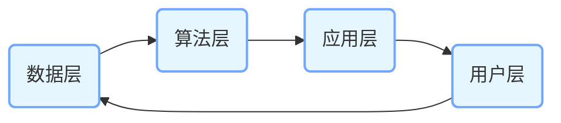

# AI赋能下编程职业的新角色与职责深入探讨

> 关键词：AI、编程职业、新角色、职责、技术变革

> 摘要：本文聚焦于AI赋能背景下编程职业的新变化，深入探讨编程职业衍生出的新角色与职责。通过分析背景、核心概念、算法原理、数学模型等多方面内容，结合项目实战和实际应用场景，揭示AI给编程领域带来的机遇与挑战。同时，推荐相关工具和资源，对未来发展趋势与挑战进行总结，旨在为编程从业者和相关研究人员提供全面且深入的参考，助力他们在AI时代更好地适应编程职业的变革。

## 1. 背景介绍 
### 1.1 目的和范围
在当今科技飞速发展的时代，AI技术正以前所未有的速度渗透到各个领域，编程职业也不例外。本文章的目的在于全面、深入地探讨AI赋能下编程职业所产生的新角色与职责，旨在为编程从业者、教育者、企业管理者以及对编程职业发展感兴趣的人士提供有价值的参考和指导。范围涵盖AI对编程职业的影响机制、新角色的特点与职责、实际应用场景、相关工具资源以及未来发展趋势等多个方面。

### 1.2 预期读者
本文预期读者包括但不限于以下几类人群：
- **编程从业者**：希望通过了解AI赋能下编程职业的新变化，提升自身技能，适应职业发展的需求，为个人职业规划提供方向。
- **教育工作者**：可以从中获取教学内容更新的灵感，调整编程教育的课程设置和教学方法，培养更符合时代需求的编程人才。
- **企业管理者**：有助于了解行业发展趋势，合理调整企业的人力资源策略，优化团队结构，提高企业的竞争力。
- **研究人员**：为其在编程职业发展、AI应用等领域的研究提供参考，拓展研究思路和方向。

### 1.3 文档结构概述
本文共分为十个部分，具体结构如下：
1. **背景介绍**：阐述文章的目的、范围、预期读者和文档结构，同时对相关术语进行定义和解释。
2. **核心概念与联系**：介绍AI和编程职业相关的核心概念，分析它们之间的联系，并通过文本示意图和Mermaid流程图进行直观展示。
3. **核心算法原理 & 具体操作步骤**：讲解与AI赋能编程相关的核心算法原理，使用Python源代码详细阐述具体操作步骤。
4. **数学模型和公式 & 详细讲解 & 举例说明**：介绍相关的数学模型和公式，进行详细讲解并举例说明。
5. **项目实战：代码实际案例和详细解释说明**：通过实际项目案例，介绍开发环境搭建、源代码实现和代码解读，帮助读者更好地理解和应用相关技术。
6. **实际应用场景**：探讨AI赋能下编程职业在不同领域的实际应用场景。
7. **工具和资源推荐**：推荐学习资源、开发工具框架和相关论文著作，为读者提供更多的学习和研究途径。
8. **总结：未来发展趋势与挑战**：总结AI赋能下编程职业的未来发展趋势，分析面临的挑战。
9. **附录：常见问题与解答**：对读者可能关心的常见问题进行解答。
10. **扩展阅读 & 参考资料**：提供扩展阅读的建议和参考资料来源。

### 1.4 术语表
#### 1.4.1 核心术语定义
- **AI（Artificial Intelligence）**：即人工智能，是指通过计算机模拟人类智能的技术，包括机器学习、深度学习、自然语言处理等多个领域。
- **编程职业**：指从事软件开发、程序设计、算法研究等相关工作的职业群体。
- **机器学习（Machine Learning）**：是AI的一个重要分支，它使计算机能够通过数据学习模式和规律，从而做出预测和决策。
- **深度学习（Deep Learning）**：是一种基于人工神经网络的机器学习技术，通过构建多层神经网络来学习数据的深层次特征。
- **自动化编程**：利用AI技术自动生成代码的过程，减少人工编写代码的工作量。

#### 1.4.2 相关概念解释
- **AI赋能编程**：指将AI技术应用于编程过程中，帮助程序员提高编程效率、优化代码质量、实现更复杂的功能。
- **新角色**：在AI赋能的背景下，编程职业中出现的具有新职责和技能要求的角色。
- **职责转变**：随着AI技术的发展，编程人员的传统职责发生变化，需要承担更多与AI相关的工作。

#### 1.4.3 缩略词列表
- **AI**：Artificial Intelligence
- **ML**：Machine Learning
- **DL**：Deep Learning
- **NLP**：Natural Language Processing

## 2. 核心概念与联系 

### 核心概念原理
#### AI原理
AI的核心原理是模拟人类的智能行为，主要通过机器学习和深度学习等技术实现。机器学习通过让计算机从数据中学习模式和规律，从而进行预测和决策。例如，在图像识别任务中，机器学习算法可以通过对大量图像数据的学习，识别出不同的物体。深度学习则是一种更强大的机器学习技术，它通过构建多层神经网络，自动学习数据的深层次特征。例如，在语音识别和自然语言处理中，深度学习模型可以更好地理解人类的语言和语音。

#### 编程职业原理
编程职业的核心是通过编写代码来实现各种软件和系统的功能。程序员需要掌握编程语言、算法和数据结构等基础知识，同时还需要具备问题解决能力和创新思维。编程的过程包括需求分析、设计、编码、测试和维护等多个阶段，每个阶段都需要程序员具备相应的技能和知识。

### 架构的文本示意图
AI与编程职业的结合可以看作是一个多层次的架构，具体如下：
- **数据层**：包括各种类型的数据，如文本、图像、音频等，是AI和编程的基础。
- **算法层**：包含机器学习、深度学习等各种AI算法，以及编程中使用的算法和数据结构。
- **应用层**：将AI技术应用于编程的各个环节，如自动化编程、代码优化、智能调试等。
- **用户层**：包括程序员、企业和最终用户，他们通过使用AI赋能的编程工具和系统，实现各种业务需求。

### Mermaid流程图


## 3. 核心算法原理 & 具体操作步骤 

### 核心算法原理
#### 机器学习算法
机器学习算法主要包括监督学习、无监督学习和强化学习。以监督学习中的线性回归算法为例，其原理是通过寻找一条最佳的直线来拟合数据点，使得预测值与真实值之间的误差最小。线性回归的目标是找到一组参数 $w$ 和 $b$，使得预测函数 $f(x) = wx + b$ 能够最好地拟合数据。

#### 深度学习算法
深度学习算法主要基于人工神经网络，如卷积神经网络（CNN）、循环神经网络（RNN）等。以CNN为例，其原理是通过卷积层、池化层和全连接层等组件，自动提取图像的特征。卷积层通过卷积核在图像上滑动，提取局部特征；池化层则通过降采样减少数据量；全连接层将提取的特征进行分类或回归。

### 具体操作步骤（以Python实现线性回归为例）
```python
import numpy as np
import matplotlib.pyplot as plt

# 生成一些示例数据
x = np.array([1, 2, 3, 4, 5])
y = np.array([2, 4, 6, 8, 10])

# 计算均值
x_mean = np.mean(x)
y_mean = np.mean(y)

# 计算斜率和截距
numerator = np.sum((x - x_mean) * (y - y_mean))
denominator = np.sum((x - x_mean) ** 2)
w = numerator / denominator
b = y_mean - w * x_mean

# 定义预测函数
def predict(x):
    return w * x + b

# 进行预测
x_test = np.array([6, 7, 8])
y_pred = predict(x_test)

# 绘制原始数据和预测结果
plt.scatter(x, y, label='Original Data')
plt.plot(x_test, y_pred, color='red', label='Predicted Line')
plt.xlabel('x')
plt.ylabel('y')
plt.title('Linear Regression')
plt.legend()
plt.show()
```
上述代码首先生成了一些示例数据，然后计算了线性回归的斜率和截距，定义了预测函数并进行预测，最后绘制了原始数据和预测结果的图像。

## 4. 数学模型和公式 & 详细讲解 & 举例说明 

### 线性回归数学模型和公式
线性回归的数学模型可以表示为：
$$y = wx + b + \epsilon$$
其中，$y$ 是因变量，$x$ 是自变量，$w$ 是斜率，$b$ 是截距，$\epsilon$ 是误差项。

线性回归的目标是最小化误差平方和，即：
$$J(w, b) = \frac{1}{2m} \sum_{i=1}^{m} (y^{(i)} - (wx^{(i)} + b))^2$$
其中，$m$ 是样本数量，$y^{(i)}$ 和 $x^{(i)}$ 分别是第 $i$ 个样本的因变量和自变量。

为了找到最优的 $w$ 和 $b$，可以使用梯度下降法。梯度下降法的更新公式为：
$$w = w - \alpha \frac{\partial J(w, b)}{\partial w}$$
$$b = b - \alpha \frac{\partial J(w, b)}{\partial b}$$
其中，$\alpha$ 是学习率。

### 详细讲解
线性回归的核心思想是通过找到一条最佳的直线来拟合数据点，使得预测值与真实值之间的误差最小。误差平方和是衡量预测误差的一种常用方法，通过最小化误差平方和，可以得到最优的斜率和截距。梯度下降法是一种迭代优化算法，通过不断更新参数 $w$ 和 $b$，使得误差平方和逐渐减小，直到达到最小值。

### 举例说明
假设我们有一组数据 $(x_1, y_1), (x_2, y_2), \cdots, (x_m, y_m)$，其中 $x$ 表示房屋面积，$y$ 表示房屋价格。我们希望通过线性回归模型来预测房屋价格。首先，我们需要计算误差平方和 $J(w, b)$，然后使用梯度下降法不断更新 $w$ 和 $b$，直到误差平方和达到最小值。最后，我们可以使用得到的 $w$ 和 $b$ 来预测新的房屋价格。

## 5. 项目实战：代码实际案例和详细解释说明 

### 5.1  开发环境搭建
#### 安装Python
首先，需要从Python官方网站（https://www.python.org/downloads/） 下载并安装Python。建议安装Python 3.x版本。

#### 安装必要的库
在安装完Python后，需要安装一些必要的库，如NumPy、Matplotlib等。可以使用以下命令进行安装：
```sh
pip install numpy matplotlib
```

### 5.2  源代码详细实现和代码解读
```python
import numpy as np
import matplotlib.pyplot as plt

# 生成一些示例数据
np.random.seed(0)
x = np.linspace(0, 10, 100)
y = 2 * x + 1 + np.random.randn(100)

# 划分训练集和测试集
train_size = int(0.8 * len(x))
x_train = x[:train_size]
y_train = y[:train_size]
x_test = x[train_size:]
y_test = y[train_size:]

# 计算均值
x_train_mean = np.mean(x_train)
y_train_mean = np.mean(y_train)

# 计算斜率和截距
numerator = np.sum((x_train - x_train_mean) * (y_train - y_train_mean))
denominator = np.sum((x_train - x_train_mean) ** 2)
w = numerator / denominator
b = y_train_mean - w * x_train_mean

# 定义预测函数
def predict(x):
    return w * x + b

# 进行预测
y_pred_train = predict(x_train)
y_pred_test = predict(x_test)

# 计算训练集和测试集的均方误差
mse_train = np.mean((y_train - y_pred_train) ** 2)
mse_test = np.mean((y_test - y_pred_test) ** 2)

print(f"训练集均方误差: {mse_train}")
print(f"测试集均方误差: {mse_test}")

# 绘制原始数据和预测结果
plt.scatter(x_train, y_train, label='Training Data')
plt.scatter(x_test, y_test, label='Test Data')
plt.plot(x_train, y_pred_train, color='red', label='Training Prediction')
plt.plot(x_test, y_pred_test, color='green', label='Test Prediction')
plt.xlabel('x')
plt.ylabel('y')
plt.title('Linear Regression')
plt.legend()
plt.show()
```
### 5.3  代码解读与分析
- **数据生成**：使用 `np.linspace` 生成一组从0到10的100个数据点，并添加了一些随机噪声。
- **数据划分**：将数据划分为训练集和测试集，比例为8:2。
- **参数计算**：计算训练集的均值、斜率和截距。
- **预测函数**：定义了预测函数 `predict`，用于根据输入的 $x$ 值预测 $y$ 值。
- **预测和误差计算**：使用预测函数对训练集和测试集进行预测，并计算均方误差。
- **可视化**：使用 `matplotlib` 绘制原始数据和预测结果的图像。

通过这个项目实战，我们可以看到如何使用线性回归模型进行数据拟合和预测，以及如何评估模型的性能。

## 6. 实际应用场景 
### 自动化编程
AI可以帮助程序员自动生成代码，提高编程效率。例如，一些代码生成工具可以根据用户输入的自然语言描述自动生成代码框架。在软件开发中，对于一些常见的功能模块，如数据库操作、文件读写等，AI可以快速生成相应的代码，减少程序员的重复劳动。

### 代码优化
AI可以分析代码的性能瓶颈，提供优化建议。例如，通过分析代码的时间复杂度和空间复杂度，AI可以建议使用更高效的算法和数据结构。在大型项目中，代码优化可以显著提高系统的性能和响应速度。

### 智能调试
AI可以帮助程序员快速定位和解决代码中的错误。例如，通过分析错误信息和代码上下文，AI可以提供可能的错误原因和解决方案。在调试复杂的代码时，智能调试工具可以节省大量的时间和精力。

### 软件测试
AI可以自动生成测试用例，提高测试的覆盖率和效率。例如，通过分析代码的结构和功能，AI可以生成各种不同的测试用例，确保软件的质量。在软件发布前，全面的测试可以减少软件的漏洞和缺陷。

### 智能辅助编程
AI可以作为程序员的智能助手，提供实时的代码提示、语法检查等功能。例如，在编写代码时，AI可以根据上下文自动补全代码，提高编程的准确性和速度。

## 7. 工具和资源推荐
### 7.1 学习资源推荐
#### 7.1.1 书籍推荐
- 《Python机器学习》：这本书详细介绍了Python在机器学习领域的应用，包括各种机器学习算法的原理和实现。
- 《深度学习》：由深度学习领域的三位先驱者所著，是深度学习领域的经典教材，涵盖了深度学习的基本原理、算法和应用。
- 《人工智能：一种现代的方法》：全面介绍了人工智能的各个领域，包括搜索算法、知识表示、机器学习、自然语言处理等。

#### 7.1.2 在线课程
- Coursera上的《机器学习》课程：由Andrew Ng教授授课，是机器学习领域的经典课程，内容丰富，讲解详细。
- edX上的《深度学习》课程：由多位深度学习领域的专家授课，涵盖了深度学习的最新技术和应用。
- 哔哩哔哩上的一些编程和AI相关的视频教程：有很多优秀的UP主分享编程和AI的学习经验和教程，内容生动有趣，易于理解。

#### 7.1.3 技术博客和网站
- Medium：是一个技术博客平台，有很多关于AI和编程的优秀文章。
- GitHub：是全球最大的开源代码托管平台，可以找到很多优秀的开源项目和代码示例。
- 博客园：是国内知名的技术博客网站，有很多编程和AI领域的技术文章和经验分享。

### 7.2 开发工具框架推荐
#### 7.2.1 IDE和编辑器
- PyCharm：是一款专门为Python开发设计的集成开发环境，功能强大，提供了代码编辑、调试、版本控制等多种功能。
- Visual Studio Code：是一款轻量级的代码编辑器，支持多种编程语言，有丰富的插件可以扩展功能。
- Jupyter Notebook：是一个交互式的开发环境，适合进行数据分析和机器学习实验。

#### 7.2.2 调试和性能分析工具
- PDB：是Python自带的调试工具，可以帮助程序员定位和解决代码中的错误。
- Py-Spy：是一个性能分析工具，可以分析Python程序的性能瓶颈，找出耗时较长的代码段。
- cProfile：是Python的内置性能分析模块，可以统计函数的调用次数和执行时间。

#### 7.2.3 相关框架和库
- TensorFlow：是Google开发的深度学习框架，提供了丰富的工具和接口，支持多种深度学习任务。
- PyTorch：是Facebook开发的深度学习框架，具有动态图的特点，易于使用和调试。
- Scikit-learn：是Python的机器学习库，提供了各种机器学习算法和工具，适合初学者和快速开发。

### 7.3 相关论文著作推荐
#### 7.3.1 经典论文
- 《Learning Representations by Back-propagating Errors》：这篇论文提出了反向传播算法，是神经网络领域的经典论文。
- 《ImageNet Classification with Deep Convolutional Neural Networks》：这篇论文介绍了AlexNet，开启了深度学习在计算机视觉领域的应用热潮。
- 《Attention Is All You Need》：这篇论文提出了Transformer模型，在自然语言处理领域取得了巨大的成功。

#### 7.3.2 最新研究成果
- 关注顶级学术会议，如NeurIPS、ICML、CVPR等，这些会议上会发布很多关于AI和编程的最新研究成果。
- 关注知名学术期刊，如Journal of Artificial Intelligence Research、Artificial Intelligence等，这些期刊会发表高质量的研究论文。

#### 7.3.3 应用案例分析
- 《AI in Action》：这本书介绍了AI在各个领域的应用案例，包括医疗、金融、交通等，通过实际案例分析展示了AI的应用价值。
- 一些知名企业的技术博客，如Google AI Blog、Facebook AI Research等，会分享他们在AI和编程领域的应用案例和经验。

## 8. 总结：未来发展趋势与挑战
### 未来发展趋势
- **深度融合**：AI与编程将进一步深度融合，编程职业将更加依赖AI技术，新角色和职责将不断涌现。
- **自动化程度提高**：自动化编程、智能调试等功能将不断完善，程序员的工作效率将得到极大提高。
- **跨领域发展**：编程人员需要具备跨领域的知识和技能，如AI与医疗、金融、交通等领域的结合。
- **个性化编程**：AI可以根据程序员的习惯和需求，提供个性化的编程辅助和建议。

### 挑战
- **技术更新换代快**：AI技术发展迅速，编程人员需要不断学习和更新知识，以适应技术的变化。
- **就业结构调整**：AI的发展可能会导致一些传统编程岗位的减少，同时也会创造一些新的岗位，编程人员需要适应就业结构的调整。
- **伦理和法律问题**：AI的应用可能会带来一些伦理和法律问题，如数据隐私、算法偏见等，编程人员需要关注这些问题并遵守相关法律法规。
- **人才短缺**：目前AI和编程领域的人才短缺，企业需要培养和吸引更多的优秀人才。

## 9. 附录：常见问题与解答
### 问题1：AI会取代编程职业吗？
答：AI不会完全取代编程职业，但会对编程职业产生重大影响。AI可以帮助程序员提高效率、优化代码，但编程过程中还需要人类的创造力、问题解决能力和判断力。编程职业将朝着与AI深度融合的方向发展，出现一些新的角色和职责。

### 问题2：如何学习AI赋能下的编程？
答：可以从以下几个方面入手：
- 学习AI和编程的基础知识，如机器学习、深度学习、Python编程等。
- 实践项目，通过实际项目来应用和巩固所学知识。
- 关注行业动态和最新研究成果，不断更新知识。
- 参加培训课程和交流活动，与同行分享经验和学习心得。

### 问题3：AI赋能编程会带来哪些伦理问题？
答：AI赋能编程可能会带来以下伦理问题：
- **数据隐私**：AI系统需要大量的数据进行训练，这些数据可能包含用户的隐私信息，需要确保数据的安全和隐私。
- **算法偏见**：AI算法可能会受到数据的影响，产生偏见和歧视，需要对算法进行评估和改进。
- **责任界定**：当AI系统出现错误或造成损失时，责任的界定可能会变得复杂，需要明确责任主体。

## 10. 扩展阅读 & 参考资料
### 扩展阅读
- 《人类简史：从动物到上帝》：这本书从人类历史的角度探讨了技术发展对人类社会的影响，可以帮助读者更好地理解AI和编程职业的发展。
- 《未来简史：从智人到神人》：进一步探讨了未来技术发展的趋势和可能带来的挑战，对思考AI赋能下编程职业的未来有一定的启发。

### 参考资料
- 相关学术论文和研究报告。
- 官方文档和技术博客。
- 相关书籍和在线课程。