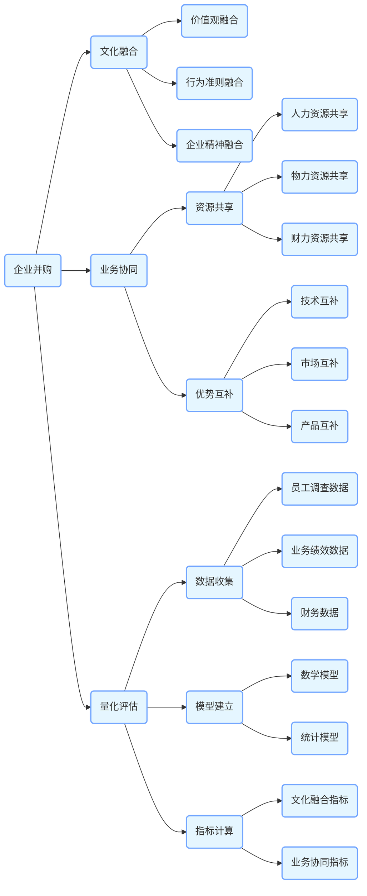

# AI辅助企业并购后整合：文化融合与业务协同的量化评估

> 关键词：AI、企业并购、文化融合、业务协同、量化评估

> 摘要：本文聚焦于AI在辅助企业并购后整合过程中，对文化融合与业务协同进行量化评估的应用。首先介绍了企业并购后整合面临的文化和业务协同挑战的背景，阐述了相关核心概念及联系。深入剖析了用于量化评估的核心算法原理，并给出具体操作步骤，结合数学模型和公式进行详细讲解与举例。通过项目实战展示代码实现及解读，探讨了其实际应用场景。推荐了相关的学习资源、开发工具框架及论文著作。最后总结未来发展趋势与挑战，提供常见问题解答及扩展阅读参考资料，旨在为企业利用AI进行并购后整合的量化评估提供全面且深入的技术指导。

## 1. 背景介绍 
### 1.1 目的和范围
企业并购是企业快速扩张和战略布局的重要手段，但并购后的整合过程往往充满挑战。其中，文化融合与业务协同是决定并购成败的关键因素。本研究的目的在于探讨如何利用AI技术对企业并购后的文化融合与业务协同进行量化评估，为企业管理者提供科学、客观的决策依据。研究范围涵盖了AI技术在量化评估中的应用原理、算法实现、实际案例分析以及相关工具和资源推荐等方面。

### 1.2 预期读者
本文预期读者包括企业管理者、并购从业者、AI技术开发者、研究学者以及对企业并购和AI技术应用感兴趣的相关人员。企业管理者可以从中了解如何利用AI技术优化并购后整合决策；并购从业者能够掌握量化评估的方法和技巧；AI技术开发者可以获取相关算法和代码实现的思路；研究学者可以深入探讨AI在企业并购领域的应用理论；其他感兴趣的人员可以对该领域有一个全面的认识。

### 1.3 文档结构概述
本文将按照以下结构展开：首先介绍核心概念与联系，明确文化融合、业务协同以及量化评估的内涵和相互关系；接着阐述核心算法原理及具体操作步骤，给出Python源代码实现；然后讲解数学模型和公式，并举例说明；通过项目实战展示代码的实际应用和详细解释；探讨实际应用场景；推荐相关的工具和资源；总结未来发展趋势与挑战；提供常见问题与解答以及扩展阅读和参考资料。

### 1.4 术语表
#### 1.4.1 核心术语定义
- **企业并购**：指企业之间的合并与收购行为，是企业通过产权交易获得其他企业的控制权，以实现自身战略目标的一种经济活动。
- **文化融合**：在企业并购后，将不同企业文化进行相互渗透、相互吸收，形成一种新的、适应企业发展的文化的过程。
- **业务协同**：企业并购后，各业务单元之间通过资源共享、优势互补等方式，实现整体效益大于各部分效益之和的协同效应。
- **量化评估**：运用数学模型和统计方法，对文化融合和业务协同的程度进行定量分析和评价。
- **AI（人工智能）**：研究、开发用于模拟、延伸和扩展人的智能的理论、方法、技术及应用系统的一门新的技术科学。

#### 1.4.2 相关概念解释
- **文化差异**：不同企业在价值观、行为准则、管理风格等方面存在的差异，是文化融合的主要障碍。
- **业务互补性**：企业并购双方在业务领域、产品或服务、市场渠道等方面的互补程度，是业务协同的基础。
- **协同效应**：业务协同所带来的额外效益，包括成本降低、收入增加、效率提高等。

#### 1.4.3 缩略词列表
- **AI**：Artificial Intelligence（人工智能）
- **ML**：Machine Learning（机器学习）
- **NLP**：Natural Language Processing（自然语言处理）
- **PCA**：Principal Component Analysis（主成分分析）

## 2. 核心概念与联系 

### 核心概念原理
企业并购后的文化融合和业务协同是两个相互关联又相互影响的重要方面。

#### 文化融合原理
企业文化是企业在长期发展过程中形成的价值观、行为准则和企业精神等的总和。在企业并购后，不同企业文化之间会产生碰撞和冲突。文化融合的原理在于通过沟通、培训、激励等手段，促进两种或多种企业文化的相互理解、相互尊重和相互融合，形成一种新的、具有凝聚力和适应性的企业文化。例如，一家注重创新和冒险的科技企业并购了一家注重稳健和规范的传统企业，在文化融合过程中，需要找到两者的平衡点，既保留科技企业的创新活力，又吸收传统企业的规范管理经验。

#### 业务协同原理
业务协同的原理基于资源共享和优势互补。企业并购后，各业务单元可以共享人力、物力、财力等资源，降低成本，提高效率。同时，不同业务单元的优势可以相互补充，开拓新的市场和业务领域。例如，一家拥有强大研发能力的企业并购了一家拥有广泛市场渠道的企业，通过业务协同，研发成果可以更快地推向市场，市场渠道也可以获得更多优质的产品，实现双方的共赢。

#### 量化评估原理
量化评估是将文化融合和业务协同的程度用具体的数值来表示，以便于企业管理者进行比较和决策。量化评估的原理是通过建立数学模型，收集相关数据，运用统计分析方法对数据进行处理和分析，得出反映文化融合和业务协同程度的量化指标。例如，可以通过员工满意度调查、业务绩效指标等数据来评估文化融合和业务协同的效果。

### 架构的文本示意图
```plaintext
企业并购
|
|-- 文化融合
|   |-- 价值观融合
|   |-- 行为准则融合
|   |-- 企业精神融合
|
|-- 业务协同
|   |-- 资源共享
|   |   |-- 人力资源共享
|   |   |-- 物力资源共享
|   |   |-- 财力资源共享
|   |-- 优势互补
|       |-- 技术互补
|       |-- 市场互补
|       |-- 产品互补
|
|-- 量化评估
|   |-- 数据收集
|   |   |-- 员工调查数据
|   |   |-- 业务绩效数据
|   |   |-- 财务数据
|   |-- 模型建立
|   |   |-- 数学模型
|   |   |-- 统计模型
|   |-- 指标计算
|       |-- 文化融合指标
|       |-- 业务协同指标
```

### Mermaid 流程图


## 3. 核心算法原理 & 具体操作步骤 

### 核心算法原理
在AI辅助企业并购后整合的量化评估中，我们可以使用机器学习算法来处理和分析数据，以评估文化融合和业务协同的程度。这里我们介绍一种基于主成分分析（PCA）和逻辑回归的算法。

#### 主成分分析（PCA）原理
主成分分析是一种无监督学习算法，用于数据降维和特征提取。其基本思想是通过线性变换将原始数据转换为一组各维度线性无关的主成分，使得数据在这些主成分上的方差最大。在量化评估中，我们可以使用PCA来减少数据的维度，去除数据中的噪声和冗余信息，提取出最重要的特征。

#### 逻辑回归原理
逻辑回归是一种有监督学习算法，用于二分类或多分类问题。其基本思想是通过逻辑函数将线性回归的输出映射到[0, 1]之间的概率值，从而实现分类预测。在量化评估中，我们可以使用逻辑回归来建立文化融合和业务协同的评估模型，根据提取的特征预测文化融合和业务协同的程度。

### 具体操作步骤

#### 步骤1：数据收集
收集与文化融合和业务协同相关的数据，包括员工调查数据、业务绩效数据、财务数据等。例如，员工调查数据可以包括员工对企业文化的认同感、工作满意度等；业务绩效数据可以包括销售额、利润率、市场份额等；财务数据可以包括资产负债表、利润表等。

#### 步骤2：数据预处理
对收集到的数据进行预处理，包括数据清洗、缺失值处理、数据标准化等。数据清洗是去除数据中的噪声和异常值；缺失值处理是填充或删除缺失的数据；数据标准化是将数据转换为均值为0，标准差为1的标准正态分布。

#### 步骤3：特征提取
使用PCA算法对预处理后的数据进行特征提取，选择最重要的主成分作为新的特征。

#### 步骤4：模型训练
使用逻辑回归算法对提取的特征进行训练，建立文化融合和业务协同的评估模型。

#### 步骤5：模型评估
使用测试数据对训练好的模型进行评估，计算模型的准确率、召回率、F1值等指标，评估模型的性能。

#### 步骤6：量化评估
使用训练好的模型对企业并购后的文化融合和业务协同进行量化评估，得出相应的评估指标。

### Python源代码实现
```python
import numpy as np
from sklearn.decomposition import PCA
from sklearn.linear_model import LogisticRegression
from sklearn.model_selection import train_test_split
from sklearn.preprocessing import StandardScaler
from sklearn.metrics import accuracy_score, recall_score, f1_score

# 步骤1：数据收集（假设已经收集到数据）
# 这里使用随机生成的数据作为示例
X = np.random.rand(100, 10)  # 特征数据
y = np.random.randint(0, 2, 100)  # 标签数据

# 步骤2：数据预处理
scaler = StandardScaler()
X_scaled = scaler.fit_transform(X)

# 步骤3：特征提取
pca = PCA(n_components=3)  # 选择3个主成分
X_pca = pca.fit_transform(X_scaled)

# 步骤4：模型训练
X_train, X_test, y_train, y_test = train_test_split(X_pca, y, test_size=0.2, random_state=42)
model = LogisticRegression()
model.fit(X_train, y_train)

# 步骤5：模型评估
y_pred = model.predict(X_test)
accuracy = accuracy_score(y_test, y_pred)
recall = recall_score(y_test, y_pred)
f1 = f1_score(y_test, y_pred)
print(f"Accuracy: {accuracy}")
print(f"Recall: {recall}")
print(f"F1 Score: {f1}")

# 步骤6：量化评估
# 假设新的数据
new_data = np.random.rand(10, 10)
new_data_scaled = scaler.transform(new_data)
new_data_pca = pca.transform(new_data_scaled)
predictions = model.predict(new_data_pca)
print(f"Predictions: {predictions}")
```

## 4. 数学模型和公式 & 详细讲解 & 举例说明 

### 主成分分析（PCA）数学模型和公式
#### 数学模型
设原始数据矩阵为 $X \in \mathbb{R}^{n \times m}$，其中 $n$ 是样本数量，$m$ 是特征数量。PCA的目标是找到一组正交的投影矩阵 $W \in \mathbb{R}^{m \times k}$，使得投影后的数据 $Y = XW$ 的方差最大，其中 $k$ 是主成分的数量，$k \leq m$。

#### 公式推导
1. 计算数据的协方差矩阵 $S$：
   $$S = \frac{1}{n - 1}X^TX$$
2. 对协方差矩阵 $S$ 进行特征值分解：
   $$S = U\Lambda U^T$$
   其中 $U$ 是特征向量矩阵，$\Lambda$ 是特征值对角矩阵。
3. 选择前 $k$ 个最大的特征值对应的特征向量作为投影矩阵 $W$：
   $$W = U[:, :k]$$
4. 计算投影后的数据 $Y$：
   $$Y = XW$$

#### 举例说明
假设我们有一个二维数据集 $X = \begin{bmatrix}1 & 2 \\ 3 & 4 \\ 5 & 6\end{bmatrix}$，首先计算协方差矩阵 $S$：
$$S = \frac{1}{3 - 1}\begin{bmatrix}1 & 3 & 5 \\ 2 & 4 & 6\end{bmatrix}\begin{bmatrix}1 & 2 \\ 3 & 4 \\ 5 & 6\end{bmatrix} = \begin{bmatrix}4 & 4 \\ 4 & 4\end{bmatrix}$$
然后对 $S$ 进行特征值分解，得到特征值 $\lambda_1 = 8$，$\lambda_2 = 0$，对应的特征向量 $u_1 = \begin{bmatrix}0.707 \\ 0.707\end{bmatrix}$，$u_2 = \begin{bmatrix}-0.707 \\ 0.707\end{bmatrix}$。选择最大的特征值对应的特征向量作为投影矩阵 $W = \begin{bmatrix}0.707 \\ 0.707\end{bmatrix}$，则投影后的数据 $Y = XW = \begin{bmatrix}2.121 \\ 4.950 \\ 7.778\end{bmatrix}$。

### 逻辑回归数学模型和公式
#### 数学模型
逻辑回归的数学模型是基于逻辑函数（也称为Sigmoid函数），将线性回归的输出映射到[0, 1]之间的概率值。逻辑回归的模型可以表示为：
$$P(y = 1|x) = \frac{1}{1 + e^{-z}}$$
其中 $z = w_0 + w_1x_1 + w_2x_2 + \cdots + w_mx_m$ 是线性回归的输出，$w_0, w_1, \cdots, w_m$ 是模型的参数，$x_1, x_2, \cdots, x_m$ 是特征变量。

#### 公式推导
逻辑回归的目标是最大化似然函数 $L(w)$：
$$L(w) = \prod_{i = 1}^{n}P(y_i|x_i; w)^{y_i}(1 - P(y_i|x_i; w))^{1 - y_i}$$
为了方便计算，通常对似然函数取对数，得到对数似然函数 $\ell(w)$：
$$\ell(w) = \sum_{i = 1}^{n}[y_i\log P(y_i|x_i; w) + (1 - y_i)\log(1 - P(y_i|x_i; w))]$$
然后使用梯度下降等优化算法来求解对数似然函数的最大值，得到模型的参数 $w$。

#### 举例说明
假设我们有一个简单的逻辑回归模型，输入特征 $x = [1, 2]$，模型参数 $w = [0.1, 0.2]$，则线性回归的输出 $z = 0.1 + 0.2\times1 + 0.3\times2 = 0.9$，逻辑函数的输出 $P(y = 1|x) = \frac{1}{1 + e^{-0.9}} \approx 0.71$。

## 5. 项目实战：代码实际案例和详细解释说明 

### 5.1  开发环境搭建
#### 安装Python
首先需要安装Python，建议使用Python 3.7及以上版本。可以从Python官方网站（https://www.python.org/downloads/）下载安装包，按照安装向导进行安装。

#### 安装必要的库
使用pip命令安装必要的库，包括NumPy、Scikit-learn等。在命令行中执行以下命令：
```sh
pip install numpy scikit-learn
```

### 5.2  源代码详细实现和代码解读
```python
import numpy as np
from sklearn.decomposition import PCA
from sklearn.linear_model import LogisticRegression
from sklearn.model_selection import train_test_split
from sklearn.preprocessing import StandardScaler
from sklearn.metrics import accuracy_score, recall_score, f1_score

# 步骤1：数据收集（假设已经收集到数据）
# 这里使用随机生成的数据作为示例
X = np.random.rand(100, 10)  # 特征数据
y = np.random.randint(0, 2, 100)  # 标签数据

# 步骤2：数据预处理
scaler = StandardScaler()
X_scaled = scaler.fit_transform(X)

# 步骤3：特征提取
pca = PCA(n_components=3)  # 选择3个主成分
X_pca = pca.fit_transform(X_scaled)

# 步骤4：模型训练
X_train, X_test, y_train, y_test = train_test_split(X_pca, y, test_size=0.2, random_state=42)
model = LogisticRegression()
model.fit(X_train, y_train)

# 步骤5：模型评估
y_pred = model.predict(X_test)
accuracy = accuracy_score(y_test, y_pred)
recall = recall_score(y_test, y_pred)
f1 = f1_score(y_test, y_pred)
print(f"Accuracy: {accuracy}")
print(f"Recall: {recall}")
print(f"F1 Score: {f1}")

# 步骤6：量化评估
# 假设新的数据
new_data = np.random.rand(10, 10)
new_data_scaled = scaler.transform(new_data)
new_data_pca = pca.transform(new_data_scaled)
predictions = model.predict(new_data_pca)
print(f"Predictions: {predictions}")
```

#### 代码解读
1. **数据收集**：使用 `np.random.rand` 函数生成随机的特征数据 `X`，使用 `np.random.randint` 函数生成随机的标签数据 `y`。
2. **数据预处理**：使用 `StandardScaler` 类对特征数据进行标准化处理，将数据转换为均值为0，标准差为1的标准正态分布。
3. **特征提取**：使用 `PCA` 类对标准化后的数据进行主成分分析，选择3个主成分作为新的特征。
4. **模型训练**：使用 `train_test_split` 函数将数据分为训练集和测试集，使用 `LogisticRegression` 类建立逻辑回归模型，并使用训练集数据进行训练。
5. **模型评估**：使用训练好的模型对测试集数据进行预测，使用 `accuracy_score`、`recall_score` 和 `f1_score` 函数计算模型的准确率、召回率和F1值。
6. **量化评估**：使用训练好的模型对新的数据进行预测，得到预测结果。

### 5.3  代码解读与分析
#### 优点
- **数据降维**：使用PCA算法进行特征提取，减少了数据的维度，去除了数据中的噪声和冗余信息，提高了模型的训练效率和泛化能力。
- **分类预测**：使用逻辑回归算法进行分类预测，能够对文化融合和业务协同的程度进行量化评估，为企业管理者提供科学、客观的决策依据。
- **可扩展性**：代码结构清晰，易于扩展和修改，可以根据实际需求选择不同的算法和参数。

#### 缺点
- **数据依赖**：模型的性能高度依赖于数据的质量和数量，如果数据存在噪声或缺失值，可能会影响模型的准确性。
- **模型复杂度**：逻辑回归模型是一种线性模型，对于复杂的非线性问题，可能无法达到理想的效果。

#### 改进建议
- **数据增强**：可以通过收集更多的数据、进行数据合成等方式来增加数据的数量和多样性，提高模型的性能。
- **模型选择**：可以尝试使用更复杂的模型，如神经网络、支持向量机等，来处理复杂的非线性问题。

## 6. 实际应用场景 
### 企业战略决策
企业管理者可以利用AI辅助的量化评估结果，制定合理的并购后整合战略。例如，如果量化评估结果显示文化融合程度较低，企业可以加大文化融合的力度，开展企业文化培训、组织团队建设活动等；如果业务协同程度较低，企业可以优化业务流程，加强各业务单元之间的沟通和协作。

### 风险管理
量化评估可以帮助企业识别并购后整合过程中的风险。例如，如果文化融合指标持续下降，可能预示着企业文化冲突加剧，存在员工流失、工作效率下降等风险；如果业务协同指标不理想，可能意味着业务整合存在问题，存在市场份额下降、成本增加等风险。企业可以根据风险评估结果，采取相应的风险应对措施。

### 绩效评估
量化评估结果可以作为企业并购后整合绩效评估的重要依据。企业可以将文化融合和业务协同的量化指标纳入绩效考核体系，激励员工积极参与并购后整合工作，提高整合效率和效果。

### 投资者决策
投资者可以通过量化评估结果了解企业并购后整合的进展和效果，从而做出合理的投资决策。如果量化评估结果显示企业并购后整合效果良好，文化融合和业务协同程度较高，投资者可能会增加对企业的投资；反之，如果整合效果不佳，投资者可能会减少或撤回投资。

## 7. 工具和资源推荐
### 7.1 学习资源推荐
#### 7.1.1 书籍推荐
- 《机器学习》（周志华著）：全面介绍了机器学习的基本概念、算法和应用，是机器学习领域的经典教材。
- 《Python机器学习实战》（Sebastian Raschka著）：通过实际案例介绍了Python在机器学习中的应用，适合初学者入门。
- 《人工智能：一种现代的方法》（Stuart Russell、Peter Norvig著）：是人工智能领域的权威著作，涵盖了人工智能的各个方面。

#### 7.1.2 在线课程
- Coursera上的“机器学习”课程（Andrew Ng教授主讲）：是全球最受欢迎的机器学习课程之一，内容深入浅出，适合初学者。
- edX上的“人工智能基础”课程：系统介绍了人工智能的基本概念、算法和应用，是学习人工智能的入门课程。
- 中国大学MOOC上的“Python数据分析与应用”课程：介绍了Python在数据分析中的应用，包括数据处理、数据可视化、机器学习等内容。

#### 7.1.3 技术博客和网站
- Medium：是一个技术博客平台，上面有很多关于AI、机器学习、数据分析等领域的优质文章。
- Kaggle：是一个数据科学竞赛平台，上面有很多数据科学项目和开源代码，可以学习到很多实际应用案例和技巧。
- 机器之心：是一个专注于人工智能领域的媒体平台，提供最新的人工智能技术资讯、研究成果和应用案例。

### 7.2 开发工具框架推荐
#### 7.2.1 IDE和编辑器
- PyCharm：是一款专业的Python集成开发环境，具有代码编辑、调试、自动补全、版本控制等功能，适合Python开发。
- Jupyter Notebook：是一个交互式的开发环境，支持多种编程语言，适合数据探索和分析。
- Visual Studio Code：是一款轻量级的代码编辑器，具有丰富的插件和扩展功能，适合快速开发和调试。

#### 7.2.2 调试和性能分析工具
- PDB：是Python自带的调试工具，可以在代码中设置断点，单步执行代码，查看变量值等。
- cProfile：是Python自带的性能分析工具，可以分析代码的执行时间和函数调用次数，找出性能瓶颈。
- Py-Spy：是一个轻量级的Python性能分析工具，可以实时监控Python程序的性能，生成火焰图等可视化结果。

#### 7.2.3 相关框架和库
- NumPy：是Python中用于科学计算的基础库，提供了高效的数组操作和数学函数。
- Pandas：是Python中用于数据处理和分析的库，提供了数据结构和数据操作工具。
- Scikit-learn：是Python中用于机器学习的库，提供了各种机器学习算法和工具。
- TensorFlow：是Google开发的开源机器学习框架，支持深度学习算法的开发和训练。
- PyTorch：是Facebook开发的开源深度学习框架，具有动态图和静态图两种模式，适合研究和开发。

### 7.3 相关论文著作推荐
#### 7.3.1 经典论文
- “A Logical Calculus of the Ideas Immanent in Nervous Activity”（Warren S. McCulloch、Walter Pitts著）：是神经网络领域的经典论文，提出了神经元模型和神经网络的基本概念。
- “A Machine- Learning Approach to Classification and Regression”（Leo Breiman、Jerome H. Friedman、Richard A. Olshen、Charles J. Stone著）：是决策树和随机森林领域的经典论文，介绍了决策树和随机森林的算法原理和应用。
- “Deep Residual Learning for Image Recognition”（Kaiming He、Xiangyu Zhang、Shaoqing Ren、Jian Sun著）：是深度学习领域的经典论文，提出了残差网络（ResNet）的概念，解决了深度神经网络训练中的梯度消失问题。

#### 7.3.2 最新研究成果
- 关注顶级学术会议如NeurIPS（神经信息处理系统大会）、ICML（国际机器学习会议）、CVPR（计算机视觉与模式识别会议）等的最新研究成果，了解AI在企业并购后整合领域的最新应用和发展趋势。
- 查阅顶级学术期刊如Journal of Artificial Intelligence Research（JAIR）、Artificial Intelligence（AI）、Machine Learning（ML）等的相关论文，获取前沿的研究理论和方法。

#### 7.3.3 应用案例分析
- 参考相关企业的案例研究报告，了解AI在企业并购后整合中的实际应用和效果。例如，一些大型企业在并购后利用AI技术进行文化融合和业务协同的量化评估，取得了显著的成效，可以从中学习到实践经验和成功模式。

## 8. 总结：未来发展趋势与挑战
### 未来发展趋势
#### 多模态数据融合
未来，AI辅助企业并购后整合的量化评估将不仅仅依赖于传统的数据，还会融合多模态数据，如文本、图像、音频等。例如，通过分析员工的社交媒体言论、会议视频等多模态数据，更全面地了解企业文化和业务协同的情况。

#### 深度强化学习的应用
深度强化学习可以在复杂的动态环境中进行决策优化，未来可能会应用于企业并购后整合的量化评估中。例如，通过深度强化学习算法自动调整整合策略，以实现文化融合和业务协同的最优效果。

#### 可解释性AI的发展
随着AI技术的广泛应用，可解释性AI越来越受到关注。未来，在AI辅助企业并购后整合的量化评估中，需要开发可解释性强的模型，使企业管理者能够理解模型的决策过程和依据，提高决策的可信度和有效性。

### 挑战
#### 数据隐私和安全
在收集和使用与企业并购后整合相关的数据时，需要确保数据的隐私和安全。例如，员工调查数据、财务数据等涉及企业的敏感信息，一旦泄露可能会给企业带来严重的损失。因此，需要采取有效的数据保护措施，如数据加密、访问控制等。

#### 算法偏见
AI算法可能存在偏见，导致量化评估结果不准确。例如，在数据收集过程中，如果样本数据存在偏差，可能会影响模型的训练和预测结果。因此，需要对算法进行优化和改进，减少算法偏见的影响。

#### 技术人才短缺
AI技术的应用需要具备专业知识和技能的技术人才。目前，市场上AI技术人才短缺，企业在实施AI辅助企业并购后整合的量化评估时，可能会面临技术人才不足的问题。因此，需要加强AI技术人才的培养和引进。

## 9. 附录：常见问题与解答
### 1. 如何确保数据的质量和可靠性？
答：可以采取以下措施确保数据的质量和可靠性：
- 数据清洗：去除数据中的噪声和异常值。
- 缺失值处理：填充或删除缺失的数据。
- 数据验证：对数据进行验证，确保数据的准确性和一致性。
- 数据来源可靠：选择可靠的数据来源，如官方统计数据、企业内部数据库等。

### 2. 如何选择合适的算法和模型？
答：选择合适的算法和模型需要考虑以下因素：
- 数据特点：根据数据的类型、规模、分布等特点选择合适的算法和模型。
- 问题类型：根据问题的类型，如分类、回归、聚类等，选择合适的算法和模型。
- 模型性能：比较不同算法和模型的性能指标，如准确率、召回率、F1值等，选择性能最优的算法和模型。

### 3. 如何评估模型的性能？
答：可以使用以下方法评估模型的性能：
- 交叉验证：将数据分为训练集和测试集，多次训练和测试模型，计算模型的平均性能指标。
- 混淆矩阵：通过混淆矩阵可以直观地了解模型的分类结果，计算准确率、召回率、F1值等指标。
- ROC曲线和AUC值：ROC曲线可以直观地展示模型的分类性能，AUC值可以衡量模型的整体性能。

### 4. 如何处理数据不平衡的问题？
答：可以采取以下方法处理数据不平衡的问题：
- 数据采样：通过过采样或欠采样的方法，使不同类别的样本数量达到平衡。
- 代价敏感学习：在模型训练过程中，对不同类别的样本赋予不同的权重，提高少数类样本的分类准确率。
- 集成学习：使用集成学习算法，如Bagging、Boosting等，对不同类别的样本进行加权组合，提高模型的性能。

## 10. 扩展阅读 & 参考资料
### 扩展阅读
- 《并购的艺术：如何成功整合被收购企业》（Mark L. Sirower著）：详细介绍了企业并购后整合的方法和策略，对于理解企业并购后整合的实际操作具有重要的参考价值。
- 《文化与组织：心理软件的力量》（Geert Hofstede著）：深入探讨了文化对组织行为和管理的影响，对于理解企业文化融合的重要性和挑战具有重要的启示作用。
- 《大数据时代：生活、工作与思维的大变革》（Viktor Mayer-Schönberger、Kenneth Cukier著）：介绍了大数据的概念、技术和应用，对于理解数据在企业并购后整合中的作用具有重要的参考意义。

### 参考资料
- 相关学术论文和研究报告
- 企业官方网站和年报
- 行业协会发布的统计数据和研究报告
- 权威媒体的相关报道和分析文章