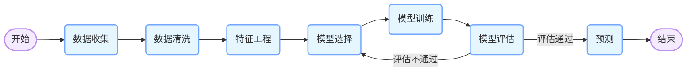

# AI辅助的公司财务报表预测模型

> 关键词：AI、财务报表预测、机器学习、深度学习、预测模型、公司财务、数据分析

> 摘要：本文聚焦于AI辅助的公司财务报表预测模型，旨在深入探讨如何利用先进的人工智能技术提升财务报表预测的准确性和效率。首先介绍了该模型研究的背景、目的、预期读者等信息，接着阐述核心概念与联系，详细讲解核心算法原理及操作步骤，通过数学模型和公式进一步剖析其理论基础。以项目实战展示代码实现和解读，分析实际应用场景。同时推荐了相关的学习资源、开发工具框架以及论文著作。最后总结未来发展趋势与挑战，提供常见问题解答和参考资料，为相关领域的研究和实践提供全面且深入的指导。

## 1. 背景介绍 
### 1.1 目的和范围
公司财务报表是反映企业财务状况和经营成果的重要文件，准确的财务报表预测对于企业的战略决策、投资者的投资决策以及监管部门的监管都具有至关重要的意义。传统的财务报表预测方法往往依赖于经验和简单的统计模型，难以应对复杂多变的市场环境和企业经营情况。随着人工智能技术的快速发展，利用AI辅助进行财务报表预测成为了研究的热点。

本文的范围涵盖了AI辅助的公司财务报表预测模型的各个方面，包括核心概念、算法原理、数学模型、项目实战、应用场景等，旨在为读者提供一个全面深入的了解和实践指导。

### 1.2 预期读者
本文预期读者包括但不限于财务分析师、企业管理者、投资者、人工智能研究人员、计算机科学专业学生以及对财务报表预测和人工智能应用感兴趣的人士。

### 1.3 文档结构概述
本文首先介绍背景信息，包括目的、预期读者和文档结构概述等。接着阐述核心概念与联系，包括相关概念的原理和架构，并用流程图展示。然后详细讲解核心算法原理和具体操作步骤，结合Python源代码进行说明。再通过数学模型和公式深入剖析理论基础，并举例说明。以项目实战展示代码实现和解读，分析实际应用场景。推荐相关的学习资源、开发工具框架以及论文著作。最后总结未来发展趋势与挑战，提供常见问题解答和参考资料。

### 1.4 术语表
#### 1.4.1 核心术语定义
- **AI（Artificial Intelligence）**：人工智能，是研究、开发用于模拟、延伸和扩展人的智能的理论、方法、技术及应用系统的一门新的技术科学。
- **财务报表预测**：根据企业的历史财务数据和相关信息，运用一定的方法和模型，对企业未来的财务报表项目进行估计和推测的过程。
- **机器学习（Machine Learning）**：一门多领域交叉学科，涉及概率论、统计学、逼近论、凸分析、算法复杂度理论等多门学科。它专门研究计算机怎样模拟或实现人类的学习行为，以获取新的知识或技能，重新组织已有的知识结构使之不断改善自身的性能。
- **深度学习（Deep Learning）**：机器学习的一个分支领域，它试图使用包含复杂结构或由多重非线性变换构成的多个处理层对数据进行高层抽象的算法。

#### 1.4.2 相关概念解释
- **时间序列分析**：一种统计方法，用于分析按时间顺序排列的数据，以发现数据中的模式、趋势和季节性等特征，常用于预测未来值。
- **回归分析**：一种统计分析方法，用于研究因变量与一个或多个自变量之间的关系，通过建立回归模型来预测因变量的值。
- **神经网络**：一种模仿人类神经系统的计算模型，由大量的神经元组成，可以自动从数据中学习特征和模式，用于分类、预测等任务。

#### 1.4.3 缩略词列表
- **ANN（Artificial Neural Network）**：人工神经网络
- **RNN（Recurrent Neural Network）**：循环神经网络
- **LSTM（Long Short - Term Memory）**：长短期记忆网络
- **GRU（Gated Recurrent Unit）**：门控循环单元

## 2. 核心概念与联系 
### 核心概念原理
#### 机器学习在财务报表预测中的应用
机器学习算法可以通过对企业历史财务数据的学习，发现数据中的规律和模式，从而对未来的财务报表项目进行预测。常见的机器学习算法包括线性回归、决策树、随机森林、支持向量机等。

例如，线性回归算法可以通过建立财务报表项目与其他相关变量之间的线性关系，来预测该项目的未来值。假设我们要预测企业的销售收入，我们可以选择一些可能影响销售收入的变量，如市场需求、广告投入、产品价格等，然后使用线性回归算法建立这些变量与销售收入之间的线性模型。

#### 深度学习在财务报表预测中的应用
深度学习算法，特别是循环神经网络（RNN）及其变体（如LSTM和GRU），在处理时间序列数据方面具有独特的优势。财务报表数据通常是按时间顺序排列的，因此深度学习算法可以更好地捕捉数据中的时间依赖关系，提高预测的准确性。

LSTM和GRU通过引入门控机制，解决了传统RNN在处理长序列数据时出现的梯度消失或梯度爆炸问题，能够更好地记忆和利用历史信息。

### 架构的文本示意图
AI辅助的公司财务报表预测模型的架构主要包括数据层、特征工程层、模型层和预测层。

- **数据层**：收集企业的历史财务数据，包括资产负债表、利润表、现金流量表等，以及相关的外部数据，如市场数据、宏观经济数据等。
- **特征工程层**：对收集到的数据进行清洗、预处理和特征提取，选择对预测有重要影响的特征。
- **模型层**：选择合适的机器学习或深度学习算法，如线性回归、LSTM等，对处理后的数据进行训练，建立预测模型。
- **预测层**：使用训练好的模型对未来的财务报表项目进行预测，并输出预测结果。

### Mermaid流程图


## 3. 核心算法原理 & 具体操作步骤 
### 线性回归算法原理
线性回归是一种简单而常用的机器学习算法，用于建立因变量 $y$ 与自变量 $x_1,x_2,\cdots,x_n$ 之间的线性关系。其数学模型可以表示为：

$$y = \beta_0+\beta_1x_1+\beta_2x_2+\cdots+\beta_nx_n+\epsilon$$

其中，$\beta_0,\beta_1,\cdots,\beta_n$ 是待估计的参数，$\epsilon$ 是误差项。

线性回归的目标是找到一组参数 $\beta_0,\beta_1,\cdots,\beta_n$，使得预测值与真实值之间的误差平方和最小。误差平方和可以表示为：

$$S(\beta)=\sum_{i = 1}^{m}(y_i-\hat{y}_i)^2=\sum_{i = 1}^{m}(y_i - (\beta_0+\beta_1x_{i1}+\beta_2x_{i2}+\cdots+\beta_nx_{in}))^2$$

其中，$m$ 是样本数量，$y_i$ 是第 $i$ 个样本的真实值，$\hat{y}_i$ 是第 $i$ 个样本的预测值。

### Python源代码实现
```python
import numpy as np
from sklearn.linear_model import LinearRegression
from sklearn.model_selection import train_test_split
from sklearn.metrics import mean_squared_error

# 生成示例数据
np.random.seed(0)
X = np.random.rand(100, 3)
y = 2 * X[:, 0] + 3 * X[:, 1] - 1 * X[:, 2] + np.random.randn(100)

# 划分训练集和测试集
X_train, X_test, y_train, y_test = train_test_split(X, y, test_size=0.2, random_state=42)

# 创建线性回归模型
model = LinearRegression()

# 训练模型
model.fit(X_train, y_train)

# 进行预测
y_pred = model.predict(X_test)

# 计算均方误差
mse = mean_squared_error(y_test, y_pred)
print(f"均方误差: {mse}")
```
### 具体操作步骤
1. **数据准备**：收集企业的历史财务数据，并进行清洗和预处理，将其转换为适合模型训练的格式。
2. **特征选择**：选择对预测有重要影响的特征，可以使用相关性分析、特征重要性评估等方法。
3. **模型选择**：根据数据的特点和预测任务的要求，选择合适的线性回归模型。
4. **模型训练**：使用训练数据对模型进行训练，估计模型的参数。
5. **模型评估**：使用测试数据对训练好的模型进行评估，计算评估指标，如均方误差、平均绝对误差等。
6. **预测**：使用训练好的模型对未来的财务报表项目进行预测。

## 4. 数学模型和公式 & 详细讲解 & 举例说明 
### 线性回归的数学模型
如前所述，线性回归的数学模型为：

$$y = \beta_0+\beta_1x_1+\beta_2x_2+\cdots+\beta_nx_n+\epsilon$$

### 参数估计
为了估计参数 $\beta_0,\beta_1,\cdots,\beta_n$，我们通常使用最小二乘法。最小二乘法的目标是使误差平方和 $S(\beta)$ 最小。对 $S(\beta)$ 求偏导数，并令其等于 0，可以得到一组正规方程：

$$\begin{cases}\frac{\partial S(\beta)}{\partial\beta_0}=-2\sum_{i = 1}^{m}(y_i - (\beta_0+\beta_1x_{i1}+\beta_2x_{i2}+\cdots+\beta_nx_{in})) = 0\\\frac{\partial S(\beta)}{\partial\beta_1}=-2\sum_{i = 1}^{m}(y_i - (\beta_0+\beta_1x_{i1}+\beta_2x_{i2}+\cdots+\beta_nx_{in}))x_{i1} = 0\\\cdots\\\frac{\partial S(\beta)}{\partial\beta_n}=-2\sum_{i = 1}^{m}(y_i - (\beta_0+\beta_1x_{i1}+\beta_2x_{i2}+\cdots+\beta_nx_{in}))x_{in} = 0\end{cases}$$

解这个正规方程组，可以得到参数 $\beta_0,\beta_1,\cdots,\beta_n$ 的估计值。

### 举例说明
假设我们有以下一组数据：

| $x_1$ | $x_2$ | $y$ |
|---|---|---|
| 1 | 2 | 5 |
| 2 | 3 | 7 |
| 3 | 4 | 9 |

我们要建立一个线性回归模型 $y=\beta_0+\beta_1x_1+\beta_2x_2+\epsilon$。

首先，计算误差平方和 $S(\beta)$：

$$S(\beta)=\sum_{i = 1}^{3}(y_i - (\beta_0+\beta_1x_{i1}+\beta_2x_{i2}))^2=(5 - (\beta_0+\beta_1\times1+\beta_2\times2))^2+(7 - (\beta_0+\beta_1\times2+\beta_2\times3))^2+(9 - (\beta_0+\beta_1\times3+\beta_2\times4))^2$$

然后，对 $S(\beta)$ 求偏导数并令其等于 0，得到正规方程组：

$$\begin{cases}-2((5 - (\beta_0+\beta_1\times1+\beta_2\times2))+(7 - (\beta_0+\beta_1\times2+\beta_2\times3))+(9 - (\beta_0+\beta_1\times3+\beta_2\times4)))=0\\-2((5 - (\beta_0+\beta_1\times1+\beta_2\times2))\times1+(7 - (\beta_0+\beta_1\times2+\beta_2\times3))\times2+(9 - (\beta_0+\beta_1\times3+\beta_2\times4))\times3)=0\\-2((5 - (\beta_0+\beta_1\times1+\beta_2\times2))\times2+(7 - (\beta_0+\beta_1\times2+\beta_2\times3))\times3+(9 - (\beta_0+\beta_1\times3+\beta_2\times4))\times4)=0\end{cases}$$

解这个方程组，可以得到 $\beta_0,\beta_1,\beta_2$ 的估计值。

## 5. 项目实战：代码实际案例和详细解释说明 
### 5.1  开发环境搭建
- **Python环境**：建议使用Python 3.7及以上版本，可以从Python官方网站（https://www.python.org/downloads/）下载安装。
- **开发工具**：可以使用PyCharm、Jupyter Notebook等开发工具。
- **相关库**：需要安装`numpy`、`pandas`、`scikit-learn`、`tensorflow`或`pytorch`等库。可以使用以下命令进行安装：

```bash
pip install numpy pandas scikit-learn tensorflow
```

### 5.2  源代码详细实现和代码解读
以下是一个使用LSTM进行财务报表预测的示例代码：

```python
import numpy as np
import pandas as pd
from sklearn.preprocessing import MinMaxScaler
from tensorflow.keras.models import Sequential
from tensorflow.keras.layers import LSTM, Dense

# 读取数据
data = pd.read_csv('financial_data.csv')
# 假设我们要预测的是销售收入
target = data['sales'].values.reshape(-1, 1)

# 数据归一化
scaler = MinMaxScaler(feature_range=(0, 1))
target_scaled = scaler.fit_transform(target)

# 划分训练集和测试集
train_size = int(len(target_scaled) * 0.8)
train_data = target_scaled[:train_size]
test_data = target_scaled[train_size:]

# 准备训练数据
def create_sequences(data, seq_length):
    X = []
    y = []
    for i in range(len(data) - seq_length):
        X.append(data[i:i+seq_length])
        y.append(data[i+seq_length])
    return np.array(X), np.array(y)

seq_length = 10
X_train, y_train = create_sequences(train_data, seq_length)
X_test, y_test = create_sequences(test_data, seq_length)

# 构建LSTM模型
model = Sequential()
model.add(LSTM(50, return_sequences=True, input_shape=(seq_length, 1)))
model.add(LSTM(50, return_sequences=False))
model.add(Dense(25))
model.add(Dense(1))

# 编译模型
model.compile(optimizer='adam', loss='mean_squared_error')

# 训练模型
model.fit(X_train, y_train, batch_size=32, epochs=50)

# 进行预测
predictions = model.predict(X_test)
predictions = scaler.inverse_transform(predictions)
y_test = scaler.inverse_transform(y_test)
```

### 5.3  代码解读与分析
1. **数据读取和预处理**：使用`pandas`库读取财务数据，并选择要预测的目标变量（如销售收入）。使用`MinMaxScaler`对数据进行归一化处理，将数据缩放到0到1的范围内。
2. **划分训练集和测试集**：将数据按照80%和20%的比例划分为训练集和测试集。
3. **准备训练数据**：定义`create_sequences`函数，将时间序列数据转换为适合LSTM模型输入的格式。每个样本包含`seq_length`个时间步的历史数据，目标值是下一个时间步的值。
4. **构建LSTM模型**：使用`Sequential`模型构建一个包含两个LSTM层和两个全连接层的神经网络。
5. **编译模型**：使用`adam`优化器和均方误差损失函数编译模型。
6. **训练模型**：使用训练数据对模型进行训练，设置批量大小为32，训练50个周期。
7. **进行预测**：使用训练好的模型对测试数据进行预测，并将预测结果反归一化，得到真实的销售收入预测值。

## 6. 实际应用场景 
### 企业内部决策
企业管理者可以使用AI辅助的财务报表预测模型来制定战略规划、预算编制和资源分配等决策。通过准确预测未来的财务状况，企业可以提前做好准备，应对可能出现的风险和机遇。

例如，企业可以根据预测的销售收入和成本，合理安排生产计划，优化库存管理，提高资金使用效率。

### 投资者决策
投资者可以利用财务报表预测模型来评估企业的投资价值和风险。通过分析预测的财务指标，如净利润、资产负债率等，投资者可以做出更明智的投资决策。

例如，投资者可以比较不同企业的预测财务报表，选择具有较高增长潜力和较低风险的企业进行投资。

### 监管部门监管
监管部门可以使用财务报表预测模型来监测企业的财务状况和经营风险。通过对企业未来财务报表的预测，监管部门可以及时发现潜在的问题，采取相应的监管措施。

例如，监管部门可以对预测财务指标异常的企业进行重点监管，防范金融风险。

## 7. 工具和资源推荐
### 7.1 学习资源推荐
#### 7.1.1 书籍推荐
- 《Python机器学习》：详细介绍了Python在机器学习中的应用，包括各种机器学习算法的原理和实现。
- 《深度学习》：由深度学习领域的三位权威专家Ian Goodfellow、Yoshua Bengio和Aaron Courville撰写，是深度学习领域的经典教材。
- 《财务报表分析》：介绍了财务报表分析的基本方法和技巧，有助于读者理解财务报表数据。

#### 7.1.2 在线课程
- Coursera上的“机器学习”课程：由Andrew Ng教授授课，是机器学习领域的经典在线课程。
- edX上的“深度学习”课程：提供了深度学习的深入讲解和实践案例。
- 中国大学MOOC上的“财务报表分析”课程：由国内知名高校的教授授课，适合初学者学习。

#### 7.1.3 技术博客和网站
- Medium：有许多关于人工智能和财务分析的优秀博客文章。
- Kaggle：提供了大量的数据集和机器学习竞赛，有助于读者实践和提高技能。
- 中国会计视野网：提供了丰富的财务会计信息和案例分析。

### 7.2 开发工具框架推荐
#### 7.2.1 IDE和编辑器
- PyCharm：一款功能强大的Python集成开发环境，提供了代码编辑、调试、版本控制等功能。
- Jupyter Notebook：一种交互式的开发环境，适合进行数据分析和模型实验。
- Visual Studio Code：一款轻量级的代码编辑器，支持多种编程语言和插件扩展。

#### 7.2.2 调试和性能分析工具
- TensorBoard：TensorFlow提供的可视化工具，可以帮助用户分析模型的训练过程和性能。
- PyTorch Profiler：PyTorch提供的性能分析工具，可以帮助用户找出模型的性能瓶颈。
- Scikit-learn的交叉验证工具：可以帮助用户评估模型的性能和选择最优参数。

#### 7.2.3 相关框架和库
- TensorFlow：一个开源的机器学习框架，提供了丰富的工具和库，用于构建和训练深度学习模型。
- PyTorch：另一个流行的深度学习框架，具有动态图和易于使用的特点。
- Scikit-learn：一个简单而高效的机器学习库，提供了各种机器学习算法和工具。

### 7.3 相关论文著作推荐
#### 7.3.1 经典论文
- “Gradient - Based Learning Applied to Document Recognition”：介绍了卷积神经网络（CNN）的经典论文，对深度学习的发展产生了重要影响。
- “Long Short - Term Memory”：介绍了LSTM网络的经典论文，解决了传统RNN在处理长序列数据时的问题。

#### 7.3.2 最新研究成果
- 可以关注顶级学术会议，如NeurIPS、ICML、KDD等，了解AI辅助财务报表预测领域的最新研究成果。

#### 7.3.3 应用案例分析
- 一些金融机构和企业会发布关于财务报表预测模型应用的案例分析，可以从中学习实际应用中的经验和技巧。

## 8. 总结：未来发展趋势与挑战
### 未来发展趋势
- **多模态数据融合**：未来的财务报表预测模型将不仅仅依赖于财务数据，还会融合文本数据（如新闻报道、企业公告）、图像数据（如企业产品图片）等多模态数据，以获取更全面的信息，提高预测的准确性。
- **强化学习的应用**：强化学习可以通过与环境的交互不断优化预测策略，未来可能会在财务报表预测中得到更广泛的应用。例如，根据市场变化动态调整预测模型的参数。
- **可解释性增强**：随着人工智能技术的发展，人们对模型的可解释性要求越来越高。未来的财务报表预测模型将更加注重可解释性，以便用户更好地理解模型的决策过程和结果。

### 挑战
- **数据质量问题**：财务数据的质量直接影响预测模型的性能。数据可能存在缺失值、异常值、错误值等问题，需要进行有效的数据清洗和预处理。
- **模型泛化能力**：不同企业的财务状况和经营模式差异较大，如何提高模型的泛化能力，使其在不同企业和行业中都能取得较好的预测效果，是一个挑战。
- **法律法规和伦理问题**：在使用AI进行财务报表预测时，需要遵守相关的法律法规和伦理准则，如数据隐私保护、防止模型歧视等。

## 9. 附录：常见问题与解答
### 问题1：如何选择合适的特征用于财务报表预测？
解答：可以使用相关性分析、特征重要性评估等方法选择与预测目标相关性较高的特征。同时，还可以结合业务知识，选择对财务报表项目有重要影响的特征。

### 问题2：如何评估财务报表预测模型的性能？
解答：可以使用均方误差（MSE）、平均绝对误差（MAE）、均方根误差（RMSE）等指标评估模型的预测误差。还可以使用R²分数评估模型的拟合优度。

### 问题3：如何处理财务数据中的缺失值？
解答：可以使用均值、中位数、众数等统计量填充缺失值，也可以使用插值法或机器学习算法进行填充。

## 10. 扩展阅读 & 参考资料
- 《人工智能：现代方法》
- 《财务风险管理》
- 相关学术期刊：《Journal of Financial Economics》、《The Accounting Review》等
- 相关行业报告：德勤、普华永道等会计师事务所发布的财务分析报告。