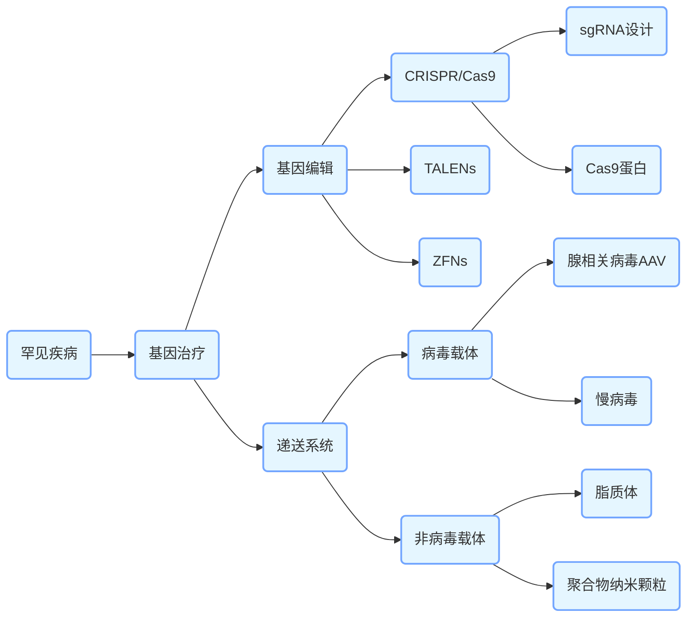

# AI辅助罕见疾病基因治疗方案设计：从基因编辑到递送系统

> 关键词：AI、罕见疾病、基因治疗、基因编辑、递送系统

> 摘要：本文聚焦于AI在罕见疾病基因治疗方案设计中的应用，从基因编辑到递送系统展开全面深入的探讨。详细阐述了AI在该领域的核心概念、算法原理、数学模型，通过项目实战展示其具体应用，分析了实际应用场景，并推荐了相关工具和资源。最后对未来发展趋势与挑战进行总结，旨在为推动AI辅助罕见疾病基因治疗的发展提供全面且深入的技术参考。

## 1. 背景介绍 
### 1.1 目的和范围
罕见疾病是指那些发病率极低的疾病，由于其患者群体少、病例分散，针对罕见疾病的治疗方案研发面临诸多挑战。传统的基因治疗方案设计往往依赖于专家经验和大量的实验探索，过程耗时且成本高昂。本文章的目的在于探讨如何利用AI技术辅助罕见疾病基因治疗方案的设计，范围涵盖从基因编辑技术的优化到递送系统的智能设计，旨在提高基因治疗方案的有效性、安全性和研发效率。

### 1.2 预期读者
本文预期读者包括从事生物医学、基因治疗、人工智能等领域的科研人员、工程师、研究生等，也适合对基因治疗和AI技术应用感兴趣的专业人士参考。

### 1.3 文档结构概述
本文首先介绍相关背景知识，包括目的、预期读者和文档结构。接着阐述核心概念与联系，分析核心算法原理和具体操作步骤，并给出数学模型和公式。然后通过项目实战展示代码实际案例和详细解释说明。之后探讨实际应用场景，推荐相关工具和资源。最后总结未来发展趋势与挑战，提供常见问题与解答以及扩展阅读和参考资料。

### 1.4 术语表
#### 1.4.1 核心术语定义
- **罕见疾病**：指发病率极低的疾病，通常患病人数占总人口的0.65‰ - 1‰之间。
- **基因治疗**：指将外源正常基因导入靶细胞，以纠正或补偿因基因缺陷和异常引起的疾病，以达到治疗目的。
- **基因编辑**：指对基因组进行定点修饰的一项新技术，能够实现对特定DNA片段的敲除、加入等。
- **递送系统**：指将治疗性核酸（如DNA、RNA等）或基因编辑工具安全、有效地递送至靶细胞或组织的载体或方法。
- **AI（人工智能）**：指计算机系统能够执行通常需要人类智能才能完成的任务，如学习、推理、解决问题等。

#### 1.4.2 相关概念解释
- **基因治疗的作用机制**：通过导入正常基因来替代有缺陷的基因，或者调节基因的表达水平，从而改善疾病症状。
- **基因编辑技术的分类**：常见的基因编辑技术包括CRISPR/Cas9、TALENs、ZFNs等，它们通过不同的机制实现对特定基因的编辑。
- **递送系统的重要性**：基因治疗的成功不仅取决于有效的基因编辑工具，还需要合适的递送系统将其准确递送至靶细胞，以提高治疗效果并减少副作用。

#### 1.4.3 缩略词列表
- **CRISPR**：Clustered Regularly Interspaced Short Palindromic Repeats（成簇的规律间隔的短回文重复序列）
- **Cas9**：CRISPR-associated protein 9（CRISPR相关蛋白9）
- **TALENs**：Transcription Activator-Like Effector Nucleases（转录激活因子样效应物核酸酶）
- **ZFNs**：Zinc Finger Nucleases（锌指核酸酶）

## 2. 核心概念与联系 

### 基因治疗概述
基因治疗是一种新兴的治疗手段，旨在通过修复或替换有缺陷的基因来治疗疾病。对于罕见疾病，由于其病因往往与特定基因的突变或异常表达有关，基因治疗具有巨大的潜力。

### 基因编辑技术原理
基因编辑技术是基因治疗的核心工具之一，其中CRISPR/Cas9技术因其操作简单、效率高而备受关注。CRISPR/Cas9系统由CRISPR序列和Cas9蛋白组成，CRISPR序列能够识别特定的DNA序列，Cas9蛋白则可以对该序列进行切割，从而实现基因编辑。

#### CRISPR/Cas9工作流程
1. **sgRNA设计**：设计与目标基因序列互补的单链引导RNA（sgRNA）。
2. **复合物形成**：sgRNA与Cas9蛋白结合形成复合物。
3. **靶向结合**：复合物通过sgRNA与目标基因序列特异性结合。
4. **切割作用**：Cas9蛋白对目标基因进行切割，导致DNA双链断裂。
5. **修复过程**：细胞自身的DNA修复机制对断裂的DNA进行修复，可能导致基因的敲除、插入或替换。

### 递送系统原理
递送系统的主要作用是将基因编辑工具（如CRISPR/Cas9）或治疗性核酸安全、有效地递送至靶细胞。常见的递送系统包括病毒载体和非病毒载体。

#### 病毒载体
病毒载体是利用病毒的感染特性，将治疗性基因或基因编辑工具包装在病毒颗粒中，通过病毒感染细胞的过程将其导入细胞内。常见的病毒载体包括腺相关病毒（AAV）、慢病毒等。

#### 非病毒载体
非病毒载体包括脂质体、聚合物纳米颗粒等，它们通过物理或化学方法将治疗性基因或基因编辑工具包裹起来，然后通过细胞膜的摄取作用进入细胞。

### 核心概念联系示意图


## 3. 核心算法原理 & 具体操作步骤 

### AI在基因编辑设计中的应用
#### 算法原理
AI在基因编辑设计中的主要任务是预测sgRNA的活性和特异性，以提高基因编辑的效率和准确性。常用的算法包括深度学习算法，如卷积神经网络（CNN）和循环神经网络（RNN）。

以CNN为例，其原理是通过对大量已知sgRNA的序列和活性数据进行学习，提取序列特征，构建预测模型。模型输入为sgRNA的序列，输出为其预测的活性值。

#### Python代码实现
```python
import numpy as np
import tensorflow as tf
from tensorflow.keras.models import Sequential
from tensorflow.keras.layers import Conv1D, MaxPooling1D, Flatten, Dense

# 生成示例数据
# 假设每个sgRNA序列长度为20，使用one-hot编码
num_samples = 1000
sequence_length = 20
num_classes = 4  # A, T, C, G

X = np.random.randint(0, num_classes, size=(num_samples, sequence_length))
X = np.eye(num_classes)[X]  # one-hot编码

# 随机生成活性标签
y = np.random.rand(num_samples)

# 构建CNN模型
model = Sequential()
model.add(Conv1D(filters=32, kernel_size=3, activation='relu', input_shape=(sequence_length, num_classes)))
model.add(MaxPooling1D(pool_size=2))
model.add(Flatten())
model.add(Dense(64, activation='relu'))
model.add(Dense(1, activation='sigmoid'))

# 编译模型
model.compile(optimizer='adam', loss='mse', metrics=['mae'])

# 训练模型
model.fit(X, y, epochs=10, batch_size=32)
```

#### 具体操作步骤
1. **数据收集**：收集大量已知sgRNA的序列和活性数据。
2. **数据预处理**：对sgRNA序列进行one-hot编码，将活性数据进行归一化处理。
3. **模型构建**：选择合适的深度学习模型，如CNN，构建预测模型。
4. **模型训练**：使用预处理后的数据对模型进行训练，调整模型参数以提高预测性能。
5. **模型评估**：使用测试数据对训练好的模型进行评估，计算预测误差。
6. **sgRNA设计**：使用训练好的模型对新的sgRNA序列进行预测，选择活性高、特异性强的sgRNA。

### AI在递送系统设计中的应用
#### 算法原理
AI在递送系统设计中的主要任务是预测不同递送系统的递送效率和安全性，以选择最优的递送方案。常用的算法包括机器学习算法，如支持向量机（SVM）和随机森林（RF）。

以SVM为例，其原理是通过对大量已知递送系统的特征数据和递送效率、安全性数据进行学习，构建分类或回归模型。模型输入为递送系统的特征，输出为其预测的递送效率或安全性评估值。

#### Python代码实现
```python
from sklearn import svm
from sklearn.model_selection import train_test_split
from sklearn.metrics import mean_squared_error

# 生成示例数据
# 假设每个递送系统有10个特征
num_samples = 1000
num_features = 10

X = np.random.rand(num_samples, num_features)
y = np.random.rand(num_samples)

# 划分训练集和测试集
X_train, X_test, y_train, y_test = train_test_split(X, y, test_size=0.2)

# 构建SVM模型
model = svm.SVR()

# 训练模型
model.fit(X_train, y_train)

# 预测
y_pred = model.predict(X_test)

# 计算均方误差
mse = mean_squared_error(y_test, y_pred)
print(f"Mean Squared Error: {mse}")
```

#### 具体操作步骤
1. **数据收集**：收集大量已知递送系统的特征数据和递送效率、安全性数据。
2. **数据预处理**：对特征数据进行标准化处理，对递送效率和安全性数据进行归一化处理。
3. **模型构建**：选择合适的机器学习模型，如SVM，构建预测模型。
4. **模型训练**：使用预处理后的数据对模型进行训练，调整模型参数以提高预测性能。
5. **模型评估**：使用测试数据对训练好的模型进行评估，计算预测误差。
6. **递送系统选择**：使用训练好的模型对不同的递送系统进行预测，选择递送效率高、安全性好的递送系统。

## 4. 数学模型和公式 & 详细讲解 & 举例说明 

### 基因编辑活性预测模型
#### 数学模型
以CNN为例，假设输入的sgRNA序列经过one-hot编码后为一个矩阵 $X \in \mathbb{R}^{L \times 4}$，其中 $L$ 为序列长度，4 表示 A、T、C、G 四种碱基。CNN 模型通过一系列卷积层、池化层和全连接层进行特征提取和非线性变换，最终输出预测的活性值 $\hat{y} \in \mathbb{R}$。

#### 详细讲解
卷积层的作用是提取序列的局部特征，卷积操作可以表示为：
$$
z_{i}^{l} = \sum_{j=0}^{k - 1} w_{j}^{l} x_{i + j} + b^{l}
$$
其中 $z_{i}^{l}$ 是第 $l$ 层卷积层的第 $i$ 个输出，$w_{j}^{l}$ 是第 $l$ 层卷积核的第 $j$ 个权重，$x_{i + j}$ 是输入序列的第 $i + j$ 个元素，$b^{l}$ 是第 $l$ 层的偏置。

池化层的作用是对卷积层的输出进行降维，常用的池化操作是最大池化：
$$
p_{m}^{l} = \max_{i \in \mathcal{N}_{m}} z_{i}^{l}
$$
其中 $p_{m}^{l}$ 是第 $l$ 层池化层的第 $m$ 个输出，$\mathcal{N}_{m}$ 是第 $m$ 个池化窗口内的元素索引集合。

全连接层的作用是将池化层的输出进行非线性变换，最终得到预测的活性值：
$$
\hat{y} = \sigma\left(\sum_{k=0}^{n - 1} v_{k} h_{k} + c\right)
$$
其中 $\sigma$ 是激活函数，如 sigmoid 函数，$v_{k}$ 是全连接层的第 $k$ 个权重，$h_{k}$ 是池化层的第 $k$ 个输出，$c$ 是偏置。

#### 举例说明
假设输入的sgRNA序列长度为20，经过one-hot编码后为一个 $20 \times 4$ 的矩阵。卷积层的卷积核大小为3，卷积核数量为32，则卷积层的输出为一个 $18 \times 32$ 的矩阵。池化层的池化窗口大小为2，则池化层的输出为一个 $9 \times 32$ 的矩阵。全连接层的输入是将池化层的输出展平后的向量，经过非线性变换后得到预测的活性值。

### 递送系统性能预测模型
#### 数学模型
以SVM为例，假设输入的递送系统特征向量为 $x \in \mathbb{R}^{n}$，其中 $n$ 为特征数量。SVM 模型通过寻找一个最优的超平面来进行分类或回归，超平面的方程可以表示为：
$$
w^{T} x + b = 0
$$
其中 $w \in \mathbb{R}^{n}$ 是超平面的法向量，$b \in \mathbb{R}$ 是偏置。

对于回归问题，SVM 的目标是最小化以下损失函数：
$$
\min_{w, b, \xi, \xi^{*}} \frac{1}{2} w^{T} w + C \sum_{i = 1}^{m} (\xi_{i} + \xi_{i}^{*})
$$
$$
\text{s.t. } y_{i} - w^{T} x_{i} - b \leq \epsilon + \xi_{i}
$$
$$
w^{T} x_{i} + b - y_{i} \leq \epsilon + \xi_{i}^{*}
$$
$$
\xi_{i}, \xi_{i}^{*} \geq 0
$$
其中 $C$ 是惩罚系数，$\epsilon$ 是不敏感损失函数的参数，$\xi_{i}$ 和 $\xi_{i}^{*}$ 是松弛变量。

#### 详细讲解
SVM 的核心思想是在特征空间中寻找一个最优的超平面，使得不同类别的样本能够被最大程度地分开。对于回归问题，SVM 的目标是找到一个超平面，使得所有样本点到该超平面的距离都在一个给定的误差范围 $\epsilon$ 内。

通过引入松弛变量 $\xi_{i}$ 和 $\xi_{i}^{*}$，可以处理样本点不在误差范围内的情况。惩罚系数 $C$ 控制了对误差的容忍程度，$C$ 越大，对误差的惩罚越严重。

#### 举例说明
假设输入的递送系统特征向量有10个特征，即 $n = 10$。SVM 模型通过训练数据学习到最优的超平面参数 $w$ 和 $b$，然后对新的递送系统特征向量进行预测，得到其预测的递送效率或安全性评估值。

## 5. 项目实战：代码实际案例和详细解释说明 

### 5.1  开发环境搭建
#### 硬件环境
- **CPU**：Intel Core i7 及以上
- **内存**：16GB 及以上
- **硬盘**：500GB 及以上

#### 软件环境
- **操作系统**：Windows 10 或 Ubuntu 18.04 及以上
- **Python**：3.7 及以上
- **深度学习框架**：TensorFlow 2.x 或 PyTorch 1.x
- **机器学习库**：Scikit-learn

#### 安装步骤
1. **安装 Python**：从 Python 官方网站下载并安装 Python 3.7 及以上版本。
2. **安装 TensorFlow**：使用以下命令安装 TensorFlow 2.x：
```sh
pip install tensorflow
```
3. **安装 Scikit-learn**：使用以下命令安装 Scikit-learn：
```sh
pip install scikit-learn
```

### 5.2  源代码详细实现和代码解读
#### 基因编辑活性预测项目
```python
import numpy as np
import tensorflow as tf
from tensorflow.keras.models import Sequential
from tensorflow.keras.layers import Conv1D, MaxPooling1D, Flatten, Dense
from sklearn.model_selection import train_test_split

# 生成示例数据
# 假设每个sgRNA序列长度为20，使用one-hot编码
num_samples = 1000
sequence_length = 20
num_classes = 4  # A, T, C, G

X = np.random.randint(0, num_classes, size=(num_samples, sequence_length))
X = np.eye(num_classes)[X]  # one-hot编码

# 随机生成活性标签
y = np.random.rand(num_samples)

# 划分训练集和测试集
X_train, X_test, y_train, y_test = train_test_split(X, y, test_size=0.2)

# 构建CNN模型
model = Sequential()
model.add(Conv1D(filters=32, kernel_size=3, activation='relu', input_shape=(sequence_length, num_classes)))
model.add(MaxPooling1D(pool_size=2))
model.add(Flatten())
model.add(Dense(64, activation='relu'))
model.add(Dense(1, activation='sigmoid'))

# 编译模型
model.compile(optimizer='adam', loss='mse', metrics=['mae'])

# 训练模型
model.fit(X_train, y_train, epochs=10, batch_size=32, validation_data=(X_test, y_test))

# 评估模型
test_loss, test_mae = model.evaluate(X_test, y_test)
print(f"Test Loss: {test_loss}, Test MAE: {test_mae}")

# 预测
predictions = model.predict(X_test)
print(predictions)
```

#### 代码解读
1. **数据生成**：使用 `np.random.randint` 生成随机的 sgRNA 序列，然后使用 `np.eye` 进行 one-hot 编码。随机生成活性标签。
2. **数据划分**：使用 `train_test_split` 将数据划分为训练集和测试集。
3. **模型构建**：使用 `Sequential` 构建一个简单的 CNN 模型，包括卷积层、池化层、全连接层。
4. **模型编译**：使用 `compile` 方法编译模型，指定优化器、损失函数和评估指标。
5. **模型训练**：使用 `fit` 方法训练模型，指定训练数据、训练轮数、批次大小和验证数据。
6. **模型评估**：使用 `evaluate` 方法评估模型在测试数据上的性能。
7. **预测**：使用 `predict` 方法对测试数据进行预测。

#### 递送系统性能预测项目
```python
from sklearn import svm
from sklearn.model_selection import train_test_split
from sklearn.metrics import mean_squared_error
import numpy as np

# 生成示例数据
# 假设每个递送系统有10个特征
num_samples = 1000
num_features = 10

X = np.random.rand(num_samples, num_features)
y = np.random.rand(num_samples)

# 划分训练集和测试集
X_train, X_test, y_train, y_test = train_test_split(X, y, test_size=0.2)

# 构建SVM模型
model = svm.SVR()

# 训练模型
model.fit(X_train, y_train)

# 预测
y_pred = model.predict(X_test)

# 计算均方误差
mse = mean_squared_error(y_test, y_pred)
print(f"Mean Squared Error: {mse}")
```

#### 代码解读
1. **数据生成**：使用 `np.random.rand` 生成随机的递送系统特征数据和性能标签数据。
2. **数据划分**：使用 `train_test_split` 将数据划分为训练集和测试集。
3. **模型构建**：使用 `svm.SVR` 构建一个 SVM 回归模型。
4. **模型训练**：使用 `fit` 方法训练模型，指定训练数据。
5. **预测**：使用 `predict` 方法对测试数据进行预测。
6. **性能评估**：使用 `mean_squared_error` 计算预测结果的均方误差。

### 5.3  代码解读与分析
#### 基因编辑活性预测项目分析
- **模型结构**：CNN 模型通过卷积层提取 sgRNA 序列的局部特征，池化层对特征进行降维，全连接层进行非线性变换，最终输出预测的活性值。
- **训练过程**：使用均方误差（MSE）作为损失函数，平均绝对误差（MAE）作为评估指标。通过多次迭代训练，模型逐渐学习到 sgRNA 序列和活性值之间的关系。
- **性能评估**：测试集上的损失和 MAE 可以反映模型的泛化能力。如果损失和 MAE 较小，说明模型的预测性能较好。

#### 递送系统性能预测项目分析
- **模型选择**：SVM 回归模型适用于处理小样本数据和高维特征数据。通过寻找最优的超平面，模型可以对递送系统的性能进行预测。
- **训练过程**：SVM 模型通过优化损失函数来学习最优的超平面参数。训练过程中，模型会根据训练数据调整参数，以最小化预测误差。
- **性能评估**：均方误差（MSE）可以衡量模型预测结果与真实值之间的差异。MSE 越小，说明模型的预测性能越好。

## 6. 实际应用场景 
### 罕见遗传病的治疗
对于一些由单基因缺陷引起的罕见遗传病，如囊性纤维化、镰状细胞贫血等，AI 辅助的基因治疗方案设计可以帮助确定最佳的基因编辑靶点和递送系统，提高治疗的有效性和安全性。

### 罕见癌症的治疗
对于一些罕见类型的癌症，如儿童神经母细胞瘤、腺泡状软组织肉瘤等，基因治疗可以通过编辑肿瘤相关基因或调节免疫细胞功能来实现治疗目的。AI 可以辅助设计更精准的基因治疗方案，提高肿瘤的治疗效果。

### 罕见代谢性疾病的治疗
对于一些罕见的代谢性疾病，如苯丙酮尿症、肝豆状核变性等，基因治疗可以通过补充或修复缺陷的代谢酶基因来改善代谢功能。AI 可以帮助优化基因编辑和递送系统，提高治疗的成功率。

## 7. 工具和资源推荐
### 7.1 学习资源推荐
#### 7.1.1 书籍推荐
- 《基因治疗：原理与应用》：全面介绍了基因治疗的基本原理、技术方法和临床应用。
- 《深度学习》：深度学习领域的经典教材，介绍了深度学习的基本概念、算法和应用。
- 《Python机器学习》：详细介绍了 Python 在机器学习中的应用，包括各种机器学习算法的实现和优化。

#### 7.1.2 在线课程
- Coursera 上的“深度学习专项课程”：由深度学习领域的知名学者授课，系统介绍了深度学习的理论和实践。
- edX 上的“基因治疗基础”：介绍了基因治疗的基本概念、技术和应用。
- 中国大学MOOC上的“人工智能基础”：适合初学者学习人工智能的基本概念和算法。

#### 7.1.3 技术博客和网站
- Medium：有许多关于基因治疗、人工智能等领域的技术博客和文章。
- BioRxiv：生物预印本平台，提供了大量关于基因治疗的最新研究成果。
- arXiv：科学预印本平台，包含了许多关于人工智能的研究论文。

### 7.2 开发工具框架推荐
#### 7.2.1 IDE和编辑器
- PyCharm：功能强大的 Python 集成开发环境，支持代码编辑、调试、版本控制等功能。
- Jupyter Notebook：交互式的编程环境，适合进行数据分析和模型开发。
- Visual Studio Code：轻量级的代码编辑器，支持多种编程语言和插件扩展。

#### 7.2.2 调试和性能分析工具
- TensorBoard：TensorFlow 提供的可视化工具，用于监控模型训练过程和分析模型性能。
- Scikit-learn 的 `cross_val_score`：用于交叉验证和模型评估，帮助选择最优的模型参数。
- PyTorch Profiler：PyTorch 提供的性能分析工具，用于分析模型的运行时间和内存使用情况。

#### 7.2.3 相关框架和库
- TensorFlow：开源的深度学习框架，提供了丰富的深度学习模型和工具。
- PyTorch：另一个流行的深度学习框架，具有动态图和易于使用的特点。
- Scikit-learn：用于机器学习的 Python 库，提供了各种机器学习算法和工具。

### 7.3 相关论文著作推荐
#### 7.3.1 经典论文
- “CRISPR-Cas9: A revolutionary gene editing tool”：介绍了 CRISPR/Cas9 技术的原理和应用。
- “Deep learning for gene expression analysis”：探讨了深度学习在基因表达分析中的应用。
- “Delivery systems for gene therapy”：综述了基因治疗中常用的递送系统和技术。

#### 7.3.2 最新研究成果
- 关注 Nature、Science、Cell 等顶级学术期刊上关于基因治疗和人工智能的最新研究论文。
- 参加相关的学术会议，如美国基因与细胞治疗学会（ASGCT）年会，了解最新的研究进展。

#### 7.3.3 应用案例分析
- 研究一些成功的基因治疗案例，如 Spark Therapeutics 的 Luxturna 基因疗法治疗遗传性视网膜疾病，分析其治疗方案的设计和实施过程。

## 8. 总结：未来发展趋势与挑战
### 未来发展趋势
- **多组学数据融合**：结合基因组学、转录组学、蛋白质组学等多组学数据，利用 AI 进行综合分析，更全面地了解疾病的发病机制，设计更精准的基因治疗方案。
- **个性化基因治疗**：根据患者的个体基因信息和疾病特征，利用 AI 实现个性化的基因治疗方案设计，提高治疗的有效性和安全性。
- **新型基因编辑技术的发展**：不断探索和开发新型的基因编辑技术，如碱基编辑、先导编辑等，结合 AI 技术优化编辑策略，提高基因编辑的效率和准确性。
- **智能递送系统的研发**：研发具有智能响应、靶向性强的新型递送系统，利用 AI 优化递送系统的设计和性能，提高基因治疗的递送效率和安全性。

### 挑战
- **数据质量和隐私问题**：基因治疗相关的数据通常具有高维度、复杂和敏感的特点，数据质量和隐私保护是面临的重要挑战。需要建立完善的数据管理和安全机制，确保数据的准确性和安全性。
- **AI 模型的可解释性**：目前的 AI 模型大多是黑盒模型，其决策过程难以解释。在基因治疗这样的关键领域，模型的可解释性至关重要，需要开发可解释的 AI 模型，以便医生和研究人员理解和信任模型的决策结果。
- **伦理和法律问题**：基因治疗涉及到人类基因的编辑和改造，引发了一系列伦理和法律问题。需要建立相应的伦理和法律框架，规范基因治疗的研究和应用，确保其符合人类伦理和法律要求。
- **技术转化和临床应用**：将 AI 辅助的基因治疗技术从实验室转化为临床应用面临诸多挑战，包括技术的稳定性、安全性、有效性验证，以及与现有医疗体系的融合等。需要加强产学研合作，加速技术转化和临床应用的进程。

## 9. 附录：常见问题与解答
### 基因编辑技术是否安全？
基因编辑技术的安全性是一个备受关注的问题。虽然目前的基因编辑技术（如 CRISPR/Cas9）已经取得了很大的进展，但仍然存在一些潜在的风险，如脱靶效应、免疫反应等。研究人员正在不断努力改进基因编辑技术，提高其安全性和准确性。同时，在进行基因治疗临床试验时，需要严格遵循伦理和法律规定，确保患者的安全。

### AI 模型的预测结果是否可靠？
AI 模型的预测结果的可靠性取决于多个因素，如数据质量、模型结构、训练方法等。在实际应用中，需要对 AI 模型进行严格的评估和验证，确保其在不同数据集和场景下都具有较好的性能。此外，AI 模型的预测结果通常作为辅助决策的参考，最终的决策还需要结合医生的专业知识和临床经验。

### 基因治疗的费用是否高昂？
目前，基因治疗的费用相对较高，主要原因包括研发成本、生产工艺复杂、临床试验费用等。随着技术的不断发展和成熟，基因治疗的成本有望逐渐降低。此外，政府和社会也在采取一系列措施，如医保报销、慈善救助等，来减轻患者的经济负担。

### 如何选择合适的递送系统？
选择合适的递送系统需要考虑多个因素，如递送效率、安全性、靶向性、组织特异性等。不同的递送系统具有不同的优缺点，需要根据具体的治疗需求和目标选择合适的递送系统。AI 可以通过对大量递送系统数据的分析和建模，辅助选择最优的递送系统。

## 10. 扩展阅读 & 参考资料
- [1] Anderson WF. Human gene therapy. Science. 1992;256(5058):808-813.
- [2] Doudna JA, Charpentier E. The new frontier of genome engineering with CRISPR-Cas9. Science. 2014;346(6213):1258096.
- [3] Mitragotri S, Lahann J. Designing materials for biology and medicine. Nature. 2009;462(7270):449-460.
- [4] LeCun Y, Bengio Y, Hinton G. Deep learning. Nature. 2015;521(7553):436-444.
- [5] Goodfellow I, Bengio Y, Courville A. Deep Learning. MIT Press; 2016.