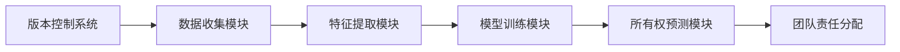

# AI驱动的代码所有权分析:优化团队责任分配

> 关键词：AI、代码所有权分析、团队责任分配、软件开发、优化、代码管理、责任界定

> 摘要：本文聚焦于AI驱动的代码所有权分析在优化团队责任分配中的应用。首先介绍了研究背景，包括目的、预期读者等内容。接着阐述了核心概念与联系，通过文本示意图和Mermaid流程图展示其原理和架构。详细讲解了核心算法原理和具体操作步骤，并辅以Python源代码。同时给出数学模型和公式，结合举例说明。通过项目实战，展示代码实际案例并进行详细解释。探讨了实际应用场景，推荐了相关的工具和资源。最后总结未来发展趋势与挑战，提供常见问题解答和扩展阅读参考资料，旨在全面深入地探讨如何利用AI提升代码所有权分析效率，实现团队责任的合理分配。

## 1. 背景介绍 
### 1.1 目的和范围
在软件开发团队中，代码的管理和责任分配是至关重要的环节。随着项目规模的不断扩大和团队成员的增加，代码所有权的界定变得愈发复杂。传统的代码管理方式往往依赖人工审查和经验判断，效率低下且容易出现责任不清的问题。本研究的目的在于探索如何利用AI技术进行代码所有权分析，从而优化团队责任分配，提高软件开发的效率和质量。

本研究的范围涵盖了从代码所有权的定义和识别，到利用AI算法进行分析和责任分配的整个过程。同时，还将探讨该技术在不同类型软件开发项目中的应用和适应性。

### 1.2 预期读者
本文预期读者包括软件开发团队的管理人员、开发人员、软件架构师、质量保证人员以及对AI在软件开发领域应用感兴趣的研究人员。这些读者可以从本文中获取关于AI驱动的代码所有权分析的理论知识、实践经验和技术方法，以改进团队的代码管理和责任分配方式。

### 1.3 文档结构概述
本文将按照以下结构进行组织：首先介绍相关的背景知识，包括目的、预期读者和文档结构概述。接着阐述核心概念与联系，通过文本示意图和Mermaid流程图展示其原理和架构。然后详细讲解核心算法原理和具体操作步骤，并给出Python源代码示例。之后介绍数学模型和公式，结合举例进行说明。通过项目实战展示代码实际案例并进行详细解释。探讨实际应用场景，推荐相关的工具和资源。最后总结未来发展趋势与挑战，提供常见问题解答和扩展阅读参考资料。

### 1.4 术语表
#### 1.4.1 核心术语定义
- **代码所有权**：指对代码的创作、修改、维护等权利和责任的归属。在软件开发中，明确代码所有权有助于确定团队成员对特定代码区域的责任。
- **AI驱动的代码所有权分析**：利用人工智能技术，如机器学习、自然语言处理等，对代码进行分析，以确定代码的所有权归属。
- **团队责任分配**：根据代码所有权分析的结果，将软件开发过程中的责任合理地分配给团队成员，确保每个成员明确自己的职责。

#### 1.4.2 相关概念解释
- **版本控制系统**：用于记录代码的变更历史，方便团队成员协作开发和管理代码。常见的版本控制系统有Git、SVN等。
- **代码仓库**：存储代码的地方，通常与版本控制系统关联。团队成员可以从代码仓库中获取代码、提交修改等。
- **代码审查**：在代码合并到主分支之前，对代码进行检查和审核，以确保代码的质量和符合团队的规范。

#### 1.4.3 缩略词列表
- **AI**：Artificial Intelligence，人工智能
- **ML**：Machine Learning，机器学习
- **NLP**：Natural Language Processing，自然语言处理
- **VCS**：Version Control System，版本控制系统

## 2. 核心概念与联系 

### 核心概念原理
AI驱动的代码所有权分析的核心原理是通过对代码的各种特征进行分析，利用机器学习和自然语言处理等技术，确定代码的创作者和主要维护者，从而明确代码的所有权。具体来说，该过程包括以下几个步骤：

1. **数据收集**：从版本控制系统中收集代码的变更历史、提交信息等数据。这些数据包含了代码的修改记录、作者信息、提交时间等。
2. **特征提取**：从收集到的数据中提取有用的特征，如代码的修改频率、修改幅度、作者的提交模式等。这些特征可以反映代码的所有权情况。
3. **模型训练**：利用提取的特征，训练机器学习模型，如决策树、支持向量机、神经网络等。这些模型可以学习代码特征与所有权之间的关系。
4. **所有权预测**：使用训练好的模型对新的代码进行所有权预测，确定代码的主要作者和维护者。

### 架构的文本示意图
```plaintext
+----------------+
| 版本控制系统  |
+----------------+
       |
       v
+----------------+
| 数据收集模块  |
+----------------+
       |
       v
+----------------+
| 特征提取模块  |
+----------------+
       |
       v
+----------------+
| 模型训练模块  |
+----------------+
       |
       v
+----------------+
| 所有权预测模块 |
+----------------+
       |
       v
+----------------+
| 团队责任分配  |
+----------------+
```

### Mermaid流程图


## 3. 核心算法原理 & 具体操作步骤 

### 核心算法原理
本研究采用基于机器学习的算法进行代码所有权分析。具体来说，我们选择使用决策树算法。决策树是一种基于树结构进行决策的机器学习算法，它通过对特征的比较和判断，逐步将数据划分到不同的类别中。在代码所有权分析中，决策树可以根据代码的特征，如修改频率、修改幅度等，判断代码的所有权归属。

### 具体操作步骤
1. **数据收集**：从版本控制系统中收集代码的变更历史数据，包括提交信息、作者信息、修改内容等。可以使用版本控制系统提供的API来获取这些数据。
2. **数据预处理**：对收集到的数据进行清洗和预处理，去除噪声数据和无效信息。例如，去除一些自动生成的提交记录。
3. **特征提取**：从预处理后的数据中提取有用的特征，如代码的修改频率、修改幅度、作者的提交模式等。可以使用统计方法和自然语言处理技术来提取这些特征。
4. **数据划分**：将提取的特征数据划分为训练集和测试集，通常按照80%和20%的比例进行划分。
5. **模型训练**：使用训练集数据训练决策树模型。可以使用Python的`scikit-learn`库来实现决策树模型的训练。
6. **模型评估**：使用测试集数据对训练好的模型进行评估，计算模型的准确率、召回率等指标。
7. **所有权预测**：使用训练好的模型对新的代码进行所有权预测，确定代码的主要作者和维护者。

### Python源代码示例
```python
import pandas as pd
from sklearn.model_selection import train_test_split
from sklearn.tree import DecisionTreeClassifier
from sklearn.metrics import accuracy_score

# 数据收集和预处理（假设已经完成，数据存储在CSV文件中）
data = pd.read_csv('code_ownership_data.csv')

# 特征提取
X = data.drop('owner', axis=1)  # 特征数据
y = data['owner']  # 标签数据

# 数据划分
X_train, X_test, y_train, y_test = train_test_split(X, y, test_size=0.2, random_state=42)

# 模型训练
model = DecisionTreeClassifier()
model.fit(X_train, y_train)

# 模型评估
y_pred = model.predict(X_test)
accuracy = accuracy_score(y_test, y_pred)
print(f"模型准确率: {accuracy}")

# 所有权预测（假设新数据存储在new_data中）
new_data = pd.read_csv('new_code_data.csv')
new_predictions = model.predict(new_data)
print(f"新代码的所有权预测结果: {new_predictions}")
```

## 4. 数学模型和公式 & 详细讲解 & 举例说明 

### 数学模型
决策树算法的数学模型基于信息论中的熵和信息增益的概念。熵是衡量数据不确定性的指标，信息增益是指在划分数据时，数据不确定性的减少量。决策树通过选择信息增益最大的特征进行划分，从而构建决策树模型。

### 公式
1. **熵的计算公式**：
$$H(S)=-\sum_{i=1}^{n}p_i\log_2(p_i)$$
其中，$S$ 表示数据集，$p_i$ 表示数据集中第 $i$ 类样本的比例，$n$ 表示类别数。

2. **信息增益的计算公式**：
$$IG(S,A)=H(S)-\sum_{v\in Values(A)}\frac{|S_v|}{|S|}H(S_v)$$
其中，$IG(S,A)$ 表示数据集 $S$ 在特征 $A$ 上的信息增益，$Values(A)$ 表示特征 $A$ 的取值集合，$S_v$ 表示特征 $A$ 取值为 $v$ 的子集。

### 详细讲解
熵的计算公式用于衡量数据集的不确定性。当数据集的所有样本都属于同一类别时，熵为0，表示数据集的不确定性最小；当数据集的样本均匀分布在各个类别中时，熵最大，表示数据集的不确定性最大。

信息增益的计算公式用于衡量在划分数据集时，数据不确定性的减少量。信息增益越大，表示使用该特征进行划分后，数据集的不确定性减少得越多，该特征越适合用于划分数据集。

### 举例说明
假设我们有一个数据集 $S$，包含10个样本，分为两个类别：正类和负类。其中，正类样本有6个，负类样本有4个。则数据集 $S$ 的熵为：
$$H(S)=-\frac{6}{10}\log_2(\frac{6}{10})-\frac{4}{10}\log_2(\frac{4}{10})\approx 0.971$$

假设我们有一个特征 $A$，取值为 $v_1$ 和 $v_2$。其中，$S_{v_1}$ 包含4个样本，正类样本有3个，负类样本有1个；$S_{v_2}$ 包含6个样本，正类样本有3个，负类样本有3个。则特征 $A$ 的信息增益为：
$$IG(S,A)=H(S)-\frac{4}{10}H(S_{v_1})-\frac{6}{10}H(S_{v_2})$$
$$H(S_{v_1})=-\frac{3}{4}\log_2(\frac{3}{4})-\frac{1}{4}\log_2(\frac{1}{4})\approx 0.811$$
$$H(S_{v_2})=-\frac{3}{6}\log_2(\frac{3}{6})-\frac{3}{6}\log_2(\frac{3}{6})=1$$
$$IG(S,A)=0.971-\frac{4}{10}\times0.811-\frac{6}{10}\times1\approx 0.147$$

通过计算信息增益，我们可以选择信息增益最大的特征进行划分，从而构建决策树模型。

## 5. 项目实战：代码实际案例和详细解释说明 

### 5.1  开发环境搭建
1. **安装Python**：确保系统中已经安装了Python 3.x版本。可以从Python官方网站（https://www.python.org/downloads/） 下载并安装。
2. **安装必要的库**：使用`pip`命令安装所需的库，如`pandas`、`scikit-learn`等。
```sh
pip install pandas scikit-learn
```
3. **准备数据**：从版本控制系统中收集代码的变更历史数据，并将其存储在CSV文件中。确保数据包含特征信息和标签信息。

### 5.2  源代码详细实现和代码解读
```python
import pandas as pd
from sklearn.model_selection import train_test_split
from sklearn.tree import DecisionTreeClassifier
from sklearn.metrics import accuracy_score

# 数据收集和预处理（假设已经完成，数据存储在CSV文件中）
data = pd.read_csv('code_ownership_data.csv')

# 特征提取
X = data.drop('owner', axis=1)  # 特征数据
y = data['owner']  # 标签数据

# 数据划分
X_train, X_test, y_train, y_test = train_test_split(X, y, test_size=0.2, random_state=42)

# 模型训练
model = DecisionTreeClassifier()
model.fit(X_train, y_train)

# 模型评估
y_pred = model.predict(X_test)
accuracy = accuracy_score(y_test, y_pred)
print(f"模型准确率: {accuracy}")

# 所有权预测（假设新数据存储在new_data中）
new_data = pd.read_csv('new_code_data.csv')
new_predictions = model.predict(new_data)
print(f"新代码的所有权预测结果: {new_predictions}")
```

### 代码解读与分析
1. **数据收集和预处理**：使用`pandas`库的`read_csv`函数从CSV文件中读取数据。假设数据已经经过预处理，包含特征信息和标签信息。
2. **特征提取**：使用`drop`方法从数据集中删除标签列，得到特征数据`X`；将标签列单独提取出来，得到标签数据`y`。
3. **数据划分**：使用`train_test_split`函数将特征数据和标签数据划分为训练集和测试集，测试集占总数据的20%。
4. **模型训练**：使用`DecisionTreeClassifier`类创建决策树模型，并使用训练集数据进行训练。
5. **模型评估**：使用训练好的模型对测试集数据进行预测，得到预测结果`y_pred`。使用`accuracy_score`函数计算模型的准确率。
6. **所有权预测**：使用训练好的模型对新的代码数据进行预测，得到新代码的所有权预测结果。

## 6. 实际应用场景 
### 软件开发项目管理
在软件开发项目中，通过AI驱动的代码所有权分析，可以清晰地了解每个团队成员对代码的贡献和责任。当出现代码质量问题或需要进行代码维护时，可以快速找到负责的团队成员，提高问题解决的效率。

### 开源项目贡献管理
在开源项目中，有大量的开发者参与贡献。通过代码所有权分析，可以识别出主要的贡献者和维护者，合理分配项目的管理和维护责任。同时，也可以鼓励更多的开发者参与项目，提高项目的活跃度和质量。

### 代码审查和质量保证
在代码审查过程中，通过代码所有权分析，可以了解代码的历史变更情况和主要作者。审查人员可以更加有针对性地进行审查，提高审查的效率和质量。同时，也可以根据代码所有权分析的结果，对代码的质量进行评估和改进。

### 团队协作和沟通
通过明确代码的所有权，可以促进团队成员之间的协作和沟通。每个成员都清楚自己的职责和任务，避免出现责任不清和推诿的情况。同时，也可以根据代码所有权分析的结果，合理分配团队成员的工作任务，提高团队的协作效率。

## 7. 工具和资源推荐
### 7.1 学习资源推荐
#### 7.1.1 书籍推荐
- 《Python机器学习》：介绍了Python在机器学习领域的应用，包括决策树、支持向量机等算法的实现和应用。
- 《机器学习实战》：通过实际案例介绍了机器学习的基本算法和应用，适合初学者学习。
- 《数据挖掘：概念与技术》：全面介绍了数据挖掘的概念、算法和应用，对理解代码所有权分析中的数据处理和模型训练有很大帮助。

#### 7.1.2 在线课程
- Coursera上的“机器学习”课程：由斯坦福大学的Andrew Ng教授授课，是学习机器学习的经典课程。
- edX上的“数据科学与机器学习微硕士”课程：提供了系统的数据分析和机器学习知识。
- 网易云课堂上的“Python数据分析与机器学习实战”课程：结合Python实现数据分析和机器学习算法，适合有一定编程基础的学习者。

#### 7.1.3 技术博客和网站
- Medium：有很多关于机器学习和数据科学的技术博客文章，涵盖了最新的研究成果和应用案例。
- Towards Data Science：专注于数据科学和机器学习领域的技术分享和交流。
- Kaggle：是一个数据科学竞赛平台，提供了大量的数据集和代码示例，可以学习到其他开发者的优秀实践。

### 7.2 开发工具框架推荐
#### 7.2.1 IDE和编辑器
- PyCharm：是一款专门为Python开发设计的集成开发环境，提供了丰富的功能和插件，方便代码的开发和调试。
- Visual Studio Code：是一款轻量级的代码编辑器，支持多种编程语言和插件，适合快速开发和调试。
- Jupyter Notebook：是一个交互式的开发环境，适合进行数据分析和机器学习的实验和演示。

#### 7.2.2 调试和性能分析工具
- pdb：是Python自带的调试工具，可以帮助开发者定位和解决代码中的问题。
- cProfile：是Python的性能分析工具，可以分析代码的运行时间和性能瓶颈。
- TensorBoard：是TensorFlow的可视化工具，可以帮助开发者可视化模型的训练过程和性能指标。

#### 7.2.3 相关框架和库
- pandas：是Python的数据分析库，提供了高效的数据结构和数据处理功能，适合进行数据收集和预处理。
- scikit-learn：是Python的机器学习库，提供了丰富的机器学习算法和工具，适合进行模型训练和评估。
- NLTK：是Python的自然语言处理库，提供了自然语言处理的基本功能，适合进行代码注释和提交信息的处理。

### 7.3 相关论文著作推荐
#### 7.3.1 经典论文
- “A Decision-Theoretic Generalization of On-Line Learning and an Application to Boosting”：介绍了决策树算法的理论基础和应用。
- “The Elements of Statistical Learning”：是机器学习领域的经典著作，全面介绍了机器学习的理论和算法。
- “Machine Learning: A Probabilistic Perspective”：从概率的角度介绍了机器学习的基本概念和算法。

#### 7.3.2 最新研究成果
- 可以通过IEEE Xplore、ACM Digital Library等学术数据库查找关于AI驱动的代码所有权分析的最新研究成果。

#### 7.3.3 应用案例分析
- 可以参考一些开源项目的文档和报告，了解他们在代码所有权分析和团队责任分配方面的实践经验。

## 8. 总结：未来发展趋势与挑战
### 未来发展趋势
1. **更智能化的分析**：随着AI技术的不断发展，代码所有权分析将变得更加智能化。未来的系统将能够自动识别代码中的复杂模式和关系，提高分析的准确性和效率。
2. **与其他工具的集成**：代码所有权分析系统将与更多的软件开发工具集成，如版本控制系统、代码审查工具等。这将实现数据的自动同步和共享，提高团队的协作效率。
3. **跨语言和跨平台支持**：未来的代码所有权分析系统将支持更多的编程语言和开发平台，以适应不同类型的软件开发项目。
4. **可视化和交互性增强**：为了更好地展示代码所有权分析的结果，系统将提供更加直观的可视化界面和交互功能。团队成员可以通过可视化界面快速了解代码的所有权情况和责任分配。

### 挑战
1. **数据质量和完整性**：代码所有权分析依赖于大量的代码变更历史数据。如果数据质量不高或不完整，将影响分析的准确性和可靠性。因此，需要建立有效的数据收集和管理机制，确保数据的质量和完整性。
2. **算法的适应性**：不同的软件开发项目具有不同的特点和需求，需要选择合适的算法进行代码所有权分析。同时，算法需要不断地进行优化和改进，以适应不断变化的代码和开发环境。
3. **隐私和安全问题**：代码所有权分析涉及到团队成员的代码贡献和责任信息，需要确保这些信息的隐私和安全。在数据收集、存储和处理过程中，需要采取有效的安全措施，防止信息泄露和滥用。
4. **团队文化和接受度**：引入AI驱动的代码所有权分析系统可能会对团队的文化和工作方式产生影响。团队成员需要逐渐接受和适应这种新的管理方式，这需要一定的时间和培训。

## 9. 附录：常见问题与解答
### 1. 如何确保数据收集的准确性？
可以通过以下方法确保数据收集的准确性：
- 使用版本控制系统提供的API进行数据收集，确保数据的完整性和一致性。
- 对收集到的数据进行清洗和预处理，去除噪声数据和无效信息。
- 定期对数据进行验证和审核，确保数据的准确性和可靠性。

### 2. 决策树算法适用于所有类型的代码所有权分析吗？
决策树算法具有一定的局限性，不是适用于所有类型的代码所有权分析。对于一些复杂的代码结构和数据关系，可能需要使用其他更复杂的算法，如神经网络、深度学习等。

### 3. 如何处理代码所有权分析中的不确定性？
可以通过以下方法处理代码所有权分析中的不确定性：
- 引入置信度指标，对预测结果进行评估和排序。
- 结合人工审查和判断，对不确定性较高的结果进行进一步的确认。
- 不断优化算法和模型，提高分析的准确性和可靠性。

### 4. 如何确保团队成员对代码所有权分析结果的接受度？
可以通过以下方法确保团队成员对代码所有权分析结果的接受度：
- 提前与团队成员沟通，解释代码所有权分析的目的和意义。
- 提供详细的分析报告和可视化界面，让团队成员能够直观地了解分析结果。
- 建立反馈机制，听取团队成员的意见和建议，不断改进分析方法和结果。

## 10. 扩展阅读 & 参考资料
1. 《Python数据科学手册》
2. 《深度学习》
3. IEEE Xplore上关于AI在软件开发领域应用的相关论文
4. ACM Digital Library上关于代码管理和责任分配的研究成果
5. 开源项目的官方文档和报告，如Git、SVN等项目的相关资料。
6. 相关技术博客和论坛，如Stack Overflow、Reddit等。
7. 行业研究报告和白皮书，如Gartner、Forrester等机构发布的关于软件开发和AI应用的报告。