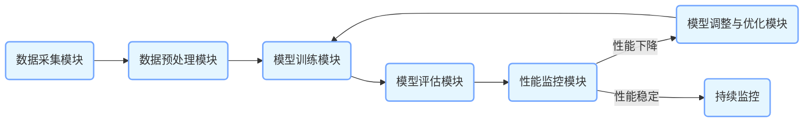

# AI驱动的企业信用评级模型性能监控系统

> 关键词：AI、企业信用评级模型、性能监控系统、机器学习、数据质量、模型评估

> 摘要：本文聚焦于AI驱动的企业信用评级模型性能监控系统，深入探讨其在企业信用评估领域的重要性和应用。首先介绍了该系统的背景，包括目的、预期读者等内容。接着阐述了核心概念与联系，呈现了系统的原理和架构。详细讲解了核心算法原理及具体操作步骤，借助Python代码进行说明。同时给出了相关数学模型和公式，并举例分析。通过项目实战展示了代码实现和解读。分析了实际应用场景，推荐了学习、开发等相关工具和资源。最后总结了未来发展趋势与挑战，还包含常见问题解答及扩展阅读等内容，旨在为相关领域的研究和实践提供全面且深入的参考。

## 1. 背景介绍 
### 1.1 目的和范围
在当今数字化经济时代，企业信用评级对于金融机构、投资者以及商业合作伙伴等都具有至关重要的意义。准确的信用评级能够帮助各方有效评估企业的信用风险，做出合理的决策。随着人工智能技术的快速发展，越来越多的企业开始采用AI驱动的信用评级模型来提高评级的准确性和效率。然而，这些模型在实际应用中可能会受到数据质量、模型漂移等多种因素的影响，导致模型性能下降。因此，开发一个AI驱动的企业信用评级模型性能监控系统具有重要的现实意义。

本系统的目的在于实时监测企业信用评级模型的性能，及时发现模型性能下降的情况，并采取相应的措施进行调整和优化。系统的范围涵盖了从数据采集、预处理、模型训练到模型评估和监控的整个流程，旨在确保企业信用评级模型始终保持良好的性能。

### 1.2 预期读者
本文的预期读者包括金融机构的风险管理人员、数据科学家、机器学习工程师、企业信用评估专家以及对AI技术在信用评级领域应用感兴趣的研究人员和从业人员。通过阅读本文，读者可以深入了解AI驱动的企业信用评级模型性能监控系统的原理、技术和应用，为实际工作和研究提供参考。

### 1.3 文档结构概述
本文将按照以下结构进行组织：
1. **背景介绍**：阐述系统的目的、预期读者和文档结构概述。
2. **核心概念与联系**：介绍企业信用评级模型、性能监控系统等核心概念及其相互关系，给出原理和架构的文本示意图和Mermaid流程图。
3. **核心算法原理 & 具体操作步骤**：详细讲解系统中涉及的核心算法原理，并使用Python源代码进行具体操作步骤的阐述。
4. **数学模型和公式 & 详细讲解 & 举例说明**：给出相关的数学模型和公式，并通过具体例子进行详细讲解。
5. **项目实战：代码实际案例和详细解释说明**：展示项目实战中的代码实现和详细解释，包括开发环境搭建、源代码实现和代码解读。
6. **实际应用场景**：分析AI驱动的企业信用评级模型性能监控系统在不同场景下的应用。
7. **工具和资源推荐**：推荐学习、开发等相关的工具和资源，包括书籍、在线课程、技术博客、IDE和编辑器、调试和性能分析工具、相关框架和库以及论文著作等。
8. **总结：未来发展趋势与挑战**：总结系统的未来发展趋势和面临的挑战。
9. **附录：常见问题与解答**：解答常见问题，帮助读者更好地理解和应用系统。
10. **扩展阅读 & 参考资料**：提供扩展阅读的内容和参考资料，方便读者进一步深入学习。

### 1.4 术语表
#### 1.4.1 核心术语定义
- **企业信用评级模型**：基于企业的各种数据，如财务数据、经营数据等，利用机器学习或深度学习算法构建的用于评估企业信用风险的模型。
- **性能监控系统**：用于实时监测模型性能指标，如准确率、召回率、F1值等，并及时发现模型性能变化的系统。
- **模型漂移**：由于数据分布的变化或其他因素导致模型性能随时间下降的现象。
- **数据质量**：指数据的准确性、完整性、一致性和及时性等方面的特征。

#### 1.4.2 相关概念解释
- **机器学习**：一门多领域交叉学科，涉及概率论、统计学、逼近论、凸分析、算法复杂度理论等多门学科。它专门研究计算机怎样模拟或实现人类的学习行为，以获取新的知识或技能，重新组织已有的知识结构使之不断改善自身的性能。
- **深度学习**：机器学习的一个分支领域，它是一种基于对数据进行表征学习的方法。深度学习通过构建具有很多层的神经网络模型，自动从数据中学习复杂的模式和特征。

#### 1.4.3 缩略词列表
- **AI**：Artificial Intelligence，人工智能
- **ML**：Machine Learning，机器学习
- **DL**：Deep Learning，深度学习
- **ROC**：Receiver Operating Characteristic，受试者工作特征曲线
- **AUC**：Area Under the Curve，曲线下面积

## 2. 核心概念与联系 
### 核心概念原理
企业信用评级模型是整个系统的核心，它通过对企业的多源数据进行分析和挖掘，学习企业的信用风险模式，从而对企业的信用等级进行评估。常见的企业信用评级模型包括逻辑回归、决策树、随机森林、支持向量机和深度学习模型等。

性能监控系统则是对企业信用评级模型的性能进行实时监测和评估的系统。它通过收集模型的输入数据、输出结果以及相关的性能指标，如准确率、召回率、F1值等，来判断模型的性能是否稳定。如果发现模型性能下降，系统会及时发出警报，并采取相应的措施进行调整和优化。

### 架构的文本示意图
AI驱动的企业信用评级模型性能监控系统主要由以下几个部分组成：
1. **数据采集模块**：负责收集企业的各种数据，如财务报表、经营数据、信用记录等。
2. **数据预处理模块**：对采集到的数据进行清洗、转换和归一化等处理，以提高数据质量。
3. **模型训练模块**：使用预处理后的数据对企业信用评级模型进行训练。
4. **模型评估模块**：对训练好的模型进行评估，计算模型的性能指标。
5. **性能监控模块**：实时监测模型的性能，发现模型性能下降时发出警报。
6. **模型调整与优化模块**：根据性能监控模块的反馈，对模型进行调整和优化。

### Mermaid流程图


## 3. 核心算法原理 & 具体操作步骤 
### 核心算法原理
在AI驱动的企业信用评级模型性能监控系统中，常用的算法包括逻辑回归、随机森林和深度学习算法等。下面以逻辑回归算法为例，详细介绍其原理。

逻辑回归是一种广义线性回归模型，用于解决二分类问题。它通过逻辑函数（也称为Sigmoid函数）将线性回归的输出映射到[0, 1]区间，从而得到样本属于某一类别的概率。

逻辑函数的表达式为：
$$\sigma(z)=\frac{1}{1 + e^{-z}}$$
其中，$z$ 是线性回归的输出，即：
$$z = w_0 + w_1x_1 + w_2x_2 + \cdots + w_nx_n$$
$w_0, w_1, \cdots, w_n$ 是模型的参数，$x_1, x_2, \cdots, x_n$ 是样本的特征。

逻辑回归的目标是找到一组最优的参数 $w$，使得模型的对数似然函数最大。对数似然函数的表达式为：
$$L(w)=\sum_{i=1}^{m}[y_i\log(\sigma(z_i))+(1 - y_i)\log(1 - \sigma(z_i))]$$
其中，$m$ 是样本的数量，$y_i$ 是第 $i$ 个样本的真实标签，$\sigma(z_i)$ 是第 $i$ 个样本的预测概率。

### 具体操作步骤
下面使用Python代码详细阐述逻辑回归算法的具体操作步骤。

```python
import numpy as np
from sklearn.datasets import make_classification
from sklearn.model_selection import train_test_split
from sklearn.linear_model import LogisticRegression
from sklearn.metrics import accuracy_score

# 生成示例数据
X, y = make_classification(n_samples=1000, n_features=10, n_informative=5, n_redundant=0, random_state=42)

# 划分训练集和测试集
X_train, X_test, y_train, y_test = train_test_split(X, y, test_size=0.2, random_state=42)

# 创建逻辑回归模型
model = LogisticRegression()

# 训练模型
model.fit(X_train, y_train)

# 预测测试集
y_pred = model.predict(X_test)

# 计算准确率
accuracy = accuracy_score(y_test, y_pred)
print(f"模型准确率: {accuracy}")
```

在上述代码中，首先使用 `make_classification` 函数生成示例数据，然后将数据划分为训练集和测试集。接着创建逻辑回归模型并使用训练集进行训练。最后使用测试集进行预测，并计算模型的准确率。

## 4. 数学模型和公式 & 详细讲解 & 举例说明 
### 数学模型和公式
在企业信用评级模型性能监控系统中，常用的性能评估指标包括准确率、召回率、F1值和ROC曲线下面积（AUC）等。下面详细介绍这些指标的数学模型和公式。

#### 准确率（Accuracy）
准确率是指模型预测正确的样本数占总样本数的比例，其计算公式为：
$$Accuracy=\frac{TP + TN}{TP + TN + FP + FN}$$
其中，$TP$ 表示真正例（True Positive），即模型预测为正例且实际为正例的样本数；$TN$ 表示真反例（True Negative），即模型预测为反例且实际为反例的样本数；$FP$ 表示假正例（False Positive），即模型预测为正例但实际为反例的样本数；$FN$ 表示假反例（False Negative），即模型预测为反例但实际为正例的样本数。

#### 召回率（Recall）
召回率是指模型预测为正例的样本中实际为正例的比例，其计算公式为：
$$Recall=\frac{TP}{TP + FN}$$

#### F1值（F1-Score）
F1值是准确率和召回率的调和平均数，其计算公式为：
$$F1 = 2\times\frac{Accuracy\times Recall}{Accuracy + Recall}$$

#### ROC曲线下面积（AUC）
ROC曲线是一种用于评估二分类模型性能的工具，它以假正例率（FPR）为横轴，真正例率（TPR）为纵轴绘制而成。AUC是ROC曲线下的面积，其取值范围为[0, 1]，AUC值越大，模型的性能越好。

### 详细讲解
准确率是一个简单直观的性能评估指标，但在数据不平衡的情况下，准确率可能会产生误导。例如，在一个二分类问题中，正例样本占总样本的比例非常小，如果模型总是预测为反例，那么准确率可能会很高，但实际上模型并没有很好地识别正例样本。

召回率则更关注模型对正例样本的识别能力，它反映了模型能够正确识别出多少正例样本。

F1值综合考虑了准确率和召回率，能够更全面地评估模型的性能。

ROC曲线和AUC则不依赖于具体的分类阈值，能够更客观地评估模型的性能。

### 举例说明
假设我们有一个二分类问题，模型的预测结果如下：
| 真实标签 | 预测标签 |
| ---- | ---- |
| 正例 | 正例 |
| 正例 | 反例 |
| 反例 | 反例 |
| 反例 | 正例 |
| 正例 | 正例 |

根据上述数据，我们可以计算出：
$TP = 2$，$TN = 1$，$FP = 1$，$FN = 1$

准确率：
$$Accuracy=\frac{2 + 1}{2 + 1 + 1 + 1}=\frac{3}{5}=0.6$$

召回率：
$$Recall=\frac{2}{2 + 1}=\frac{2}{3}\approx0.67$$

F1值：
$$F1 = 2\times\frac{0.6\times0.67}{0.6 + 0.67}\approx0.63$$

## 5. 项目实战：代码实际案例和详细解释说明 
### 5.1  开发环境搭建
在进行项目实战之前，需要搭建相应的开发环境。以下是搭建开发环境的步骤：
1. **安装Python**：建议使用Python 3.7及以上版本，可以从Python官方网站（https://www.python.org/downloads/）下载并安装。
2. **安装依赖库**：使用pip命令安装项目所需的依赖库，包括`numpy`、`pandas`、`scikit-learn`、`matplotlib`等。
```sh
pip install numpy pandas scikit-learn matplotlib
```

### 5.2  源代码详细实现和代码解读
下面是一个完整的企业信用评级模型性能监控系统的代码示例：

```python
import numpy as np
import pandas as pd
from sklearn.datasets import make_classification
from sklearn.model_selection import train_test_split
from sklearn.linear_model import LogisticRegression
from sklearn.metrics import accuracy_score, recall_score, f1_score, roc_auc_score
import matplotlib.pyplot as plt

# 生成示例数据
X, y = make_classification(n_samples=1000, n_features=10, n_informative=5, n_redundant=0, random_state=42)

# 划分训练集和测试集
X_train, X_test, y_train, y_test = train_test_split(X, y, test_size=0.2, random_state=42)

# 创建逻辑回归模型
model = LogisticRegression()

# 训练模型
model.fit(X_train, y_train)

# 预测测试集
y_pred = model.predict(X_test)
y_pred_proba = model.predict_proba(X_test)[:, 1]

# 计算性能指标
accuracy = accuracy_score(y_test, y_pred)
recall = recall_score(y_test, y_pred)
f1 = f1_score(y_test, y_pred)
auc = roc_auc_score(y_test, y_pred_proba)

# 打印性能指标
print(f"准确率: {accuracy}")
print(f"召回率: {recall}")
print(f"F1值: {f1}")
print(f"AUC值: {auc}")

# 绘制ROC曲线
from sklearn.metrics import roc_curve
fpr, tpr, thresholds = roc_curve(y_test, y_pred_proba)
plt.plot(fpr, tpr, label='ROC curve (area = %0.2f)' % auc)
plt.plot([0, 1], [0, 1], 'k--')
plt.xlim([0.0, 1.0])
plt.ylim([0.0, 1.05])
plt.xlabel('False Positive Rate')
plt.ylabel('True Positive Rate')
plt.title('Receiver operating characteristic example')
plt.legend(loc="lower right")
plt.show()
```

### 5.3  代码解读与分析
1. **数据生成**：使用`make_classification`函数生成示例数据，模拟企业信用评级的数据集。
2. **数据划分**：使用`train_test_split`函数将数据集划分为训练集和测试集，比例为80%和20%。
3. **模型训练**：创建逻辑回归模型并使用训练集进行训练。
4. **模型预测**：使用测试集进行预测，得到预测标签和预测概率。
5. **性能评估**：计算准确率、召回率、F1值和AUC值等性能指标。
6. **ROC曲线绘制**：使用`roc_curve`函数绘制ROC曲线，并显示AUC值。

通过以上步骤，我们可以实现一个简单的企业信用评级模型性能监控系统，并对模型的性能进行评估和可视化。

## 6. 实际应用场景 
### 金融机构风险管理
金融机构在进行贷款审批、投资决策等业务时，需要对企业的信用风险进行评估。AI驱动的企业信用评级模型性能监控系统可以帮助金融机构实时监测信用评级模型的性能，及时发现模型性能下降的情况，从而调整风险评估策略，降低信用风险。

### 商业合作伙伴选择
企业在选择商业合作伙伴时，需要了解合作伙伴的信用状况。通过使用企业信用评级模型性能监控系统，企业可以对潜在合作伙伴的信用进行评估，并实时监测评估模型的性能，确保评估结果的准确性和可靠性，从而选择合适的商业合作伙伴。

### 政府监管
政府部门在进行企业监管时，需要对企业的信用状况进行评估。企业信用评级模型性能监控系统可以帮助政府部门建立科学的信用评估体系，并实时监测评估模型的性能，提高监管效率和准确性。

## 7. 工具和资源推荐
### 7.1 学习资源推荐
#### 7.1.1 书籍推荐
- 《机器学习》（周志华著）：全面介绍了机器学习的基本概念、算法和应用，是机器学习领域的经典教材。
- 《深度学习》（Ian Goodfellow、Yoshua Bengio和Aaron Courville著）：深度学习领域的权威著作，系统介绍了深度学习的理论和实践。
- 《Python机器学习实战》（Sebastian Raschka著）：通过实际案例介绍了Python在机器学习中的应用，适合初学者学习。

#### 7.1.2 在线课程
- Coursera上的“机器学习”课程（Andrew Ng教授主讲）：经典的机器学习在线课程，内容全面，讲解详细。
- edX上的“深度学习”课程：由知名学者和专家授课，深入介绍了深度学习的原理和应用。
- 阿里云天池的“机器学习实战”课程：通过实际案例介绍了机器学习的应用，适合实践学习。

#### 7.1.3 技术博客和网站
- Medium：一个内容丰富的技术博客平台，有很多关于机器学习、人工智能的优质文章。
- Kaggle：一个数据科学竞赛平台，上面有很多关于机器学习、数据挖掘的案例和分享。
- 机器之心：专注于人工智能领域的资讯和技术分享，提供了很多有价值的信息。

### 7.2 开发工具框架推荐
#### 7.2.1 IDE和编辑器
- PyCharm：一款专业的Python集成开发环境，功能强大，适合开发Python项目。
- Jupyter Notebook：一个交互式的开发环境，适合进行数据探索和模型实验。
- Visual Studio Code：一款轻量级的代码编辑器，支持多种编程语言，有丰富的插件。

#### 7.2.2 调试和性能分析工具
- Py-Spy：一个用于Python代码性能分析的工具，可以帮助开发者找出性能瓶颈。
- cProfile：Python内置的性能分析工具，可以统计代码的执行时间和调用次数。
- TensorBoard：一个用于深度学习模型可视化和调试的工具，可以帮助开发者更好地理解模型的训练过程。

#### 7.2.3 相关框架和库
- Scikit-learn：一个简单易用的机器学习库，提供了各种机器学习算法和工具。
- TensorFlow：一个开源的深度学习框架，广泛应用于图像识别、自然语言处理等领域。
- PyTorch：一个开源的深度学习框架，具有动态图机制，适合快速开发和实验。

### 7.3 相关论文著作推荐
#### 7.3.1 经典论文
- 《Gradient-Based Learning Applied to Document Recognition》（Yann LeCun、Léon Bottou、Yoshua Bengio和Patrick Haffner著）：介绍了卷积神经网络在文档识别中的应用，是深度学习领域的经典论文。
- 《ImageNet Classification with Deep Convolutional Neural Networks》（Alex Krizhevsky、Ilya Sutskever和Geoffrey E. Hinton著）：介绍了AlexNet网络在ImageNet图像分类竞赛中的应用，开启了深度学习在计算机视觉领域的热潮。

#### 7.3.2 最新研究成果
- 关注顶级学术会议如NeurIPS、ICML、CVPR等的最新论文，了解AI驱动的企业信用评级模型性能监控系统的最新研究进展。

#### 7.3.3 应用案例分析
- 一些金融机构和企业的官方网站会发布关于企业信用评级模型应用的案例分析，可以参考学习。

## 8. 总结：未来发展趋势与挑战
### 未来发展趋势
1. **多模态数据融合**：未来的企业信用评级模型将不仅依赖于财务数据，还会融合企业的社交媒体数据、物联网数据等多模态数据，以更全面地评估企业的信用风险。
2. **深度学习的广泛应用**：深度学习模型具有强大的特征学习能力，未来将在企业信用评级模型中得到更广泛的应用，提高评级的准确性和效率。
3. **实时监控与自动化优化**：性能监控系统将实现实时监控和自动化优化，能够及时发现模型性能下降的情况，并自动调整模型参数或更新模型，确保模型始终保持良好的性能。
4. **可解释性增强**：随着AI技术的发展，人们对模型的可解释性要求越来越高。未来的企业信用评级模型将更加注重可解释性，以便用户更好地理解模型的决策过程。

### 挑战
1. **数据质量问题**：企业信用评级模型依赖于大量的数据，数据的质量直接影响模型的性能。然而，实际应用中数据可能存在缺失、错误、不一致等问题，如何提高数据质量是一个挑战。
2. **模型漂移问题**：由于市场环境、企业经营状况等因素的变化，数据分布可能会发生改变，导致模型性能下降。如何有效地检测和处理模型漂移是一个亟待解决的问题。
3. **隐私和安全问题**：企业信用评级模型涉及大量的企业敏感信息，如何确保数据的隐私和安全是一个重要的挑战。
4. **可解释性难题**：深度学习模型虽然具有强大的性能，但往往缺乏可解释性。如何在保证模型性能的前提下，提高模型的可解释性是一个挑战。

## 9. 附录：常见问题与解答
### 1. 如何选择合适的企业信用评级模型？
选择合适的企业信用评级模型需要考虑多个因素，如数据类型、数据规模、模型复杂度、可解释性等。一般来说，如果数据规模较小，可以选择简单的模型，如逻辑回归、决策树等；如果数据规模较大，可以选择复杂的模型，如深度学习模型。同时，还需要根据实际需求考虑模型的可解释性，例如在金融领域，可能需要选择可解释性较强的模型。

### 2. 如何处理数据不平衡问题？
数据不平衡是企业信用评级中常见的问题，可能会导致模型对少数类样本的识别能力较差。处理数据不平衡问题的方法有很多，如过采样、欠采样、调整分类阈值、使用代价敏感学习等。具体选择哪种方法需要根据数据的特点和模型的性能进行评估。

### 3. 如何检测模型漂移？
检测模型漂移的方法有很多，如统计检验、监测模型性能指标、监测数据分布变化等。可以定期对模型进行评估，比较不同时间点的模型性能指标，如果发现性能指标明显下降，可能存在模型漂移。同时，也可以监测数据的分布变化，如均值、方差等，如果数据分布发生明显变化，也可能导致模型漂移。

### 4. 如何提高模型的可解释性？
提高模型可解释性的方法有很多，如选择可解释性较强的模型，如逻辑回归、决策树等；使用特征重要性分析、局部解释方法等对模型的决策过程进行解释；将复杂模型与简单模型相结合，用简单模型解释复杂模型的决策结果等。

## 10. 扩展阅读 & 参考资料
### 扩展阅读
- 《人工智能：现代方法》（Stuart Russell和Peter Norvig著）：全面介绍了人工智能的基本概念、算法和应用，是人工智能领域的经典著作。
- 《数据挖掘：概念与技术》（Jiawei Han、Jian Pei和Jianying Yin著）：系统介绍了数据挖掘的基本概念、算法和应用，适合深入学习数据挖掘技术。

### 参考资料
- 周志华. 机器学习. 清华大学出版社, 2016.
- Ian Goodfellow, Yoshua Bengio, Aaron Courville. 深度学习. 人民邮电出版社, 2017.
- Sebastian Raschka. Python机器学习实战. 机械工业出版社, 2018.