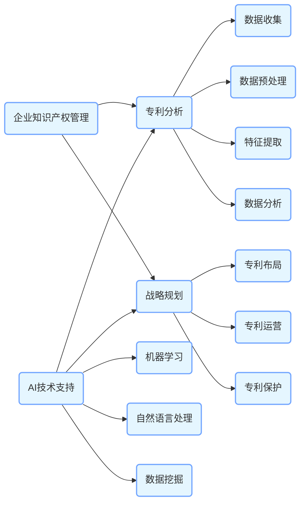

# AI驱动的企业知识产权管理：专利分析与战略规划

> 关键词：AI、企业知识产权管理、专利分析、战略规划、技术创新

> 摘要：本文聚焦于AI驱动的企业知识产权管理中的专利分析与战略规划。首先介绍了相关背景，包括目的、预期读者等内容。接着阐述了核心概念与联系，呈现了其原理和架构的文本示意图与流程图。详细讲解了核心算法原理，通过Python代码示例进行说明，并给出数学模型和公式，结合实例进行深入剖析。在项目实战部分，展示了开发环境搭建、源代码实现与解读。探讨了实际应用场景，推荐了学习资源、开发工具框架以及相关论文著作。最后总结未来发展趋势与挑战，解答常见问题并提供扩展阅读与参考资料，旨在为企业利用AI进行有效的知识产权管理和专利战略规划提供全面的技术指导和理论支持。

## 1. 背景介绍 
### 1.1 目的和范围
在当今竞争激烈的商业环境中，企业的知识产权尤其是专利资产已成为核心竞争力的关键组成部分。有效的专利管理不仅能够保护企业的创新成果，还能为企业的战略决策提供有力支持。本文章的目的在于探讨如何利用人工智能（AI）技术来优化企业的知识产权管理，特别是在专利分析和战略规划方面。范围涵盖了AI在专利数据挖掘、专利价值评估、专利布局规划等多个关键环节的应用，旨在帮助企业更好地理解和利用其专利资产，提升企业的创新能力和市场竞争力。

### 1.2 预期读者
本文预期读者主要包括企业的知识产权管理人员、技术创新人员、战略规划人员以及对AI和知识产权管理交叉领域感兴趣的研究人员和学者。对于企业管理人员来说，能够从中获取如何利用AI技术提升企业专利管理效率和质量的实用方法；对于技术人员，可以了解到AI在专利分析中的具体算法和实现细节；对于研究人员和学者，则能为其进一步的学术研究提供参考和启发。

### 1.3 文档结构概述
本文将按照以下结构进行阐述。首先介绍背景信息，让读者了解文章的目的、预期读者和文档的整体结构。接着阐述核心概念与联系，帮助读者建立起对AI驱动的企业知识产权管理中专利分析与战略规划的基本认知。然后详细讲解核心算法原理和具体操作步骤，通过Python代码示例进行说明。随后给出数学模型和公式，并结合实例进行详细讲解。在项目实战部分，将展示开发环境搭建、源代码实现与解读。之后探讨实际应用场景，让读者了解该技术在实际中的应用方式和效果。再推荐相关的学习资源、开发工具框架以及论文著作。最后总结未来发展趋势与挑战，解答常见问题并提供扩展阅读与参考资料。

### 1.4 术语表
#### 1.4.1 核心术语定义
- **人工智能（AI）**：是一门研究如何使计算机能够模拟人类智能的学科，包括机器学习、深度学习、自然语言处理等多种技术手段。
- **企业知识产权管理**：指企业对其拥有的知识产权进行全面、系统的管理，包括专利、商标、著作权等的申请、维护、运营和保护。
- **专利分析**：对专利数据进行收集、整理、挖掘和分析，以获取有关技术发展趋势、竞争对手动态、专利价值等信息的过程。
- **战略规划**：企业根据自身的发展目标和内外部环境，制定的关于知识产权管理和利用的长期计划和策略。

#### 1.4.2 相关概念解释
- **机器学习**：是AI的一个重要分支，通过让计算机从数据中学习模式和规律，从而实现预测、分类等任务。在专利分析中，机器学习可以用于专利文本分类、专利价值预测等。
- **自然语言处理（NLP）**：研究如何让计算机理解和处理人类语言的技术。在专利分析中，NLP可以用于专利文本的提取、关键词识别、语义分析等。
- **专利布局**：企业为了实现自身的战略目标，在技术领域、地域范围等方面对专利进行合理安排和部署的过程。

#### 1.4.3 缩略词列表
- **AI**：Artificial Intelligence（人工智能）
- **ML**：Machine Learning（机器学习）
- **NLP**：Natural Language Processing（自然语言处理）

## 2. 核心概念与联系 

### 核心概念原理
AI驱动的企业知识产权管理中的专利分析与战略规划主要基于以下原理。首先，利用AI技术可以对海量的专利数据进行高效的收集、整理和分析。专利数据包含了丰富的技术信息、市场信息和竞争信息，通过AI的机器学习和自然语言处理技术，可以从这些数据中挖掘出有价值的知识和模式。例如，通过对专利文本的语义分析，可以了解技术的发展趋势和热点领域；通过对专利的引用关系分析，可以评估专利的影响力和价值。

其次，基于挖掘出的信息，企业可以制定合理的专利战略规划。专利战略规划包括专利布局、专利运营、专利保护等多个方面。通过AI技术的支持，企业可以更加精准地进行专利布局，选择合适的技术领域和地域范围进行专利申请；可以更好地评估专利的价值，制定合理的专利运营策略，如专利转让、许可等；可以及时发现潜在的专利侵权风险，采取有效的专利保护措施。

### 架构的文本示意图
```plaintext
+---------------------+
| 企业知识产权管理   |
|                     |
| +----------------+  |
| | 专利分析       |  |
| |                |  |
| | 数据收集       |  |
| | 数据预处理     |  |
| | 特征提取       |  |
| | 数据分析       |  |
| +----------------+  |
|                     |
| +----------------+  |
| | 战略规划       |  |
| |                |  |
| | 专利布局       |  |
| | 专利运营       |  |
| | 专利保护       |  |
| +----------------+  |
|                     |
| +----------------+  |
| | AI技术支持     |  |
| |                |  |
| | 机器学习       |  |
| | 自然语言处理   |  |
| | 数据挖掘       |  |
| +----------------+  |
+---------------------+
```

### Mermaid流程图


## 3. 核心算法原理 & 具体操作步骤 

### 核心算法原理
在AI驱动的专利分析中，常用的算法包括文本分类算法、聚类算法、关联规则挖掘算法等。下面以文本分类算法为例进行详细讲解。

文本分类是将专利文本划分到不同的类别中，例如技术领域分类、专利类型分类等。常用的文本分类算法有朴素贝叶斯算法、支持向量机算法、深度学习算法等。这里以朴素贝叶斯算法为例，其基本原理是基于贝叶斯定理和特征条件独立假设的分类方法。

贝叶斯定理的公式为：
$$P(c|x)=\frac{P(x|c)P(c)}{P(x)}$$
其中，$P(c|x)$ 表示在特征 $x$ 出现的条件下类别 $c$ 发生的概率，$P(x|c)$ 表示在类别 $c$ 发生的条件下特征 $x$ 出现的概率，$P(c)$ 表示类别 $c$ 发生的先验概率，$P(x)$ 表示特征 $x$ 出现的概率。

在朴素贝叶斯算法中，假设特征之间是条件独立的，即：
$$P(x|c)=\prod_{i=1}^{n}P(x_i|c)$$
其中，$x=(x_1,x_2,\cdots,x_n)$ 是特征向量。

通过计算 $P(c|x)$ ，选择概率最大的类别作为分类结果。

### 具体操作步骤
1. **数据收集**：从专利数据库中收集相关的专利文本数据。
2. **数据预处理**：对收集到的专利文本进行清洗，去除噪声数据，如特殊字符、停用词等；进行分词处理，将文本拆分成一个个的词语。
3. **特征提取**：从预处理后的文本中提取特征，例如词频、词向量等。
4. **模型训练**：使用训练数据对朴素贝叶斯分类器进行训练，计算各类别的先验概率和条件概率。
5. **模型评估**：使用测试数据对训练好的模型进行评估，计算分类准确率、召回率等指标。
6. **分类预测**：使用训练好的模型对新的专利文本进行分类预测。

### Python源代码示例
```python
import numpy as np
from sklearn.feature_extraction.text import CountVectorizer
from sklearn.naive_bayes import MultinomialNB
from sklearn.model_selection import train_test_split
from sklearn.metrics import accuracy_score

# 示例专利文本数据
corpus = [
    "This patent is about a new type of battery technology.",
    "The invention focuses on improving the efficiency of solar cells.",
    "A novel method for data encryption is proposed in this patent.",
    "This is a patent related to software development techniques."
]
# 示例类别标签
labels = ["energy", "energy", "information", "information"]

# 数据预处理和特征提取
vectorizer = CountVectorizer()
X = vectorizer.fit_transform(corpus)

# 划分训练集和测试集
X_train, X_test, y_train, y_test = train_test_split(X, labels, test_size=0.2, random_state=42)

# 模型训练
clf = MultinomialNB()
clf.fit(X_train, y_train)

# 模型评估
y_pred = clf.predict(X_test)
accuracy = accuracy_score(y_test, y_pred)
print(f"分类准确率: {accuracy}")

# 分类预测
new_text = ["A new approach for battery charging is introduced."]
new_X = vectorizer.transform(new_text)
predicted_label = clf.predict(new_X)
print(f"预测类别: {predicted_label[0]}")
```

## 4. 数学模型和公式 & 详细讲解 & 举例说明 

### 数学模型和公式
在专利分析中，除了上述的朴素贝叶斯算法的数学模型，还有其他一些常用的数学模型和公式。例如，在专利价值评估中，可以使用层次分析法（AHP）来确定各个评估指标的权重。

层次分析法的基本步骤如下：
1. **建立层次结构模型**：将专利价值评估问题分解为目标层、准则层和方案层。
2. **构造判断矩阵**：对准则层的各个指标进行两两比较，构造判断矩阵 $A=(a_{ij})_{n\times n}$ ，其中 $a_{ij}$ 表示指标 $i$ 相对于指标 $j$ 的重要性程度。
3. **计算权重向量**：计算判断矩阵的最大特征值 $\lambda_{max}$ 和对应的特征向量 $W$ ，归一化后得到权重向量。
4. **一致性检验**：计算一致性指标 $CI=\frac{\lambda_{max}-n}{n - 1}$ ，并查找平均随机一致性指标 $RI$ ，计算一致性比率 $CR=\frac{CI}{RI}$ 。当 $CR<0.1$ 时，认为判断矩阵具有满意的一致性。

### 详细讲解
以一个简单的专利价值评估为例，假设我们从技术价值、市场价值和法律价值三个方面来评估专利的价值，每个方面又包含若干子指标。

首先，建立层次结构模型：
- 目标层：专利价值
- 准则层：技术价值、市场价值、法律价值
- 方案层：各个具体的子指标

然后，构造判断矩阵。例如，对于准则层的三个指标，我们进行两两比较得到判断矩阵：
$$A=\begin{bmatrix}
1 & 3 & 5 \\
\frac{1}{3} & 1 & 3 \\
\frac{1}{5} & \frac{1}{3} & 1
\end{bmatrix}$$

接着，计算判断矩阵的最大特征值 $\lambda_{max}$ 和对应的特征向量 $W$ 。通过计算可得 $\lambda_{max}=3.0385$ ，对应的特征向量 $W=(0.637, 0.258, 0.105)^T$ ，归一化后得到权重向量 $W=(0.637, 0.258, 0.105)$ 。

最后，进行一致性检验。$CI=\frac{\lambda_{max}-n}{n - 1}=\frac{3.0385 - 3}{3 - 1}=0.01925$ ，查找 $RI$ 表可知 $RI = 0.58$ ，$CR=\frac{CI}{RI}=\frac{0.01925}{0.58}=0.0332<0.1$ ，判断矩阵具有满意的一致性。

### 举例说明
假设我们有一个专利，对于技术价值、市场价值和法律价值三个方面的评分分别为 80 分、70 分和 60 分。根据上述计算得到的权重向量，该专利的综合价值得分可以计算为：
$$80\times0.637 + 70\times0.258 + 60\times0.105 = 75.1$$

## 5. 项目实战：代码实际案例和详细解释说明 

### 5.1  开发环境搭建
- **操作系统**：推荐使用 Linux 或 macOS 系统，也可以使用 Windows 系统。
- **Python 版本**：建议使用 Python 3.7 及以上版本。
- **开发工具**：可以使用 PyCharm、Jupyter Notebook 等开发工具。
- **依赖库安装**：使用以下命令安装所需的依赖库：
```sh
pip install numpy scikit-learn pandas matplotlib
```

### 5.2  源代码详细实现和代码解读
以下是一个完整的专利文本分类和专利价值评估的项目示例。

```python
import numpy as np
import pandas as pd
from sklearn.feature_extraction.text import TfidfVectorizer
from sklearn.naive_bayes import MultinomialNB
from sklearn.model_selection import train_test_split
from sklearn.metrics import accuracy_score
from sklearn.preprocessing import StandardScaler
from sklearn.linear_model import LinearRegression

# 专利文本分类部分
# 读取专利文本数据和类别标签
data = pd.read_csv('patent_data.csv')
corpus = data['text'].tolist()
labels = data['label'].tolist()

# 数据预处理和特征提取
vectorizer = TfidfVectorizer()
X = vectorizer.fit_transform(corpus)

# 划分训练集和测试集
X_train, X_test, y_train, y_test = train_test_split(X, labels, test_size=0.2, random_state=42)

# 模型训练
clf = MultinomialNB()
clf.fit(X_train, y_train)

# 模型评估
y_pred = clf.predict(X_test)
accuracy = accuracy_score(y_test, y_pred)
print(f"专利文本分类准确率: {accuracy}")

# 专利价值评估部分
# 读取专利特征数据和价值标签
feature_data = pd.read_csv('patent_features.csv')
X_features = feature_data.drop('value', axis=1).values
y_value = feature_data['value'].values

# 数据标准化
scaler = StandardScaler()
X_features = scaler.fit_transform(X_features)

# 划分训练集和测试集
X_train_features, X_test_features, y_train_value, y_test_value = train_test_split(X_features, y_value, test_size=0.2, random_state=42)

# 模型训练
regressor = LinearRegression()
regressor.fit(X_train_features, y_train_value)

# 模型评估
y_pred_value = regressor.predict(X_test_features)
from sklearn.metrics import mean_squared_error
mse = mean_squared_error(y_test_value, y_pred_value)
print(f"专利价值评估均方误差: {mse}")
```

### 5.3  代码解读与分析
- **专利文本分类部分**：
  - 首先，使用 `pandas` 库读取专利文本数据和类别标签。
  - 然后，使用 `TfidfVectorizer` 进行数据预处理和特征提取，将文本转换为向量表示。
  - 接着，使用 `train_test_split` 函数将数据划分为训练集和测试集。
  - 之后，使用 `MultinomialNB` 朴素贝叶斯分类器进行模型训练。
  - 最后，使用 `accuracy_score` 函数评估模型的分类准确率。

- **专利价值评估部分**：
  - 读取专利特征数据和价值标签。
  - 使用 `StandardScaler` 对特征数据进行标准化处理。
  - 划分训练集和测试集。
  - 使用 `LinearRegression` 线性回归模型进行模型训练。
  - 使用 `mean_squared_error` 函数评估模型的均方误差。

## 6. 实际应用场景 
### 技术研发决策支持
企业可以利用AI进行专利分析，了解技术领域的发展趋势和热点方向。通过对大量专利数据的挖掘和分析，企业可以发现潜在的技术创新点，为研发部门提供决策支持。例如，在新能源汽车领域，通过分析相关专利，可以了解到电池技术、自动驾驶技术等方面的最新进展，企业可以根据这些信息调整研发方向，加大对关键技术的研发投入。

### 专利布局规划
AI技术可以帮助企业进行更加精准的专利布局。通过对专利数据的地理分布、技术领域分布等进行分析，企业可以选择合适的地域和技术领域进行专利申请。例如，企业可以根据目标市场的专利情况，在专利保护力度较强、市场需求较大的地区进行专利布局，提高专利的保护效果和商业价值。

### 竞争对手分析
通过对竞争对手的专利进行分析，企业可以了解竞争对手的技术实力、研发方向和市场策略。例如，分析竞争对手的专利申请数量、技术领域分布、专利引用情况等，可以判断竞争对手的研发重点和技术优势，从而制定相应的竞争策略，如加强技术研发、开展合作或进行专利规避等。

### 专利运营管理
AI可以辅助企业进行专利运营管理，包括专利转让、许可、质押等。通过对专利价值的评估和市场需求的分析，企业可以确定合适的专利运营策略。例如，对于高价值的专利，可以通过转让或许可的方式获取经济收益；对于具有潜力的专利，可以进行质押融资，为企业的发展提供资金支持。

## 7. 工具和资源推荐
### 7.1 学习资源推荐
#### 7.1.1 书籍推荐
- 《人工智能：一种现代的方法》：全面介绍了人工智能的基本概念、算法和应用，是学习人工智能的经典教材。
- 《Python机器学习》：详细讲解了Python在机器学习中的应用，包括各种机器学习算法的实现和案例分析。
- 《专利信息分析与利用》：专门介绍了专利信息分析的方法和技巧，对于理解专利分析的原理和实践具有重要的参考价值。

#### 7.1.2 在线课程
- Coursera 上的“机器学习”课程：由斯坦福大学的 Andrew Ng 教授授课，是学习机器学习的优质课程。
- edX 上的“人工智能基础”课程：系统介绍了人工智能的基础知识和技术。
- 中国大学MOOC上的“知识产权管理”课程：讲解了企业知识产权管理的相关理论和实践。

#### 7.1.3 技术博客和网站
- 机器之心：提供人工智能领域的最新技术动态和研究成果。
- 开源中国：包含大量的技术文章和开源项目，对于学习和实践具有参考价值。
- 国家知识产权局网站：可以获取专利数据和相关政策法规。

### 7.2 开发工具框架推荐
#### 7.2.1 IDE和编辑器
- PyCharm：是一款专门用于Python开发的集成开发环境，具有丰富的功能和插件，方便代码的编写、调试和管理。
- Jupyter Notebook：是一个交互式的开发环境，适合进行数据探索和模型实验。
- Visual Studio Code：是一款轻量级的代码编辑器，支持多种编程语言和插件，具有良好的扩展性。

#### 7.2.2 调试和性能分析工具
- PySnooper：可以方便地进行代码调试，输出函数的执行过程和变量的值。
- cProfile：是Python内置的性能分析工具，可以分析代码的执行时间和函数调用情况。
- TensorBoard：是TensorFlow的可视化工具，可用于深度学习模型的训练过程可视化和性能分析。

#### 7.2.3 相关框架和库
- Scikit-learn：是Python中常用的机器学习库，提供了丰富的机器学习算法和工具，方便进行模型训练和评估。
- TensorFlow：是一个开源的深度学习框架，广泛应用于图像识别、自然语言处理等领域。
- NLTK：是Python中用于自然语言处理的库，提供了各种自然语言处理工具和数据集。

### 7.3 相关论文著作推荐
#### 7.3.1 经典论文
- “A Machine Learning Approach to Patent Classification”：介绍了机器学习在专利分类中的应用方法和实验结果。
- “Patent Value Assessment: A Review of Methods and Empirical Evidence”：对专利价值评估的方法和实证研究进行了综述。
- “Using Text Mining to Analyze Patent Documents”：探讨了文本挖掘技术在专利文档分析中的应用。

#### 7.3.2 最新研究成果
- 关注顶级学术会议如 AAAI、IJCAI、KDD 等上发表的关于AI和知识产权管理的研究论文，了解最新的研究动态和技术进展。
- 查阅相关学术期刊如《Journal of Artificial Intelligence Research》、《Journal of Intellectual Property Management》等上的研究成果。

#### 7.3.3 应用案例分析
- 研究一些知名企业的专利管理案例，如苹果、华为等，了解它们在利用AI进行专利分析和战略规划方面的实践经验和成功做法。
- 参考一些咨询机构发布的专利管理报告和案例分析，获取行业的最佳实践和趋势分析。

## 8. 总结：未来发展趋势与挑战
### 未来发展趋势
- **智能化程度不断提高**：随着AI技术的不断发展，其在企业知识产权管理中的应用将更加智能化。例如，利用深度学习技术可以实现更加精准的专利文本理解和分析，自动生成专利战略规划建议。
- **与其他技术融合发展**：AI将与区块链、大数据等技术深度融合，为企业知识产权管理提供更加强大的支持。例如，区块链技术可以保证专利数据的安全性和不可篡改，大数据技术可以提供更丰富的专利数据资源。
- **跨领域应用拓展**：AI驱动的企业知识产权管理将不仅局限于传统的制造业和高科技产业，还将拓展到金融、医疗、文化等多个领域，为不同行业的企业提供个性化的知识产权管理解决方案。

### 挑战
- **数据质量和安全问题**：专利数据的质量直接影响AI分析的准确性和可靠性。同时，专利数据包含企业的核心机密信息，数据安全问题至关重要。如何保证数据的质量和安全是面临的重要挑战。
- **技术人才短缺**：AI技术和知识产权管理都是专业性较强的领域，需要既懂AI技术又懂知识产权管理的复合型人才。目前这类人才相对短缺，制约了AI在企业知识产权管理中的应用和发展。
- **法律和伦理问题**：AI在知识产权管理中的应用可能会带来一些法律和伦理问题，如专利侵权判定的准确性、算法的透明度和公正性等。如何解决这些问题，建立相应的法律和伦理规范，是需要关注的重要方面。

## 9. 附录：常见问题与解答
### 问题1：AI在专利分析中的准确性如何保证？
解答：保证AI在专利分析中的准确性需要从多个方面入手。首先，要确保数据的质量，对专利数据进行清洗和预处理，去除噪声数据。其次，选择合适的算法和模型，并进行充分的训练和优化。此外，还可以采用交叉验证、模型融合等方法提高模型的准确性。最后，对分析结果进行人工审核和验证，结合专家的经验和知识，提高分析结果的可靠性。

### 问题2：如何评估AI技术在企业知识产权管理中的应用效果？
解答：可以从多个维度评估AI技术在企业知识产权管理中的应用效果。在专利分析方面，可以评估分类准确率、召回率、价值评估的误差等指标。在战略规划方面，可以观察企业的专利布局是否更加合理、专利运营收益是否增加、专利保护效果是否提高等。还可以通过对比应用AI技术前后企业的创新能力、市场竞争力等方面的变化来综合评估应用效果。

### 问题3：企业在引入AI技术进行知识产权管理时需要注意什么？
解答：企业在引入AI技术进行知识产权管理时，需要注意以下几点。首先，要明确企业的需求和目标，选择适合企业实际情况的AI技术和解决方案。其次，要注重数据的管理和安全，建立完善的数据管理制度，采取有效的数据安全措施。此外，要加强对员工的培训，提高员工对AI技术和知识产权管理的认识和能力。最后，要关注法律和伦理问题，确保AI技术的应用符合相关法律法规和伦理规范。

## 10. 扩展阅读 & 参考资料
### 扩展阅读
- 《创新的艺术》：探讨了企业创新的方法和策略，对于理解企业知识产权管理与创新的关系具有启发作用。
- 《大数据时代》：介绍了大数据技术的发展和应用，为进一步了解AI与大数据在企业知识产权管理中的融合提供参考。

### 参考资料
- 国家知识产权局发布的相关政策法规和统计数据。
- 相关学术论文和研究报告，如 IEEE、ACM 等学术机构发表的论文。
- 咨询机构发布的行业研究报告和市场分析报告。