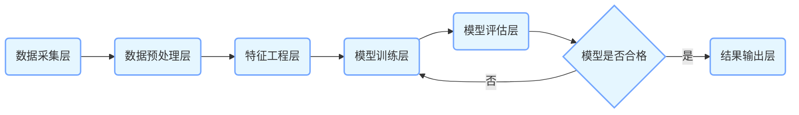

# AI驱动的企业财务报表质量评估系统

> 关键词：AI、企业财务报表、质量评估系统、数据分析、机器学习、深度学习、财务风险

> 摘要：本文围绕AI驱动的企业财务报表质量评估系统展开深入探讨。首先介绍了该系统提出的背景，明确其目的、范围、预期读者等。接着阐述了核心概念及相互联系，通过文本示意图和Mermaid流程图进行清晰展示。详细讲解了核心算法原理，用Python代码实现具体操作步骤。同时给出相关数学模型和公式，并举例说明。在项目实战部分，从开发环境搭建到源代码实现与解读进行了全面介绍。分析了该系统的实际应用场景，推荐了相关学习资源、开发工具框架以及论文著作。最后总结了未来发展趋势与挑战，还提供了常见问题解答和扩展阅读参考资料，旨在为企业财务报表质量评估提供一个基于AI的有效解决方案。

## 1. 背景介绍 
### 1.1 目的和范围
企业财务报表是反映企业财务状况和经营成果的重要文件，其质量直接关系到投资者、债权人、管理层等各方的决策。然而，传统的财务报表质量评估方法往往依赖于人工分析，存在效率低、主观性强等问题。AI驱动的企业财务报表质量评估系统的目的在于利用人工智能技术，提高财务报表质量评估的效率和准确性，减少人为因素的干扰。

本系统的范围涵盖了对企业财务报表中各项数据的收集、处理、分析和评估。包括资产负债表、利润表、现金流量表等主要财务报表，以及相关的附注和补充信息。通过对这些数据的深入挖掘和分析，系统能够评估财务报表的真实性、完整性、准确性和合规性等方面的质量。

### 1.2 预期读者
本文的预期读者包括企业财务管理人员、审计人员、投资者、金融分析师以及对人工智能在财务领域应用感兴趣的技术人员和研究人员。对于企业财务管理人员来说，该系统可以帮助他们更好地了解企业财务报表的质量，及时发现潜在的问题并进行改进。审计人员可以利用该系统提高审计效率和准确性，降低审计风险。投资者和金融分析师可以通过系统的评估结果，更准确地评估企业的财务状况和投资价值。技术人员和研究人员则可以从系统的实现原理和技术细节中获取灵感，推动人工智能在财务领域的进一步应用和发展。

### 1.3 文档结构概述
本文将按照以下结构进行阐述：首先介绍AI驱动的企业财务报表质量评估系统的背景，包括目的、范围、预期读者和文档结构概述等内容。接着详细讲解系统的核心概念与联系，通过文本示意图和Mermaid流程图进行展示。然后阐述核心算法原理和具体操作步骤，用Python代码实现。之后给出相关数学模型和公式，并举例说明。在项目实战部分，介绍开发环境搭建、源代码详细实现和代码解读。分析系统的实际应用场景，推荐相关学习资源、开发工具框架以及论文著作。最后总结未来发展趋势与挑战，提供常见问题解答和扩展阅读参考资料。

### 1.4 术语表
#### 1.4.1 核心术语定义
- **AI（Artificial Intelligence）**：人工智能，是研究、开发用于模拟、延伸和扩展人的智能的理论、方法、技术及应用系统的一门新的技术科学。
- **财务报表质量**：指财务报表所提供信息的真实性、完整性、准确性和合规性等方面的特征。
- **机器学习（Machine Learning）**：是一门多领域交叉学科，涉及概率论、统计学、逼近论、凸分析、算法复杂度理论等多门学科。它专门研究计算机怎样模拟或实现人类的学习行为，以获取新的知识或技能，重新组织已有的知识结构使之不断改善自身的性能。
- **深度学习（Deep Learning）**：是机器学习的一个分支领域，它是一种基于对数据进行表征学习的方法。深度学习通过构建具有很多层的神经网络模型，自动从大量数据中学习特征和模式。

#### 1.4.2 相关概念解释
- **数据挖掘**：是指从大量的数据中通过算法搜索隐藏于其中信息的过程。在财务报表质量评估中，数据挖掘可以帮助发现数据中的异常模式和潜在关系。
- **特征工程**：是指从原始数据中提取特征，并将其转换为适合机器学习算法处理的格式的过程。在财务报表质量评估系统中，特征工程可以帮助选择和提取与财务报表质量相关的关键特征。
- **模型评估**：是指对训练好的机器学习模型进行评估，以确定其性能和准确性的过程。常用的评估指标包括准确率、召回率、F1值等。

#### 1.4.3 缩略词列表
- **AI**：Artificial Intelligence（人工智能）
- **ML**：Machine Learning（机器学习）
- **DL**：Deep Learning（深度学习）
- **ROC**：Receiver Operating Characteristic（受试者工作特征曲线）
- **AUC**：Area Under the Curve（曲线下面积）

## 2. 核心概念与联系 

### 核心概念原理
AI驱动的企业财务报表质量评估系统主要基于机器学习和深度学习技术，通过对大量的财务报表数据进行学习和分析，构建评估模型。其核心原理是将财务报表中的各项数据作为输入特征，通过模型的训练和优化，输出对财务报表质量的评估结果。

在数据预处理阶段，需要对原始财务报表数据进行清洗、转换和归一化等操作，以提高数据的质量和可用性。在特征工程阶段，需要选择和提取与财务报表质量相关的关键特征，例如财务比率、趋势分析等。在模型训练阶段，选择合适的机器学习或深度学习算法，如决策树、支持向量机、神经网络等，对数据进行训练和优化。在模型评估阶段，使用测试数据对训练好的模型进行评估，以确定其性能和准确性。

### 架构的文本示意图
该系统主要包括数据采集层、数据预处理层、特征工程层、模型训练层、模型评估层和结果输出层。

- **数据采集层**：负责从企业的财务系统、数据库或其他数据源中采集财务报表数据。
- **数据预处理层**：对采集到的原始数据进行清洗、转换和归一化等操作，以提高数据的质量和可用性。
- **特征工程层**：选择和提取与财务报表质量相关的关键特征，例如财务比率、趋势分析等。
- **模型训练层**：选择合适的机器学习或深度学习算法，对数据进行训练和优化。
- **模型评估层**：使用测试数据对训练好的模型进行评估，以确定其性能和准确性。
- **结果输出层**：将评估结果以可视化的方式输出，例如报表、图表等。

### Mermaid流程图


## 3. 核心算法原理 & 具体操作步骤 

### 核心算法原理
在AI驱动的企业财务报表质量评估系统中，常用的机器学习算法包括决策树、支持向量机、神经网络等，深度学习算法包括卷积神经网络（CNN）、循环神经网络（RNN）等。这里以决策树算法为例进行详细讲解。

决策树是一种基于树结构进行决策的机器学习算法。它通过对数据的特征进行递归划分，构建一个决策树模型。每个内部节点表示一个特征上的测试，每个分支表示测试输出，每个叶节点表示一个类别或值。决策树的构建过程是一个递归的过程，其基本思想是选择一个最优的特征进行划分，使得划分后的子集尽可能地纯净。

### 具体操作步骤及Python源代码实现
以下是使用Python实现决策树算法进行财务报表质量评估的示例代码：

```python
import pandas as pd
from sklearn.model_selection import train_test_split
from sklearn.tree import DecisionTreeClassifier
from sklearn.metrics import accuracy_score

# 1. 数据加载
data = pd.read_csv('financial_statements.csv')

# 2. 数据预处理
# 假设数据集中最后一列是标签列
X = data.iloc[:, :-1]
y = data.iloc[:, -1]

# 3. 数据集划分
X_train, X_test, y_train, y_test = train_test_split(X, y, test_size=0.2, random_state=42)

# 4. 模型训练
model = DecisionTreeClassifier()
model.fit(X_train, y_train)

# 5. 模型预测
y_pred = model.predict(X_test)

# 6. 模型评估
accuracy = accuracy_score(y_test, y_pred)
print(f"模型准确率: {accuracy}")
```

### 代码解释
1. **数据加载**：使用`pandas`库的`read_csv`函数加载财务报表数据集。
2. **数据预处理**：将数据集划分为特征矩阵`X`和标签向量`y`。
3. **数据集划分**：使用`train_test_split`函数将数据集划分为训练集和测试集，测试集占比为20%。
4. **模型训练**：创建一个决策树分类器模型，并使用训练集数据进行训练。
5. **模型预测**：使用训练好的模型对测试集数据进行预测。
6. **模型评估**：使用`accuracy_score`函数计算模型的准确率。

## 4. 数学模型和公式 & 详细讲解 & 举例说明 

### 决策树的数学模型和公式
决策树的构建过程主要基于信息论中的信息增益（Information Gain）或基尼不纯度（Gini Impurity）等指标。

#### 信息增益
信息增益是指在划分数据集前后信息的变化量。信息的度量使用熵（Entropy）来表示。熵的计算公式为：

$$H(X) = -\sum_{i=1}^{n}p(x_i)\log_2p(x_i)$$

其中，$X$ 是一个随机变量，$p(x_i)$ 是 $x_i$ 出现的概率。

信息增益的计算公式为：

$$IG(S, A) = H(S) - \sum_{v\in Values(A)}\frac{|S_v|}{|S|}H(S_v)$$

其中，$S$ 是数据集，$A$ 是特征，$Values(A)$ 是特征 $A$ 的所有取值，$S_v$ 是在特征 $A$ 取值为 $v$ 时的子集。

#### 基尼不纯度
基尼不纯度是指从一个数据集中随机选取一个样本，将其错误分类的概率。基尼不纯度的计算公式为：

$$Gini(S) = 1 - \sum_{i=1}^{n}p(x_i)^2$$

在决策树的构建过程中，选择基尼不纯度最小的特征进行划分。

### 详细讲解
信息增益和基尼不纯度都是用来衡量划分数据集的好坏的指标。信息增益越大，说明划分后的子集越纯净；基尼不纯度越小，说明划分后的子集越纯净。在决策树的构建过程中，通过不断地选择最优的特征进行划分，使得决策树的每个节点所对应的子集尽可能地纯净。

### 举例说明
假设有一个数据集 $S$ 包含 10 个样本，其中 6 个样本属于类别 1，4 个样本属于类别 2。则数据集 $S$ 的熵为：

$$H(S) = -\frac{6}{10}\log_2\frac{6}{10} - \frac{4}{10}\log_2\frac{4}{10} \approx 0.971$$

假设现在有一个特征 $A$，其取值为 $v_1$ 和 $v_2$。在特征 $A$ 取值为 $v_1$ 时，子集 $S_{v_1}$ 包含 4 个样本，其中 3 个样本属于类别 1，1 个样本属于类别 2；在特征 $A$ 取值为 $v_2$ 时，子集 $S_{v_2}$ 包含 6 个样本，其中 3 个样本属于类别 1，3 个样本属于类别 2。则子集 $S_{v_1}$ 的熵为：

$$H(S_{v_1}) = -\frac{3}{4}\log_2\frac{3}{4} - \frac{1}{4}\log_2\frac{1}{4} \approx 0.811$$

子集 $S_{v_2}$ 的熵为：

$$H(S_{v_2}) = -\frac{3}{6}\log_2\frac{3}{6} - \frac{3}{6}\log_2\frac{3}{6} = 1$$

则特征 $A$ 的信息增益为：

$$IG(S, A) = H(S) - \frac{4}{10}H(S_{v_1}) - \frac{6}{10}H(S_{v_2}) \approx 0.971 - \frac{4}{10} \times 0.811 - \frac{6}{10} \times 1 \approx 0.126$$

## 5. 项目实战：代码实际案例和详细解释说明 

### 5.1  开发环境搭建
#### 操作系统
本项目可以在Windows、Linux或macOS等操作系统上进行开发。

#### 编程语言
使用Python作为开发语言，建议使用Python 3.6及以上版本。

#### 开发工具
可以使用PyCharm、Jupyter Notebook等开发工具。

#### 依赖库安装
使用以下命令安装项目所需的依赖库：

```sh
pip install pandas scikit-learn matplotlib
```

### 5.2  源代码详细实现和代码解读
以下是一个完整的AI驱动的企业财务报表质量评估系统的Python代码示例：

```python
import pandas as pd
from sklearn.model_selection import train_test_split
from sklearn.tree import DecisionTreeClassifier
from sklearn.metrics import accuracy_score, classification_report, confusion_matrix
import matplotlib.pyplot as plt
import seaborn as sns

# 1. 数据加载
data = pd.read_csv('financial_statements.csv')

# 2. 数据预处理
# 检查缺失值
print(data.isnull().sum())

# 处理缺失值
data = data.dropna()

# 假设数据集中最后一列是标签列
X = data.iloc[:, :-1]
y = data.iloc[:, -1]

# 3. 数据集划分
X_train, X_test, y_train, y_test = train_test_split(X, y, test_size=0.2, random_state=42)

# 4. 模型训练
model = DecisionTreeClassifier()
model.fit(X_train, y_train)

# 5. 模型预测
y_pred = model.predict(X_test)

# 6. 模型评估
accuracy = accuracy_score(y_test, y_pred)
print(f"模型准确率: {accuracy}")

# 分类报告
print("分类报告:")
print(classification_report(y_test, y_pred))

# 混淆矩阵
conf_matrix = confusion_matrix(y_test, y_pred)
plt.figure(figsize=(8, 6))
sns.heatmap(conf_matrix, annot=True, fmt='d', cmap='Blues')
plt.xlabel('预测标签')
plt.ylabel('真实标签')
plt.title('混淆矩阵')
plt.show()
```

### 5.3  代码解读与分析
1. **数据加载**：使用`pandas`库的`read_csv`函数加载财务报表数据集。
2. **数据预处理**：
    - 检查数据集中的缺失值，并使用`dropna`函数删除包含缺失值的行。
    - 将数据集划分为特征矩阵`X`和标签向量`y`。
3. **数据集划分**：使用`train_test_split`函数将数据集划分为训练集和测试集，测试集占比为20%。
4. **模型训练**：创建一个决策树分类器模型，并使用训练集数据进行训练。
5. **模型预测**：使用训练好的模型对测试集数据进行预测。
6. **模型评估**：
    - 使用`accuracy_score`函数计算模型的准确率。
    - 使用`classification_report`函数生成分类报告，包括精确率、召回率、F1值等指标。
    - 使用`confusion_matrix`函数生成混淆矩阵，并使用`seaborn`库的`heatmap`函数进行可视化。

通过以上步骤，可以实现一个简单的AI驱动的企业财务报表质量评估系统，并对模型的性能进行评估。

## 6. 实际应用场景 
### 企业内部财务管理
企业内部的财务管理人员可以使用AI驱动的企业财务报表质量评估系统，对企业的财务报表进行实时监控和评估。通过系统的评估结果，财务管理人员可以及时发现财务报表中存在的问题，如数据错误、财务造假等，采取相应的措施进行整改，提高企业财务管理的效率和质量。

### 审计工作
审计人员在进行审计工作时，可以利用该系统对企业的财务报表进行全面、深入的分析。系统可以帮助审计人员快速发现财务报表中的异常模式和潜在风险，提高审计效率和准确性，降低审计风险。

### 投资者决策
投资者在进行投资决策时，需要对企业的财务状况进行评估。AI驱动的企业财务报表质量评估系统可以为投资者提供客观、准确的财务报表质量评估结果，帮助投资者更好地了解企业的财务状况和投资价值，做出更加明智的投资决策。

### 金融监管
金融监管机构可以使用该系统对企业的财务报表进行监管，及时发现企业的财务违规行为，维护金融市场的稳定和健康发展。

## 7. 工具和资源推荐
### 7.1 学习资源推荐
#### 7.1.1 书籍推荐
- 《Python机器学习》：本书详细介绍了Python在机器学习领域的应用，包括数据预处理、特征工程、模型训练和评估等方面的内容。
- 《深度学习》：由深度学习领域的三位先驱Ian Goodfellow、Yoshua Bengio和Aaron Courville撰写，是深度学习领域的经典教材。
- 《财务报表分析》：本书系统地介绍了财务报表分析的方法和技巧，对于理解企业财务报表的质量评估有很大的帮助。

#### 7.1.2 在线课程
- Coursera上的“机器学习”课程：由斯坦福大学的Andrew Ng教授授课，是机器学习领域的经典课程。
- edX上的“深度学习基础”课程：由微软和华盛顿大学联合推出，介绍了深度学习的基本概念和方法。
- 中国大学MOOC上的“财务报表分析”课程：由国内知名高校的教授授课，系统地介绍了财务报表分析的理论和实践。

#### 7.1.3 技术博客和网站
- Medium：是一个技术博客平台，上面有很多关于人工智能和财务领域的文章。
- Kaggle：是一个数据科学竞赛平台，上面有很多关于财务数据分析和机器学习的案例和教程。
- 知乎：是一个知识分享平台，上面有很多关于人工智能和财务领域的讨论和经验分享。

### 7.2 开发工具框架推荐
#### 7.2.1 IDE和编辑器
- PyCharm：是一款专门为Python开发设计的集成开发环境，具有强大的代码编辑、调试和自动完成等功能。
- Jupyter Notebook：是一个交互式的开发环境，适合进行数据探索和模型实验。
- Visual Studio Code：是一款轻量级的代码编辑器，支持多种编程语言和插件，具有良好的扩展性。

#### 7.2.2 调试和性能分析工具
- Py-Spy：是一个Python性能分析工具，可以帮助开发者找出Python代码中的性能瓶颈。
- PDB：是Python自带的调试器，可以帮助开发者调试Python代码。
- TensorBoard：是TensorFlow的可视化工具，可以帮助开发者可视化模型的训练过程和性能指标。

#### 7.2.3 相关框架和库
- Scikit-learn：是一个常用的机器学习库，提供了丰富的机器学习算法和工具，如分类、回归、聚类等。
- TensorFlow：是一个开源的深度学习框架，由Google开发，广泛应用于图像识别、自然语言处理等领域。
- PyTorch：是一个开源的深度学习框架，由Facebook开发，具有动态图和易于使用的特点。

### 7.3 相关论文著作推荐
#### 7.3.1 经典论文
- “A Decision Tree Approach to Financial Statement Fraud Detection”：该论文提出了一种基于决策树的财务报表欺诈检测方法。
- “Deep Learning for Financial Forecasting”：该论文介绍了深度学习在财务预测中的应用。
- “Machine Learning in Accounting, Auditing, and Finance”：该论文综述了机器学习在会计、审计和金融领域的应用。

#### 7.3.2 最新研究成果
- 关注顶级学术会议，如ACM SIGKDD、IEEE ICDM等，这些会议上会有很多关于人工智能和财务领域的最新研究成果。
- 关注顶级学术期刊，如《Journal of Financial Economics》、《The Accounting Review》等，这些期刊上会发表很多关于财务领域的高质量研究论文。

#### 7.3.3 应用案例分析
- 可以参考一些知名企业或机构的应用案例，如四大会计师事务所的审计案例、大型企业的财务管理案例等，了解AI驱动的企业财务报表质量评估系统在实际应用中的效果和经验。

## 8. 总结：未来发展趋势与挑战
### 未来发展趋势
- **多技术融合**：未来的AI驱动的企业财务报表质量评估系统将融合更多的技术，如自然语言处理、图像识别、区块链等。例如，通过自然语言处理技术对财务报表中的文本信息进行分析，通过图像识别技术对财务报表中的图表和凭证进行识别，通过区块链技术保证财务数据的真实性和不可篡改。
- **智能化决策支持**：系统将不仅仅是提供财务报表质量的评估结果，还将为企业的决策提供智能化的支持。例如，根据评估结果提供针对性的建议和解决方案，帮助企业优化财务管理策略。
- **实时监测和预警**：随着数据采集和处理技术的不断发展，系统将实现对企业财务报表的实时监测和预警。及时发现财务风险和异常情况，为企业的风险管理提供有力支持。

### 挑战
- **数据质量问题**：财务报表数据的质量直接影响系统的评估结果。然而，实际应用中，财务报表数据可能存在缺失、错误、不一致等问题，需要进行有效的数据预处理和清洗。
- **模型可解释性**：机器学习和深度学习模型往往是黑盒模型，其决策过程难以解释。在财务领域，模型的可解释性尤为重要，因为财务决策需要有明确的依据。因此，如何提高模型的可解释性是一个亟待解决的问题。
- **法律法规和伦理问题**：AI技术在财务领域的应用涉及到法律法规和伦理问题，如数据隐私保护、算法歧视等。需要建立相应的法律法规和伦理准则，规范AI技术在财务领域的应用。

## 9. 附录：常见问题与解答
### 1. 如何选择合适的机器学习算法？
选择合适的机器学习算法需要考虑多个因素，如数据的特点、问题的类型、模型的复杂度等。一般来说，如果数据量较小，可以选择简单的算法，如决策树、逻辑回归等；如果数据量较大，可以选择复杂的算法，如神经网络、支持向量机等。此外，还可以通过交叉验证等方法对不同的算法进行比较和评估，选择性能最优的算法。

### 2. 如何处理数据中的缺失值？
处理数据中的缺失值有多种方法，常见的方法包括删除包含缺失值的行或列、使用均值、中位数或众数填充缺失值、使用机器学习算法预测缺失值等。具体选择哪种方法需要根据数据的特点和问题的类型来决定。

### 3. 如何提高模型的性能？
提高模型的性能可以从多个方面入手，如数据预处理、特征工程、模型选择和调优、模型融合等。在数据预处理阶段，需要对数据进行清洗、转换和归一化等操作，以提高数据的质量和可用性。在特征工程阶段，需要选择和提取与问题相关的关键特征，以提高模型的准确性和泛化能力。在模型选择和调优阶段，需要选择合适的模型，并通过交叉验证等方法对模型的参数进行优化。在模型融合阶段，可以将多个模型的预测结果进行融合，以提高模型的性能。

### 4. 如何评估模型的性能？
评估模型的性能可以使用多种指标，如准确率、召回率、F1值、ROC曲线、AUC等。具体选择哪种指标需要根据问题的类型和需求来决定。例如，在分类问题中，如果关注的是模型的整体准确性，可以使用准确率；如果关注的是模型对正类样本的识别能力，可以使用召回率；如果需要综合考虑准确率和召回率，可以使用F1值。

## 10. 扩展阅读 & 参考资料
### 扩展阅读
- 《人工智能：现代方法》：全面介绍了人工智能的基本概念、方法和技术，是人工智能领域的经典教材。
- 《数据挖掘：概念与技术》：详细介绍了数据挖掘的基本概念、算法和应用，对于理解数据挖掘在财务报表质量评估中的应用有很大的帮助。
- 《智能财务》：探讨了人工智能在财务领域的应用和发展趋势，对于了解AI驱动的企业财务报表质量评估系统的未来发展有重要的参考价值。

### 参考资料
- 相关学术论文和研究报告。
- 相关技术文档和官方网站。
- 相关书籍和在线课程。