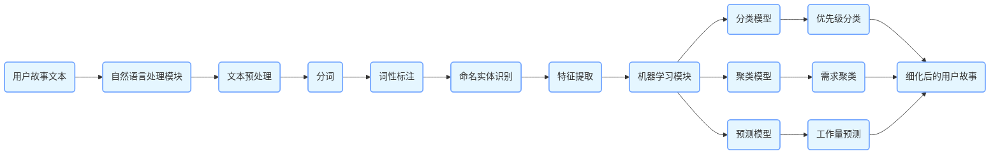

# AI驱动的用户故事细化:提高需求质量

> 关键词：AI、用户故事细化、需求质量、敏捷开发、自然语言处理、机器学习、需求工程

> 摘要：本文聚焦于AI驱动的用户故事细化，旨在探讨如何利用AI技术提高需求质量。首先介绍了用户故事细化在软件开发流程中的重要性以及相关背景知识，接着深入剖析了AI应用于用户故事细化的核心概念与联系，包括其原理和架构。详细阐述了核心算法原理，并结合Python代码进行说明，同时给出了相关数学模型和公式。通过项目实战案例，展示了AI驱动的用户故事细化的具体实现过程和代码解读。分析了该技术在不同场景下的实际应用，推荐了相关的学习资源、开发工具框架和论文著作。最后总结了其未来发展趋势与挑战，并提供了常见问题解答和扩展阅读参考资料，为相关领域的研究和实践提供全面而深入的指导。

## 1. 背景介绍 
### 1.1 目的和范围
在现代软件开发中，需求的准确获取和细化是项目成功的关键因素之一。用户故事作为敏捷开发中描述需求的重要工具，其质量直接影响到后续的开发、测试和交付过程。然而，传统的用户故事细化方式往往依赖于人工，存在效率低、主观性强、易遗漏等问题。本文章的目的在于探讨如何利用AI技术来辅助用户故事细化，提高需求质量，减少人为错误和不确定性。

本文的范围涵盖了AI在用户故事细化中的核心概念、算法原理、数学模型、实际应用案例等方面，旨在为读者提供全面的技术指导和实践参考。

### 1.2 预期读者
本文预期读者包括软件开发团队成员，如产品经理、需求分析师、开发人员、测试人员等，他们希望了解如何利用AI技术优化用户故事细化过程，提高需求质量。同时，对人工智能在软件工程领域应用感兴趣的研究人员、学者以及相关专业的学生也可以从本文中获取有价值的信息。

### 1.3 文档结构概述
本文将按照以下结构进行组织：
1. **背景介绍**：阐述文章的目的、范围、预期读者和文档结构，同时介绍相关术语和概念。
2. **核心概念与联系**：介绍AI驱动的用户故事细化的核心概念、原理和架构，并通过示意图和流程图进行说明。
3. **核心算法原理 & 具体操作步骤**：详细讲解AI在用户故事细化中使用的核心算法原理，并给出Python代码示例。
4. **数学模型和公式 & 详细讲解 & 举例说明**：介绍相关的数学模型和公式，并通过具体例子进行说明。
5. **项目实战：代码实际案例和详细解释说明**：通过一个实际项目案例，展示AI驱动的用户故事细化的具体实现过程和代码解读。
6. **实际应用场景**：分析AI驱动的用户故事细化在不同场景下的实际应用。
7. **工具和资源推荐**：推荐相关的学习资源、开发工具框架和论文著作。
8. **总结：未来发展趋势与挑战**：总结AI驱动的用户故事细化的未来发展趋势和面临的挑战。
9. **附录：常见问题与解答**：提供常见问题的解答。
10. **扩展阅读 & 参考资料**：提供扩展阅读材料和参考资料。

### 1.4 术语表
#### 1.4.1 核心术语定义
- **用户故事（User Story）**：是敏捷开发中用于描述需求的一种轻量级方式，通常以“作为[角色]，我想要[功能]，以便[价值]”的格式来表达。
- **用户故事细化（User Story Refinement）**：对用户故事进行详细分析、分解和完善的过程，以确保其清晰、可理解、可实现。
- **需求质量（Requirement Quality）**：指需求的完整性、准确性、一致性、可测试性等方面的特性。
- **AI（Artificial Intelligence）**：即人工智能，是研究、开发用于模拟、延伸和扩展人的智能的理论、方法、技术及应用系统的一门新的技术科学。
- **自然语言处理（Natural Language Processing，NLP）**：是AI的一个重要领域，主要研究如何让计算机理解和处理人类语言。
- **机器学习（Machine Learning，ML）**：是一门多领域交叉学科，涉及概率论、统计学、逼近论、凸分析、算法复杂度理论等多门学科。它专门研究计算机怎样模拟或实现人类的学习行为，以获取新的知识或技能，重新组织已有的知识结构使之不断改善自身的性能。

#### 1.4.2 相关概念解释
- **敏捷开发（Agile Development）**：是一种以人为核心、迭代、循序渐进的开发方法，强调快速响应变化和客户参与。
- **需求工程（Requirements Engineering）**：是一个不断反复的需求定义、文档记录、验证和管理的过程，旨在确保软件系统满足用户的需求。
- **故事点（Story Point）**：是敏捷开发中用于估算用户故事工作量的一种相对度量单位。

#### 1.4.3 缩略词列表
- **AI**：Artificial Intelligence
- **NLP**：Natural Language Processing
- **ML**：Machine Learning
- **SCRUM**：敏捷开发中的一种框架

## 2. 核心概念与联系 

### 核心概念原理
AI驱动的用户故事细化主要基于自然语言处理和机器学习技术。自然语言处理技术用于理解用户故事的文本内容，提取关键信息，如角色、功能、价值等。机器学习技术则用于对用户故事进行分类、聚类、预测等操作，帮助发现潜在的需求问题和改进建议。

其基本原理是将用户故事文本作为输入，通过一系列的自然语言处理和机器学习算法，对其进行分析和处理，输出细化后的用户故事和相关的需求信息。例如，可以使用命名实体识别技术识别用户故事中的角色和功能，使用文本分类技术判断用户故事的优先级和复杂度，使用机器学习模型预测用户故事的工作量和风险等。

### 架构示意图
下面是AI驱动的用户故事细化的架构示意图：



### 架构说明
1. **自然语言处理模块**：负责对用户故事文本进行预处理，包括分词、词性标注、命名实体识别等操作，提取文本的关键信息。
2. **机器学习模块**：利用提取的特征，使用分类、聚类、预测等模型对用户故事进行分析和处理。
3. **输出**：将分析结果整合，生成细化后的用户故事和相关的需求信息。

## 3. 核心算法原理 & 具体操作步骤 

### 核心算法原理
#### 命名实体识别（Named Entity Recognition，NER）
命名实体识别是自然语言处理中的一项重要任务，用于识别文本中的命名实体，如人名、地名、组织机构名、产品名等。在用户故事细化中，NER可以用于识别用户故事中的角色和功能。

常见的NER算法有基于规则的方法、基于统计的方法和基于深度学习的方法。基于深度学习的方法，如BiLSTM-CRF（双向长短期记忆网络 - 条件随机场），在NER任务中取得了很好的效果。

以下是一个使用Python和`flair`库实现的简单NER示例：

```python
from flair.data import Sentence
from flair.models import SequenceTagger

# 加载预训练的NER模型
tagger = SequenceTagger.load('ner')

# 定义用户故事文本
user_story = "作为一名用户，我想要查看我的订单信息，以便了解订单状态。"

# 创建句子对象
sentence = Sentence(user_story)

# 进行命名实体识别
tagger.predict(sentence)

# 输出识别结果
for entity in sentence.get_spans('ner'):
    print(entity)
```

#### 文本分类（Text Classification）
文本分类是将文本划分到不同类别的任务。在用户故事细化中，文本分类可以用于判断用户故事的优先级、复杂度等。

常见的文本分类算法有朴素贝叶斯、支持向量机、深度学习模型等。以下是一个使用Python和`scikit-learn`库实现的简单文本分类示例：

```python
from sklearn.feature_extraction.text import TfidfVectorizer
from sklearn.naive_bayes import MultinomialNB
from sklearn.pipeline import Pipeline

# 定义训练数据
train_texts = ["作为管理员，我想要删除用户账号，这是高优先级任务", "作为普通用户，我想要查看个人资料，这是低优先级任务"]
train_labels = ["高优先级", "低优先级"]

# 创建分类器管道
text_clf = Pipeline([
    ('tfidf', TfidfVectorizer()),
    ('clf', MultinomialNB()),
])

# 训练分类器
text_clf.fit(train_texts, train_labels)

# 定义测试数据
test_text = "作为游客，我想要注册账号，这是中优先级任务"

# 进行分类预测
predicted_label = text_clf.predict([test_text])

print("预测的优先级：", predicted_label[0])
```

### 具体操作步骤
1. **数据收集**：收集用户故事文本数据，包括历史用户故事和当前项目的用户故事。
2. **数据预处理**：对收集到的用户故事文本进行预处理，包括去除噪声、分词、词性标注等操作。
3. **特征提取**：从预处理后的文本中提取特征，如词向量、TF-IDF值等。
4. **模型训练**：使用提取的特征和标注好的数据，训练命名实体识别、文本分类、聚类等模型。
5. **用户故事细化**：将新的用户故事文本输入到训练好的模型中，进行分析和处理，生成细化后的用户故事和相关的需求信息。
6. **结果评估**：对细化后的用户故事和需求信息进行评估，根据评估结果调整模型和算法。

## 4. 数学模型和公式 & 详细讲解 & 举例说明 

### 命名实体识别的数学模型 - BiLSTM-CRF
#### BiLSTM（双向长短期记忆网络）
BiLSTM是一种递归神经网络，能够处理序列数据，通过同时考虑序列的前向和后向信息，更好地捕捉序列中的上下文信息。

设输入序列为 $x = (x_1, x_2, \cdots, x_T)$，其中 $x_t$ 表示第 $t$ 个时间步的输入向量。BiLSTM通过前向LSTM和后向LSTM分别计算前向隐藏状态 $\overrightarrow{h}_t$ 和后向隐藏状态 $\overleftarrow{h}_t$：

$$
\overrightarrow{h}_t = \text{LSTM}_{\text{forward}}(x_t, \overrightarrow{h}_{t - 1})
$$

$$
\overleftarrow{h}_t = \text{LSTM}_{\text{backward}}(x_t, \overleftarrow{h}_{t + 1})
$$

最终的隐藏状态 $h_t$ 是前向和后向隐藏状态的拼接：

$$
h_t = [\overrightarrow{h}_t; \overleftarrow{h}_t]
$$

#### CRF（条件随机场）
CRF是一种概率图模型，用于对序列进行标注。在NER中，CRF可以考虑相邻标签之间的依赖关系，从而提高标注的准确性。

设输入序列为 $x$，标签序列为 $y = (y_1, y_2, \cdots, y_T)$。CRF通过计算标签序列的得分 $s(x, y)$ 来进行标注：

$$
s(x, y) = \sum_{t = 1}^{T} \psi_t(y_{t - 1}, y_t, x)
$$

其中 $\psi_t(y_{t - 1}, y_t, x)$ 是特征函数，表示在第 $t$ 个时间步，从标签 $y_{t - 1}$ 转移到标签 $y_t$ 的得分。

最终的标注结果是使得得分 $s(x, y)$ 最大的标签序列 $y$：

$$
\hat{y} = \arg\max_{y} s(x, y)
$$

### 举例说明
假设我们有一个用户故事文本：“作为一名用户，我想要查看我的订单信息，以便了解订单状态。”

1. **BiLSTM计算隐藏状态**：将文本进行分词和词嵌入处理后，输入到BiLSTM中，计算每个词的隐藏状态。
2. **CRF进行标注**：使用CRF模型对隐藏状态进行标注，识别出“用户”为角色，“查看订单信息”为功能。

### 文本分类的数学模型 - 朴素贝叶斯
朴素贝叶斯是一种基于贝叶斯定理的分类算法，假设特征之间相互独立。

设输入文本为 $x = (x_1, x_2, \cdots, x_n)$，类别为 $C = \{c_1, c_2, \cdots, c_k\}$。朴素贝叶斯通过计算后验概率 $P(c_i|x)$ 来进行分类：

$$
P(c_i|x) = \frac{P(x|c_i)P(c_i)}{P(x)}
$$

根据贝叶斯定理和特征独立性假设，有：

$$
P(x|c_i) = \prod_{j = 1}^{n} P(x_j|c_i)
$$

最终的分类结果是使得后验概率 $P(c_i|x)$ 最大的类别 $c_i$：

$$
\hat{c} = \arg\max_{c_i} P(c_i|x)
$$

### 举例说明
假设我们有一个用户故事文本：“作为游客，我想要注册账号，这是中优先级任务”。

1. **特征提取**：使用TF-IDF方法提取文本的特征向量。
2. **计算后验概率**：根据训练好的朴素贝叶斯模型，计算该文本属于每个类别的后验概率。
3. **分类决策**：选择后验概率最大的类别作为预测结果，如“中优先级”。

## 5. 项目实战：代码实际案例和详细解释说明 

### 5.1  开发环境搭建
1. **安装Python**：建议使用Python 3.7及以上版本。
2. **安装必要的库**：使用`pip`安装以下库：
    - `flair`：用于命名实体识别。
    - `scikit-learn`：用于文本分类。
    - `pandas`：用于数据处理。
    - `numpy`：用于数值计算。

```bash
pip install flair scikit-learn pandas numpy
```

### 5.2  源代码详细实现和代码解读
以下是一个完整的AI驱动的用户故事细化的Python代码示例：

```python
import pandas as pd
from flair.data import Sentence
from flair.models import SequenceTagger
from sklearn.feature_extraction.text import TfidfVectorizer
from sklearn.naive_bayes import MultinomialNB
from sklearn.pipeline import Pipeline

# 加载预训练的NER模型
ner_tagger = SequenceTagger.load('ner')

# 定义训练数据
train_texts = ["作为管理员，我想要删除用户账号，这是高优先级任务", "作为普通用户，我想要查看个人资料，这是低优先级任务"]
train_labels = ["高优先级", "低优先级"]

# 创建分类器管道
text_clf = Pipeline([
    ('tfidf', TfidfVectorizer()),
    ('clf', MultinomialNB()),
])

# 训练分类器
text_clf.fit(train_texts, train_labels)

# 定义用户故事数据
user_stories = [
    "作为游客，我想要注册账号，以便开始使用服务",
    "作为会员，我想要修改个人信息，确保信息的准确性"
]

# 定义数据框来存储结果
results = pd.DataFrame(columns=['用户故事', '角色', '功能', '优先级'])

# 对每个用户故事进行处理
for user_story in user_stories:
    # 进行命名实体识别
    sentence = Sentence(user_story)
    ner_tagger.predict(sentence)
    roles = []
    functions = []
    for entity in sentence.get_spans('ner'):
        if entity.tag == 'PER':  # 假设角色为人物实体
            roles.append(entity.text)
        elif entity.tag == 'ORG':  # 假设功能为组织实体
            functions.append(entity.text)
    
    # 进行文本分类
    predicted_priority = text_clf.predict([user_story])[0]
    
    # 将结果添加到数据框中
    results = results.append({
        '用户故事': user_story,
        '角色': ', '.join(roles),
        '功能': ', '.join(functions),
        '优先级': predicted_priority
    }, ignore_index=True)

# 输出结果
print(results)
```

### 5.3  代码解读与分析
1. **数据加载和模型初始化**：加载预训练的NER模型和创建文本分类器管道，并使用训练数据对分类器进行训练。
2. **用户故事处理**：对每个用户故事进行命名实体识别，提取角色和功能信息，同时使用文本分类器预测其优先级。
3. **结果存储和输出**：将处理结果存储在数据框中，并输出到控制台。

通过这个代码示例，我们可以看到如何利用AI技术对用户故事进行细化，提取关键信息和预测优先级，从而提高需求质量。

## 6. 实际应用场景 
### 敏捷开发项目
在敏捷开发项目中，用户故事是需求的主要载体。AI驱动的用户故事细化可以帮助团队快速准确地理解用户需求，提高故事的质量和可实施性。例如，在每日站会或迭代计划会议中，团队成员可以使用AI工具对新的用户故事进行细化，确保每个故事都清晰、可估算、可测试。

### 大型软件系统开发
对于大型软件系统开发，需求往往非常复杂和庞大。AI技术可以帮助分析和整理海量的用户故事，发现潜在的需求冲突和遗漏，提高需求的一致性和完整性。例如，在需求评审阶段，使用AI工具对用户故事进行分类和聚类，以便更好地组织和管理需求。

### 跨团队协作项目
在跨团队协作项目中，不同团队对用户需求的理解可能存在差异。AI驱动的用户故事细化可以提供一个统一的需求理解框架，帮助团队成员更好地沟通和协作。例如，在跨部门的项目中，使用AI工具对用户故事进行翻译和解释，确保不同团队对需求的理解一致。

### 需求变更管理
在项目开发过程中，需求可能会发生变更。AI技术可以帮助快速评估需求变更的影响，对相关的用户故事进行更新和细化。例如，当用户提出新的需求或修改现有需求时，使用AI工具对相关的用户故事进行重新分类和优先级调整，确保项目能够及时响应需求变更。

## 7. 工具和资源推荐
### 7.1 学习资源推荐
#### 7.1.1 书籍推荐
- 《自然语言处理入门》：介绍了自然语言处理的基本概念、算法和应用，适合初学者。
- 《机器学习》：周志华著，全面介绍了机器学习的基本理论和算法。
- 《Python自然语言处理》：详细介绍了使用Python进行自然语言处理的方法和技术。

#### 7.1.2 在线课程
- Coursera上的“自然语言处理专项课程”：由顶尖大学的教授授课，系统介绍自然语言处理的各个方面。
- edX上的“机器学习基础”：提供了机器学习的基础知识和实践经验。
- 哔哩哔哩上的相关AI和NLP教程：有很多优质的免费教程，可以帮助学习者快速入门。

#### 7.1.3 技术博客和网站
- Medium：有很多关于AI和软件工程的技术博客，提供了最新的研究成果和实践经验。
- arXiv：一个预印本平台，包含了大量的AI和NLP相关的研究论文。
- 开源中国：提供了丰富的技术文章和开源项目资源。

### 7.2 开发工具框架推荐
#### 7.2.1 IDE和编辑器
- PyCharm：一款专业的Python集成开发环境，提供了丰富的功能和插件，方便开发和调试。
- Visual Studio Code：一款轻量级的代码编辑器，支持多种编程语言和插件扩展。

#### 7.2.2 调试和性能分析工具
- PySnooper：一个简单易用的Python调试工具，可以帮助开发者快速定位问题。
- cProfile：Python内置的性能分析工具，可以分析代码的运行时间和内存使用情况。

#### 7.2.3 相关框架和库
- NLTK：Python中常用的自然语言处理库，提供了丰富的语料库和工具。
- SpaCy：一个高效的自然语言处理库，支持多种语言和任务。
- TensorFlow和PyTorch：深度学习框架，可用于开发复杂的AI模型。

### 7.3 相关论文著作推荐
#### 7.3.1 经典论文
- "Attention Is All You Need"：介绍了Transformer架构，是自然语言处理领域的经典论文。
- "BERT: Pre-training of Deep Bidirectional Transformers for Language Understanding"：提出了BERT模型，在自然语言处理任务中取得了很好的效果。

#### 7.3.2 最新研究成果
- 关注ACL（Association for Computational Linguistics）、EMNLP（Conference on Empirical Methods in Natural Language Processing）等自然语言处理领域的顶级会议，了解最新的研究成果。

#### 7.3.3 应用案例分析
- 一些知名公司的技术博客，如Google AI Blog、Facebook AI Research等，会分享AI在实际应用中的案例和经验。

## 8. 总结：未来发展趋势与挑战
### 未来发展趋势
- **更智能的需求理解**：随着AI技术的不断发展，未来的用户故事细化工具将能够更深入地理解用户需求，自动发现潜在的需求问题和改进建议。
- **与其他工具的集成**：AI驱动的用户故事细化工具将与项目管理工具、开发工具等进行更紧密的集成，实现需求管理的自动化和智能化。
- **多语言支持**：随着全球化的发展，用户故事可能来自不同的语言和文化背景。未来的工具将支持多语言处理，提高需求管理的效率和准确性。
- **个性化需求分析**：根据用户的历史行为和偏好，提供个性化的需求分析和建议，更好地满足用户的需求。

### 挑战
- **数据质量和标注**：AI模型的性能很大程度上依赖于数据的质量和标注的准确性。如何获取高质量的用户故事数据，并进行有效的标注是一个挑战。
- **语义理解的局限性**：虽然自然语言处理技术取得了很大的进展，但在语义理解方面仍然存在局限性，尤其是对于一些复杂的用户故事和领域特定的术语。
- **模型的可解释性**：一些深度学习模型，如神经网络，往往是黑盒模型，其决策过程难以解释。在需求管理中，需要能够解释模型的决策结果，以便用户信任和接受。
- **隐私和安全问题**：用户故事中可能包含敏感信息，如用户的个人信息、业务机密等。如何在使用AI技术进行需求细化的过程中，保护用户的隐私和数据安全是一个重要的问题。

## 9. 附录：常见问题与解答
### 问题1：AI驱动的用户故事细化是否可以完全替代人工？
答：目前还不能完全替代人工。虽然AI技术可以帮助提高用户故事细化的效率和准确性，但在一些复杂的场景下，如需求的创造性思考、与用户的沟通等，仍然需要人工的参与。AI可以作为人工的辅助工具，提高需求管理的效率和质量。

### 问题2：如何选择合适的AI模型和算法？
答：选择合适的AI模型和算法需要考虑多个因素，如数据的特点、任务的复杂度、模型的性能和可解释性等。对于简单的任务，可以选择传统的机器学习算法，如朴素贝叶斯、支持向量机等；对于复杂的任务，可以选择深度学习模型，如BiLSTM、Transformer等。同时，需要进行实验和评估，选择最适合的模型和算法。

### 问题3：如何处理用户故事中的领域特定术语？
答：可以通过以下方法处理用户故事中的领域特定术语：
1. **构建领域词典**：收集和整理领域特定术语，构建领域词典，用于文本预处理和命名实体识别。
2. **训练领域特定模型**：使用领域特定的数据训练AI模型，提高模型对领域特定术语的识别和理解能力。
3. **人工标注和审核**：对于一些难以处理的领域特定术语，可以进行人工标注和审核，确保其准确性。

### 问题4：如何评估AI驱动的用户故事细化的效果？
答：可以从以下几个方面评估AI驱动的用户故事细化的效果：
1. **需求质量指标**：如需求的完整性、准确性、一致性、可测试性等。
2. **用户满意度**：通过用户反馈和调查，了解用户对细化后的需求的满意度。
3. **开发效率**：观察开发团队在处理细化后的需求时的效率和效果。
4. **模型性能指标**：如准确率、召回率、F1值等，评估AI模型的性能。

## 10. 扩展阅读 & 参考资料
### 扩展阅读
- 《敏捷软件开发：原则、模式与实践》：深入介绍了敏捷开发的原则和实践方法。
- 《需求工程——软件建模与分析》：系统介绍了需求工程的理论和方法。
- 《人工智能：现代方法》：全面介绍了人工智能的基本概念、算法和应用。

### 参考资料
1. Jurafsky, D., & Martin, J. H. (2022). Speech and Language Processing.
2. Goodfellow, I., Bengio, Y., & Courville, A. (2016). Deep Learning.
3. Beck, K., et al. (2001). Manifesto for Agile Software Development.