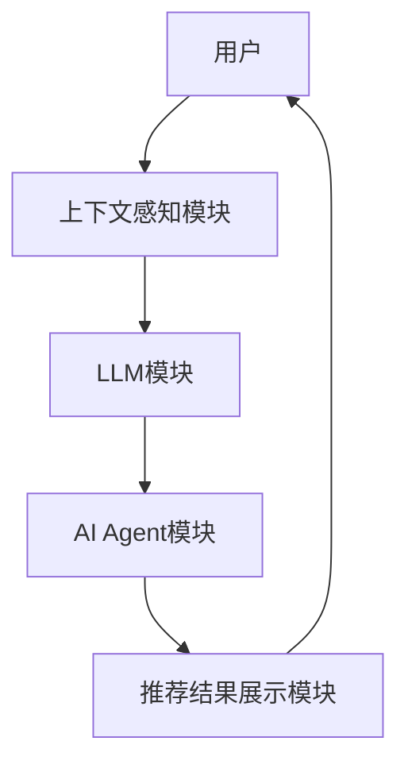

# LLM支持的AI Agent上下文感知推荐技术

> 关键词：LLM（大语言模型）、AI Agent（人工智能智能体）、上下文感知、推荐技术、自然语言处理、机器学习、智能推荐系统

> 摘要：本文聚焦于LLM支持的AI Agent上下文感知推荐技术，深入探讨其核心概念、算法原理、数学模型等内容。首先介绍了该技术的背景，包括目的、预期读者等信息。接着详细阐述了核心概念与联系，通过文本示意图和Mermaid流程图进行清晰展示。在算法原理部分，结合Python源代码进行讲解。数学模型和公式部分提供了理论支撑并举例说明。通过项目实战展示了代码实际案例及详细解释。分析了该技术的实际应用场景，推荐了相关的学习资源、开发工具框架以及论文著作。最后总结了未来发展趋势与挑战，提供了常见问题与解答以及扩展阅读和参考资料，旨在为读者全面呈现LLM支持的AI Agent上下文感知推荐技术的全貌。

## 1. 背景介绍 
### 1.1 目的和范围
随着信息技术的飞速发展，推荐系统在各个领域的应用越来越广泛。传统的推荐系统在处理复杂的用户需求和动态变化的环境时存在一定的局限性。LLM支持的AI Agent上下文感知推荐技术旨在利用大语言模型（LLM）的强大语言理解和生成能力，结合AI Agent的自主决策和交互能力，实现更加智能、个性化、上下文感知的推荐服务。

本技术的范围涵盖了多个领域，如电子商务、社交媒体、智能助手、内容推荐等。通过对用户当前的上下文信息（如历史行为、当前任务、环境状态等）进行感知和分析，为用户提供更加精准、符合其需求的推荐结果。

### 1.2 预期读者
本文的预期读者包括但不限于以下几类人群：
- **科研人员**：对人工智能、自然语言处理、推荐系统等领域的前沿技术感兴趣，希望深入了解LLM支持的AI Agent上下文感知推荐技术的原理和应用。
- **开发人员**：从事推荐系统开发、AI Agent开发、自然语言处理相关项目的程序员，希望学习如何将LLM和AI Agent技术应用到实际的推荐系统中。
- **企业管理者**：关注技术创新和业务发展，希望了解如何利用LLM支持的AI Agent上下文感知推荐技术提升企业的竞争力和用户体验。
- **学生**：学习计算机科学、人工智能、信息管理等相关专业的学生，希望通过本文了解该领域的最新技术和发展趋势。

### 1.3 文档结构概述
本文的结构如下：
- **核心概念与联系**：介绍LLM、AI Agent、上下文感知推荐技术的核心概念，并阐述它们之间的联系，通过文本示意图和Mermaid流程图进行展示。
- **核心算法原理 & 具体操作步骤**：详细讲解LLM支持的AI Agent上下文感知推荐技术的核心算法原理，并结合Python源代码进行具体操作步骤的说明。
- **数学模型和公式 & 详细讲解 & 举例说明**：给出该技术的数学模型和公式，对其进行详细讲解，并通过具体例子进行说明。
- **项目实战：代码实际案例和详细解释说明**：通过一个实际的项目案例，展示如何搭建开发环境、实现源代码，并对代码进行详细解读和分析。
- **实际应用场景**：分析LLM支持的AI Agent上下文感知推荐技术在不同领域的实际应用场景。
- **工具和资源推荐**：推荐相关的学习资源、开发工具框架以及论文著作，帮助读者进一步深入学习和研究该技术。
- **总结：未来发展趋势与挑战**：总结该技术的未来发展趋势，并分析面临的挑战。
- **附录：常见问题与解答**：提供常见问题的解答，帮助读者解决在学习和应用过程中遇到的问题。
- **扩展阅读 & 参考资料**：列出相关的扩展阅读材料和参考资料，方便读者进一步查阅。

### 1.4 术语表
#### 1.4.1 核心术语定义
- **LLM（Large Language Model）**：大语言模型，是一种基于深度学习的自然语言处理模型，通过在大规模文本数据上进行训练，学习语言的模式和规律，能够生成自然流畅的文本。
- **AI Agent（Artificial Intelligence Agent）**：人工智能智能体，是一种能够感知环境、自主决策并采取行动的智能实体。在推荐系统中，AI Agent可以根据用户的上下文信息和系统的推荐策略，为用户提供个性化的推荐服务。
- **上下文感知推荐技术**：一种推荐技术，通过对用户的上下文信息（如历史行为、当前任务、环境状态等）进行感知和分析，为用户提供更加精准、符合其需求的推荐结果。
- **推荐系统**：一种信息过滤系统，通过对用户的偏好和行为进行分析，为用户推荐相关的物品、内容或服务。

#### 1.4.2 相关概念解释
- **自然语言处理（Natural Language Processing，NLP）**：是人工智能的一个重要领域，研究如何让计算机理解和处理人类语言。LLM是自然语言处理中的一种重要技术，它可以用于文本生成、问答系统、机器翻译等任务。
- **机器学习（Machine Learning，ML）**：是一门多领域交叉学科，涉及概率论、统计学、逼近论、凸分析、算法复杂度理论等多门学科。它专门研究计算机怎样模拟或实现人类的学习行为，以获取新的知识或技能，重新组织已有的知识结构使之不断改善自身的性能。在推荐系统中，机器学习算法可以用于用户建模、物品建模、推荐算法设计等方面。
- **智能推荐系统**：是一种基于人工智能技术的推荐系统，它可以利用机器学习、自然语言处理等技术，对用户的偏好和行为进行分析，为用户提供更加智能、个性化的推荐服务。

#### 1.4.3 缩略词列表
- **LLM**：Large Language Model（大语言模型）
- **AI**：Artificial Intelligence（人工智能）
- **NLP**：Natural Language Processing（自然语言处理）
- **ML**：Machine Learning（机器学习）

## 2. 核心概念与联系 

### 核心概念原理

#### LLM（大语言模型）
大语言模型是基于Transformer架构的深度学习模型，通过在大规模的文本语料库上进行无监督学习，学习到语言的统计规律和语义信息。例如，GPT系列模型、BERT模型等。这些模型可以接受文本输入，并生成相关的文本输出，具有强大的语言理解和生成能力。

#### AI Agent（人工智能智能体）
AI Agent是一个具有感知、决策和行动能力的智能实体。它可以感知用户的上下文信息，如用户的历史行为、当前任务、环境状态等，并根据这些信息做出决策，采取相应的行动。在推荐系统中，AI Agent可以根据用户的上下文信息和系统的推荐策略，为用户推荐相关的物品、内容或服务。

#### 上下文感知推荐技术
上下文感知推荐技术是一种基于用户上下文信息的推荐技术。它通过对用户的上下文信息进行感知和分析，了解用户的当前需求和偏好，从而为用户提供更加精准、符合其需求的推荐结果。上下文信息可以包括用户的历史行为、当前任务、环境状态、时间、地点等。

### 架构的文本示意图

LLM支持的AI Agent上下文感知推荐技术的架构主要包括以下几个部分：

- **上下文感知模块**：负责感知用户的上下文信息，包括用户的历史行为、当前任务、环境状态等。这些信息可以通过用户的日志记录、传感器数据、用户输入等方式获取。
- **LLM模块**：接收上下文感知模块提供的上下文信息，并利用大语言模型的语言理解和生成能力，对上下文信息进行处理和分析。LLM可以生成与用户需求相关的文本描述，如推荐物品的介绍、推荐理由等。
- **AI Agent模块**：根据LLM模块提供的文本描述和系统的推荐策略，做出决策，选择合适的推荐物品或服务，并将推荐结果反馈给用户。
- **推荐结果展示模块**：将AI Agent模块生成的推荐结果展示给用户，如在网页上显示推荐的商品、在智能助手中语音播报推荐的内容等。

### Mermaid流程图



## 3. 核心算法原理 & 具体操作步骤 

### 核心算法原理

LLM支持的AI Agent上下文感知推荐技术的核心算法主要包括以下几个步骤：

1. **上下文信息收集**：通过各种方式收集用户的上下文信息，如用户的历史行为、当前任务、环境状态等。
2. **上下文信息预处理**：对收集到的上下文信息进行预处理，如清洗、归一化、特征提取等，以便后续的处理和分析。
3. **LLM处理**：将预处理后的上下文信息输入到LLM中，利用LLM的语言理解和生成能力，对上下文信息进行处理和分析，生成与用户需求相关的文本描述。
4. **AI Agent决策**：AI Agent根据LLM生成的文本描述和系统的推荐策略，做出决策，选择合适的推荐物品或服务。
5. **推荐结果生成**：将AI Agent选择的推荐物品或服务进行整理和格式化，生成最终的推荐结果，并展示给用户。

### 具体操作步骤（Python源代码）

以下是一个简单的Python示例代码，演示了LLM支持的AI Agent上下文感知推荐技术的基本操作步骤：

```python
# 模拟上下文信息收集
def collect_context_info():
    # 这里简单模拟收集用户的历史行为和当前任务信息
    user_history = ["购买过手机", "浏览过电脑"]
    current_task = "寻找一款适合办公的笔记本电脑"
    return user_history, current_task

# 模拟上下文信息预处理
def preprocess_context_info(user_history, current_task):
    # 这里简单将历史行为和当前任务信息合并
    context_info = user_history + [current_task]
    return context_info

# 模拟LLM处理
def llm_process(context_info):
    # 这里简单模拟LLM生成与用户需求相关的文本描述
    text_description = "用户有购买手机和浏览电脑的历史，当前正在寻找适合办公的笔记本电脑，推荐联想ThinkPad系列笔记本电脑。"
    return text_description

# 模拟AI Agent决策
def ai_agent_decision(text_description):
    # 这里简单根据LLM生成的文本描述选择推荐物品
    recommended_item = "联想ThinkPad X1 Carbon"
    return recommended_item

# 模拟推荐结果生成
def generate_recommendation_result(recommended_item):
    # 这里简单将推荐物品信息整理成最终的推荐结果
    recommendation_result = f"根据您的需求，为您推荐联想ThinkPad X1 Carbon笔记本电脑。"
    return recommendation_result

# 主函数
def main():
    # 收集上下文信息
    user_history, current_task = collect_context_info()
    # 预处理上下文信息
    context_info = preprocess_context_info(user_history, current_task)
    # LLM处理
    text_description = llm_process(context_info)
    # AI Agent决策
    recommended_item = ai_agent_decision(text_description)
    # 生成推荐结果
    recommendation_result = generate_recommendation_result(recommended_item)
    # 展示推荐结果
    print(recommendation_result)

if __name__ == "__main__":
    main()
```

### 代码解释

- `collect_context_info` 函数：模拟收集用户的历史行为和当前任务信息。
- `preprocess_context_info` 函数：将收集到的历史行为和当前任务信息合并，作为上下文信息。
- `llm_process` 函数：模拟LLM对上下文信息进行处理，生成与用户需求相关的文本描述。
- `ai_agent_decision` 函数：根据LLM生成的文本描述，选择合适的推荐物品。
- `generate_recommendation_result` 函数：将推荐物品信息整理成最终的推荐结果。
- `main` 函数：依次调用上述函数，完成上下文信息收集、预处理、LLM处理、AI Agent决策和推荐结果生成的整个流程，并展示推荐结果。

## 4. 数学模型和公式 & 详细讲解 & 举例说明 

### 数学模型

LLM支持的AI Agent上下文感知推荐技术的数学模型可以表示为一个多阶段的决策过程。设 $C$ 表示用户的上下文信息，$T$ 表示LLM生成的文本描述，$R$ 表示推荐结果。则整个推荐过程可以表示为以下几个步骤：

1. **上下文信息收集和预处理**：将用户的上下文信息 $C$ 进行收集和预处理，得到预处理后的上下文信息 $\hat{C}$。
2. **LLM处理**：将预处理后的上下文信息 $\hat{C}$ 输入到LLM中，生成文本描述 $T$。可以表示为 $T = f_{LLM}(\hat{C})$，其中 $f_{LLM}$ 表示LLM的处理函数。
3. **AI Agent决策**：AI Agent根据文本描述 $T$ 和系统的推荐策略，选择推荐结果 $R$。可以表示为 $R = f_{Agent}(T)$，其中 $f_{Agent}$ 表示AI Agent的决策函数。

### 公式详细讲解

- **上下文信息收集和预处理**：上下文信息 $C$ 可以表示为一个向量 $\mathbf{C} = [c_1, c_2, \cdots, c_n]$，其中 $c_i$ 表示第 $i$ 个上下文特征。预处理的过程可以包括特征选择、特征提取、特征归一化等操作，得到预处理后的上下文信息 $\hat{\mathbf{C}} = [\hat{c}_1, \hat{c}_2, \cdots, \hat{c}_m]$，其中 $m \leq n$。

- **LLM处理**：LLM的处理函数 $f_{LLM}$ 是一个复杂的深度学习模型，它将预处理后的上下文信息 $\hat{\mathbf{C}}$ 作为输入，通过多层神经网络的计算，生成文本描述 $T$。LLM的训练过程通常使用大规模的文本语料库进行无监督学习，学习语言的统计规律和语义信息。

- **AI Agent决策**：AI Agent的决策函数 $f_{Agent}$ 可以根据不同的推荐策略进行设计。例如，可以使用基于内容的推荐策略、协同过滤推荐策略、混合推荐策略等。在基于内容的推荐策略中，AI Agent根据文本描述 $T$ 中包含的物品特征，选择与用户需求最匹配的物品作为推荐结果。

### 举例说明

假设用户的上下文信息 $C$ 包括以下内容：
- 用户的历史行为：购买过手机、浏览过电脑
- 用户的当前任务：寻找一款适合办公的笔记本电脑

将这些上下文信息进行预处理后，得到预处理后的上下文信息 $\hat{C}$。将 $\hat{C}$ 输入到LLM中，LLM生成的文本描述 $T$ 为：“用户有购买手机和浏览电脑的历史，当前正在寻找适合办公的笔记本电脑，推荐联想ThinkPad系列笔记本电脑。”

AI Agent根据文本描述 $T$ 和系统的推荐策略，选择联想ThinkPad X1 Carbon作为推荐结果 $R$。

## 5. 项目实战：代码实际案例和详细解释说明 

### 5.1  开发环境搭建

#### 操作系统
本项目可以在Windows、Linux或macOS等主流操作系统上进行开发。建议使用Linux或macOS系统，因为它们对Python和相关开发工具的支持更好。

#### Python环境
本项目使用Python 3.7及以上版本。可以通过以下步骤安装Python：
1. 访问Python官方网站（https://www.python.org/downloads/），下载适合您操作系统的Python安装包。
2. 运行安装包，按照安装向导的提示进行安装。在安装过程中，建议勾选“Add Python to PATH”选项，以便在命令行中可以直接使用Python。

#### 依赖库安装
本项目需要安装以下依赖库：
- `transformers`：用于使用预训练的大语言模型。
- `numpy`：用于数值计算。
- `pandas`：用于数据处理和分析。

可以使用以下命令安装这些依赖库：
```sh
pip install transformers numpy pandas
```

### 5.2  源代码详细实现和代码解读

以下是一个完整的项目实战代码示例，演示了如何使用LLM支持的AI Agent上下文感知推荐技术实现一个简单的电影推荐系统：

```python
import pandas as pd
from transformers import AutoTokenizer, AutoModelForCausalLM

# 加载电影数据集
def load_movie_dataset():
    movie_data = pd.read_csv('movies.csv')
    return movie_data

# 加载预训练的大语言模型
def load_llm():
    tokenizer = AutoTokenizer.from_pretrained('gpt2')
    model = AutoModelForCausalLM.from_pretrained('gpt2')
    return tokenizer, model

# 模拟上下文信息收集
def collect_context_info():
    user_history = ["看过动作电影", "喜欢科幻电影"]
    current_task = "寻找一部好看的科幻电影"
    return user_history, current_task

# 预处理上下文信息
def preprocess_context_info(user_history, current_task):
    context_info = " ".join(user_history) + " " + current_task
    return context_info

# LLM处理
def llm_process(context_info, tokenizer, model):
    input_ids = tokenizer.encode(context_info, return_tensors='pt')
    output = model.generate(input_ids, max_length=100, num_return_sequences=1)
    text_description = tokenizer.decode(output[0], skip_special_tokens=True)
    return text_description

# AI Agent决策
def ai_agent_decision(text_description, movie_data):
    # 简单的决策逻辑：根据文本描述中提到的关键词，筛选电影数据集中的电影
    keywords = text_description.split()
    recommended_movies = []
    for index, row in movie_data.iterrows():
        movie_title = row['title']
        movie_genre = row['genre']
        for keyword in keywords:
            if keyword in movie_title or keyword in movie_genre:
                recommended_movies.append(movie_title)
                break
    return recommended_movies

# 推荐结果生成
def generate_recommendation_result(recommended_movies):
    if len(recommended_movies) == 0:
        recommendation_result = "很抱歉，没有找到符合您需求的电影。"
    else:
        recommendation_result = "根据您的需求，为您推荐以下电影："
        for movie in recommended_movies:
            recommendation_result += "\n- " + movie
    return recommendation_result

# 主函数
def main():
    # 加载电影数据集
    movie_data = load_movie_dataset()
    # 加载预训练的大语言模型
    tokenizer, model = load_llm()
    # 收集上下文信息
    user_history, current_task = collect_context_info()
    # 预处理上下文信息
    context_info = preprocess_context_info(user_history, current_task)
    # LLM处理
    text_description = llm_process(context_info, tokenizer, model)
    # AI Agent决策
    recommended_movies = ai_agent_decision(text_description, movie_data)
    # 生成推荐结果
    recommendation_result = generate_recommendation_result(recommended_movies)
    # 展示推荐结果
    print(recommendation_result)

if __name__ == "__main__":
    main()
```

### 代码解读与分析

- **`load_movie_dataset` 函数**：用于加载电影数据集，这里假设电影数据集存储在 `movies.csv` 文件中，文件包含 `title`（电影标题）和 `genre`（电影类型）两列。
- **`load_llm` 函数**：用于加载预训练的大语言模型，这里使用的是GPT-2模型。
- **`collect_context_info` 函数**：模拟收集用户的历史行为和当前任务信息。
- **`preprocess_context_info` 函数**：将用户的历史行为和当前任务信息合并为一个字符串，作为上下文信息。
- **`llm_process` 函数**：将上下文信息输入到LLM中，生成与用户需求相关的文本描述。
- **`ai_agent_decision` 函数**：根据LLM生成的文本描述中提到的关键词，筛选电影数据集中的电影，作为推荐结果。
- **`generate_recommendation_result` 函数**：将推荐的电影信息整理成最终的推荐结果。
- **`main` 函数**：依次调用上述函数，完成电影数据集加载、LLM加载、上下文信息收集、预处理、LLM处理、AI Agent决策和推荐结果生成的整个流程，并展示推荐结果。

## 6. 实际应用场景 

### 电子商务
在电子商务领域，LLM支持的AI Agent上下文感知推荐技术可以根据用户的历史购买行为、浏览记录、当前搜索关键词等上下文信息，为用户推荐更加精准、个性化的商品。例如，当用户在购物网站上搜索“夏季连衣裙”时，系统可以根据用户的历史购买偏好、当前的地理位置、天气情况等上下文信息，推荐适合用户的夏季连衣裙款式、颜色和尺码。

### 社交媒体
在社交媒体领域，该技术可以根据用户的社交关系、兴趣爱好、历史发布内容等上下文信息，为用户推荐感兴趣的内容、好友和群组。例如，当用户在社交媒体平台上发布了一篇关于旅游的文章时，系统可以根据用户的历史旅游记录、关注的旅游账号等上下文信息，推荐相关的旅游攻略、景点推荐和旅游群组。

### 智能助手
在智能助手领域，LLM支持的AI Agent上下文感知推荐技术可以根据用户的语音指令、历史对话记录、当前环境状态等上下文信息，为用户提供更加智能、个性化的服务。例如，当用户对智能助手说“我现在有点饿”时，系统可以根据用户的地理位置、当前时间、历史饮食偏好等上下文信息，推荐附近的餐厅和美食。

### 内容推荐
在内容推荐领域，该技术可以根据用户的阅读历史、浏览记录、收藏偏好等上下文信息，为用户推荐感兴趣的文章、视频、音乐等内容。例如，当用户在新闻客户端上阅读了一篇关于科技的文章时，系统可以根据用户的历史阅读偏好、当前热点话题等上下文信息，推荐相关的科技新闻和文章。

## 7. 工具和资源推荐
### 7.1 学习资源推荐
#### 7.1.1 书籍推荐
- 《深度学习》（Deep Learning）：由Ian Goodfellow、Yoshua Bengio和Aaron Courville三位深度学习领域的权威专家撰写，是深度学习领域的经典教材，介绍了深度学习的基本原理、算法和应用。
- 《自然语言处理入门》（Natural Language Processing with Python）：由Steven Bird、Ewan Klein和Edward Loper三位自然语言处理领域的专家撰写，介绍了自然语言处理的基本概念、算法和工具，以及如何使用Python进行自然语言处理。
- 《推荐系统实践》：由项亮撰写，介绍了推荐系统的基本原理、算法和应用，以及如何使用Python实现推荐系统。

#### 7.1.2 在线课程
- Coursera上的“深度学习专项课程”（Deep Learning Specialization）：由Andrew Ng教授讲授，包括深度学习的基础知识、卷积神经网络、循环神经网络等内容。
- edX上的“自然语言处理”（Natural Language Processing）：由Columbia University的教授讲授，介绍了自然语言处理的基本概念、算法和应用。
- 网易云课堂上的“推荐系统实战”：由一线互联网公司的技术专家讲授，介绍了推荐系统的实际应用和开发经验。

#### 7.1.3 技术博客和网站
- Medium：一个技术博客平台，上面有很多关于人工智能、自然语言处理、推荐系统等领域的优秀文章。
- arXiv：一个预印本论文库，上面有很多关于人工智能、自然语言处理、推荐系统等领域的最新研究成果。
- 机器之心：一个专注于人工智能领域的科技媒体，上面有很多关于人工智能、自然语言处理、推荐系统等领域的最新技术和应用案例。

### 7.2 开发工具框架推荐
#### 7.2.1 IDE和编辑器
- PyCharm：一款专业的Python集成开发环境，提供了代码编辑、调试、版本控制等功能，适合Python开发人员使用。
- Visual Studio Code：一款轻量级的代码编辑器，支持多种编程语言，包括Python。它具有丰富的插件生态系统，可以扩展其功能。
- Jupyter Notebook：一个交互式的编程环境，适合进行数据探索、模型训练和可视化等工作。

#### 7.2.2 调试和性能分析工具
- PDB：Python自带的调试工具，可以帮助开发人员调试Python代码。
- cProfile：Python自带的性能分析工具，可以帮助开发人员分析Python代码的性能瓶颈。
- TensorBoard：一个用于可视化深度学习模型训练过程的工具，可以帮助开发人员监控模型的训练进度和性能指标。

#### 7.2.3 相关框架和库
- PyTorch：一个开源的深度学习框架，提供了丰富的深度学习模型和工具，适合进行自然语言处理、推荐系统等领域的开发。
- TensorFlow：一个开源的深度学习框架，由Google开发，提供了丰富的深度学习模型和工具，适合进行自然语言处理、推荐系统等领域的开发。
- scikit-learn：一个开源的机器学习库，提供了丰富的机器学习算法和工具，适合进行数据预处理、模型训练和评估等工作。

### 7.3 相关论文著作推荐
#### 7.3.1 经典论文
- “Attention Is All You Need”：介绍了Transformer架构，是大语言模型的基础。
- “Collaborative Filtering for Implicit Feedback Datasets”：介绍了基于隐式反馈的协同过滤算法，是推荐系统中的经典算法。
- “BERT: Pre-training of Deep Bidirectional Transformers for Language Understanding”：介绍了BERT模型，是自然语言处理领域的重要突破。

#### 7.3.2 最新研究成果
- 关注arXiv上关于大语言模型、AI Agent、上下文感知推荐技术等领域的最新研究论文。
- 关注顶级学术会议（如NeurIPS、ICML、ACL等）上关于这些领域的最新研究成果。

#### 7.3.3 应用案例分析
- 关注各大科技公司的技术博客，了解他们在大语言模型、AI Agent、上下文感知推荐技术等领域的应用案例和实践经验。
- 关注相关的技术论坛和社区，了解其他开发者分享的应用案例和实践经验。

## 8. 总结：未来发展趋势与挑战

### 未来发展趋势

#### 更加智能和个性化
随着大语言模型和AI Agent技术的不断发展，LLM支持的AI Agent上下文感知推荐技术将变得更加智能和个性化。系统可以更好地理解用户的需求和偏好，根据用户的上下文信息提供更加精准、符合用户需求的推荐结果。

#### 多模态融合
未来的推荐系统将不仅仅依赖于文本信息，还将融合图像、音频、视频等多模态信息。通过对多模态信息的感知和分析，系统可以提供更加丰富、全面的推荐服务。

#### 跨领域应用
LLM支持的AI Agent上下文感知推荐技术将在更多领域得到应用，如医疗、教育、金融等。在医疗领域，系统可以根据患者的病历信息、症状表现等上下文信息，为医生提供诊断建议和治疗方案推荐；在教育领域，系统可以根据学生的学习历史、兴趣爱好等上下文信息，为学生提供个性化的学习资源和学习计划推荐。

#### 与其他技术的融合
该技术将与区块链、物联网、边缘计算等其他技术进行融合，实现更加安全、高效、智能的推荐服务。例如，通过区块链技术可以保证用户数据的安全性和隐私性；通过物联网技术可以获取更多的用户上下文信息；通过边缘计算技术可以提高系统的响应速度和处理能力。

### 挑战

#### 数据隐私和安全
LLM支持的AI Agent上下文感知推荐技术需要收集和处理大量的用户上下文信息，这涉及到用户的数据隐私和安全问题。如何在保证推荐效果的同时，保护用户的数据隐私和安全，是一个亟待解决的问题。

#### 计算资源和效率
大语言模型的训练和推理需要大量的计算资源，这对系统的计算能力和效率提出了很高的要求。如何优化模型结构和算法，提高计算效率，降低计算成本，是一个挑战。

#### 模型可解释性
大语言模型和AI Agent的决策过程往往是黑盒的，难以解释其决策依据。在一些关键领域（如医疗、金融等），模型的可解释性至关重要。如何提高模型的可解释性，让用户理解推荐结果的生成过程，是一个需要解决的问题。

#### 伦理和法律问题
随着AI技术的不断发展，伦理和法律问题也越来越受到关注。例如，推荐系统可能会导致信息茧房、算法歧视等问题。如何制定相关的伦理和法律规范，引导AI技术的健康发展，是一个重要的挑战。

## 9. 附录：常见问题与解答

### 问题1：LLM支持的AI Agent上下文感知推荐技术与传统推荐技术有什么区别？
传统推荐技术主要基于用户的历史行为和物品的特征进行推荐，缺乏对用户上下文信息的感知和分析。而LLM支持的AI Agent上下文感知推荐技术可以利用大语言模型的语言理解和生成能力，结合AI Agent的自主决策和交互能力，对用户的上下文信息（如历史行为、当前任务、环境状态等）进行感知和分析，为用户提供更加智能、个性化、上下文感知的推荐服务。

### 问题2：如何选择合适的大语言模型？
选择合适的大语言模型需要考虑以下几个因素：
- **任务需求**：不同的大语言模型适用于不同的任务，如文本生成、问答系统、机器翻译等。需要根据具体的任务需求选择合适的模型。
- **模型性能**：模型的性能包括准确率、召回率、F1值等指标。需要根据具体的应用场景和需求，选择性能较好的模型。
- **计算资源**：大语言模型的训练和推理需要大量的计算资源。需要根据自己的计算资源情况，选择合适的模型。
- **开源性和社区支持**：开源的大语言模型通常具有更好的社区支持和资源共享，可以方便地进行模型的使用和改进。

### 问题3：如何提高LLM支持的AI Agent上下文感知推荐技术的推荐效果？
可以从以下几个方面提高推荐效果：
- **丰富上下文信息**：尽可能收集更多的用户上下文信息，如用户的历史行为、当前任务、环境状态、时间、地点等，以便更好地了解用户的需求和偏好。
- **优化LLM模型**：选择性能更好的大语言模型，并对模型进行微调，以提高其对上下文信息的处理和分析能力。
- **改进AI Agent决策策略**：根据不同的应用场景和需求，设计更加合理的AI Agent决策策略，如基于内容的推荐策略、协同过滤推荐策略、混合推荐策略等。
- **进行用户反馈和优化**：收集用户的反馈信息，根据用户的反馈对推荐系统进行优化和改进，以提高推荐效果。

### 问题4：LLM支持的AI Agent上下文感知推荐技术在实际应用中可能会遇到哪些问题？
可能会遇到以下问题：
- **数据质量问题**：用户的上下文信息可能存在噪声、缺失值等问题，影响推荐效果。需要对数据进行清洗和预处理，提高数据质量。
- **模型过拟合问题**：大语言模型和AI Agent在训练过程中可能会出现过拟合问题，导致模型在测试集上的性能下降。需要采用正则化、交叉验证等方法，防止模型过拟合。
- **系统性能问题**：大语言模型的训练和推理需要大量的计算资源，可能会导致系统性能下降。需要优化模型结构和算法，提高计算效率，降低计算成本。
- **用户接受度问题**：用户可能对推荐系统的推荐结果不满意，或者对推荐系统的使用方式不熟悉。需要加强用户教育和引导，提高用户的接受度和满意度。

## 10. 扩展阅读 & 参考资料

### 扩展阅读
- 《人工智能：现代方法》（Artificial Intelligence: A Modern Approach）：由Stuart Russell和Peter Norvig撰写，是人工智能领域的经典教材，介绍了人工智能的基本概念、算法和应用。
- 《深度学习实战》（Deep Learning in Practice）：由Antoine Géron撰写，介绍了深度学习的基本原理、算法和应用，以及如何使用TensorFlow和Keras进行深度学习模型的开发。
- 《推荐系统：算法、评估与应用》（Recommender Systems: Algorithms, Evaluation, and Applications）：由Jiawei Han、Jian Pei和Jianwen Yin撰写，介绍了推荐系统的基本原理、算法和应用，以及如何评估推荐系统的性能。

### 参考资料
- OpenAI官方网站（https://openai.com/）：提供了关于大语言模型（如GPT系列模型）的最新信息和研究成果。
- Hugging Face官方网站（https://huggingface.co/）：提供了丰富的预训练模型和工具，方便开发人员使用和开发自然语言处理模型。
- Kaggle官方网站（https://www.kaggle.com/）：提供了大量的数据集和竞赛项目，适合进行数据挖掘和机器学习的实践和学习。