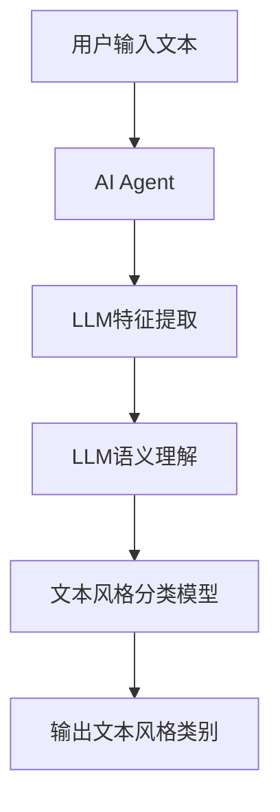

# LLM支持的AI Agent文本风格识别

> 关键词：LLM（大语言模型）、AI Agent、文本风格识别、自然语言处理、机器学习、深度学习、风格特征提取

> 摘要：本文聚焦于LLM支持的AI Agent文本风格识别这一前沿领域。随着大语言模型（LLM）的快速发展，其在AI Agent中的应用日益广泛，文本风格识别作为其中的关键环节具有重要意义。文章首先介绍了该领域的背景信息，包括目的、预期读者、文档结构和相关术语。接着深入探讨了核心概念与联系，通过文本示意图和Mermaid流程图进行直观展示。详细阐述了核心算法原理，结合Python源代码进行说明，并给出数学模型和公式以及具体例子。通过项目实战，展示了代码实现和详细解读。分析了实际应用场景，推荐了学习、开发相关的工具和资源以及论文著作。最后总结了未来发展趋势与挑战，提供了常见问题解答和扩展阅读参考资料，旨在为读者全面深入地理解和应用LLM支持的AI Agent文本风格识别技术提供有价值的参考。

## 1. 背景介绍 
### 1.1 目的和范围
在当今数字化信息爆炸的时代，文本数据以海量的形式存在。不同的文本具有各种各样的风格，例如正式、非正式、幽默、严肃、诗意等。准确识别文本风格在多个领域都有着重要的应用价值，如智能写作辅助、信息过滤、情感分析、个性化推荐等。LLM（大语言模型）的出现为AI Agent（人工智能代理）提供了强大的语言处理能力，基于LLM支持的AI Agent文本风格识别旨在利用大语言模型的优势，更高效、准确地对文本的风格进行分类和识别。

本文章的范围涵盖了从基础概念到实际应用的各个方面，包括核心概念的解释、算法原理的剖析、数学模型的构建、项目实战的演示、实际应用场景的分析以及相关工具和资源的推荐等，全面且系统地介绍LLM支持的AI Agent文本风格识别技术。

### 1.2 预期读者
本文的预期读者包括但不限于以下几类人群：
- **自然语言处理领域的研究者**：希望深入了解基于LLM的文本风格识别技术的最新进展和研究方向，为自己的研究工作提供参考和启发。
- **人工智能开发者**：想要掌握利用LLM实现AI Agent文本风格识别的具体方法和技术，以便在实际项目中进行应用和开发。
- **对人工智能和自然语言处理感兴趣的爱好者**：通过阅读本文，能够对LLM支持的AI Agent文本风格识别有一个全面的认识和理解，拓宽自己的知识视野。
- **相关领域的专业人士**：如内容审核人员、编辑、市场营销人员等，了解文本风格识别技术有助于更好地完成他们的工作任务。

### 1.3 文档结构概述
本文将按照以下结构进行组织：
1. **背景介绍**：阐述文章的目的、预期读者、文档结构概述以及相关术语的定义和解释。
2. **核心概念与联系**：介绍LLM、AI Agent、文本风格识别等核心概念，以及它们之间的联系，并通过文本示意图和Mermaid流程图进行直观展示。
3. **核心算法原理 & 具体操作步骤**：详细讲解基于LLM的文本风格识别的核心算法原理，结合Python源代码进行说明，并给出具体的操作步骤。
4. **数学模型和公式 & 详细讲解 & 举例说明**：构建文本风格识别的数学模型，给出相关公式，并通过具体例子进行详细讲解。
5. **项目实战：代码实际案例和详细解释说明**：通过一个实际的项目案例，展示如何利用LLM实现AI Agent文本风格识别，包括开发环境搭建、源代码实现和代码解读。
6. **实际应用场景**：分析文本风格识别在不同领域的实际应用场景，如智能写作、信息过滤、情感分析等。
7. **工具和资源推荐**：推荐学习、开发相关的工具和资源，包括书籍、在线课程、技术博客、IDE和编辑器、调试和性能分析工具、相关框架和库以及论文著作等。
8. **总结：未来发展趋势与挑战**：总结LLM支持的AI Agent文本风格识别技术的未来发展趋势和面临的挑战。
9. **附录：常见问题与解答**：解答读者在学习和应用过程中可能遇到的常见问题。
10. **扩展阅读 & 参考资料**：提供相关的扩展阅读材料和参考资料，方便读者进一步深入学习和研究。

### 1.4 术语表
#### 1.4.1 核心术语定义
- **LLM（大语言模型）**：是一种基于深度学习的语言模型，通过在大规模文本数据上进行训练，学习语言的模式和规律，能够生成自然语言文本、进行文本理解和推理等任务。常见的LLM有GPT系列、BERT等。
- **AI Agent（人工智能代理）**：是一种能够感知环境、进行决策并采取行动的人工智能实体。在自然语言处理领域，AI Agent可以接收文本输入，进行处理和分析，并根据结果生成相应的输出。
- **文本风格识别**：是指对文本的风格特征进行提取和分类的过程，判断文本属于哪种特定的风格类型，如正式、非正式、幽默、严肃等。

#### 1.4.2 相关概念解释
- **自然语言处理（NLP）**：是人工智能的一个重要分支，研究如何让计算机理解和处理人类语言。文本风格识别是自然语言处理中的一个具体任务。
- **深度学习**：是一种基于人工神经网络的机器学习方法，通过构建多层神经网络模型，自动从数据中学习特征和模式。LLM就是基于深度学习技术构建的。
- **特征提取**：在文本风格识别中，特征提取是指从文本中提取能够反映其风格特征的信息，如词汇、语法、句式等。

#### 1.4.3 缩略词列表
- **LLM**：Large Language Model（大语言模型）
- **AI**：Artificial Intelligence（人工智能）
- **NLP**：Natural Language Processing（自然语言处理）

## 2. 核心概念与联系 

### 核心概念原理
#### LLM（大语言模型）
大语言模型是基于Transformer架构的深度学习模型，通过在大规模的文本语料库上进行无监督学习，学习到语言的统计规律和语义信息。例如，GPT系列模型采用自回归的方式，根据前面的文本预测下一个单词的概率分布；BERT模型则采用掩码语言模型（Masked Language Model，MLM）和下一句预测（Next Sentence Prediction，NSP）任务进行预训练，学习到文本的双向语义表示。

#### AI Agent（人工智能代理）
AI Agent是一个具有自主性、反应性和社交性的智能实体。在自然语言处理中，AI Agent可以接收用户输入的文本，利用LLM进行文本理解和处理，然后根据预设的规则或学习到的策略生成相应的输出。例如，聊天机器人就是一种常见的AI Agent，它可以与用户进行对话交流。

#### 文本风格识别
文本风格识别的核心是提取文本的风格特征，并根据这些特征将文本分类到不同的风格类别中。风格特征可以包括词汇特征（如使用的词汇频率、词汇的正式程度等）、语法特征（如句子结构、词性分布等）、修辞特征（如比喻、拟人等修辞手法的使用）等。通过对大量具有不同风格的文本进行标注和训练，可以构建文本风格分类模型。

### 架构的文本示意图
```plaintext
用户输入文本 -> AI Agent -> LLM（特征提取、语义理解） -> 文本风格分类模型 -> 输出文本风格类别
```
这个示意图展示了整个LLM支持的AI Agent文本风格识别的流程。用户输入的文本首先由AI Agent接收，然后AI Agent利用LLM对文本进行特征提取和语义理解，将处理后的特征输入到文本风格分类模型中，最终得到文本的风格类别。

### Mermaid流程图

这个流程图更加直观地展示了从用户输入文本到输出文本风格类别的整个过程。AI Agent作为中间桥梁，将用户输入传递给LLM进行特征提取和语义理解，然后将结果输入到文本风格分类模型中进行分类，最终输出文本的风格类别。

## 3. 核心算法原理 & 具体操作步骤 

### 核心算法原理
基于LLM的文本风格识别主要基于以下几个步骤：
1. **文本编码**：使用LLM将输入的文本编码为向量表示。LLM可以将文本中的每个单词或子词映射到一个高维向量空间中，这个向量表示包含了文本的语义信息。
2. **特征提取**：从LLM编码得到的向量中提取与文本风格相关的特征。可以使用全连接层、卷积层或循环神经网络等方法对编码向量进行处理，提取出具有代表性的风格特征。
3. **分类模型**：使用分类算法（如逻辑回归、支持向量机、深度学习分类器等）对提取的特征进行分类，判断文本属于哪种风格类别。

### 具体操作步骤及Python源代码
以下是一个使用Hugging Face的Transformers库和PyTorch实现基于LLM的文本风格识别的示例代码：

```python
import torch
from transformers import AutoTokenizer, AutoModel
from sklearn.linear_model import LogisticRegression
from sklearn.model_selection import train_test_split
import numpy as np

# 1. 加载预训练的LLM和分词器
model_name = 'bert-base-uncased'
tokenizer = AutoTokenizer.from_pretrained(model_name)
model = AutoModel.from_pretrained(model_name)

# 2. 准备数据集
# 假设我们有一个包含文本和对应风格标签的数据集
texts = ["This is a formal statement.", "Hey, what's up?", "The situation is quite serious."]
labels = [0, 1, 0]  # 0表示正式风格，1表示非正式风格

# 3. 文本编码
def encode_texts(texts):
    input_ids = []
    attention_mask = []
    for text in texts:
        encoding = tokenizer(text, return_tensors='pt', padding='max_length', truncation=True, max_length=128)
        input_ids.append(encoding['input_ids'])
        attention_mask.append(encoding['attention_mask'])
    input_ids = torch.cat(input_ids, dim=0)
    attention_mask = torch.cat(attention_mask, dim=0)
    with torch.no_grad():
        outputs = model(input_ids, attention_mask=attention_mask)
    embeddings = outputs.last_hidden_state[:, 0, :].numpy()  # 取[CLS]标记的向量作为文本表示
    return embeddings

# 4. 特征提取
embeddings = encode_texts(texts)

# 5. 划分训练集和测试集
X_train, X_test, y_train, y_test = train_test_split(embeddings, labels, test_size=0.2, random_state=42)

# 6. 训练分类模型
clf = LogisticRegression()
clf.fit(X_train, y_train)

# 7. 模型评估
accuracy = clf.score(X_test, y_test)
print(f"模型准确率: {accuracy}")

# 8. 预测新文本的风格
new_text = "How are you doing?"
new_embedding = encode_texts([new_text])
predicted_label = clf.predict(new_embedding)
print(f"预测的风格标签: {predicted_label[0]}")
```

### 代码解释
1. **加载预训练的LLM和分词器**：使用Hugging Face的Transformers库加载预训练的BERT模型和对应的分词器。
2. **准备数据集**：定义一个包含文本和对应风格标签的数据集。
3. **文本编码**：使用分词器将文本转换为输入ID和注意力掩码，然后将其输入到BERT模型中，得到文本的向量表示。
4. **特征提取**：取[CLS]标记的向量作为文本的表示。
5. **划分训练集和测试集**：将数据集划分为训练集和测试集，用于训练和评估分类模型。
6. **训练分类模型**：使用逻辑回归作为分类器，对训练集进行训练。
7. **模型评估**：在测试集上评估分类模型的准确率。
8. **预测新文本的风格**：对新的文本进行编码和特征提取，然后使用训练好的分类模型进行预测。

## 4. 数学模型和公式 & 详细讲解 & 举例说明 

### 数学模型
基于LLM的文本风格识别可以看作是一个分类问题。假设我们有一个包含 $N$ 个文本样本的数据集 $\mathcal{D} = \{(x_1, y_1), (x_2, y_2), \cdots, (x_N, y_N)\}$，其中 $x_i$ 表示第 $i$ 个文本的特征向量，$y_i$ 表示第 $i$ 个文本的风格标签，$y_i \in \{1, 2, \cdots, K\}$，$K$ 表示风格类别的数量。

我们的目标是学习一个分类函数 $f: \mathbb{R}^d \to \{1, 2, \cdots, K\}$，其中 $d$ 是特征向量的维度，使得对于任意的文本特征向量 $x$，$f(x)$ 能够准确地预测其风格标签。

### 公式
#### 逻辑回归分类器
逻辑回归是一种常用的分类算法，其基本公式如下：

对于二分类问题（$K = 2$），假设我们要预测文本属于类别 $1$ 的概率 $P(y = 1|x)$，可以通过以下公式计算：

$$P(y = 1|x) = \frac{1}{1 + e^{-(w^T x + b)}}$$

其中 $w$ 是权重向量，$b$ 是偏置项，$x$ 是文本的特征向量。

对于多分类问题（$K > 2$），可以使用softmax函数进行扩展：

$$P(y = k|x) = \frac{e^{w_k^T x + b_k}}{\sum_{j = 1}^{K} e^{w_j^T x + b_j}}, \quad k = 1, 2, \cdots, K$$

其中 $w_k$ 和 $b_k$ 分别是第 $k$ 个类别的权重向量和偏置项。

#### 损失函数
在训练逻辑回归模型时，通常使用交叉熵损失函数来衡量模型预测结果与真实标签之间的差异。对于二分类问题，交叉熵损失函数的公式如下：

$$L(w, b) = -\frac{1}{N} \sum_{i = 1}^{N} [y_i \log P(y = 1|x_i) + (1 - y_i) \log (1 - P(y = 1|x_i))]$$

对于多分类问题，交叉熵损失函数的公式如下：

$$L(w_1, b_1, \cdots, w_K, b_K) = -\frac{1}{N} \sum_{i = 1}^{N} \sum_{k = 1}^{K} \delta(y_i, k) \log P(y = k|x_i)$$

其中 $\delta(y_i, k)$ 是克罗内克函数，当 $y_i = k$ 时，$\delta(y_i, k) = 1$，否则 $\delta(y_i, k) = 0$。

### 详细讲解
逻辑回归通过学习权重向量 $w$ 和偏置项 $b$，使得模型能够根据输入的特征向量 $x$ 预测文本属于不同风格类别的概率。交叉熵损失函数的作用是衡量模型预测结果与真实标签之间的差异，我们的目标是通过最小化损失函数来找到最优的 $w$ 和 $b$。

在训练过程中，通常使用梯度下降算法来更新 $w$ 和 $b$，使得损失函数逐渐减小。梯度下降算法的更新公式如下：

$$w \leftarrow w - \alpha \frac{\partial L}{\partial w}$$

$$b \leftarrow b - \alpha \frac{\partial L}{\partial b}$$

其中 $\alpha$ 是学习率，控制每次更新的步长。

### 举例说明
假设我们有一个二分类问题，文本的特征向量 $x = [1, 2]$，权重向量 $w = [0.5, 0.3]$，偏置项 $b = 0.1$。

首先计算 $z = w^T x + b = 0.5 \times 1 + 0.3 \times 2 + 0.1 = 1.2$。

然后计算 $P(y = 1|x) = \frac{1}{1 + e^{-1.2}} \approx 0.77$。

假设真实标签 $y = 1$，则交叉熵损失为 $L = -\log P(y = 1|x) = -\log 0.77 \approx 0.26$。

## 5. 项目实战：代码实际案例和详细解释说明 

### 5.1  开发环境搭建
#### 安装Python
首先需要安装Python环境，建议使用Python 3.7及以上版本。可以从Python官方网站（https://www.python.org/downloads/）下载并安装。

#### 安装必要的库
使用以下命令安装必要的库：
```bash
pip install torch transformers scikit-learn numpy
```
- `torch`：PyTorch深度学习框架，用于构建和训练神经网络模型。
- `transformers`：Hugging Face的Transformers库，用于加载预训练的大语言模型。
- `scikit-learn`：机器学习库，提供了各种机器学习算法和工具。
- `numpy`：用于数值计算和数组操作。

### 5.2  源代码详细实现和代码解读
以下是一个完整的项目实战代码，用于实现基于LLM的文本风格识别：

```python
import torch
from transformers import AutoTokenizer, AutoModel
from sklearn.linear_model import LogisticRegression
from sklearn.model_selection import train_test_split
import numpy as np

# 1. 加载预训练的LLM和分词器
model_name = 'bert-base-uncased'
tokenizer = AutoTokenizer.from_pretrained(model_name)
model = AutoModel.from_pretrained(model_name)

# 2. 准备数据集
# 假设我们有一个包含文本和对应风格标签的数据集
texts = ["This is a formal statement.", "Hey, what's up?", "The situation is quite serious.", "How are you doing?"]
labels = [0, 1, 0, 1]  # 0表示正式风格，1表示非正式风格

# 3. 文本编码
def encode_texts(texts):
    input_ids = []
    attention_mask = []
    for text in texts:
        encoding = tokenizer(text, return_tensors='pt', padding='max_length', truncation=True, max_length=128)
        input_ids.append(encoding['input_ids'])
        attention_mask.append(encoding['attention_mask'])
    input_ids = torch.cat(input_ids, dim=0)
    attention_mask = torch.cat(attention_mask, dim=0)
    with torch.no_grad():
        outputs = model(input_ids, attention_mask=attention_mask)
    embeddings = outputs.last_hidden_state[:, 0, :].numpy()  # 取[CLS]标记的向量作为文本表示
    return embeddings

# 4. 特征提取
embeddings = encode_texts(texts)

# 5. 划分训练集和测试集
X_train, X_test, y_train, y_test = train_test_split(embeddings, labels, test_size=0.2, random_state=42)

# 6. 训练分类模型
clf = LogisticRegression()
clf.fit(X_train, y_train)

# 7. 模型评估
accuracy = clf.score(X_test, y_test)
print(f"模型准确率: {accuracy}")

# 8. 预测新文本的风格
new_text = "Have a nice day!"
new_embedding = encode_texts([new_text])
predicted_label = clf.predict(new_embedding)
print(f"预测的风格标签: {predicted_label[0]}")
```

### 5.3  代码解读与分析
1. **加载预训练的LLM和分词器**：使用Hugging Face的Transformers库加载预训练的BERT模型和对应的分词器。`AutoTokenizer.from_pretrained(model_name)` 用于加载分词器，`AutoModel.from_pretrained(model_name)` 用于加载BERT模型。
2. **准备数据集**：定义一个包含文本和对应风格标签的数据集。这里的风格标签用0表示正式风格，1表示非正式风格。
3. **文本编码**：`encode_texts` 函数将输入的文本转换为BERT模型的输入ID和注意力掩码，然后将其输入到BERT模型中，得到文本的向量表示。取[CLS]标记的向量作为文本的表示。
4. **特征提取**：调用 `encode_texts` 函数对所有文本进行编码，得到特征向量。
5. **划分训练集和测试集**：使用 `train_test_split` 函数将数据集划分为训练集和测试集，`test_size=0.2` 表示测试集占总数据集的20%。
6. **训练分类模型**：使用逻辑回归作为分类器，调用 `clf.fit(X_train, y_train)` 函数对训练集进行训练。
7. **模型评估**：使用 `clf.score(X_test, y_test)` 函数在测试集上评估分类模型的准确率。
8. **预测新文本的风格**：对新的文本进行编码和特征提取，然后使用训练好的分类模型进行预测。

## 6. 实际应用场景 
### 智能写作辅助
在智能写作工具中，文本风格识别可以帮助用户自动检测和调整文本的风格。例如，用户在撰写商务报告时，智能写作工具可以识别文本的风格是否正式、专业，如果发现文本中存在非正式的表述，工具可以给出相应的提示和建议，帮助用户修改文本，使其符合商务报告的风格要求。

### 信息过滤
在信息过滤系统中，文本风格识别可以用于筛选和分类不同风格的信息。例如，在新闻网站中，可以根据文本的风格将新闻分类为严肃新闻、娱乐新闻、评论等不同类别，方便用户快速找到自己感兴趣的信息。同时，对于一些低质量、低俗的文本，可以通过风格识别进行过滤，提高信息的质量和安全性。

### 情感分析
文本风格与情感表达密切相关。不同风格的文本可能传达出不同的情感倾向。例如，幽默风格的文本通常带有积极的情感，而严肃风格的文本可能表达出中立或消极的情感。通过文本风格识别，可以辅助情感分析任务，提高情感分析的准确性。

### 个性化推荐
在个性化推荐系统中，文本风格识别可以用于了解用户的偏好和兴趣。例如，根据用户阅读的文章的风格，推荐具有相似风格的文章或其他内容。对于喜欢幽默风格文章的用户，可以推荐更多幽默风格的笑话、喜剧评论等内容，提高用户的满意度和体验。

### 内容审核
在内容审核过程中，文本风格识别可以帮助审核人员快速判断文本的性质和风格。对于一些违反规定、不适当的风格文本，如恶意攻击、侮辱性的文本，可以及时进行处理，维护良好的网络环境和社会秩序。

## 7. 工具和资源推荐
### 7.1 学习资源推荐
#### 7.1.1 书籍推荐
- 《自然语言处理入门》：作者何晗，本书全面介绍了自然语言处理的基本概念、方法和技术，包括文本分类、信息抽取、情感分析等，适合初学者入门。
- 《深度学习》：作者Ian Goodfellow、Yoshua Bengio和Aaron Courville，这本书是深度学习领域的经典教材，详细介绍了深度学习的基本原理、模型结构和训练方法，对于理解大语言模型的底层原理有很大帮助。
- 《Python自然语言处理》：作者Steven Bird、Ewan Klein和Edward Loper，本书结合Python语言和NLTK库，介绍了自然语言处理的各种任务和方法，是学习自然语言处理编程的优秀书籍。

#### 7.1.2 在线课程
- Coursera上的“Natural Language Processing Specialization”：由斯坦福大学的教授授课，涵盖了自然语言处理的各个方面，包括词法分析、句法分析、语义理解、文本生成等，课程内容丰富，讲解详细。
- edX上的“Deep Learning for Natural Language Processing”：该课程介绍了深度学习在自然语言处理中的应用，包括神经网络、循环神经网络、Transformer等模型的原理和实现，适合有一定机器学习基础的学习者。
- 哔哩哔哩（B站）上的一些自然语言处理相关的视频教程：许多UP主会分享自然语言处理的学习经验和代码实现，内容生动有趣，易于理解。

#### 7.1.3 技术博客和网站
- Hugging Face官方博客（https://huggingface.co/blog）：提供了关于大语言模型、自然语言处理等领域的最新研究成果和技术文章，是了解前沿技术的重要渠道。
- Medium上的自然语言处理相关专栏：许多专业人士会在Medium上分享自己的研究和实践经验，如Towards Data Science、The AI Summer等专栏，内容丰富多样。
- 机器之心（https://www.alternative.me/）：专注于人工智能领域的资讯和技术报道，提供了大量关于自然语言处理、大语言模型等方面的新闻和分析文章。

### 7.2 开发工具框架推荐
#### 7.2.1 IDE和编辑器
- PyCharm：是一款专门为Python开发设计的集成开发环境（IDE），具有强大的代码编辑、调试、自动补全、版本控制等功能，适合开发基于Python的自然语言处理项目。
- Visual Studio Code（VS Code）：是一款轻量级的代码编辑器，支持多种编程语言和插件扩展。通过安装Python相关的插件，如Python、Pylance等，可以方便地进行Python开发和调试。
- Jupyter Notebook：是一个交互式的开发环境，适合进行数据探索、模型训练和实验。可以将代码、文本、图表等内容整合在一个文档中，方便展示和分享。

#### 7.2.2 调试和性能分析工具
- PyTorch Profiler：是PyTorch提供的性能分析工具，可以帮助开发者分析模型的运行时间、内存使用情况等，找出性能瓶颈，进行优化。
- TensorBoard：是TensorFlow提供的可视化工具，也可以与PyTorch结合使用。可以用于可视化模型的训练过程、损失曲线、准确率等指标，帮助开发者更好地理解模型的性能。
- cProfile：是Python标准库中的性能分析工具，可以统计函数的调用次数、执行时间等信息，帮助开发者找出代码中的性能问题。

#### 7.2.3 相关框架和库
- Hugging Face Transformers：是一个用于自然语言处理的开源库，提供了大量预训练的大语言模型，如GPT、BERT、RoBERTa等，以及相应的分词器和工具函数，方便开发者进行模型的加载、微调等操作。
- NLTK（Natural Language Toolkit）：是Python中常用的自然语言处理库，提供了丰富的语料库、工具和算法，如词法分析、句法分析、情感分析等，适合初学者进行自然语言处理的学习和实践。
- SpaCy：是另一个流行的自然语言处理库，具有高效的处理速度和简洁的API，支持多种语言的处理，适合处理大规模的文本数据。

### 7.3 相关论文著作推荐
#### 7.3.1 经典论文
- “Attention Is All You Need”：介绍了Transformer架构，是大语言模型的基础，该架构通过自注意力机制实现了并行计算，提高了模型的训练效率和性能。
- “BERT: Pre-training of Deep Bidirectional Transformers for Language Understanding”：提出了BERT模型，通过掩码语言模型和下一句预测任务进行预训练，在多个自然语言处理任务中取得了优异的成绩。
- “Generative Pretrained Transformer 3 (GPT-3): Language Models are Few-Shot Learners”：介绍了GPT-3模型，展示了大语言模型在少样本学习和文本生成方面的强大能力。

#### 7.3.2 最新研究成果
- 可以关注顶级学术会议和期刊，如ACL（Association for Computational Linguistics）、EMNLP（Conference on Empirical Methods in Natural Language Processing）、TACL（Transactions of the Association for Computational Linguistics）等，这些会议和期刊会发表自然语言处理领域的最新研究成果。

#### 7.3.3 应用案例分析
- 一些科技公司和研究机构会发布关于文本风格识别和自然语言处理的应用案例分析，如Google、Microsoft、OpenAI等公司的官方博客和研究报告，可以从中了解到实际应用中的技术细节和经验教训。

## 8. 总结：未来发展趋势与挑战
### 未来发展趋势
#### 多模态融合
未来的文本风格识别将不仅仅局限于文本信息，还会融合图像、音频、视频等多模态信息。例如，在视频内容中，结合视频中的画面、声音和字幕文本进行综合的风格识别，能够更全面、准确地理解内容的风格特点。

#### 个性化和细粒度风格识别
随着用户对个性化服务的需求不断增加，文本风格识别将朝着个性化和细粒度的方向发展。不仅能够识别常见的风格类别，还能根据用户的偏好和习惯，识别出更细致、个性化的风格特征，为用户提供更加精准的服务。

#### 跨语言和跨文化风格识别
在全球化的背景下，跨语言和跨文化的文本交流日益频繁。未来的文本风格识别技术需要能够处理不同语言和文化背景下的文本，识别出具有跨语言和跨文化特点的风格差异，促进不同语言和文化之间的交流和理解。

#### 与其他AI技术的深度融合
文本风格识别将与其他人工智能技术，如知识图谱、强化学习、计算机视觉等进行深度融合。例如，结合知识图谱可以更好地理解文本中的语义信息，提高风格识别的准确性；利用强化学习可以优化风格识别模型的训练过程，提高模型的性能。

### 挑战
#### 数据稀缺性和标注难度
高质量的标注数据是训练文本风格识别模型的关键。然而，获取大量具有准确风格标注的数据是一项具有挑战性的任务。不同的人对文本风格的理解可能存在差异，导致标注的主观性较强。同时，对于一些特定领域或小众风格的文本，数据的稀缺性更加明显。

#### 风格的模糊性和多样性
文本风格具有很强的模糊性和多样性，不同的风格之间可能存在重叠和过渡。例如，一些文本可能同时具有幽默和讽刺的风格特点，难以准确地将其分类到单一的风格类别中。此外，随着语言的发展和变化，新的风格不断涌现，增加了风格识别的难度。

#### 计算资源和效率
大语言模型通常需要大量的计算资源进行训练和推理。在实际应用中，如何在有限的计算资源下提高文本风格识别的效率是一个亟待解决的问题。同时，随着数据量的不断增加，如何优化模型的结构和算法，减少计算成本，也是一个重要的挑战。

#### 伦理和安全问题
在文本风格识别的应用过程中，可能会涉及到伦理和安全问题。例如，模型可能会对某些风格的文本存在偏见，导致不公平的判断；一些恶意用户可能会利用文本风格识别技术进行信息操纵和传播虚假信息。因此，如何保证文本风格识别技术的公正性、安全性和可靠性是一个需要关注的问题。

## 9. 附录：常见问题与解答
### 1. 如何选择合适的LLM进行文本风格识别？
选择合适的LLM需要考虑多个因素，如模型的性能、适用场景、计算资源等。一般来说，如果对文本理解和语义表示要求较高，可以选择像BERT、RoBERTa这样的预训练语言模型；如果更注重文本生成能力，可以选择GPT系列模型。同时，还需要根据自己的计算资源选择合适大小的模型，避免资源浪费。

### 2. 如何处理文本风格识别中的数据不平衡问题？
数据不平衡是指不同风格类别的样本数量差异较大的问题。可以采用以下方法来处理数据不平衡问题：
- **数据增强**：对于样本数量较少的风格类别，可以通过数据增强的方法生成更多的样本，如随机替换、插入、删除单词等。
- **重采样**：可以采用过采样（如SMOTE算法）或欠采样的方法来平衡不同风格类别的样本数量。
- **调整损失函数**：在训练模型时，可以调整损失函数的权重，对样本数量较少的风格类别给予更高的权重，以提高模型对这些类别的关注度。

### 3. 如何提高文本风格识别的准确率？
可以从以下几个方面提高文本风格识别的准确率：
- **增加训练数据**：使用更多的标注数据进行训练，能够让模型学习到更丰富的风格特征。
- **特征工程**：除了使用LLM的编码向量作为特征外，还可以提取其他与风格相关的特征，如词汇特征、语法特征等，并将它们融合在一起。
- **模型选择和调优**：尝试不同的分类模型，如支持向量机、深度学习分类器等，并对模型的超参数进行调优，以找到最优的模型配置。
- **集成学习**：可以将多个不同的模型进行集成，通过投票或加权平均的方式得到最终的预测结果，提高模型的泛化能力和准确率。

### 4. 文本风格识别可以应用于哪些领域？
文本风格识别可以应用于多个领域，如智能写作辅助、信息过滤、情感分析、个性化推荐、内容审核等。在智能写作辅助中，可以帮助用户检测和调整文本的风格；在信息过滤中，可以筛选和分类不同风格的信息；在情感分析中，可以辅助判断文本的情感倾向；在个性化推荐中，可以根据用户的风格偏好推荐相关内容；在内容审核中，可以帮助审核人员快速判断文本的性质和风格。

### 5. 如何评估文本风格识别模型的性能？
可以使用以下指标来评估文本风格识别模型的性能：
- **准确率（Accuracy）**：预测正确的样本数占总样本数的比例，是最常用的评估指标之一。
- **精确率（Precision）**：预测为某一风格类别的样本中，实际属于该类别的样本数占预测为该类别的样本数的比例。
- **召回率（Recall）**：实际属于某一风格类别的样本中，被预测为该类别的样本数占实际属于该类别的样本数的比例。
- **F1值（F1-score）**：精确率和召回率的调和平均数，综合考虑了精确率和召回率。

## 10. 扩展阅读 & 参考资料
### 扩展阅读
- 《自然语言处理实战：基于Python和深度学习》：通过实际案例介绍了自然语言处理的各种任务和技术，包括文本分类、情感分析、命名实体识别等，适合进一步深入学习自然语言处理的实践应用。
- 《动手学深度学习》：以动手实践为导向，介绍了深度学习的基本概念、模型结构和训练方法，通过大量的代码示例帮助读者更好地理解和掌握深度学习技术。
- 《人工智能：现代方法》：是人工智能领域的经典教材，全面介绍了人工智能的各个方面，包括搜索算法、知识表示、机器学习、自然语言处理等，对于建立人工智能的整体知识体系有很大帮助。

### 参考资料
- Hugging Face官方文档（https://huggingface.co/docs/transformers/index）：提供了关于Transformers库的详细文档和使用指南，是学习和使用大语言模型的重要参考资料。
- PyTorch官方文档（https://pytorch.org/docs/stable/index.html）：提供了关于PyTorch深度学习框架的详细文档和教程，对于学习和使用PyTorch进行模型开发有很大帮助。
- Scikit-learn官方文档（https://scikit-learn.org/stable/documentation.html）：提供了关于Scikit-learn机器学习库的详细文档和示例代码，对于学习和使用机器学习算法进行文本风格识别有很大帮助。