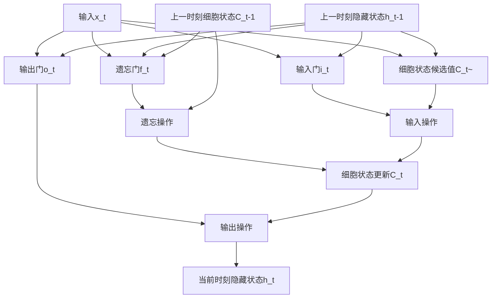

# LLM状态建模中的隐藏状态问题

> 关键词：LLM、状态建模、隐藏状态、语言模型、深度学习

> 摘要：本文围绕LLM（大语言模型）状态建模中的隐藏状态问题展开深入探讨。首先介绍了研究的背景、目的和预期读者等内容。接着阐述了核心概念与联系，包括隐藏状态的原理和相关架构。详细讲解了核心算法原理并给出Python源代码示例，同时介绍了相关的数学模型和公式。通过项目实战展示了代码实际案例及详细解释。探讨了隐藏状态问题在实际中的应用场景，推荐了相关的学习资源、开发工具框架以及论文著作。最后总结了未来发展趋势与挑战，并给出常见问题解答和扩展阅读参考资料，旨在为读者全面深入地理解LLM状态建模中的隐藏状态问题提供系统的知识和思路。

## 1. 背景介绍 
### 1.1 目的和范围
LLM（大语言模型）在自然语言处理领域取得了巨大的成功，如在文本生成、问答系统、机器翻译等任务中都有出色的表现。状态建模是LLM中的关键环节，而隐藏状态在状态建模中起着核心作用。本文的目的在于深入研究LLM状态建模中的隐藏状态问题，包括隐藏状态的产生、表示、作用以及可能出现的问题和解决方法。范围涵盖了从理论原理到实际应用的多个方面，旨在为研究人员、开发者和对LLM感兴趣的读者提供全面而深入的知识。

### 1.2 预期读者
本文预期读者包括自然语言处理领域的研究人员、深度学习开发者、对人工智能和语言模型有兴趣的学生以及相关技术爱好者。对于想要深入了解LLM内部机制，特别是状态建模和隐藏状态相关知识的读者，本文将提供有价值的参考。

### 1.3 文档结构概述
本文首先介绍背景信息，让读者了解研究的目的和范围。接着阐述核心概念与联系，帮助读者理解隐藏状态的基本原理和相关架构。然后详细讲解核心算法原理并给出Python代码示例，以及相关的数学模型和公式。通过项目实战展示代码的实际应用和详细解释。探讨实际应用场景，为读者提供实际案例参考。推荐相关的学习资源、开发工具框架和论文著作，方便读者进一步深入学习。最后总结未来发展趋势与挑战，给出常见问题解答和扩展阅读参考资料，使读者对整个主题有一个完整的认识。

### 1.4 术语表
#### 1.4.1 核心术语定义
- **LLM（大语言模型）**：是基于深度学习的语言模型，通常具有大量的参数和强大的语言处理能力，能够处理各种自然语言任务。
- **状态建模**：在LLM中，状态建模是指对模型在处理输入序列过程中的内部状态进行描述和表示的过程，以便模型能够更好地理解和处理上下文信息。
- **隐藏状态**：是状态建模中的一个重要概念，它是模型在处理输入序列时的内部表示，包含了模型对当前输入和之前输入的综合信息，用于后续的计算和输出。

#### 1.4.2 相关概念解释
- **上下文信息**：指的是在自然语言处理中，与当前处理的文本相关的前后文内容。LLM通过隐藏状态来捕捉和利用上下文信息，从而更好地理解和生成文本。
- **循环神经网络（RNN）**：是一种早期的神经网络结构，常用于处理序列数据。RNN在处理序列时会维护一个隐藏状态，该状态在每个时间步更新，以反映当前输入和之前的信息。
- **长短时记忆网络（LSTM）**：是对RNN的改进，解决了RNN中梯度消失和梯度爆炸的问题。LSTM通过门控机制来控制信息的流入和流出，从而更好地处理长序列数据。

#### 1.4.3 缩略词列表
- **LLM**：Large Language Model（大语言模型）
- **RNN**：Recurrent Neural Network（循环神经网络）
- **LSTM**：Long Short-Term Memory（长短时记忆网络）
- **GRU**：Gated Recurrent Unit（门控循环单元）

## 2. 核心概念与联系 

### 隐藏状态的原理
在LLM中，隐藏状态是模型内部的一种表示形式，它记录了模型在处理输入序列过程中的中间信息。以循环神经网络（RNN）为例，RNN在每个时间步接收输入 $x_t$，并根据当前输入和上一个时间步的隐藏状态 $h_{t-1}$ 计算当前时间步的隐藏状态 $h_t$。隐藏状态的更新公式可以表示为：

$$h_t = f(W_{hh}h_{t-1} + W_{xh}x_t + b_h)$$

其中，$W_{hh}$ 和 $W_{xh}$ 是权重矩阵，$b_h$ 是偏置向量，$f$ 是激活函数，如tanh函数。这个公式表明，当前时间步的隐藏状态 $h_t$ 是由上一个时间步的隐藏状态 $h_{t-1}$ 和当前输入 $x_t$ 共同决定的。

### 隐藏状态的架构
在不同的LLM架构中，隐藏状态的实现方式有所不同。例如，在LSTM中，隐藏状态的更新通过门控机制来实现，包括输入门、遗忘门和输出门。输入门控制新信息的流入，遗忘门控制旧信息的遗忘，输出门控制隐藏状态的输出。

下面是LSTM的隐藏状态更新的示意图：



在这个架构中，隐藏状态 $h_t$ 是通过细胞状态 $C_t$ 和输出门 $o_t$ 共同计算得到的。细胞状态 $C_t$ 记录了长期的信息，而隐藏状态 $h_t$ 则是当前时间步的输出表示。

### 隐藏状态与上下文信息的联系
隐藏状态的一个重要作用是捕捉和利用上下文信息。在处理自然语言序列时，模型需要理解文本的上下文，以便更好地进行语义理解和文本生成。隐藏状态通过不断更新和传递信息，将之前的输入信息融入到当前的表示中，从而实现对上下文信息的捕捉。

例如，在一个句子“我喜欢吃苹果，它非常甜”中，当模型处理“它”这个词时，隐藏状态中已经包含了“苹果”的信息，因此模型能够正确地理解“它”指代的是“苹果”。

## 3. 核心算法原理 & 具体操作步骤 

### 基于RNN的隐藏状态计算算法原理
在RNN中，隐藏状态的计算是通过递归的方式进行的。下面是一个简单的Python代码示例，展示了如何使用Python实现RNN的隐藏状态计算：

```python
import numpy as np

# 定义RNN的参数
input_size = 10
hidden_size = 20
W_xh = np.random.randn(hidden_size, input_size)  # 输入到隐藏的权重矩阵
W_hh = np.random.randn(hidden_size, hidden_size)  # 隐藏到隐藏的权重矩阵
b_h = np.zeros((hidden_size, 1))  # 隐藏状态的偏置向量

# 定义激活函数（tanh）
def tanh(x):
    return np.tanh(x)

# 定义RNN的隐藏状态更新函数
def rnn_step(x_t, h_t_prev):
    """
    计算RNN的一个时间步的隐藏状态
    :param x_t: 当前时间步的输入
    :param h_t_prev: 上一个时间步的隐藏状态
    :return: 当前时间步的隐藏状态
    """
    h_t = tanh(np.dot(W_xh, x_t) + np.dot(W_hh, h_t_prev) + b_h)
    return h_t

# 示例输入序列
input_sequence = [np.random.randn(input_size, 1) for _ in range(5)]  # 假设输入序列长度为5

# 初始化隐藏状态
h_0 = np.zeros((hidden_size, 1))

# 计算隐藏状态序列
hidden_states = []
h_t = h_0
for x_t in input_sequence:
    h_t = rnn_step(x_t, h_t)
    hidden_states.append(h_t)

# 打印隐藏状态序列
for i, h in enumerate(hidden_states):
    print(f"Time step {i}: {h.flatten()}")
```

### 具体操作步骤
1. **参数初始化**：首先，我们需要初始化RNN的参数，包括输入到隐藏的权重矩阵 $W_{xh}$、隐藏到隐藏的权重矩阵 $W_{hh}$ 和隐藏状态的偏置向量 $b_h$。
2. **定义激活函数**：这里我们使用tanh函数作为激活函数，用于将输入的线性组合映射到一个非线性的范围内。
3. **定义隐藏状态更新函数**：`rnn_step` 函数用于计算RNN的一个时间步的隐藏状态。它接收当前时间步的输入 $x_t$ 和上一个时间步的隐藏状态 $h_{t-1}$ 作为输入，并返回当前时间步的隐藏状态 $h_t$。
4. **初始化隐藏状态**：在处理输入序列之前，我们需要初始化隐藏状态 $h_0$，通常将其初始化为全零向量。
5. **计算隐藏状态序列**：遍历输入序列，依次调用 `rnn_step` 函数计算每个时间步的隐藏状态，并将其添加到隐藏状态序列中。
6. **输出结果**：最后，我们打印出每个时间步的隐藏状态。

### 基于LSTM的隐藏状态计算算法原理
LSTM通过门控机制来控制信息的流动，从而更好地处理长序列数据。下面是一个简单的Python代码示例，展示了如何使用Python实现LSTM的隐藏状态计算：

```python
import numpy as np

# 定义LSTM的参数
input_size = 10
hidden_size = 20
W_ii = np.random.randn(hidden_size, input_size)  # 输入门的输入权重矩阵
W_hi = np.random.randn(hidden_size, hidden_size)  # 输入门的隐藏权重矩阵
b_i = np.zeros((hidden_size, 1))  # 输入门的偏置向量
W_if = np.random.randn(hidden_size, input_size)  # 遗忘门的输入权重矩阵
W_hf = np.random.randn(hidden_size, hidden_size)  # 遗忘门的隐藏权重矩阵
b_f = np.zeros((hidden_size, 1))  # 遗忘门的偏置向量
W_ig = np.random.randn(hidden_size, input_size)  # 细胞状态候选值的输入权重矩阵
W_hg = np.random.randn(hidden_size, hidden_size)  # 细胞状态候选值的隐藏权重矩阵
b_g = np.zeros((hidden_size, 1))  # 细胞状态候选值的偏置向量
W_io = np.random.randn(hidden_size, input_size)  # 输出门的输入权重矩阵
W_ho = np.random.randn(hidden_size, hidden_size)  # 输出门的隐藏权重矩阵
b_o = np.zeros((hidden_size, 1))  # 输出门的偏置向量

# 定义激活函数（sigmoid和tanh）
def sigmoid(x):
    return 1 / (1 + np.exp(-x))

def tanh(x):
    return np.tanh(x)

# 定义LSTM的隐藏状态更新函数
def lstm_step(x_t, h_t_prev, c_t_prev):
    """
    计算LSTM的一个时间步的隐藏状态和细胞状态
    :param x_t: 当前时间步的输入
    :param h_t_prev: 上一个时间步的隐藏状态
    :param c_t_prev: 上一个时间步的细胞状态
    :return: 当前时间步的隐藏状态和细胞状态
    """
    i_t = sigmoid(np.dot(W_ii, x_t) + np.dot(W_hi, h_t_prev) + b_i)
    f_t = sigmoid(np.dot(W_if, x_t) + np.dot(W_hf, h_t_prev) + b_f)
    g_t = tanh(np.dot(W_ig, x_t) + np.dot(W_hg, h_t_prev) + b_g)
    o_t = sigmoid(np.dot(W_io, x_t) + np.dot(W_ho, h_t_prev) + b_o)
    c_t = f_t * c_t_prev + i_t * g_t
    h_t = o_t * tanh(c_t)
    return h_t, c_t

# 示例输入序列
input_sequence = [np.random.randn(input_size, 1) for _ in range(5)]  # 假设输入序列长度为5

# 初始化隐藏状态和细胞状态
h_0 = np.zeros((hidden_size, 1))
c_0 = np.zeros((hidden_size, 1))

# 计算隐藏状态和细胞状态序列
hidden_states = []
cell_states = []
h_t = h_0
c_t = c_0
for x_t in input_sequence:
    h_t, c_t = lstm_step(x_t, h_t, c_t)
    hidden_states.append(h_t)
    cell_states.append(c_t)

# 打印隐藏状态序列
for i, h in enumerate(hidden_states):
    print(f"Time step {i}: {h.flatten()}")
```

### 具体操作步骤
1. **参数初始化**：首先，我们需要初始化LSTM的参数，包括输入门、遗忘门、细胞状态候选值和输出门的权重矩阵和偏置向量。
2. **定义激活函数**：这里我们使用sigmoid函数和tanh函数作为激活函数，分别用于计算门控值和细胞状态候选值。
3. **定义隐藏状态更新函数**：`lstm_step` 函数用于计算LSTM的一个时间步的隐藏状态和细胞状态。它接收当前时间步的输入 $x_t$、上一个时间步的隐藏状态 $h_{t-1}$ 和细胞状态 $C_{t-1}$ 作为输入，并返回当前时间步的隐藏状态 $h_t$ 和细胞状态 $C_t$。
4. **初始化隐藏状态和细胞状态**：在处理输入序列之前，我们需要初始化隐藏状态 $h_0$ 和细胞状态 $C_0$，通常将其初始化为全零向量。
5. **计算隐藏状态和细胞状态序列**：遍历输入序列，依次调用 `lstm_step` 函数计算每个时间步的隐藏状态和细胞状态，并将其添加到相应的序列中。
6. **输出结果**：最后，我们打印出每个时间步的隐藏状态。

## 4. 数学模型和公式 & 详细讲解 & 举例说明 

### RNN的数学模型和公式
在RNN中，隐藏状态的更新公式为：

$$h_t = f(W_{hh}h_{t-1} + W_{xh}x_t + b_h)$$

其中：
- $h_t$ 是当前时间步的隐藏状态，是一个 $d_h$ 维的向量，$d_h$ 是隐藏状态的维度。
- $h_{t-1}$ 是上一个时间步的隐藏状态，同样是一个 $d_h$ 维的向量。
- $x_t$ 是当前时间步的输入，是一个 $d_x$ 维的向量，$d_x$ 是输入的维度。
- $W_{hh}$ 是隐藏到隐藏的权重矩阵，大小为 $d_h \times d_h$。
- $W_{xh}$ 是输入到隐藏的权重矩阵，大小为 $d_h \times d_x$。
- $b_h$ 是隐藏状态的偏置向量，大小为 $d_h \times 1$。
- $f$ 是激活函数，通常使用tanh函数，其定义为：

$$\tanh(x) = \frac{e^x - e^{-x}}{e^x + e^{-x}}$$

### 详细讲解
RNN的隐藏状态更新公式表示，当前时间步的隐藏状态 $h_t$ 是由上一个时间步的隐藏状态 $h_{t-1}$ 和当前输入 $x_t$ 经过线性变换后相加，并通过激活函数 $f$ 进行非线性映射得到的。线性变换是通过权重矩阵 $W_{hh}$ 和 $W_{xh}$ 以及偏置向量 $b_h$ 实现的。激活函数的作用是将输入的线性组合映射到一个非线性的范围内，增加模型的表达能力。

### 举例说明
假设输入维度 $d_x = 3$，隐藏状态维度 $d_h = 2$。则 $x_t$ 是一个 $3 \times 1$ 的向量，$h_{t-1}$ 是一个 $2 \times 1$ 的向量，$W_{hh}$ 是一个 $2 \times 2$ 的矩阵，$W_{xh}$ 是一个 $2 \times 3$ 的矩阵，$b_h$ 是一个 $2 \times 1$ 的向量。

```python
import numpy as np

# 定义参数
W_hh = np.array([[0.1, 0.2], [0.3, 0.4]])
W_xh = np.array([[0.5, 0.6, 0.7], [0.8, 0.9, 1.0]])
b_h = np.array([[0.1], [0.2]])

# 定义激活函数（tanh）
def tanh(x):
    return np.tanh(x)

# 示例输入和上一个时间步的隐藏状态
x_t = np.array([[1.0], [2.0], [3.0]])
h_t_prev = np.array([[0.1], [0.2]])

# 计算当前时间步的隐藏状态
h_t = tanh(np.dot(W_hh, h_t_prev) + np.dot(W_xh, x_t) + b_h)

print(f"Current hidden state: {h_t.flatten()}")
```

### LSTM的数学模型和公式
LSTM的隐藏状态和细胞状态的更新公式如下：

$$i_t = \sigma(W_{ii}x_t + W_{hi}h_{t-1} + b_i)$$
$$f_t = \sigma(W_{if}x_t + W_{hf}h_{t-1} + b_f)$$
$$g_t = \tanh(W_{ig}x_t + W_{hg}h_{t-1} + b_g)$$
$$o_t = \sigma(W_{io}x_t + W_{ho}h_{t-1} + b_o)$$
$$C_t = f_t \odot C_{t-1} + i_t \odot g_t$$
$$h_t = o_t \odot \tanh(C_t)$$

其中：
- $i_t$ 是输入门，控制新信息的流入。
- $f_t$ 是遗忘门，控制旧信息的遗忘。
- $g_t$ 是细胞状态候选值，用于更新细胞状态。
- $o_t$ 是输出门，控制隐藏状态的输出。
- $\sigma$ 是sigmoid函数，其定义为：

$$\sigma(x) = \frac{1}{1 + e^{-x}}$$

- $\odot$ 表示逐元素相乘。

### 详细讲解
LSTM的门控机制通过输入门、遗忘门和输出门来控制信息的流动。遗忘门 $f_t$ 决定了上一个时间步的细胞状态 $C_{t-1}$ 中有多少信息需要被遗忘；输入门 $i_t$ 决定了当前时间步的细胞状态候选值 $g_t$ 中有多少信息需要被添加到细胞状态中；输出门 $o_t$ 决定了细胞状态 $C_t$ 中有多少信息需要被输出到隐藏状态 $h_t$ 中。

### 举例说明
假设输入维度 $d_x = 3$，隐藏状态维度 $d_h = 2$。则 $x_t$ 是一个 $3 \times 1$ 的向量，$h_{t-1}$ 是一个 $2 \times 1$ 的向量，$C_{t-1}$ 是一个 $2 \times 1$ 的向量，各个权重矩阵和偏置向量的大小根据相应的公式确定。

```python
import numpy as np

# 定义LSTM的参数
W_ii = np.array([[0.1, 0.2, 0.3], [0.4, 0.5, 0.6]])
W_hi = np.array([[0.7, 0.8], [0.9, 1.0]])
b_i = np.array([[0.1], [0.2]])
W_if = np.array([[0.3, 0.4, 0.5], [0.6, 0.7, 0.8]])
W_hf = np.array([[0.9, 1.0], [1.1, 1.2]])
b_f = np.array([[0.3], [0.4]])
W_ig = np.array([[0.5, 0.6, 0.7], [0.8, 0.9, 1.0]])
W_hg = np.array([[1.1, 1.2], [1.3, 1.4]])
b_g = np.array([[0.5], [0.6]])
W_io = np.array([[0.7, 0.8, 0.9], [1.0, 1.1, 1.2]])
W_ho = np.array([[1.3, 1.4], [1.5, 1.6]])
b_o = np.array([[0.7], [0.8]])

# 定义激活函数（sigmoid和tanh）
def sigmoid(x):
    return 1 / (1 + np.exp(-x))

def tanh(x):
    return np.tanh(x)

# 示例输入、上一个时间步的隐藏状态和细胞状态
x_t = np.array([[1.0], [2.0], [3.0]])
h_t_prev = np.array([[0.1], [0.2]])
c_t_prev = np.array([[0.3], [0.4]])

# 计算门控值
i_t = sigmoid(np.dot(W_ii, x_t) + np.dot(W_hi, h_t_prev) + b_i)
f_t = sigmoid(np.dot(W_if, x_t) + np.dot(W_hf, h_t_prev) + b_f)
g_t = tanh(np.dot(W_ig, x_t) + np.dot(W_hg, h_t_prev) + b_g)
o_t = sigmoid(np.dot(W_io, x_t) + np.dot(W_ho, h_t_prev) + b_o)

# 计算细胞状态和隐藏状态
c_t = f_t * c_t_prev + i_t * g_t
h_t = o_t * tanh(c_t)

print(f"Current hidden state: {h_t.flatten()}")
print(f"Current cell state: {c_t.flatten()}")
```

## 5. 项目实战：代码实际案例和详细解释说明 

### 5.1  开发环境搭建
#### 安装Python
首先，确保你已经安装了Python。推荐使用Python 3.7及以上版本。你可以从Python官方网站（https://www.python.org/downloads/） 下载并安装Python。

#### 安装深度学习框架
本文使用PyTorch作为深度学习框架。你可以使用以下命令安装PyTorch：

```sh
pip install torch torchvision
```

#### 安装其他依赖库
还需要安装一些其他的依赖库，如numpy、matplotlib等。可以使用以下命令安装：

```sh
pip install numpy matplotlib
```

### 5.2  源代码详细实现和代码解读
#### 任务描述
我们将实现一个简单的文本生成任务，使用LSTM作为语言模型。输入是一个字符序列，模型的目标是预测下一个字符。

#### 代码实现

```python
import torch
import torch.nn as nn
import numpy as np
import matplotlib.pyplot as plt

# 定义超参数
input_size = 10  # 输入维度
hidden_size = 20  # 隐藏状态维度
output_size = 10  # 输出维度
num_layers = 1  # LSTM层数
learning_rate = 0.01  # 学习率
num_epochs = 100  # 训练轮数

# 定义LSTM模型
class LSTMModel(nn.Module):
    def __init__(self, input_size, hidden_size, output_size, num_layers):
        super(LSTMModel, self).__init__()
        self.hidden_size = hidden_size
        self.num_layers = num_layers
        self.lstm = nn.LSTM(input_size, hidden_size, num_layers, batch_first=True)
        self.fc = nn.Linear(hidden_size, output_size)

    def forward(self, x):
        # 初始化隐藏状态和细胞状态
        h0 = torch.zeros(self.num_layers, x.size(0), self.hidden_size).to(x.device)
        c0 = torch.zeros(self.num_layers, x.size(0), self.hidden_size).to(x.device)

        # 前向传播LSTM
        out, _ = self.lstm(x, (h0, c0))

        # 取最后一个时间步的输出
        out = out[:, -1, :]

        # 全连接层
        out = self.fc(out)
        return out

# 生成示例数据
data = np.random.randn(100, input_size)  # 100个样本，每个样本维度为10
labels = np.random.randint(0, output_size, 100)  # 100个标签，取值范围为0到9

# 转换为PyTorch张量
data = torch.FloatTensor(data).unsqueeze(1)  # 添加批次维度
labels = torch.LongTensor(labels)

# 初始化模型
model = LSTMModel(input_size, hidden_size, output_size, num_layers)

# 定义损失函数和优化器
criterion = nn.CrossEntropyLoss()
optimizer = torch.optim.Adam(model.parameters(), lr=learning_rate)

# 训练模型
losses = []
for epoch in range(num_epochs):
    # 前向传播
    outputs = model(data)
    loss = criterion(outputs, labels)

    # 反向传播和优化
    optimizer.zero_grad()
    loss.backward()
    optimizer.step()

    # 记录损失
    losses.append(loss.item())

    # 打印训练信息
    if (epoch + 1) % 10 == 0:
        print(f'Epoch [{epoch + 1}/{num_epochs}], Loss: {loss.item():.4f}')

# 绘制损失曲线
plt.plot(losses)
plt.xlabel('Epoch')
plt.ylabel('Loss')
plt.title('Training Loss')
plt.show()
```

#### 代码解读
1. **超参数定义**：定义了输入维度、隐藏状态维度、输出维度、LSTM层数、学习率和训练轮数等超参数。
2. **LSTM模型定义**：定义了一个LSTM模型类 `LSTMModel`，继承自 `nn.Module`。在 `__init__` 方法中，初始化了LSTM层和全连接层；在 `forward` 方法中，实现了模型的前向传播过程，包括LSTM层的计算和全连接层的计算。
3. **数据生成**：生成了示例数据和标签，并将其转换为PyTorch张量。
4. **模型初始化**：初始化了LSTM模型。
5. **损失函数和优化器定义**：使用交叉熵损失函数 `nn.CrossEntropyLoss()` 和Adam优化器 `torch.optim.Adam()`。
6. **训练过程**：在训练循环中，进行前向传播、计算损失、反向传播和参数更新，并记录每一轮的损失。
7. **损失曲线绘制**：使用 `matplotlib` 库绘制训练损失曲线。

### 5.3  代码解读与分析
#### 模型结构分析
该模型由一个LSTM层和一个全连接层组成。LSTM层用于处理序列数据，捕捉序列中的上下文信息；全连接层用于将LSTM层的输出映射到最终的输出维度，进行分类预测。

#### 训练过程分析
在训练过程中，使用交叉熵损失函数来衡量模型的预测结果与真实标签之间的差异。通过反向传播算法计算梯度，并使用Adam优化器更新模型的参数，以最小化损失函数。

#### 损失曲线分析
通过绘制损失曲线，我们可以观察到模型的训练过程。如果损失曲线逐渐下降并趋于稳定，说明模型在不断学习并收敛；如果损失曲线波动较大或不下降，可能需要调整超参数或检查数据质量。

## 6. 实际应用场景 
### 文本生成
在文本生成任务中，LLM的隐藏状态起着关键作用。例如，在诗歌生成、故事创作等应用中，模型通过隐藏状态捕捉上下文信息，从而生成连贯、有逻辑的文本。隐藏状态可以帮助模型理解之前生成的文本内容，进而生成合适的后续文本。

### 机器翻译
在机器翻译中，LLM需要理解源语言文本的语义，并将其翻译成目标语言。隐藏状态可以用于捕捉源语言文本的上下文信息，帮助模型更好地理解语义。同时，在生成目标语言文本时，隐藏状态也可以指导模型生成通顺、准确的翻译结果。

### 问答系统
在问答系统中，LLM需要理解用户的问题，并给出准确的答案。隐藏状态可以用于捕捉问题的上下文信息，帮助模型更好地理解问题的含义。同时，在生成答案时，隐藏状态也可以指导模型生成与问题相关的答案。

### 情感分析
在情感分析任务中，LLM需要判断文本的情感倾向，如积极、消极或中性。隐藏状态可以用于捕捉文本的上下文信息，帮助模型更好地理解文本的语义和情感表达。通过对隐藏状态的分析，模型可以更准确地判断文本的情感倾向。

## 7. 工具和资源推荐
### 7.1 学习资源推荐
#### 7.1.1 书籍推荐
- 《深度学习》（Deep Learning）：由Ian Goodfellow、Yoshua Bengio和Aaron Courville合著，是深度学习领域的经典教材，全面介绍了深度学习的理论和方法。
- 《Python深度学习》（Deep Learning with Python）：由Francois Chollet著，以Python和Keras为工具，详细介绍了深度学习的实践应用。
- 《自然语言处理入门》（Natural Language Processing in Action）：由Jakub Adam、Jan Šedivý和Roman Yangarber合著，介绍了自然语言处理的基本概念和方法，包括语言模型、文本分类、机器翻译等。

#### 7.1.2 在线课程
- Coursera上的“深度学习专项课程”（Deep Learning Specialization）：由Andrew Ng教授主讲，包括深度学习基础、卷积神经网络、循环神经网络等多个课程，是学习深度学习的经典在线课程。
- edX上的“自然语言处理”（Natural Language Processing）：由麻省理工学院（MIT）的教授主讲，系统介绍了自然语言处理的理论和方法。
- 哔哩哔哩（Bilibili）上的一些深度学习和自然语言处理相关的教程视频，如李宏毅教授的机器学习课程、吴恩达的深度学习课程等。

#### 7.1.3 技术博客和网站
- Medium：是一个技术博客平台，有很多关于深度学习、自然语言处理等领域的优质文章。
- arXiv：是一个预印本平台，提供了大量的学术论文，包括深度学习和自然语言处理领域的最新研究成果。
- 机器之心：是一个专注于人工智能领域的科技媒体，提供了很多关于深度学习、自然语言处理等领域的技术文章和行业动态。

### 7.2 开发工具框架推荐
#### 7.2.1 IDE和编辑器
- PyCharm：是一款专业的Python集成开发环境（IDE），提供了丰富的功能，如代码编辑、调试、版本控制等，适合Python开发。
- Visual Studio Code：是一款轻量级的代码编辑器，支持多种编程语言，通过安装插件可以实现Python开发的各种功能，如代码高亮、自动补全、调试等。
- Jupyter Notebook：是一个交互式的开发环境，适合进行数据探索、模型训练和实验验证等工作。

#### 7.2.2 调试和性能分析工具
- PyTorch Profiler：是PyTorch提供的性能分析工具，可以帮助开发者分析模型的性能瓶颈，如计算时间、内存使用等。
- TensorBoard：是TensorFlow提供的可视化工具，也可以与PyTorch集成，用于可视化模型的训练过程、损失曲线、准确率等。
- cProfile：是Python的内置性能分析工具，可以帮助开发者分析Python代码的性能瓶颈，如函数调用时间、调用次数等。

#### 7.2.3 相关框架和库
- PyTorch：是一个开源的深度学习框架，提供了丰富的深度学习模型和工具，支持GPU加速，广泛应用于自然语言处理、计算机视觉等领域。
- TensorFlow：是另一个开源的深度学习框架，由Google开发，提供了丰富的深度学习模型和工具，支持分布式训练，广泛应用于工业界和学术界。
- Transformers：是Hugging Face开发的一个开源库，提供了多种预训练的语言模型，如BERT、GPT等，方便开发者进行自然语言处理任务的开发。

### 7.3 相关论文著作推荐
#### 7.3.1 经典论文
- “Attention Is All You Need”：提出了Transformer架构，是自然语言处理领域的重要突破，为后续的大语言模型发展奠定了基础。
- “Long Short-Term Memory”：介绍了长短时记忆网络（LSTM）的原理和应用，解决了循环神经网络（RNN）中梯度消失和梯度爆炸的问题。
- “Generative Adversarial Nets”：提出了生成对抗网络（GAN）的概念，为生成式模型的发展做出了重要贡献。

#### 7.3.2 最新研究成果
- 关注arXiv等预印本平台上的最新研究论文，了解LLM状态建模和隐藏状态相关的最新研究进展。
- 参加自然语言处理领域的学术会议，如ACL（Association for Computational Linguistics）、EMNLP（Conference on Empirical Methods in Natural Language Processing）等，获取最新的研究成果和行业动态。

#### 7.3.3 应用案例分析
- 阅读一些关于LLM在实际应用中的案例分析文章，了解LLM在文本生成、机器翻译、问答系统等领域的具体应用和实践经验。
- 参考一些开源项目的文档和代码，学习如何使用LLM解决实际问题。

## 8. 总结：未来发展趋势与挑战
### 未来发展趋势
#### 更大规模的模型
随着计算资源的不断提升，未来的LLM可能会继续扩大模型规模，拥有更多的参数和更强的语言处理能力。更大规模的模型可能会在更多的自然语言处理任务中取得更好的性能。

#### 多模态融合
未来的LLM可能会与其他模态的信息进行融合，如图像、音频等。多模态融合可以使模型更好地理解和处理复杂的信息，提高模型的综合能力。

#### 个性化和定制化
随着用户需求的多样化，未来的LLM可能会更加注重个性化和定制化。模型可以根据用户的需求和偏好进行定制，提供更加个性化的服务。

### 挑战
#### 计算资源需求
LLM的训练和推理需要大量的计算资源，这对硬件设备和计算成本提出了很高的要求。如何降低计算资源需求，提高模型的效率，是未来需要解决的一个重要问题。

#### 数据隐私和安全
LLM的训练需要大量的数据，这些数据可能包含用户的隐私信息。如何保护数据隐私和安全，防止数据泄露和滥用，是未来需要关注的一个重要问题。

#### 可解释性和可理解性
LLM通常是一个黑盒模型，其决策过程和内部机制难以理解。如何提高模型的可解释性和可理解性，使模型的决策过程更加透明和可信，是未来需要解决的一个重要问题。

## 9. 附录：常见问题与解答
### 1. 隐藏状态在LLM中起到什么作用？
隐藏状态在LLM中起到捕捉和利用上下文信息的作用。它记录了模型在处理输入序列过程中的中间信息，将之前的输入信息融入到当前的表示中，从而帮助模型更好地理解和处理文本。

### 2. 如何选择合适的隐藏状态维度？
隐藏状态维度的选择通常需要根据具体的任务和数据集进行调整。一般来说，可以通过实验来选择合适的隐藏状态维度。可以尝试不同的维度值，观察模型的性能和训练效果，选择性能最优的维度值。

### 3. 隐藏状态在不同的LLM架构中有什么区别？
不同的LLM架构中，隐藏状态的实现方式有所不同。例如，在RNN中，隐藏状态的更新是通过递归的方式进行的；在LSTM中，隐藏状态的更新通过门控机制来实现，包括输入门、遗忘门和输出门；在Transformer中，隐藏状态的计算是通过注意力机制来实现的。

### 4. 如何解决隐藏状态中的梯度消失和梯度爆炸问题？
可以使用一些方法来解决隐藏状态中的梯度消失和梯度爆炸问题，如使用LSTM或GRU等门控循环单元，它们通过门控机制来控制信息的流动，能够有效地缓解梯度消失和梯度爆炸问题；还可以使用梯度裁剪的方法，限制梯度的大小，防止梯度爆炸。

### 5. 隐藏状态与模型的性能有什么关系？
隐藏状态的质量和表示能力直接影响模型的性能。一个好的隐藏状态能够更好地捕捉和利用上下文信息，使模型在处理自然语言任务时更加准确和高效。因此，优化隐藏状态的表示和更新机制是提高模型性能的一个重要方向。

## 10. 扩展阅读 & 参考资料
### 扩展阅读
- 《Attention Is All You Need》原文阅读，深入了解Transformer架构的原理和应用。
- 《Long Short-Term Memory》原文阅读，详细学习LSTM的原理和实现。
- 阅读一些关于大语言模型的最新研究论文，了解LLM的最新发展趋势和技术。

### 参考资料
- 深度学习相关的教材和书籍，如《深度学习》《Python深度学习》等。
- 自然语言处理相关的学术论文和研究报告，如ACL、EMNLP等会议的论文。
- 开源深度学习框架的官方文档，如PyTorch、TensorFlow等。
- 相关的技术博客和网站，如Medium、arXiv、机器之心等。