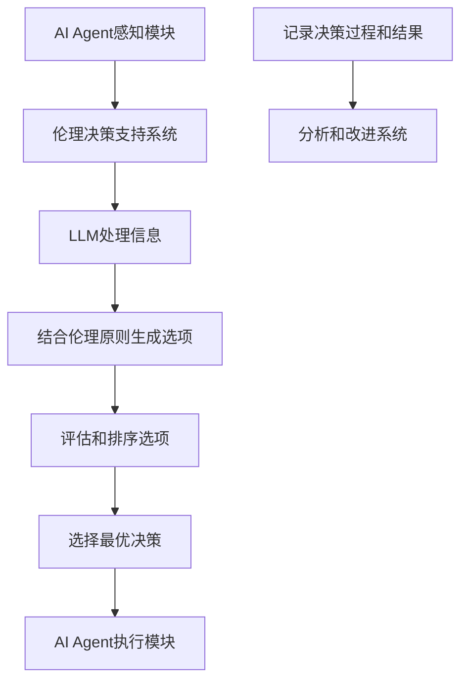

# LLM驱动的AI Agent伦理决策支持系统

> 关键词：LLM（大语言模型）、AI Agent（人工智能智能体）、伦理决策、支持系统、道德推理、伦理困境

> 摘要：本文聚焦于LLM驱动的AI Agent伦理决策支持系统。随着人工智能技术的快速发展，AI Agent在各个领域的应用日益广泛，其伦理决策问题也愈发受到关注。大语言模型（LLM）凭借其强大的语言理解和生成能力，为AI Agent的伦理决策提供了新的思路和方法。本文将深入探讨该系统的背景、核心概念、算法原理、数学模型、项目实战、实际应用场景等内容，旨在全面剖析这一系统，为相关研究和实践提供参考，推动人工智能在伦理框架内的健康发展。

## 1. 背景介绍 
### 1.1 目的和范围
目的：本研究旨在设计和开发一个基于LLM的AI Agent伦理决策支持系统，以解决AI Agent在面对复杂伦理问题时的决策困境，确保AI Agent的行为符合人类社会的伦理道德标准。通过该系统，提高AI Agent在各种应用场景下的伦理决策能力，增强其可解释性和可信度，促进人工智能技术与人类社会的和谐共生。
范围：本研究涵盖了LLM和AI Agent的基本概念、伦理决策的理论基础、系统的架构设计、算法实现、数学模型的构建、实际应用场景的分析等方面。同时，还对相关的工具和资源进行了推荐，对未来的发展趋势和挑战进行了探讨。

### 1.2 预期读者
本文的预期读者包括人工智能领域的研究人员、开发者、伦理学家、政策制定者以及对AI伦理问题感兴趣的相关人士。研究人员可以从本文中获取关于LLM驱动的AI Agent伦理决策支持系统的最新研究进展和技术思路；开发者可以借鉴本文中的算法实现和项目实战经验，进行相关系统的开发和优化；伦理学家可以从伦理理论和实践的角度对系统进行深入思考和评估；政策制定者可以根据本文的研究结果，制定相关的政策和法规，引导人工智能技术的健康发展；对AI伦理问题感兴趣的相关人士可以通过本文了解AI Agent伦理决策的重要性和相关技术。

### 1.3 文档结构概述
本文共分为十个部分。第一部分为背景介绍，阐述了研究的目的、范围、预期读者和文档结构概述，并对相关术语进行了定义和解释。第二部分介绍了核心概念与联系，包括LLM、AI Agent和伦理决策的基本概念，以及它们之间的关系，并通过文本示意图和Mermaid流程图进行了直观展示。第三部分详细讲解了核心算法原理和具体操作步骤，通过Python源代码进行了详细阐述。第四部分介绍了数学模型和公式，并进行了详细讲解和举例说明。第五部分进行了项目实战，包括开发环境搭建、源代码详细实现和代码解读、代码解读与分析。第六部分分析了实际应用场景。第七部分推荐了相关的工具和资源，包括学习资源、开发工具框架和相关论文著作。第八部分对未来的发展趋势和挑战进行了总结。第九部分为附录，解答了常见问题。第十部分提供了扩展阅读和参考资料。

### 1.4 术语表
#### 1.4.1 核心术语定义
- **LLM（大语言模型）**：是一种基于深度学习的语言模型，通过在大规模文本数据上进行训练，学习语言的模式和规律，能够生成自然语言文本，具有强大的语言理解和生成能力。
- **AI Agent（人工智能智能体）**：是一种能够感知环境、进行推理和决策，并通过执行器对环境产生影响的智能实体。它可以是软件程序、机器人或其他智能设备。
- **伦理决策**：是指在面临道德困境时，根据一定的伦理原则和价值观，选择合适的行为或决策的过程。
- **伦理决策支持系统**：是一种辅助决策者进行伦理决策的系统，通过提供相关的信息、分析工具和决策建议，帮助决策者做出更加合理和符合伦理的决策。

#### 1.4.2 相关概念解释
- **道德推理**：是指运用道德原则和价值观，对具体的道德问题进行分析和判断的过程。在AI Agent伦理决策中，道德推理是确定合适行为的关键环节。
- **伦理困境**：是指在道德决策中，面临多个相互冲突的道德原则或价值观，难以做出选择的情况。AI Agent在实际应用中经常会遇到各种伦理困境，需要有效的决策支持。
- **可解释性**：是指系统的决策过程和结果能够被人类理解和解释的程度。在AI Agent伦理决策中，可解释性是确保系统可信度和接受度的重要因素。

#### 1.4.3 缩略词列表
- **LLM**：Large Language Model（大语言模型）
- **AI**：Artificial Intelligence（人工智能）
- **API**：Application Programming Interface（应用程序编程接口）

## 2. 核心概念与联系 
### 核心概念原理
#### LLM（大语言模型）
LLM基于深度学习技术，通常采用Transformer架构。Transformer架构由编码器和解码器组成，通过自注意力机制能够捕捉文本中不同位置之间的依赖关系。在训练过程中，LLM使用大规模的文本数据进行无监督学习，学习语言的统计规律和语义信息。训练完成后，LLM可以根据输入的文本生成相关的文本输出。例如，给定一个问题，LLM可以生成对应的答案。其原理是通过对大量文本的学习，模型能够预测下一个可能出现的词，从而生成连贯的文本。

#### AI Agent（人工智能智能体）
AI Agent是一个能够自主感知环境、进行推理和决策，并采取行动的智能实体。它通常由感知模块、决策模块和执行模块组成。感知模块负责收集环境信息，决策模块根据感知到的信息和预设的目标进行推理和决策，执行模块则将决策转化为具体的行动。例如，一个智能机器人作为AI Agent，它的摄像头和传感器可以作为感知模块，内部的算法和模型作为决策模块，机械臂和轮子作为执行模块。

#### 伦理决策
伦理决策是在面临道德困境时，根据一定的伦理原则和价值观选择合适行为的过程。伦理原则包括功利主义、义务论、美德伦理等。功利主义强调行为的后果，追求最大多数人的最大幸福；义务论强调行为的道德义务和责任；美德伦理强调培养良好的品德和习惯。在实际的伦理决策中，需要综合考虑这些原则和具体的情境。

### 架构的文本示意图
LLM驱动的AI Agent伦理决策支持系统的架构可以描述如下：

AI Agent通过感知模块获取环境信息，将信息输入到伦理决策支持系统中。伦理决策支持系统利用LLM对输入信息进行处理和分析，结合预设的伦理原则和价值观，生成可能的决策选项。然后，系统对这些选项进行评估和排序，选择最合适的决策。最后，将决策结果反馈给AI Agent的执行模块，使其采取相应的行动。同时，系统还会记录决策过程和结果，以便后续的分析和改进。

### Mermaid流程图


## 3. 核心算法原理 & 具体操作步骤 
### 算法原理
本系统的核心算法主要包括信息处理、伦理推理和决策选择三个部分。

#### 信息处理
使用LLM对AI Agent感知到的环境信息进行处理和理解。LLM可以将输入的文本信息转换为向量表示，以便后续的处理。例如，使用预训练的LLM如GPT系列或BERT，将文本信息输入到模型中，获取其对应的向量表示。

#### 伦理推理
根据预设的伦理原则和价值观，对处理后的信息进行推理。可以使用规则引擎或机器学习模型来实现伦理推理。规则引擎根据预先定义的伦理规则对信息进行判断，机器学习模型则通过训练来学习伦理决策的模式。

#### 决策选择
对推理得到的多个决策选项进行评估和排序，选择最优的决策。可以使用多属性决策方法，如层次分析法（AHP）或TOPSIS法，考虑多个因素对决策选项进行综合评估。

### 具体操作步骤
#### 步骤1：数据输入
AI Agent的感知模块将环境信息以文本形式输入到伦理决策支持系统中。

#### 步骤2：信息处理
使用LLM对输入的文本信息进行处理，获取其向量表示。以下是使用Python和Hugging Face的transformers库实现的示例代码：
```python
from transformers import AutoTokenizer, AutoModel
import torch

# 加载预训练的模型和分词器
tokenizer = AutoTokenizer.from_pretrained('bert-base-uncased')
model = AutoModel.from_pretrained('bert-base-uncased')

# 输入文本
text = "AI Agent在这个场景中面临一个伦理问题"

# 分词
inputs = tokenizer(text, return_tensors='pt')

# 获取模型输出
with torch.no_grad():
    outputs = model(**inputs)

# 获取向量表示
embedding = outputs.last_hidden_state.mean(dim=1).squeeze()
print(embedding)
```

#### 步骤3：伦理推理
根据预设的伦理规则或训练好的机器学习模型对处理后的信息进行推理，生成可能的决策选项。以下是一个简单的规则引擎示例：
```python
# 预设的伦理规则
ethics_rules = {
    "rule1": "如果AI Agent的行为会对人类造成伤害，则不应该执行",
    "rule2": "如果AI Agent的行为能带来最大多数人的最大幸福，则优先选择"
}

# 示例信息
info = "AI Agent的某个行为可能会对人类造成轻微伤害"

# 伦理推理
def ethical_reasoning(info, rules):
    for rule in rules.values():
        if "会对人类造成伤害" in info and "不应该执行" in rule:
            return "不执行该行为"
    return "需要进一步评估"

result = ethical_reasoning(info, ethics_rules)
print(result)
```

#### 步骤4：决策选择
使用多属性决策方法对生成的决策选项进行评估和排序，选择最优的决策。以下是一个简单的层次分析法示例：
```python
import numpy as np

# 决策选项
options = ["选项1", "选项2", "选项3"]

# 各选项的属性得分矩阵
scores = np.array([[8, 6, 7], [7, 8, 6], [6, 7, 8]])

# 属性权重向量
weights = np.array([0.4, 0.3, 0.3])

# 计算综合得分
scores_sum = np.sum(scores * weights, axis=1)

# 选择得分最高的选项
best_option_index = np.argmax(scores_sum)
best_option = options[best_option_index]
print("最优决策选项：", best_option)
```

#### 步骤5：结果反馈
将选择的最优决策反馈给AI Agent的执行模块，使其采取相应的行动。

#### 步骤6：记录和分析
记录决策过程和结果，以便后续的分析和改进。可以将决策信息存储在数据库中，定期进行数据分析，评估系统的性能和伦理决策的合理性。

## 4. 数学模型和公式 & 详细讲解 & 举例说明 
### 信息处理的数学模型
在信息处理阶段，使用LLM将文本信息转换为向量表示。假设输入的文本为 $x = [x_1, x_2, \cdots, x_n]$，其中 $x_i$ 表示文本中的第 $i$ 个词。LLM可以表示为一个函数 $f$，将输入文本 $x$ 映射到向量空间 $V$ 中，得到向量表示 $v = f(x)$。

例如，在使用BERT模型时，BERT首先将输入文本进行分词，然后通过多层Transformer编码器进行处理，最后得到每个词的隐藏状态向量。可以取所有词的隐藏状态向量的平均值作为整个文本的向量表示。

### 伦理推理的数学模型
伦理推理可以使用规则引擎或机器学习模型来实现。

#### 规则引擎
规则引擎基于一系列的伦理规则进行推理。假设伦理规则可以表示为条件 - 动作对 $(C, A)$，其中 $C$ 是条件，$A$ 是动作。对于输入的信息 $I$，如果满足条件 $C$，则执行动作 $A$。

例如，规则 “如果AI Agent的行为会对人类造成伤害，则不应该执行” 可以表示为 $(C: \text{行为会对人类造成伤害}, A: \text{不执行该行为})$。

#### 机器学习模型
机器学习模型可以通过训练来学习伦理决策的模式。假设训练数据集为 $D = \{(x_1, y_1), (x_2, y_2), \cdots, (x_m, y_m)\}$，其中 $x_i$ 是输入信息的特征向量，$y_i$ 是对应的伦理决策标签。可以使用分类算法（如逻辑回归、支持向量机等）来训练模型。

逻辑回归的数学模型可以表示为：
$$P(y = 1|x) = \frac{1}{1 + e^{-(w^T x + b)}}$$
其中 $w$ 是权重向量，$b$ 是偏置项，$P(y = 1|x)$ 表示输入 $x$ 属于正类的概率。

### 决策选择的数学模型
在决策选择阶段，使用多属性决策方法对决策选项进行评估和排序。以层次分析法（AHP）为例，其数学模型如下：

#### 步骤1：构建判断矩阵
假设存在 $n$ 个决策选项，每个选项有 $m$ 个属性。对于每个属性，构建一个 $n \times n$ 的判断矩阵 $A = (a_{ij})_{n \times n}$，其中 $a_{ij}$ 表示选项 $i$ 相对于选项 $j$ 在该属性下的重要性程度。

#### 步骤2：计算特征向量和特征值
计算判断矩阵 $A$ 的最大特征值 $\lambda_{max}$ 和对应的特征向量 $w$。特征向量 $w$ 即为各选项在该属性下的权重向量。

#### 步骤3：一致性检验
计算一致性指标 $CI$ 和随机一致性指标 $RI$，并计算一致性比率 $CR = \frac{CI}{RI}$。当 $CR < 0.1$ 时，认为判断矩阵具有满意的一致性。

#### 步骤4：综合评估
将各属性的权重向量与选项的属性得分矩阵相乘，得到各选项的综合得分，选择得分最高的选项作为最优决策。

例如，假设有三个决策选项 $A_1$、$A_2$、$A_3$，两个属性 $P_1$ 和 $P_2$，属性 $P_1$ 的判断矩阵为：
$$A_1 = \begin{bmatrix}
1 & 3 & 5 \\
\frac{1}{3} & 1 & 3 \\
\frac{1}{5} & \frac{1}{3} & 1
\end{bmatrix}$$
计算其最大特征值 $\lambda_{max} \approx 3.0385$，对应的特征向量 $w_1 \approx [0.6484, 0.2631, 0.0885]^T$。

属性 $P_2$ 的判断矩阵为：
$$A_2 = \begin{bmatrix}
1 & \frac{1}{3} & \frac{1}{5} \\
3 & 1 & \frac{1}{3} \\
5 & 3 & 1
\end{bmatrix}$$
计算其最大特征值 $\lambda_{max} \approx 3.0385$，对应的特征向量 $w_2 \approx [0.0885, 0.2631, 0.6484]^T$。

假设属性 $P_1$ 和 $P_2$ 的权重分别为 $0.6$ 和 $0.4$，选项的属性得分矩阵为：
$$S = \begin{bmatrix}
8 & 6 \\
7 & 8 \\
6 & 7
\end{bmatrix}$$
则各选项的综合得分向量为：
$$\text{Score} = 0.6 \times S \times w_1 + 0.4 \times S \times w_2$$
计算可得各选项的综合得分，选择得分最高的选项作为最优决策。

## 5. 项目实战：代码实际案例和详细解释说明 
### 5.1  开发环境搭建
#### 硬件环境
- 服务器或高性能计算机，建议具备至少8GB以上的内存和NVIDIA GPU（如NVIDIA GeForce RTX 30系列或更高），以加速深度学习模型的训练和推理。
- 存储设备，建议至少有500GB以上的可用存储空间，用于存储数据和模型文件。

#### 软件环境
- 操作系统：Ubuntu 20.04或Windows 10及以上版本。
- Python环境：Python 3.7及以上版本，建议使用Anaconda来管理Python环境。
- 深度学习框架：PyTorch 1.8及以上版本，用于实现深度学习模型。
- 其他库：Hugging Face的transformers库，用于加载和使用预训练的LLM；numpy、pandas等库，用于数据处理和分析；matplotlib库，用于数据可视化。

#### 安装步骤
1. 安装Anaconda：从Anaconda官方网站下载对应操作系统的安装包，按照安装向导进行安装。
2. 创建Python虚拟环境：打开终端或命令提示符，运行以下命令创建一个新的Python虚拟环境：
```bash
conda create -n ai_ethics python=3.8
conda activate ai_ethics
```
3. 安装PyTorch：根据自己的GPU情况，选择合适的PyTorch版本进行安装。例如，对于NVIDIA GPU，可以运行以下命令：
```bash
pip install torch torchvision torchaudio --extra-index-url https://download.pytorch.org/whl/cu113
```
4. 安装其他库：运行以下命令安装所需的其他库：
```bash
pip install transformers numpy pandas matplotlib
```

### 5.2  源代码详细实现和代码解读
#### 整体架构
本项目的整体架构包括信息处理模块、伦理推理模块和决策选择模块。以下是各个模块的详细实现和代码解读。

#### 信息处理模块
```python
from transformers import AutoTokenizer, AutoModel
import torch

class InformationProcessor:
    def __init__(self, model_name='bert-base-uncased'):
        # 加载预训练的模型和分词器
        self.tokenizer = AutoTokenizer.from_pretrained(model_name)
        self.model = AutoModel.from_pretrained(model_name)

    def process_text(self, text):
        # 分词
        inputs = self.tokenizer(text, return_tensors='pt')
        # 获取模型输出
        with torch.no_grad():
            outputs = self.model(**inputs)
        # 获取向量表示
        embedding = outputs.last_hidden_state.mean(dim=1).squeeze()
        return embedding

# 使用示例
processor = InformationProcessor()
text = "AI Agent在这个场景中面临一个伦理问题"
embedding = processor.process_text(text)
print(embedding)
```
**代码解读**：
- `__init__` 方法：初始化信息处理模块，加载预训练的模型和分词器。
- `process_text` 方法：对输入的文本进行分词，将其输入到模型中，获取模型的输出，然后取所有词的隐藏状态向量的平均值作为整个文本的向量表示。

#### 伦理推理模块
```python
class EthicalReasoner:
    def __init__(self):
        # 预设的伦理规则
        self.ethics_rules = {
            "rule1": "如果AI Agent的行为会对人类造成伤害，则不应该执行",
            "rule2": "如果AI Agent的行为能带来最大多数人的最大幸福，则优先选择"
        }

    def ethical_reasoning(self, info):
        for rule in self.ethics_rules.values():
            if "会对人类造成伤害" in info and "不应该执行" in rule:
                return "不执行该行为"
        return "需要进一步评估"

# 使用示例
reasoner = EthicalReasoner()
info = "AI Agent的某个行为可能会对人类造成轻微伤害"
result = reasoner.ethical_reasoning(info)
print(result)
```
**代码解读**：
- `__init__` 方法：初始化伦理推理模块，定义预设的伦理规则。
- `ethical_reasoning` 方法：根据预设的伦理规则对输入的信息进行推理，返回相应的决策结果。

#### 决策选择模块
```python
import numpy as np

class DecisionSelector:
    def __init__(self, options, weights):
        self.options = options
        self.weights = weights

    def select_decision(self, scores):
        # 计算综合得分
        scores_sum = np.sum(scores * self.weights, axis=1)
        # 选择得分最高的选项
        best_option_index = np.argmax(scores_sum)
        best_option = self.options[best_option_index]
        return best_option

# 使用示例
options = ["选项1", "选项2", "选项3"]
weights = np.array([0.4, 0.3, 0.3])
scores = np.array([[8, 6, 7], [7, 8, 6], [6, 7, 8]])
selector = DecisionSelector(options, weights)
best_option = selector.select_decision(scores)
print("最优决策选项：", best_option)
```
**代码解读**：
- `__init__` 方法：初始化决策选择模块，传入决策选项和属性权重向量。
- `select_decision` 方法：根据选项的属性得分矩阵和属性权重向量，计算各选项的综合得分，选择得分最高的选项作为最优决策。

### 5.3  代码解读与分析
#### 信息处理模块
- 优点：使用预训练的LLM可以充分利用大规模文本数据的知识，将文本信息转换为有效的向量表示，便于后续的处理和分析。
- 缺点：预训练的LLM通常比较大，需要较高的计算资源和内存，推理速度可能较慢。

#### 伦理推理模块
- 优点：规则引擎简单直观，易于理解和实现，可以快速根据预设的伦理规则进行推理。
- 缺点：规则引擎的规则是固定的，难以处理复杂和动态的伦理问题，缺乏灵活性和适应性。

#### 决策选择模块
- 优点：多属性决策方法可以综合考虑多个因素，对决策选项进行全面的评估和排序，选择最优的决策。
- 缺点：需要准确确定各属性的权重，权重的确定可能存在主观性，影响决策结果的准确性。

## 6. 实际应用场景 
### 自动驾驶领域
在自动驾驶汽车中，AI Agent需要在各种复杂的交通场景下做出决策。例如，当面临突然出现的行人时，自动驾驶汽车的AI Agent需要快速判断是刹车、避让还是采取其他措施。LLM驱动的AI Agent伦理决策支持系统可以根据预设的伦理原则（如保护行人生命安全优先），结合当前的交通环境信息，为AI Agent提供合理的决策建议。如果刹车可能会导致后面的车辆追尾，而避让可能会撞到其他物体，系统可以综合考虑各种因素，选择对整体伤害最小的决策。

### 医疗领域
在医疗决策中，AI Agent可以辅助医生进行诊断和治疗方案的选择。例如，对于患有严重疾病的患者，可能有多种治疗方案可供选择，每种方案都有不同的风险和收益。LLM驱动的AI Agent伦理决策支持系统可以根据患者的病情、年龄、身体状况等信息，结合伦理原则（如尊重患者的自主权、不伤害患者等），为医生提供决策支持。系统可以分析各种治疗方案的利弊，考虑患者的意愿和价值观，帮助医生做出更加符合伦理的决策。

### 金融领域
在金融投资中，AI Agent可以根据市场信息和客户的需求，为客户提供投资建议。然而，不同的投资策略可能会带来不同的风险和收益，同时也可能涉及到伦理问题，如是否公平对待客户、是否存在欺诈行为等。LLM驱动的AI Agent伦理决策支持系统可以对投资策略进行伦理评估，结合市场信息和客户的风险偏好，为AI Agent提供合理的投资建议。系统可以确保投资建议符合伦理原则，保护客户的利益。

### 智能客服领域
在智能客服系统中，AI Agent需要与客户进行交互，解答客户的问题，处理客户的投诉等。在交互过程中，可能会遇到各种伦理问题，如是否尊重客户的隐私、是否提供准确的信息等。LLM驱动的AI Agent伦理决策支持系统可以对客户的问题和AI Agent的回答进行伦理分析，确保AI Agent的回答符合伦理原则。例如，如果客户询问关于个人隐私的问题，系统可以提醒AI Agent按照相关规定进行回答，保护客户的隐私。

## 7. 工具和资源推荐
### 7.1 学习资源推荐
#### 7.1.1 书籍推荐
- 《人工智能伦理》：本书全面介绍了人工智能领域的伦理问题，包括伦理原则、伦理困境的解决方法等，对理解AI Agent伦理决策的理论基础有很大帮助。
- 《Python深度学习》：详细介绍了Python在深度学习中的应用，包括深度学习模型的构建、训练和优化等，对于实现LLM驱动的AI Agent伦理决策支持系统的算法有重要的参考价值。
- 《多属性决策方法及其应用》：系统介绍了多属性决策的理论和方法，为决策选择模块的实现提供了理论支持。

#### 7.1.2 在线课程
- Coursera上的“人工智能基础”课程：该课程由知名高校的教授授课，全面介绍了人工智能的基本概念、算法和应用，对于初学者了解人工智能领域有很大帮助。
- edX上的“深度学习”课程：深入讲解了深度学习的原理和实践，包括神经网络、卷积神经网络、循环神经网络等，对于掌握深度学习技术有重要作用。
- 中国大学MOOC上的“人工智能伦理与安全”课程：专门探讨了人工智能领域的伦理和安全问题，为理解AI Agent伦理决策的重要性和方法提供了深入的学习资源。

#### 7.1.3 技术博客和网站
- Hugging Face官方博客：提供了关于大语言模型的最新研究进展和技术应用案例，对于了解LLM的发展动态和使用方法有很大帮助。
- Medium上的人工智能相关博客：有很多专业人士分享的关于人工智能技术和伦理问题的文章，内容丰富多样，具有很高的参考价值。
- arXiv.org：一个开放的学术论文预印本平台，提供了大量关于人工智能、机器学习、伦理等领域的最新研究成果，是获取前沿知识的重要渠道。

### 7.2 开发工具框架推荐
#### 7.2.1 IDE和编辑器
- PyCharm：一款功能强大的Python集成开发环境，提供了代码编辑、调试、版本控制等一系列功能，对于开发Python项目非常方便。
- Visual Studio Code：一款轻量级的代码编辑器，支持多种编程语言，有丰富的插件扩展，可用于快速开发和调试AI Agent伦理决策支持系统的代码。

#### 7.2.2 调试和性能分析工具
- PyTorch Profiler：PyTorch提供的性能分析工具，可以帮助开发者分析模型的性能瓶颈，优化代码的运行效率。
- TensorBoard：一个可视化工具，可用于查看模型的训练过程、损失曲线、准确率等指标，帮助开发者更好地理解和优化模型。

#### 7.2.3 相关框架和库
- Hugging Face的transformers库：提供了丰富的预训练语言模型和工具，方便开发者快速使用和微调大语言模型，实现信息处理模块的功能。
- scikit-learn库：一个常用的机器学习库，提供了各种机器学习算法和工具，可用于实现伦理推理模块中的机器学习模型。
- numpy和pandas库：用于数据处理和分析，在决策选择模块中可以方便地处理选项的属性得分矩阵和权重向量。

### 7.3 相关论文著作推荐
#### 7.3.1 经典论文
- “Attention Is All You Need”：介绍了Transformer架构，是大语言模型的基础，对于理解LLM的原理和实现有重要意义。
- “Utilitarianism”：约翰·斯图尔特·密尔的经典著作，阐述了功利主义的伦理思想，为AI Agent伦理决策提供了重要的伦理原则参考。
- “Grounding AI in Human Values”：探讨了如何将人类价值观融入人工智能系统中，对于实现AI Agent的伦理决策具有指导作用。

#### 7.3.2 最新研究成果
- 关注顶级学术会议如NeurIPS、ICML、AAAI等上关于AI伦理和AI Agent决策的最新研究论文，了解该领域的前沿技术和研究动态。
- 关注知名学术期刊如Journal of Artificial Intelligence Research、Artificial Intelligence等上发表的相关研究成果。

#### 7.3.3 应用案例分析
- 研究一些实际应用中的AI Agent伦理决策案例，如自动驾驶汽车的伦理决策案例、医疗AI的伦理决策案例等，从中学习经验和教训，为自己的项目提供参考。

## 8. 总结：未来发展趋势与挑战
### 未来发展趋势
#### 更强大的LLM
随着深度学习技术的不断发展，未来的大语言模型将更加庞大和强大，具有更高的语言理解和生成能力。这将为AI Agent伦理决策支持系统提供更准确和全面的信息处理和推理能力，能够更好地理解复杂的伦理问题和情境。

#### 融合多模态信息
未来的系统将不仅仅依赖于文本信息，还将融合图像、语音等多模态信息。例如，在自动驾驶场景中，结合图像识别技术可以更准确地感知交通环境，为伦理决策提供更丰富的信息。

#### 个性化伦理决策
考虑到不同用户的价值观和伦理偏好可能存在差异，未来的系统将实现个性化的伦理决策。根据用户的历史行为、偏好和价值观，为用户定制符合其需求的伦理决策方案。

#### 与人类协作的智能体
AI Agent将越来越多地与人类进行协作，共同完成各种任务。在协作过程中，伦理决策支持系统将发挥重要作用，确保AI Agent的行为与人类的伦理观念相一致，实现人机和谐共处。

### 挑战
#### 伦理原则的多样性和冲突
不同的文化、宗教和个人可能有不同的伦理原则和价值观，如何在系统中统一和协调这些多样性的伦理原则，处理伦理原则之间的冲突，是一个巨大的挑战。

#### 可解释性和透明度
虽然LLM具有强大的语言处理能力，但它的决策过程往往是黑盒的，缺乏可解释性。在伦理决策中，可解释性是非常重要的，因为用户需要理解系统为什么做出这样的决策。如何提高系统的可解释性和透明度，是需要解决的关键问题。

#### 数据隐私和安全
系统在运行过程中需要处理大量的用户数据和敏感信息，如个人隐私、医疗数据等。如何确保数据的隐私和安全，防止数据泄露和滥用，是系统开发和应用中必须重视的问题。

#### 法律法规的不完善
目前，关于AI伦理的法律法规还不完善，缺乏明确的标准和规范。这使得系统的开发和应用缺乏有效的法律约束和指导，增加了系统的法律风险。

## 9. 附录：常见问题与解答
### 问题1：LLM在伦理决策支持系统中起到什么作用？
答：LLM在伦理决策支持系统中主要起到信息处理和理解的作用。它可以将AI Agent感知到的环境信息（通常是文本形式）转换为向量表示，便于后续的处理和分析。同时，LLM还可以利用其强大的语言理解能力，对信息进行语义分析，帮助系统更好地理解伦理问题和情境。

### 问题2：如何确定伦理规则和价值观？
答：伦理规则和价值观的确定是一个复杂的过程，需要综合考虑多方面的因素。可以参考现有的伦理理论和原则，如功利主义、义务论、美德伦理等。同时，还需要结合具体的应用场景和用户需求，进行深入的调研和分析。此外，也可以通过专家咨询、公众参与等方式，广泛征求意见，确保伦理规则和价值观的合理性和可接受性。

### 问题3：系统的可解释性如何实现？
答：实现系统的可解释性可以从多个方面入手。一方面，可以采用可解释的机器学习算法，如决策树、规则引擎等，这些算法的决策过程比较直观，易于理解。另一方面，可以对LLM的决策过程进行分析和解释，例如通过可视化技术展示模型的注意力机制，说明模型在决策过程中关注的重点信息。此外，还可以提供决策的依据和推理过程的文本解释，让用户能够清楚地了解系统为什么做出这样的决策。

### 问题4：系统如何保证数据的隐私和安全？
答：为了保证数据的隐私和安全，可以采取以下措施。首先，对数据进行加密处理，确保数据在传输和存储过程中的安全性。其次，采用访问控制技术，限制只有授权人员才能访问和处理数据。此外，还可以定期对数据进行备份，防止数据丢失。同时，遵守相关的法律法规和行业标准，确保数据的使用符合规定。

### 问题5：系统的性能如何优化？
答：系统的性能优化可以从多个方面进行。在硬件方面，可以使用高性能的服务器和GPU，提高计算能力。在软件方面，可以对模型进行优化，如采用轻量级的模型结构、量化技术等，减少模型的计算量和内存占用。此外，还可以对代码进行优化，采用并行计算、异步处理等技术，提高代码的运行效率。同时，合理调整系统的参数和配置，也可以提高系统的性能。

## 10. 扩展阅读 & 参考资料
### 扩展阅读
- 《人类简史：从动物到上帝》：从人类的发展历程角度探讨人类的价值观和伦理观念的形成，有助于深入理解AI Agent伦理决策的背景和意义。
- 《未来简史：从智人到神人》：对未来社会的发展趋势进行了大胆的预测，包括人工智能对人类社会的影响，为思考AI Agent伦理决策的未来发展提供了广阔的视野。
- 《奇点临近》：探讨了人工智能技术的快速发展可能带来的奇点，以及人类如何应对这一挑战，对于理解AI Agent伦理决策的重要性和紧迫性有很大帮助。

### 参考资料
- Hugging Face官方文档：https://huggingface.co/docs
- PyTorch官方文档：https://pytorch.org/docs/stable/index.html
- scikit-learn官方文档：https://scikit-learn.org/stable/documentation.html
- 相关学术论文和研究报告：可通过学术数据库如IEEE Xplore、ACM Digital Library、Web of Science等获取。