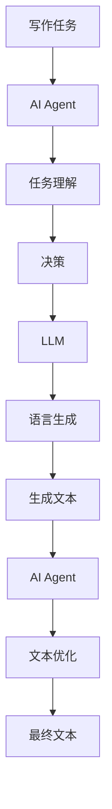

# LLM驱动的AI Agent创造性写作能力

> 关键词：LLM、AI Agent、创造性写作、自然语言处理、语言模型、写作能力、人工智能

> 摘要：本文围绕LLM驱动的AI Agent创造性写作能力展开深入探讨。首先介绍相关背景知识，包括目的、预期读者等内容。接着阐述核心概念及联系，剖析其原理和架构。详细讲解核心算法原理与具体操作步骤，结合Python源代码进行说明。给出数学模型和公式并举例。通过项目实战展示代码实际案例并进行详细解释。分析实际应用场景，推荐相关工具和资源。最后总结未来发展趋势与挑战，提供常见问题解答及扩展阅读参考资料，旨在全面且深入地剖析LLM驱动的AI Agent创造性写作能力这一前沿领域。

## 1. 背景介绍 
### 1.1 目的和范围
随着人工智能技术的飞速发展，自然语言处理领域取得了显著的进步。LLM（大语言模型）的出现为AI Agent的发展带来了新的机遇。本文章的目的在于深入探讨LLM驱动的AI Agent在创造性写作方面的能力，包括其原理、算法、应用场景等内容。范围涵盖了从基础概念到实际应用的各个方面，旨在为读者全面呈现这一技术领域的知识体系。

### 1.2 预期读者
本文预期读者包括对自然语言处理、人工智能、创造性写作等领域感兴趣的科研人员、开发者、学生以及相关从业人员。对于希望深入了解LLM驱动的AI Agent创造性写作能力的人士，本文将提供有价值的参考和技术指导。

### 1.3 文档结构概述
本文将按照以下结构进行组织：首先介绍背景知识，包括目的、读者和文档结构等内容；接着阐述核心概念与联系，通过文本示意图和Mermaid流程图展示其原理和架构；详细讲解核心算法原理和具体操作步骤，并使用Python源代码进行说明；给出数学模型和公式并举例；通过项目实战展示代码实际案例并进行详细解释；分析实际应用场景；推荐相关工具和资源；总结未来发展趋势与挑战；提供常见问题解答及扩展阅读参考资料。

### 1.4 术语表
#### 1.4.1 核心术语定义
- **LLM（大语言模型）**：一种基于深度学习的语言模型，通过在大规模文本数据上进行训练，学习语言的模式和规律，能够生成自然流畅的文本。
- **AI Agent（人工智能智能体）**：一种能够感知环境、做出决策并采取行动的智能实体，在自然语言处理领域，AI Agent可以利用LLM进行语言理解和生成。
- **创造性写作**：指创作具有独特性、新颖性和想象力的文本，如文学作品、故事、诗歌等。

#### 1.4.2 相关概念解释
- **自然语言处理（NLP）**：是人工智能的一个子领域，致力于让计算机理解、处理和生成人类语言。
- **深度学习**：是一种基于人工神经网络的机器学习方法，通过多层神经网络自动学习数据的特征和模式。

#### 1.4.3 缩略词列表
- **LLM**：Large Language Model（大语言模型）
- **AI**：Artificial Intelligence（人工智能）
- **NLP**：Natural Language Processing（自然语言处理）

## 2. 核心概念与联系 

### 核心概念原理
LLM驱动的AI Agent创造性写作能力基于大语言模型的强大语言生成能力。大语言模型通过在大规模文本数据上进行无监督学习，学习到了语言的统计规律和语义信息。AI Agent则作为一个智能实体，利用LLM的语言生成能力，结合自身的决策机制，进行创造性写作。

AI Agent在接收到写作任务后，首先对任务进行理解和分析，提取关键信息。然后，AI Agent利用LLM生成相关的文本内容。在生成过程中，AI Agent可以根据不同的策略和规则，对生成的文本进行调整和优化，以实现创造性写作的目的。

### 架构的文本示意图
```plaintext
写作任务 -> AI Agent（任务理解、决策） -> LLM（语言生成） -> 生成文本 -> AI Agent（文本优化） -> 最终文本
```

### Mermaid流程图


## 3. 核心算法原理 & 具体操作步骤 

### 核心算法原理
LLM驱动的AI Agent创造性写作主要基于以下几个核心算法：

#### 1. 语言模型算法
以GPT（Generative Pretrained Transformer）系列模型为例，其核心是Transformer架构。Transformer架构通过自注意力机制（Self-Attention）来捕捉文本中的长距离依赖关系。自注意力机制的公式如下：

$$Attention(Q, K, V) = softmax(\frac{QK^T}{\sqrt{d_k}})V$$

其中，$Q$ 是查询矩阵，$K$ 是键矩阵，$V$ 是值矩阵，$d_k$ 是键向量的维度。

#### 2. 强化学习算法
为了让AI Agent能够进行创造性写作，我们可以使用强化学习算法对其进行训练。例如，使用策略梯度算法（Policy Gradient）来优化AI Agent的写作策略。策略梯度算法的目标是最大化累积奖励，其公式如下：

$$\nabla_{\theta} J(\theta) = \mathbb{E}_{\tau \sim \pi_{\theta}(\tau)}[\sum_{t=0}^{T} \nabla_{\theta} \log \pi_{\theta}(a_t|s_t) R(\tau)]$$

其中，$\theta$ 是策略网络的参数，$\pi_{\theta}(\tau)$ 是策略分布，$a_t$ 是动作，$s_t$ 是状态，$R(\tau)$ 是累积奖励。

### 具体操作步骤

#### 步骤1：数据准备
收集大规模的文本数据，包括各种类型的写作作品，如小说、诗歌、新闻等。对数据进行清洗和预处理，去除噪声和错误信息。

#### 步骤2：训练LLM
使用预处理后的数据对大语言模型进行训练。可以使用开源的大语言模型，如GPT、BERT等，也可以自己构建模型进行训练。

#### 步骤3：构建AI Agent
设计AI Agent的决策机制和策略网络。决策机制用于对写作任务进行理解和分析，策略网络用于生成写作策略。

#### 步骤4：训练AI Agent
使用强化学习算法对AI Agent进行训练。在训练过程中，根据AI Agent生成的文本和预设的奖励函数，计算累积奖励，并更新策略网络的参数。

#### 步骤5：创造性写作
将训练好的AI Agent与LLM结合，进行创造性写作。AI Agent根据写作任务生成写作策略，LLM根据策略生成文本，AI Agent对生成的文本进行优化和调整，最终得到创造性的写作作品。

### Python源代码示例
```python
import torch
import torch.nn as nn
import torch.optim as optim
from transformers import GPT2LMHeadModel, GPT2Tokenizer

# 初始化LLM
tokenizer = GPT2Tokenizer.from_pretrained('gpt2')
model = GPT2LMHeadModel.from_pretrained('gpt2')

# 定义AI Agent的策略网络
class PolicyNetwork(nn.Module):
    def __init__(self):
        super(PolicyNetwork, self).__init__()
        self.fc1 = nn.Linear(768, 256)
        self.fc2 = nn.Linear(256, 128)
        self.fc3 = nn.Linear(128, len(tokenizer))

    def forward(self, x):
        x = torch.relu(self.fc1(x))
        x = torch.relu(self.fc2(x))
        x = self.fc3(x)
        return x

# 初始化AI Agent的策略网络
policy_network = PolicyNetwork()
optimizer = optim.Adam(policy_network.parameters(), lr=0.001)

# 定义奖励函数
def reward_function(text):
    # 简单示例：根据文本长度计算奖励
    return len(text)

# 训练AI Agent
def train_agent(num_episodes):
    for episode in range(num_episodes):
        # 初始化状态
        state = torch.randn(768)

        # 生成文本
        input_ids = tokenizer.encode("Once upon a time", return_tensors='pt')
        for _ in range(100):
            action_probs = torch.softmax(policy_network(state), dim=-1)
            action = torch.multinomial(action_probs, 1).item()
            input_ids = torch.cat([input_ids, torch.tensor([[action]])], dim=-1)
            output = model(input_ids)
            state = output[0][:, -1, :].squeeze()

        # 解码生成的文本
        text = tokenizer.decode(input_ids[0], skip_special_tokens=True)

        # 计算奖励
        reward = reward_function(text)

        # 更新策略网络
        action_probs = torch.softmax(policy_network(state), dim=-1)
        log_prob = torch.log(action_probs[action])
        loss = -log_prob * reward
        optimizer.zero_grad()
        loss.backward()
        optimizer.step()

        if episode % 10 == 0:
            print(f"Episode {episode}: Reward = {reward}, Text = {text}")

# 训练AI Agent
train_agent(num_episodes=100)
```

## 4. 数学模型和公式 & 详细讲解 & 举例说明 

### 语言模型的数学模型和公式
如前面所述，Transformer架构中的自注意力机制是语言模型的核心。自注意力机制的公式为：

$$Attention(Q, K, V) = softmax(\frac{QK^T}{\sqrt{d_k}})V$$

详细讲解：
- $Q$、$K$、$V$ 分别是查询矩阵、键矩阵和值矩阵。它们是通过对输入的词向量进行线性变换得到的。
- $\frac{QK^T}{\sqrt{d_k}}$ 计算了查询向量与键向量之间的相似度得分。除以 $\sqrt{d_k}$ 是为了防止相似度得分过大，导致梯度消失或爆炸。
- $softmax$ 函数将相似度得分转换为概率分布，用于对值矩阵进行加权求和。

举例说明：
假设我们有一个输入序列 $x = [x_1, x_2, x_3]$，每个词向量的维度为 $d = 64$。经过线性变换后，得到 $Q$、$K$、$V$ 矩阵，其中 $Q \in \mathbb{R}^{3 \times 64}$，$K \in \mathbb{R}^{3 \times 64}$，$V \in \mathbb{R}^{3 \times 64}$。

首先计算 $QK^T$：

$$QK^T = \begin{bmatrix}
q_1^T k_1 & q_1^T k_2 & q_1^T k_3 \\
q_2^T k_1 & q_2^T k_2 & q_2^T k_3 \\
q_3^T k_1 & q_3^T k_2 & q_3^T k_3
\end{bmatrix}$$

然后除以 $\sqrt{d_k}$ 并应用 $softmax$ 函数：

$$softmax(\frac{QK^T}{\sqrt{d_k}}) = \begin{bmatrix}
p_{11} & p_{12} & p_{13} \\
p_{21} & p_{22} & p_{23} \\
p_{31} & p_{32} & p_{33}
\end{bmatrix}$$

最后计算 $Attention(Q, K, V)$：

$$Attention(Q, K, V) = \begin{bmatrix}
p_{11} v_1 + p_{12} v_2 + p_{13} v_3 \\
p_{21} v_1 + p_{22} v_2 + p_{23} v_3 \\
p_{31} v_1 + p_{32} v_2 + p_{33} v_3
\end{bmatrix}$$

### 强化学习的数学模型和公式
策略梯度算法的目标是最大化累积奖励，其公式为：

$$\nabla_{\theta} J(\theta) = \mathbb{E}_{\tau \sim \pi_{\theta}(\tau)}[\sum_{t=0}^{T} \nabla_{\theta} \log \pi_{\theta}(a_t|s_t) R(\tau)]$$

详细讲解：
- $\theta$ 是策略网络的参数，$\pi_{\theta}(\tau)$ 是策略分布，表示在参数 $\theta$ 下生成轨迹 $\tau$ 的概率。
- $\nabla_{\theta} \log \pi_{\theta}(a_t|s_t)$ 是策略梯度，表示在状态 $s_t$ 下采取动作 $a_t$ 的概率的对数关于参数 $\theta$ 的梯度。
- $R(\tau)$ 是累积奖励，表示轨迹 $\tau$ 的总奖励。

举例说明：
假设我们有一个简单的写作任务，状态 $s$ 是当前的文本前缀，动作 $a$ 是选择下一个词。策略网络 $\pi_{\theta}(a|s)$ 输出在状态 $s$ 下选择动作 $a$ 的概率。

在一个轨迹 $\tau = [s_0, a_0, s_1, a_1, \cdots, s_T, a_T]$ 中，累积奖励 $R(\tau)$ 可以根据生成的文本质量来计算。例如，根据文本的流畅性、逻辑性等指标计算奖励。

策略梯度 $\nabla_{\theta} \log \pi_{\theta}(a_t|s_t)$ 用于更新策略网络的参数 $\theta$，使得在相同的状态下，选择能够获得更高奖励的动作的概率增加。

## 5. 项目实战：代码实际案例和详细解释说明 

### 5.1  开发环境搭建
#### 安装Python
首先，确保你已经安装了Python 3.7或更高版本。可以从Python官方网站（https://www.python.org/downloads/） 下载并安装Python。

#### 安装依赖库
使用以下命令安装项目所需的依赖库：
```bash
pip install torch transformers
```

### 5.2  源代码详细实现和代码解读
```python
import torch
import torch.nn as nn
import torch.optim as optim
from transformers import GPT2LMHeadModel, GPT2Tokenizer

# 初始化LLM
tokenizer = GPT2Tokenizer.from_pretrained('gpt2')
model = GPT2LMHeadModel.from_pretrained('gpt2')

# 定义AI Agent的策略网络
class PolicyNetwork(nn.Module):
    def __init__(self):
        super(PolicyNetwork, self).__init__()
        self.fc1 = nn.Linear(768, 256)
        self.fc2 = nn.Linear(256, 128)
        self.fc3 = nn.Linear(128, len(tokenizer))

    def forward(self, x):
        x = torch.relu(self.fc1(x))
        x = torch.relu(self.fc2(x))
        x = self.fc3(x)
        return x

# 初始化AI Agent的策略网络
policy_network = PolicyNetwork()
optimizer = optim.Adam(policy_network.parameters(), lr=0.001)

# 定义奖励函数
def reward_function(text):
    # 简单示例：根据文本长度计算奖励
    return len(text)

# 训练AI Agent
def train_agent(num_episodes):
    for episode in range(num_episodes):
        # 初始化状态
        state = torch.randn(768)

        # 生成文本
        input_ids = tokenizer.encode("Once upon a time", return_tensors='pt')
        for _ in range(100):
            action_probs = torch.softmax(policy_network(state), dim=-1)
            action = torch.multinomial(action_probs, 1).item()
            input_ids = torch.cat([input_ids, torch.tensor([[action]])], dim=-1)
            output = model(input_ids)
            state = output[0][:, -1, :].squeeze()

        # 解码生成的文本
        text = tokenizer.decode(input_ids[0], skip_special_tokens=True)

        # 计算奖励
        reward = reward_function(text)

        # 更新策略网络
        action_probs = torch.softmax(policy_network(state), dim=-1)
        log_prob = torch.log(action_probs[action])
        loss = -log_prob * reward
        optimizer.zero_grad()
        loss.backward()
        optimizer.step()

        if episode % 10 == 0:
            print(f"Episode {episode}: Reward = {reward}, Text = {text}")

# 训练AI Agent
train_agent(num_episodes=100)
```

### 代码解读与分析
#### 初始化LLM
```python
tokenizer = GPT2Tokenizer.from_pretrained('gpt2')
model = GPT2LMHeadModel.from_pretrained('gpt2')
```
这两行代码初始化了GPT2的分词器和语言模型。`GPT2Tokenizer` 用于将文本转换为模型可以处理的输入ID，`GPT2LMHeadModel` 用于生成文本。

#### 定义AI Agent的策略网络
```python
class PolicyNetwork(nn.Module):
    def __init__(self):
        super(PolicyNetwork, self).__init__()
        self.fc1 = nn.Linear(768, 256)
        self.fc2 = nn.Linear(256, 128)
        self.fc3 = nn.Linear(128, len(tokenizer))

    def forward(self, x):
        x = torch.relu(self.fc1(x))
        x = torch.relu(self.fc2(x))
        x = self.fc3(x)
        return x
```
`PolicyNetwork` 是一个简单的全连接神经网络，用于生成写作策略。输入是768维的状态向量，输出是每个词的概率分布。

#### 定义奖励函数
```python
def reward_function(text):
    # 简单示例：根据文本长度计算奖励
    return len(text)
```
`reward_function` 用于计算生成文本的奖励。这里简单地根据文本长度计算奖励，实际应用中可以根据文本的质量、创意等指标来设计奖励函数。

#### 训练AI Agent
```python
def train_agent(num_episodes):
    for episode in range(num_episodes):
        # 初始化状态
        state = torch.randn(768)

        # 生成文本
        input_ids = tokenizer.encode("Once upon a time", return_tensors='pt')
        for _ in range(100):
            action_probs = torch.softmax(policy_network(state), dim=-1)
            action = torch.multinomial(action_probs, 1).item()
            input_ids = torch.cat([input_ids, torch.tensor([[action]])], dim=-1)
            output = model(input_ids)
            state = output[0][:, -1, :].squeeze()

        # 解码生成的文本
        text = tokenizer.decode(input_ids[0], skip_special_tokens=True)

        # 计算奖励
        reward = reward_function(text)

        # 更新策略网络
        action_probs = torch.softmax(policy_network(state), dim=-1)
        log_prob = torch.log(action_probs[action])
        loss = -log_prob * reward
        optimizer.zero_grad()
        loss.backward()
        optimizer.step()

        if episode % 10 == 0:
            print(f"Episode {episode}: Reward = {reward}, Text = {text}")
```
`train_agent` 函数用于训练AI Agent。在每个训练周期中，AI Agent根据当前状态生成写作策略，LLM根据策略生成文本，然后计算奖励并更新策略网络的参数。

## 6. 实际应用场景 
### 文学创作
LLM驱动的AI Agent可以用于文学创作，如小说、诗歌、剧本等。AI Agent可以根据给定的主题和风格，生成具有创意和文学性的作品。例如，一些作家可以利用AI Agent作为创作灵感的来源，或者与AI Agent合作完成作品。

### 广告文案生成
在广告领域，AI Agent可以根据产品特点和目标受众，生成吸引人的广告文案。AI Agent可以快速生成多种不同风格的文案，供广告策划人员选择和修改。

### 内容推荐
AI Agent可以根据用户的兴趣和历史行为，生成个性化的内容推荐。例如，在新闻、音乐、电影等领域，AI Agent可以生成推荐文案，引导用户发现感兴趣的内容。

### 智能客服
在智能客服场景中，AI Agent可以根据用户的问题，生成自然流畅的回答。AI Agent可以利用LLM的语言理解和生成能力，提供准确、个性化的服务。

## 7. 工具和资源推荐
### 7.1 学习资源推荐
#### 7.1.1 书籍推荐
- 《深度学习》（Deep Learning）：由Ian Goodfellow、Yoshua Bengio和Aaron Courville所著，是深度学习领域的经典教材。
- 《自然语言处理入门》（Natural Language Processing with Python）：由Steven Bird、Ewan Klein和Edward Loper所著，介绍了自然语言处理的基本概念和方法。
- 《Python自然语言处理实战》（Practical Natural Language Processing）：由Dipanjan Sarkar、Anirban Chakraborty、Sohom Ghosh和Vivek Gupta所著，提供了自然语言处理的实际应用案例。

#### 7.1.2 在线课程
- Coursera上的“深度学习专项课程”（Deep Learning Specialization）：由Andrew Ng教授授课，介绍了深度学习的基本概念和方法。
- edX上的“自然语言处理”（Natural Language Processing）：由Columbia University开设，介绍了自然语言处理的理论和实践。
- Udemy上的“Python自然语言处理实战”（Practical Natural Language Processing with Python）：提供了自然语言处理的实际应用案例和代码实现。

#### 7.1.3 技术博客和网站
- Hugging Face Blog（https://huggingface.co/blog）：提供了自然语言处理领域的最新研究成果和技术应用。
- Towards Data Science（https://towardsdatascience.com/）：是一个数据科学和机器学习领域的技术博客，包含了大量的自然语言处理相关文章。
- OpenAI Blog（https://openai.com/blog/）：OpenAI的官方博客，提供了大语言模型和人工智能领域的最新研究成果。

### 7.2 开发工具框架推荐
#### 7.2.1 IDE和编辑器
- PyCharm：是一款功能强大的Python集成开发环境，提供了代码编辑、调试、版本控制等功能。
- Visual Studio Code：是一款轻量级的代码编辑器，支持多种编程语言和插件扩展，适合快速开发和调试。

#### 7.2.2 调试和性能分析工具
- TensorBoard：是TensorFlow的可视化工具，可以用于查看模型的训练过程和性能指标。
- PyTorch Profiler：是PyTorch的性能分析工具，可以用于分析模型的计算性能和内存使用情况。

#### 7.2.3 相关框架和库
- Transformers：是Hugging Face开发的一个开源库，提供了多种预训练的大语言模型和自然语言处理工具。
- AllenNLP：是一个开源的自然语言处理框架，提供了丰富的模型和工具，用于文本分类、命名实体识别等任务。
- NLTK：是一个Python自然语言处理工具包，提供了多种自然语言处理的功能，如分词、词性标注、句法分析等。

### 7.3 相关论文著作推荐
#### 7.3.1 经典论文
- “Attention Is All You Need”：介绍了Transformer架构，是大语言模型的基础。
- “Improving Language Understanding by Generative Pre-Training”：介绍了GPT模型的预训练方法。
- “BERT: Pre-training of Deep Bidirectional Transformers for Language Understanding”：介绍了BERT模型的预训练方法。

#### 7.3.2 最新研究成果
- 关注arXiv（https://arxiv.org/） 上的最新论文，了解自然语言处理和大语言模型领域的最新研究成果。
- 关注顶级学术会议，如ACL（Annual Meeting of the Association for Computational Linguistics）、EMNLP（Conference on Empirical Methods in Natural Language Processing）等，了解最新的研究进展。

#### 7.3.3 应用案例分析
- 可以参考一些实际应用案例，如AI写作平台的相关论文和报告，了解LLM驱动的AI Agent在创造性写作方面的应用实践。

## 8. 总结：未来发展趋势与挑战
### 未来发展趋势
- **更强的创造性**：未来的LLM驱动的AI Agent将具有更强的创造性，能够生成更加新颖、独特的写作作品。例如，能够创造出具有独特风格和深刻思想的文学作品。
- **多模态融合**：AI Agent将与图像、音频等多模态信息融合，实现更加丰富和生动的写作。例如，结合图像生成具有画面感的文字描述，或者结合音频生成富有韵律的诗歌。
- **个性化定制**：能够根据用户的个性化需求和偏好，生成定制化的写作作品。例如，根据用户的年龄、性别、兴趣爱好等因素，生成适合用户的小说、故事等。
- **跨语言写作**：支持多种语言的写作，打破语言障碍，实现全球范围内的信息交流和文化传播。

### 挑战
- **伦理和道德问题**：AI Agent生成的内容可能存在虚假信息、偏见、侵权等伦理和道德问题。需要建立相应的规范和准则，确保AI Agent的行为符合道德和法律要求。
- **数据隐私和安全**：训练LLM需要大量的数据，这些数据可能包含用户的隐私信息。需要加强数据隐私和安全保护，防止数据泄露和滥用。
- **创造性的评估标准**：目前还缺乏客观、准确的创造性评估标准，难以衡量AI Agent生成作品的创造性水平。需要建立科学的评估体系，为AI Agent的发展提供指导。
- **计算资源和成本**：训练和运行大语言模型需要大量的计算资源和成本。如何降低计算资源的需求和成本，提高效率，是未来需要解决的问题。

## 9. 附录：常见问题与解答
### 问题1：LLM驱动的AI Agent生成的作品是否具有版权？
解答：目前关于AI生成作品的版权问题还存在争议。一般来说，如果AI Agent是在人类的指导和干预下生成作品，那么版权可能归属于人类作者；如果AI Agent完全自主生成作品，版权归属则需要进一步的法律界定。

### 问题2：如何提高AI Agent的创造性写作能力？
解答：可以从以下几个方面提高AI Agent的创造性写作能力：1. 使用更多、更优质的训练数据；2. 设计更合理的奖励函数，鼓励AI Agent生成新颖、独特的文本；3. 结合强化学习等算法进行训练，优化AI Agent的写作策略；4. 引入外部知识和信息，拓宽AI Agent的视野。

### 问题3：AI Agent会取代人类作家吗？
解答：目前来看，AI Agent还无法完全取代人类作家。虽然AI Agent在某些方面具有优势，如生成速度快、能够处理大量数据等，但人类作家具有独特的情感、思想和创造力，能够创作出具有深刻内涵和艺术价值的作品。未来，AI Agent更可能作为人类作家的辅助工具，与人类作家合作完成创作任务。

## 10. 扩展阅读 & 参考资料
- Goodfellow, I., Bengio, Y., & Courville, A. (2016). Deep Learning. MIT Press.
- Bird, S., Klein, E., & Loper, E. (2009). Natural Language Processing with Python. O'Reilly Media.
- Sarkar, D., Chakraborty, A., Ghosh, S., & Gupta, V. (2020). Practical Natural Language Processing. Manning Publications.
- Vaswani, A., Shazeer, N., Parmar, N., Uszkoreit, J., Jones, L., Gomez, A. N., ... & Polosukhin, I. (2017). Attention is all you need. Advances in neural information processing systems, 30.
- Radford, A., Narasimhan, K., Salimans, T., & Sutskever, I. (2018). Improving language understanding by generative pre-training.
- Devlin, J., Chang, M. W., Lee, K., & Toutanova, K. (2018). BERT: Pre-training of deep bidirectional transformers for language understanding. arXiv preprint arXiv:1810.04805.
- Hugging Face Blog: https://huggingface.co/blog
- Towards Data Science: https://towardsdatascience.com/
- OpenAI Blog: https://openai.com/blog/
- arXiv: https://arxiv.org/
- ACL: https://www.aclweb.org/
- EMNLP: https://www.emnlp.org/