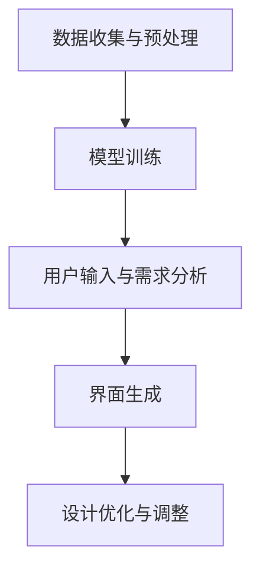

# UI设计师的进化：AI辅助界面生成

> 关键词：UI设计师、AI辅助、界面生成、设计效率、设计创新、人机协作、设计进化

> 摘要：本文聚焦于UI设计师在AI时代的进化，详细探讨了AI辅助界面生成这一新兴趋势。从背景介绍出发，阐述了其目的、范围、预期读者等内容。深入剖析了核心概念与联系，包括AI辅助界面生成的原理和架构，并通过Mermaid流程图进行直观展示。讲解了核心算法原理，用Python代码详细阐述。对数学模型和公式进行详细讲解与举例说明。通过项目实战，展示代码实际案例并进行详细解释。探讨了实际应用场景，推荐了相关工具和资源。最后总结了未来发展趋势与挑战，解答常见问题并提供扩展阅读与参考资料，旨在帮助UI设计师更好地理解和利用AI辅助界面生成技术，实现自身的进化与发展。

## 1. 背景介绍 
### 1.1 目的和范围
在当今数字化时代，用户界面（UI）设计的重要性日益凸显。随着科技的飞速发展，人工智能（AI）技术逐渐渗透到各个领域，UI设计也不例外。AI辅助界面生成技术的出现，为UI设计师带来了新的机遇和挑战。本文的目的在于深入探讨AI辅助界面生成技术，帮助UI设计师了解其原理、应用和发展趋势，从而更好地利用这一技术提升设计效率和质量，推动自身的职业发展。

本文的范围涵盖了AI辅助界面生成技术的多个方面，包括核心概念、算法原理、数学模型、实际应用场景、工具和资源推荐等。同时，通过项目实战案例，详细展示了如何在实际工作中运用这一技术。

### 1.2 预期读者
本文预期读者主要包括以下几类人群：
- **UI设计师**：希望了解AI辅助界面生成技术，提升设计效率和创新能力，在竞争激烈的设计领域中保持领先地位。
- **前端开发人员**：与UI设计师密切合作，了解AI辅助界面生成技术有助于更好地理解设计意图，提高开发效率。
- **人工智能研究者**：对AI在UI设计领域的应用感兴趣，希望通过本文了解相关技术的现状和发展趋势。
- **设计专业学生**：作为未来的设计从业者，提前了解AI辅助界面生成技术，为今后的职业发展做好准备。

### 1.3 文档结构概述
本文按照以下结构进行组织：
- **核心概念与联系**：介绍AI辅助界面生成的核心概念、原理和架构，并通过Mermaid流程图进行直观展示。
- **核心算法原理 & 具体操作步骤**：详细讲解核心算法原理，并用Python源代码进行详细阐述，同时给出具体操作步骤。
- **数学模型和公式 & 详细讲解 & 举例说明**：介绍相关的数学模型和公式，进行详细讲解并举例说明。
- **项目实战：代码实际案例和详细解释说明**：通过实际项目案例，展示如何搭建开发环境、实现源代码并进行代码解读。
- **实际应用场景**：探讨AI辅助界面生成技术在不同领域的实际应用场景。
- **工具和资源推荐**：推荐相关的学习资源、开发工具框架和论文著作。
- **总结：未来发展趋势与挑战**：总结AI辅助界面生成技术的未来发展趋势和面临的挑战。
- **附录：常见问题与解答**：解答读者在学习和应用过程中常见的问题。
- **扩展阅读 & 参考资料**：提供相关的扩展阅读材料和参考资料，方便读者进一步深入学习。

### 1.4 术语表
#### 1.4.1 核心术语定义
- **UI设计**：用户界面设计（User Interface Design）的简称，是对软件的人机交互、操作逻辑、界面美观进行的整体设计。
- **AI辅助界面生成**：利用人工智能技术，根据一定的规则和算法，自动生成用户界面的过程。
- **机器学习**：一门多领域交叉学科，涉及概率论、统计学、逼近论、凸分析、算法复杂度理论等多门学科。它专门研究计算机怎样模拟或实现人类的学习行为，以获取新的知识或技能，重新组织已有的知识结构使之不断改善自身的性能。
- **深度学习**：机器学习的一个分支领域，它是一种基于对数据进行表征学习的方法。深度学习通过构建具有很多层的神经网络模型，自动从大量数据中学习特征和模式。
- **生成对抗网络（GAN）**：一种深度学习模型，由生成器和判别器两个神经网络组成。生成器尝试生成逼真的数据，判别器则尝试区分生成的数据和真实的数据，两者通过对抗训练不断提升性能。

#### 1.4.2 相关概念解释
- **人机协作**：在AI辅助界面生成中，人机协作是指设计师与AI系统相互配合，发挥各自的优势，共同完成界面设计任务。设计师利用自己的创意和审美能力，提供设计方向和需求；AI系统则利用其强大的计算能力和数据分析能力，快速生成界面方案，为设计师提供参考和支持。
- **设计自动化**：通过AI技术实现界面设计过程中的部分或全部自动化，减少人工操作，提高设计效率。例如，自动布局、自动配色等功能。

#### 1.4.3 缩略词列表
- **UI**：User Interface（用户界面）
- **AI**：Artificial Intelligence（人工智能）
- **ML**：Machine Learning（机器学习）
- **DL**：Deep Learning（深度学习）
- **GAN**：Generative Adversarial Network（生成对抗网络）

## 2. 核心概念与联系 
### 核心概念原理
AI辅助界面生成的核心原理是利用人工智能技术，对大量的界面设计数据进行学习和分析，提取其中的模式、规律和特征，然后根据用户的需求和输入，生成相应的界面设计方案。

具体来说，AI辅助界面生成主要涉及以下几个步骤：
1. **数据收集与预处理**：收集大量的界面设计数据，包括界面截图、设计稿、交互原型等，并对这些数据进行清洗、标注和特征提取，以便后续的机器学习模型进行学习。
2. **模型训练**：选择合适的机器学习或深度学习模型，如卷积神经网络（CNN）、生成对抗网络（GAN）等，利用预处理后的数据对模型进行训练。训练的过程就是让模型学习界面设计的模式和规律，以便能够生成逼真的界面设计方案。
3. **用户输入与需求分析**：用户通过交互界面输入自己的设计需求，如界面类型、风格、颜色偏好等。AI系统对用户的输入进行分析，理解用户的需求。
4. **界面生成**：根据用户的需求和训练好的模型，AI系统生成相应的界面设计方案。生成的界面方案可以是静态的设计稿，也可以是可交互的原型。
5. **设计优化与调整**：设计师对AI生成的界面方案进行评估和优化，根据自己的创意和审美需求，对界面进行调整和修改，最终得到满意的设计方案。

### 架构的文本示意图
AI辅助界面生成系统的架构主要包括以下几个部分：
1. **数据层**：负责收集、存储和管理界面设计数据，包括原始数据和预处理后的数据。
2. **模型层**：包含各种机器学习和深度学习模型，如CNN、GAN等，用于对数据进行学习和分析，生成界面设计方案。
3. **交互层**：提供用户与系统之间的交互界面，用户可以通过该界面输入自己的设计需求，查看和评估AI生成的界面方案。
4. **设计层**：设计师在该层对AI生成的界面方案进行评估、优化和调整，最终完成界面设计任务。

### Mermaid流程图


## 3. 核心算法原理 & 具体操作步骤 
### 核心算法原理
在AI辅助界面生成中，生成对抗网络（GAN）是一种常用的算法。GAN由生成器（Generator）和判别器（Discriminator）两个神经网络组成。

生成器的作用是根据随机噪声生成假的界面设计方案，判别器的作用是区分生成的假方案和真实的界面设计数据。生成器和判别器通过对抗训练不断提升性能，生成器逐渐学会生成更加逼真的界面设计方案，判别器逐渐学会更加准确地区分真假方案。

### Python源代码详细阐述
以下是一个简单的使用PyTorch实现的GAN示例代码，用于生成简单的图像（在实际的界面生成中，需要对代码进行扩展和优化）：

```python
import torch
import torch.nn as nn
import torch.optim as optim
import numpy as np
import matplotlib.pyplot as plt

# 定义生成器
class Generator(nn.Module):
    def __init__(self, input_size, output_size):
        super(Generator, self).__init__()
        self.fc1 = nn.Linear(input_size, 128)
        self.fc2 = nn.Linear(128, 256)
        self.fc3 = nn.Linear(256, output_size)
        self.relu = nn.ReLU()
        self.tanh = nn.Tanh()

    def forward(self, x):
        x = self.relu(self.fc1(x))
        x = self.relu(self.fc2(x))
        x = self.tanh(self.fc3(x))
        return x

# 定义判别器
class Discriminator(nn.Module):
    def __init__(self, input_size):
        super(Discriminator, self).__init__()
        self.fc1 = nn.Linear(input_size, 256)
        self.fc2 = nn.Linear(256, 128)
        self.fc3 = nn.Linear(128, 1)
        self.relu = nn.ReLU()
        self.sigmoid = nn.Sigmoid()

    def forward(self, x):
        x = self.relu(self.fc1(x))
        x = self.relu(self.fc2(x))
        x = self.sigmoid(self.fc3(x))
        return x

# 超参数设置
input_size = 100
output_size = 784
batch_size = 32
epochs = 100
lr = 0.0002

# 初始化生成器和判别器
generator = Generator(input_size, output_size)
discriminator = Discriminator(output_size)

# 定义损失函数和优化器
criterion = nn.BCELoss()
optimizer_G = optim.Adam(generator.parameters(), lr=lr)
optimizer_D = optim.Adam(discriminator.parameters(), lr=lr)

# 模拟真实数据（这里简单使用随机噪声作为真实数据）
real_data = torch.randn(batch_size, output_size)

# 训练过程
for epoch in range(epochs):
    # 训练判别器
    optimizer_D.zero_grad()

    # 真实数据
    real_labels = torch.ones(batch_size, 1)
    real_output = discriminator(real_data)
    d_real_loss = criterion(real_output, real_labels)

    # 生成假数据
    noise = torch.randn(batch_size, input_size)
    fake_data = generator(noise)
    fake_labels = torch.zeros(batch_size, 1)
    fake_output = discriminator(fake_data.detach())
    d_fake_loss = criterion(fake_output, fake_labels)

    # 判别器总损失
    d_loss = d_real_loss + d_fake_loss
    d_loss.backward()
    optimizer_D.step()

    # 训练生成器
    optimizer_G.zero_grad()
    fake_labels = torch.ones(batch_size, 1)
    fake_output = discriminator(fake_data)
    g_loss = criterion(fake_output, fake_labels)
    g_loss.backward()
    optimizer_G.step()

    if epoch % 10 == 0:
        print(f'Epoch {epoch}: D_loss = {d_loss.item()}, G_loss = {g_loss.item()}')

# 生成一些样本进行可视化
noise = torch.randn(16, input_size)
generated_images = generator(noise).detach().numpy()
generated_images = generated_images.reshape(16, 28, 28)

# 可视化生成的图像
fig, axes = plt.subplots(4, 4, figsize=(4, 4))
for i in range(4):
    for j in range(4):
        axes[i, j].imshow(generated_images[i * 4 + j], cmap='gray')
        axes[i, j].axis('off')
plt.show()
```

### 具体操作步骤
1. **数据准备**：收集和预处理界面设计数据，将其转换为适合模型训练的格式。
2. **模型定义**：根据需求定义生成器和判别器的网络结构。
3. **超参数设置**：设置学习率、批次大小、训练轮数等超参数。
4. **模型训练**：按照上述代码中的训练过程，对生成器和判别器进行对抗训练。
5. **界面生成**：训练完成后，使用生成器根据用户输入生成界面设计方案。
6. **设计优化**：设计师对生成的界面方案进行评估和优化，得到最终的设计方案。

## 4. 数学模型和公式 & 详细讲解 & 举例说明 
### 生成对抗网络（GAN）的数学模型
GAN的目标是找到生成器 $G$ 和判别器 $D$ 的最优解，使得生成器生成的假数据尽可能接近真实数据，判别器能够准确地区分真假数据。

GAN的目标函数可以表示为：
$$
\min_G \max_D V(D, G) = \mathbb{E}_{x \sim p_{data}(x)}[\log D(x)] + \mathbb{E}_{z \sim p_z(z)}[\log(1 - D(G(z)))]
$$

其中：
- $p_{data}(x)$ 是真实数据的分布。
- $p_z(z)$ 是随机噪声的分布。
- $G(z)$ 是生成器根据随机噪声 $z$ 生成的假数据。
- $D(x)$ 是判别器对数据 $x$ 的判断结果，取值范围在 $[0, 1]$ 之间，$1$ 表示真实数据，$0$ 表示假数据。

### 详细讲解
- **判别器的目标**：判别器的目标是最大化目标函数 $V(D, G)$，即尽可能准确地区分真实数据和生成的假数据。对于真实数据 $x$，判别器希望 $D(x)$ 接近 $1$；对于生成的假数据 $G(z)$，判别器希望 $D(G(z))$ 接近 $0$。
- **生成器的目标**：生成器的目标是最小化目标函数 $V(D, G)$，即尽可能生成逼真的假数据，使得判别器无法区分真假数据。生成器希望 $D(G(z))$ 接近 $1$。

### 举例说明
假设我们有一个简单的一维数据集，真实数据服从正态分布 $N(0, 1)$，随机噪声服从均匀分布 $U(-1, 1)$。生成器是一个简单的线性函数 $G(z) = az + b$，判别器是一个简单的逻辑回归模型 $D(x) = \frac{1}{1 + e^{-cx - d}}$。

在训练过程中，判别器会不断调整参数 $c$ 和 $d$，使得对于真实数据 $x$，$D(x)$ 接近 $1$，对于生成的假数据 $G(z)$，$D(G(z))$ 接近 $0$；生成器会不断调整参数 $a$ 和 $b$，使得 $D(G(z))$ 接近 $1$，即生成的假数据越来越接近真实数据的分布。

## 5. 项目实战：代码实际案例和详细解释说明 
### 5.1  开发环境搭建
#### 安装Python
首先，确保你已经安装了Python，建议使用Python 3.7及以上版本。你可以从Python官方网站（https://www.python.org/downloads/） 下载并安装Python。

#### 安装必要的库
在命令行中使用以下命令安装必要的库：
```sh
pip install torch torchvision numpy matplotlib
```

### 5.2  源代码详细实现和代码解读
以下是一个更完整的使用GAN生成简单图像的代码示例，并对代码进行详细解读：

```python
import torch
import torch.nn as nn
import torch.optim as optim
import torchvision
import torchvision.datasets as datasets
import torchvision.transforms as transforms
import numpy as np
import matplotlib.pyplot as plt

# 定义生成器
class Generator(nn.Module):
    def __init__(self, input_size, output_size):
        super(Generator, self).__init__()
        self.fc1 = nn.Linear(input_size, 128)
        self.fc2 = nn.Linear(128, 256)
        self.fc3 = nn.Linear(256, 512)
        self.fc4 = nn.Linear(512, output_size)
        self.relu = nn.ReLU()
        self.tanh = nn.Tanh()

    def forward(self, x):
        x = self.relu(self.fc1(x))
        x = self.relu(self.fc2(x))
        x = self.relu(self.fc3(x))
        x = self.tanh(self.fc4(x))
        return x

# 定义判别器
class Discriminator(nn.Module):
    def __init__(self, input_size):
        super(Discriminator, self).__init__()
        self.fc1 = nn.Linear(input_size, 512)
        self.fc2 = nn.Linear(512, 256)
        self.fc3 = nn.Linear(256, 1)
        self.relu = nn.LeakyReLU(0.2)
        self.sigmoid = nn.Sigmoid()

    def forward(self, x):
        x = self.relu(self.fc1(x))
        x = self.relu(self.fc2(x))
        x = self.sigmoid(self.fc3(x))
        return x

# 超参数设置
input_size = 100
output_size = 784  # 28x28 图像
batch_size = 32
epochs = 100
lr = 0.0002

# 数据加载
transform = transforms.Compose([
    transforms.ToTensor(),
    transforms.Normalize((0.5,), (0.5,))
])

train_dataset = datasets.MNIST(root='./data', train=True, transform=transform, download=True)
train_loader = torch.utils.data.DataLoader(train_dataset, batch_size=batch_size, shuffle=True)

# 初始化生成器和判别器
generator = Generator(input_size, output_size)
discriminator = Discriminator(output_size)

# 定义损失函数和优化器
criterion = nn.BCELoss()
optimizer_G = optim.Adam(generator.parameters(), lr=lr)
optimizer_D = optim.Adam(discriminator.parameters(), lr=lr)

# 训练过程
for epoch in range(epochs):
    for i, (real_images, _) in enumerate(train_loader):
        real_images = real_images.view(-1, output_size)

        # 训练判别器
        optimizer_D.zero_grad()

        # 真实数据
        real_labels = torch.ones(real_images.size(0), 1)
        real_output = discriminator(real_images)
        d_real_loss = criterion(real_output, real_labels)

        # 生成假数据
        noise = torch.randn(real_images.size(0), input_size)
        fake_data = generator(noise)
        fake_labels = torch.zeros(real_images.size(0), 1)
        fake_output = discriminator(fake_data.detach())
        d_fake_loss = criterion(fake_output, fake_labels)

        # 判别器总损失
        d_loss = d_real_loss + d_fake_loss
        d_loss.backward()
        optimizer_D.step()

        # 训练生成器
        optimizer_G.zero_grad()
        fake_labels = torch.ones(real_images.size(0), 1)
        fake_output = discriminator(fake_data)
        g_loss = criterion(fake_output, fake_labels)
        g_loss.backward()
        optimizer_G.step()

    if epoch % 10 == 0:
        print(f'Epoch {epoch}: D_loss = {d_loss.item()}, G_loss = {g_loss.item()}')

# 生成一些样本进行可视化
noise = torch.randn(16, input_size)
generated_images = generator(noise).detach().numpy()
generated_images = generated_images.reshape(16, 28, 28)

# 可视化生成的图像
fig, axes = plt.subplots(4, 4, figsize=(4, 4))
for i in range(4):
    for j in range(4):
        axes[i, j].imshow(generated_images[i * 4 + j], cmap='gray')
        axes[i, j].axis('off')
plt.show()
```

### 代码解读与分析
- **数据加载**：使用`torchvision.datasets.MNIST`加载MNIST数据集，并使用`torch.utils.data.DataLoader`进行数据加载和批量处理。
- **生成器**：定义了一个四层的全连接神经网络作为生成器，输入是随机噪声，输出是生成的图像。
- **判别器**：定义了一个三层的全连接神经网络作为判别器，输入是图像，输出是判断结果（真假概率）。
- **损失函数和优化器**：使用二元交叉熵损失函数`nn.BCELoss`和Adam优化器进行训练。
- **训练过程**：交替训练判别器和生成器，判别器的目标是区分真实数据和假数据，生成器的目标是生成逼真的假数据。
- **可视化**：训练完成后，生成一些样本并进行可视化展示。

## 6. 实际应用场景 
### 快速原型制作
在产品开发的初期，需要快速制作界面原型来验证产品的设计思路和用户体验。AI辅助界面生成技术可以根据产品的需求和功能，快速生成界面原型，大大缩短了原型制作的时间。设计师可以在生成的原型基础上进行修改和完善，提高设计效率。

### 个性化界面设计
不同的用户有不同的审美和使用习惯，AI辅助界面生成技术可以根据用户的个性化需求，生成符合用户喜好的界面设计方案。例如，根据用户的年龄、性别、地域等信息，生成不同风格的界面；根据用户的操作习惯，优化界面的布局和交互方式。

### 多平台适配
随着移动设备和互联网的发展，产品需要在不同的平台上运行，如手机、平板、电脑等。AI辅助界面生成技术可以根据不同平台的特点和要求，自动生成适配不同平台的界面设计方案，确保产品在各个平台上都能有良好的用户体验。

### 设计灵感启发
当设计师遇到创意瓶颈时，AI辅助界面生成技术可以提供大量的设计灵感。AI系统可以根据设计师输入的关键词和要求，生成各种不同风格的界面设计方案，设计师可以从中获取灵感，进行创意设计。

## 7. 工具和资源推荐
### 7.1 学习资源推荐
#### 7.1.1 书籍推荐
- 《深度学习》（Deep Learning）：由Ian Goodfellow、Yoshua Bengio和Aaron Courville三位深度学习领域的专家撰写，是深度学习领域的经典教材。
- 《Python深度学习》（Deep Learning with Python）：由Keras库的作者Francois Chollet撰写，通过Python代码详细介绍了深度学习的基本概念和应用。
- 《人工智能：一种现代的方法》（Artificial Intelligence: A Modern Approach）：全面介绍了人工智能的各个领域，包括机器学习、自然语言处理、计算机视觉等。

#### 7.1.2 在线课程
- Coursera上的“深度学习专项课程”（Deep Learning Specialization）：由Andrew Ng教授授课，是深度学习领域的经典在线课程。
- edX上的“人工智能导论”（Introduction to Artificial Intelligence）：全面介绍了人工智能的基本概念和方法。
- Udemy上的“Python数据科学和机器学习实战”（Python for Data Science and Machine Learning Bootcamp）：通过实际项目介绍了Python在数据科学和机器学习中的应用。

#### 7.1.3 技术博客和网站
- Medium：是一个技术博客平台，上面有很多关于AI和UI设计的文章和教程。
- Towards Data Science：专注于数据科学和机器学习领域的技术博客，有很多高质量的文章和案例。
- UI Movement：是一个UI设计资源网站，提供了大量的UI设计案例和灵感。

### 7.2 开发工具框架推荐
#### 7.2.1 IDE和编辑器
- PyCharm：是一款专业的Python集成开发环境，提供了丰富的功能和插件，方便进行Python代码的开发和调试。
- Jupyter Notebook：是一个交互式的开发环境，适合进行数据分析和模型训练的实验和演示。
- Visual Studio Code：是一款轻量级的代码编辑器，支持多种编程语言和插件，可用于AI和UI设计相关的开发。

#### 7.2.2 调试和性能分析工具
- TensorBoard：是TensorFlow的可视化工具，可用于可视化模型的训练过程和性能指标。
- PyTorch Profiler：是PyTorch的性能分析工具，可用于分析模型的运行时间和内存使用情况。
- Chrome DevTools：是Chrome浏览器的开发者工具，可用于调试和分析网页界面的性能和问题。

#### 7.2.3 相关框架和库
- PyTorch：是一个开源的深度学习框架，提供了丰富的深度学习模型和工具，广泛应用于AI辅助界面生成领域。
- TensorFlow：是另一个流行的深度学习框架，具有强大的计算能力和丰富的生态系统。
- Keras：是一个高级神经网络API，基于TensorFlow、Theano等后端，简单易用，适合快速搭建深度学习模型。

### 7.3 相关论文著作推荐
#### 7.3.1 经典论文
- “Generative Adversarial Nets”：由Ian Goodfellow等人发表，首次提出了生成对抗网络（GAN）的概念。
- “Deep Residual Learning for Image Recognition”：由Kaiming He等人发表，提出了残差网络（ResNet），解决了深度神经网络训练中的梯度消失问题。
- “Attention Is All You Need”：由Ashish Vaswani等人发表，提出了Transformer模型，在自然语言处理领域取得了巨大成功。

#### 7.3.2 最新研究成果
- 关注顶级学术会议如NeurIPS、ICML、CVPR等的最新论文，了解AI辅助界面生成领域的最新研究成果。
- 关注知名学术期刊如Journal of Artificial Intelligence Research（JAIR）、Artificial Intelligence等的相关研究论文。

#### 7.3.3 应用案例分析
- 关注一些知名公司和研究机构的官方博客和技术报告，了解他们在AI辅助界面生成领域的应用案例和实践经验。
- 参加相关的技术研讨会和行业会议，听取专家和从业者的分享和交流。

## 8. 总结：未来发展趋势与挑战
### 未来发展趋势
- **更加智能的人机协作**：未来，AI系统将更加智能，能够更好地理解设计师的意图和需求，与设计师进行更加高效的协作。设计师可以将更多的重复性工作交给AI系统，专注于创意和创新设计。
- **个性化设计的深入发展**：随着用户对个性化需求的不断增加，AI辅助界面生成技术将更加注重个性化设计。AI系统将能够根据用户的更多维度信息，生成更加个性化的界面设计方案。
- **跨领域融合**：AI辅助界面生成技术将与其他领域的技术进行更深入的融合，如虚拟现实（VR）、增强现实（AR）、物联网（IoT）等。这将为界面设计带来更多的创新和可能性。
- **自动化设计的普及**：随着技术的不断进步，AI辅助界面生成技术将实现更多的自动化设计功能，如自动布局、自动配色、自动交互设计等。这将大大提高设计效率，降低设计成本。

### 挑战
- **数据质量和隐私问题**：AI辅助界面生成技术需要大量的界面设计数据进行训练，数据的质量和隐私问题是一个重要的挑战。如何保证数据的准确性、完整性和安全性，是需要解决的问题。
- **创意和审美判断**：虽然AI系统可以生成大量的界面设计方案，但在创意和审美判断方面，仍然无法完全替代设计师。如何让AI系统更好地理解和把握创意和审美，是一个需要深入研究的问题。
- **技术的可解释性**：AI技术往往具有较高的复杂性和黑盒性，其决策过程和结果难以解释。在界面设计领域，设计师需要了解AI系统生成界面的原理和依据，以便进行评估和优化。因此，提高AI技术的可解释性是一个重要的挑战。
- **人才培养**：AI辅助界面生成技术的发展需要既懂AI又懂UI设计的复合型人才。目前，这样的人才相对匮乏，如何培养和吸引更多的复合型人才，是推动该技术发展的关键。

## 9. 附录：常见问题与解答
### 1. AI辅助界面生成技术会取代UI设计师吗？
不会。虽然AI辅助界面生成技术可以提高设计效率和生成一些界面方案，但在创意、审美和用户体验等方面，仍然需要设计师的专业知识和技能。AI技术更多的是作为设计师的辅助工具，帮助设计师更好地完成设计任务。

### 2. 如何选择适合的AI算法和模型？
选择适合的AI算法和模型需要考虑多个因素，如数据特点、任务需求、计算资源等。例如，如果数据是图像数据，可以选择卷积神经网络（CNN）；如果需要生成数据，可以选择生成对抗网络（GAN）。在实际应用中，通常需要进行实验和比较，选择效果最好的算法和模型。

### 3. AI生成的界面设计方案质量如何保证？
AI生成的界面设计方案需要设计师进行评估和优化。设计师可以根据自己的专业知识和审美标准，对生成的方案进行修改和调整，确保界面的质量和用户体验。同时，也可以通过用户测试等方式，收集用户的反馈和意见，进一步改进界面设计方案。

### 4. 学习AI辅助界面生成技术需要具备哪些基础知识？
学习AI辅助界面生成技术需要具备一定的Python编程基础、机器学习和深度学习基础知识，以及UI设计的相关知识。可以通过学习相关的书籍、在线课程和实践项目，逐步掌握这些基础知识。

## 10. 扩展阅读 & 参考资料
### 扩展阅读
- 《设计心理学》（The Design of Everyday Things）：由Don Norman撰写，介绍了设计中的心理学原理，有助于设计师更好地理解用户需求和行为。
- 《用户体验要素》（The Elements of User Experience）：由Jesse James Garrett撰写，详细介绍了用户体验设计的五个层次，是用户体验设计领域的经典著作。
- 《AI未来进行式》（The Age of AI: And Our Human Future）：由李开复和王咏刚撰写，探讨了AI对各个领域的影响和未来发展趋势。

### 参考资料
- 相关学术论文和研究报告，可通过学术数据库如IEEE Xplore、ACM Digital Library等进行查询。
- 开源代码库如GitHub上的相关项目，可参考其代码实现和文档说明。
- 各大公司和研究机构的官方博客和技术文章，如Google AI Blog、Facebook AI Research等。