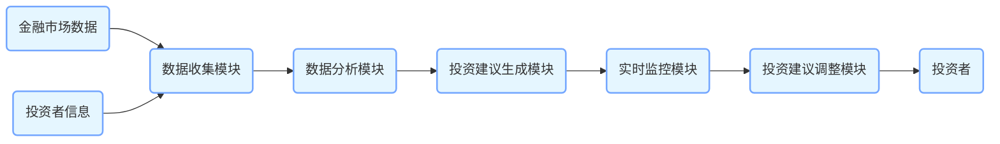

# 个人理财顾问：AI Agent的智能投资建议

> 关键词：AI Agent、个人理财顾问、智能投资建议、金融科技、机器学习、投资策略、风险管理

> 摘要：本文聚焦于AI Agent在个人理财顾问领域的应用，深入探讨其提供智能投资建议的原理、方法和实际应用。首先介绍了相关背景知识，包括目的、预期读者、文档结构和术语表。接着阐述了核心概念与联系，通过文本示意图和Mermaid流程图展示其架构。详细讲解了核心算法原理，结合Python源代码进行说明，并给出了数学模型和公式。通过项目实战，展示了代码的实际案例和详细解释。分析了AI Agent在个人理财中的实际应用场景，推荐了相关的学习资源、开发工具框架和论文著作。最后总结了未来发展趋势与挑战，提供了常见问题解答和扩展阅读参考资料，旨在为读者全面呈现AI Agent在个人理财顾问领域的应用与发展。

## 1. 背景介绍 
### 1.1 目的和范围
随着金融市场的不断发展和复杂化，个人投资者面临着越来越多的投资选择和决策挑战。传统的理财顾问服务往往成本较高，且难以满足个性化的需求。AI Agent（人工智能代理）作为一种新兴的技术手段，具有自动化、智能化和个性化的特点，能够为个人投资者提供实时、准确、个性化的投资建议。本文的目的在于深入探讨AI Agent在个人理财顾问领域的应用，详细介绍其技术原理、算法实现、实际应用场景以及未来发展趋势，旨在为投资者、金融从业者和技术开发者提供全面的参考和指导。

### 1.2 预期读者
本文的预期读者包括但不限于以下几类人群：
- **个人投资者**：希望借助AI Agent的智能投资建议，优化自己的投资组合，提高投资收益。
- **金融从业者**：如理财顾问、投资经理等，了解AI Agent技术在个人理财领域的应用，提升自身的专业能力和服务水平。
- **技术开发者**：对人工智能、机器学习等技术在金融领域的应用感兴趣，希望深入研究AI Agent的算法原理和实现方法。
- **科研人员**：关注金融科技领域的前沿研究，探索AI Agent在个人理财顾问中的创新应用。

### 1.3 文档结构概述
本文的结构如下：
- **背景介绍**：介绍本文的目的、预期读者、文档结构和术语表。
- **核心概念与联系**：阐述AI Agent、个人理财顾问和智能投资建议的核心概念，展示其架构和联系。
- **核心算法原理 & 具体操作步骤**：详细讲解AI Agent实现智能投资建议的核心算法，结合Python源代码进行说明。
- **数学模型和公式 & 详细讲解 & 举例说明**：给出AI Agent在投资建议中的数学模型和公式，并进行详细讲解和举例说明。
- **项目实战：代码实际案例和详细解释说明**：通过实际项目案例，展示AI Agent的开发环境搭建、源代码实现和代码解读。
- **实际应用场景**：分析AI Agent在个人理财中的实际应用场景和优势。
- **工具和资源推荐**：推荐相关的学习资源、开发工具框架和论文著作。
- **总结：未来发展趋势与挑战**：总结AI Agent在个人理财顾问领域的未来发展趋势和面临的挑战。
- **附录：常见问题与解答**：提供常见问题的解答，帮助读者更好地理解和应用AI Agent技术。
- **扩展阅读 & 参考资料**：提供扩展阅读的建议和参考资料，方便读者进一步深入研究。

### 1.4 术语表
#### 1.4.1 核心术语定义
- **AI Agent（人工智能代理）**：是一种能够感知环境、自主决策并采取行动以实现特定目标的智能实体。在个人理财顾问领域，AI Agent能够收集和分析金融市场数据、投资者的个人信息和投资目标，为投资者提供个性化的投资建议。
- **个人理财顾问**：为个人投资者提供财务规划、投资建议、风险管理等服务的专业人员或系统。AI Agent作为一种新型的个人理财顾问，能够利用人工智能技术实现自动化和智能化的服务。
- **智能投资建议**：基于人工智能技术，通过对金融市场数据、投资者的个人信息和投资目标进行分析和建模，为投资者提供的个性化、实时、准确的投资建议。

#### 1.4.2 相关概念解释
- **机器学习**：是一门多领域交叉学科，涉及概率论、统计学、逼近论、凸分析、算法复杂度理论等多门学科。它专门研究计算机怎样模拟或实现人类的学习行为，以获取新的知识或技能，重新组织已有的知识结构使之不断改善自身的性能。在AI Agent的智能投资建议中，机器学习算法被广泛应用于数据挖掘、模式识别和预测分析等方面。
- **深度学习**：是机器学习的一个分支领域，它是一种基于对数据进行表征学习的方法。深度学习通过构建具有很多层的神经网络模型，自动从大量的数据中学习到复杂的特征和模式，从而实现更准确的预测和决策。在金融领域，深度学习被用于股票价格预测、风险评估等方面。
- **投资组合理论**：由美国经济学家哈里·马科维茨（Harry Markowitz）于1952年提出，该理论认为投资者应该通过分散投资来降低风险，同时追求预期收益的最大化。投资组合理论为AI Agent的智能投资建议提供了重要的理论基础。

#### 1.4.3 缩略词列表
- **AI**：Artificial Intelligence，人工智能
- **ML**：Machine Learning，机器学习
- **DL**：Deep Learning，深度学习
- **ETF**：Exchange-Traded Fund，交易型开放式指数基金
- **ROI**：Return on Investment，投资回报率

## 2. 核心概念与联系 
### 核心概念原理
#### AI Agent
AI Agent是一种具有自主性、反应性、社会性和学习性的智能实体。它通过感知环境获取信息，利用内部的知识和算法进行推理和决策，然后采取行动影响环境。在个人理财顾问领域，AI Agent的主要功能包括：
- **数据收集**：收集金融市场数据（如股票价格、债券收益率、宏观经济数据等）、投资者的个人信息（如资产状况、收入水平、风险偏好等）和投资目标（如短期获利、长期资产增值等）。
- **数据分析**：利用机器学习、深度学习等算法对收集到的数据进行分析和挖掘，发现数据中的规律和模式。
- **投资建议生成**：根据数据分析的结果，结合投资组合理论和风险管理原则，为投资者生成个性化的投资建议。
- **实时监控和调整**：实时监控金融市场的变化和投资者的资产状况，根据市场变化和投资者的需求及时调整投资建议。

#### 个人理财顾问
个人理财顾问的核心目标是帮助投资者实现财务目标，同时管理投资风险。传统的个人理财顾问通常需要人工收集和分析数据，根据自己的经验和专业知识为投资者提供建议。而基于AI Agent的个人理财顾问则能够利用人工智能技术实现自动化和智能化的服务，提高服务效率和准确性。个人理财顾问的主要工作包括：
- **财务规划**：根据投资者的个人情况和财务目标，制定合理的财务规划，包括预算规划、储蓄计划、投资计划等。
- **投资建议**：根据投资者的风险偏好和投资目标，为投资者推荐适合的投资产品和投资策略。
- **风险管理**：帮助投资者识别和评估投资风险，制定风险控制措施，降低投资损失的可能性。
- **客户服务**：与投资者保持沟通，解答投资者的疑问，提供投资咨询和建议。

#### 智能投资建议
智能投资建议是基于人工智能技术，通过对大量的金融市场数据和投资者的个人信息进行分析和建模，为投资者提供的个性化、实时、准确的投资建议。智能投资建议的特点包括：
- **个性化**：根据投资者的个人情况和投资目标，为投资者提供量身定制的投资建议。
- **实时性**：实时监控金融市场的变化，及时调整投资建议，以适应市场变化。
- **准确性**：利用先进的数据分析和建模技术，提高投资建议的准确性和可靠性。
- **科学性**：基于投资组合理论和风险管理原则，为投资者提供科学合理的投资建议。

### 架构的文本示意图
```plaintext
              +----------------+
              | 金融市场数据   |
              +----------------+
                      |
                      v
+-----------------+       +-----------------+
| 数据收集模块    |       | 投资者信息模块  |
+-----------------+       +-----------------+
                      |
                      v
+-----------------+
| 数据分析模块    |
+-----------------+
                      |
                      v
+-----------------+
| 投资建议生成模块|
+-----------------+
                      |
                      v
+-----------------+
| 实时监控模块    |
+-----------------+
                      |
                      v
+-----------------+
| 投资建议调整模块|
+-----------------+
                      |
                      v
              +----------------+
              | 投资者          |
              +----------------+
```

### Mermaid流程图


## 3. 核心算法原理 & 具体操作步骤 
### 核心算法原理
#### 数据预处理算法
在进行数据分析之前，需要对收集到的金融市场数据和投资者信息进行预处理，以提高数据的质量和可用性。常见的数据预处理算法包括：
- **数据清洗**：去除数据中的噪声、缺失值和异常值。
- **数据归一化**：将不同尺度的数据进行归一化处理，使数据具有相同的尺度。
- **特征提取**：从原始数据中提取有用的特征，减少数据的维度。

#### 机器学习算法
机器学习算法是AI Agent实现智能投资建议的核心算法之一，常见的机器学习算法包括：
- **线性回归**：用于预测连续变量的值，如股票价格、债券收益率等。
- **逻辑回归**：用于分类问题，如判断股票是否值得投资。
- **决策树**：用于分类和回归问题，通过构建决策树模型对数据进行分类和预测。
- **随机森林**：是一种集成学习算法，通过组合多个决策树模型提高预测的准确性。
- **支持向量机**：用于分类和回归问题，通过寻找最优的超平面将不同类别的数据分开。

#### 深度学习算法
深度学习算法是一种基于神经网络的机器学习算法，具有强大的特征学习和模式识别能力。在金融领域，深度学习算法被广泛应用于股票价格预测、风险评估等方面。常见的深度学习算法包括：
- **多层感知机（MLP）**：是一种最简单的神经网络模型，由输入层、隐藏层和输出层组成。
- **卷积神经网络（CNN）**：主要用于处理具有网格结构的数据，如图像、时间序列数据等。
- **循环神经网络（RNN）**：主要用于处理序列数据，如股票价格时间序列、文本数据等。
- **长短时记忆网络（LSTM）**：是一种特殊的循环神经网络，能够解决长序列数据的梯度消失问题。

### 具体操作步骤
#### 数据收集
- 使用爬虫技术从金融网站、新闻媒体等数据源收集金融市场数据，如股票价格、债券收益率、宏观经济数据等。
- 设计用户界面，让投资者输入个人信息和投资目标，如资产状况、收入水平、风险偏好、投资期限等。

#### 数据预处理
```python
import pandas as pd
import numpy as np
from sklearn.preprocessing import MinMaxScaler

# 读取数据
data = pd.read_csv('financial_data.csv')

# 数据清洗
data = data.dropna()  # 去除缺失值
data = data[~data.isin([np.nan, np.inf, -np.inf]).any(1)]  # 去除异常值

# 数据归一化
scaler = MinMaxScaler()
numerical_columns = data.select_dtypes(include=[np.number]).columns
data[numerical_columns] = scaler.fit_transform(data[numerical_columns])

# 特征提取
# 这里简单地选择一些特征作为示例
selected_features = ['stock_price', 'bond_yield', 'gdp_growth_rate']
X = data[selected_features]
y = data['investment_return']
```

#### 模型训练
```python
from sklearn.model_selection import train_test_split
from sklearn.linear_model import LinearRegression
from sklearn.metrics import mean_squared_error

# 划分训练集和测试集
X_train, X_test, y_train, y_test = train_test_split(X, y, test_size=0.2, random_state=42)

# 训练线性回归模型
model = LinearRegression()
model.fit(X_train, y_train)

# 模型评估
y_pred = model.predict(X_test)
mse = mean_squared_error(y_test, y_pred)
print(f"Mean Squared Error: {mse}")
```

#### 投资建议生成
```python
# 假设新的投资者信息
new_investor_info = pd.DataFrame({
    'stock_price': [0.5],
    'bond_yield': [0.3],
    'gdp_growth_rate': [0.2]
})

# 进行预测
predicted_return = model.predict(new_investor_info)

# 根据预测结果生成投资建议
if predicted_return > 0.1:
    print("建议增加投资")
elif predicted_return < -0.1:
    print("建议减少投资")
else:
    print("建议维持现有投资组合")
```

#### 实时监控和调整
- 定期收集新的金融市场数据和投资者信息，更新模型。
- 根据市场变化和投资者的需求，及时调整投资建议。

## 4. 数学模型和公式 & 详细讲解 & 举例说明 
### 投资组合理论
投资组合理论由美国经济学家哈里·马科维茨（Harry Markowitz）于1952年提出，该理论认为投资者应该通过分散投资来降低风险，同时追求预期收益的最大化。投资组合的预期收益和风险可以用以下公式表示：

#### 预期收益
投资组合的预期收益 $E(R_p)$ 是组合中各资产预期收益的加权平均值，公式如下：
$$E(R_p) = \sum_{i=1}^{n} w_i E(R_i)$$
其中，$w_i$ 是第 $i$ 种资产在投资组合中的权重，$E(R_i)$ 是第 $i$ 种资产的预期收益，$n$ 是投资组合中资产的数量。

#### 风险（方差）
投资组合的风险可以用方差 $\sigma_p^2$ 来衡量，公式如下：
$$\sigma_p^2 = \sum_{i=1}^{n} \sum_{j=1}^{n} w_i w_j \sigma_{ij}$$
其中，$\sigma_{ij}$ 是第 $i$ 种资产和第 $j$ 种资产的协方差。当 $i = j$ 时，$\sigma_{ij} = \sigma_i^2$，即第 $i$ 种资产的方差。

### 资本资产定价模型（CAPM）
资本资产定价模型（Capital Asset Pricing Model，CAPM）是由美国经济学家威廉·夏普（William Sharpe）、约翰·林特纳（John Lintner）和杰克·特里诺（Jack Treynor）在20世纪60年代提出的，该模型描述了资产的预期收益与市场风险之间的关系。CAPM的公式如下：
$$E(R_i) = R_f + \beta_i (E(R_m) - R_f)$$
其中，$E(R_i)$ 是第 $i$ 种资产的预期收益，$R_f$ 是无风险利率，$\beta_i$ 是第 $i$ 种资产的贝塔系数，$E(R_m)$ 是市场组合的预期收益。

### 举例说明
假设投资者有三种资产可供选择：股票A、股票B和债券C，它们的预期收益和标准差如下表所示：

| 资产 | 预期收益 $E(R_i)$ | 标准差 $\sigma_i$ |
| ---- | ---------------- | ---------------- |
| 股票A | 0.15 | 0.2 |
| 股票B | 0.12 | 0.15 |
| 债券C | 0.05 | 0.05 |

假设三种资产的权重分别为 $w_A = 0.4$，$w_B = 0.3$，$w_C = 0.3$，且三种资产之间的协方差矩阵如下：

$$
\begin{bmatrix}
0.04 & 0.02 & 0.01 \\
0.02 & 0.0225 & 0.0075 \\
0.01 & 0.0075 & 0.0025
\end{bmatrix}
$$

#### 计算投资组合的预期收益
根据预期收益公式：
$$E(R_p) = w_A E(R_A) + w_B E(R_B) + w_C E(R_C)$$
$$= 0.4 \times 0.15 + 0.3 \times 0.12 + 0.3 \times 0.05$$
$$= 0.105$$

#### 计算投资组合的风险（方差）
根据方差公式：
$$\sigma_p^2 = w_A^2 \sigma_A^2 + w_B^2 \sigma_B^2 + w_C^2 \sigma_C^2 + 2 w_A w_B \sigma_{AB} + 2 w_A w_C \sigma_{AC} + 2 w_B w_C \sigma_{BC}$$
$$= 0.4^2 \times 0.04 + 0.3^2 \times 0.0225 + 0.3^2 \times 0.0025 + 2 \times 0.4 \times 0.3 \times 0.02 + 2 \times 0.4 \times 0.3 \times 0.01 + 2 \times 0.3 \times 0.3 \times 0.0075$$
$$= 0.0136$$

则投资组合的标准差为：
$$\sigma_p = \sqrt{0.0136} \approx 0.1166$$

## 5. 项目实战：代码实际案例和详细解释说明 
### 5.1  开发环境搭建
#### 操作系统
本项目可以在Windows、Linux或Mac OS等操作系统上进行开发，建议使用Linux或Mac OS，因为它们对Python和相关库的支持更好。

#### Python环境
建议使用Python 3.7及以上版本，可以通过Anaconda或Python官方网站下载安装。

#### 依赖库安装
在命令行中使用以下命令安装项目所需的依赖库：
```sh
pip install pandas numpy scikit-learn matplotlib
```

### 5.2  源代码详细实现和代码解读
```python
import pandas as pd
import numpy as np
from sklearn.model_selection import train_test_split
from sklearn.linear_model import LinearRegression
from sklearn.metrics import mean_squared_error
import matplotlib.pyplot as plt

# 数据加载
def load_data(file_path):
    data = pd.read_csv(file_path)
    return data

# 数据预处理
def preprocess_data(data):
    # 数据清洗
    data = data.dropna()
    data = data[~data.isin([np.nan, np.inf, -np.inf]).any(1)]
    
    # 数据归一化
    from sklearn.preprocessing import MinMaxScaler
    scaler = MinMaxScaler()
    numerical_columns = data.select_dtypes(include=[np.number]).columns
    data[numerical_columns] = scaler.fit_transform(data[numerical_columns])
    
    # 特征提取
    selected_features = ['stock_price', 'bond_yield', 'gdp_growth_rate']
    X = data[selected_features]
    y = data['investment_return']
    
    return X, y

# 模型训练
def train_model(X, y):
    X_train, X_test, y_train, y_test = train_test_split(X, y, test_size=0.2, random_state=42)
    model = LinearRegression()
    model.fit(X_train, y_train)
    
    # 模型评估
    y_pred = model.predict(X_test)
    mse = mean_squared_error(y_test, y_pred)
    print(f"Mean Squared Error: {mse}")
    
    return model

# 投资建议生成
def generate_investment_advice(model):
    # 假设新的投资者信息
    new_investor_info = pd.DataFrame({
        'stock_price': [0.5],
        'bond_yield': [0.3],
        'gdp_growth_rate': [0.2]
    })
    
    # 进行预测
    predicted_return = model.predict(new_investor_info)
    
    # 根据预测结果生成投资建议
    if predicted_return > 0.1:
        print("建议增加投资")
    elif predicted_return < -0.1:
        print("建议减少投资")
    else:
        print("建议维持现有投资组合")

# 主函数
def main():
    file_path = 'financial_data.csv'
    data = load_data(file_path)
    X, y = preprocess_data(data)
    model = train_model(X, y)
    generate_investment_advice(model)

if __name__ == "__main__":
    main()
```

### 5.3  代码解读与分析
- **数据加载**：`load_data` 函数用于从CSV文件中加载金融市场数据。
- **数据预处理**：`preprocess_data` 函数对加载的数据进行清洗、归一化和特征提取操作，以提高数据的质量和可用性。
- **模型训练**：`train_model` 函数使用线性回归模型对数据进行训练，并评估模型的性能。
- **投资建议生成**：`generate_investment_advice` 函数根据训练好的模型对新的投资者信息进行预测，并生成相应的投资建议。
- **主函数**：`main` 函数将上述步骤整合在一起，实现了整个项目的流程。

## 6. 实际应用场景 
### 个人投资者
对于个人投资者来说，AI Agent可以提供以下服务：
- **个性化投资建议**：根据投资者的个人情况和投资目标，为投资者提供量身定制的投资建议，帮助投资者优化投资组合，提高投资收益。
- **实时市场监控**：实时监控金融市场的变化，及时提醒投资者市场风险和投资机会，帮助投资者做出及时的投资决策。
- **风险管理**：帮助投资者识别和评估投资风险，制定风险控制措施，降低投资损失的可能性。

### 金融机构
对于金融机构来说，AI Agent可以提高服务效率和质量，降低运营成本，具体应用场景包括：
- **客户服务**：AI Agent可以作为金融机构的智能客服，实时解答客户的疑问，提供投资咨询和建议，提高客户满意度。
- **投资顾问服务**：AI Agent可以为金融机构的客户提供智能化的投资顾问服务，帮助客户制定投资计划，优化投资组合。
- **风险评估和管理**：AI Agent可以利用大数据和机器学习技术，对金融机构的客户和业务进行风险评估和管理，提高金融机构的风险管理能力。

### 监管机构
对于监管机构来说，AI Agent可以帮助监管机构加强对金融市场的监管，提高监管效率和准确性，具体应用场景包括：
- **市场监测**：AI Agent可以实时监测金融市场的交易数据和行为，及时发现市场异常和违规行为，为监管机构提供决策支持。
- **风险预警**：AI Agent可以利用大数据和机器学习技术，对金融市场的风险进行预警和评估，帮助监管机构提前采取措施，防范金融风险。
- **合规检查**：AI Agent可以对金融机构的业务和行为进行合规检查，确保金融机构遵守相关法律法规和监管要求。

## 7. 工具和资源推荐
### 7.1 学习资源推荐
#### 7.1.1 书籍推荐
- 《机器学习》（周志华著）：介绍了机器学习的基本概念、算法和应用，是机器学习领域的经典教材。
- 《深度学习》（Ian Goodfellow、Yoshua Bengio和Aaron Courville著）：全面介绍了深度学习的理论和实践，是深度学习领域的权威著作。
- 《Python数据分析实战》（Robert Johansson著）：介绍了Python在数据分析领域的应用，包括数据处理、可视化和机器学习等方面。
- 《金融数学》（John C. Hull著）：介绍了金融数学的基本概念、理论和方法，是金融数学领域的经典教材。

#### 7.1.2 在线课程
- Coursera上的“机器学习”课程（Andrew Ng教授主讲）：是机器学习领域的经典在线课程，介绍了机器学习的基本概念、算法和应用。
- edX上的“深度学习”课程（Geoffrey Hinton教授主讲）：是深度学习领域的权威在线课程，介绍了深度学习的理论和实践。
- 中国大学MOOC上的“Python语言程序设计”课程（嵩天教授主讲）：介绍了Python语言的基本语法和编程技巧，是Python入门的好课程。

#### 7.1.3 技术博客和网站
- 机器之心（https://www.aliveai.com/）：专注于人工智能领域的技术和应用，提供最新的技术资讯和深度分析。
- 深度学习技术前沿（https://www.deeplearning.ai/）：专注于深度学习领域的技术和应用，提供最新的技术资讯和深度分析。
- 量化投资与机器学习（https://www.quanttech.ai/）：专注于量化投资和机器学习领域的技术和应用，提供最新的技术资讯和深度分析。

### 7.2 开发工具框架推荐
#### 7.2.1 IDE和编辑器
- PyCharm：是一款专门为Python开发设计的集成开发环境（IDE），具有强大的代码编辑、调试和自动完成功能。
- Jupyter Notebook：是一种交互式的开发环境，支持Python、R等多种编程语言，适合数据分析和机器学习的开发。
- Visual Studio Code：是一款轻量级的代码编辑器，支持多种编程语言和插件，具有丰富的扩展功能。

#### 7.2.2 调试和性能分析工具
- PDB：是Python自带的调试工具，可以帮助开发者调试Python代码。
- cProfile：是Python自带的性能分析工具，可以帮助开发者分析Python代码的性能瓶颈。
- TensorBoard：是TensorFlow提供的可视化工具，可以帮助开发者可视化训练过程和模型结构。

#### 7.2.3 相关框架和库
- NumPy：是Python中用于科学计算的基础库，提供了高效的数组操作和数学函数。
- Pandas：是Python中用于数据处理和分析的库，提供了高效的数据结构和数据操作方法。
- Scikit-learn：是Python中用于机器学习的库，提供了丰富的机器学习算法和工具。
- TensorFlow：是Google开发的深度学习框架，提供了高效的深度学习模型训练和部署工具。
- PyTorch：是Facebook开发的深度学习框架，提供了动态图和静态图两种编程模式，适合深度学习的研究和开发。

### 7.3 相关论文著作推荐
#### 7.3.1 经典论文
- Markowitz, H. M. (1952). Portfolio Selection. The Journal of Finance, 7(1), 77-91. （投资组合理论的经典论文）
- Sharpe, W. F. (1964). Capital Asset Prices: A Theory of Market Equilibrium Under Conditions of Risk. The Journal of Finance, 19(3), 425-442. （资本资产定价模型的经典论文）
- Hochreiter, S., & Schmidhuber, J. (1997). Long Short-Term Memory. Neural Computation, 9(8), 1735-1780. （长短时记忆网络的经典论文）

#### 7.3.2 最新研究成果
- 关注顶级学术会议和期刊，如NeurIPS、ICML、JMLR等，了解人工智能和金融领域的最新研究成果。

#### 7.3.3 应用案例分析
- 关注金融科技公司的官方网站和博客，了解AI Agent在个人理财顾问领域的实际应用案例和经验分享。

## 8. 总结：未来发展趋势与挑战
### 未来发展趋势
#### 更加智能化和个性化
随着人工智能技术的不断发展，AI Agent将更加智能化和个性化，能够更好地理解投资者的需求和偏好，提供更加精准和个性化的投资建议。

#### 与其他技术的融合
AI Agent将与区块链、物联网、大数据等技术进行融合，实现更加全面和深入的金融服务。例如，区块链技术可以提高金融交易的安全性和透明度，物联网技术可以实时收集和传输金融市场数据，大数据技术可以为AI Agent提供更丰富的数据源。

#### 服务场景的拓展
AI Agent的服务场景将不断拓展，除了个人理财顾问领域，还将应用于企业财务管理、金融监管等领域。

### 挑战
#### 数据质量和安全
AI Agent的性能和准确性依赖于大量的金融市场数据和投资者信息，数据质量和安全是一个重要的挑战。如何确保数据的准确性、完整性和安全性，是AI Agent在个人理财顾问领域应用的关键问题。

#### 算法可解释性
AI Agent通常使用复杂的机器学习和深度学习算法，这些算法的可解释性较差，投资者难以理解投资建议的生成过程和依据。如何提高算法的可解释性，增强投资者对AI Agent的信任，是一个亟待解决的问题。

#### 法律法规和监管
AI Agent在个人理财顾问领域的应用涉及到法律法规和监管问题，如何确保AI Agent的应用符合相关法律法规和监管要求，是一个重要的挑战。

## 9. 附录：常见问题与解答
### 1. AI Agent的投资建议一定准确吗？
AI Agent的投资建议是基于历史数据和机器学习算法生成的，虽然可以提供一定的参考，但不能保证100%准确。金融市场是复杂多变的，受到多种因素的影响，因此投资决策还需要投资者结合自己的情况和判断进行。

### 2. AI Agent会取代传统的理财顾问吗？
AI Agent不会完全取代传统的理财顾问，而是与传统理财顾问相互补充。AI Agent可以提供高效、个性化的投资建议，而传统理财顾问可以提供更加人性化的服务和专业的投资分析。投资者可以根据自己的需求选择适合的理财方式。

### 3. 使用AI Agent进行投资有哪些风险？
使用AI Agent进行投资仍然存在一定的风险，如市场风险、信用风险、操作风险等。投资者在使用AI Agent进行投资时，需要充分了解相关风险，并根据自己的风险承受能力进行投资决策。

### 4. 如何选择可靠的AI Agent平台？
选择可靠的AI Agent平台需要考虑以下几个方面：平台的信誉和口碑、平台的技术实力、平台的合规性、平台的服务质量等。投资者可以通过查阅相关资料、咨询专业人士等方式进行选择。

## 10. 扩展阅读 & 参考资料
### 扩展阅读
- 《智能金融：AI时代金融行业的转型与创新》
- 《金融科技：变革未来金融的科技力量》
- 《大数据时代的金融创新与风险防控》

### 参考资料
- 相关学术论文和研究报告
- 金融机构和科技公司的官方网站和博客
- 行业新闻和资讯网站