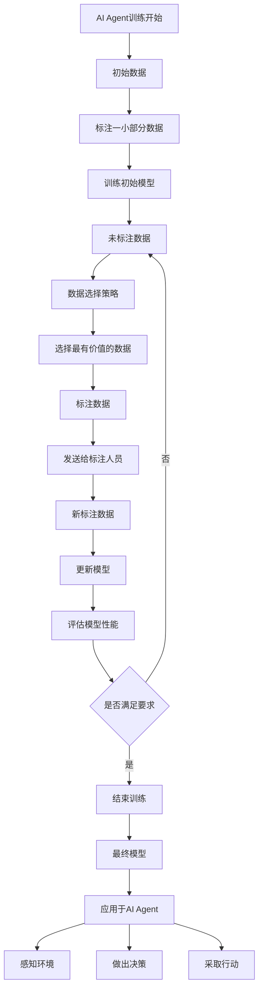

# 主动学习在AI Agent训练中的应用

> 关键词：主动学习、AI Agent、训练、机器学习、智能体、数据标注、模型优化

> 摘要：本文深入探讨了主动学习在AI Agent训练中的应用。首先介绍了主动学习和AI Agent的背景知识，明确了研究的目的、范围和预期读者。接着阐述了主动学习与AI Agent的核心概念及其联系，详细讲解了核心算法原理和具体操作步骤，并给出了Python源代码示例。同时，介绍了相关的数学模型和公式，并结合实际例子进行说明。通过项目实战，展示了如何将主动学习应用于AI Agent训练中，包括开发环境搭建、源代码实现和代码解读。还探讨了主动学习在AI Agent训练中的实际应用场景，推荐了相关的学习资源、开发工具框架和论文著作。最后，总结了主动学习在AI Agent训练中的未来发展趋势与挑战，并提供了常见问题的解答和扩展阅读参考资料。

## 1. 背景介绍 
### 1.1 目的和范围
随着人工智能技术的不断发展，AI Agent在各个领域的应用越来越广泛。然而，AI Agent的训练往往需要大量的标注数据，数据标注过程不仅耗时耗力，而且成本高昂。主动学习作为一种有效的数据选择策略，可以在减少标注数据量的同时提高模型的性能，因此在AI Agent训练中具有重要的应用价值。本文的目的是深入探讨主动学习在AI Agent训练中的应用，包括其原理、算法、实际应用场景等方面，为相关研究和实践提供参考。

### 1.2 预期读者
本文的预期读者包括人工智能领域的研究人员、开发者、学生以及对主动学习和AI Agent训练感兴趣的技术爱好者。对于有一定机器学习基础的读者，本文可以帮助他们深入理解主动学习在AI Agent训练中的应用；对于初学者，本文也可以作为一个入门指南，引导他们了解相关的概念和技术。

### 1.3 文档结构概述
本文共分为十个部分。第一部分介绍了主动学习在AI Agent训练中应用的背景，包括目的、范围、预期读者和文档结构概述。第二部分阐述了主动学习和AI Agent的核心概念及其联系，并给出了相应的文本示意图和Mermaid流程图。第三部分详细讲解了主动学习的核心算法原理和具体操作步骤，并提供了Python源代码示例。第四部分介绍了相关的数学模型和公式，并结合实际例子进行说明。第五部分通过项目实战，展示了如何将主动学习应用于AI Agent训练中，包括开发环境搭建、源代码实现和代码解读。第六部分探讨了主动学习在AI Agent训练中的实际应用场景。第七部分推荐了相关的学习资源、开发工具框架和论文著作。第八部分总结了主动学习在AI Agent训练中的未来发展趋势与挑战。第九部分提供了常见问题的解答。第十部分列出了扩展阅读参考资料。

### 1.4 术语表
#### 1.4.1 核心术语定义
- **主动学习（Active Learning）**：是一种机器学习方法，通过主动选择最有价值的数据进行标注，以提高模型的性能，减少对大量标注数据的依赖。
- **AI Agent（人工智能智能体）**：是一种能够感知环境、做出决策并采取行动以实现特定目标的智能实体。
- **标注数据（Labeled Data）**：是指已经被标记了正确答案或标签的数据，用于训练机器学习模型。
- **未标注数据（Unlabeled Data）**：是指尚未被标记正确答案或标签的数据。

#### 1.4.2 相关概念解释
- **模型性能（Model Performance）**：是指机器学习模型在预测、分类等任务中的表现，通常用准确率、召回率、F1值等指标来衡量。
- **数据选择策略（Data Selection Strategy）**：是指主动学习中用于选择最有价值数据进行标注的方法，常见的有不确定性采样、查询合成等。
- **迭代训练（Iterative Training）**：是指在主动学习中，通过不断选择数据进行标注，然后使用新的标注数据更新模型，重复这个过程直到模型性能满足要求。

#### 1.4.3 缩略词列表
- **ML（Machine Learning）**：机器学习
- **AL（Active Learning）**：主动学习
- **AI（Artificial Intelligence）**：人工智能

## 2. 核心概念与联系 
### 2.1 主动学习的核心概念
主动学习是一种特殊的机器学习方法，它的核心思想是通过主动选择最有价值的数据进行标注，从而在有限的标注数据下获得更好的模型性能。在传统的监督学习中，通常需要大量的标注数据来训练模型，而标注数据的获取往往是一个耗时耗力的过程。主动学习则通过智能地选择数据，使得每次标注的数据都能对模型的性能提升产生最大的影响。

主动学习的基本流程通常包括以下几个步骤：
1. 初始阶段：选择一小部分数据进行标注，训练一个初始模型。
2. 数据选择：使用当前模型对未标注数据进行评估，选择最有价值的数据。
3. 数据标注：将选择的数据发送给标注人员进行标注。
4. 模型更新：使用新的标注数据更新模型。
5. 重复步骤2-4，直到模型性能满足要求或达到预定的迭代次数。

### 2.2 AI Agent的核心概念
AI Agent是一种能够感知环境、做出决策并采取行动以实现特定目标的智能实体。它可以是软件程序、机器人或其他具有智能行为的系统。AI Agent通常由以下几个部分组成：
1. **感知模块（Perception Module）**：用于感知环境信息，例如图像、声音、传感器数据等。
2. **决策模块（Decision Module）**：根据感知到的环境信息和目标，做出决策。
3. **行动模块（Action Module）**：根据决策结果采取相应的行动。

AI Agent的训练通常需要大量的标注数据和复杂的算法，以使其能够在不同的环境中做出准确的决策和行动。

### 2.3 主动学习与AI Agent的联系
主动学习在AI Agent训练中具有重要的应用价值。由于AI Agent的训练需要大量的标注数据，而数据标注成本高昂，主动学习可以通过选择最有价值的数据进行标注，减少标注数据的量，从而降低训练成本。同时，主动学习可以提高模型的性能，使得AI Agent能够更快地学习和适应环境。

具体来说，主动学习可以应用于AI Agent训练的以下几个方面：
1. **数据选择**：在AI Agent训练过程中，主动学习可以帮助选择最有价值的环境数据进行标注，例如选择那些对模型性能提升最大的图像、声音或传感器数据。
2. **模型优化**：通过不断选择新的数据进行标注和模型更新，主动学习可以帮助AI Agent优化其决策和行动策略，提高其在不同环境中的性能。
3. **适应新环境**：当AI Agent面临新的环境时，主动学习可以帮助其快速适应，通过选择新环境中的关键数据进行标注和模型更新，使AI Agent能够在新环境中做出准确的决策和行动。

### 2.4 文本示意图
主动学习与AI Agent的联系可以用以下文本示意图表示：

```plaintext
AI Agent训练
|
|-- 初始数据
|   |-- 标注一小部分数据
|   |-- 训练初始模型
|
|-- 主动学习循环
|   |-- 未标注数据
|   |   |-- 数据选择策略
|   |   |   |-- 选择最有价值的数据
|   |   |-- 标注数据
|   |   |   |-- 发送给标注人员
|   |   |-- 新标注数据
|   |   |   |-- 更新模型
|   |   |-- 评估模型性能
|   |   |   |-- 是否满足要求
|   |   |       |-- 是 --> 结束训练
|   |   |       |-- 否 --> 继续循环
|
|-- 最终模型
|   |-- 应用于AI Agent
|   |   |-- 感知环境
|   |   |-- 做出决策
|   |   |-- 采取行动
```

### 2.5 Mermaid流程图


## 3. 核心算法原理 & 具体操作步骤 
### 3.1 主动学习的核心算法原理
主动学习的核心算法原理在于如何选择最有价值的数据进行标注。常见的数据选择策略有以下几种：

#### 3.1.1 不确定性采样（Uncertainty Sampling）
不确定性采样是最常用的主动学习数据选择策略之一。其基本思想是选择模型对其预测最不确定的数据进行标注。对于分类问题，通常可以使用以下几种方法来衡量模型的不确定性：
- **最小置信度（Least Confidence）**：选择模型预测概率最小的样本。即对于一个样本 $x$，模型预测其属于各个类别的概率为 $p_1, p_2, \cdots, p_n$，选择 $\min\{p_1, p_2, \cdots, p_n\}$ 最小的样本。
- **最大熵（Maximum Entropy）**：选择熵最大的样本。熵的计算公式为 $H(p) = -\sum_{i=1}^{n} p_i \log(p_i)$，其中 $p_i$ 是模型预测样本属于第 $i$ 类的概率。

#### 3.1.2 查询合成（Query Synthesis）
查询合成是一种主动学习策略，它不是从已有的未标注数据中选择样本，而是通过合成新的样本来进行查询。例如，在图像分类任务中，可以通过对已有图像进行旋转、缩放、裁剪等操作合成新的图像，然后让模型对这些新图像进行预测，选择预测结果最不确定的图像进行标注。

#### 3.1.3 基于委员会的查询（Query by Committee）
基于委员会的查询是一种集成学习的主动学习策略。它使用多个不同的模型组成一个委员会，对于每个未标注样本，让委员会中的每个模型进行预测，然后选择委员会成员预测结果差异最大的样本进行标注。

### 3.2 具体操作步骤
以下是使用不确定性采样策略进行主动学习的具体操作步骤：

#### 3.2.1 初始化
1. 收集一批未标注数据 $U$ 和一小部分标注数据 $L$。
2. 使用标注数据 $L$ 训练一个初始模型 $M$。

#### 3.2.2 迭代过程
1. **数据选择**：使用当前模型 $M$ 对未标注数据 $U$ 进行预测，计算每个样本的不确定性得分（例如最小置信度或最大熵）。选择不确定性得分最高的 $k$ 个样本，记为 $S$。
2. **数据标注**：将选择的样本 $S$ 发送给标注人员进行标注，得到标注后的数据 $S'$。
3. **数据更新**：将标注后的数据 $S'$ 加入到标注数据 $L$ 中，即 $L = L \cup S'$，同时从未标注数据 $U$ 中移除 $S$，即 $U = U - S$。
4. **模型更新**：使用更新后的标注数据 $L$ 重新训练模型 $M$。
5. **评估模型性能**：使用验证集评估模型 $M$ 的性能。如果模型性能满足要求，则结束迭代；否则，返回步骤1继续迭代。

### 3.3 Python源代码示例
以下是一个使用Python和Scikit-learn库实现的简单主动学习示例，使用最小置信度作为不确定性采样策略：

```python
import numpy as np
from sklearn.datasets import make_classification
from sklearn.model_selection import train_test_split
from sklearn.linear_model import LogisticRegression

# 生成数据集
X, y = make_classification(n_samples=1000, n_features=20, n_informative=10, n_classes=2, random_state=42)

# 划分训练集、验证集和未标注数据集
X_train, X_test, y_train, y_test = train_test_split(X, y, test_size=0.2, random_state=42)
X_unlabeled, X_labeled, y_unlabeled, y_labeled = train_test_split(X_train, y_train, test_size=0.1, random_state=42)

# 初始化模型
model = LogisticRegression()

# 初始训练
model.fit(X_labeled, y_labeled)

# 主动学习迭代
num_iterations = 10
k = 10  # 每次选择的样本数

for iteration in range(num_iterations):
    # 数据选择
    probabilities = model.predict_proba(X_unlabeled)
    min_confidence = np.min(probabilities, axis=1)
    selected_indices = np.argsort(min_confidence)[-k:]
    selected_samples = X_unlabeled[selected_indices]
    selected_labels = y_unlabeled[selected_indices]

    # 数据更新
    X_labeled = np.concatenate((X_labeled, selected_samples))
    y_labeled = np.concatenate((y_labeled, selected_labels))
    X_unlabeled = np.delete(X_unlabeled, selected_indices, axis=0)
    y_unlabeled = np.delete(y_unlabeled, selected_indices)

    # 模型更新
    model.fit(X_labeled, y_labeled)

    # 评估模型性能
    accuracy = model.score(X_test, y_test)
    print(f'Iteration {iteration + 1}: Accuracy = {accuracy}')
```

## 4. 数学模型和公式 & 详细讲解 & 举例说明 
### 4.1 不确定性采样的数学模型和公式
#### 4.1.1 最小置信度
对于一个分类问题，假设模型对样本 $x$ 预测其属于 $n$ 个类别的概率分别为 $p_1, p_2, \cdots, p_n$，则最小置信度的计算公式为：
$$
\text{Least Confidence}(x) = \min\{p_1, p_2, \cdots, p_n\}
$$

在主动学习中，我们选择最小置信度最小的样本进行标注，因为这些样本是模型最不确定的。

**举例说明**：假设一个二分类问题，模型对样本 $x_1$ 预测其属于类别 0 的概率为 $p_{10} = 0.3$，属于类别 1 的概率为 $p_{11} = 0.7$；对样本 $x_2$ 预测其属于类别 0 的概率为 $p_{20} = 0.4$，属于类别 1 的概率为 $p_{21} = 0.6$。则 $\text{Least Confidence}(x_1) = 0.3$，$\text{Least Confidence}(x_2) = 0.4$。因为 $0.3 < 0.4$，所以在主动学习中会优先选择样本 $x_1$ 进行标注。

#### 4.1.2 最大熵
熵是用来衡量随机变量不确定性的一个指标。对于一个分类问题，假设模型对样本 $x$ 预测其属于 $n$ 个类别的概率分别为 $p_1, p_2, \cdots, p_n$，则熵的计算公式为：
$$
H(p) = -\sum_{i=1}^{n} p_i \log(p_i)
$$

在主动学习中，我们选择熵最大的样本进行标注，因为这些样本的不确定性最大。

**举例说明**：假设一个二分类问题，模型对样本 $x_1$ 预测其属于类别 0 的概率为 $p_{10} = 0.2$，属于类别 1 的概率为 $p_{11} = 0.8$；对样本 $x_2$ 预测其属于类别 0 的概率为 $p_{20} = 0.5$，属于类别 1 的概率为 $p_{21} = 0.5$。

对于样本 $x_1$，其熵为：
$$
H(p_1) = - (0.2 \log(0.2) + 0.8 \log(0.8)) \approx 0.722
$$

对于样本 $x_2$，其熵为：
$$
H(p_2) = - (0.5 \log(0.5) + 0.5 \log(0.5)) = \log(2) \approx 0.693
$$

因为 $0.722 > 0.693$，所以在主动学习中会优先选择样本 $x_1$ 进行标注。

### 4.2 基于委员会的查询的数学模型和公式
基于委员会的查询使用多个不同的模型组成一个委员会，对于每个未标注样本 $x$，让委员会中的每个模型进行预测，然后计算委员会成员预测结果的差异。常见的差异度量方法有分歧度（Disagreement）。

假设委员会中有 $m$ 个模型，对于样本 $x$，第 $i$ 个模型的预测结果为 $y_i$，则分歧度的计算公式为：
$$
\text{Disagreement}(x) = \frac{1}{m(m - 1)} \sum_{i=1}^{m - 1} \sum_{j = i + 1}^{m} \delta(y_i, y_j)
$$
其中 $\delta(y_i, y_j)$ 是一个指示函数，当 $y_i \neq y_j$ 时，$\delta(y_i, y_j) = 1$；当 $y_i = y_j$ 时，$\delta(y_i, y_j) = 0$。

在主动学习中，我们选择分歧度最大的样本进行标注，因为这些样本是委员会成员最不一致的。

**举例说明**：假设委员会中有 3 个模型，对于样本 $x$，模型 1 的预测结果为 $y_1 = 0$，模型 2 的预测结果为 $y_2 = 1$，模型 3 的预测结果为 $y_3 = 0$。

则 $\delta(y_1, y_2) = 1$，$\delta(y_1, y_3) = 0$，$\delta(y_2, y_3) = 1$。

分歧度为：
$$
\text{Disagreement}(x) = \frac{1}{3 \times 2} (1 + 0 + 1) = \frac{1}{3}
$$

如果另一个样本 $x'$ 的分歧度为 $\frac{2}{3}$，则在主动学习中会优先选择样本 $x'$ 进行标注。

## 5. 项目实战：代码实际案例和详细解释说明 
### 5.1  开发环境搭建
在进行主动学习在AI Agent训练中的项目实战之前，需要搭建相应的开发环境。以下是具体的步骤：

#### 5.1.1 安装Python
首先需要安装Python，建议使用Python 3.6及以上版本。可以从Python官方网站（https://www.python.org/downloads/） 下载安装包，然后按照安装向导进行安装。

#### 5.1.2 安装必要的库
在项目中需要使用一些Python库，如Scikit-learn、NumPy、Pandas等。可以使用pip命令进行安装：
```sh
pip install scikit-learn numpy pandas
```

#### 5.1.3 选择开发工具
可以选择使用集成开发环境（IDE）如PyCharm或文本编辑器如VS Code进行代码开发。

### 5.2  源代码详细实现和代码解读
以下是一个使用主动学习训练AI Agent进行图像分类的项目实战示例。我们将使用MNIST手写数字数据集，使用卷积神经网络（CNN）作为模型，使用最小置信度作为主动学习的数据选择策略。

```python
import numpy as np
import tensorflow as tf
from tensorflow.keras.datasets import mnist
from tensorflow.keras.models import Sequential
from tensorflow.keras.layers import Conv2D, MaxPooling2D, Flatten, Dense
from tensorflow.keras.utils import to_categorical

# 加载MNIST数据集
(X_train, y_train), (X_test, y_test) = mnist.load_data()

# 数据预处理
X_train = X_train.reshape(-1, 28, 28, 1).astype('float32') / 255.0
X_test = X_test.reshape(-1, 28, 28, 1).astype('float32') / 255.0
y_train = to_categorical(y_train, 10)
y_test = to_categorical(y_test, 10)

# 划分初始标注数据和未标注数据
num_initial_samples = 100
X_labeled = X_train[:num_initial_samples]
y_labeled = y_train[:num_initial_samples]
X_unlabeled = X_train[num_initial_samples:]
y_unlabeled = y_train[num_initial_samples:]

# 定义CNN模型
def create_model():
    model = Sequential([
        Conv2D(32, (3, 3), activation='relu', input_shape=(28, 28, 1)),
        MaxPooling2D((2, 2)),
        Conv2D(64, (3, 3), activation='relu'),
        MaxPooling2D((2, 2)),
        Flatten(),
        Dense(64, activation='relu'),
        Dense(10, activation='softmax')
    ])
    model.compile(optimizer='adam', loss='categorical_crossentropy', metrics=['accuracy'])
    return model

# 初始训练
model = create_model()
model.fit(X_labeled, y_labeled, epochs=10, batch_size=32, verbose=1)

# 主动学习迭代
num_iterations = 10
k = 10  # 每次选择的样本数

for iteration in range(num_iterations):
    # 数据选择
    probabilities = model.predict(X_unlabeled)
    min_confidence = np.min(probabilities, axis=1)
    selected_indices = np.argsort(min_confidence)[-k:]
    selected_samples = X_unlabeled[selected_indices]
    selected_labels = y_unlabeled[selected_indices]

    # 数据更新
    X_labeled = np.concatenate((X_labeled, selected_samples))
    y_labeled = np.concatenate((y_labeled, selected_labels))
    X_unlabeled = np.delete(X_unlabeled, selected_indices, axis=0)
    y_unlabeled = np.delete(y_unlabeled, selected_indices, axis=0)

    # 模型更新
    model.fit(X_labeled, y_labeled, epochs=10, batch_size=32, verbose=1)

    # 评估模型性能
    _, accuracy = model.evaluate(X_test, y_test, verbose=0)
    print(f'Iteration {iteration + 1}: Accuracy = {accuracy}')
```

### 5.3  代码解读与分析
#### 5.3.1 数据加载和预处理
首先使用 `mnist.load_data()` 函数加载MNIST数据集，然后对数据进行预处理，包括将图像数据归一化到 [0, 1] 范围，将标签数据进行one-hot编码。

#### 5.3.2 划分初始标注数据和未标注数据
从训练数据中选择一小部分作为初始标注数据，其余作为未标注数据。

#### 5.3.3 定义CNN模型
使用 `Sequential` 模型定义一个简单的卷积神经网络，包括卷积层、池化层、全连接层等。然后使用 `compile` 方法编译模型，指定优化器、损失函数和评估指标。

#### 5.3.4 初始训练
使用初始标注数据对模型进行初始训练。

#### 5.3.5 主动学习迭代
在每次迭代中，首先使用当前模型对未标注数据进行预测，计算每个样本的最小置信度，选择最小置信度最小的 $k$ 个样本进行标注。然后将标注后的数据加入到标注数据中，从未标注数据中移除这些样本。最后使用更新后的标注数据重新训练模型，并评估模型在测试集上的性能。

通过主动学习迭代，可以在减少标注数据量的情况下提高模型的性能。

## 6. 实际应用场景 
主动学习在AI Agent训练中有广泛的实际应用场景，以下是一些常见的场景：

### 6.1 图像识别领域
在图像识别任务中，如人脸识别、物体检测、医学图像分析等，数据标注通常需要专业的知识和大量的时间。主动学习可以帮助选择最有价值的图像数据进行标注，从而减少标注工作量，提高模型的性能。例如，在医学图像分析中，病理学家可以只标注那些模型最不确定的图像，从而更高效地训练出准确的疾病诊断模型。

### 6.2 自然语言处理领域
在自然语言处理任务中，如文本分类、情感分析、机器翻译等，数据标注也面临着挑战。主动学习可以选择最有代表性和最具挑战性的文本数据进行标注，提高模型的泛化能力。例如，在文本分类任务中，主动学习可以选择那些边界模糊的文本进行标注，帮助模型更好地区分不同的类别。

### 6.3 机器人领域
在机器人的训练中，AI Agent需要学习如何感知环境、做出决策并采取行动。主动学习可以帮助机器人选择最有价值的环境数据进行标注，例如选择那些对机器人行为影响最大的传感器数据。通过主动学习，机器人可以更快地学习和适应不同的环境，提高其智能水平和任务执行能力。

### 6.4 游戏领域
在游戏AI中，AI Agent需要学习如何在游戏环境中做出最优决策。主动学习可以选择最具挑战性的游戏状态数据进行标注，帮助AI Agent学习到更复杂的策略。例如，在策略游戏中，主动学习可以选择那些局势复杂、决策困难的游戏状态进行标注，提高AI Agent的游戏水平。

### 6.5 自动驾驶领域
在自动驾驶中，AI Agent需要处理大量的传感器数据，如摄像头图像、雷达数据等，以做出安全的驾驶决策。主动学习可以选择那些对自动驾驶决策影响最大的数据进行标注，例如选择那些交通场景复杂、难以判断的图像数据。通过主动学习，可以提高自动驾驶系统的准确性和可靠性。

## 7. 工具和资源推荐
### 7.1 学习资源推荐
#### 7.1.1 书籍推荐
- 《机器学习》（周志华著）：这是一本经典的机器学习教材，全面介绍了机器学习的基本概念、算法和应用，对于理解主动学习和AI Agent训练的理论基础有很大帮助。
- 《深度学习》（Ian Goodfellow、Yoshua Bengio和Aaron Courville著）：这本书深入介绍了深度学习的原理和技术，对于理解卷积神经网络、循环神经网络等在AI Agent训练中的应用有很大帮助。
- 《主动学习》（Burr Settles著）：这是一本专门介绍主动学习的书籍，详细讲解了主动学习的算法、理论和应用，是学习主动学习的重要参考资料。

#### 7.1.2 在线课程
- Coursera上的“机器学习”课程（Andrew Ng教授授课）：这是一门非常经典的机器学习在线课程，系统地介绍了机器学习的基本概念和算法，适合初学者学习。
- edX上的“深度学习”课程（由不同的教授授课）：这些课程深入介绍了深度学习的原理和应用，对于提高深度学习的实践能力有很大帮助。
- 中国大学MOOC上的“人工智能”课程：这些课程涵盖了人工智能的各个方面，包括主动学习和AI Agent训练，是学习人工智能的重要资源。

#### 7.1.3 技术博客和网站
- Medium（https://medium.com/）：这是一个技术博客平台，有很多关于主动学习、AI Agent训练等人工智能领域的优质文章。
- arXiv（https://arxiv.org/）：这是一个预印本平台，提供了大量的学术论文，包括主动学习和AI Agent训练的最新研究成果。
- AI科技评论（https://www.aitechtitans.com/）：这是一个专注于人工智能领域的科技媒体，提供了很多关于人工智能技术的报道和分析。

### 7.2 开发工具框架推荐
#### 7.2.1 IDE和编辑器
- PyCharm：这是一个专业的Python集成开发环境，提供了代码编辑、调试、版本控制等功能，非常适合Python开发。
- VS Code：这是一个轻量级的代码编辑器，支持多种编程语言，有丰富的插件扩展，适合快速开发和调试。

#### 7.2.2 调试和性能分析工具
- TensorBoard：这是TensorFlow提供的一个可视化工具，可以帮助用户可视化模型的训练过程、性能指标等，方便调试和优化模型。
- PyTorch Profiler：这是PyTorch提供的一个性能分析工具，可以帮助用户分析模型的性能瓶颈，优化模型的运行效率。

#### 7.2.3 相关框架和库
- Scikit-learn：这是一个常用的机器学习库，提供了各种机器学习算法和工具，包括分类、回归、聚类等，方便实现主动学习算法。
- TensorFlow：这是一个开源的深度学习框架，提供了丰富的深度学习模型和工具，适合开发AI Agent训练的深度学习模型。
- PyTorch：这是另一个流行的深度学习框架，具有动态图的优势，适合快速开发和实验。

### 7.3 相关论文著作推荐
#### 7.3.1 经典论文
- “Active Learning Literature Survey”（Burr Settles著）：这是一篇关于主动学习的经典综述论文，全面介绍了主动学习的发展历程、算法和应用。
- “Deep Residual Learning for Image Recognition”（Kaiming He等著）：这篇论文提出了残差网络（ResNet），在图像识别领域取得了很大的成功，对于理解深度学习在AI Agent训练中的应用有重要意义。

#### 7.3.2 最新研究成果
- 在arXiv上搜索“active learning in AI agent training”可以找到很多关于主动学习在AI Agent训练中的最新研究成果。
- 参加人工智能领域的学术会议，如NeurIPS、ICML、CVPR等，可以了解到该领域的最新研究进展。

#### 7.3.3 应用案例分析
- 一些开源项目和研究报告中会有主动学习在AI Agent训练中的应用案例分析，可以参考这些案例学习如何将主动学习应用到实际项目中。

## 8. 总结：未来发展趋势与挑战
### 8.1 未来发展趋势
#### 8.1.1 与强化学习的结合
主动学习与强化学习的结合是未来的一个重要发展趋势。强化学习通过智能体与环境的交互来学习最优策略，而主动学习可以帮助强化学习选择最有价值的交互数据进行学习，从而提高强化学习的效率和性能。例如，在机器人控制、自动驾驶等领域，将主动学习与强化学习相结合，可以使智能体更快地学习到最优的行为策略。

#### 8.1.2 多模态主动学习
随着人工智能技术的发展，多模态数据（如图像、文本、音频等）的处理变得越来越重要。多模态主动学习可以同时处理多种类型的数据，选择最有价值的多模态数据进行标注，从而提高模型的性能。例如，在智能客服、智能安防等领域，多模态主动学习可以结合图像、文本和语音信息，提供更准确的服务和决策。

#### 8.1.3 自适应主动学习策略
未来的主动学习将更加注重自适应策略的研究。自适应主动学习可以根据不同的任务、数据分布和模型状态，自动调整数据选择策略，以达到最优的学习效果。例如，在数据分布不断变化的场景中，自适应主动学习可以实时调整数据选择策略，使模型能够快速适应新的数据分布。

### 8.2 挑战
#### 8.2.1 数据选择策略的优化
虽然已经有很多数据选择策略，但如何选择最优的数据选择策略仍然是一个挑战。不同的任务和数据分布可能需要不同的数据选择策略，而且在实际应用中，很难确定哪种策略是最优的。因此，需要进一步研究和优化数据选择策略，以提高主动学习的性能。

#### 8.2.2 标注成本的控制
尽管主动学习可以减少标注数据的量，但标注成本仍然是一个重要的问题。在一些领域，如医学图像分析、自然语言处理等，标注数据需要专业的知识和技能，标注成本较高。因此，需要探索如何进一步降低标注成本，例如通过半监督学习、弱监督学习等方法。

#### 8.2.3 模型的可解释性
随着深度学习模型在AI Agent训练中的广泛应用，模型的可解释性变得越来越重要。主动学习选择的数据对模型的性能有很大的影响，但很难解释为什么选择这些数据。因此，需要研究如何提高主动学习模型的可解释性，以便更好地理解模型的决策过程和性能。

## 9. 附录：常见问题与解答
### 9.1 主动学习与传统监督学习有什么区别？
传统监督学习需要大量的标注数据来训练模型，而主动学习通过主动选择最有价值的数据进行标注，可以在减少标注数据量的情况下提高模型的性能。主动学习更加注重数据的选择和利用，而传统监督学习则更侧重于模型的训练和优化。

### 9.2 主动学习一定能提高模型的性能吗？
不一定。主动学习的效果取决于数据选择策略的有效性和数据的质量。如果数据选择策略不合理，或者数据本身存在噪声和偏差，主动学习可能无法提高模型的性能。此外，主动学习的性能还受到模型复杂度、训练迭代次数等因素的影响。

### 9.3 如何选择合适的数据选择策略？
选择合适的数据选择策略需要考虑任务的类型、数据的分布、模型的特点等因素。一般来说，可以通过实验比较不同的数据选择策略在验证集上的性能，选择性能最好的策略。此外，还可以根据任务的特点和数据的分布，设计自定义的数据选择策略。

### 9.4 主动学习的标注数据量如何确定？
主动学习的标注数据量可以根据任务的复杂度、模型的性能要求和标注成本等因素来确定。一般来说，可以从一小部分标注数据开始，通过迭代训练逐步增加标注数据量，直到模型的性能满足要求或达到预定的标注数据量上限。

### 9.5 主动学习在实际应用中需要注意什么？
在实际应用中，需要注意以下几点：
1. 数据的质量：确保标注数据的质量，避免数据中存在噪声和偏差。
2. 标注人员的培训：对标注人员进行培训，确保他们能够准确地标注数据。
3. 模型的评估：定期评估模型的性能，根据评估结果调整数据选择策略和模型参数。
4. 计算资源的管理：主动学习可能需要多次迭代训练，需要合理管理计算资源，避免计算资源的浪费。

## 10. 扩展阅读 & 参考资料
### 10.1 扩展阅读
- 《人工智能：一种现代的方法》（Stuart Russell和Peter Norvig著）：这本书全面介绍了人工智能的各个方面，包括机器学习、自然语言处理、计算机视觉等，对于深入了解人工智能领域有很大帮助。
- 《动手学深度学习》（李沐等著）：这本书通过实践项目的方式介绍了深度学习的原理和应用，适合初学者快速上手深度学习。

### 10.2 参考资料
1. Settles, B. (2010). Active Learning Literature Survey. University of Wisconsin–Madison.
2. He, K., Zhang, X., Ren, S., & Sun, J. (2016). Deep Residual Learning for Image Recognition. Proceedings of the IEEE conference on computer vision and pattern recognition.
3. Goodfellow, I., Bengio, Y., & Courville, A. (2016). Deep Learning. MIT Press.
4. Zhou, Z. H. (2016). Machine Learning. Tsinghua University Press.