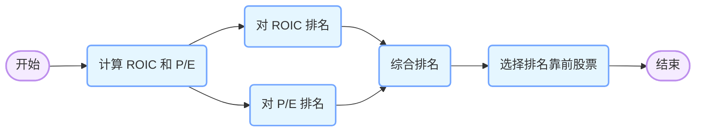

# 乔尔格林布拉特的价值投资教育

> 关键词：乔尔格林布拉特、价值投资、投资教育、投资策略、财务分析

> 摘要：本文聚焦于乔尔格林布拉特的价值投资教育理念与方法。通过深入剖析其价值投资的核心概念、策略原理，结合数学模型与实际案例，全面展现了格林布拉特价值投资体系的魅力与实用性。旨在让读者了解格林布拉特的投资智慧，掌握价值投资的基本方法与技巧，从而在投资领域做出更明智的决策。同时，探讨了价值投资在不同场景下的应用，推荐了相关学习资源与工具，分析了未来价值投资的发展趋势与挑战，为投资者提供全面且深入的价值投资指引。

## 1. 背景介绍 
### 1.1 目的和范围
本文的目的在于系统地介绍乔尔格林布拉特的价值投资教育内容。通过对其投资理论、策略以及实践方法的详细阐述，帮助投资者深入理解价值投资的本质，掌握格林布拉特所倡导的投资方法。范围涵盖了格林布拉特价值投资的核心概念、算法原理、数学模型、实际应用案例等多个方面，旨在为投资者提供全面且深入的价值投资知识体系。

### 1.2 预期读者
本文预期读者包括对投资领域感兴趣的初学者、有一定投资经验但希望提升投资水平的投资者、金融专业的学生以及从事金融投资研究的相关人员。无论您是刚刚接触投资领域，还是已经在市场中摸爬滚打多年，都能从本文中获取有价值的信息，提升自己的投资素养。

### 1.3 文档结构概述
本文将按照以下结构展开：首先介绍乔尔格林布拉特价值投资的背景信息，包括目的、读者群体和文档结构。接着阐述核心概念与联系，通过文本示意图和 Mermaid 流程图展示其投资体系的架构。然后深入讲解核心算法原理与具体操作步骤，结合 Python 源代码进行详细说明。随后介绍数学模型和公式，并通过举例进行详细讲解。在项目实战部分，通过实际案例和代码详细解释其投资方法的应用。之后探讨实际应用场景，推荐相关的工具和资源。最后总结未来发展趋势与挑战，解答常见问题，并提供扩展阅读和参考资料。

### 1.4 术语表
#### 1.4.1 核心术语定义
- **价值投资**：是一种基于对股票内在价值的分析，寻找被市场低估的股票进行投资的策略。投资者通过对公司财务状况、行业前景等因素的研究，确定股票的内在价值，并在价格低于内在价值时买入，等待价格回归价值时实现收益。
- **资本回报率（ROIC）**：是指投出和/或使用资金与相关回报（回报通常表现为获取的利息和/或分得利润）之比例。用于衡量投入资本的使用效率，反映公司运用资本创造利润的能力。
- **市盈率（P/E）**：是指股票价格除以每股收益（EPS）的比率。它反映了市场对公司盈利的预期，是衡量股票估值的重要指标之一。
- **神奇公式**：是乔尔格林布拉特提出的一种投资策略，通过对公司的资本回报率和市盈率进行排名，筛选出具有投资价值的股票组合。

#### 1.4.2 相关概念解释
- **内在价值**：是指公司未来现金流量的现值。它是公司真正的价值所在，不受市场短期波动的影响。投资者通过对公司的基本面分析，如财务报表、行业竞争地位、管理层能力等，来估算公司的内在价值。
- **安全边际**：是指股票价格低于其内在价值的部分。投资者在投资时，会寻找具有足够安全边际的股票，以降低投资风险。当股票价格下跌时，由于存在安全边际，投资者的损失相对较小；而当股票价格上涨时，投资者则可以获得较高的收益。
- **市场效率**：是指市场价格反映所有可用信息的程度。有效市场假说认为，在有效市场中，股票价格已经反映了所有公开信息，因此投资者无法通过分析公开信息获得超额收益。然而，价值投资者认为市场并非完全有效，存在被低估的股票，通过深入研究可以发现这些投资机会。

#### 1.4.3 缩略词列表
- **ROIC**：Return on Invested Capital（资本回报率）
- **P/E**：Price-to-Earnings Ratio（市盈率）

## 2. 核心概念与联系 
### 2.1 价值投资的核心概念
价值投资的核心在于寻找被市场低估的股票，通过长期持有实现资产的增值。其基本理念基于以下几点：
- **股票是公司的一部分**：价值投资者将股票视为公司的所有权凭证，而不仅仅是一种交易的筹码。他们关注公司的基本面，如盈利能力、资产质量、竞争优势等，以评估公司的内在价值。
- **市场先生**：这是巴菲特提出的一个概念，将市场比喻为一个情绪不稳定的“市场先生”。市场先生每天都会给出一个股票的报价，有时过高，有时过低。价值投资者会利用市场先生的情绪波动，在价格低于内在价值时买入，在价格高于内在价值时卖出。
- **安全边际**：为了降低投资风险，价值投资者会寻找具有足够安全边际的股票。安全边际是投资的“缓冲垫”，可以在市场下跌时保护投资者的本金。

### 2.2 乔尔格林布拉特的神奇公式
乔尔格林布拉特的神奇公式是一种简单而有效的价值投资策略。该公式通过对公司的资本回报率（ROIC）和市盈率（P/E）进行排名，筛选出具有较高投资价值的股票组合。具体步骤如下：
1. 计算每家公司的资本回报率（ROIC）和市盈率（P/E）。
2. 对所有公司的 ROIC 进行排名，ROIC 越高排名越靠前。
3. 对所有公司的 P/E 进行排名，P/E 越低排名越靠前。
4. 将每家公司的 ROIC 排名和 P/E 排名相加，得到综合排名。
5. 选择综合排名靠前的股票组成投资组合。

### 2.3 核心概念的联系
价值投资的核心概念与乔尔格林布拉特的神奇公式密切相关。神奇公式通过对 ROIC 和 P/E 的排名，筛选出具有较高盈利能力和较低估值的股票，这正是价值投资寻找被低估股票的具体实现方法。安全边际则体现在选择低 P/E 的股票上，因为低 P/E 意味着股票价格相对较低，具有更大的安全边际。同时，高 ROIC 反映了公司的盈利能力和资本使用效率，是评估公司内在价值的重要指标之一。

### 2.4 文本示意图
```plaintext
价值投资
|-- 核心理念
|   |-- 股票是公司的一部分
|   |-- 市场先生
|   |-- 安全边际
|-- 乔尔格林布拉特的神奇公式
|   |-- 计算 ROIC 和 P/E
|   |-- 排名 ROIC 和 P/E
|   |-- 综合排名
|   |-- 选择股票组合
```

### 2.5 Mermaid 流程图


## 3. 核心算法原理 & 具体操作步骤 
### 3.1 资本回报率（ROIC）的计算原理
资本回报率（ROIC）是衡量公司运用资本创造利润能力的重要指标。其计算公式为：

$$ROIC = \frac{EBIT}{(Total\ Assets - Current\ Liabilities)}$$

其中，$EBIT$ 是息税前利润，$Total\ Assets$ 是总资产，$Current\ Liabilities$ 是流动负债。

### 3.2 市盈率（P/E）的计算原理
市盈率（P/E）是衡量股票估值的重要指标。其计算公式为：

$$P/E = \frac{Stock\ Price}{Earnings\ per\ Share}$$

其中，$Stock\ Price$ 是股票价格，$Earnings\ per\ Share$ 是每股收益。

### 3.3 神奇公式的具体操作步骤
以下是使用 Python 实现神奇公式的具体代码：

```python
import pandas as pd

# 假设我们有一个包含公司信息的 DataFrame，包含股票代码、股票价格、息税前利润、总资产、流动负债、每股收益等列
data = {
    'Stock Code': ['A', 'B', 'C', 'D', 'E'],
    'Stock Price': [100, 200, 150, 300, 250],
    'EBIT': [20, 30, 25, 40, 35],
    'Total Assets': [200, 300, 250, 400, 350],
    'Current Liabilities': [50, 70, 60, 90, 80],
    'Earnings per Share': [2, 3, 2.5, 4, 3.5]
}

df = pd.DataFrame(data)

# 计算 ROIC
df['ROIC'] = df['EBIT'] / (df['Total Assets'] - df['Current Liabilities'])

# 计算 P/E
df['P/E'] = df['Stock Price'] / df['Earnings per Share']

# 对 ROIC 进行排名
df['ROIC Rank'] = df['ROIC'].rank(ascending=False)

# 对 P/E 进行排名
df['P/E Rank'] = df['P/E'].rank(ascending=True)

# 计算综合排名
df['Combined Rank'] = df['ROIC Rank'] + df['P/E Rank']

# 选择综合排名靠前的股票
top_stocks = df.nsmallest(3, 'Combined Rank')

print(top_stocks)
```

### 3.4 代码解释
1. **数据准备**：首先创建一个包含公司信息的 DataFrame，包含股票代码、股票价格、息税前利润、总资产、流动负债、每股收益等列。
2. **计算 ROIC**：根据 ROIC 的计算公式，计算每家公司的 ROIC。
3. **计算 P/E**：根据 P/E 的计算公式，计算每家公司的 P/E。
4. **排名**：对 ROIC 进行降序排名，对 P/E 进行升序排名。
5. **综合排名**：将 ROIC 排名和 P/E 排名相加，得到综合排名。
6. **选择股票**：选择综合排名靠前的股票作为投资组合。

## 4. 数学模型和公式 & 详细讲解 & 举例说明 
### 4.1 资本回报率（ROIC）的数学模型和公式
资本回报率（ROIC）的数学模型为：

$$ROIC = \frac{EBIT}{(Total\ Assets - Current\ Liabilities)}$$

#### 详细讲解
- **EBIT（息税前利润）**：是指公司在扣除利息和所得税之前的利润。它反映了公司的经营盈利能力，不考虑公司的融资结构和税收政策的影响。
- **Total Assets（总资产）**：是指公司拥有的全部资产，包括流动资产、固定资产、无形资产等。
- **Current Liabilities（流动负债）**：是指公司在一年内需要偿还的债务，包括短期借款、应付账款、应付票据等。

#### 举例说明
假设公司 A 的息税前利润为 100 万元，总资产为 500 万元，流动负债为 100 万元。则公司 A 的 ROIC 为：

$$ROIC_A = \frac{100}{(500 - 100)} = 0.25 = 25\%$$

### 4.2 市盈率（P/E）的数学模型和公式
市盈率（P/E）的数学模型为：

$$P/E = \frac{Stock\ Price}{Earnings\ per\ Share}$$

#### 详细讲解
- **Stock Price（股票价格）**：是指股票在市场上的交易价格。
- **Earnings per Share（每股收益）**：是指公司净利润除以总股本得到的每股盈利。

#### 举例说明
假设公司 B 的股票价格为 50 元，每股收益为 5 元。则公司 B 的 P/E 为：

$$P/E_B = \frac{50}{5} = 10$$

### 4.3 神奇公式的数学模型和公式
神奇公式通过对 ROIC 和 P/E 进行排名，综合排名的数学模型可以表示为：

$$Combined\ Rank = ROIC\ Rank + P/E\ Rank$$

#### 详细讲解
- **ROIC Rank**：是指公司的 ROIC 在所有公司中的排名，排名越高表示 ROIC 越高。
- **P/E Rank**：是指公司的 P/E 在所有公司中的排名，排名越低表示 P/E 越低。
- **Combined Rank**：是指公司的综合排名，综合排名越低表示公司的投资价值越高。

#### 举例说明
假设我们有三家公司 C、D、E，它们的 ROIC 排名分别为 1、2、3，P/E 排名分别为 3、2、1。则它们的综合排名分别为：

$$Combined\ Rank_C = 1 + 3 = 4$$
$$Combined\ Rank_D = 2 + 2 = 4$$
$$Combined\ Rank_E = 3 + 1 = 4$$

在这种情况下，三家公司的综合排名相同，我们可以根据其他因素进一步筛选。

## 5. 项目实战：代码实际案例和详细解释说明 
### 5.1  开发环境搭建
#### 5.1.1 安装 Python
首先，需要安装 Python 环境。可以从 Python 官方网站（https://www.python.org/downloads/） 下载适合自己操作系统的 Python 安装包，并按照安装向导进行安装。

#### 5.1.2 安装必要的库
在使用 Python 进行价值投资分析时，需要安装一些必要的库，如 Pandas、Numpy 等。可以使用以下命令进行安装：

```bash
pip install pandas numpy
```

### 5.2  源代码详细实现和代码解读
以下是一个更完整的 Python 代码示例，用于实现乔尔格林布拉特的神奇公式：

```python
import pandas as pd
import numpy as np

# 模拟从数据源获取公司数据
def get_company_data():
    data = {
        'Stock Code': ['A', 'B', 'C', 'D', 'E', 'F', 'G', 'H', 'I', 'J'],
        'Stock Price': [100, 200, 150, 300, 250, 120, 180, 220, 160, 280],
        'EBIT': [20, 30, 25, 40, 35, 18, 22, 26, 23, 32],
        'Total Assets': [200, 300, 250, 400, 350, 180, 220, 260, 230, 320],
        'Current Liabilities': [50, 70, 60, 90, 80, 40, 50, 60, 50, 70],
        'Earnings per Share': [2, 3, 2.5, 4, 3.5, 1.8, 2.2, 2.6, 2.3, 3.2]
    }
    return pd.DataFrame(data)

# 计算 ROIC
def calculate_roic(df):
    df['ROIC'] = df['EBIT'] / (df['Total Assets'] - df['Current Liabilities'])
    return df

# 计算 P/E
def calculate_pe(df):
    df['P/E'] = df['Stock Price'] / df['Earnings per Share']
    return df

# 进行排名
def rank_stocks(df):
    df['ROIC Rank'] = df['ROIC'].rank(ascending=False)
    df['P/E Rank'] = df['P/E'].rank(ascending=True)
    df['Combined Rank'] = df['ROIC Rank'] + df['P/E Rank']
    return df

# 选择排名靠前的股票
def select_top_stocks(df, num_stocks):
    return df.nsmallest(num_stocks, 'Combined Rank')

# 主函数
def main():
    # 获取公司数据
    df = get_company_data()
    
    # 计算 ROIC
    df = calculate_roic(df)
    
    # 计算 P/E
    df = calculate_pe(df)
    
    # 进行排名
    df = rank_stocks(df)
    
    # 选择排名靠前的股票
    top_stocks = select_top_stocks(df, 3)
    
    print(top_stocks)

if __name__ == "__main__":
    main()
```

### 5.3  代码解读与分析
#### 5.3.1 `get_company_data` 函数
该函数用于模拟从数据源获取公司数据，返回一个包含公司信息的 DataFrame。在实际应用中，可以从数据库、文件或网络接口获取真实的公司数据。

#### 5.3.2 `calculate_roic` 函数
该函数根据 ROIC 的计算公式，计算每家公司的 ROIC，并将结果添加到 DataFrame 中。

#### 5.3.3 `calculate_pe` 函数
该函数根据 P/E 的计算公式，计算每家公司的 P/E，并将结果添加到 DataFrame 中。

#### 5.3.4 `rank_stocks` 函数
该函数对 ROIC 进行降序排名，对 P/E 进行升序排名，并将 ROIC 排名和 P/E 排名相加，得到综合排名，将结果添加到 DataFrame 中。

#### 5.3.5 `select_top_stocks` 函数
该函数选择综合排名靠前的股票，返回一个包含排名靠前股票信息的 DataFrame。

#### 5.3.6 `main` 函数
该函数是程序的主函数，依次调用上述函数，完成数据获取、计算、排名和股票选择的过程，并打印出排名靠前的股票信息。

## 6. 实际应用场景 
### 6.1 个人投资者
对于个人投资者来说，乔尔格林布拉特的价值投资方法可以帮助他们在众多股票中筛选出具有投资价值的股票。通过计算 ROIC 和 P/E，投资者可以快速评估公司的盈利能力和估值水平，选择具有较高安全边际的股票进行投资。这种方法简单易懂，不需要复杂的财务知识和专业的投资分析工具，适合广大个人投资者使用。

### 6.2 基金管理公司
基金管理公司可以将格林布拉特的价值投资方法应用于基金的投资策略中。通过筛选出具有较高投资价值的股票组合，可以提高基金的收益水平，降低投资风险。同时，这种方法可以实现投资的系统化和标准化，便于基金管理公司进行大规模的投资管理。

### 6.3 金融研究机构
金融研究机构可以使用格林布拉特的价值投资方法进行市场研究和分析。通过对不同行业、不同规模公司的 ROIC 和 P/E 进行分析，可以了解市场的估值水平和行业的盈利能力，为投资者提供投资建议和市场趋势分析。

### 6.4 企业并购与重组
在企业并购与重组过程中，价值投资方法可以帮助企业评估目标公司的价值。通过计算目标公司的 ROIC 和 P/E，企业可以了解目标公司的盈利能力和估值水平，从而确定合理的并购价格和交易方案。

## 7. 工具和资源推荐
### 7.1 学习资源推荐
#### 7.1.1 书籍推荐
- 《股市稳赚》（乔尔·格林布拉特著）：这本书是格林布拉特的经典著作，详细介绍了他的价值投资方法和神奇公式，是学习格林布拉特价值投资的必读之书。
- 《聪明的投资者》（本杰明·格雷厄姆著）：这本书是价值投资的经典之作，被誉为投资者的“圣经”。书中阐述了价值投资的基本理念和方法，对格林布拉特的价值投资思想产生了重要影响。
- 《巴菲特致股东的信》（沃伦·巴菲特著）：这本书收录了巴菲特多年来致股东的信，通过这些信件可以了解巴菲特的投资哲学和方法，对理解价值投资有很大的帮助。

#### 7.1.2 在线课程
- Coursera 上的“投资学原理”：该课程由知名大学的教授授课，系统地介绍了投资学的基本原理和方法，包括价值投资的相关内容。
- 网易云课堂上的“价值投资实战课程”：该课程由投资领域的专家授课，结合实际案例，详细讲解了价值投资的方法和技巧。

#### 7.1.3 技术博客和网站
- 雪球网：是一个专注于投资交流的社区，上面有很多投资者分享自己的投资经验和心得，包括对价值投资的讨论和分析。
- 价值投资网：是一个专门介绍价值投资的网站，提供了丰富的价值投资知识和资源，包括书籍推荐、文章分享、案例分析等。

### 7.2 开发工具框架推荐
#### 7.2.1 IDE和编辑器
- PyCharm：是一款专业的 Python 集成开发环境，具有强大的代码编辑、调试和分析功能，适合进行 Python 编程开发。
- Jupyter Notebook：是一个交互式的编程环境，支持多种编程语言，包括 Python。它可以方便地进行代码的编写、运行和展示，适合进行数据分析和实验。

#### 7.2.2 调试和性能分析工具
- PDB：是 Python 自带的调试工具，可以帮助开发者调试代码，查找问题。
- cProfile：是 Python 的性能分析工具，可以帮助开发者分析代码的性能瓶颈，优化代码。

#### 7.2.3 相关框架和库
- Pandas：是一个强大的数据分析库，提供了高效的数据结构和数据处理方法，适合进行金融数据的分析和处理。
- Numpy：是一个科学计算库，提供了高效的数组操作和数学函数，适合进行数值计算和统计分析。

### 7.3 相关论文著作推荐
#### 7.3.1 经典论文
- 《证券分析》（本杰明·格雷厄姆、戴维·多德著）：这是价值投资领域的经典论文，提出了价值投资的基本理论和方法，对后来的价值投资发展产生了深远的影响。
- 《有效资本市场：理论与实证研究回顾》（尤金·法玛著）：这篇论文提出了有效市场假说，对金融市场的效率进行了深入的研究和探讨，与价值投资理论存在一定的争议和联系。

#### 7.3.2 最新研究成果
- 近年来，随着金融科技的发展，一些学者开始将人工智能和机器学习技术应用于价值投资领域。相关研究成果可以在学术数据库如 IEEE Xplore、ACM Digital Library 等中查找。

#### 7.3.3 应用案例分析
- 一些金融研究机构和投资公司会发布关于价值投资的应用案例分析报告，可以通过相关机构的官方网站或金融资讯平台获取。

## 8. 总结：未来发展趋势与挑战
### 8.1 未来发展趋势
#### 8.1.1 与科技的融合
随着人工智能、机器学习、大数据等技术的发展，价值投资将与科技更加紧密地融合。通过这些技术，可以更高效地获取和分析公司数据，提高价值投资的准确性和效率。例如，利用机器学习算法对公司的财务数据、市场数据等进行分析，挖掘潜在的投资机会。

#### 8.1.2 全球化投资
随着全球经济一体化的发展，价值投资者将目光投向全球市场。通过投资不同国家和地区的股票，可以实现资产的多元化配置，降低投资风险。同时，全球化投资也可以让投资者接触到更多具有投资价值的公司。

#### 8.1.3 社会责任投资
越来越多的投资者开始关注公司的社会责任，将社会责任纳入价值投资的考量范围。社会责任投资不仅关注公司的财务表现，还关注公司的环境、社会和治理（ESG）等方面的表现。这种投资理念的兴起，将推动价值投资向更加可持续和负责任的方向发展。

### 8.2 挑战
#### 8.2.1 市场有效性的挑战
有效市场假说认为，市场价格已经反映了所有可用信息，投资者无法通过分析公开信息获得超额收益。虽然价值投资者认为市场并非完全有效，但随着信息传播的加速和市场竞争的加剧，市场的有效性在不断提高，这给价值投资带来了一定的挑战。

#### 8.2.2 数据质量和可靠性的挑战
价值投资依赖于对公司数据的分析，数据的质量和可靠性直接影响投资决策的准确性。然而，在实际应用中，数据可能存在误差、缺失或造假等问题，这给价值投资带来了一定的风险。

#### 8.2.3 投资者情绪和行为的挑战
投资者的情绪和行为往往会影响市场的波动，导致股票价格偏离其内在价值。价值投资者需要克服投资者情绪和行为的影响，保持理性和冷静，做出正确的投资决策。

## 9. 附录：常见问题与解答
### 9.1 神奇公式适用于所有市场吗？
神奇公式并不是适用于所有市场。不同市场的特点和环境不同，公司的财务状况和估值水平也存在差异。在一些新兴市场，由于市场机制不完善、信息披露不充分等原因，神奇公式的效果可能会受到影响。因此，在使用神奇公式时，需要结合市场的实际情况进行调整和优化。

### 9.2 如何获取准确的公司财务数据？
可以通过以下途径获取准确的公司财务数据：
- **公司官方网站**：公司会在其官方网站上公布定期报告和财务报表，这些数据是最准确和最权威的。
- **证券交易所网站**：证券交易所会要求上市公司定期披露财务信息，可以通过证券交易所的网站查询相关数据。
- **金融数据提供商**：如 Bloomberg、Wind 等金融数据提供商，提供了丰富的金融数据和分析工具，可以获取公司的财务数据和相关信息。

### 9.3 价值投资需要多长时间才能看到效果？
价值投资是一种长期投资策略，需要耐心和时间才能看到效果。股票价格的波动是不可避免的，短期内可能会出现价格偏离内在价值的情况。但从长期来看，股票价格会逐渐回归其内在价值。一般来说，价值投资需要持有股票数年甚至更长时间，才能获得较好的收益。

### 9.4 如何评估价值投资的风险？
可以从以下几个方面评估价值投资的风险：
- **公司基本面**：分析公司的财务状况、行业竞争地位、管理层能力等，评估公司的经营风险。
- **估值水平**：判断股票的估值是否合理，过高的估值可能会增加投资风险。
- **市场环境**：关注宏观经济环境、政策变化、行业趋势等因素，评估市场风险对投资的影响。
- **分散投资**：通过分散投资不同行业、不同规模的股票，可以降低投资组合的风险。

## 10. 扩展阅读 & 参考资料
### 10.1 扩展阅读
- 《怎样选择成长股》（菲利普·费雪著）：这本书介绍了如何选择具有成长潜力的股票，与价值投资理念相互补充。
- 《投资中最简单的事》（邱国鹭著）：作者结合自己的投资经验，阐述了投资的基本原则和方法，对价值投资有深入的见解。

### 10.2 参考资料
- 乔尔·格林布拉特的官方网站和相关采访资料。
- 金融学术期刊如《金融研究》《证券市场导报》等发表的关于价值投资的研究论文。
- 证券交易所发布的上市公司财务报告和相关法规文件。