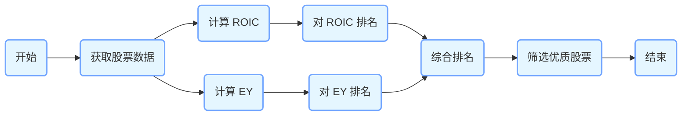

# 乔尔格林布拉特的价值投资筛选

> 关键词：乔尔格林布拉特、价值投资、筛选策略、投资组合、股票分析

> 摘要：本文围绕乔尔格林布拉特的价值投资筛选策略展开。首先介绍了该策略提出的背景和意义，以及预期读者和文档结构。接着阐述了价值投资筛选所涉及的核心概念和它们之间的联系，通过文本示意图和 Mermaid 流程图进行直观展示。详细讲解了核心算法原理，并用 Python 代码示例说明具体操作步骤。深入探讨了相关的数学模型和公式，并举例说明其应用。通过项目实战，展示了如何搭建开发环境、实现源代码以及对代码进行解读分析。列举了该策略的实际应用场景，推荐了学习资源、开发工具框架和相关论文著作。最后总结了未来发展趋势与挑战，还提供了常见问题与解答以及扩展阅读和参考资料，旨在帮助投资者深入理解和运用格林布拉特的价值投资筛选策略。

## 1. 背景介绍 
### 1.1 目的和范围
乔尔·格林布拉特（Joel Greenblatt）是一位知名的价值投资者，他的价值投资筛选策略旨在帮助投资者从众多股票中筛选出具有投资价值的股票。该策略的目的在于通过量化的方法，寻找那些被市场低估但具有良好盈利能力的公司，从而构建一个有望获得超额收益的投资组合。其范围主要涉及股票市场，适用于对价值投资感兴趣的投资者。

### 1.2 预期读者
本文的预期读者包括对价值投资有一定了解或想要深入学习的投资者，如个人投资者、金融从业者、投资分析师等。同时，也适合对量化投资策略和 Python 编程在金融领域应用感兴趣的程序员和数据分析师。

### 1.3 文档结构概述
本文将按照以下结构进行阐述：首先介绍相关背景知识，包括目的、读者和文档结构等；接着讲解核心概念和它们之间的联系；然后详细介绍核心算法原理和具体操作步骤，并用 Python 代码实现；之后探讨相关的数学模型和公式，并举例说明；通过项目实战展示如何应用该策略；列举实际应用场景；推荐相关的学习资源、开发工具框架和论文著作；最后总结未来发展趋势与挑战，提供常见问题与解答以及扩展阅读和参考资料。

### 1.4 术语表
#### 1.4.1 核心术语定义
- **价值投资**：一种投资策略，基于对公司内在价值的评估，寻找被市场低估的股票进行投资，以期望在股票价格回归其内在价值时获得收益。
- **资本回报率（ROIC）**：用于衡量公司运用资本创造利润的效率，计算公式为息税前利润（EBIT）除以投入资本（IC）。
- **股票收益率（EY）**：反映股票盈利能力的指标，通常用息税前利润（EBIT）除以企业价值（EV）来计算。

#### 1.4.2 相关概念解释
- **企业价值（EV）**：公司的市场价值加上债务减去现金及现金等价物，它反映了收购一家公司所需的总成本。
- **投入资本（IC）**：包括股东权益和债务，是公司用于运营的全部资本。

#### 1.4.3 缩略词列表
- **ROIC**：Return on Invested Capital（资本回报率）
- **EY**：Earnings Yield（股票收益率）
- **EBIT**：Earnings Before Interest and Taxes（息税前利润）
- **EV**：Enterprise Value（企业价值）
- **IC**：Invested Capital（投入资本）

## 2. 核心概念与联系 
### 核心概念原理
乔尔·格林布拉特的价值投资筛选策略主要基于两个核心指标：资本回报率（ROIC）和股票收益率（EY）。

- **资本回报率（ROIC）**：ROIC 衡量了公司利用投入资本创造利润的能力。较高的 ROIC 表明公司能够高效地运用资本，创造出更多的利润，是公司盈利能力的重要体现。例如，一家公司投入 100 万元资本，一年创造了 20 万元的息税前利润，那么其 ROIC 为 20%（20 万 / 100 万）。

- **股票收益率（EY）**：EY 反映了股票的盈利能力。它将公司的息税前利润与企业价值进行比较，越高的 EY 意味着投资者以当前企业价值购买股票所能获得的潜在收益越高。例如，一家公司的 EBIT 为 100 万元，企业价值为 500 万元，那么其 EY 为 20%（100 万 / 500 万）。

### 架构的文本示意图
```plaintext
价值投资筛选策略
|
|-- 核心指标
|   |-- 资本回报率（ROIC）
|   |   |-- 息税前利润（EBIT）
|   |   |-- 投入资本（IC）
|   |
|   |-- 股票收益率（EY）
|       |-- 息税前利润（EBIT）
|       |-- 企业价值（EV）
|
|-- 筛选过程
|   |-- 计算 ROIC 和 EY
|   |-- 对股票按 ROIC 和 EY 排名
|   |-- 综合排名筛选优质股票
```

### Mermaid 流程图


## 3. 核心算法原理 & 具体操作步骤 
### 核心算法原理
格林布拉特的价值投资筛选策略的核心思想是通过计算每只股票的 ROIC 和 EY，并对它们进行排名，然后将两个排名相加得到综合排名，最后选择综合排名靠前的股票作为投资标的。

### 具体操作步骤
1. **数据获取**：从金融数据提供商（如雅虎财经、Tushare 等）获取股票的财务数据，包括 EBIT、IC、EV 等。
2. **计算 ROIC**：使用公式 $ROIC = \frac{EBIT}{IC}$ 计算每只股票的 ROIC。
3. **计算 EY**：使用公式 $EY = \frac{EBIT}{EV}$ 计算每只股票的 EY。
4. **排名**：分别对 ROIC 和 EY 进行排名，排名越靠前表示该指标表现越好。
5. **综合排名**：将 ROIC 排名和 EY 排名相加，得到综合排名。
6. **筛选股票**：选择综合排名靠前的股票作为投资组合。

### Python 源代码实现
```python
import pandas as pd
import numpy as np

# 模拟获取股票数据
def get_stock_data():
    data = {
        'stock_code': ['A', 'B', 'C', 'D', 'E'],
        'EBIT': [100, 200, 150, 300, 250],
        'IC': [500, 800, 600, 1200, 1000],
        'EV': [1000, 1500, 1200, 2000, 1800]
    }
    return pd.DataFrame(data)

# 计算 ROIC
def calculate_roic(data):
    data['ROIC'] = data['EBIT'] / data['IC']
    return data

# 计算 EY
def calculate_ey(data):
    data['EY'] = data['EBIT'] / data['EV']
    return data

# 排名
def rank_metrics(data):
    data['ROIC_rank'] = data['ROIC'].rank(ascending=False)
    data['EY_rank'] = data['EY'].rank(ascending=False)
    return data

# 综合排名
def calculate_composite_rank(data):
    data['composite_rank'] = data['ROIC_rank'] + data['EY_rank']
    return data

# 筛选股票
def select_stocks(data, top_n=3):
    sorted_data = data.sort_values(by='composite_rank')
    selected_stocks = sorted_data.head(top_n)
    return selected_stocks

# 主函数
def main():
    data = get_stock_data()
    data = calculate_roic(data)
    data = calculate_ey(data)
    data = rank_metrics(data)
    data = calculate_composite_rank(data)
    selected_stocks = select_stocks(data)
    print(selected_stocks)

if __name__ == "__main__":
    main()
```

### 代码解释
1. **get_stock_data 函数**：模拟获取股票的财务数据，返回一个包含股票代码、EBIT、IC 和 EV 的 DataFrame。
2. **calculate_roic 函数**：根据 EBIT 和 IC 计算 ROIC，并将结果添加到 DataFrame 中。
3. **calculate_ey 函数**：根据 EBIT 和 EV 计算 EY，并将结果添加到 DataFrame 中。
4. **rank_metrics 函数**：对 ROIC 和 EY 进行排名，排名越靠前表示该指标表现越好。
5. **calculate_composite_rank 函数**：将 ROIC 排名和 EY 排名相加，得到综合排名。
6. **select_stocks 函数**：根据综合排名选择排名靠前的股票。
7. **main 函数**：调用上述函数，完成整个筛选过程，并打印出筛选出的股票。

## 4. 数学模型和公式 & 详细讲解 & 举例说明 
### 数学模型和公式
- **资本回报率（ROIC）**：
  $$ROIC = \frac{EBIT}{IC}$$
  其中，$EBIT$ 是息税前利润，$IC$ 是投入资本。

- **股票收益率（EY）**：
  $$EY = \frac{EBIT}{EV}$$
  其中，$EBIT$ 是息税前利润，$EV$ 是企业价值。

### 详细讲解
- **ROIC**：ROIC 反映了公司运用投入资本创造利润的效率。较高的 ROIC 意味着公司能够更有效地利用资本，创造更多的利润。例如，一家公司的 EBIT 为 100 万元，IC 为 500 万元，那么其 ROIC 为 20%（100 万 / 500 万）。这表明该公司每投入 1 元资本，能够创造 0.2 元的息税前利润。

- **EY**：EY 衡量了股票的盈利能力。它将公司的息税前利润与企业价值进行比较，越高的 EY 表示投资者以当前企业价值购买股票所能获得的潜在收益越高。例如，一家公司的 EBIT 为 100 万元，EV 为 1000 万元，那么其 EY 为 10%（100 万 / 1000 万）。这意味着投资者以 1000 万元的价格购买该公司股票，理论上每年能获得 100 万元的息税前利润，收益率为 10%。

### 举例说明
假设有两家公司 A 和 B，其财务数据如下：

| 公司 | EBIT（万元） | IC（万元） | EV（万元） |
| ---- | ---- | ---- | ---- |
| A | 200 | 800 | 1500 |
| B | 300 | 1200 | 2000 |

- **计算 ROIC**：
  - 公司 A 的 ROIC：$ROIC_A = \frac{200}{800} = 0.25$，即 25%。
  - 公司 B 的 ROIC：$ROIC_B = \frac{300}{1200} = 0.25$，即 25%。

- **计算 EY**：
  - 公司 A 的 EY：$EY_A = \frac{200}{1500} \approx 0.133$，即 13.3%。
  - 公司 B 的 EY：$EY_B = \frac{300}{2000} = 0.15$，即 15%。

从 ROIC 来看，两家公司的资本运用效率相同。但从 EY 来看，公司 B 的盈利能力更强，以相同的企业价值购买公司 B 的股票，能获得更高的潜在收益。

## 5. 项目实战：代码实际案例和详细解释说明 
### 5.1  开发环境搭建
- **Python 安装**：从 Python 官方网站（https://www.python.org/downloads/）下载并安装 Python 3.x 版本。
- **依赖库安装**：使用 pip 安装所需的库，如 pandas、numpy 等。
```sh
pip install pandas numpy
```

### 5.2  源代码详细实现和代码解读
```python
import pandas as pd
import numpy as np

# 模拟获取股票数据
def get_stock_data():
    data = {
        'stock_code': ['A', 'B', 'C', 'D', 'E'],
        'EBIT': [100, 200, 150, 300, 250],
        'IC': [500, 800, 600, 1200, 1000],
        'EV': [1000, 1500, 1200, 2000, 1800]
    }
    return pd.DataFrame(data)

# 计算 ROIC
def calculate_roic(data):
    data['ROIC'] = data['EBIT'] / data['IC']
    return data

# 计算 EY
def calculate_ey(data):
    data['EY'] = data['EBIT'] / data['EV']
    return data

# 排名
def rank_metrics(data):
    data['ROIC_rank'] = data['ROIC'].rank(ascending=False)
    data['EY_rank'] = data['EY'].rank(ascending=False)
    return data

# 综合排名
def calculate_composite_rank(data):
    data['composite_rank'] = data['ROIC_rank'] + data['EY_rank']
    return data

# 筛选股票
def select_stocks(data, top_n=3):
    sorted_data = data.sort_values(by='composite_rank')
    selected_stocks = sorted_data.head(top_n)
    return selected_stocks

# 主函数
def main():
    data = get_stock_data()
    data = calculate_roic(data)
    data = calculate_ey(data)
    data = rank_metrics(data)
    data = calculate_composite_rank(data)
    selected_stocks = select_stocks(data)
    print(selected_stocks)

if __name__ == "__main__":
    main()
```

### 代码解读与分析
1. **get_stock_data 函数**：该函数模拟从数据源获取股票的财务数据，返回一个包含股票代码、EBIT、IC 和 EV 的 DataFrame。在实际应用中，需要从真实的金融数据提供商（如雅虎财经、Tushare 等）获取数据。
2. **calculate_roic 函数**：根据 EBIT 和 IC 计算 ROIC，并将结果添加到 DataFrame 中。使用了 pandas 的向量化操作，提高了计算效率。
3. **calculate_ey 函数**：根据 EBIT 和 EV 计算 EY，并将结果添加到 DataFrame 中。同样使用了向量化操作。
4. **rank_metrics 函数**：对 ROIC 和 EY 进行排名，使用 `rank` 方法，`ascending=False` 表示降序排名，排名越靠前表示该指标表现越好。
5. **calculate_composite_rank 函数**：将 ROIC 排名和 EY 排名相加，得到综合排名。
6. **select_stocks 函数**：根据综合排名选择排名靠前的股票，使用 `sort_values` 方法对 DataFrame 按综合排名排序，然后取前 `top_n` 个股票。
7. **main 函数**：调用上述函数，完成整个筛选过程，并打印出筛选出的股票。

## 6. 实际应用场景 
### 个人投资者
个人投资者可以使用格林布拉特的价值投资筛选策略来构建自己的投资组合。通过筛选出具有较高 ROIC 和 EY 的股票，个人投资者可以找到那些被市场低估但具有良好盈利能力的公司，从而提高投资收益。例如，一位个人投资者可以使用 Python 代码实现该策略，定期筛选股票，调整自己的投资组合。

### 基金经理
基金经理可以将该策略作为投资决策的参考之一。在构建基金投资组合时，基金经理可以使用该策略筛选出优质股票，然后结合其他因素（如行业前景、公司治理等）进行综合分析，最终确定投资组合。这样可以提高基金的投资绩效，为投资者创造更好的回报。

### 金融研究机构
金融研究机构可以使用该策略进行股票研究和分析。通过对大量股票的 ROIC 和 EY 进行计算和排名，研究机构可以发现市场中的投资机会和趋势，为投资者提供专业的投资建议和研究报告。

## 7. 工具和资源推荐
### 7.1 学习资源推荐
#### 7.1.1 书籍推荐
- 《股市稳赚》（The Little Book That Beats the Market）：乔尔·格林布拉特的著作，详细介绍了他的价值投资筛选策略。
- 《聪明的投资者》（The Intelligent Investor）：本杰明·格雷厄姆的经典著作，是价值投资的必读之书。
- 《证券分析》（Security Analysis）：同样是本杰明·格雷厄姆的著作，对价值投资的理论和方法进行了深入探讨。

#### 7.1.2 在线课程
- Coursera 上的“Financial Markets”：由耶鲁大学教授罗伯特·席勒（Robert Shiller）授课，介绍了金融市场的基本原理和投资策略。
- edX 上的“Introduction to Financial Accounting”：帮助学习者了解财务会计的基本概念和方法，为理解股票财务数据打下基础。

#### 7.1.3 技术博客和网站
- Seeking Alpha：提供股票分析、投资策略和市场评论等内容。
- Alpha Vantage：提供免费的金融数据 API，可用于获取股票的财务数据。

### 7.2 开发工具框架推荐
#### 7.2.1 IDE和编辑器
- PyCharm：一款功能强大的 Python 集成开发环境，提供代码编辑、调试、版本控制等功能。
- Visual Studio Code：轻量级的代码编辑器，支持多种编程语言，通过安装 Python 扩展可以方便地进行 Python 开发。

#### 7.2.2 调试和性能分析工具
- pdb：Python 自带的调试工具，可以帮助开发者调试代码。
- cProfile：Python 的性能分析工具，可以分析代码的运行时间和函数调用次数。

#### 7.2.3 相关框架和库
- pandas：用于数据处理和分析的 Python 库，提供了 DataFrame 等数据结构，方便进行数据操作。
- numpy：用于科学计算的 Python 库，提供了高效的数组操作和数学函数。

### 7.3 相关论文著作推荐
#### 7.3.1 经典论文
- “The Cross - Section of Expected Stock Returns” by Eugene F. Fama and Kenneth R. French：提出了著名的 Fama - French 三因子模型，对股票收益的影响因素进行了深入研究。
- “Value versus Growth: The International Evidence” by Eugene F. Fama and Kenneth R. French：研究了价值股和成长股在国际市场上的表现差异。

#### 7.3.2 最新研究成果
- 关注 SSRN（Social Science Research Network）等学术平台上关于价值投资和量化投资的最新研究论文。

#### 7.3.3 应用案例分析
- 可以参考一些金融研究机构和投资公司发布的关于价值投资策略应用案例的报告，了解该策略在实际投资中的效果和应用方法。

## 8. 总结：未来发展趋势与挑战
### 未来发展趋势
- **量化投资的发展**：随着信息技术的不断进步和金融数据的日益丰富，量化投资将越来越受到投资者的关注。格林布拉特的价值投资筛选策略作为一种量化投资策略，有望在未来得到更广泛的应用和发展。
- **多因子模型的结合**：未来可能会将格林布拉特的策略与其他因子（如市值、动量等）相结合，构建更复杂、更有效的多因子模型，以提高投资组合的绩效。
- **人工智能和机器学习的应用**：人工智能和机器学习技术在金融领域的应用越来越广泛。未来可以利用这些技术对格林布拉特的策略进行优化和改进，例如使用机器学习算法对股票进行分类和预测，提高筛选的准确性和效率。

### 挑战
- **数据质量和可靠性**：该策略的实施依赖于准确的财务数据。然而，财务数据可能存在误差、造假等问题，这会影响策略的有效性。因此，如何确保数据的质量和可靠性是一个重要的挑战。
- **市场环境的变化**：市场环境是不断变化的，股票的估值和盈利能力也会随之变化。格林布拉特的策略是基于历史数据和一定的假设条件制定的，在市场环境发生重大变化时，策略的有效性可能会受到影响。
- **竞争压力**：随着量化投资的发展，越来越多的投资者和机构开始使用类似的策略。这会导致市场竞争加剧，策略的超额收益可能会逐渐减少。

## 9. 附录：常见问题与解答
### 问题 1：如何获取准确的股票财务数据？
答：可以从专业的金融数据提供商（如雅虎财经、Tushare、Wind 等）获取股票的财务数据。在使用数据时，要注意数据的准确性和时效性，可以通过多个数据源进行验证。

### 问题 2：格林布拉特的策略适用于所有市场吗？
答：该策略在不同市场的适用性可能会有所不同。由于不同市场的特点和投资者行为存在差异，策略的效果可能会受到影响。在应用该策略时，需要结合当地市场的实际情况进行调整和优化。

### 问题 3：如何确定筛选股票的数量？
答：筛选股票的数量可以根据个人的投资目标、风险承受能力和投资组合的规模等因素来确定。一般来说，可以选择排名靠前的一定数量的股票，例如 10 - 20 只，以构建一个分散化的投资组合。

### 问题 4：该策略需要多长时间调整一次投资组合？
答：调整投资组合的时间间隔可以根据市场情况和个人的投资策略来确定。一般来说，可以每季度或每年对投资组合进行一次调整，以确保投资组合始终包含具有较高投资价值的股票。

## 10. 扩展阅读 & 参考资料
### 扩展阅读
- 《漫步华尔街》（A Random Walk Down Wall Street）：介绍了股票市场的基本原理和投资策略，对价值投资和随机漫步理论进行了深入探讨。
- 《投资中最简单的事》：邱国鹭的著作，分享了他的投资经验和心得，对价值投资的实践有一定的指导意义。

### 参考资料
- 乔尔·格林布拉特的官方网站和相关演讲资料。
- 金融数据提供商的官方文档和数据说明。
- 相关的学术论文和研究报告。