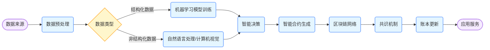

# 人工智能与区块链技术的结合前景

> 关键词：人工智能、区块链技术、结合前景、分布式账本、智能合约

> 摘要：本文深入探讨了人工智能与区块链技术结合的前景。首先介绍了研究的背景、目的、预期读者等内容，接着阐述了人工智能和区块链的核心概念与联系，详细讲解了相关的核心算法原理及操作步骤，分析了其中涉及的数学模型和公式。通过项目实战展示了两者结合的实际代码案例及解读。探讨了实际应用场景，推荐了相关的工具和资源。最后总结了未来发展趋势与挑战，解答常见问题并提供扩展阅读和参考资料，旨在全面剖析这两种前沿技术结合所蕴含的巨大潜力和面临的问题。

## 1. 背景介绍 
### 1.1 目的和范围
随着科技的飞速发展，人工智能和区块链技术都各自展现出了强大的影响力。人工智能以其强大的数据分析、模式识别和智能决策能力，在众多领域得到了广泛应用；区块链技术则凭借其去中心化、不可篡改、安全可信等特性，为数据的存储和传输带来了新的变革。本研究的目的在于深入探究这两种技术结合的可能性、优势以及面临的挑战，为相关领域的研究者、开发者和决策者提供全面的参考。范围涵盖了人工智能和区块链技术的基本原理、结合的理论基础、实际应用场景以及未来发展趋势等方面。

### 1.2 预期读者
本文预期读者包括对人工智能和区块链技术感兴趣的科研人员、相关专业的学生、从事信息技术领域的开发者、企业的技术决策者以及关注科技发展动态的爱好者。希望通过本文的阐述，能为不同层次的读者提供有价值的信息和思考方向。

### 1.3 文档结构概述
本文首先对人工智能和区块链技术的核心概念进行介绍，分析它们之间的联系；接着详细讲解核心算法原理和具体操作步骤，并通过数学模型和公式进行深入分析；然后通过项目实战展示两者结合的具体实现和代码解读；探讨实际应用场景；推荐相关的工具和资源；最后总结未来发展趋势与挑战，解答常见问题并提供扩展阅读和参考资料。

### 1.4 术语表
#### 1.4.1 核心术语定义
- **人工智能（Artificial Intelligence，AI）**：是一门研究如何使计算机能够模拟人类智能的学科，包括机器学习、自然语言处理、计算机视觉等多个领域。
- **区块链（Blockchain）**：是一种分布式账本技术，通过密码学方法将数据块按时间顺序相连，形成链式数据结构，实现数据的安全存储和不可篡改。
- **智能合约（Smart Contract）**：是一种自动执行的合约，其条款以计算机代码的形式存储在区块链上，当满足预设条件时自动执行。

#### 1.4.2 相关概念解释
- **去中心化（Decentralization）**：区块链的核心特性之一，意味着系统中没有单一的控制中心，所有节点共同参与数据的存储和验证，提高了系统的可靠性和安全性。
- **共识机制（Consensus Mechanism）**：区块链网络中用于达成节点间一致意见的算法，确保所有节点对账本状态的共识，常见的有工作量证明（PoW）、权益证明（PoS）等。
- **机器学习（Machine Learning）**：人工智能的一个重要分支，通过让计算机从数据中学习模式和规律，从而实现预测和决策等功能。

#### 1.4.3 缩略词列表
- **AI**：Artificial Intelligence（人工智能）
- **PoW**：Proof of Work（工作量证明）
- **PoS**：Proof of Stake（权益证明）
- **ML**：Machine Learning（机器学习）

## 2. 核心概念与联系 
### 人工智能核心概念
人工智能旨在赋予计算机像人类一样的智能，使其能够感知环境、学习知识、做出决策。其主要领域包括机器学习、自然语言处理、计算机视觉等。

机器学习是人工智能的核心技术之一，它通过让计算机从数据中学习模式和规律，从而实现预测和决策等功能。常见的机器学习算法包括监督学习、无监督学习和强化学习。

自然语言处理则致力于让计算机理解和处理人类语言，包括文本分类、情感分析、机器翻译等任务。

计算机视觉主要研究如何让计算机理解和处理图像和视频，例如图像识别、目标检测、人脸识别等。

### 区块链核心概念
区块链是一种分布式账本技术，它由一个个数据块组成，每个数据块包含了一定时间内的交易信息和前一个数据块的哈希值。通过这种方式，数据块按时间顺序相连，形成链式数据结构。

区块链的核心特性包括去中心化、不可篡改、安全可信等。去中心化意味着系统中没有单一的控制中心，所有节点共同参与数据的存储和验证，提高了系统的可靠性和安全性。不可篡改是指一旦数据被记录在区块链上，就很难被修改，因为任何修改都需要得到大多数节点的同意。安全可信则是通过密码学方法来保证数据的安全性和完整性。

### 两者的联系
人工智能和区块链技术虽然有着不同的起源和应用场景，但它们之间存在着一定的联系。

一方面，区块链技术可以为人工智能提供更加安全、可信的数据环境。人工智能的发展离不开大量的数据，而数据的安全性和隐私性是一个重要的问题。区块链的去中心化和不可篡改特性可以保证数据的完整性和安全性，防止数据被篡改和泄露。

另一方面，人工智能可以为区块链技术提供更加智能的决策和优化。区块链网络中的共识机制、智能合约等需要进行大量的计算和决策，人工智能可以通过机器学习等技术来优化这些过程，提高区块链网络的效率和性能。

### 核心概念原理和架构的文本示意图
人工智能和区块链技术结合的架构可以分为数据层、网络层、共识层、智能合约层和应用层。

数据层负责存储人工智能所需的数据和区块链的账本数据。网络层负责节点之间的通信和数据传输。共识层负责达成节点间的共识，确保账本的一致性。智能合约层负责执行智能合约，实现自动化的业务逻辑。应用层则是基于人工智能和区块链技术开发的各种应用。

### Mermaid 流程图


## 3. 核心算法原理 & 具体操作步骤 
### 人工智能核心算法原理
#### 机器学习算法 - 线性回归
线性回归是一种简单而常用的机器学习算法，用于预测连续数值。其基本原理是通过找到一条最佳的直线来拟合数据点，使得预测值与实际值之间的误差最小。

Python 代码实现：
```python
import numpy as np
from sklearn.linear_model import LinearRegression

# 生成一些示例数据
X = np.array([1, 2, 3, 4, 5]).reshape(-1, 1)
y = np.array([2, 4, 6, 8, 10])

# 创建线性回归模型
model = LinearRegression()

# 训练模型
model.fit(X, y)

# 进行预测
new_X = np.array([6]).reshape(-1, 1)
prediction = model.predict(new_X)
print("预测值:", prediction)
```
#### 深度学习算法 - 神经网络
神经网络是一种强大的深度学习模型，由多个神经元组成的层次结构。它可以自动从数据中学习复杂的模式和特征。

Python 代码实现（使用 TensorFlow）：
```python
import tensorflow as tf
from tensorflow.keras.models import Sequential
from tensorflow.keras.layers import Dense

# 生成一些示例数据
X = np.array([[0, 0], [0, 1], [1, 0], [1, 1]])
y = np.array([0, 1, 1, 0])

# 创建神经网络模型
model = Sequential()
model.add(Dense(4, input_dim=2, activation='relu'))
model.add(Dense(1, activation='sigmoid'))

# 编译模型
model.compile(loss='binary_crossentropy', optimizer='adam', metrics=['accuracy'])

# 训练模型
model.fit(X, y, epochs=100, batch_size=1)

# 进行预测
new_X = np.array([[0, 0]])
prediction = model.predict(new_X)
print("预测值:", prediction)
```

### 区块链核心算法原理
#### 工作量证明（PoW）
工作量证明是一种常见的区块链共识机制，其基本原理是通过让节点进行大量的计算来找到一个符合特定条件的哈希值。找到该哈希值的节点将获得记账权，并将新的区块添加到区块链上。

Python 代码实现：
```python
import hashlib
import time

class Block:
    def __init__(self, index, timestamp, data, previous_hash):
        self.index = index
        self.timestamp = timestamp
        self.data = data
        self.previous_hash = previous_hash
        self.nonce = 0
        self.hash = self.calculate_hash()

    def calculate_hash(self):
        block_string = f"{self.index}{self.timestamp}{self.data}{self.previous_hash}{self.nonce}"
        return hashlib.sha256(block_string.encode()).hexdigest()

    def mine_block(self, difficulty):
        target = "0" * difficulty
        while self.hash[:difficulty] != target:
            self.nonce += 1
            self.hash = self.calculate_hash()
        print("Block mined:", self.hash)

class Blockchain:
    def __init__(self):
        self.chain = [self.create_genesis_block()]
        self.difficulty = 2

    def create_genesis_block(self):
        return Block(0, time.time(), "Genesis Block", "0")

    def get_latest_block(self):
        return self.chain[-1]

    def add_block(self, new_block):
        new_block.previous_hash = self.get_latest_block().hash
        new_block.mine_block(self.difficulty)
        self.chain.append(new_block)

# 创建区块链实例
blockchain = Blockchain()

# 添加新的区块
block1 = Block(1, time.time(), "Transaction Data 1", "")
blockchain.add_block(block1)

block2 = Block(2, time.time(), "Transaction Data 2", "")
blockchain.add_block(block2)
```

### 具体操作步骤
1. **数据准备**：收集和整理人工智能所需的数据，并将其存储在区块链上，确保数据的安全性和完整性。
2. **模型训练**：使用人工智能算法对数据进行训练，得到相应的模型。
3. **智能合约生成**：根据模型的输出和业务需求，生成相应的智能合约。
4. **区块链部署**：将智能合约部署到区块链网络上，并通过共识机制确保其一致性。
5. **应用开发**：基于人工智能和区块链技术开发各种应用，实现自动化的业务逻辑。

## 4. 数学模型和公式 & 详细讲解 & 举例说明 
### 人工智能数学模型和公式
#### 线性回归
线性回归的数学模型可以表示为：
$$y = \theta_0 + \theta_1x_1 + \theta_2x_2 + \cdots + \theta_nx_n + \epsilon$$
其中，$y$ 是预测值，$x_1, x_2, \cdots, x_n$ 是输入特征，$\theta_0, \theta_1, \cdots, \theta_n$ 是模型参数，$\epsilon$ 是误差项。

线性回归的目标是找到一组最优的参数 $\theta$，使得预测值与实际值之间的误差最小。常用的误差度量方法是均方误差（MSE）：
$$MSE = \frac{1}{m}\sum_{i=1}^{m}(y^{(i)} - \hat{y}^{(i)})^2$$
其中，$m$ 是样本数量，$y^{(i)}$ 是第 $i$ 个样本的实际值，$\hat{y}^{(i)}$ 是第 $i$ 个样本的预测值。

#### 神经网络
神经网络的基本单元是神经元，其数学模型可以表示为：
$$z = \sum_{i=1}^{n}w_ix_i + b$$
$$a = f(z)$$
其中，$z$ 是神经元的输入，$w_i$ 是输入特征的权重，$x_i$ 是输入特征，$b$ 是偏置，$a$ 是神经元的输出，$f$ 是激活函数。

常见的激活函数包括 sigmoid 函数、ReLU 函数等。

### 区块链数学模型和公式
#### 哈希函数
哈希函数是区块链中用于保证数据完整性和安全性的重要工具。常见的哈希函数包括 SHA-256 等。哈希函数的特点是输入相同的内容会得到相同的哈希值，而输入稍有不同则会得到完全不同的哈希值。

例如，对于字符串 "hello"，使用 SHA-256 哈希函数得到的哈希值为：
```python
import hashlib

message = "hello"
hash_object = hashlib.sha256(message.encode())
print("哈希值:", hash_object.hexdigest())
```

#### 工作量证明
工作量证明的目标是找到一个符合特定条件的哈希值。通常，这个条件是哈希值的前 $n$ 位为 0。找到该哈希值的节点将获得记账权。

例如，在上述的工作量证明代码中，难度值 `difficulty` 为 2，表示哈希值的前 2 位必须为 0。

### 举例说明
假设我们有一个简单的线性回归问题，输入特征为房屋面积，目标值为房屋价格。我们收集了一些数据：

| 房屋面积（平方米） | 房屋价格（万元） |
| --- | --- |
| 50 | 30 |
| 70 | 40 |
| 90 | 50 |
| 110 | 60 |

我们可以使用线性回归模型来预测不同面积房屋的价格。

首先，我们将数据转换为适合线性回归模型的格式：
```python
import numpy as np
from sklearn.linear_model import LinearRegression

# 输入特征
X = np.array([50, 70, 90, 110]).reshape(-1, 1)
# 目标值
y = np.array([30, 40, 50, 60])

# 创建线性回归模型
model = LinearRegression()

# 训练模型
model.fit(X, y)

# 预测面积为 130 平方米的房屋价格
new_X = np.array([130]).reshape(-1, 1)
prediction = model.predict(new_X)
print("预测价格:", prediction)
```

在这个例子中，线性回归模型通过学习数据中的模式，找到了一个最佳的直线来拟合数据点，从而实现了对房屋价格的预测。

## 5. 项目实战：代码实际案例和详细解释说明 
### 5.1  开发环境搭建
#### 人工智能开发环境
- **Python 安装**：建议安装 Python 3.7 及以上版本，可以从 Python 官方网站（https://www.python.org/downloads/） 下载安装。
- **机器学习库安装**：使用 `pip` 安装常用的机器学习库，如 `numpy`、`pandas`、`scikit-learn`、`tensorflow` 等。
```bash
pip install numpy pandas scikit-learn tensorflow
```

#### 区块链开发环境
- **Ganache 安装**：Ganache 是一个本地的以太坊区块链开发环境，可以从 Ganache 官方网站（https://www.trufflesuite.com/ganache） 下载安装。
- **Truffle 安装**：Truffle 是一个以太坊开发框架，使用 `npm` 进行安装。
```bash
npm install -g truffle
```

### 5.2  源代码详细实现和代码解读
#### 人工智能部分
我们以一个简单的图像分类任务为例，使用 TensorFlow 和 Keras 来构建一个卷积神经网络（CNN）模型。

```python
import tensorflow as tf
from tensorflow.keras.datasets import mnist
from tensorflow.keras.models import Sequential
from tensorflow.keras.layers import Conv2D, MaxPooling2D, Flatten, Dense

# 加载 MNIST 数据集
(train_images, train_labels), (test_images, test_labels) = mnist.load_data()

# 数据预处理
train_images = train_images.reshape((60000, 28, 28, 1)).astype('float32') / 255
test_images = test_images.reshape((10000, 28, 28, 1)).astype('float32') / 255

train_labels = tf.keras.utils.to_categorical(train_labels)
test_labels = tf.keras.utils.to_categorical(test_labels)

# 构建 CNN 模型
model = Sequential()
model.add(Conv2D(32, (3, 3), activation='relu', input_shape=(28, 28, 1)))
model.add(MaxPooling2D((2, 2)))
model.add(Conv2D(64, (3, 3), activation='relu'))
model.add(MaxPooling2D((2, 2)))
model.add(Flatten())
model.add(Dense(64, activation='relu'))
model.add(Dense(10, activation='softmax'))

# 编译模型
model.compile(optimizer='adam',
              loss='categorical_crossentropy',
              metrics=['accuracy'])

# 训练模型
model.fit(train_images, train_labels, epochs=5, batch_size=64)

# 评估模型
test_loss, test_acc = model.evaluate(test_images, test_labels)
print('Test accuracy:', test_acc)
```
**代码解读**：
1. **数据加载和预处理**：使用 `mnist.load_data()` 加载 MNIST 数据集，将图像数据进行归一化处理，并将标签进行 one-hot 编码。
2. **模型构建**：使用 `Sequential` 模型构建一个简单的 CNN 模型，包括卷积层、池化层、全连接层等。
3. **模型编译**：使用 `adam` 优化器和 `categorical_crossentropy` 损失函数编译模型。
4. **模型训练**：使用 `fit` 方法对模型进行训练，指定训练的轮数和批次大小。
5. **模型评估**：使用 `evaluate` 方法对模型在测试集上的性能进行评估。

#### 区块链部分
我们以一个简单的智能合约为例，使用 Solidity 语言编写一个存储和读取数据的智能合约。

```solidity
pragma solidity ^0.8.0;

contract SimpleStorage {
    uint256 public storedData;

    function set(uint256 x) public {
        storedData = x;
    }

    function get() public view returns (uint256) {
        return storedData;
    }
}
```
**代码解读**：
1. **合约声明**：使用 `contract` 关键字声明一个名为 `SimpleStorage` 的智能合约。
2. **状态变量**：定义一个公共的 `uint256` 类型的状态变量 `storedData`，用于存储数据。
3. **函数定义**：定义一个 `set` 函数，用于设置 `storedData` 的值；定义一个 `get` 函数，用于读取 `storedData` 的值。

### 5.3  代码解读与分析
#### 人工智能部分
通过构建 CNN 模型，我们可以自动从图像数据中学习到特征，从而实现图像分类任务。在训练过程中，模型通过不断调整参数来最小化损失函数，提高模型的准确率。

#### 区块链部分
智能合约的 `set` 函数用于修改区块链上的数据，而 `get` 函数用于读取数据。由于区块链的不可篡改特性，一旦数据被存储在区块链上，就很难被修改。

通过将人工智能模型的输出结果存储在区块链上，可以保证数据的安全性和可信度。同时，区块链上的数据也可以作为人工智能模型的训练数据，进一步提高模型的性能。

## 6. 实际应用场景 
### 金融领域
- **风险管理**：人工智能可以通过对大量金融数据的分析，识别潜在的风险因素；区块链技术可以保证数据的安全性和不可篡改，为风险管理提供可靠的数据支持。例如，银行可以使用人工智能模型对客户的信用风险进行评估，将评估结果存储在区块链上，确保评估结果的可信度。
- **支付结算**：区块链技术的去中心化和快速结算特性可以提高支付结算的效率和安全性；人工智能可以用于实时监测交易行为，识别异常交易，防止欺诈行为的发生。例如，跨境支付可以利用区块链技术实现快速、低成本的资金转移，同时利用人工智能进行风险监测。

### 医疗领域
- **医疗数据管理**：区块链技术可以保证医疗数据的安全性和隐私性，防止数据泄露；人工智能可以对医疗数据进行分析和挖掘，帮助医生做出更准确的诊断和治疗方案。例如，将患者的病历数据存储在区块链上，医生可以通过人工智能模型对病历数据进行分析，提供个性化的医疗建议。
- **药物研发**：人工智能可以通过对大量生物数据的分析，加速药物研发的过程；区块链技术可以保证数据的来源可追溯和真实性，提高药物研发的可信度。例如，制药公司可以利用人工智能模型筛选潜在的药物靶点，将研发数据存储在区块链上，确保数据的安全性和透明度。

### 供应链管理领域
- **溯源管理**：区块链技术可以实现供应链中产品信息的全程追溯，确保产品的来源和质量；人工智能可以对供应链数据进行分析，优化供应链流程，提高效率。例如，食品供应链中可以利用区块链技术记录食品的生产、加工、运输等环节的信息，消费者可以通过扫描二维码查询食品的溯源信息；同时，人工智能可以对供应链数据进行分析，预测需求，优化库存管理。
- **智能合约应用**：智能合约可以自动执行供应链中的合同条款，提高交易的效率和可信度；人工智能可以根据供应链的实时数据，调整智能合约的执行条件，实现供应链的动态优化。例如，在货物运输过程中，智能合约可以根据货物的运输状态自动支付运费；人工智能可以根据天气、交通等因素预测货物的到达时间，调整智能合约的执行条件。

### 物联网领域
- **设备管理**：区块链技术可以实现物联网设备的身份认证和管理，确保设备的安全性；人工智能可以对物联网设备产生的数据进行分析，实现设备的智能控制和优化。例如，智能家居系统中可以利用区块链技术对设备进行身份认证，防止设备被非法入侵；人工智能可以根据用户的使用习惯和环境数据，自动调整设备的运行状态。
- **数据共享**：区块链技术可以实现物联网设备之间的数据共享和交换，确保数据的安全性和隐私性；人工智能可以对共享的数据进行分析，挖掘数据的价值。例如，在工业物联网中，不同的设备可以将数据存储在区块链上，其他设备可以通过授权访问这些数据；人工智能可以对这些数据进行分析，优化生产流程，提高生产效率。

## 7. 工具和资源推荐
### 7.1 学习资源推荐
#### 7.1.1 书籍推荐
- 《人工智能：一种现代的方法》：全面介绍了人工智能的基本概念、算法和应用，是人工智能领域的经典教材。
- 《区块链技术原理与应用》：详细讲解了区块链的技术原理、共识机制、智能合约等内容，是学习区块链技术的重要参考书籍。
- 《Python 机器学习》：介绍了使用 Python 进行机器学习的方法和技巧，适合初学者入门。

#### 7.1.2 在线课程
- Coursera 上的“机器学习”课程：由斯坦福大学教授 Andrew Ng 授课，是学习机器学习的经典课程。
- edX 上的“区块链基础”课程：系统介绍了区块链的基本概念、技术原理和应用场景。
- 中国大学 MOOC 上的“人工智能基础”课程：适合国内学生学习人工智能的基础知识。

#### 7.1.3 技术博客和网站
- Medium：有很多关于人工智能和区块链技术的优秀博客文章，涵盖了最新的研究成果和应用案例。
- 机器之心：专注于人工智能领域的资讯和技术解读，提供了丰富的学习资源。
- 区块链铅笔：是国内知名的区块链技术媒体，提供了区块链行业的最新动态和技术分析。

### 7.2 开发工具框架推荐
#### 7.2.1 IDE和编辑器
- PyCharm：是一款功能强大的 Python 集成开发环境，适合开发人工智能项目。
- Visual Studio Code：是一款轻量级的代码编辑器，支持多种编程语言，可用于开发区块链和人工智能项目。
- Remix：是一个基于浏览器的 Solidity 智能合约开发环境，方便开发者编写和调试智能合约。

#### 7.2.2 调试和性能分析工具
- TensorBoard：是 TensorFlow 提供的可视化工具，可用于查看模型的训练过程和性能指标。
- Ganache CLI：是 Ganache 的命令行版本，可用于本地以太坊区块链的调试和测试。
- Chrome DevTools：可以用于调试和分析网页应用中的区块链和人工智能代码。

#### 7.2.3 相关框架和库
- TensorFlow：是一个开源的机器学习框架，提供了丰富的工具和库，可用于开发各种人工智能模型。
- PyTorch：是另一个流行的深度学习框架，具有简洁易用的特点，适合快速开发和实验。
- Web3.py：是一个 Python 库，用于与以太坊区块链进行交互，方便开发者编写区块链应用。

### 7.3 相关论文著作推荐
#### 7.3.1 经典论文
- “A Brief History of Neural Networks”：介绍了神经网络的发展历程和基本原理。
- “Bitcoin: A Peer-to-Peer Electronic Cash System”：比特币的白皮书，阐述了区块链技术的基本概念和实现原理。
- “Deep Residual Learning for Image Recognition”：提出了残差网络（ResNet），在图像识别领域取得了巨大的成功。

#### 7.3.2 最新研究成果
- 关注顶级学术会议如 NeurIPS、ICML、ACM SIGKDD 等，这些会议上的论文反映了人工智能领域的最新研究成果。
- 关注区块链相关的学术会议和期刊，如 IEEE Blockchain、ACM CCS 等，了解区块链技术的最新发展动态。

#### 7.3.3 应用案例分析
- 可以参考一些实际应用案例的研究报告和论文，了解人工智能和区块链技术在不同领域的应用效果和经验教训。例如，一些金融机构发布的关于区块链在支付结算、风险管理等方面的应用案例分析。

## 8. 总结：未来发展趋势与挑战
### 未来发展趋势
- **深度融合**：人工智能和区块链技术将实现更深度的融合，相互促进、协同发展。例如，人工智能可以为区块链网络提供更加智能的共识机制和智能合约优化；区块链技术可以为人工智能提供更加安全、可信的数据环境和模型训练平台。
- **跨领域应用拓展**：两者的结合将在更多领域得到应用，如能源、教育、娱乐等。例如，在能源领域，区块链技术可以实现能源交易的去中心化和透明化，人工智能可以对能源消耗进行预测和优化；在教育领域，区块链技术可以记录学生的学习过程和成绩，人工智能可以提供个性化的学习方案。
- **标准化和规范化**：随着技术的发展，人工智能和区块链技术的结合将逐渐形成标准化和规范化的体系。这将有助于降低开发成本，提高应用的互操作性和兼容性。

### 挑战
- **技术复杂度**：人工智能和区块链技术本身都具有较高的技术复杂度，两者的结合将进一步增加技术难度。例如，如何在区块链网络中高效地运行人工智能模型，如何保证人工智能模型的安全性和隐私性等问题都需要进一步研究和解决。
- **数据隐私和安全**：虽然区块链技术可以保证数据的安全性和不可篡改，但人工智能模型的训练和推理过程可能会涉及到用户的隐私数据。如何在保证数据隐私的前提下，充分发挥人工智能和区块链技术的优势，是一个亟待解决的问题。
- **法律法规和监管**：人工智能和区块链技术的快速发展给法律法规和监管带来了新的挑战。例如，如何对智能合约的合法性和有效性进行监管，如何对人工智能算法的决策过程进行审计等问题都需要制定相应的法律法规和监管措施。

## 9. 附录：常见问题与解答
### 人工智能和区块链技术结合的优势是什么？
人工智能和区块链技术结合的优势主要包括：提高数据的安全性和可信度、实现数据的共享和交换、优化决策过程、提高系统的效率和性能等。

### 如何保证人工智能模型在区块链网络中的安全性？
可以通过以下方法保证人工智能模型在区块链网络中的安全性：使用加密技术对模型参数和数据进行加密、采用多方计算和同态加密等技术实现隐私保护、对模型的训练和推理过程进行审计和验证等。

### 区块链技术对人工智能的数据质量有什么影响？
区块链技术可以保证数据的完整性和不可篡改，从而提高人工智能的数据质量。同时，区块链的去中心化特性可以实现数据的共享和交换，为人工智能提供更丰富的数据资源。

### 人工智能和区块链技术结合在实际应用中面临哪些困难？
实际应用中面临的困难包括技术复杂度高、数据隐私和安全问题、法律法规和监管不完善等。需要不断进行技术创新和研究，制定相应的法律法规和监管措施，以推动两者的结合在实际应用中的发展。

## 10. 扩展阅读 & 参考资料
- 李开复, 王咏刚. 《人工智能》. 文化发展出版社, 2017.
- 长铗, 韩锋. 《区块链: 从数字货币到信用社会》. 中信出版社, 2016.
- 周志华. 《机器学习》. 清华大学出版社, 2016.
- 相关学术论文和研究报告：可以通过学术数据库如 IEEE Xplore、ACM Digital Library、中国知网等查找。
- 相关技术文档和官方网站：如 TensorFlow 官方文档（https://www.tensorflow.org/）、以太坊官方网站（https://ethereum.org/）等。