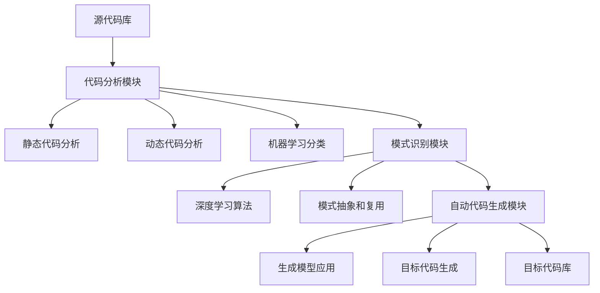

# 人工智能在代码迁移中的应用策略

> 关键词：人工智能、代码迁移、应用策略、代码分析、自动化工具

> 摘要：本文深入探讨了人工智能在代码迁移中的应用策略。随着软件系统的不断发展和技术的更新换代，代码迁移成为软件开发过程中常见的需求。人工智能技术的出现为代码迁移带来了新的思路和方法。文章首先介绍了代码迁移的背景和相关概念，然后详细阐述了人工智能在代码迁移中的核心概念和联系，包括代码分析、模式识别等。接着讲解了核心算法原理和具体操作步骤，并通过数学模型和公式进行了详细说明。通过项目实战案例展示了人工智能在代码迁移中的实际应用，分析了开发环境搭建、源代码实现和代码解读等方面。还探讨了代码迁移的实际应用场景，推荐了相关的工具和资源。最后对人工智能在代码迁移领域的未来发展趋势与挑战进行了总结，并提供了常见问题的解答和扩展阅读资料。

## 1. 背景介绍 
### 1.1 目的和范围
代码迁移是将现有的代码从一个环境、平台或编程语言迁移到另一个环境、平台或编程语言的过程。随着技术的快速发展，软件系统需要不断更新和升级，以适应新的业务需求和技术趋势。例如，企业可能需要将旧的单体应用迁移到微服务架构，或者将基于某种编程语言的代码迁移到另一种更适合的编程语言。本文章的目的是探讨如何利用人工智能技术来优化代码迁移的过程，提高迁移的效率和质量。文章的范围涵盖了人工智能在代码迁移各个阶段的应用，包括代码分析、模式识别、自动生成代码等。

### 1.2 预期读者
本文的预期读者包括软件开发人员、软件架构师、技术经理以及对人工智能和代码迁移感兴趣的研究人员。软件开发人员可以从本文中学习到如何利用人工智能工具和技术来完成代码迁移任务；软件架构师可以了解如何在架构层面应用人工智能来设计更高效的代码迁移方案；技术经理可以从战略角度了解人工智能在代码迁移中的价值和应用策略；研究人员可以通过本文了解该领域的最新研究成果和发展趋势。

### 1.3 文档结构概述
本文将按照以下结构进行组织：首先介绍代码迁移的背景和相关概念，包括目的、范围、预期读者和文档结构概述。然后阐述人工智能在代码迁移中的核心概念和联系，通过文本示意图和 Mermaid 流程图进行详细说明。接着讲解核心算法原理和具体操作步骤，使用 Python 源代码进行详细阐述。通过数学模型和公式对代码迁移进行详细讲解，并举例说明。通过项目实战案例展示人工智能在代码迁移中的实际应用，包括开发环境搭建、源代码实现和代码解读。探讨代码迁移的实际应用场景，推荐相关的工具和资源。最后对人工智能在代码迁移领域的未来发展趋势与挑战进行总结，并提供常见问题的解答和扩展阅读资料。

### 1.4 术语表
#### 1.4.1 核心术语定义
- **代码迁移**：将现有的代码从一个环境、平台或编程语言迁移到另一个环境、平台或编程语言的过程。
- **人工智能**：研究如何使计算机能够模拟人类的智能行为，如学习、推理、决策等。
- **代码分析**：对代码进行静态或动态的分析，以了解代码的结构、功能和质量。
- **模式识别**：识别代码中重复出现的模式和结构，以便进行自动化处理。
- **自动代码生成**：利用人工智能技术根据已有的代码或需求自动生成新的代码。

#### 1.4.2 相关概念解释
- **静态代码分析**：在不运行代码的情况下，对代码进行语法、语义和结构的分析。
- **动态代码分析**：在代码运行过程中，对代码的行为和性能进行分析。
- **机器学习**：人工智能的一个分支，通过让计算机从数据中学习模式和规律，从而实现预测和决策。
- **深度学习**：一种基于神经网络的机器学习方法，能够处理复杂的模式和数据。

#### 1.4.3 缩略词列表
- **AI**：Artificial Intelligence（人工智能）
- **ML**：Machine Learning（机器学习）
- **DL**：Deep Learning（深度学习）
- **SCA**：Static Code Analysis（静态代码分析）
- **DCA**：Dynamic Code Analysis（动态代码分析）

## 2. 核心概念与联系 

### 核心概念原理
在代码迁移中，人工智能主要涉及以下几个核心概念：

#### 代码分析
代码分析是代码迁移的基础。通过静态代码分析和动态代码分析，可以了解代码的结构、功能、依赖关系和潜在的问题。静态代码分析可以检查代码的语法错误、代码风格和潜在的安全漏洞。动态代码分析可以监测代码的运行时行为，如内存使用、性能瓶颈等。人工智能可以通过机器学习算法对代码进行分类和聚类，识别代码中的模式和结构。例如，可以使用自然语言处理技术对代码注释和文档进行分析，以更好地理解代码的功能。

#### 模式识别
模式识别是指在代码中识别重复出现的模式和结构。这些模式可以是代码片段、算法或设计模式。通过识别这些模式，可以将其抽象出来，并在迁移过程中进行复用。人工智能可以使用深度学习算法，如卷积神经网络（CNN）和循环神经网络（RNN），对代码进行模式识别。例如，CNN 可以用于识别代码中的图像化模式，而 RNN 可以用于处理代码中的序列信息。

#### 自动代码生成
自动代码生成是指利用人工智能技术根据已有的代码或需求自动生成新的代码。在代码迁移中，自动代码生成可以根据源代码的结构和功能，生成目标环境下的代码。人工智能可以使用生成对抗网络（GAN）或变分自编码器（VAE）等生成模型来实现自动代码生成。例如，GAN 可以通过生成器和判别器的对抗训练，生成与源代码风格和功能相似的目标代码。

### 架构的文本示意图
以下是人工智能在代码迁移中的架构示意图：

```plaintext
+---------------------+
|      源代码库       |
+---------------------+
           |
           v
+---------------------+
|    代码分析模块     |
|  - 静态代码分析     |
|  - 动态代码分析     |
|  - 机器学习分类     |
+---------------------+
           |
           v
+---------------------+
|    模式识别模块     |
|  - 深度学习算法     |
|  - 模式抽象和复用   |
+---------------------+
           |
           v
+---------------------+
|  自动代码生成模块  |
|  - 生成模型应用     |
|  - 目标代码生成     |
+---------------------+
           |
           v
+---------------------+
|      目标代码库     |
+---------------------+
```

### Mermaid 流程图


## 3. 核心算法原理 & 具体操作步骤 

### 核心算法原理
#### 机器学习分类算法
在代码分析阶段，我们可以使用机器学习分类算法对代码进行分类。常见的分类算法包括决策树、支持向量机（SVM）和朴素贝叶斯等。以决策树为例，决策树是一种基于树结构进行决策的算法。它通过对数据的特征进行划分，构建一棵决策树，每个内部节点表示一个特征上的测试，每个分支表示一个测试输出，每个叶节点表示一个类别。

#### 深度学习模式识别算法
在模式识别阶段，我们可以使用深度学习算法，如卷积神经网络（CNN）和循环神经网络（RNN）。CNN 是一种专门用于处理具有网格结构数据的神经网络，如图像和文本。它通过卷积层、池化层和全连接层等组件，自动提取数据中的特征。RNN 是一种专门用于处理序列数据的神经网络，它通过循环结构来处理序列中的每个元素，并保留序列的上下文信息。

#### 生成模型自动代码生成算法
在自动代码生成阶段，我们可以使用生成模型，如生成对抗网络（GAN）和变分自编码器（VAE）。GAN 由生成器和判别器组成，生成器试图生成与真实数据相似的样本，判别器试图区分生成的样本和真实数据。通过不断的对抗训练，生成器可以生成高质量的样本。VAE 是一种基于变分推理的生成模型，它通过编码器将输入数据映射到潜在空间，然后通过解码器从潜在空间中生成新的数据。

### 具体操作步骤
#### 数据准备
首先，我们需要收集源代码库中的代码数据，并进行预处理。预处理包括代码清洗、分词、特征提取等步骤。例如，我们可以使用正则表达式去除代码中的注释和空格，然后使用词法分析器将代码分词成单词或符号。

#### 模型训练
根据不同的任务，选择合适的模型进行训练。例如，在代码分类任务中，我们可以使用决策树模型进行训练。在模式识别任务中，我们可以使用 CNN 或 RNN 模型进行训练。在自动代码生成任务中，我们可以使用 GAN 或 VAE 模型进行训练。训练过程中，需要将数据集划分为训练集、验证集和测试集，以评估模型的性能。

#### 代码迁移
在模型训练完成后，我们可以使用训练好的模型进行代码迁移。首先，对源代码进行分析，识别代码中的模式和结构。然后，根据识别的模式和结构，使用自动代码生成模型生成目标代码。最后，对生成的目标代码进行测试和验证，确保代码的正确性和性能。

### Python 源代码详细阐述
以下是一个简单的代码分类示例，使用决策树算法：

```python
import pandas as pd
from sklearn.model_selection import train_test_split
from sklearn.tree import DecisionTreeClassifier
from sklearn.metrics import accuracy_score

# 加载代码数据
data = pd.read_csv('code_data.csv')

# 分离特征和标签
X = data.drop('label', axis=1)
y = data['label']

# 划分训练集和测试集
X_train, X_test, y_train, y_test = train_test_split(X, y, test_size=0.2, random_state=42)

# 创建决策树分类器
clf = DecisionTreeClassifier()

# 训练模型
clf.fit(X_train, y_train)

# 预测测试集
y_pred = clf.predict(X_test)

# 计算准确率
accuracy = accuracy_score(y_test, y_pred)
print(f"Accuracy: {accuracy}")
```

## 4. 数学模型和公式 & 详细讲解 & 举例说明 

### 决策树算法的数学模型和公式
决策树算法的核心是信息增益（Information Gain）。信息增益是指在划分数据集前后信息熵的变化。信息熵是衡量数据集中不确定性的指标，其计算公式为：

$$
H(D) = -\sum_{i=1}^{n} p_i \log_2 p_i
$$

其中，$D$ 表示数据集，$n$ 表示数据集中的类别数，$p_i$ 表示第 $i$ 个类别的概率。

信息增益的计算公式为：

$$
IG(D, A) = H(D) - \sum_{v \in Values(A)} \frac{|D_v|}{|D|} H(D_v)
$$

其中，$A$ 表示划分属性，$Values(A)$ 表示属性 $A$ 的所有可能取值，$D_v$ 表示根据属性 $A$ 的取值 $v$ 划分得到的子集。

### 举例说明
假设我们有一个数据集 $D$，包含 10 个样本，分为 2 个类别：正类和负类。其中正类有 6 个样本，负类有 4 个样本。则数据集 $D$ 的信息熵为：

$$
H(D) = -\frac{6}{10} \log_2 \frac{6}{10} - \frac{4}{10} \log_2 \frac{4}{10} \approx 0.971
$$

假设我们选择一个属性 $A$ 进行划分，划分后得到两个子集 $D_1$ 和 $D_2$。$D_1$ 包含 3 个正类样本和 1 个负类样本，$D_2$ 包含 3 个正类样本和 3 个负类样本。则子集 $D_1$ 和 $D_2$ 的信息熵分别为：

$$
H(D_1) = -\frac{3}{4} \log_2 \frac{3}{4} - \frac{1}{4} \log_2 \frac{1}{4} \approx 0.811
$$

$$
H(D_2) = -\frac{3}{6} \log_2 \frac{3}{6} - \frac{3}{6} \log_2 \frac{3}{6} = 1
$$

根据信息增益公式，属性 $A$ 的信息增益为：

$$
IG(D, A) = H(D) - \frac{4}{10} H(D_1) - \frac{6}{10} H(D_2) \approx 0.971 - \frac{4}{10} \times 0.811 - \frac{6}{10} \times 1 = 0.135
$$

### 卷积神经网络（CNN）的数学模型和公式
卷积神经网络（CNN）的核心是卷积层。卷积层通过卷积操作对输入数据进行特征提取。卷积操作的数学公式为：

$$
y_{i,j} = \sum_{m=0}^{M-1} \sum_{n=0}^{N-1} x_{i+m,j+n} w_{m,n} + b
$$

其中，$x$ 表示输入数据，$w$ 表示卷积核，$b$ 表示偏置，$y$ 表示卷积输出。

### 举例说明
假设我们有一个输入数据 $x$ 是一个 $3 \times 3$ 的矩阵：

$$
x = 
\begin{bmatrix}
1 & 2 & 3 \\
4 & 5 & 6 \\
7 & 8 & 9
\end{bmatrix}
$$

卷积核 $w$ 是一个 $2 \times 2$ 的矩阵：

$$
w = 
\begin{bmatrix}
1 & 0 \\
0 & 1
\end{bmatrix}
$$

偏置 $b = 0$。则卷积输出 $y$ 为：

$$
y_{0,0} = 1 \times 1 + 2 \times 0 + 4 \times 0 + 5 \times 1 + 0 = 6
$$

$$
y_{0,1} = 2 \times 1 + 3 \times 0 + 5 \times 0 + 6 \times 1 + 0 = 8
$$

$$
y_{1,0} = 4 \times 1 + 5 \times 0 + 7 \times 0 + 8 \times 1 + 0 = 12
$$

$$
y_{1,1} = 5 \times 1 + 6 \times 0 + 8 \times 0 + 9 \times 1 + 0 = 14
$$

所以卷积输出 $y$ 为：

$$
y = 
\begin{bmatrix}
6 & 8 \\
12 & 14
\end{bmatrix}
$$

## 5. 项目实战：代码实际案例和详细解释说明 

### 5.1  开发环境搭建
#### 操作系统
我们选择使用 Ubuntu 20.04 作为开发环境的操作系统。Ubuntu 是一个开源的 Linux 发行版，具有良好的稳定性和兼容性。

#### 编程语言和框架
我们使用 Python 作为主要的编程语言，因为 Python 具有丰富的机器学习和深度学习库。同时，我们使用 TensorFlow 和 PyTorch 作为深度学习框架。

#### 安装依赖库
在 Ubuntu 系统上，我们可以使用以下命令安装所需的依赖库：

```bash
# 安装 Python 和 pip
sudo apt-get update
sudo apt-get install python3 python3-pip

# 安装 TensorFlow
pip3 install tensorflow

# 安装 PyTorch
pip3 install torch torchvision
```

### 5.2  源代码详细实现和代码解读
#### 代码分类任务
以下是一个使用 TensorFlow 实现的简单代码分类任务的示例：

```python
import tensorflow as tf
from tensorflow.keras.datasets import mnist
from tensorflow.keras.models import Sequential
from tensorflow.keras.layers import Dense, Flatten

# 加载数据集
(x_train, y_train), (x_test, y_test) = mnist.load_data()

# 数据预处理
x_train = x_train / 255.0
x_test = x_test / 255.0

# 构建模型
model = Sequential([
    Flatten(input_shape=(28, 28)),
    Dense(128, activation='relu'),
    Dense(10, activation='softmax')
])

# 编译模型
model.compile(optimizer='adam',
              loss='sparse_categorical_crossentropy',
              metrics=['accuracy'])

# 训练模型
model.fit(x_train, y_train, epochs=5)

# 评估模型
test_loss, test_acc = model.evaluate(x_test, y_test)
print(f"Test accuracy: {test_acc}")
```

#### 代码解读
- **数据加载**：使用 `mnist.load_data()` 函数加载 MNIST 数据集，该数据集包含手写数字图像。
- **数据预处理**：将图像数据的像素值归一化到 0 到 1 之间，以提高模型的训练效果。
- **模型构建**：使用 `Sequential` 模型构建一个简单的神经网络，包括一个 `Flatten` 层将图像数据展平，一个 `Dense` 层作为隐藏层，一个 `Dense` 层作为输出层，使用 `softmax` 激活函数进行多分类。
- **模型编译**：使用 `adam` 优化器和 `sparse_categorical_crossentropy` 损失函数进行模型编译。
- **模型训练**：使用 `fit` 方法对模型进行训练，训练 5 个 epoch。
- **模型评估**：使用 `evaluate` 方法对模型进行评估，输出测试集的准确率。

#### 模式识别任务
以下是一个使用 PyTorch 实现的简单模式识别任务的示例：

```python
import torch
import torch.nn as nn
import torch.optim as optim
from torchvision import datasets, transforms

# 数据预处理
transform = transforms.Compose([
    transforms.ToTensor(),
    transforms.Normalize((0.1307,), (0.3081,))
])

# 加载数据集
train_dataset = datasets.MNIST('data', train=True, download=True, transform=transform)
test_dataset = datasets.MNIST('data', train=False, transform=transform)

train_loader = torch.utils.data.DataLoader(train_dataset, batch_size=64, shuffle=True)
test_loader = torch.utils.data.DataLoader(test_dataset, batch_size=1000, shuffle=False)

# 定义模型
class SimpleCNN(nn.Module):
    def __init__(self):
        super(SimpleCNN, self).__init__()
        self.conv1 = nn.Conv2d(1, 10, kernel_size=5)
        self.conv2 = nn.Conv2d(10, 20, kernel_size=5)
        self.fc1 = nn.Linear(320, 50)
        self.fc2 = nn.Linear(50, 10)

    def forward(self, x):
        x = nn.functional.relu(nn.functional.max_pool2d(self.conv1(x), 2))
        x = nn.functional.relu(nn.functional.max_pool2d(self.conv2(x), 2))
        x = x.view(-1, 320)
        x = nn.functional.relu(self.fc1(x))
        x = self.fc2(x)
        return nn.functional.log_softmax(x, dim=1)

# 初始化模型
model = SimpleCNN()

# 定义优化器和损失函数
optimizer = optim.SGD(model.parameters(), lr=0.01, momentum=0.5)
criterion = nn.NLLLoss()

# 训练模型
def train(model, train_loader, optimizer, epoch):
    model.train()
    for batch_idx, (data, target) in enumerate(train_loader):
        optimizer.zero_grad()
        output = model(data)
        loss = criterion(output, target)
        loss.backward()
        optimizer.step()
        if batch_idx % 100 == 0:
            print(f'Train Epoch: {epoch} [{batch_idx * len(data)}/{len(train_loader.dataset)} '
                  f'({100. * batch_idx / len(train_loader):.0f}%)]\tLoss: {loss.item():.6f}')

# 测试模型
def test(model, test_loader):
    model.eval()
    test_loss = 0
    correct = 0
    with torch.no_grad():
        for data, target in test_loader:
            output = model(data)
            test_loss += criterion(output, target).item()
            pred = output.argmax(dim=1, keepdim=True)
            correct += pred.eq(target.view_as(pred)).sum().item()

    test_loss /= len(test_loader.dataset)
    print(f'\nTest set: Average loss: {test_loss:.4f}, Accuracy: {correct}/{len(test_loader.dataset)} '
          f'({100. * correct / len(test_loader.dataset):.0f}%)\n')

# 训练和测试模型
for epoch in range(1, 11):
    train(model, train_loader, optimizer, epoch)
    test(model, test_loader)
```

#### 代码解读
- **数据预处理**：使用 `transforms.Compose` 定义数据预处理的步骤，包括将图像转换为张量和归一化。
- **数据加载**：使用 `datasets.MNIST` 加载 MNIST 数据集，并使用 `DataLoader` 进行批量加载。
- **模型定义**：定义一个简单的卷积神经网络 `SimpleCNN`，包括两个卷积层和两个全连接层。
- **优化器和损失函数**：使用随机梯度下降（SGD）优化器和负对数似然损失（NLLLoss）函数。
- **训练和测试函数**：定义 `train` 和 `test` 函数分别用于训练和测试模型。
- **训练和测试循环**：使用 `for` 循环进行 10 个 epoch 的训练和测试。

### 5.3  代码解读与分析
#### 代码分类任务分析
在代码分类任务中，我们使用了一个简单的全连接神经网络对 MNIST 数据集进行分类。通过将图像数据展平为一维向量，然后使用全连接层进行分类。这种方法的优点是简单易懂，缺点是对于复杂的图像数据，全连接层的参数过多，容易导致过拟合。

#### 模式识别任务分析
在模式识别任务中，我们使用了一个简单的卷积神经网络对 MNIST 数据集进行模式识别。卷积神经网络通过卷积层自动提取图像的特征，减少了参数的数量，提高了模型的泛化能力。同时，使用池化层进行下采样，减少了数据的维度，提高了计算效率。

## 6. 实际应用场景 
### 企业级应用迁移
企业可能需要将旧的单体应用迁移到微服务架构，以提高系统的可扩展性和维护性。人工智能可以帮助分析旧系统的代码结构和依赖关系，识别可以独立成微服务的模块，并自动生成微服务的代码框架。例如，通过代码分析可以发现哪些模块之间的耦合度较低，可以独立部署；通过模式识别可以复用旧系统中的一些通用算法和设计模式。

### 跨平台应用开发
随着移动设备的普及，企业可能需要将现有的桌面应用迁移到移动平台，如 iOS 和 Android。人工智能可以帮助分析桌面应用的代码逻辑和用户界面，根据移动平台的特点和规范，自动生成移动应用的代码。例如，通过代码分析可以了解桌面应用的业务流程和交互逻辑，通过自动代码生成可以将这些逻辑转换为移动应用的代码。

### 编程语言迁移
随着编程语言的不断发展，企业可能需要将旧的代码从一种编程语言迁移到另一种更适合的编程语言。人工智能可以帮助分析旧代码的语法和语义，根据目标编程语言的规则，自动生成新的代码。例如，将 Python 代码迁移到 Java 代码，通过代码分析可以识别 Python 代码中的函数、类和变量，通过自动代码生成可以将这些元素转换为 Java 代码。

## 7. 工具和资源推荐
### 7.1 学习资源推荐
#### 7.1.1 书籍推荐
- 《深度学习》（Deep Learning）：由 Ian Goodfellow、Yoshua Bengio 和 Aaron Courville 合著，是深度学习领域的经典教材，涵盖了深度学习的基本概念、算法和应用。
- 《Python 机器学习》（Python Machine Learning）：由 Sebastian Raschka 著，介绍了使用 Python 进行机器学习的方法和技巧，包括数据预处理、模型选择和评估等。
- 《代码整洁之道》（Clean Code）：由 Robert C. Martin 著，讲述了如何编写高质量的代码，包括代码风格、命名规范和设计模式等。

#### 7.1.2 在线课程
- Coursera 上的《机器学习》（Machine Learning）课程：由 Andrew Ng 教授讲授，是机器学习领域的经典课程，涵盖了机器学习的基本概念、算法和应用。
- edX 上的《深度学习》（Deep Learning Specialization）课程：由 Andrew Ng 教授讲授，是深度学习领域的专业课程，涵盖了深度学习的各个方面，如卷积神经网络、循环神经网络和生成对抗网络等。
- Udemy 上的《Python 深度学习实战》（Python Deep Learning in Practice）课程：介绍了使用 Python 和 TensorFlow 进行深度学习的实践项目，包括图像分类、目标检测和自然语言处理等。

#### 7.1.3 技术博客和网站
- Medium 上的 Towards Data Science：是一个专注于数据科学和机器学习的技术博客，发布了许多关于人工智能和代码迁移的文章。
- GitHub 上的开源项目：可以在 GitHub 上搜索相关的开源项目，了解他人在代码迁移和人工智能领域的实践经验。
- Kaggle：是一个数据科学竞赛平台，上面有许多关于机器学习和深度学习的数据集和竞赛项目，可以通过参与竞赛来提高自己的技能。

### 7.2 开发工具框架推荐
#### 7.2.1 IDE和编辑器
- PyCharm：是一款专门为 Python 开发设计的集成开发环境（IDE），具有代码编辑、调试、代码分析等功能。
- Visual Studio Code：是一款轻量级的代码编辑器，支持多种编程语言，具有丰富的插件和扩展功能。
- Jupyter Notebook：是一个交互式的开发环境，适合进行数据探索和模型训练，支持 Python、R 等多种编程语言。

#### 7.2.2 调试和性能分析工具
- TensorBoard：是 TensorFlow 提供的一个可视化工具，可以用于可视化模型的训练过程、性能指标和数据分布等。
- PyTorch Profiler：是 PyTorch 提供的一个性能分析工具，可以用于分析模型的运行时间、内存使用和 GPU 利用率等。
- cProfile：是 Python 内置的一个性能分析工具，可以用于分析 Python 代码的运行时间和函数调用次数等。

#### 7.2.3 相关框架和库
- TensorFlow：是一个开源的深度学习框架，提供了丰富的工具和库，支持多种深度学习模型的开发和训练。
- PyTorch：是一个开源的深度学习框架，具有动态图的特点，适合进行快速原型开发和研究。
- Scikit-learn：是一个开源的机器学习库，提供了丰富的机器学习算法和工具，适合进行数据预处理、模型选择和评估等。

### 7.3 相关论文著作推荐
#### 7.3.1 经典论文
- "ImageNet Classification with Deep Convolutional Neural Networks"：由 Alex Krizhevsky、Ilya Sutskever 和 Geoffrey E. Hinton 发表，介绍了使用卷积神经网络在 ImageNet 数据集上取得的优异成绩，开启了深度学习在计算机视觉领域的热潮。
- "Long Short-Term Memory"：由 Sepp Hochreiter 和 Jürgen Schmidhuber 发表，介绍了长短期记忆网络（LSTM）的原理和应用，解决了传统循环神经网络中的梯度消失问题。
- "Generative Adversarial Networks"：由 Ian J. Goodfellow 等人发表，介绍了生成对抗网络（GAN）的原理和应用，是生成模型领域的重要突破。

#### 7.3.2 最新研究成果
- 在顶级学术会议如 NeurIPS、ICML、CVPR 等上发表的关于代码迁移和人工智能的最新研究成果。可以通过会议官网或学术搜索引擎如 Google Scholar 查找相关论文。
- 在顶级学术期刊如 Journal of Artificial Intelligence Research（JAIR）、Artificial Intelligence 等上发表的关于代码迁移和人工智能的最新研究成果。

#### 7.3.3 应用案例分析
- 一些大型科技公司如 Google、Facebook、Microsoft 等发布的关于代码迁移和人工智能的应用案例分析。可以通过公司的官方博客或技术分享平台查找相关文章。
- 一些开源项目的文档和技术报告，介绍了如何使用人工智能技术进行代码迁移和优化。

## 8. 总结：未来发展趋势与挑战
### 未来发展趋势
#### 智能化程度不断提高
未来，人工智能在代码迁移中的应用将更加智能化。例如，模型将能够自动理解代码的语义和业务逻辑，根据不同的迁移场景和需求，生成更加准确和高效的迁移方案。同时，模型将能够不断学习和进化，适应新的代码结构和技术变化。

#### 与其他技术的融合
人工智能将与其他技术如区块链、物联网等进行融合，为代码迁移带来更多的应用场景和创新解决方案。例如，在区块链环境下，代码迁移需要考虑数据的安全性和隐私性，人工智能可以帮助设计更加安全可靠的迁移方案。

#### 自动化工具的普及
随着人工智能技术的不断发展，代码迁移的自动化工具将越来越普及。这些工具将能够实现代码迁移的全流程自动化，包括代码分析、模式识别、自动代码生成和测试验证等，大大提高代码迁移的效率和质量。

### 挑战
#### 数据质量和数量
人工智能模型的训练需要大量的高质量数据。在代码迁移领域，获取足够的代码数据并进行标注是一个挑战。同时，代码数据的质量也会影响模型的性能，例如代码中的噪声和错误会导致模型的训练效果不佳。

#### 模型可解释性
深度学习模型通常是黑盒模型，其决策过程难以解释。在代码迁移中，模型的可解释性非常重要，因为开发人员需要了解模型为什么做出这样的决策。如何提高模型的可解释性是一个亟待解决的问题。

#### 安全和隐私问题
在代码迁移过程中，涉及到大量的代码数据和业务逻辑，这些数据和逻辑可能包含敏感信息。如何保障数据的安全和隐私，防止数据泄露和恶意攻击，是一个重要的挑战。

## 9. 附录：常见问题与解答
### 问题 1：人工智能在代码迁移中的准确率如何保证？
解答：可以通过以下方法保证人工智能在代码迁移中的准确率：
- 使用高质量的训练数据，确保数据的准确性和完整性。
- 选择合适的模型和算法，并进行充分的调优和验证。
- 结合人工审核和测试，对生成的代码进行检查和修正。

### 问题 2：人工智能在代码迁移中能否处理复杂的业务逻辑？
解答：人工智能在一定程度上可以处理复杂的业务逻辑。通过对大量代码数据的学习和分析，模型可以理解代码中的业务逻辑和模式。然而，对于一些非常复杂和特定领域的业务逻辑，可能需要人工干预和辅助。

### 问题 3：使用人工智能进行代码迁移需要具备哪些技术基础？
解答：使用人工智能进行代码迁移需要具备以下技术基础：
- 编程语言基础，如 Python、Java 等。
- 机器学习和深度学习基础知识，包括常见的算法和模型。
- 代码分析和软件工程基础知识，了解代码的结构和设计模式。

## 10. 扩展阅读 & 参考资料
### 扩展阅读
- 《人工智能简史》：了解人工智能的发展历程和重要里程碑。
- 《重构：改善既有代码的设计》：学习如何对现有代码进行重构和优化。
- 《软件架构师修炼之道》：提升软件架构设计和代码迁移的能力。

### 参考资料
- 相关的学术论文和研究报告，可以通过学术搜索引擎如 Google Scholar、IEEE Xplore 等查找。
- 开源项目的文档和代码，可以在 GitHub、GitLab 等代码托管平台上查找。
- 技术博客和论坛，如 Stack Overflow、Reddit 等，可以获取其他开发者的经验和建议。