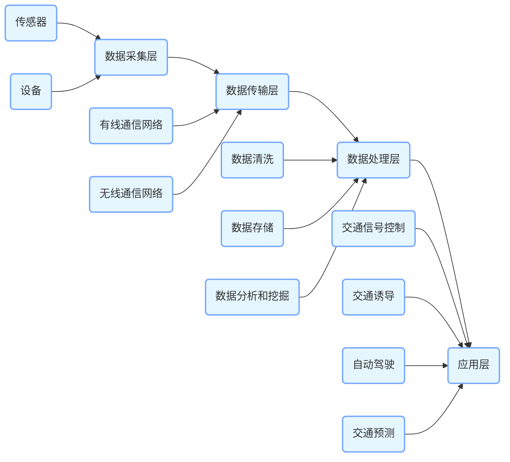

# 人工智能在智能交通系统中的应用

> 关键词：人工智能、智能交通系统、交通管理、自动驾驶、交通预测、交通优化、物联网

> 摘要：本文深入探讨了人工智能在智能交通系统中的应用。首先介绍了智能交通系统及人工智能的背景知识，明确文章的目的、范围、预期读者等。接着阐述了人工智能与智能交通系统相关的核心概念及联系，包括原理和架构。详细讲解了人工智能在智能交通中应用的核心算法原理与具体操作步骤，并给出了对应的Python源代码。同时，通过数学模型和公式对相关算法进行了理论分析和举例说明。结合项目实战，展示了代码实际案例并进行详细解释。探讨了人工智能在智能交通中的实际应用场景，推荐了学习、开发等相关的工具和资源。最后总结了人工智能在智能交通系统中的未来发展趋势与挑战，提供了常见问题解答和扩展阅读参考资料，旨在为相关领域的研究和实践提供全面且深入的技术指导。

## 1. 背景介绍 
### 1.1 目的和范围
智能交通系统（Intelligent Transportation System，ITS）旨在将先进的信息技术、数据通信传输技术、电子传感技术、控制技术及计算机技术等有效地集成运用于整个地面交通管理系统而建立的一种在大范围内、全方位发挥作用的，实时、准确、高效的综合交通运输管理系统。人工智能（Artificial Intelligence，AI）作为当今科技领域的前沿技术，为智能交通系统的发展带来了新的机遇和突破。本文的目的在于全面探讨人工智能在智能交通系统各个方面的应用，包括交通管理、自动驾驶、交通预测、交通优化等领域。范围涵盖了人工智能相关技术原理、算法实现、实际应用案例以及未来发展趋势等内容，旨在为读者提供一个关于人工智能在智能交通系统中应用的全面且深入的技术参考。

### 1.2 预期读者
本文预期读者包括交通工程领域的专业人员，如交通规划师、交通工程师等，他们可以从本文中了解到人工智能如何应用于交通系统，为交通规划和管理提供新的思路和方法；计算机科学与人工智能领域的研究人员和开发者，能够通过本文深入了解智能交通系统的需求，将人工智能技术更好地应用于交通场景；对智能交通和人工智能感兴趣的学生和爱好者，可通过本文初步了解相关领域的知识和技术。

### 1.3 文档结构概述
本文将按照以下结构进行阐述：首先介绍背景知识，包括目的、范围、预期读者等。接着讲解人工智能与智能交通系统相关的核心概念及联系，通过文本示意图和Mermaid流程图进行展示。然后详细介绍核心算法原理及具体操作步骤，并给出Python源代码。之后通过数学模型和公式对相关算法进行理论分析和举例说明。结合项目实战，展示代码实际案例并进行详细解释。探讨人工智能在智能交通中的实际应用场景，推荐学习、开发等相关的工具和资源。最后总结未来发展趋势与挑战，提供常见问题解答和扩展阅读参考资料。

### 1.4 术语表
#### 1.4.1 核心术语定义
- **智能交通系统（ITS）**：利用先进的信息技术、通信技术、控制技术等，对交通系统进行全面、实时、高效管理的综合系统，旨在提高交通效率、安全性和可持续性。
- **人工智能（AI）**：研究、开发用于模拟、延伸和扩展人的智能的理论、方法、技术及应用系统的一门新的技术科学。
- **自动驾驶**：通过计算机系统实现对车辆的自动控制和导航，使车辆能够在无需人工干预的情况下行驶。
- **交通流预测**：根据历史交通数据和实时交通信息，对未来一段时间内的交通流量、速度等参数进行预测。
- **交通优化**：通过调整交通信号控制、路线规划等手段，提高交通系统的运行效率，减少拥堵。

#### 1.4.2 相关概念解释
- **物联网（IoT）**：通过各种信息传感器、射频识别技术、全球定位系统等技术和装置，实时采集任何需要监控、连接、互动的物体或过程，采集其声、光、热、电、力学、化学、生物、位置等各种需要的信息，通过各类可能的网络接入，实现物与物、物与人的泛在连接，实现对物品和过程的智能化感知、识别和管理。在智能交通系统中，物联网技术可用于车辆、交通设施等的实时数据采集和通信。
- **大数据**：指无法在一定时间范围内用常规软件工具进行捕捉、管理和处理的数据集合，是需要新处理模式才能具有更强的决策力、洞察发现力和流程优化能力的海量、高增长率和多样化的信息资产。在智能交通系统中，大数据可用于存储和分析海量的交通数据，为交通管理和决策提供支持。

#### 1.4.3 缩略词列表
- **ITS**：Intelligent Transportation System（智能交通系统）
- **AI**：Artificial Intelligence（人工智能）
- **IoT**：Internet of Things（物联网）
- **GPS**：Global Positioning System（全球定位系统）
- **RFID**：Radio Frequency Identification（射频识别）

## 2. 核心概念与联系 

### 2.1 智能交通系统的架构
智能交通系统主要由以下几个部分组成：
- **数据采集层**：通过各种传感器（如摄像头、雷达、地磁传感器等）和设备（如GPS、RFID等）采集交通数据，包括车辆速度、流量、位置、交通事件等信息。
- **数据传输层**：将采集到的交通数据通过有线或无线通信网络（如以太网、Wi-Fi、4G/5G等）传输到数据处理中心。
- **数据处理层**：对传输过来的交通数据进行清洗、存储、分析和挖掘，提取有价值的信息和知识。
- **应用层**：根据数据处理层的结果，实现各种交通管理和服务应用，如交通信号控制、交通诱导、自动驾驶、交通预测等。

### 2.2 人工智能与智能交通系统的联系
人工智能技术可以应用于智能交通系统的各个层面，为其提供强大的数据分析和决策支持能力。具体联系如下：
- **数据采集层**：人工智能技术可以用于优化传感器的布局和参数设置，提高数据采集的准确性和效率。例如，利用计算机视觉技术对摄像头采集的图像进行分析，实现车辆识别、交通标志识别等功能。
- **数据处理层**：人工智能算法（如机器学习、深度学习等）可以对海量的交通数据进行分析和挖掘，提取交通模式和规律，为交通管理和决策提供依据。例如，利用深度学习算法对交通流数据进行建模和预测，提前发现交通拥堵的趋势。
- **应用层**：人工智能技术可以实现智能交通系统的各种应用，如自动驾驶、交通信号控制优化、交通诱导等。例如，自动驾驶车辆通过人工智能算法实现环境感知、决策规划和运动控制，实现自主行驶。

### 2.3 核心概念原理和架构的文本示意图
```plaintext
智能交通系统
├── 数据采集层
│   ├── 传感器（摄像头、雷达、地磁传感器等）
│   ├── 设备（GPS、RFID等）
├── 数据传输层
│   ├── 有线通信网络（以太网等）
│   ├── 无线通信网络（Wi-Fi、4G/5G等）
├── 数据处理层
│   ├── 数据清洗
│   ├── 数据存储
│   ├── 数据分析和挖掘（机器学习、深度学习等）
├── 应用层
│   ├── 交通信号控制
│   ├── 交通诱导
│   ├── 自动驾驶
│   ├── 交通预测
```

### 2.4 Mermaid流程图


## 3. 核心算法原理 & 具体操作步骤 

### 3.1 交通流预测算法 - 基于长短期记忆网络（LSTM）
#### 3.1.1 算法原理
长短期记忆网络（Long Short-Term Memory，LSTM）是一种特殊的循环神经网络（Recurrent Neural Network，RNN），能够处理序列数据中的长期依赖关系。在交通流预测中，交通流数据是一个时间序列数据，LSTM可以通过学习历史交通流数据的模式和规律，对未来的交通流进行预测。

LSTM的核心结构包括输入门、遗忘门、输出门和细胞状态。输入门决定了当前输入信息的哪些部分将被添加到细胞状态中；遗忘门决定了细胞状态中哪些信息将被遗忘；输出门决定了细胞状态的哪些部分将作为输出。细胞状态则用于存储和传递长期的信息。

#### 3.1.2 具体操作步骤
1. **数据预处理**：收集历史交通流数据，包括交通流量、速度等信息。对数据进行归一化处理，将数据缩放到[0, 1]区间，以提高模型的训练效果。
2. **数据集划分**：将预处理后的数据划分为训练集、验证集和测试集。训练集用于模型的训练，验证集用于调整模型的超参数，测试集用于评估模型的性能。
3. **模型构建**：使用Python的深度学习框架（如Keras、PyTorch等）构建LSTM模型。模型的输入层接收历史交通流数据，隐藏层包含多个LSTM单元，输出层输出预测的交通流数据。
4. **模型训练**：使用训练集对LSTM模型进行训练，通过优化算法（如随机梯度下降、Adam等）调整模型的参数，使模型的预测误差最小化。
5. **模型评估**：使用测试集对训练好的LSTM模型进行评估，计算模型的预测误差（如均方误差、平均绝对误差等），评估模型的性能。
6. **模型预测**：使用训练好的LSTM模型对未来的交通流进行预测。

#### 3.1.3 Python源代码
```python
import numpy as np
import pandas as pd
from sklearn.preprocessing import MinMaxScaler
from keras.models import Sequential
from keras.layers import LSTM, Dense

# 数据预处理
def preprocess_data(data, look_back=1):
    scaler = MinMaxScaler(feature_range=(0, 1))
    data = scaler.fit_transform(data.reshape(-1, 1))
    X, y = [], []
    for i in range(len(data) - look_back):
        X.append(data[i:(i + look_back), 0])
        y.append(data[i + look_back, 0])
    X = np.array(X)
    y = np.array(y)
    X = np.reshape(X, (X.shape[0], X.shape[1], 1))
    return X, y, scaler

# 构建LSTM模型
def build_lstm_model(look_back):
    model = Sequential()
    model.add(LSTM(50, input_shape=(look_back, 1)))
    model.add(Dense(1))
    model.compile(loss='mean_squared_error', optimizer='adam')
    return model

# 加载数据
data = pd.read_csv('traffic_flow_data.csv', header=None).values.flatten()

# 数据预处理
look_back = 10
X, y, scaler = preprocess_data(data, look_back)

# 数据集划分
train_size = int(len(X) * 0.8)
X_train, X_test = X[:train_size], X[train_size:]
y_train, y_test = y[:train_size], y[train_size:]

# 构建LSTM模型
model = build_lstm_model(look_back)

# 模型训练
model.fit(X_train, y_train, epochs=100, batch_size=32, verbose=2)

# 模型预测
train_predict = model.predict(X_train)
test_predict = model.predict(X_test)

# 反归一化
train_predict = scaler.inverse_transform(train_predict)
test_predict = scaler.inverse_transform(test_predict)
y_train = scaler.inverse_transform(y_train.reshape(-1, 1))
y_test = scaler.inverse_transform(y_test.reshape(-1, 1))
```

### 3.2 交通信号控制优化算法 - 基于强化学习
#### 3.2.1 算法原理
强化学习（Reinforcement Learning，RL）是一种通过智能体（Agent）与环境进行交互，不断尝试不同的动作，并根据环境反馈的奖励信号来学习最优策略的机器学习方法。在交通信号控制优化中，智能体可以是交通信号控制器，环境可以是交通网络，动作可以是交通信号的配时方案，奖励信号可以是交通网络的性能指标（如平均延误时间、平均排队长度等）。智能体通过不断尝试不同的配时方案，根据环境反馈的奖励信号来学习最优的配时方案，以提高交通网络的性能。

#### 3.2.2 具体操作步骤
1. **定义环境**：定义交通网络的状态（如交通流量、车辆排队长度等）、动作（如交通信号的配时方案）和奖励函数（如平均延误时间的负倒数）。
2. **定义智能体**：选择合适的强化学习算法（如Q-learning、Deep Q-Network（DQN）等）作为智能体的学习算法。
3. **训练智能体**：智能体与环境进行交互，不断尝试不同的动作，并根据环境反馈的奖励信号来更新自己的策略。
4. **评估智能体**：使用训练好的智能体在测试环境中进行测试，评估智能体的性能。
5. **部署智能体**：将训练好的智能体部署到实际的交通信号控制系统中，实现交通信号的优化控制。

#### 3.2.3 Python源代码
```python
import numpy as np
import random

# 定义环境
class TrafficSignalEnvironment:
    def __init__(self):
        self.state = np.random.randint(0, 10, size=5)  # 交通网络的状态
        self.action_space = [0, 1, 2, 3]  # 交通信号的配时方案
        self.reward_range = (-10, 10)  # 奖励范围

    def step(self, action):
        # 根据动作更新环境状态
        self.state = self.state + action
        # 计算奖励
        reward = -np.sum(self.state)  # 平均延误时间的负倒数
        # 判断是否结束
        done = np.sum(self.state) > 50
        return self.state, reward, done, {}

    def reset(self):
        self.state = np.random.randint(0, 10, size=5)
        return self.state

# 定义智能体 - Q-learning
class QLearningAgent:
    def __init__(self, state_size, action_size, learning_rate=0.1, discount_factor=0.9):
        self.state_size = state_size
        self.action_size = action_size
        self.learning_rate = learning_rate
        self.discount_factor = discount_factor
        self.q_table = np.zeros((state_size, action_size))

    def act(self, state):
        if random.uniform(0, 1) < 0.1:
            return random.choice(self.action_space)
        else:
            return np.argmax(self.q_table[state])

    def update(self, state, action, reward, next_state):
        predict = self.q_table[state][action]
        target = reward + self.discount_factor * np.max(self.q_table[next_state])
        self.q_table[state][action] += self.learning_rate * (target - predict)

# 训练智能体
env = TrafficSignalEnvironment()
agent = QLearningAgent(state_size=100, action_size=4)

for episode in range(1000):
    state = env.reset()
    done = False
    while not done:
        action = agent.act(state)
        next_state, reward, done, _ = env.step(action)
        agent.update(state, action, reward, next_state)
        state = next_state
```

## 4. 数学模型和公式 & 详细讲解 & 举例说明 

### 4.1 交通流预测 - 基于LSTM的数学模型
#### 4.1.1 LSTM单元的数学公式
LSTM单元的数学公式如下：
- 遗忘门：
$$
f_t = \sigma(W_f[h_{t-1}, x_t] + b_f)
$$
其中，$f_t$ 是遗忘门的输出，$\sigma$ 是sigmoid函数，$W_f$ 是遗忘门的权重矩阵，$h_{t-1}$ 是上一个时间步的隐藏状态，$x_t$ 是当前时间步的输入，$b_f$ 是遗忘门的偏置。

- 输入门：
$$
i_t = \sigma(W_i[h_{t-1}, x_t] + b_i)
$$
$$
\tilde{C}_t = \tanh(W_C[h_{t-1}, x_t] + b_C)
$$
其中，$i_t$ 是输入门的输出，$\tilde{C}_t$ 是候选细胞状态，$W_i$ 和 $W_C$ 分别是输入门和候选细胞状态的权重矩阵，$b_i$ 和 $b_C$ 分别是输入门和候选细胞状态的偏置。

- 细胞状态更新：
$$
C_t = f_t \odot C_{t-1} + i_t \odot \tilde{C}_t
$$
其中，$C_t$ 是当前时间步的细胞状态，$\odot$ 是逐元素相乘。

- 输出门：
$$
o_t = \sigma(W_o[h_{t-1}, x_t] + b_o)
$$
$$
h_t = o_t \odot \tanh(C_t)
$$
其中，$o_t$ 是输出门的输出，$h_t$ 是当前时间步的隐藏状态，$W_o$ 是输出门的权重矩阵，$b_o$ 是输出门的偏置。

#### 4.1.2 举例说明
假设我们有一个简单的交通流时间序列数据，每个时间步的交通流量为 $x_1, x_2, x_3, \cdots, x_T$。我们使用LSTM模型对未来的交通流量进行预测。首先，我们将数据进行预处理，将其转换为适合LSTM模型输入的格式。然后，我们构建LSTM模型，设置模型的参数（如隐藏层单元数、学习率等）。接着，我们使用训练集对模型进行训练，通过优化算法调整模型的参数，使模型的预测误差最小化。最后，我们使用训练好的模型对未来的交通流量进行预测。

### 4.2 交通信号控制优化 - 基于强化学习的数学模型
#### 4.2.1 Q-learning算法的数学公式
Q-learning算法的核心是更新Q值表。Q值表记录了在每个状态下采取每个动作的价值。Q-learning算法的更新公式如下：
$$
Q(s_t, a_t) \leftarrow Q(s_t, a_t) + \alpha [r_{t+1} + \gamma \max_{a} Q(s_{t+1}, a) - Q(s_t, a_t)]
$$
其中，$Q(s_t, a_t)$ 是在状态 $s_t$ 下采取动作 $a_t$ 的Q值，$\alpha$ 是学习率，$r_{t+1}$ 是采取动作 $a_t$ 后获得的奖励，$\gamma$ 是折扣因子，$s_{t+1}$ 是采取动作 $a_t$ 后转移到的下一个状态。

#### 4.2.2 举例说明
假设我们有一个简单的交通信号控制环境，交通网络的状态有100种，交通信号的配时方案有4种。我们使用Q-learning算法来优化交通信号的配时方案。首先，我们初始化Q值表为全零。然后，智能体与环境进行交互，不断尝试不同的配时方案，并根据环境反馈的奖励信号来更新Q值表。例如，在状态 $s_t$ 下采取动作 $a_t$ 后，获得奖励 $r_{t+1}$，转移到下一个状态 $s_{t+1}$。我们根据Q-learning算法的更新公式更新 $Q(s_t, a_t)$ 的值。经过多次交互和更新，Q值表逐渐收敛，智能体学习到最优的配时方案。

## 5. 项目实战：代码实际案例和详细解释说明 

### 5.1  开发环境搭建
#### 5.1.1 操作系统
可以选择Windows、Linux或macOS等操作系统。建议使用Linux系统，因为它在开发和部署方面具有更好的稳定性和兼容性。

#### 5.1.2 编程语言
使用Python作为开发语言，Python具有丰富的科学计算和深度学习库，如NumPy、Pandas、Keras、PyTorch等，非常适合用于交通数据处理和模型训练。

#### 5.1.3 开发工具
可以使用Anaconda作为Python的开发环境管理工具，它可以方便地安装和管理Python库和环境。使用Jupyter Notebook作为代码编辑和调试工具，它可以实时查看代码的运行结果和可视化图表。

#### 5.1.4 安装必要的库
在Anaconda环境中，使用以下命令安装必要的库：
```bash
conda install numpy pandas matplotlib
conda install tensorflow keras
```

### 5.2  源代码详细实现和代码解读
#### 5.2.1 交通流预测 - 基于LSTM
```python
import numpy as np
import pandas as pd
from sklearn.preprocessing import MinMaxScaler
from keras.models import Sequential
from keras.layers import LSTM, Dense

# 数据预处理
def preprocess_data(data, look_back=1):
    scaler = MinMaxScaler(feature_range=(0, 1))
    data = scaler.fit_transform(data.reshape(-1, 1))
    X, y = [], []
    for i in range(len(data) - look_back):
        X.append(data[i:(i + look_back), 0])
        y.append(data[i + look_back, 0])
    X = np.array(X)
    y = np.array(y)
    X = np.reshape(X, (X.shape[0], X.shape[1], 1))
    return X, y, scaler

# 构建LSTM模型
def build_lstm_model(look_back):
    model = Sequential()
    model.add(LSTM(50, input_shape=(look_back, 1)))
    model.add(Dense(1))
    model.compile(loss='mean_squared_error', optimizer='adam')
    return model

# 加载数据
data = pd.read_csv('traffic_flow_data.csv', header=None).values.flatten()

# 数据预处理
look_back = 10
X, y, scaler = preprocess_data(data, look_back)

# 数据集划分
train_size = int(len(X) * 0.8)
X_train, X_test = X[:train_size], X[train_size:]
y_train, y_test = y[:train_size], y[train_size:]

# 构建LSTM模型
model = build_lstm_model(look_back)

# 模型训练
model.fit(X_train, y_train, epochs=100, batch_size=32, verbose=2)

# 模型预测
train_predict = model.predict(X_train)
test_predict = model.predict(X_test)

# 反归一化
train_predict = scaler.inverse_transform(train_predict)
test_predict = scaler.inverse_transform(test_predict)
y_train = scaler.inverse_transform(y_train.reshape(-1, 1))
y_test = scaler.inverse_transform(y_test.reshape(-1, 1))
```
**代码解读**：
- `preprocess_data` 函数：对交通流数据进行预处理，包括归一化处理和将数据转换为适合LSTM模型输入的格式。
- `build_lstm_model` 函数：构建LSTM模型，包括一个LSTM层和一个全连接层。
- 数据加载：使用 `pandas` 库读取交通流数据文件。
- 数据集划分：将预处理后的数据划分为训练集和测试集。
- 模型训练：使用训练集对LSTM模型进行训练。
- 模型预测：使用训练好的模型对训练集和测试集进行预测。
- 反归一化：将预测结果和真实值进行反归一化处理，得到原始的交通流数据。

#### 5.2.2 交通信号控制优化 - 基于强化学习
```python
import numpy as np
import random

# 定义环境
class TrafficSignalEnvironment:
    def __init__(self):
        self.state = np.random.randint(0, 10, size=5)  # 交通网络的状态
        self.action_space = [0, 1, 2, 3]  # 交通信号的配时方案
        self.reward_range = (-10, 10)  # 奖励范围

    def step(self, action):
        # 根据动作更新环境状态
        self.state = self.state + action
        # 计算奖励
        reward = -np.sum(self.state)  # 平均延误时间的负倒数
        # 判断是否结束
        done = np.sum(self.state) > 50
        return self.state, reward, done, {}

    def reset(self):
        self.state = np.random.randint(0, 10, size=5)
        return self.state

# 定义智能体 - Q-learning
class QLearningAgent:
    def __init__(self, state_size, action_size, learning_rate=0.1, discount_factor=0.9):
        self.state_size = state_size
        self.action_size = action_size
        self.learning_rate = learning_rate
        self.discount_factor = discount_factor
        self.q_table = np.zeros((state_size, action_size))

    def act(self, state):
        if random.uniform(0, 1) < 0.1:
            return random.choice(self.action_space)
        else:
            return np.argmax(self.q_table[state])

    def update(self, state, action, reward, next_state):
        predict = self.q_table[state][action]
        target = reward + self.discount_factor * np.max(self.q_table[next_state])
        self.q_table[state][action] += self.learning_rate * (target - predict)

# 训练智能体
env = TrafficSignalEnvironment()
agent = QLearningAgent(state_size=100, action_size=4)

for episode in range(1000):
    state = env.reset()
    done = False
    while not done:
        action = agent.act(state)
        next_state, reward, done, _ = env.step(action)
        agent.update(state, action, reward, next_state)
        state = next_state
```
**代码解读**：
- `TrafficSignalEnvironment` 类：定义交通信号控制环境，包括环境的状态、动作空间、奖励范围等。
- `QLearningAgent` 类：定义Q-learning智能体，包括Q值表的初始化、动作选择和Q值表的更新。
- 训练智能体：智能体与环境进行交互，不断尝试不同的动作，并根据环境反馈的奖励信号来更新Q值表。

### 5.3  代码解读与分析
#### 5.3.1 交通流预测 - 基于LSTM
- **数据预处理**：归一化处理可以将不同范围的数据缩放到相同的区间，有助于提高模型的训练效果。将数据转换为适合LSTM模型输入的格式，即三维数组 `(样本数, 时间步长, 特征数)`。
- **模型构建**：LSTM层可以学习时间序列数据中的长期依赖关系，全连接层用于输出预测结果。
- **模型训练**：使用均方误差作为损失函数，Adam优化算法调整模型的参数，使模型的预测误差最小化。
- **模型预测**：使用训练好的模型对训练集和测试集进行预测，得到预测的交通流数据。
- **反归一化**：将预测结果和真实值进行反归一化处理，得到原始的交通流数据，方便进行评估和分析。

#### 5.3.2 交通信号控制优化 - 基于强化学习
- **环境定义**：定义交通信号控制环境的状态、动作空间和奖励范围，模拟交通网络的实际情况。
- **智能体定义**：Q-learning智能体通过Q值表记录在每个状态下采取每个动作的价值，并根据奖励信号更新Q值表。
- **训练过程**：智能体与环境进行交互，不断尝试不同的动作，并根据环境反馈的奖励信号来更新Q值表。通过多次交互和更新，Q值表逐渐收敛，智能体学习到最优的配时方案。

## 6. 实际应用场景 
### 6.1 交通管理
- **交通信号控制优化**：利用人工智能算法（如强化学习）对交通信号的配时方案进行优化，根据实时交通流量和拥堵情况动态调整信号配时，提高交通路口的通行效率，减少车辆延误和排队长度。
- **交通事件检测**：通过计算机视觉技术对监控摄像头采集的视频图像进行分析，实时检测交通事故、交通拥堵、车辆违规等交通事件，并及时发出警报，以便交通管理部门采取相应的措施。
- **交通诱导**：利用交通流预测算法对未来的交通状况进行预测，结合地图信息和实时交通数据，为驾驶员提供最优的行驶路线，引导车辆合理分流，缓解交通拥堵。

### 6.2 自动驾驶
- **环境感知**：自动驾驶车辆通过各种传感器（如摄像头、雷达、激光雷达等）采集周围环境的信息，利用计算机视觉、深度学习等人工智能技术对这些信息进行分析和处理，识别道路、交通标志、车辆、行人等目标，实现对环境的感知。
- **决策规划**：根据环境感知的结果，自动驾驶车辆利用人工智能算法（如强化学习、搜索算法等）进行决策规划，确定车辆的行驶路线、速度、加速度等控制参数，实现安全、高效的行驶。
- **运动控制**：自动驾驶车辆根据决策规划的结果，通过车辆的控制系统（如制动系统、转向系统、动力系统等）对车辆的运动进行精确控制，实现车辆的自动驾驶。

### 6.3 交通预测
- **短期交通流预测**：利用时间序列分析、机器学习、深度学习等人工智能技术对未来几小时内的交通流量、速度等参数进行预测，为交通管理部门制定实时交通管理策略提供依据。
- **长期交通需求预测**：结合城市规划、人口增长、经济发展等因素，利用人工智能算法对未来几年甚至几十年内的交通需求进行预测，为城市交通基础设施的规划和建设提供参考。

### 6.4 交通优化
- **城市交通网络优化**：利用人工智能算法对城市交通网络的拓扑结构、道路容量、交通流量等进行分析和优化，合理规划道路布局、设置交通设施，提高城市交通网络的整体性能。
- **物流配送路径优化**：结合实时交通信息和货物配送需求，利用人工智能算法对物流配送车辆的行驶路线进行优化，减少配送时间和成本，提高物流配送效率。

## 7. 工具和资源推荐
### 7.1 学习资源推荐
#### 7.1.1 书籍推荐
- 《Python深度学习》（Francois Chollet 著）：介绍了Python深度学习的基础知识和实践应用，包括神经网络、卷积神经网络、循环神经网络等内容，适合初学者学习。
- 《人工智能：一种现代的方法》（Stuart Russell、Peter Norvig 著）：全面介绍了人工智能的基本概念、算法和应用，是人工智能领域的经典教材。
- 《交通工程学》（王炜 等著）：介绍了交通工程的基本理论、方法和技术，包括交通流理论、交通规划、交通管理等内容，适合交通工程领域的专业人员学习。

#### 7.1.2 在线课程
- Coursera平台的“机器学习”课程（Andrew Ng 教授）：介绍了机器学习的基本概念、算法和应用，是机器学习领域的经典课程。
- edX平台的“深度学习”课程（Yoshua Bengio 等教授）：介绍了深度学习的基本概念、算法和应用，包括神经网络、卷积神经网络、循环神经网络等内容。
- Udemy平台的“智能交通系统”课程：介绍了智能交通系统的基本概念、技术和应用，包括交通信号控制、交通预测、自动驾驶等内容。

#### 7.1.3 技术博客和网站
- Medium：一个技术博客平台，上面有很多关于人工智能、智能交通等领域的技术文章和研究成果。
- arXiv：一个预印本平台，上面有很多关于人工智能、智能交通等领域的最新研究论文。
- IEEE Xplore：一个电气和电子工程师协会（IEEE）的数字图书馆，上面有很多关于人工智能、智能交通等领域的学术论文和技术报告。

### 7.2 开发工具框架推荐
#### 7.2.1 IDE和编辑器
- PyCharm：一款功能强大的Python集成开发环境（IDE），提供了代码编辑、调试、版本控制等功能，适合Python开发。
- Jupyter Notebook：一个交互式的代码编辑和调试工具，支持多种编程语言，如Python、R等，适合数据处理和模型训练。
- Visual Studio Code：一款轻量级的代码编辑器，支持多种编程语言和插件，适合快速开发和调试。

#### 7.2.2 调试和性能分析工具
- TensorBoard：一个用于可视化深度学习模型训练过程和性能的工具，可以帮助开发者更好地理解模型的训练过程和性能。
- PyTorch Profiler：一个用于分析PyTorch模型性能的工具，可以帮助开发者找出模型性能瓶颈，优化模型性能。
- cProfile：一个Python内置的性能分析工具，可以帮助开发者找出Python代码的性能瓶颈，优化代码性能。

#### 7.2.3 相关框架和库
- TensorFlow：一个开源的深度学习框架，提供了丰富的深度学习模型和工具，适合开发和训练深度学习模型。
- PyTorch：一个开源的深度学习框架，提供了动态图机制和丰富的深度学习模型和工具，适合开发和训练深度学习模型。
- Scikit-learn：一个开源的机器学习库，提供了丰富的机器学习算法和工具，适合数据处理和模型训练。
- Pandas：一个开源的数据处理库，提供了丰富的数据结构和数据处理方法，适合交通数据的处理和分析。

### 7.3 相关论文著作推荐
#### 7.3.1 经典论文
- “Long Short-Term Memory”（Sepp Hochreiter、Jürgen Schmidhuber 著）：介绍了长短期记忆网络（LSTM）的基本原理和结构，是LSTM领域的经典论文。
- “Playing Atari with Deep Reinforcement Learning”（Volodymyr Mnih 等著）：介绍了深度强化学习（Deep Reinforcement Learning）的基本原理和应用，是深度强化学习领域的经典论文。
- “Intelligent Transportation Systems: A Review”（M. A. Quddus 等著）：对智能交通系统的发展现状、技术和应用进行了全面的综述，是智能交通系统领域的经典论文。

#### 7.3.2 最新研究成果
- 在IEEE Transactions on Intelligent Transportation Systems、Transportation Research Part C: Emerging Technologies等期刊上可以找到关于人工智能在智能交通系统中应用的最新研究成果。
- 在ACM SIGKDD、NeurIPS等学术会议上可以找到关于人工智能、机器学习等领域的最新研究成果。

#### 7.3.3 应用案例分析
- 可以参考一些实际的智能交通系统项目案例，如新加坡的智能交通系统、北京的自动驾驶示范项目等，了解人工智能在智能交通系统中的实际应用情况和效果。

## 8. 总结：未来发展趋势与挑战
### 8.1 未来发展趋势
- **融合化发展**：人工智能将与物联网、大数据、云计算等技术深度融合，实现交通系统的全面感知、实时分析和智能决策，提高智能交通系统的整体性能和效率。
- **自动驾驶普及**：随着人工智能技术的不断发展和成熟，自动驾驶车辆将逐渐普及，改变人们的出行方式和交通模式，提高交通安全性和效率。
- **智能交通服务个性化**：根据用户的需求和偏好，提供个性化的交通服务，如定制化的出行路线、实时的交通信息推送等，提高用户的出行体验。
- **绿色交通发展**：利用人工智能技术优化交通系统的运行，减少能源消耗和环境污染，实现绿色交通的发展目标。

### 8.2 挑战
- **数据隐私和安全**：智能交通系统中涉及大量的个人隐私数据和交通敏感信息，如何保障数据的隐私和安全是一个重要的挑战。
- **算法可靠性和可解释性**：人工智能算法的可靠性和可解释性是其在智能交通系统中应用的关键问题。如何确保算法的决策结果是可靠的，并且能够解释其决策过程，是需要解决的问题。
- **标准和规范不完善**：目前智能交通系统的标准和规范还不完善，不同的技术和系统之间缺乏统一的接口和协议，导致系统之间的互操作性和兼容性较差。
- **社会接受度**：自动驾驶等新兴技术的社会接受度是其推广和应用的关键因素。如何提高公众对智能交通技术的信任和接受度，是需要解决的问题。

## 9. 附录：常见问题与解答
### 9.1 人工智能在智能交通系统中的应用有哪些局限性？
人工智能在智能交通系统中的应用存在一些局限性，如数据质量和数量的限制、算法的可靠性和可解释性问题、计算资源的需求等。此外，人工智能技术在复杂环境下的适应性和鲁棒性还需要进一步提高。

### 9.2 如何评估人工智能在智能交通系统中的应用效果？
可以从交通效率、安全性、环境影响等多个方面评估人工智能在智能交通系统中的应用效果。例如，通过比较应用人工智能技术前后的交通流量、速度、延误时间、事故率等指标来评估交通效率和安全性；通过比较能源消耗和污染物排放等指标来评估环境影响。

### 9.3 人工智能在智能交通系统中的应用需要哪些专业知识？
人工智能在智能交通系统中的应用需要涉及交通工程、计算机科学、数学等多个领域的专业知识。具体包括交通流理论、机器学习、深度学习、优化算法、数据处理等方面的知识。

### 9.4 如何选择适合的人工智能算法应用于智能交通系统？
选择适合的人工智能算法需要考虑具体的应用场景和问题需求。例如，对于交通流预测问题，可以选择时间序列分析、机器学习、深度学习等算法；对于交通信号控制优化问题，可以选择强化学习等算法。此外，还需要考虑算法的复杂度、计算资源需求、可解释性等因素。

## 10. 扩展阅读 & 参考资料
### 10.1 扩展阅读
- 《智能交通系统概论》（杨兆升 主编）：全面介绍了智能交通系统的基本概念、技术和应用，是智能交通系统领域的一本优秀教材。
- 《深度学习入门：基于Python的理论与实现》（斋藤康毅 著）：以Python为基础，介绍了深度学习的基本概念、算法和实现方法，适合初学者学习。
- 《强化学习：原理与Python实现》（杉山将 著）：介绍了强化学习的基本原理、算法和应用，通过Python代码实现了各种强化学习算法，适合初学者学习。

### 10.2 参考资料
- 中华人民共和国交通运输部官网：提供了智能交通系统相关的政策、法规、标准等信息。
- 国际电气和电子工程师协会（IEEE）官网：提供了人工智能、智能交通等领域的学术论文、技术报告等信息。
- 开源项目网站（如GitHub）：可以找到很多关于人工智能、智能交通等领域的开源代码和项目案例。