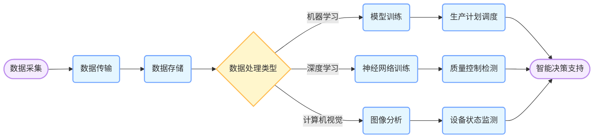

# 人工智能在智能制造软件中的应用

> 关键词：人工智能、智能制造软件、机器学习、深度学习、计算机视觉、工业物联网、智能决策

> 摘要：本文深入探讨了人工智能在智能制造软件中的应用。首先介绍了相关背景，包括目的范围、预期读者等内容。接着阐述了核心概念与联系，通过文本示意图和 Mermaid 流程图清晰展示其架构。详细讲解了核心算法原理，并用 Python 代码进行说明，同时给出了数学模型和公式。通过项目实战，展示了代码实际案例及详细解释。分析了人工智能在智能制造软件中的实际应用场景，推荐了学习资源、开发工具框架以及相关论文著作。最后总结了未来发展趋势与挑战，并给出常见问题解答和扩展阅读参考资料，旨在为读者全面呈现人工智能在智能制造软件领域的应用情况。

## 1. 背景介绍 
### 1.1 目的和范围
随着全球制造业的快速发展，智能制造成为了未来制造业的重要发展方向。人工智能技术的不断进步为智能制造软件的发展提供了强大的动力。本文的目的在于全面探讨人工智能在智能制造软件中的应用，包括核心概念、算法原理、实际案例等方面。范围涵盖了人工智能的主要技术，如机器学习、深度学习、计算机视觉等在智能制造软件中的应用场景，以及相关的开发和实践。

### 1.2 预期读者
本文预期读者包括智能制造领域的工程师、软件开发者、科研人员，以及对人工智能和智能制造感兴趣的学生和爱好者。对于希望了解人工智能如何推动智能制造软件发展的专业人士，本文将提供深入的技术分析和实际应用案例；对于初学者，本文将从基础概念开始，逐步引导读者理解人工智能在智能制造软件中的应用原理和方法。

### 1.3 文档结构概述
本文将按照以下结构进行组织：首先介绍人工智能和智能制造软件的核心概念与联系，通过示意图和流程图展示其架构；接着详细讲解核心算法原理，并给出 Python 代码示例；然后介绍相关的数学模型和公式，并举例说明；通过项目实战展示代码实际案例和详细解释；分析人工智能在智能制造软件中的实际应用场景；推荐学习资源、开发工具框架和相关论文著作；最后总结未来发展趋势与挑战，给出常见问题解答和扩展阅读参考资料。

### 1.4 术语表
#### 1.4.1 核心术语定义
- **人工智能（Artificial Intelligence，AI）**：指让计算机系统能够模拟人类智能的技术和方法，包括学习、推理、感知等能力。
- **智能制造软件（Intelligent Manufacturing Software）**：用于智能制造过程中的软件系统，能够实现生产计划、调度、监控、质量控制等功能，并通过人工智能技术实现智能化决策和优化。
- **机器学习（Machine Learning，ML）**：人工智能的一个分支，通过让计算机从数据中学习模式和规律，从而实现预测和决策。
- **深度学习（Deep Learning，DL）**：一种基于人工神经网络的机器学习方法，能够自动从大量数据中学习复杂的特征和模式。
- **计算机视觉（Computer Vision，CV）**：让计算机能够理解和处理图像和视频数据的技术，常用于目标检测、图像识别等任务。
- **工业物联网（Industrial Internet of Things，IIoT）**：将工业设备和传感器连接到互联网，实现数据的采集、传输和分析，为智能制造提供数据支持。

#### 1.4.2 相关概念解释
- **智能决策**：利用人工智能技术，根据实时数据和历史数据，为生产过程提供最优的决策建议，如生产计划调度、设备维护等。
- **质量控制**：通过对生产过程中的数据进行分析和监测，及时发现产品质量问题，并采取相应的措施进行改进。
- **预测性维护**：利用机器学习算法对设备运行数据进行分析，预测设备可能出现的故障，提前进行维护，减少停机时间。

#### 1.4.3 缩略词列表
| 缩略词 | 英文全称 | 中文全称 |
| ---- | ---- | ---- |
| AI | Artificial Intelligence | 人工智能 |
| ML | Machine Learning | 机器学习 |
| DL | Deep Learning | 深度学习 |
| CV | Computer Vision | 计算机视觉 |
| IIoT | Industrial Internet of Things | 工业物联网 |

## 2. 核心概念与联系 
### 核心概念原理
人工智能在智能制造软件中的应用主要基于机器学习、深度学习、计算机视觉等技术。机器学习通过对大量生产数据的学习，建立模型来预测生产过程中的各种参数和结果。深度学习则能够处理更复杂的数据，如图像和语音，用于产品质量检测、设备故障诊断等任务。计算机视觉技术可以实时监测生产线上的产品和设备状态，及时发现异常情况。

智能制造软件则是集成了各种人工智能技术，实现生产过程的智能化管理。它可以根据实时数据和历史数据，自动调整生产计划和调度，优化生产过程，提高生产效率和产品质量。

### 架构的文本示意图
```plaintext
智能制造软件架构
|-- 数据采集层
|   |-- 工业物联网传感器
|   |-- 生产设备数据接口
|-- 数据传输层
|   |-- 网络通信协议
|-- 数据存储层
|   |-- 数据库
|   |-- 数据仓库
|-- 人工智能处理层
|   |-- 机器学习算法
|   |-- 深度学习模型
|   |-- 计算机视觉技术
|-- 应用层
|   |-- 生产计划与调度
|   |-- 质量控制与检测
|   |-- 设备维护与管理
|   |-- 智能决策支持
```

### Mermaid 流程图


## 3. 核心算法原理 & 具体操作步骤 
### 机器学习算法 - 线性回归
线性回归是一种简单而常用的机器学习算法，用于预测连续值。其基本原理是通过寻找一条直线来拟合数据点，使得数据点到直线的距离之和最小。

#### 算法原理
假设我们有一组数据 $(x_1, y_1), (x_2, y_2), \cdots, (x_n, y_n)$，其中 $x_i$ 是输入特征，$y_i$ 是对应的目标值。线性回归模型可以表示为：

$y = \theta_0 + \theta_1x_1 + \theta_2x_2 + \cdots + \theta_nx_n$

其中 $\theta_0, \theta_1, \cdots, \theta_n$ 是模型的参数。我们的目标是找到一组最优的参数 $\theta$，使得预测值 $\hat{y}$ 与真实值 $y$ 之间的误差最小。常用的误差度量方法是均方误差（Mean Squared Error，MSE）：

$MSE = \frac{1}{n}\sum_{i=1}^{n}(y_i - \hat{y}_i)^2$

通过最小化 MSE，我们可以得到最优的参数 $\theta$。

#### Python 代码实现
```python
import numpy as np
from sklearn.linear_model import LinearRegression
from sklearn.metrics import mean_squared_error
from sklearn.model_selection import train_test_split

# 生成示例数据
X = np.array([[1], [2], [3], [4], [5]])
y = np.array([2, 4, 6, 8, 10])

# 划分训练集和测试集
X_train, X_test, y_train, y_test = train_test_split(X, y, test_size=0.2, random_state=42)

# 创建线性回归模型
model = LinearRegression()

# 训练模型
model.fit(X_train, y_train)

# 进行预测
y_pred = model.predict(X_test)

# 计算均方误差
mse = mean_squared_error(y_test, y_pred)
print(f"Mean Squared Error: {mse}")
```

### 深度学习算法 - 卷积神经网络（CNN）
卷积神经网络是一种专门用于处理图像数据的深度学习模型。它通过卷积层、池化层和全连接层等组件，自动提取图像的特征。

#### 算法原理
卷积层通过卷积核在图像上滑动，进行卷积操作，提取图像的局部特征。池化层用于减少特征图的尺寸，降低计算量。全连接层将提取的特征进行分类或回归。

#### Python 代码实现
```python
import tensorflow as tf
from tensorflow.keras import layers, models
from tensorflow.keras.datasets import mnist
from tensorflow.keras.utils import to_categorical

# 加载 MNIST 数据集
(train_images, train_labels), (test_images, test_labels) = mnist.load_data()

# 数据预处理
train_images = train_images.reshape((60000, 28, 28, 1)).astype('float32') / 255
test_images = test_images.reshape((10000, 28, 28, 1)).astype('float32') / 255

train_labels = to_categorical(train_labels)
test_labels = to_categorical(test_labels)

# 构建卷积神经网络模型
model = models.Sequential()
model.add(layers.Conv2D(32, (3, 3), activation='relu', input_shape=(28, 28, 1)))
model.add(layers.MaxPooling2D((2, 2)))
model.add(layers.Conv2D(64, (3, 3), activation='relu'))
model.add(layers.MaxPooling2D((2, 2)))
model.add(layers.Flatten())
model.add(layers.Dense(64, activation='relu'))
model.add(layers.Dense(10, activation='softmax'))

# 编译模型
model.compile(optimizer='adam',
              loss='categorical_crossentropy',
              metrics=['accuracy'])

# 训练模型
model.fit(train_images, train_labels, epochs=5, batch_size=64)

# 评估模型
test_loss, test_acc = model.evaluate(test_images, test_labels)
print(f"Test accuracy: {test_acc}")
```

## 4. 数学模型和公式 & 详细讲解 & 举例说明 
### 线性回归的数学模型和公式
#### 数学模型
线性回归的数学模型可以表示为：

$y = \theta_0 + \theta_1x_1 + \theta_2x_2 + \cdots + \theta_nx_n + \epsilon$

其中 $y$ 是目标值，$x_1, x_2, \cdots, x_n$ 是输入特征，$\theta_0, \theta_1, \cdots, \theta_n$ 是模型的参数，$\epsilon$ 是误差项，假设 $\epsilon$ 服从均值为 0，方差为 $\sigma^2$ 的正态分布。

#### 最小二乘法求解参数
最小二乘法的目标是最小化均方误差：

$MSE = \frac{1}{n}\sum_{i=1}^{n}(y_i - \hat{y}_i)^2 = \frac{1}{n}\sum_{i=1}^{n}(y_i - (\theta_0 + \theta_1x_{i1} + \theta_2x_{i2} + \cdots + \theta_nx_{in}))^2$

为了找到最优的参数 $\theta$，我们对 MSE 求偏导数，并令其等于 0。以简单线性回归（$n = 1$）为例：

$\frac{\partial MSE}{\partial \theta_0} = -\frac{2}{n}\sum_{i=1}^{n}(y_i - (\theta_0 + \theta_1x_i)) = 0$

$\frac{\partial MSE}{\partial \theta_1} = -\frac{2}{n}\sum_{i=1}^{n}x_i(y_i - (\theta_0 + \theta_1x_i)) = 0$

解上述方程组，可以得到最优的参数 $\theta_0$ 和 $\theta_1$。

#### 举例说明
假设我们有以下数据：

| $x$ | $y$ |
| ---- | ---- |
| 1 | 2 |
| 2 | 4 |
| 3 | 6 |
| 4 | 8 |
| 5 | 10 |

我们可以使用最小二乘法求解线性回归模型的参数。首先计算相关统计量：

$\bar{x} = \frac{1 + 2 + 3 + 4 + 5}{5} = 3$

$\bar{y} = \frac{2 + 4 + 6 + 8 + 10}{5} = 6$

$\sum_{i=1}^{5}(x_i - \bar{x})(y_i - \bar{y}) = (1 - 3)(2 - 6) + (2 - 3)(4 - 6) + (3 - 3)(6 - 6) + (4 - 3)(8 - 6) + (5 - 3)(10 - 6) = 20$

$\sum_{i=1}^{5}(x_i - \bar{x})^2 = (1 - 3)^2 + (2 - 3)^2 + (3 - 3)^2 + (4 - 3)^2 + (5 - 3)^2 = 10$

则 $\theta_1 = \frac{\sum_{i=1}^{5}(x_i - \bar{x})(y_i - \bar{y})}{\sum_{i=1}^{5}(x_i - \bar{x})^2} = \frac{20}{10} = 2$

$\theta_0 = \bar{y} - \theta_1\bar{x} = 6 - 2\times3 = 0$

所以线性回归模型为 $y = 2x$。

### 卷积神经网络的数学模型和公式
#### 卷积操作
卷积操作是卷积神经网络的核心操作。假设输入图像为 $X$，卷积核为 $K$，输出特征图为 $Y$，则卷积操作可以表示为：

$Y_{i,j} = \sum_{m=0}^{M - 1}\sum_{n=0}^{N - 1}X_{i + m, j + n}K_{m,n}$

其中 $M$ 和 $N$ 是卷积核的尺寸。

#### 池化操作
池化操作通常用于减少特征图的尺寸。常见的池化操作有最大池化和平均池化。以最大池化为例，假设池化窗口的尺寸为 $P\times P$，则池化操作可以表示为：

$Y_{i,j} = \max_{m = 0}^{P - 1}\max_{n = 0}^{P - 1}X_{iP + m, jP + n}$

#### 举例说明
假设输入图像为一个 $3\times3$ 的矩阵：

$X = \begin{bmatrix}
1 & 2 & 3 \\
4 & 5 & 6 \\
7 & 8 & 9
\end{bmatrix}$

卷积核为一个 $2\times2$ 的矩阵：

$K = \begin{bmatrix}
1 & 0 \\
0 & 1
\end{bmatrix}$

则卷积操作的结果为：

$Y_{0,0} = 1\times1 + 2\times0 + 4\times0 + 5\times1 = 6$

$Y_{0,1} = 2\times1 + 3\times0 + 5\times0 + 6\times1 = 8$

$Y_{1,0} = 4\times1 + 5\times0 + 7\times0 + 8\times1 = 12$

$Y_{1,1} = 5\times1 + 6\times0 + 8\times0 + 9\times1 = 14$

所以输出特征图为：

$Y = \begin{bmatrix}
6 & 8 \\
12 & 14
\end{bmatrix}$

## 5. 项目实战：代码实际案例和详细解释说明 
### 5.1  开发环境搭建
#### 安装 Python
首先需要安装 Python 环境，建议使用 Python 3.7 及以上版本。可以从 Python 官方网站（https://www.python.org/downloads/）下载安装包，按照安装向导进行安装。

#### 安装必要的库
使用以下命令安装必要的 Python 库：
```bash
pip install numpy pandas scikit-learn tensorflow keras opencv-python
```

### 5.2  源代码详细实现和代码解读
#### 项目背景
假设我们要开发一个智能制造软件，用于预测产品的质量等级。我们有一组生产数据，包括产品的各种特征和对应的质量等级。

#### 数据准备
```python
import pandas as pd
from sklearn.model_selection import train_test_split
from sklearn.preprocessing import StandardScaler

# 加载数据
data = pd.read_csv('manufacturing_data.csv')

# 分离特征和目标
X = data.drop('quality_level', axis=1)
y = data['quality_level']

# 数据标准化
scaler = StandardScaler()
X = scaler.fit_transform(X)

# 划分训练集和测试集
X_train, X_test, y_train, y_test = train_test_split(X, y, test_size=0.2, random_state=42)
```
代码解读：首先使用 `pandas` 库加载数据，然后分离特征和目标。使用 `StandardScaler` 对特征数据进行标准化处理，以提高模型的训练效果。最后使用 `train_test_split` 函数将数据划分为训练集和测试集。

#### 模型训练
```python
from sklearn.ensemble import RandomForestClassifier
from sklearn.metrics import accuracy_score

# 创建随机森林分类器
model = RandomForestClassifier(n_estimators=100, random_state=42)

# 训练模型
model.fit(X_train, y_train)

# 进行预测
y_pred = model.predict(X_test)

# 计算准确率
accuracy = accuracy_score(y_test, y_pred)
print(f"Accuracy: {accuracy}")
```
代码解读：使用 `RandomForestClassifier` 创建随机森林分类器，设置 `n_estimators` 为 100，表示使用 100 棵决策树。使用训练集数据对模型进行训练，然后使用测试集数据进行预测。最后使用 `accuracy_score` 函数计算模型的准确率。

### 5.3  代码解读与分析
#### 数据预处理
数据预处理是机器学习项目中非常重要的一步。通过数据标准化，可以使不同特征的数据具有相同的尺度，避免某些特征对模型的影响过大。划分训练集和测试集可以评估模型的泛化能力，确保模型在未见过的数据上也能有较好的表现。

#### 模型选择
随机森林是一种集成学习方法，它通过组合多个决策树来提高模型的性能。随机森林具有较好的抗过拟合能力和较高的准确率，适用于多种分类和回归问题。

#### 模型评估
使用准确率作为模型的评估指标，可以直观地了解模型的预测性能。但在实际应用中，还可以使用其他评估指标，如精确率、召回率、F1 值等，以更全面地评估模型的性能。

## 6. 实际应用场景 
### 生产计划与调度
人工智能可以根据实时生产数据和市场需求，自动调整生产计划和调度。通过机器学习算法预测生产时间、设备利用率等参数，优化生产流程，提高生产效率。例如，根据历史订单数据和生产能力，预测未来一段时间的订单需求，合理安排生产任务，避免生产过剩或不足。

### 质量控制与检测
计算机视觉技术可以用于产品质量检测。通过对生产线上的产品进行图像采集和分析，实时检测产品的外观缺陷、尺寸偏差等问题。深度学习模型可以对大量的产品图像进行训练，提高检测的准确率和效率。例如，在电子产品生产中，使用计算机视觉技术检测电路板上的元件焊接是否正确。

### 设备维护与管理
预测性维护是人工智能在智能制造中的重要应用之一。通过对设备运行数据的实时监测和分析，利用机器学习算法预测设备可能出现的故障，提前进行维护，减少停机时间。例如，通过分析设备的振动、温度等数据，预测设备的轴承是否需要更换。

### 智能决策支持
人工智能可以为企业的决策提供支持。通过对生产数据、市场数据、财务数据等多源数据的分析，利用深度学习模型和知识图谱等技术，为企业提供智能决策建议。例如，在新产品研发决策中，分析市场需求、技术趋势等因素，为企业提供最优的研发方案。

## 7. 工具和资源推荐
### 7.1 学习资源推荐
#### 7.1.1 书籍推荐
- 《机器学习》（周志华著）：全面介绍了机器学习的基本概念、算法和应用，是机器学习领域的经典教材。
- 《深度学习》（Ian Goodfellow、Yoshua Bengio 和 Aaron Courville 著）：系统阐述了深度学习的理论和实践，适合深入学习深度学习的读者。
- 《Python 数据分析实战》（Wei-Meng Lee 著）：介绍了使用 Python 进行数据分析的方法和技巧，包括数据处理、可视化和机器学习等方面。

#### 7.1.2 在线课程
- Coursera 上的“机器学习”课程（Andrew Ng 教授）：经典的机器学习课程，涵盖了机器学习的基本算法和应用。
- edX 上的“深度学习”课程（MIT 开设）：深入讲解了深度学习的理论和实践，提供了丰富的案例和实验。
- 中国大学 MOOC 上的“人工智能基础”课程：适合初学者了解人工智能的基本概念和方法。

#### 7.1.3 技术博客和网站
- Medium：有许多人工智能和机器学习领域的优秀博客文章，涵盖了最新的研究成果和实践经验。
- Towards Data Science：专注于数据科学和机器学习领域的技术博客，提供了大量的教程和案例。
- 人工智能头条：国内知名的人工智能媒体，及时报道人工智能领域的最新动态和技术趋势。

### 7.2 开发工具框架推荐
#### 7.2.1 IDE和编辑器
- PyCharm：功能强大的 Python 集成开发环境，提供了代码编辑、调试、版本控制等功能，适合开发大型 Python 项目。
- Jupyter Notebook：交互式的开发环境，适合进行数据探索、模型实验和代码演示。
- Visual Studio Code：轻量级的代码编辑器，支持多种编程语言和插件，具有丰富的扩展功能。

#### 7.2.2 调试和性能分析工具
- TensorBoard：TensorFlow 提供的可视化工具，用于监控模型的训练过程、可视化模型结构和分析性能指标。
- PyTorch Profiler：PyTorch 提供的性能分析工具，用于分析模型的运行时间和内存使用情况。
- cProfile：Python 内置的性能分析模块，用于分析 Python 代码的运行时间和函数调用情况。

#### 7.2.3 相关框架和库
- TensorFlow：开源的深度学习框架，提供了丰富的工具和接口，支持多种深度学习模型的开发和训练。
- PyTorch：另一个流行的深度学习框架，具有动态图机制，适合快速迭代和实验。
- Scikit-learn：用于机器学习的 Python 库，提供了多种机器学习算法和工具，如分类、回归、聚类等。

### 7.3 相关论文著作推荐
#### 7.3.1 经典论文
- “ImageNet Classification with Deep Convolutional Neural Networks”（Alex Krizhevsky、Ilya Sutskever 和 Geoffrey E. Hinton 著）：介绍了 AlexNet 卷积神经网络，开启了深度学习在计算机视觉领域的热潮。
- “Long Short-Term Memory”（Sepp Hochreiter 和 Jürgen Schmidhuber 著）：提出了长短期记忆网络（LSTM），解决了传统循环神经网络的梯度消失问题。
- “Gradient-Based Learning Applied to Document Recognition”（Yann LeCun、Léon Bottou、Yoshua Bengio 和 Patrick Haffner 著）：介绍了 LeNet 卷积神经网络，是最早应用于手写字符识别的深度学习模型。

#### 7.3.2 最新研究成果
- 在 arXiv 预印本平台上搜索“Artificial Intelligence in Manufacturing”等关键词，可以获取人工智能在智能制造领域的最新研究成果。
- 关注顶级学术会议，如 ICML（国际机器学习会议）、CVPR（计算机视觉与模式识别会议）、NeurIPS（神经信息处理系统大会）等，了解最新的研究动态。

#### 7.3.3 应用案例分析
- 《智能制造：AI 驱动的工业 4.0 实践》：介绍了人工智能在智能制造中的实际应用案例，包括生产计划、质量控制、设备维护等方面。
- 工业界的技术博客和报告，如西门子、ABB 等公司的官方网站，会发布一些人工智能在智能制造中的应用案例和实践经验。

## 8. 总结：未来发展趋势与挑战
### 未来发展趋势
#### 融合化发展
人工智能将与物联网、大数据、云计算等技术深度融合，形成更加智能化的制造系统。例如，工业物联网将提供更丰富的生产数据，人工智能通过对这些数据的分析和处理，实现生产过程的优化和智能决策。

#### 自主化制造
未来的智能制造系统将具备更高的自主性。机器人和自动化设备将能够自主感知环境、规划任务和执行操作，实现无人化生产。人工智能将在机器人的决策和控制中发挥重要作用。

#### 个性化定制
随着消费者需求的多样化，智能制造将越来越注重个性化定制。人工智能可以根据客户的个性化需求，快速设计和生产定制化产品，提高客户满意度。

### 挑战
#### 数据安全和隐私
智能制造系统中涉及大量的生产数据和客户信息，数据安全和隐私保护是一个重要的挑战。需要加强数据加密、访问控制等技术，确保数据的安全性和隐私性。

#### 人才短缺
人工智能在智能制造中的应用需要既懂人工智能技术又懂制造工艺的复合型人才。目前这类人才短缺，需要加强相关教育和培训，培养更多的专业人才。

#### 标准和规范缺失
目前人工智能在智能制造领域的标准和规范还不够完善，不同企业和系统之间的兼容性和互操作性存在问题。需要制定统一的标准和规范，促进人工智能在智能制造中的推广和应用。

## 9. 附录：常见问题与解答
### 人工智能在智能制造软件中的应用是否会导致大量工人失业？
虽然人工智能在智能制造中的应用会提高生产自动化程度，但并不会导致大量工人失业。相反，它会创造新的就业机会，如人工智能系统的维护和管理、数据分析和决策支持等岗位。同时，工人可以通过培训和学习，掌握新的技能，适应智能制造的发展。

### 如何选择适合的人工智能算法应用于智能制造软件？
选择适合的人工智能算法需要考虑多个因素，如数据类型、问题类型、模型复杂度等。如果数据是结构化的，且问题是分类或回归问题，可以考虑使用机器学习算法，如决策树、随机森林等。如果数据是非结构化的，如图像、语音等，可以考虑使用深度学习算法，如卷积神经网络、循环神经网络等。

### 人工智能在智能制造软件中的应用需要多少数据？
数据量的需求取决于具体的应用场景和算法。一般来说，深度学习算法需要大量的数据进行训练，以学习复杂的特征和模式。而机器学习算法对数据量的要求相对较低。在实际应用中，应尽可能收集更多的数据，并进行合理的数据预处理和增强，以提高模型的性能。

## 10. 扩展阅读 & 参考资料
### 扩展阅读
- 《工业 4.0：即将来袭的第四次工业革命》：介绍了工业 4.0 的概念、技术和发展趋势，对理解智能制造有很大的帮助。
- 《人工智能简史》：回顾了人工智能的发展历程，了解人工智能的起源和重要里程碑。

### 参考资料
- 相关学术论文和研究报告，如 IEEE Transactions on Industrial Informatics、ACM Transactions on Intelligent Systems and Technology 等期刊上的文章。
- 工业界的技术文档和白皮书，如西门子、ABB、GE 等公司发布的关于智能制造和人工智能应用的文档。