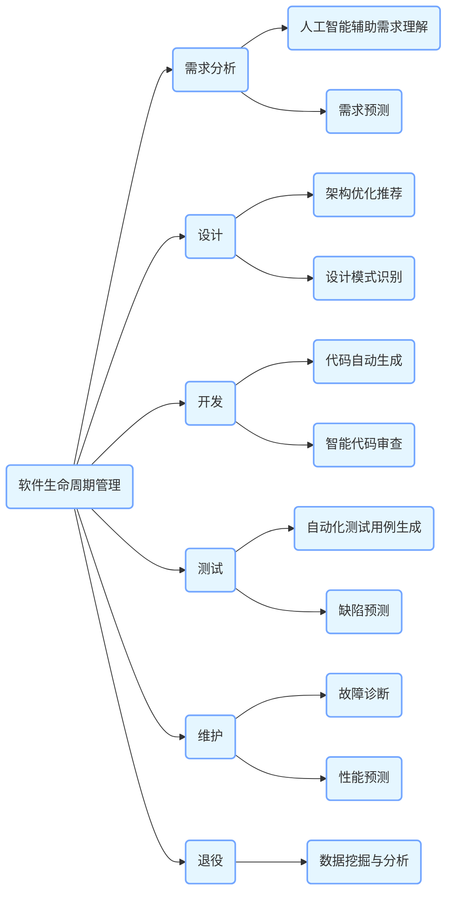

# 人工智能在软件生命周期管理中的应用

> 关键词：人工智能、软件生命周期管理、需求分析、代码开发、测试维护、自动化、智能决策

> 摘要：本文深入探讨了人工智能在软件生命周期管理中的应用。软件生命周期管理涵盖了从需求分析、设计、开发、测试到维护和退役的整个过程，而人工智能技术的融入为各个阶段带来了新的机遇和变革。通过分析人工智能在不同阶段的应用原理、算法和实际案例，阐述了其如何提高软件质量、提升开发效率、降低成本，并对未来的发展趋势和挑战进行了展望。旨在为相关从业者提供全面的技术参考，促进人工智能与软件生命周期管理的深度融合。

## 1. 背景介绍 
### 1.1 目的和范围
随着软件系统的规模和复杂度不断增加，软件生命周期管理面临着诸多挑战，如需求变更频繁、开发效率低下、测试不充分、维护成本高昂等。人工智能技术具有强大的数据分析、模式识别和智能决策能力，将其应用于软件生命周期管理的各个阶段，可以有效解决这些问题，提高软件项目的成功率和质量。本文的范围涵盖了人工智能在软件生命周期管理的各个主要阶段的应用，包括需求分析、设计、开发、测试、维护和退役等，旨在深入探讨人工智能技术在这些阶段的应用原理、方法和实践案例。

### 1.2 预期读者
本文预期读者包括软件开发者、软件项目经理、质量保证工程师、软件测试人员、人工智能研究人员以及对软件生命周期管理和人工智能应用感兴趣的相关人员。通过阅读本文，读者可以了解人工智能在软件生命周期管理中的应用现状和发展趋势，学习相关的技术和方法，并将其应用于实际的项目中。

### 1.3 文档结构概述
本文将按照以下结构进行组织：首先介绍人工智能和软件生命周期管理的核心概念及其联系，然后详细阐述人工智能在软件生命周期管理各个阶段的核心算法原理和具体操作步骤，接着通过数学模型和公式对相关技术进行深入讲解并举例说明，再通过项目实战展示代码实际案例和详细解释，之后介绍人工智能在软件生命周期管理中的实际应用场景，推荐相关的工具和资源，最后总结未来发展趋势与挑战，并提供常见问题与解答以及扩展阅读和参考资料。

### 1.4 术语表
#### 1.4.1 核心术语定义
- **人工智能（Artificial Intelligence，AI）**：是指计算机系统能够执行通常需要人类智能才能完成的任务，如学习、推理、问题解决、感知和语言理解等。
- **软件生命周期管理（Software Lifecycle Management，SLM）**：是指从软件的构思开始，经过需求分析、设计、开发、测试、部署、维护，直到最终退役的整个过程的管理。
- **机器学习（Machine Learning，ML）**：是人工智能的一个分支，它使计算机系统能够通过数据学习模式和规律，而无需明确的编程指令。
- **深度学习（Deep Learning，DL）**：是机器学习的一个子领域，它使用多层神经网络来学习数据的复杂表示和模式。
- **自然语言处理（Natural Language Processing，NLP）**：是人工智能的一个领域，它处理计算机与人类语言之间的交互，包括文本分析、语音识别、机器翻译等。

#### 1.4.2 相关概念解释
- **需求工程**：是软件生命周期管理的初始阶段，主要涉及收集、分析、定义和管理软件系统的需求。
- **代码审查**：是软件开发过程中的一个重要环节，通过人工或自动化工具对代码进行检查，以发现代码中的缺陷、规范问题和潜在的安全风险。
- **软件测试**：是确保软件质量的重要手段，通过对软件系统进行各种测试用例的执行，发现软件中的缺陷和错误。
- **软件维护**：是软件生命周期管理的最后一个阶段，主要涉及对已部署的软件系统进行修改、更新和优化，以保证软件系统的正常运行和满足用户的新需求。

#### 1.4.3 缩略词列表
- **AI**：Artificial Intelligence（人工智能）
- **SLM**：Software Lifecycle Management（软件生命周期管理）
- **ML**：Machine Learning（机器学习）
- **DL**：Deep Learning（深度学习）
- **NLP**：Natural Language Processing（自然语言处理）
- **SCM**：Software Configuration Management（软件配置管理）
- **CI/CD**：Continuous Integration/Continuous Deployment（持续集成/持续部署）

## 2. 核心概念与联系 

### 2.1 人工智能核心概念
人工智能是一门研究如何使计算机系统能够模拟人类智能的学科。它主要包括机器学习、深度学习、自然语言处理、计算机视觉等多个领域。机器学习是人工智能的核心技术之一，它通过让计算机系统从数据中学习模式和规律，从而实现对未知数据的预测和决策。深度学习是机器学习的一个子领域，它使用多层神经网络来学习数据的复杂表示和模式，在图像识别、语音识别、自然语言处理等领域取得了显著的成果。自然语言处理则是研究如何让计算机理解和处理人类语言的技术，包括文本分类、情感分析、机器翻译等任务。

### 2.2 软件生命周期管理核心概念
软件生命周期管理是指从软件的构思开始，经过需求分析、设计、开发、测试、部署、维护，直到最终退役的整个过程的管理。它包括多个阶段和活动，每个阶段都有其特定的目标和任务。需求分析阶段主要是收集和分析用户的需求，定义软件系统的功能和性能要求；设计阶段则是根据需求分析的结果，设计软件系统的架构和模块；开发阶段是实现软件系统的具体功能和代码；测试阶段是对软件系统进行各种测试用例的执行，以发现软件中的缺陷和错误；部署阶段是将软件系统部署到生产环境中；维护阶段是对已部署的软件系统进行修改、更新和优化，以保证软件系统的正常运行和满足用户的新需求；退役阶段是当软件系统不再使用时，对其进行清理和归档。

### 2.3 人工智能与软件生命周期管理的联系
人工智能与软件生命周期管理之间存在着密切的联系。人工智能技术可以应用于软件生命周期管理的各个阶段，帮助提高软件质量、提升开发效率、降低成本。在需求分析阶段，人工智能技术可以通过自然语言处理技术对用户需求进行分析和理解，帮助需求工程师更好地把握用户需求；在设计阶段，人工智能技术可以通过机器学习算法对软件架构进行优化和推荐，提高软件系统的可维护性和可扩展性；在开发阶段，人工智能技术可以通过代码自动生成工具和智能代码审查工具，提高开发效率和代码质量；在测试阶段，人工智能技术可以通过自动化测试工具和缺陷预测模型，提高测试效率和发现缺陷的能力；在维护阶段，人工智能技术可以通过故障诊断和预测模型，及时发现和解决软件系统中的问题，提高软件系统的可靠性和可用性；在退役阶段，人工智能技术可以通过数据挖掘和分析技术，对软件系统的历史数据进行分析和总结，为后续的项目提供经验和参考。

### 2.4 文本示意图
人工智能在软件生命周期管理中的应用可以用以下示意图表示：

```plaintext
软件生命周期管理
|-- 需求分析
|   |-- 人工智能辅助需求理解
|   |-- 需求预测
|-- 设计
|   |-- 架构优化推荐
|   |-- 设计模式识别
|-- 开发
|   |-- 代码自动生成
|   |-- 智能代码审查
|-- 测试
|   |-- 自动化测试用例生成
|   |-- 缺陷预测
|-- 维护
|   |-- 故障诊断
|   |-- 性能预测
|-- 退役
|   |-- 数据挖掘与分析
```

### 2.5 Mermaid 流程图


## 3. 核心算法原理 & 具体操作步骤 

### 3.1 需求分析阶段 - 人工智能辅助需求理解
#### 3.1.1 算法原理
在需求分析阶段，人工智能辅助需求理解主要使用自然语言处理技术。自然语言处理技术可以将用户的自然语言需求文本进行处理和分析，提取其中的关键信息和语义，帮助需求工程师更好地理解用户需求。常用的自然语言处理算法包括词法分析、句法分析、语义分析等。

以下是一个简单的 Python 示例，使用 `nltk` 库进行词法分析和词性标注：
```python
import nltk
from nltk.tokenize import word_tokenize
from nltk import pos_tag

# 下载必要的数据
nltk.download('punkt')
nltk.download('averaged_perceptron_tagger')

# 用户需求文本
user_requirement = "The system should be able to generate a report every day."

# 词法分析
tokens = word_tokenize(user_requirement)

# 词性标注
pos_tags = pos_tag(tokens)

print("词法分析结果:", tokens)
print("词性标注结果:", pos_tags)
```
#### 3.1.2 具体操作步骤
1. **数据收集**：收集用户的自然语言需求文本，可以通过问卷调查、用户访谈、需求文档等方式获取。
2. **数据预处理**：对收集到的需求文本进行预处理，包括去除停用词、标点符号，进行词法分析和词性标注等。
3. **特征提取**：从预处理后的需求文本中提取关键特征，如关键词、短语、语义信息等。
4. **模型训练**：使用机器学习或深度学习模型对提取的特征进行训练，以实现对用户需求的分类、聚类和理解。
5. **需求理解**：使用训练好的模型对新的用户需求文本进行分析和理解，提取关键信息和语义。

### 3.2 开发阶段 - 智能代码审查
#### 3.2.1 算法原理
智能代码审查主要使用机器学习和深度学习算法。机器学习算法可以通过对大量的代码样本进行学习，建立代码质量评估模型，对新的代码进行质量评估和缺陷预测。深度学习算法可以通过对代码的语法和语义进行学习，实现对代码的智能审查和优化建议。

以下是一个简单的 Python 示例，使用 `pylint` 库进行代码静态分析：
```python
import pylint.lint

# 要审查的代码文件路径
code_file = 'example.py'

# 运行 pylint 进行代码审查
pylint.lint.Run([code_file])
```
#### 3.2.2 具体操作步骤
1. **代码收集**：收集项目中的代码文件，可以通过版本控制系统获取。
2. **数据预处理**：对收集到的代码文件进行预处理，包括代码格式化、注释去除等。
3. **特征提取**：从预处理后的代码文件中提取关键特征，如代码复杂度、代码风格、代码结构等。
4. **模型训练**：使用机器学习或深度学习模型对提取的特征进行训练，以建立代码质量评估模型和缺陷预测模型。
5. **代码审查**：使用训练好的模型对新的代码文件进行审查，生成代码质量评估报告和缺陷预测结果。
6. **优化建议**：根据代码审查结果，为开发人员提供优化建议和改进措施。

### 3.3 测试阶段 - 自动化测试用例生成
#### 3.3.3 算法原理
自动化测试用例生成主要使用搜索算法和机器学习算法。搜索算法可以通过对软件系统的状态空间进行搜索，生成覆盖各种可能情况的测试用例。机器学习算法可以通过对历史测试用例和软件系统的行为数据进行学习，预测新的测试用例。

以下是一个简单的 Python 示例，使用 `unittest` 库进行单元测试：
```python
import unittest

# 要测试的函数
def add(a, b):
    return a + b

# 测试类
class TestAdd(unittest.TestCase):
    def test_add(self):
        result = add(2, 3)
        self.assertEqual(result, 5)

# 运行测试
if __name__ == '__main__':
    unittest.main()
```
#### 3.3.4 具体操作步骤
1. **软件系统建模**：对软件系统的功能和行为进行建模，包括状态空间、输入输出等。
2. **测试目标定义**：定义测试的目标和覆盖标准，如功能覆盖、语句覆盖、分支覆盖等。
3. **测试用例生成**：使用搜索算法或机器学习算法生成满足测试目标的测试用例。
4. **测试用例执行**：使用自动化测试框架执行生成的测试用例，并记录测试结果。
5. **测试结果分析**：对测试结果进行分析，发现软件系统中的缺陷和错误。
6. **测试用例优化**：根据测试结果，对测试用例进行优化和调整，提高测试效率和覆盖率。

## 4. 数学模型和公式 & 详细讲解 & 举例说明 

### 4.1 需求分析阶段 - 需求预测模型
#### 4.1.1 数学模型
需求预测模型可以使用线性回归模型进行建模。线性回归模型的一般形式为：

$$y = \beta_0 + \beta_1x_1 + \beta_2x_2 + \cdots + \beta_nx_n + \epsilon$$

其中，$y$ 是预测的需求值，$x_1, x_2, \cdots, x_n$ 是影响需求的特征变量，$\beta_0, \beta_1, \beta_2, \cdots, \beta_n$ 是模型的参数，$\epsilon$ 是误差项。

#### 4.1.2 详细讲解
线性回归模型的目标是通过最小化误差项的平方和来估计模型的参数。可以使用最小二乘法来求解模型的参数。最小二乘法的目标函数为：

$$\min_{\beta_0, \beta_1, \cdots, \beta_n} \sum_{i=1}^{m} (y_i - (\beta_0 + \beta_1x_{i1} + \beta_2x_{i2} + \cdots + \beta_nx_{in}))^2$$

其中，$m$ 是样本的数量，$y_i$ 是第 $i$ 个样本的真实需求值，$x_{i1}, x_{i2}, \cdots, x_{in}$ 是第 $i$ 个样本的特征变量值。

#### 4.1.3 举例说明
假设我们要预测某个软件系统的用户数量，影响用户数量的特征变量包括广告投入、用户口碑、市场竞争等。我们收集了过去 10 个月的数据，如下表所示：

| 月份 | 广告投入（万元） | 用户口碑（评分） | 市场竞争（指数） | 用户数量（人） |
|------|------------------|------------------|------------------|----------------|
| 1    | 10               | 8                | 3                | 500            |
| 2    | 12               | 8.5              | 3.5              | 550            |
| 3    | 15               | 9                | 4                | 600            |
| 4    | 18               | 9.5              | 4.5              | 650            |
| 5    | 20               | 10               | 5                | 700            |
| 6    | 22               | 10.5             | 5.5              | 750            |
| 7    | 25               | 11               | 6                | 800            |
| 8    | 28               | 11.5             | 6.5              | 850            |
| 9    | 30               | 12               | 7                | 900            |
| 10   | 32               | 12.5             | 7.5              | 950            |

我们可以使用 Python 的 `scikit-learn` 库来实现线性回归模型：
```python
import numpy as np
from sklearn.linear_model import LinearRegression

# 特征变量
X = np.array([[10, 8, 3], [12, 8.5, 3.5], [15, 9, 4], [18, 9.5, 4.5], [20, 10, 5],
              [22, 10.5, 5.5], [25, 11, 6], [28, 11.5, 6.5], [30, 12, 7], [32, 12.5, 7.5]])

# 真实需求值
y = np.array([500, 550, 600, 650, 700, 750, 800, 850, 900, 950])

# 创建线性回归模型
model = LinearRegression()

# 训练模型
model.fit(X, y)

# 预测新的需求值
new_X = np.array([[35, 13, 8]])
predicted_y = model.predict(new_X)

print("预测的用户数量:", predicted_y)
```

### 4.2 测试阶段 - 缺陷预测模型
#### 4.2.1 数学模型
缺陷预测模型可以使用逻辑回归模型进行建模。逻辑回归模型的一般形式为：

$$P(y = 1|x) = \frac{1}{1 + e^{-(\beta_0 + \beta_1x_1 + \beta_2x_2 + \cdots + \beta_nx_n)}}$$

其中，$P(y = 1|x)$ 是样本属于正类（存在缺陷）的概率，$x_1, x_2, \cdots, x_n$ 是样本的特征变量，$\beta_0, \beta_1, \beta_2, \cdots, \beta_n$ 是模型的参数。

#### 4.2.2 详细讲解
逻辑回归模型的目标是通过最大化似然函数来估计模型的参数。似然函数的表达式为：

$$L(\beta_0, \beta_1, \cdots, \beta_n) = \prod_{i=1}^{m} P(y_i|x_i)^{y_i} (1 - P(y_i|x_i))^{1 - y_i}$$

其中，$m$ 是样本的数量，$y_i$ 是第 $i$ 个样本的真实标签（0 或 1），$x_i$ 是第 $i$ 个样本的特征变量值。

通常使用对数似然函数来简化计算，对数似然函数的表达式为：

$$\log L(\beta_0, \beta_1, \cdots, \beta_n) = \sum_{i=1}^{m} [y_i \log P(y_i|x_i) + (1 - y_i) \log (1 - P(y_i|x_i))]$$

可以使用梯度下降法等优化算法来求解对数似然函数的最大值，从而得到模型的参数。

#### 4.2.3 举例说明
假设我们要预测某个软件模块是否存在缺陷，影响缺陷存在的特征变量包括代码复杂度、代码变更频率、开发人员经验等。我们收集了过去 20 个软件模块的数据，如下表所示：

| 模块编号 | 代码复杂度 | 代码变更频率 | 开发人员经验（年） | 是否存在缺陷（0: 否，1: 是） |
|----------|------------|--------------|---------------------|------------------------------|
| 1        | 10         | 2            | 3                   | 0                            |
| 2        | 12         | 3            | 4                   | 0                            |
| 3        | 15         | 4            | 5                   | 0                            |
| 4        | 18         | 5            | 6                   | 0                            |
| 5        | 20         | 6            | 7                   | 0                            |
| 6        | 22         | 7            | 8                   | 1                            |
| 7        | 25         | 8            | 9                   | 1                            |
| 8        | 28         | 9            | 10                  | 1                            |
| 9        | 30         | 10           | 11                  | 1                            |
| 10       | 32         | 11           | 12                  | 1                            |
| 11       | 35         | 12           | 13                  | 1                            |
| 12       | 38         | 13           | 14                  | 1                            |
| 13       | 40         | 14           | 15                  | 1                            |
| 14       | 42         | 15           | 16                  | 1                            |
| 15       | 45         | 16           | 17                  | 1                            |
| 16       | 48         | 17           | 18                  | 1                            |
| 17       | 50         | 18           | 19                  | 1                            |
| 18       | 52         | 19           | 20                  | 1                            |
| 19       | 55         | 20           | 21                  | 1                            |
| 20       | 58         | 21           | 22                  | 1                            |

我们可以使用 Python 的 `scikit-learn` 库来实现逻辑回归模型：
```python
import numpy as np
from sklearn.linear_model import LogisticRegression

# 特征变量
X = np.array([[10, 2, 3], [12, 3, 4], [15, 4, 5], [18, 5, 6], [20, 6, 7],
              [22, 7, 8], [25, 8, 9], [28, 9, 10], [30, 10, 11], [32, 11, 12],
              [35, 12, 13], [38, 13, 14], [40, 14, 15], [42, 15, 16], [45, 16, 17],
              [48, 17, 18], [50, 18, 19], [52, 19, 20], [55, 20, 21], [58, 21, 22]])

# 真实标签
y = np.array([0, 0, 0, 0, 0, 1, 1, 1, 1, 1, 1, 1, 1, 1, 1, 1, 1, 1, 1, 1])

# 创建逻辑回归模型
model = LogisticRegression()

# 训练模型
model.fit(X, y)

# 预测新的样本
new_X = np.array([[60, 22, 23]])
predicted_y = model.predict(new_X)

print("预测的结果:", predicted_y)
```

## 5. 项目实战：代码实际案例和详细解释说明 

### 5.1  开发环境搭建
#### 5.1.1 操作系统
本项目可以在 Windows、Linux 或 macOS 操作系统上进行开发。建议使用 Linux 或 macOS 操作系统，因为它们对 Python 和相关开发工具的支持更好。

#### 5.1.2 Python 环境
安装 Python 3.7 或更高版本。可以从 Python 官方网站（https://www.python.org/downloads/） 下载并安装 Python。

#### 5.1.3 虚拟环境
建议使用虚拟环境来管理项目的依赖。可以使用 `venv` 或 `conda` 来创建虚拟环境。以下是使用 `venv` 创建虚拟环境的示例：
```bash
# 创建虚拟环境
python -m venv myenv

# 激活虚拟环境
# Windows
myenv\Scripts\activate
# Linux 或 macOS
source myenv/bin/activate
```

#### 5.1.4 依赖安装
在虚拟环境中安装项目所需的依赖。可以使用 `pip` 来安装依赖。以下是安装常见依赖的示例：
```bash
pip install numpy scikit-learn nltk pylint unittest
```

### 5.2  源代码详细实现和代码解读
#### 5.2.1 需求分析阶段 - 人工智能辅助需求理解
```python
import nltk
from nltk.tokenize import word_tokenize
from nltk import pos_tag

# 下载必要的数据
nltk.download('punkt')
nltk.download('averaged_perceptron_tagger')

def analyze_requirement(requirement_text):
    # 词法分析
    tokens = word_tokenize(requirement_text)
    
    # 词性标注
    pos_tags = pos_tag(tokens)
    
    return tokens, pos_tags

# 用户需求文本
user_requirement = "The system should be able to generate a report every day."

# 分析需求
tokens, pos_tags = analyze_requirement(user_requirement)

print("词法分析结果:", tokens)
print("词性标注结果:", pos_tags)
```
**代码解读**：
- 首先导入 `nltk` 库中的相关模块，包括 `word_tokenize` 用于词法分析，`pos_tag` 用于词性标注。
- 下载必要的数据，包括 `punkt` 分词器和 `averaged_perceptron_tagger` 词性标注器。
- 定义 `analyze_requirement` 函数，该函数接受用户需求文本作为输入，对其进行词法分析和词性标注，并返回分析结果。
- 定义用户需求文本，调用 `analyze_requirement` 函数进行分析，并打印分析结果。

#### 5.2.2 开发阶段 - 智能代码审查
```python
import pylint.lint

# 要审查的代码文件路径
code_file = 'example.py'

# 运行 pylint 进行代码审查
pylint.lint.Run([code_file])
```
**代码解读**：
- 导入 `pylint.lint` 模块。
- 定义要审查的代码文件路径。
- 调用 `pylint.lint.Run` 函数对代码文件进行审查，并输出审查结果。

#### 5.2.3 测试阶段 - 自动化测试用例生成
```python
import unittest

# 要测试的函数
def add(a, b):
    return a + b

# 测试类
class TestAdd(unittest.TestCase):
    def test_add(self):
        result = add(2, 3)
        self.assertEqual(result, 5)

# 运行测试
if __name__ == '__main__':
    unittest.main()
```
**代码解读**：
- 导入 `unittest` 库。
- 定义要测试的函数 `add`。
- 定义测试类 `TestAdd`，继承自 `unittest.TestCase`。
- 在测试类中定义测试方法 `test_add`，在该方法中调用 `add` 函数进行测试，并使用 `self.assertEqual` 方法断言测试结果是否符合预期。
- 在 `if __name__ == '__main__'` 块中调用 `unittest.main()` 函数运行测试。

### 5.3  代码解读与分析
#### 5.3.1 需求分析阶段代码分析
- 词法分析和词性标注是自然语言处理的基础步骤，通过这两个步骤可以将用户的自然语言需求文本转换为计算机可以处理的形式。
- `nltk` 库提供了丰富的自然语言处理工具和数据，方便我们进行词法分析和词性标注。
- 该代码只是一个简单的示例，实际应用中可能需要对分析结果进行进一步的处理和分析，如提取关键词、识别实体等。

#### 5.3.2 开发阶段代码分析
- `pylint` 是一个常用的 Python 代码静态分析工具，它可以帮助我们发现代码中的潜在问题，如语法错误、代码风格问题、潜在的安全风险等。
- 该代码只是简单地调用 `pylint` 对代码文件进行审查，实际应用中可能需要根据项目的需求配置 `pylint` 的规则和选项。

#### 5.3.3 测试阶段代码分析
- `unittest` 是 Python 标准库中提供的一个单元测试框架，它可以帮助我们编写和运行单元测试。
- 该代码通过定义测试类和测试方法，对 `add` 函数进行了简单的单元测试。实际应用中可能需要编写更多的测试用例，覆盖更多的代码分支和边界情况。

## 6. 实际应用场景 

### 6.1 互联网企业
在互联网企业中，软件系统的更新迭代速度非常快，需要高效的软件生命周期管理。人工智能可以应用于需求分析阶段，通过对用户行为数据和反馈信息的分析，准确把握用户需求，提高产品的用户体验。在开发阶段，智能代码审查工具可以帮助开发人员及时发现代码中的问题，提高代码质量。在测试阶段，自动化测试用例生成工具可以快速生成大量的测试用例，提高测试效率，确保软件系统的稳定性和可靠性。

### 6.2 金融行业
金融行业对软件系统的安全性和稳定性要求非常高。人工智能可以应用于软件生命周期管理的各个阶段，提高软件系统的质量和安全性。在需求分析阶段，通过对金融业务规则和法规的理解，确保软件系统的需求符合相关要求。在设计阶段，使用人工智能算法对软件架构进行优化，提高系统的可扩展性和容错性。在开发阶段，智能代码审查工具可以发现代码中的安全漏洞，避免潜在的安全风险。在测试阶段，缺陷预测模型可以提前发现软件系统中的缺陷，减少系统上线后的故障和损失。

### 6.3 医疗领域
医疗领域的软件系统涉及到患者的生命健康，对软件质量和可靠性要求极高。人工智能可以应用于医疗软件的生命周期管理，提高软件系统的质量和安全性。在需求分析阶段，通过对医疗业务流程和临床需求的理解，确保软件系统的功能满足医疗人员的工作需求。在开发阶段，智能代码审查工具可以确保代码的正确性和安全性。在测试阶段，自动化测试用例生成工具可以对医疗软件进行全面的测试，确保软件系统的稳定性和可靠性。在维护阶段，故障诊断和预测模型可以及时发现和解决软件系统中的问题，保障医疗业务的正常运行。

### 6.4 制造业
在制造业中，软件系统的应用越来越广泛，如生产管理系统、质量控制系统、供应链管理系统等。人工智能可以应用于这些软件系统的生命周期管理，提高生产效率和产品质量。在需求分析阶段，通过对制造业业务流程和生产需求的理解，确保软件系统的功能满足生产管理的需求。在开发阶段，智能代码审查工具可以提高代码质量，减少开发周期。在测试阶段，自动化测试用例生成工具可以快速发现软件系统中的缺陷，确保系统的稳定性和可靠性。在维护阶段，性能预测模型可以帮助企业提前做好维护计划，减少停机时间，提高生产效率。

## 7. 工具和资源推荐
### 7.1 学习资源推荐
#### 7.1.1 书籍推荐
- 《人工智能：一种现代的方法》（Artificial Intelligence: A Modern Approach）：这本书是人工智能领域的经典教材，全面介绍了人工智能的基本概念、算法和应用。
- 《机器学习》（Machine Learning）：由周志华教授编写，是机器学习领域的优秀教材，详细介绍了机器学习的各种算法和模型。
- 《深度学习》（Deep Learning）：由 Ian Goodfellow、Yoshua Bengio 和 Aaron Courville 编写，是深度学习领域的权威著作，深入介绍了深度学习的原理和应用。
- 《自然语言处理入门》：由何晗编写，是自然语言处理领域的入门书籍，介绍了自然语言处理的基本概念、算法和实践。

#### 7.1.2 在线课程
- Coursera 平台上的 “Machine Learning” 课程：由 Andrew Ng 教授授课，是机器学习领域的经典课程，适合初学者学习。
- edX 平台上的 “Introduction to Artificial Intelligence” 课程：介绍了人工智能的基本概念、算法和应用，适合对人工智能感兴趣的初学者。
- Udemy 平台上的 “Deep Learning A-Z™: Hands-On Artificial Neural Networks” 课程：深入介绍了深度学习的原理和实践，通过实际案例帮助学员掌握深度学习的应用。
- 中国大学 MOOC 平台上的 “自然语言处理” 课程：由国内知名高校的教授授课，介绍了自然语言处理的基本概念、算法和应用。

#### 7.1.3 技术博客和网站
- Medium：是一个技术博客平台，上面有很多关于人工智能和软件生命周期管理的优秀文章和教程。
- Towards Data Science：是一个专注于数据科学和人工智能的技术博客，上面有很多关于机器学习、深度学习、自然语言处理等领域的文章和教程。
- Hacker News：是一个技术新闻网站，上面有很多关于最新技术动态和研究成果的报道。
- 开源中国：是一个国内的开源技术社区，上面有很多关于人工智能和软件开发的技术文章和经验分享。

### 7.2 开发工具框架推荐
#### 7.2.1 IDE和编辑器
- PyCharm：是一款专业的 Python 集成开发环境，提供了丰富的代码编辑、调试、版本控制等功能，适合 Python 开发人员使用。
- Visual Studio Code：是一款轻量级的代码编辑器，支持多种编程语言和插件扩展，具有强大的代码编辑和调试功能，适合快速开发和学习。
- Jupyter Notebook：是一个交互式的开发环境，适合数据科学和机器学习的开发和实验，支持多种编程语言和可视化工具。

#### 7.2.2 调试和性能分析工具
- pdb：是 Python 标准库中提供的一个调试工具，可以帮助开发人员调试 Python 代码。
- Py-Spy：是一个性能分析工具，可以帮助开发人员分析 Python 代码的性能瓶颈，找出性能优化的方向。
- cProfile：是 Python 标准库中提供的一个性能分析工具，可以帮助开发人员分析 Python 代码的运行时间和函数调用情况。

#### 7.2.3 相关框架和库
- scikit-learn：是一个常用的机器学习库，提供了丰富的机器学习算法和工具，如分类、回归、聚类、降维等。
- TensorFlow：是一个开源的深度学习框架，由 Google 开发，提供了丰富的深度学习模型和工具，如卷积神经网络、循环神经网络、生成对抗网络等。
- PyTorch：是一个开源的深度学习框架，由 Facebook 开发，提供了动态计算图和丰富的深度学习模型和工具，适合研究和开发。
- NLTK：是一个常用的自然语言处理库，提供了丰富的自然语言处理工具和数据，如词法分析、句法分析、语义分析等。

### 7.3 相关论文著作推荐
#### 7.3.1 经典论文
- “A Machine Learning Approach to Software Defect Prediction”：介绍了使用机器学习算法进行软件缺陷预测的方法和技术。
- “Automated Test Case Generation for Software Systems”：介绍了自动化测试用例生成的算法和技术。
- “Natural Language Processing for Software Requirements Engineering”：介绍了自然语言处理技术在软件需求工程中的应用。

#### 7.3.2 最新研究成果
- 关注顶级学术会议和期刊，如 IEEE Transactions on Software Engineering、ACM SIGSOFT Symposium on the Foundations of Software Engineering (FSE)、International Conference on Software Engineering (ICSE) 等，获取人工智能在软件生命周期管理领域的最新研究成果。

#### 7.3.3 应用案例分析
- 研究一些知名企业的应用案例，如 Google、Microsoft、Amazon 等，了解他们在人工智能和软件生命周期管理方面的实践经验和成功案例。

## 8. 总结：未来发展趋势与挑战

### 8.1 未来发展趋势
#### 8.1.1 深度融合
人工智能将与软件生命周期管理的各个阶段深度融合，实现更智能化、自动化的软件开发生命周期。例如，在需求分析阶段，人工智能可以通过对用户的语音、图像等多模态数据的分析，更准确地理解用户需求；在开发阶段，人工智能可以实现代码的自动生成和优化，提高开发效率和代码质量；在测试阶段，人工智能可以实现自动化测试用例的生成和执行，提高测试效率和覆盖率。

#### 8.1.2 智能决策
人工智能将为软件生命周期管理提供更智能的决策支持。通过对软件项目的历史数据和实时数据的分析，人工智能可以预测项目的风险和进度，为项目管理者提供决策建议，帮助他们做出更明智的决策。

#### 8.1.3 跨领域应用
人工智能在软件生命周期管理中的应用将不断拓展到其他领域，如医疗、金融、制造业等。不同领域的软件系统具有不同的特点和需求，人工智能可以根据这些特点和需求进行定制化的应用，提高软件系统的质量和效率。

#### 8.1.4 人机协作
未来的软件生命周期管理将更加注重人机协作。人工智能可以帮助人类完成一些繁琐、重复的任务，如代码审查、测试用例生成等，而人类则可以发挥自己的创造力和判断力，进行更高级的决策和设计。人机协作将提高软件生命周期管理的效率和质量。

### 8.2 挑战
#### 8.2.1 数据质量和隐私问题
人工智能的应用需要大量的数据支持，而数据的质量和隐私问题是制约其发展的重要因素。在软件生命周期管理中，数据的来源广泛，包括用户需求、代码、测试结果等，这些数据的质量和一致性难以保证。同时，数据的隐私问题也需要得到重视，如何在保护用户隐私的前提下，充分利用数据进行人工智能的应用是一个亟待解决的问题。

#### 8.2.2 算法可解释性问题
人工智能算法，尤其是深度学习算法，通常是一个黑盒模型，其决策过程难以解释。在软件生命周期管理中，决策的可解释性非常重要，因为开发人员和项目管理者需要了解决策的依据和原因。如何提高人工智能算法的可解释性，是当前人工智能领域的一个研究热点。

#### 8.2.3 技术人才短缺问题
人工智能在软件生命周期管理中的应用需要具备人工智能和软件开发两方面知识的复合型人才。目前，这类人才相对短缺，制约了人工智能在软件生命周期管理中的推广和应用。如何培养和吸引更多的复合型人才，是未来需要解决的一个重要问题。

#### 8.2.4 伦理和法律问题
随着人工智能在软件生命周期管理中的应用越来越广泛，伦理和法律问题也日益凸显。例如，人工智能算法的决策可能会对用户产生影响，如何确保这些决策的公正性和合法性是一个需要考虑的问题。同时，人工智能的应用也可能会导致一些新的法律问题，如知识产权、责任认定等，需要制定相应的法律法规来规范和保障。

## 9. 附录：常见问题与解答

### 9.1 人工智能在软件生命周期管理中的应用是否会取代人类？
不会。虽然人工智能可以帮助人类完成一些繁琐、重复的任务，但人类的创造力、判断力和决策能力是人工智能无法替代的。在软件生命周期管理中，人工智能将与人类进行协作，共同提高软件项目的成功率和质量。

### 9.2 如何选择适合的人工智能算法和工具？
选择适合的人工智能算法和工具需要考虑多个因素，如项目的需求、数据的特点、算法的复杂度、工具的易用性等。可以根据项目的具体情况，参考相关的文献和案例，选择最适合的算法和工具。同时，也可以进行实验和比较，评估不同算法和工具的性能和效果。

### 9.3 人工智能在软件生命周期管理中的应用需要多少数据？
人工智能的应用需要一定量的数据支持，但具体需要多少数据取决于项目的需求、算法的复杂度和数据的质量等因素。一般来说，数据量越大，模型的性能和效果越好。但在实际应用中，也需要考虑数据的收集、存储和处理成本。可以通过数据增强、迁移学习等方法来减少对数据量的需求。

### 9.4 如何保证人工智能模型的可靠性和安全性？
保证人工智能模型的可靠性和安全性需要从多个方面入手，如数据的质量和安全性、算法的正确性和稳定性、模型的评估和验证等。可以采用数据加密、访问控制等技术来保证数据的安全性；采用交叉验证、模型融合等方法来提高模型的可靠性和稳定性；采用模型解释、审计等方法来保证模型的可解释性和透明度。

## 10. 扩展阅读 & 参考资料
### 10.1 扩展阅读
- 《软件测试的艺术》（The Art of Software Testing）：介绍了软件测试的基本概念、方法和技术，是软件测试领域的经典著作。
- 《代码大全》（Code Complete）：介绍了软件开发的最佳实践和技巧，是软件开发领域的权威著作。
- 《敏捷软件开发：原则、模式与实践》（Agile Software Development: Principles, Patterns, and Practices）：介绍了敏捷软件开发的原则、模式和实践，是敏捷开发领域的经典著作。

### 10.2 参考资料
- 相关学术论文和研究报告，可以通过学术数据库如 IEEE Xplore、ACM Digital Library 等获取。
- 相关技术博客和网站，如 Medium、Towards Data Science、Hacker News 等。
- 相关开源项目和代码库，如 GitHub、GitLab 等。