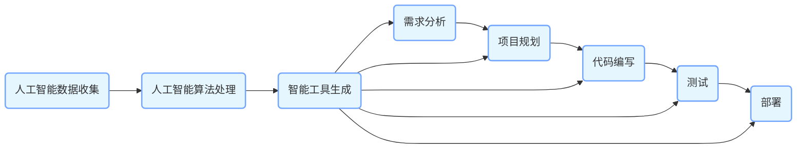

# 人工智能提升敏捷开发流程的策略

> 关键词：人工智能、敏捷开发流程、策略、自动化、效率提升

> 摘要：本文旨在探讨人工智能如何提升敏捷开发流程。随着软件开发行业的不断发展，敏捷开发因其快速响应变化、高效迭代的特点受到广泛关注。而人工智能技术的兴起，为进一步优化敏捷开发流程提供了新的思路和方法。文章将深入分析人工智能与敏捷开发的核心概念及联系，详细阐述相关算法原理和操作步骤，结合数学模型进行解释，通过项目实战展示具体应用，探讨实际应用场景，推荐相关工具和资源，最后总结未来发展趋势与挑战，为软件开发人员和相关从业者提供全面的参考和指导。

## 1. 背景介绍 
### 1.1 目的和范围
本文章的主要目的是深入研究人工智能在提升敏捷开发流程方面的策略和方法。随着科技的快速发展，软件开发领域面临着越来越高的要求，如更快的开发速度、更高的软件质量和更好的用户体验等。敏捷开发作为一种高效的软件开发方法，在应对这些挑战方面发挥了重要作用。而人工智能技术的不断进步，为敏捷开发带来了新的机遇。本文将涵盖人工智能在敏捷开发流程各个环节的应用，包括需求分析、项目规划、代码编写、测试和部署等，旨在为软件开发团队提供实用的策略和建议，以提高开发效率和软件质量。

### 1.2 预期读者
本文的预期读者包括软件开发人员、软件项目经理、敏捷开发教练、人工智能研究者以及对软件开发和人工智能技术感兴趣的相关人员。无论是初学者还是有一定经验的专业人士，都可以从本文中获取关于人工智能与敏捷开发相结合的有价值信息，帮助他们在实际工作中更好地应用这些技术和方法。

### 1.3 文档结构概述
本文将按照以下结构进行组织：首先介绍背景信息，包括目的、预期读者和文档结构概述；接着阐述人工智能与敏捷开发的核心概念及联系，通过文本示意图和 Mermaid 流程图进行清晰展示；然后详细讲解核心算法原理和具体操作步骤，并使用 Python 源代码进行说明；再介绍相关的数学模型和公式，并举例说明；通过项目实战展示代码实际案例和详细解释；探讨人工智能在敏捷开发中的实际应用场景；推荐相关的工具和资源，包括学习资源、开发工具框架和相关论文著作；最后总结未来发展趋势与挑战，提供附录常见问题与解答和扩展阅读及参考资料。

### 1.4 术语表
#### 1.4.1 核心术语定义
- **人工智能（Artificial Intelligence，AI）**：是研究、开发用于模拟、延伸和扩展人的智能的理论、方法、技术及应用系统的一门新的技术科学。它试图了解智能的实质，并生产出一种新的能以人类智能相似的方式做出反应的智能机器。
- **敏捷开发（Agile Development）**：是一种以人为核心、迭代、循序渐进的软件开发方法。它强调快速响应变化，通过短周期的迭代来交付软件，注重团队协作、客户反馈和持续改进。
- **自动化（Automation）**：指机器设备、系统或过程（生产、管理过程）在没有人或较少人的直接参与下，按照人的要求，经过自动检测、信息处理、分析判断、操纵控制，实现预期的目标的过程。

#### 1.4.2 相关概念解释
- **机器学习（Machine Learning，ML）**：是人工智能的一个分支，它致力于研究如何通过数据和算法让计算机自动学习和改进，而无需明确的编程指令。机器学习算法可以从大量的数据中发现模式和规律，并用于预测、分类等任务。
- **自然语言处理（Natural Language Processing，NLP）**：是人工智能的一个重要领域，它关注如何让计算机理解、处理和生成人类语言。自然语言处理技术可以应用于文本分析、情感分析、机器翻译等任务。
- **持续集成（Continuous Integration，CI）**：是敏捷开发中的一种实践，它要求开发团队频繁地将代码集成到共享代码库中，并通过自动化测试来确保代码的正确性和稳定性。

#### 1.4.3 缩略词列表
- **AI**：Artificial Intelligence（人工智能）
- **ML**：Machine Learning（机器学习）
- **NLP**：Natural Language Processing（自然语言处理）
- **CI**：Continuous Integration（持续集成）
- **CD**：Continuous Deployment（持续部署）

## 2. 核心概念与联系 

### 核心概念原理
#### 人工智能原理
人工智能是一门综合性的学科，它融合了计算机科学、数学、统计学、心理学等多个领域的知识。其核心原理是通过构建智能模型，让计算机模拟人类的智能行为，如学习、推理、决策等。人工智能的主要技术包括机器学习、深度学习、自然语言处理、计算机视觉等。

机器学习是人工智能的重要组成部分，它通过让计算机从数据中学习模式和规律，来实现对未知数据的预测和分类。深度学习是机器学习的一个分支，它通过构建深度神经网络，自动从大量数据中提取特征，从而实现更强大的学习能力。自然语言处理则致力于让计算机理解和处理人类语言，包括文本分类、情感分析、机器翻译等任务。

#### 敏捷开发原理
敏捷开发是一种以用户需求为导向，强调快速迭代和持续交付的软件开发方法。它的核心价值观包括个体和互动高于流程和工具、工作的软件高于详尽的文档、客户合作高于合同谈判、响应变化高于遵循计划。敏捷开发采用短周期的迭代方式，每个迭代都包含需求分析、设计、编码、测试和部署等环节，通过不断地反馈和改进，逐步交付满足用户需求的软件。

### 架构的文本示意图
人工智能与敏捷开发的结合可以构建一个智能敏捷开发架构，该架构主要包括以下几个层次：

- **数据层**：收集和存储与软件开发过程相关的数据，如需求文档、代码、测试结果、用户反馈等。这些数据是人工智能算法的基础，通过对数据的分析和挖掘，可以发现软件开发过程中的规律和问题。
- **算法层**：运用各种人工智能算法，如机器学习、自然语言处理等，对数据层的数据进行处理和分析。例如，使用机器学习算法对需求文档进行分类和优先级排序，使用自然语言处理技术对用户反馈进行情感分析。
- **工具层**：基于算法层的结果，开发各种智能工具，如智能需求管理工具、智能代码审查工具、智能测试工具等。这些工具可以集成到敏捷开发的各个环节中，提高开发效率和软件质量。
- **应用层**：将智能工具应用到敏捷开发的实际项目中，实现人工智能与敏捷开发的深度融合。例如，在需求分析阶段，使用智能需求管理工具帮助团队更好地理解用户需求；在代码编写阶段，使用智能代码审查工具自动检查代码质量；在测试阶段，使用智能测试工具自动生成测试用例和执行测试。

### Mermaid 流程图


该流程图展示了人工智能与敏捷开发的结合过程。首先，在敏捷开发的各个环节中收集相关数据，然后将这些数据输入到人工智能算法中进行处理，生成智能工具。这些智能工具再应用到敏捷开发的各个环节中，实现对敏捷开发流程的优化和提升。

## 3. 核心算法原理 & 具体操作步骤 

### 核心算法原理
#### 机器学习算法 - 决策树
决策树是一种常用的机器学习算法，它可以用于分类和回归任务。决策树的基本思想是通过对数据的特征进行划分，构建一个树形结构的模型。每个内部节点表示一个特征上的测试，每个分支表示一个测试输出，每个叶节点表示一个类别或值。

决策树的构建过程通常采用贪心算法，即每次选择一个最优的特征进行划分，使得划分后的数据集纯度最高。常用的纯度度量指标包括信息增益、信息增益率和基尼指数等。

#### 自然语言处理算法 - 词袋模型
词袋模型是一种简单而有效的自然语言处理算法，它将文本表示为一个词的集合，忽略词的顺序和语法结构。词袋模型的基本步骤包括：
1. **分词**：将文本分割成一个个单词或词组。
2. **构建词表**：统计所有文本中出现的词，构建一个词表。
3. **特征提取**：将每个文本表示为一个向量，向量的每个维度对应词表中的一个词，向量的值表示该词在文本中出现的频率。

### 具体操作步骤
#### 决策树算法的 Python 实现
```python
from sklearn.datasets import load_iris
from sklearn.model_selection import train_test_split
from sklearn.tree import DecisionTreeClassifier
from sklearn.metrics import accuracy_score

# 加载数据集
iris = load_iris()
X = iris.data
y = iris.target

# 划分训练集和测试集
X_train, X_test, y_train, y_test = train_test_split(X, y, test_size=0.3, random_state=42)

# 创建决策树分类器
clf = DecisionTreeClassifier()

# 训练模型
clf.fit(X_train, y_train)

# 预测
y_pred = clf.predict(X_test)

# 计算准确率
accuracy = accuracy_score(y_test, y_pred)
print(f"Accuracy: {accuracy}")
```
代码解释：
1. **加载数据集**：使用 `load_iris` 函数加载鸢尾花数据集。
2. **划分训练集和测试集**：使用 `train_test_split` 函数将数据集划分为训练集和测试集，测试集占比为 30%。
3. **创建决策树分类器**：使用 `DecisionTreeClassifier` 类创建一个决策树分类器。
4. **训练模型**：使用 `fit` 方法对模型进行训练。
5. **预测**：使用 `predict` 方法对测试集进行预测。
6. **计算准确率**：使用 `accuracy_score` 函数计算预测结果的准确率。

#### 词袋模型的 Python 实现
```python
from sklearn.feature_extraction.text import CountVectorizer

# 示例文本
corpus = [
    'This is the first document.',
    'This document is the second document.',
    'And this is the third one.',
    'Is this the first document?',
]

# 创建词袋模型
vectorizer = CountVectorizer()

# 提取特征
X = vectorizer.fit_transform(corpus)

# 查看词表
feature_names = vectorizer.get_feature_names_out()
print("Feature names:", feature_names)

# 查看特征矩阵
print("Feature matrix:")
print(X.toarray())
```
代码解释：
1. **示例文本**：定义一个包含多个文本的语料库。
2. **创建词袋模型**：使用 `CountVectorizer` 类创建一个词袋模型。
3. **提取特征**：使用 `fit_transform` 方法对语料库进行特征提取，得到特征矩阵。
4. **查看词表**：使用 `get_feature_names_out` 方法查看词表。
5. **查看特征矩阵**：使用 `toarray` 方法将特征矩阵转换为数组并打印。

## 4. 数学模型和公式 & 详细讲解 & 举例说明 

### 决策树的数学模型和公式
#### 信息熵
信息熵是一种衡量数据不确定性的指标，它的定义如下：
$$H(X) = -\sum_{i=1}^{n} p(x_i) \log_2 p(x_i)$$
其中，$X$ 是一个随机变量，$p(x_i)$ 是 $X$ 取值为 $x_i$ 的概率，$n$ 是 $X$ 可能取值的个数。

信息熵越大，说明数据的不确定性越大；信息熵越小，说明数据的纯度越高。

#### 信息增益
信息增益是在划分数据集前后信息熵的变化量，它的定义如下：
$$IG(D, A) = H(D) - \sum_{v \in Values(A)} \frac{|D_v|}{|D|} H(D_v)$$
其中，$D$ 是数据集，$A$ 是划分特征，$Values(A)$ 是特征 $A$ 的所有可能取值，$D_v$ 是特征 $A$ 取值为 $v$ 的子集，$|D|$ 和 $|D_v|$ 分别表示数据集 $D$ 和子集 $D_v$ 的样本数量。

信息增益越大，说明使用该特征进行划分可以获得更高的纯度提升。

#### 举例说明
假设有一个数据集 $D$ 包含 10 个样本，其中正类样本有 6 个，负类样本有 4 个。则数据集 $D$ 的信息熵为：
$$H(D) = -\frac{6}{10} \log_2 \frac{6}{10} - \frac{4}{10} \log_2 \frac{4}{10} \approx 0.971$$
现在考虑一个特征 $A$，它有两个取值 $a_1$ 和 $a_2$。根据特征 $A$ 进行划分后，得到两个子集 $D_1$ 和 $D_2$，其中 $D_1$ 包含 4 个样本，正类样本有 3 个，负类样本有 1 个；$D_2$ 包含 6 个样本，正类样本有 3 个，负类样本有 3 个。则子集 $D_1$ 和 $D_2$ 的信息熵分别为：
$$H(D_1) = -\frac{3}{4} \log_2 \frac{3}{4} - \frac{1}{4} \log_2 \frac{1}{4} \approx 0.811$$
$$H(D_2) = -\frac{3}{6} \log_2 \frac{3}{6} - \frac{3}{6} \log_2 \frac{3}{6} = 1$$
使用特征 $A$ 进行划分的信息增益为：
$$IG(D, A) = H(D) - \frac{4}{10} H(D_1) - \frac{6}{10} H(D_2) \approx 0.971 - \frac{4}{10} \times 0.811 - \frac{6}{10} \times 1 \approx 0.126$$

### 词袋模型的数学模型和公式
#### 词频（Term Frequency，TF）
词频是指一个词在文本中出现的频率，它的定义如下：
$$TF_{t,d} = \frac{n_{t,d}}{\sum_{t' \in d} n_{t',d}}$$
其中，$TF_{t,d}$ 是词 $t$ 在文本 $d$ 中的词频，$n_{t,d}$ 是词 $t$ 在文本 $d$ 中出现的次数，$\sum_{t' \in d} n_{t',d}$ 是文本 $d$ 中所有词出现的总次数。

#### 举例说明
假设有一个文本 $d$ 为 "This is a sample text. This text is for testing."，则词 "This" 在文本 $d$ 中的词频为：
$$TF_{This,d} = \frac{2}{8} = 0.25$$

## 5. 项目实战：代码实际案例和详细解释说明 

### 5.1  开发环境搭建
#### 安装 Python
首先，需要安装 Python 开发环境。可以从 Python 官方网站（https://www.python.org/downloads/） 下载适合自己操作系统的 Python 安装包，并按照安装向导进行安装。

#### 安装必要的库
在命令行中使用以下命令安装必要的库：
```sh
pip install scikit-learn pandas numpy
```
- **scikit-learn**：提供了丰富的机器学习算法和工具。
- **pandas**：用于数据处理和分析。
- **numpy**：用于科学计算。

### 5.2  源代码详细实现和代码解读
#### 需求优先级排序系统
以下是一个使用机器学习算法实现需求优先级排序的示例代码：
```python
import pandas as pd
from sklearn.model_selection import train_test_split
from sklearn.ensemble import RandomForestClassifier
from sklearn.metrics import accuracy_score

# 加载数据集
data = pd.read_csv('requirements.csv')

# 提取特征和标签
X = data.drop('priority', axis=1)
y = data['priority']

# 划分训练集和测试集
X_train, X_test, y_train, y_test = train_test_split(X, y, test_size=0.3, random_state=42)

# 创建随机森林分类器
clf = RandomForestClassifier()

# 训练模型
clf.fit(X_train, y_train)

# 预测
y_pred = clf.predict(X_test)

# 计算准确率
accuracy = accuracy_score(y_test, y_pred)
print(f"Accuracy: {accuracy}")
```
代码解读：
1. **加载数据集**：使用 `pandas` 库的 `read_csv` 函数加载需求数据集。
2. **提取特征和标签**：将数据集中的特征和标签分离，`priority` 列作为标签，其余列作为特征。
3. **划分训练集和测试集**：使用 `train_test_split` 函数将数据集划分为训练集和测试集，测试集占比为 30%。
4. **创建随机森林分类器**：使用 `RandomForestClassifier` 类创建一个随机森林分类器。
5. **训练模型**：使用 `fit` 方法对模型进行训练。
6. **预测**：使用 `predict` 方法对测试集进行预测。
7. **计算准确率**：使用 `accuracy_score` 函数计算预测结果的准确率。

#### 智能代码审查工具
以下是一个简单的智能代码审查工具的示例代码，使用正则表达式检查代码中是否存在特定的代码模式：
```python
import re

def code_review(code):
    # 检查是否存在硬编码的 IP 地址
    ip_pattern = r'\b(?:\d{1,3}\.){3}\d{1,3}\b'
    if re.search(ip_pattern, code):
        print("Warning: Hard-coded IP address found!")
    
    # 检查是否存在未使用的变量
    unused_variable_pattern = r'\b([a-zA-Z_][a-zA-Z0-9_]*)\s*=\s*.*(?!\1)'
    if re.search(unused_variable_pattern, code):
        print("Warning: Unused variable found!")

# 示例代码
code = 'ip = "192.168.1.1"; x = 10; y = 20'
code_review(code)
```
代码解读：
1. **定义代码审查函数**：`code_review` 函数接受一个代码字符串作为输入。
2. **检查硬编码的 IP 地址**：使用正则表达式 `ip_pattern` 检查代码中是否存在硬编码的 IP 地址。
3. **检查未使用的变量**：使用正则表达式 `unused_variable_pattern` 检查代码中是否存在未使用的变量。
4. **输出警告信息**：如果发现问题，打印相应的警告信息。

### 5.3  代码解读与分析
#### 需求优先级排序系统
- **优点**：使用随机森林分类器可以处理高维数据和非线性关系，具有较好的泛化能力和抗过拟合能力。通过对需求数据的学习，可以自动对需求进行优先级排序，提高需求管理的效率。
- **缺点**：模型的性能依赖于数据集的质量和特征的选择。如果数据集存在噪声或特征选择不当，可能会导致模型的准确率下降。

#### 智能代码审查工具
- **优点**：使用正则表达式可以快速检查代码中是否存在特定的代码模式，实现简单，易于扩展。可以帮助开发人员及时发现代码中的潜在问题，提高代码质量。
- **缺点**：正则表达式的表达能力有限，对于复杂的代码模式可能无法准确匹配。而且只能检查一些表面的问题，无法对代码的逻辑和语义进行深入分析。

## 6. 实际应用场景 
### 需求分析阶段
- **需求分类和优先级排序**：使用自然语言处理技术对需求文档进行分类和优先级排序。例如，通过对需求文本的关键词提取和语义分析，将需求分为功能需求、非功能需求等类别，并根据需求的重要性和紧急程度进行优先级排序，帮助团队更好地规划项目。
- **需求挖掘和补充**：利用人工智能算法分析用户的历史行为数据和反馈信息，挖掘潜在的需求。例如，通过分析用户在使用软件过程中的操作记录和错误报告，发现用户的痛点和需求，为需求分析提供更多的依据。

### 项目规划阶段
- **任务估算和资源分配**：使用机器学习算法对项目任务进行估算，预测任务的工作量和所需时间。例如，根据历史项目数据和任务特征，建立回归模型来估算任务的工作量。同时，根据任务的估算结果和团队成员的技能水平，进行合理的资源分配，提高项目的执行效率。
- **风险预测和应对**：通过对项目历史数据和相关因素的分析，使用人工智能算法预测项目可能面临的风险。例如，分析项目的进度、成本、质量等指标，预测项目是否会出现延期、超预算等风险，并提前制定应对措施。

### 代码编写阶段
- **代码自动补全和建议**：开发智能代码编辑器，利用机器学习算法根据上下文和代码历史，为开发人员提供代码自动补全和建议。例如，当开发人员输入部分代码时，编辑器可以根据代码的语法和语义，自动补全代码或提供相关的函数和类名建议，提高代码编写的效率。
- **代码质量检查和优化**：使用静态代码分析工具和机器学习算法对代码进行质量检查和优化。例如，检查代码中是否存在潜在的错误、代码风格是否符合规范等，并提供优化建议。同时，通过对代码的性能分析，找出性能瓶颈，提出优化方案。

### 测试阶段
- **测试用例自动生成**：利用人工智能算法根据软件的需求规格和代码结构，自动生成测试用例。例如，使用遗传算法和模拟退火算法等优化算法，生成覆盖度高、效率高的测试用例，提高测试的效率和质量。
- **缺陷预测和定位**：通过对代码的静态分析和运行时数据的挖掘，使用机器学习算法预测代码中可能存在的缺陷，并定位缺陷的位置。例如，分析代码的复杂度、变更频率等因素，预测代码中可能出现缺陷的模块和函数，帮助测试人员更快地发现和修复缺陷。

### 部署阶段
- **自动部署和配置**：使用自动化工具和人工智能算法实现软件的自动部署和配置。例如，根据不同的环境和需求，自动选择合适的部署方式和配置参数，实现软件的快速、可靠部署。
- **性能监控和优化**：在软件部署后，使用人工智能算法对软件的性能进行实时监控和优化。例如，分析系统的资源使用情况、响应时间等指标，自动调整系统的配置参数，提高软件的性能和稳定性。

## 7. 工具和资源推荐
### 7.1 学习资源推荐
#### 7.1.1 书籍推荐
- 《Python 机器学习》（Sebastian Raschka 著）：这本书详细介绍了 Python 中机器学习的基本概念、算法和实践应用，适合初学者入门。
- 《深度学习》（Ian Goodfellow、Yoshua Bengio 和 Aaron Courville 著）：深度学习领域的经典著作，全面介绍了深度学习的理论和实践，适合有一定基础的读者深入学习。
- 《敏捷软件开发：原则、模式与实践》（Robert C. Martin 著）：敏捷开发领域的权威书籍，详细介绍了敏捷开发的原则、模式和实践方法，是敏捷开发从业者的必读之书。

#### 7.1.2 在线课程
- Coursera 上的 “机器学习” 课程（Andrew Ng 教授）：这是一门非常经典的机器学习入门课程，由斯坦福大学的 Andrew Ng 教授授课，内容涵盖了机器学习的基本概念、算法和应用。
- edX 上的 “深度学习微硕士” 课程：这是一个系列课程，由多个知名高校的教授授课，深入介绍了深度学习的理论和实践，适合有一定基础的学习者。
- Udemy 上的 “敏捷开发实战” 课程：该课程通过实际项目案例，详细介绍了敏捷开发的流程和方法，帮助学习者快速掌握敏捷开发的实践技能。

#### 7.1.3 技术博客和网站
- Medium：这是一个技术博客平台，上面有很多关于人工智能、敏捷开发等领域的优质文章，可以帮助学习者了解最新的技术动态和实践经验。
- Towards Data Science：专注于数据科学和机器学习领域的技术博客，提供了很多高质量的文章和教程。
- Agile Alliance：敏捷开发领域的权威网站，提供了丰富的敏捷开发资源和实践案例。

### 7.2 开发工具框架推荐
#### 7.2.1 IDE和编辑器
- PyCharm：一款专门为 Python 开发设计的集成开发环境，具有代码自动补全、调试、版本控制等功能，适合 Python 开发人员使用。
- Visual Studio Code：一款轻量级的代码编辑器，支持多种编程语言，具有丰富的插件生态系统，可以根据需要安装各种插件来扩展功能。
- IntelliJ IDEA：一款功能强大的 Java 集成开发环境，也支持其他编程语言，提供了代码分析、调试、重构等功能，适合 Java 开发人员使用。

#### 7.2.2 调试和性能分析工具
- PDB：Python 自带的调试工具，可以帮助开发人员在代码中设置断点、查看变量值等，进行代码调试。
- Py-Spy：一款 Python 性能分析工具，可以实时分析 Python 程序的性能瓶颈，帮助开发人员优化代码。
- VisualVM：一款 Java 性能分析工具，可以监控 Java 程序的内存使用、线程状态等信息，帮助开发人员找出性能问题。

#### 7.2.3 相关框架和库
- Scikit-learn：Python 中常用的机器学习库，提供了丰富的机器学习算法和工具，如分类、回归、聚类等算法。
- TensorFlow：一个开源的深度学习框架，由 Google 开发，提供了高效的深度学习模型训练和部署工具。
- Django：一个 Python 的 Web 开发框架，采用了 MVC 架构，提供了快速开发 Web 应用的功能。

### 7.3 相关论文著作推荐
#### 7.3.1 经典论文
- “A Machine Learning Approach to Software Defect Prediction”：该论文介绍了使用机器学习算法进行软件缺陷预测的方法和实践，为软件测试和质量保证提供了新的思路。
- “Agile Software Development: The Business of Innovation”：这篇论文深入探讨了敏捷开发的商业价值和创新意义，对敏捷开发的理论和实践进行了系统的阐述。
- “Natural Language Processing for Software Engineering”：该论文介绍了自然语言处理技术在软件工程中的应用，如需求分析、代码注释生成等，为软件工程领域的智能化发展提供了理论支持。

#### 7.3.2 最新研究成果
- 关注顶级学术会议和期刊，如 ACM SIGSOFT International Symposium on Software Testing and Analysis (ISSTA)、IEEE Transactions on Software Engineering (TSE) 等，及时了解人工智能在敏捷开发领域的最新研究成果。
- 一些知名的研究机构和实验室，如斯坦福大学人工智能实验室、麻省理工学院计算机科学与人工智能实验室等，也会发布相关的研究论文和报告，可以关注他们的官方网站获取最新信息。

#### 7.3.3 应用案例分析
- 《Lean Enterprise: How High Performance Organizations Innovate at Scale》：这本书通过多个实际案例，介绍了大型企业如何应用敏捷开发和精益方法进行创新和转型，为企业的软件开发和管理提供了宝贵的经验。
- 《Agile Analytics: Turning Data into Value》：该书籍介绍了如何在敏捷开发过程中应用数据分析和人工智能技术，将数据转化为业务价值，提供了很多实际的应用案例和方法。

## 8. 总结：未来发展趋势与挑战
### 未来发展趋势
#### 智能化程度不断提高
随着人工智能技术的不断发展，未来敏捷开发流程将实现更高程度的智能化。例如，智能需求管理工具将能够自动理解用户需求的语义和意图，自动生成需求文档和用例；智能代码审查工具将能够对代码进行更深入的语义分析，自动发现代码中的逻辑错误和安全漏洞；智能测试工具将能够根据软件的实时运行状态自动调整测试策略，提高测试的覆盖率和效率。

#### 与其他技术深度融合
人工智能将与其他技术如区块链、物联网、云计算等深度融合，为敏捷开发带来更多的机遇和创新。例如，区块链技术可以为敏捷开发中的代码版本管理和知识产权保护提供更安全、可信的解决方案；物联网技术可以为软件开发提供更多的数据源，帮助开发人员更好地了解用户的需求和行为；云计算技术可以为人工智能算法的训练和运行提供强大的计算资源支持。

#### 跨领域应用不断拓展
人工智能在敏捷开发中的应用将不再局限于软件开发领域，而是逐渐拓展到其他领域，如医疗、金融、教育等。例如，在医疗领域，人工智能可以帮助医生快速分析病历数据，辅助诊断和治疗方案的制定；在金融领域，人工智能可以帮助银行进行风险评估和欺诈检测；在教育领域，人工智能可以实现个性化学习和智能辅导。

### 挑战
#### 数据质量和安全问题
人工智能算法的性能依赖于大量高质量的数据。在敏捷开发过程中，如何收集、整理和管理高质量的数据是一个挑战。同时，数据的安全和隐私问题也不容忽视。随着数据泄露事件的不断发生，如何保护用户数据的安全和隐私，防止数据被滥用和泄露，是人工智能在敏捷开发中应用需要解决的重要问题。

#### 技术人才短缺
人工智能和敏捷开发都是技术含量较高的领域，需要具备相关专业知识和技能的人才。目前，市场上既懂人工智能又懂敏捷开发的复合型人才短缺，这给企业的技术创新和发展带来了一定的困难。如何培养和吸引更多的技术人才，是企业面临的一个重要挑战。

#### 伦理和法律问题
随着人工智能技术的广泛应用，伦理和法律问题也日益凸显。例如，人工智能算法的决策过程往往是不透明的，如何确保算法的公正性和可解释性是一个需要解决的问题。同时，人工智能在某些领域的应用可能会对人类的就业和社会结构产生影响，如何制定相应的伦理和法律规范，引导人工智能技术的健康发展，是一个重要的课题。

## 9. 附录：常见问题与解答
### 人工智能在敏捷开发中应用的成本高吗？
人工智能在敏捷开发中的应用成本因具体的应用场景和技术实现方式而异。一般来说，初期的技术研发和数据收集、整理需要一定的成本投入。但是，从长期来看，人工智能的应用可以提高开发效率、降低人力成本、提高软件质量，从而带来更高的收益。而且，随着技术的不断发展和成熟，人工智能的应用成本也在逐渐降低。

### 人工智能会取代人类开发者吗？
人工智能不会取代人类开发者。虽然人工智能可以在某些方面辅助开发者完成一些任务，如代码自动补全、缺陷预测等，但软件开发过程中还需要人类开发者的创造力、判断力和沟通能力。例如，需求分析需要深入了解用户的需求和业务逻辑，这需要人类开发者与用户进行充分的沟通和交流；软件设计需要考虑系统的架构、性能、可维护性等多个方面，这需要人类开发者的专业知识和经验。人工智能只是作为一种工具，帮助人类开发者提高工作效率和质量。

### 如何确保人工智能算法的准确性和可靠性？
为了确保人工智能算法的准确性和可靠性，可以采取以下措施：
1. **数据质量控制**：收集和整理高质量的数据，对数据进行清洗、预处理和标注，确保数据的准确性和一致性。
2. **模型选择和优化**：根据具体的应用场景和问题，选择合适的人工智能算法和模型，并对模型进行优化和调参，提高模型的性能。
3. **交叉验证和评估**：使用交叉验证和评估指标对模型进行评估，确保模型在不同数据集上的泛化能力和稳定性。
4. **监控和更新**：在模型的运行过程中，对模型的性能进行实时监控，及时发现问题并进行更新和优化。

### 人工智能在敏捷开发中的应用需要哪些技术基础？
人工智能在敏捷开发中的应用需要以下技术基础：
1. **编程语言**：掌握至少一种编程语言，如 Python、Java 等，用于实现人工智能算法和开发相关工具。
2. **机器学习和深度学习**：了解机器学习和深度学习的基本概念、算法和模型，如决策树、神经网络、卷积神经网络等。
3. **自然语言处理**：掌握自然语言处理的基本技术，如分词、词性标注、命名实体识别、文本分类等。
4. **软件开发和敏捷方法**：熟悉软件开发的基本流程和方法，了解敏捷开发的原则、模式和实践。

## 10. 扩展阅读 & 参考资料
### 扩展阅读
- 《人工智能简史》：这本书介绍了人工智能的发展历程、主要技术和应用领域，帮助读者全面了解人工智能的发展脉络。
- 《软件研发效能权威指南》：深入探讨了软件研发效能的提升方法和实践，结合人工智能等新技术，为软件开发团队提供了实用的指导。
- 《创新者的窘境》：这本书探讨了企业在面对技术变革时的创新困境和应对策略，对人工智能在敏捷开发中的应用和企业的创新发展具有一定的启示作用。

### 参考资料
1. 相关学术论文和研究报告，如 ACM、IEEE 等学术组织发表的关于人工智能和敏捷开发的论文。
2. 技术博客和网站，如 Medium、Towards Data Science、Agile Alliance 等提供的相关文章和教程。
3. 书籍和教材，如《Python 机器学习》、《深度学习》、《敏捷软件开发：原则、模式与实践》等。
4. 开源项目和代码库，如 GitHub 上的相关项目，可参考其实现思路和代码示例。