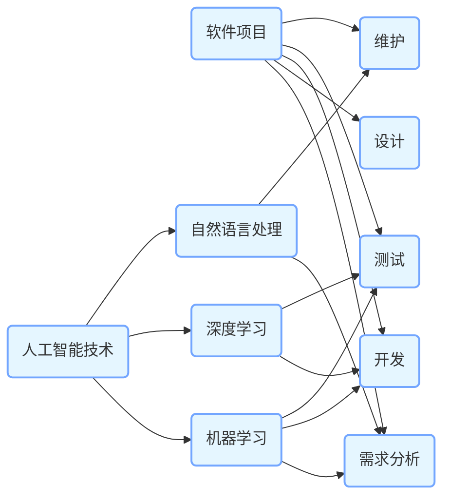

# 人工智能提升软件项目创新方法的策略

> 关键词：人工智能、软件项目、创新方法、策略、技术融合

> 摘要：本文聚焦于人工智能提升软件项目创新方法的策略，全面深入地探讨了人工智能在软件项目领域的应用。首先介绍了相关背景，包括目的范围、预期读者等内容；接着阐述了人工智能与软件项目创新的核心概念及联系；详细讲解了核心算法原理和具体操作步骤，并用数学模型和公式进行了理论支撑；通过项目实战案例展示了人工智能在软件项目中的实际应用；分析了其实际应用场景；推荐了学习、开发工具和相关论文著作等资源；最后总结了未来发展趋势与挑战，解答了常见问题并给出扩展阅读和参考资料，旨在为软件项目创新提供全面且具有实践指导意义的策略。

## 1. 背景介绍 
### 1.1 目的和范围
本文章的目的在于深入研究如何利用人工智能技术来提升软件项目的创新能力。随着信息技术的飞速发展，软件项目在各个领域的应用越来越广泛，市场对软件的创新性和质量要求也日益提高。人工智能作为当前科技领域的前沿技术，具有强大的数据处理、学习和决策能力，将其与软件项目相结合，有望为软件项目带来新的创新思路和方法。

本文的范围涵盖了人工智能在软件项目从需求分析、设计、开发到测试和维护等各个阶段的应用策略。同时，也探讨了人工智能技术在提升软件项目的用户体验、功能实现、性能优化等方面的创新方法。

### 1.2 预期读者
本文预期读者包括软件开发者、软件架构师、项目经理、人工智能研究人员以及对软件项目创新和人工智能应用感兴趣的技术爱好者。对于软件开发者和架构师，本文可以提供具体的技术实现思路和创新方法；对于项目经理，有助于其在项目管理中更好地应用人工智能技术来提升项目的创新性和竞争力；对于人工智能研究人员，可以启发其在软件项目领域的研究方向；对于技术爱好者，则可以拓宽其对人工智能和软件项目结合的认知视野。

### 1.3 文档结构概述
本文首先介绍相关背景知识，让读者对文章的目的、范围、预期读者等有清晰的了解。接着阐述人工智能与软件项目创新的核心概念及联系，通过文本示意图和 Mermaid 流程图帮助读者理解。然后详细讲解核心算法原理和具体操作步骤，并用数学模型和公式进行理论支撑。通过项目实战案例展示人工智能在软件项目中的实际应用，包括开发环境搭建、源代码实现和代码解读。分析人工智能在软件项目中的实际应用场景，推荐学习、开发工具和相关论文著作等资源。最后总结未来发展趋势与挑战，解答常见问题并给出扩展阅读和参考资料。

### 1.4 术语表
#### 1.4.1 核心术语定义
- **人工智能（Artificial Intelligence）**：指计算机系统能够执行通常需要人类智能才能完成的任务，如学习、推理、问题解决、感知和语言理解等。
- **软件项目（Software Project）**：指为了创建、开发、维护和管理软件系统而进行的一系列有组织的活动。
- **创新方法（Innovation Method）**：指能够产生新的想法、产品、服务或流程的方法和技术。

#### 1.4.2 相关概念解释
- **机器学习（Machine Learning）**：是人工智能的一个分支，它使计算机系统能够通过数据学习模式和规律，而无需明确的编程指令。
- **深度学习（Deep Learning）**：是机器学习的一种特殊形式，它使用多层神经网络来学习数据的复杂表示和模式。
- **自然语言处理（Natural Language Processing）**：是人工智能的一个领域，它使计算机能够理解、处理和生成人类语言。

#### 1.4.3 缩略词列表
- **AI**：Artificial Intelligence（人工智能）
- **ML**：Machine Learning（机器学习）
- **DL**：Deep Learning（深度学习）
- **NLP**：Natural Language Processing（自然语言处理）

## 2. 核心概念与联系 

### 核心概念原理
人工智能是让计算机模拟人类智能的技术，它基于大量的数据和复杂的算法，使计算机能够学习、推理和做出决策。在软件项目中，人工智能可以应用于多个方面，例如通过机器学习算法对用户行为数据进行分析，以实现个性化推荐；利用自然语言处理技术实现智能客服等。

软件项目创新则是指在软件的开发、设计和维护过程中引入新的理念、方法和技术，以提高软件的质量、功能和用户体验。创新的软件项目能够更好地满足用户需求，提高市场竞争力。

人工智能与软件项目创新之间存在着紧密的联系。人工智能技术为软件项目创新提供了新的工具和方法，例如通过人工智能算法可以自动生成代码、优化软件性能等。同时，软件项目的创新需求也推动了人工智能技术的发展，例如为了实现更智能的软件功能，需要不断改进人工智能算法。

### 架构的文本示意图
人工智能与软件项目创新的架构可以描述为：以人工智能技术为核心，包括机器学习、深度学习、自然语言处理等子技术。这些技术通过数据接口与软件项目的各个环节进行交互，如需求分析、设计、开发、测试和维护。在需求分析阶段，利用自然语言处理技术理解用户需求；在开发阶段，使用机器学习算法生成代码或优化算法；在测试阶段，通过人工智能进行自动化测试等。

### Mermaid 流程图


## 3. 核心算法原理 & 具体操作步骤 

### 核心算法原理
#### 机器学习算法 - 线性回归
线性回归是一种简单而常用的机器学习算法，用于预测连续值。其基本原理是通过找到一条直线（在多维空间中是超平面），使得数据点到该直线的距离之和最小。

线性回归的数学模型可以表示为：
$$y = \theta_0 + \theta_1x_1 + \theta_2x_2 + \cdots + \theta_nx_n$$
其中，$y$ 是预测值，$x_1, x_2, \cdots, x_n$ 是输入特征，$\theta_0, \theta_1, \cdots, \theta_n$ 是模型的参数。

#### 深度学习算法 - 卷积神经网络（CNN）
卷积神经网络是一种专门用于处理具有网格结构数据（如图像）的深度学习算法。它通过卷积层、池化层和全连接层等组件，自动提取数据的特征。

卷积层通过卷积核在输入数据上滑动，进行卷积操作，提取局部特征。池化层则用于降低数据的维度，减少计算量。全连接层将提取的特征映射到最终的输出类别。

### 具体操作步骤
#### 线性回归的 Python 实现
```python
import numpy as np
from sklearn.linear_model import LinearRegression
from sklearn.model_selection import train_test_split
from sklearn.metrics import mean_squared_error

# 生成示例数据
np.random.seed(0)
X = np.random.rand(100, 1)
y = 2 * X + 1 + 0.5 * np.random.randn(100, 1)

# 划分训练集和测试集
X_train, X_test, y_train, y_test = train_test_split(X, y, test_size=0.2, random_state=42)

# 创建线性回归模型
model = LinearRegression()

# 训练模型
model.fit(X_train, y_train)

# 进行预测
y_pred = model.predict(X_test)

# 计算均方误差
mse = mean_squared_error(y_test, y_pred)
print(f"均方误差: {mse}")
```
#### 卷积神经网络（CNN）的 Python 实现
```python
import tensorflow as tf
from tensorflow.keras import layers, models
from tensorflow.keras.datasets import mnist
from tensorflow.keras.utils import to_categorical

# 加载 MNIST 数据集
(train_images, train_labels), (test_images, test_labels) = mnist.load_data()

# 数据预处理
train_images = train_images.reshape((60000, 28, 28, 1)).astype('float32') / 255
test_images = test_images.reshape((10000, 28, 28, 1)).astype('float32') / 255

train_labels = to_categorical(train_labels)
test_labels = to_categorical(test_labels)

# 构建 CNN 模型
model = models.Sequential()
model.add(layers.Conv2D(32, (3, 3), activation='relu', input_shape=(28, 28, 1)))
model.add(layers.MaxPooling2D((2, 2)))
model.add(layers.Conv2D(64, (3, 3), activation='relu'))
model.add(layers.MaxPooling2D((2, 2)))
model.add(layers.Flatten())
model.add(layers.Dense(64, activation='relu'))
model.add(layers.Dense(10, activation='softmax'))

# 编译模型
model.compile(optimizer='adam',
              loss='categorical_crossentropy',
              metrics=['accuracy'])

# 训练模型
model.fit(train_images, train_labels, epochs=5, batch_size=64)

# 评估模型
test_loss, test_acc = model.evaluate(test_images, test_labels)
print(f"测试准确率: {test_acc}")
```

## 4. 数学模型和公式 & 详细讲解 & 举例说明 

### 线性回归的数学模型和公式
线性回归的目标是找到一组参数 $\theta = [\theta_0, \theta_1, \cdots, \theta_n]$，使得预测值 $y$ 与真实值 $\hat{y}$ 之间的误差最小。通常使用均方误差（MSE）作为损失函数：
$$MSE = \frac{1}{m} \sum_{i=1}^{m} (y^{(i)} - \hat{y}^{(i)})^2$$
其中，$m$ 是样本数量，$y^{(i)}$ 是第 $i$ 个样本的真实值，$\hat{y}^{(i)}$ 是第 $i$ 个样本的预测值。

为了找到最优的参数 $\theta$，可以使用梯度下降法。梯度下降法的更新公式为：
$$\theta_j := \theta_j - \alpha \frac{\partial}{\partial \theta_j} MSE(\theta)$$
其中，$\alpha$ 是学习率，控制参数更新的步长。

### 举例说明
假设我们有一组数据 $(x_1, y_1), (x_2, y_2), \cdots, (x_m, y_m)$，我们想要用线性回归模型来拟合这些数据。

首先，我们定义线性回归模型：
$$y = \theta_0 + \theta_1x$$

然后，计算均方误差：
$$MSE = \frac{1}{m} \sum_{i=1}^{m} (y^{(i)} - (\theta_0 + \theta_1x^{(i)}))^2$$

接着，使用梯度下降法更新参数 $\theta_0$ 和 $\theta_1$：
$$\frac{\partial}{\partial \theta_0} MSE = \frac{2}{m} \sum_{i=1}^{m} (y^{(i)} - (\theta_0 + \theta_1x^{(i)})) (-1)$$
$$\frac{\partial}{\partial \theta_1} MSE = \frac{2}{m} \sum_{i=1}^{m} (y^{(i)} - (\theta_0 + \theta_1x^{(i)})) (-x^{(i)})$$

不断迭代更新 $\theta_0$ 和 $\theta_1$，直到收敛。

### 卷积神经网络的数学模型和公式
卷积神经网络中的卷积操作可以表示为：
$$y_{ij} = \sum_{m=0}^{M-1} \sum_{n=0}^{N-1} x_{i+m, j+n} w_{mn} + b$$
其中，$x$ 是输入数据，$w$ 是卷积核，$b$ 是偏置，$y$ 是卷积后的输出。

池化操作通常是取局部区域的最大值或平均值，例如最大池化：
$$y_{ij} = \max_{m,n \in R_{ij}} x_{mn}$$
其中，$R_{ij}$ 是第 $(i, j)$ 个池化区域。

## 5. 项目实战：代码实际案例和详细解释说明 

### 5.1  开发环境搭建
#### 安装 Python
首先，需要安装 Python 环境。可以从 Python 官方网站（https://www.python.org/downloads/）下载适合自己操作系统的 Python 安装包，并按照安装向导进行安装。

#### 安装深度学习框架
本文使用 TensorFlow 作为深度学习框架，可以使用以下命令进行安装：
```sh
pip install tensorflow
```

#### 安装其他依赖库
还需要安装一些其他的依赖库，如 NumPy、Scikit-learn 等，可以使用以下命令进行安装：
```sh
pip install numpy scikit-learn
```

### 5.2  源代码详细实现和代码解读
#### 项目需求
我们要实现一个基于人工智能的图像分类软件项目，使用卷积神经网络对图像进行分类。

#### 源代码实现
```python
import tensorflow as tf
from tensorflow.keras import layers, models
from tensorflow.keras.datasets import cifar10
from tensorflow.keras.utils import to_categorical

# 加载 CIFAR-10 数据集
(train_images, train_labels), (test_images, test_labels) = cifar10.load_data()

# 数据预处理
train_images = train_images.astype('float32') / 255
test_images = test_images.astype('float32') / 255

train_labels = to_categorical(train_labels)
test_labels = to_categorical(test_labels)

# 构建 CNN 模型
model = models.Sequential()
model.add(layers.Conv2D(32, (3, 3), activation='relu', input_shape=(32, 32, 3)))
model.add(layers.MaxPooling2D((2, 2)))
model.add(layers.Conv2D(64, (3, 3), activation='relu'))
model.add(layers.MaxPooling2D((2, 2)))
model.add(layers.Conv2D(64, (3, 3), activation='relu'))
model.add(layers.Flatten())
model.add(layers.Dense(64, activation='relu'))
model.add(layers.Dense(10, activation='softmax'))

# 编译模型
model.compile(optimizer='adam',
              loss='categorical_crossentropy',
              metrics=['accuracy'])

# 训练模型
model.fit(train_images, train_labels, epochs=10, batch_size=64)

# 评估模型
test_loss, test_acc = model.evaluate(test_images, test_labels)
print(f"测试准确率: {test_acc}")
```

#### 代码解读
1. **数据加载和预处理**：使用 `cifar10.load_data()` 加载 CIFAR-10 数据集，将图像数据归一化到 $[0, 1]$ 范围，并将标签进行 one-hot 编码。
2. **模型构建**：使用 `Sequential` 模型构建卷积神经网络，包括卷积层、池化层、全连接层等。
3. **模型编译**：使用 `adam` 优化器，`categorical_crossentropy` 损失函数，`accuracy` 作为评估指标。
4. **模型训练**：使用 `fit` 方法对模型进行训练，指定训练数据、训练轮数和批次大小。
5. **模型评估**：使用 `evaluate` 方法对模型进行评估，输出测试损失和测试准确率。

### 5.3  代码解读与分析
#### 模型结构分析
该卷积神经网络包含多个卷积层和池化层，用于提取图像的特征。卷积层通过卷积核提取局部特征，池化层用于降低数据的维度，减少计算量。全连接层将提取的特征映射到最终的输出类别。

#### 训练过程分析
在训练过程中，模型通过不断调整参数，使得损失函数逐渐减小，准确率逐渐提高。训练轮数和批次大小是影响训练效果的重要参数，需要根据具体情况进行调整。

#### 评估结果分析
测试准确率反映了模型在测试数据上的性能。如果测试准确率较低，可能是模型过拟合或欠拟合，需要对模型进行调整，如增加正则化项、调整模型结构等。

## 6. 实际应用场景 
### 智能客服系统
在软件项目中，智能客服系统可以利用自然语言处理技术理解用户的问题，并给出相应的回答。通过机器学习算法对用户问题进行分类和分析，不断优化客服系统的回答策略，提高用户满意度。

### 个性化推荐系统
许多软件应用都有个性化推荐功能，如电商平台的商品推荐、视频平台的视频推荐等。利用人工智能算法对用户的行为数据进行分析，如浏览历史、购买记录等，为用户提供个性化的推荐内容，提高用户的参与度和转化率。

### 代码自动生成
在软件开发过程中，人工智能可以根据需求描述自动生成代码。例如，使用深度学习模型学习大量的代码模式和结构，根据输入的需求生成相应的代码框架和实现细节，提高开发效率。

### 软件测试自动化
人工智能可以用于软件测试自动化。通过机器学习算法分析软件的历史测试数据，生成测试用例，自动执行测试任务，并对测试结果进行分析和反馈，提高测试效率和质量。

## 7. 工具和资源推荐
### 7.1 学习资源推荐
#### 7.1.1 书籍推荐
- 《Python 机器学习》：详细介绍了 Python 在机器学习中的应用，包括各种机器学习算法的原理和实现。
- 《深度学习》：由深度学习领域的三位顶尖专家编写，是深度学习领域的经典教材。
- 《人工智能：一种现代的方法》：全面介绍了人工智能的各个领域，包括搜索算法、知识表示、机器学习等。

#### 7.1.2 在线课程
- Coursera 上的“机器学习”课程：由 Andrew Ng 教授授课，是机器学习领域的经典在线课程。
- edX 上的“深度学习”课程：由深度学习领域的专家授课，深入介绍了深度学习的原理和应用。
- 哔哩哔哩上的“Python 人工智能教程”：适合初学者学习 Python 和人工智能相关知识。

#### 7.1.3 技术博客和网站
- Medium：上面有许多人工智能和机器学习领域的优秀博客文章。
- arXiv：提供了大量的学术论文，包括人工智能领域的最新研究成果。
- 开源中国：有许多关于软件项目开发和人工智能应用的技术文章。

### 7.2 开发工具框架推荐
#### 7.2.1 IDE和编辑器
- PyCharm：是一款专门用于 Python 开发的集成开发环境，功能强大，支持代码调试、自动补全、版本控制等功能。
- Visual Studio Code：是一款轻量级的代码编辑器，支持多种编程语言，有丰富的插件扩展功能。

#### 7.2.2 调试和性能分析工具
- TensorBoard：是 TensorFlow 提供的可视化工具，可以用于查看模型的训练过程、损失函数变化、参数分布等信息。
- Py-Spy：是一个用于 Python 代码性能分析的工具，可以帮助开发者找出代码中的性能瓶颈。

#### 7.2.3 相关框架和库
- TensorFlow：是一个开源的深度学习框架，提供了丰富的工具和接口，支持多种深度学习模型的开发和训练。
- PyTorch：是另一个流行的深度学习框架，具有动态图的特点，适合快速迭代和实验。
- Scikit-learn：是一个用于机器学习的 Python 库，提供了各种机器学习算法和工具，方便开发者进行数据处理、模型选择和评估等工作。

### 7.3 相关论文著作推荐
#### 7.3.1 经典论文
- “Gradient-Based Learning Applied to Document Recognition”：介绍了卷积神经网络在手写字符识别中的应用，是卷积神经网络领域的经典论文。
- “ImageNet Classification with Deep Convolutional Neural Networks”：介绍了 AlexNet 模型，开创了深度学习在图像分类领域的先河。

#### 7.3.2 最新研究成果
- 关注 arXiv 上关于人工智能和软件项目的最新论文，了解该领域的最新研究动态。

#### 7.3.3 应用案例分析
- 可以在 ACM、IEEE 等学术数据库中查找关于人工智能在软件项目中应用的案例分析论文，学习实际应用中的经验和方法。

## 8. 总结：未来发展趋势与挑战
### 未来发展趋势
- **更加智能化的软件**：随着人工智能技术的不断发展，软件将变得更加智能化，能够自动学习和适应用户的需求，提供更加个性化的服务。
- **跨领域融合**：人工智能将与其他领域如物联网、大数据等深度融合，创造出更多创新的软件应用场景。
- **自动化开发流程**：人工智能将在软件项目的开发流程中发挥更大的作用，实现代码自动生成、测试自动化等，提高开发效率和质量。

### 挑战
- **数据隐私和安全**：人工智能需要大量的数据进行训练，如何保护用户的数据隐私和安全是一个重要的挑战。
- **算法可解释性**：许多人工智能算法是黑盒模型，难以解释其决策过程，这在一些关键领域如医疗、金融等应用中存在风险。
- **人才短缺**：人工智能和软件项目创新需要具备多领域知识的复合型人才，目前这类人才短缺，限制了技术的发展和应用。

## 9. 附录：常见问题与解答
### 问题 1：人工智能在软件项目中应用的成本高吗？
解答：人工智能在软件项目中的应用成本因具体情况而异。一方面，需要投入一定的计算资源进行模型训练，可能会产生较高的硬件成本；另一方面，需要专业的人才进行算法开发和模型调优，人力成本也较高。但是，随着技术的发展和云计算的普及，计算资源的成本逐渐降低，同时开源的人工智能框架和工具也可以降低开发成本。

### 问题 2：如何选择适合软件项目的人工智能算法？
解答：选择适合软件项目的人工智能算法需要考虑多个因素，如项目的需求、数据的特点、算法的复杂度和性能等。例如，如果是处理图像数据，可以选择卷积神经网络；如果是处理文本数据，可以选择自然语言处理算法。同时，还可以通过实验和比较不同算法的性能，选择最适合的算法。

### 问题 3：人工智能模型的训练时间长怎么办？
解答：如果人工智能模型的训练时间长，可以采取以下措施：
- 优化模型结构，减少模型的复杂度。
- 使用更强大的计算资源，如 GPU 或云计算平台。
- 采用增量训练或迁移学习的方法，利用已有的模型进行训练，减少训练时间。

## 10. 扩展阅读 & 参考资料
### 扩展阅读
- 《智能时代》：介绍了人工智能对社会和经济的影响，以及未来的发展趋势。
- 《第四次工业革命》：探讨了人工智能、物联网等新兴技术对工业和社会的变革。

### 参考资料
- 《Python 机器学习实战》
- 《深度学习实战》
- 相关学术论文和技术报告

以上就是关于人工智能提升软件项目创新方法的策略的详细介绍，希望对读者有所帮助。通过不断学习和实践，我们可以更好地应用人工智能技术，推动软件项目的创新发展。