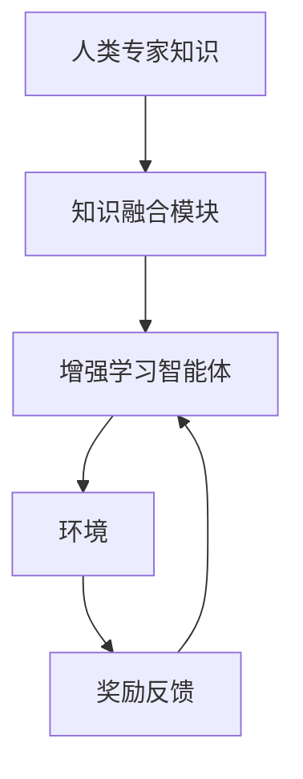

# 人机协作增强学习:结合人类专家知识

> 关键词：人机协作、增强学习、人类专家知识、知识融合、智能决策

> 摘要：本文聚焦于人机协作增强学习中结合人类专家知识这一关键主题。首先介绍了该研究领域的背景，包括目的、预期读者、文档结构和相关术语。接着阐述了核心概念，分析了人机协作增强学习结合人类专家知识的原理和架构，并给出了相应的文本示意图和 Mermaid 流程图。详细讲解了核心算法原理，通过 Python 代码进行说明，同时介绍了相关的数学模型和公式。在项目实战部分，给出了开发环境搭建步骤、源代码实现及解读。探讨了实际应用场景，推荐了学习资源、开发工具框架和相关论文著作。最后总结了未来发展趋势与挑战，还提供了常见问题解答和扩展阅读参考资料，旨在为研究者和开发者提供全面且深入的技术指导。

## 1. 背景介绍 

### 1.1 目的和范围
在当今人工智能快速发展的时代，增强学习作为一种重要的机器学习方法，在许多领域取得了显著的成果。然而，单纯的增强学习算法在面对复杂任务时，往往需要大量的试错和训练时间，效率较低。人类专家在特定领域积累了丰富的知识和经验，将人类专家知识与增强学习相结合，通过人机协作的方式，可以有效提高学习效率，加速智能体的决策过程，使智能体能够更快地适应复杂环境。本文的目的就是深入探讨如何在人机协作增强学习中有效地结合人类专家知识，涵盖了相关概念、算法原理、实际应用等多个方面，旨在为研究者和开发者提供全面的技术参考。

### 1.2 预期读者
本文预期读者主要包括人工智能领域的研究者、机器学习工程师、对人机协作和增强学习感兴趣的技术爱好者。对于正在进行相关研究的学者，本文可以提供新的思路和研究方向；对于工程师而言，有助于他们在实际项目中应用人机协作增强学习技术；对于技术爱好者，能够帮助他们了解该领域的前沿知识和技术原理。

### 1.3 文档结构概述
本文将按照以下结构进行组织：首先介绍人机协作增强学习结合人类专家知识的背景信息，包括目的、预期读者和文档结构等。接着阐述核心概念，分析其原理和架构，并给出相应的示意图和流程图。然后详细讲解核心算法原理，通过 Python 代码进行具体说明，同时介绍相关的数学模型和公式。在项目实战部分，将给出开发环境搭建步骤、源代码实现及详细解读。之后探讨实际应用场景，推荐学习资源、开发工具框架和相关论文著作。最后总结未来发展趋势与挑战，提供常见问题解答和扩展阅读参考资料。

### 1.4 术语表

#### 1.4.1 核心术语定义
- **人机协作增强学习**：是一种将人类与智能体相结合的学习模式，人类通过与智能体的交互，为智能体提供指导和反馈，智能体利用增强学习算法进行学习和决策，从而实现更高效的学习和任务执行。
- **人类专家知识**：指在特定领域中，人类专家通过长期实践和学习积累的经验、规则和策略等知识。
- **增强学习**：是一种通过智能体与环境进行交互，根据环境反馈的奖励信号来学习最优策略的机器学习方法。
- **智能体**：是在环境中执行动作并接收环境反馈的实体，通过学习不断优化自己的行为策略。

#### 1.4.2 相关概念解释
- **知识融合**：将人类专家知识与增强学习算法中的知识进行整合，使智能体能够同时利用两种知识进行决策。
- **奖励塑造**：根据人类专家知识对增强学习中的奖励函数进行调整，引导智能体更快地学习到最优策略。
- **策略引导**：人类专家通过直接给出策略建议或示范，帮助智能体更快地收敛到最优策略。

#### 1.4.3 缩略词列表
- **RL**：Reinforcement Learning，增强学习
- **AI**：Artificial Intelligence，人工智能
- **MDP**：Markov Decision Process，马尔可夫决策过程

## 2. 核心概念与联系 

### 核心概念原理
人机协作增强学习结合人类专家知识的核心原理在于充分发挥人类和智能体各自的优势。人类专家在特定领域具有丰富的先验知识和直觉判断能力，能够快速识别问题的关键和提供有效的解决方案。而增强学习算法具有强大的自主学习能力，能够在与环境的交互中不断优化策略。通过人机协作，人类专家可以将自己的知识以合适的方式融入到增强学习过程中，帮助智能体更快地学习到最优策略，减少不必要的试错。

例如，在医疗诊断领域，人类医生具有丰富的临床经验和专业知识，能够根据患者的症状和检查结果做出准确的诊断。而智能体可以通过增强学习算法在大量的医疗数据中学习疾病的诊断模式。通过人机协作，医生可以为智能体提供一些关键的诊断规则和经验，帮助智能体更快地学习到准确的诊断策略。

### 架构的文本示意图
```plaintext
+-------------------+
|   人类专家知识   |
+-------------------+
         |
         v
+-------------------+
|   知识融合模块   |
+-------------------+
         |
         v
+-------------------+
|  增强学习智能体  |
+-------------------+
         |
         v
+-------------------+
|      环境        |
+-------------------+
```
在这个架构中，人类专家知识首先进入知识融合模块。知识融合模块的作用是将人类专家知识与智能体已有的知识进行整合，形成一个新的知识体系。然后，增强学习智能体利用这个新的知识体系与环境进行交互，通过不断地尝试和学习，优化自己的策略。环境会根据智能体的动作给出相应的反馈，这个反馈又会影响智能体的学习过程。

### Mermaid 流程图

这个流程图展示了人机协作增强学习结合人类专家知识的基本流程。人类专家知识进入知识融合模块后，与智能体的知识进行融合。智能体根据融合后的知识与环境进行交互，环境会根据智能体的动作给出奖励反馈。智能体利用这个奖励反馈来更新自己的策略，从而不断优化学习过程。

## 3. 核心算法原理 & 具体操作步骤 

### 核心算法原理
在人机协作增强学习中，结合人类专家知识的核心算法通常基于增强学习的基本框架，如马尔可夫决策过程（MDP）。MDP 可以用一个四元组 $(S, A, P, R)$ 来表示，其中 $S$ 是状态集合，$A$ 是动作集合，$P$ 是状态转移概率，$R$ 是奖励函数。

智能体的目标是找到一个最优策略 $\pi^*: S \rightarrow A$，使得在每个状态 $s \in S$ 下，选择的动作 $a = \pi^*(s)$ 能够最大化长期累积奖励。

结合人类专家知识的主要方式有两种：奖励塑造和策略引导。

#### 奖励塑造
奖励塑造是根据人类专家知识对奖励函数进行调整。例如，人类专家知道在某个状态下采取某个动作是更优的，那么可以在奖励函数中对这个动作给予更高的奖励。假设原始奖励函数为 $R(s, a)$，经过奖励塑造后的奖励函数为 $R'(s, a) = R(s, a) + \alpha \cdot H(s, a)$，其中 $\alpha$ 是一个权重系数，$H(s, a)$ 是根据人类专家知识定义的额外奖励。

#### 策略引导
策略引导是人类专家直接给出策略建议或示范。智能体可以将这些建议或示范作为先验知识，在学习过程中优先考虑。例如，人类专家可以在某些关键状态下给出最优动作，智能体在遇到这些状态时直接采取专家建议的动作。

### 具体操作步骤及 Python 代码实现

#### 步骤 1：定义环境和智能体
```python
import numpy as np

# 定义一个简单的环境
class SimpleEnv:
    def __init__(self):
        self.state = 0
        self.num_states = 5
        self.num_actions = 2

    def reset(self):
        self.state = 0
        return self.state

    def step(self, action):
        if action == 0:
            self.state = max(0, self.state - 1)
        else:
            self.state = min(self.num_states - 1, self.state + 1)

        if self.state == self.num_states - 1:
            reward = 1
            done = True
        else:
            reward = 0
            done = False

        return self.state, reward, done

# 定义一个简单的智能体
class SimpleAgent:
    def __init__(self, num_states, num_actions):
        self.num_states = num_states
        self.num_actions = num_actions
        self.q_table = np.zeros((num_states, num_actions))

    def choose_action(self, state, epsilon=0.1):
        if np.random.uniform(0, 1) < epsilon:
            action = np.random.choice(self.num_actions)
        else:
            action = np.argmax(self.q_table[state])
        return action

    def update_q_table(self, state, action, reward, next_state, alpha=0.1, gamma=0.9):
        q_value = self.q_table[state, action]
        max_q_next = np.max(self.q_table[next_state])
        new_q_value = q_value + alpha * (reward + gamma * max_q_next - q_value)
        self.q_table[state, action] = new_q_value
```

#### 步骤 2：结合人类专家知识进行奖励塑造
```python
# 假设人类专家知道在状态 2 采取动作 1 是更优的
def expert_knowledge(state, action):
    if state == 2 and action == 1:
        return 0.5
    return 0

# 训练智能体
env = SimpleEnv()
agent = SimpleAgent(env.num_states, env.num_actions)
num_episodes = 1000
alpha = 0.1
gamma = 0.9
epsilon = 0.1

for episode in range(num_episodes):
    state = env.reset()
    done = False
    while not done:
        action = agent.choose_action(state, epsilon)
        next_state, reward, done = env.step(action)
        # 进行奖励塑造
        extra_reward = expert_knowledge(state, action)
        total_reward = reward + extra_reward
        agent.update_q_table(state, action, total_reward, next_state, alpha, gamma)
        state = next_state
```

#### 步骤 3：策略引导示例
```python
# 假设人类专家直接给出在状态 3 采取动作 0 的建议
expert_policy = {3: 0}

# 训练智能体
env = SimpleEnv()
agent = SimpleAgent(env.num_states, env.num_actions)
num_episodes = 1000
alpha = 0.1
gamma = 0.9
epsilon = 0.1

for episode in range(num_episodes):
    state = env.reset()
    done = False
    while not done:
        if state in expert_policy:
            action = expert_policy[state]
        else:
            action = agent.choose_action(state, epsilon)
        next_state, reward, done = env.step(action)
        agent.update_q_table(state, action, reward, next_state, alpha, gamma)
        state = next_state
```

## 4. 数学模型和公式 & 详细讲解 & 举例说明 

### 马尔可夫决策过程（MDP）
马尔可夫决策过程是增强学习中常用的数学模型，用四元组 $(S, A, P, R)$ 表示，其中：
- $S$ 是有限的状态集合，$s \in S$ 表示智能体所处的状态。
- $A$ 是有限的动作集合，$a \in A$ 表示智能体可以采取的动作。
- $P(s'|s, a)$ 是状态转移概率，表示在状态 $s$ 下采取动作 $a$ 后转移到状态 $s'$ 的概率。
- $R(s, a, s')$ 是奖励函数，表示在状态 $s$ 下采取动作 $a$ 转移到状态 $s'$ 时获得的奖励。

智能体的策略 $\pi$ 定义为从状态到动作的映射，即 $\pi: S \rightarrow A$。在策略 $\pi$ 下，智能体在状态 $s$ 选择动作 $a$ 的概率为 $\pi(a|s)$。

### 价值函数
价值函数用于评估在某个策略下状态或状态 - 动作对的价值。

#### 状态价值函数
状态价值函数 $V^{\pi}(s)$ 表示在策略 $\pi$ 下，从状态 $s$ 开始，智能体能够获得的长期累积奖励的期望：
$$V^{\pi}(s) = \mathbb{E}_{\pi}\left[\sum_{t=0}^{\infty} \gamma^t R(s_t, a_t, s_{t+1}) | s_0 = s\right]$$
其中，$\gamma \in [0, 1)$ 是折扣因子，用于权衡当前奖励和未来奖励的重要性。

#### 动作价值函数
动作价值函数 $Q^{\pi}(s, a)$ 表示在策略 $\pi$ 下，从状态 $s$ 采取动作 $a$ 后，智能体能够获得的长期累积奖励的期望：
$$Q^{\pi}(s, a) = \mathbb{E}_{\pi}\left[\sum_{t=0}^{\infty} \gamma^t R(s_t, a_t, s_{t+1}) | s_0 = s, a_0 = a\right]$$

### 贝尔曼方程
贝尔曼方程描述了价值函数的递归关系。

#### 状态价值函数的贝尔曼方程
$$V^{\pi}(s) = \sum_{a \in A} \pi(a|s) \sum_{s' \in S} P(s'|s, a) \left[R(s, a, s') + \gamma V^{\pi}(s')\right]$$

#### 动作价值函数的贝尔曼方程
$$Q^{\pi}(s, a) = \sum_{s' \in S} P(s'|s, a) \left[R(s, a, s') + \gamma \sum_{a' \in A} \pi(a'|s') Q^{\pi}(s', a')\right]$$

### 最优价值函数和最优策略
最优状态价值函数 $V^*(s)$ 和最优动作价值函数 $Q^*(s, a)$ 分别定义为所有策略下的最大价值：
$$V^*(s) = \max_{\pi} V^{\pi}(s)$$
$$Q^*(s, a) = \max_{\pi} Q^{\pi}(s, a)$$

最优策略 $\pi^*$ 是使得 $V^{\pi}(s)$ 或 $Q^{\pi}(s, a)$ 达到最大的策略。根据最优动作价值函数，可以得到最优策略：
$$\pi^*(a|s) = \begin{cases}
1, & \text{if } a = \arg\max_{a' \in A} Q^*(s, a') \\
0, & \text{otherwise}
\end{cases}$$

### 举例说明
考虑一个简单的网格世界环境，智能体在一个 $3 \times 3$ 的网格中移动，目标是到达右下角的终点。状态 $s$ 表示智能体在网格中的位置，动作 $a$ 包括上下左右四个方向的移动。

假设奖励函数为：当智能体到达终点时获得奖励 1，其他情况下获得奖励 0。状态转移概率 $P(s'|s, a)$ 表示在状态 $s$ 采取动作 $a$ 后转移到状态 $s'$ 的概率，如果动作合法则转移到相应的相邻位置，否则保持原状态。

初始时，智能体的策略是随机的。通过不断地与环境交互，根据贝尔曼方程更新价值函数，最终可以找到最优策略。例如，使用 Q - learning 算法更新动作价值函数：
$$Q(s, a) \leftarrow Q(s, a) + \alpha \left[R(s, a, s') + \gamma \max_{a'} Q(s', a') - Q(s, a)\right]$$
其中，$\alpha$ 是学习率，$\gamma$ 是折扣因子。通过多次迭代，$Q$ 表会收敛到最优动作价值函数 $Q^*$，从而得到最优策略。

## 5. 项目实战：代码实际案例和详细解释说明 

### 5.1  开发环境搭建
在进行人机协作增强学习结合人类专家知识的项目实战时，我们需要搭建相应的开发环境。以下是具体的搭建步骤：

#### 安装 Python
Python 是我们进行开发的主要编程语言，建议安装 Python 3.6 及以上版本。可以从 Python 官方网站（https://www.python.org/downloads/）下载并安装适合你操作系统的版本。

#### 安装必要的库
我们需要安装一些常用的 Python 库，如 NumPy、OpenAI Gym 等。可以使用 pip 命令进行安装：
```bash
pip install numpy
pip install gym
```
NumPy 是一个用于科学计算的基础库，提供了高效的数组操作和数学函数。OpenAI Gym 是一个用于开发和比较增强学习算法的工具包，提供了许多不同的环境供我们测试和训练智能体。

### 5.2  源代码详细实现和代码解读
以下是一个基于 OpenAI Gym 的 CartPole 环境的人机协作增强学习示例代码：

```python
import gym
import numpy as np

# 定义一个简单的智能体
class SimpleAgent:
    def __init__(self, num_actions):
        self.num_actions = num_actions
        self.q_table = {}

    def choose_action(self, state, epsilon=0.1):
        state_tuple = tuple(state)
        if state_tuple not in self.q_table:
            self.q_table[state_tuple] = np.zeros(self.num_actions)

        if np.random.uniform(0, 1) < epsilon:
            action = np.random.choice(self.num_actions)
        else:
            action = np.argmax(self.q_table[state_tuple])
        return action

    def update_q_table(self, state, action, reward, next_state, alpha=0.1, gamma=0.9):
        state_tuple = tuple(state)
        next_state_tuple = tuple(next_state)

        if state_tuple not in self.q_table:
            self.q_table[state_tuple] = np.zeros(self.num_actions)
        if next_state_tuple not in self.q_table:
            self.q_table[next_state_tuple] = np.zeros(self.num_actions)

        q_value = self.q_table[state_tuple][action]
        max_q_next = np.max(self.q_table[next_state_tuple])
        new_q_value = q_value + alpha * (reward + gamma * max_q_next - q_value)
        self.q_table[state_tuple][action] = new_q_value

# 人类专家知识：在某些状态下给出最优动作建议
def expert_knowledge(state):
    # 简单示例：当杆子倾斜角度较大时，向倾斜方向移动
    angle = state[2]
    if angle > 0.1:
        return 1
    elif angle < -0.1:
        return 0
    return None

# 训练智能体
env = gym.make('CartPole-v1')
agent = SimpleAgent(env.action_space.n)
num_episodes = 1000
alpha = 0.1
gamma = 0.9
epsilon = 0.1

for episode in range(num_episodes):
    state = env.reset()
    done = False
    total_reward = 0
    while not done:
        # 先尝试使用人类专家知识
        expert_action = expert_knowledge(state)
        if expert_action is not None:
            action = expert_action
        else:
            action = agent.choose_action(state, epsilon)

        next_state, reward, done, _ = env.step(action)
        agent.update_q_table(state, action, reward, next_state, alpha, gamma)
        state = next_state
        total_reward += reward

    print(f"Episode {episode + 1}: Total Reward = {total_reward}")

env.close()
```

### 5.3  代码解读与分析
#### 智能体类 `SimpleAgent`
- `__init__` 方法：初始化智能体的动作数量和 Q 表。Q 表是一个字典，用于存储每个状态 - 动作对的价值。
- `choose_action` 方法：根据当前状态选择动作。使用 $\epsilon$-贪心策略，以一定的概率 $\epsilon$ 随机选择动作，否则选择 Q 表中价值最大的动作。
- `update_q_table` 方法：根据贝尔曼方程更新 Q 表。使用学习率 $\alpha$ 和折扣因子 $\gamma$ 来更新当前状态 - 动作对的价值。

#### 人类专家知识函数 `expert_knowledge`
该函数根据当前状态给出最优动作建议。在这个示例中，当杆子的倾斜角度大于 0.1 时，建议向右边移动（动作 1）；当倾斜角度小于 -0.1 时，建议向左边移动（动作 0）；否则不给出建议。

#### 训练循环
在每个训练周期中，智能体首先重置环境，然后不断与环境交互。在选择动作时，先尝试使用人类专家知识，如果专家没有给出建议，则使用智能体自己的策略选择动作。根据环境的反馈更新 Q 表，直到达到终止条件。

通过这种方式，人类专家知识可以帮助智能体更快地学习到最优策略，减少不必要的试错。

## 6. 实际应用场景 
人机协作增强学习结合人类专家知识在许多领域都有广泛的应用，以下是一些具体的应用场景：

### 医疗领域
在医疗诊断和治疗中，人类医生具有丰富的临床经验和专业知识。结合人类专家知识的人机协作增强学习系统可以帮助医生更准确地诊断疾病、制定治疗方案。例如，智能体可以通过分析大量的医疗数据学习疾病的诊断模式，而医生可以为智能体提供一些关键的诊断规则和经验，如某些疾病的典型症状和体征。在治疗过程中，智能体可以根据患者的病情和治疗反应调整治疗方案，医生可以对智能体的决策进行监督和修正。

### 金融领域
在金融投资和风险管理中，人类金融专家具有敏锐的市场洞察力和丰富的投资经验。人机协作增强学习系统可以结合专家知识进行投资组合优化和风险评估。例如，智能体可以通过学习历史市场数据和交易记录，预测股票价格走势和市场趋势。金融专家可以为智能体提供一些宏观经济分析和行业研究的知识，帮助智能体更好地理解市场环境。同时，专家可以对智能体的投资决策进行实时监控和调整，降低投资风险。

### 工业自动化领域
在工业生产过程中，人类工程师具有丰富的工艺知识和故障诊断经验。人机协作增强学习系统可以用于优化生产流程、提高生产效率和质量。例如，智能体可以通过与生产设备进行交互，学习设备的运行状态和性能指标。工程师可以为智能体提供一些工艺流程的优化建议和故障排除的方法，帮助智能体更快地找到最优的生产策略。当设备出现故障时，智能体可以根据专家知识快速诊断故障原因并提出解决方案。

### 交通领域
在交通规划和智能驾驶中，人类交通专家具有对交通流量和道路状况的深入了解。人机协作增强学习系统可以用于优化交通信号控制和自动驾驶决策。例如，智能体可以通过学习交通数据和车辆行驶轨迹，预测交通流量和拥堵情况。交通专家可以为智能体提供一些交通规则和道路设计的知识，帮助智能体更好地适应不同的交通场景。在自动驾驶中，人类驾驶员可以在复杂情况下为智能体提供指导和干预，确保行车安全。

### 游戏领域
在电子游戏中，人类玩家具有丰富的游戏策略和技巧。人机协作增强学习系统可以用于开发智能游戏对手或辅助玩家提高游戏水平。例如，智能体可以通过与玩家对战学习游戏策略，玩家可以为智能体提供一些游戏技巧和战术建议。智能体可以根据玩家的水平和风格调整自己的策略，为玩家提供更具挑战性的游戏体验。

## 7. 工具和资源推荐

### 7.1 学习资源推荐

#### 7.1.1 书籍推荐
- 《Reinforcement Learning: An Introduction》（《增强学习：原理与Python实现》）：这是增强学习领域的经典教材，由 Richard S. Sutton 和 Andrew G. Barto 编写。该书全面介绍了增强学习的基本概念、算法和应用，是学习增强学习的必备书籍。
- 《Human - Robot Interaction》（《人机交互》）：这本书深入探讨了人机协作的相关理论和技术，包括人类认知、机器人设计和人机交互界面等方面。对于理解人机协作增强学习中的人机交互原理有很大帮助。
- 《Artificial Intelligence: A Modern Approach》（《人工智能：一种现代的方法》）：这是一本全面介绍人工智能领域的经典教材，涵盖了机器学习、知识表示、自然语言处理等多个方面。对于拓宽人工智能领域的知识面和理解人机协作增强学习的背景知识非常有帮助。

#### 7.1.2 在线课程
- Coursera 上的 “Reinforcement Learning Specialization”：由 DeepMind 的专家授课，提供了增强学习的深入学习内容，包括算法原理、实践项目和前沿研究等方面。
- edX 上的 “Human - Centered Artificial Intelligence”：该课程聚焦于以人为中心的人工智能设计，探讨了人机协作、人工智能伦理等重要话题。
- Udemy 上的 “Hands - On Reinforcement Learning with Python”：通过实际项目案例，教授如何使用 Python 实现增强学习算法，适合初学者快速上手。

#### 7.1.3 技术博客和网站
- OpenAI Blog（https://openai.com/blog/）：OpenAI 发布的最新研究成果和技术文章，涵盖了增强学习、人工智能安全等多个领域。
- DeepMind Blog（https://deepmind.com/blog/）：DeepMind 在人工智能领域的研究进展和技术分享，对于了解增强学习的前沿动态非常有帮助。
- Towards Data Science（https://towardsdatascience.com/）：一个专注于数据科学和机器学习的技术博客平台，有很多关于增强学习和人机协作的优秀文章。

### 7.2 开发工具框架推荐

#### 7.2.1 IDE和编辑器
- PyCharm：一款功能强大的 Python 集成开发环境，提供了代码编辑、调试、版本控制等丰富的功能，适合开发大型的 Python 项目。
- Jupyter Notebook：一个交互式的开发环境，支持代码、文本、图像等多种形式的展示，非常适合进行数据分析和算法实验。
- Visual Studio Code：一款轻量级的代码编辑器，具有丰富的插件生态系统，可以方便地进行 Python 开发和调试。

#### 7.2.2 调试和性能分析工具
- PDB：Python 自带的调试器，可以在代码中设置断点，逐行调试代码，帮助定位和解决问题。
- TensorBoard：TensorFlow 提供的可视化工具，可以用于监控训练过程中的各种指标，如损失函数、准确率等，还可以可视化模型的结构和参数。
- cProfile：Python 标准库中的性能分析工具，可以分析代码的运行时间和函数调用次数，帮助优化代码性能。

#### 7.2.3 相关框架和库
- OpenAI Gym：一个用于开发和比较增强学习算法的工具包，提供了许多不同的环境供我们测试和训练智能体。
- Stable Baselines：一个基于 TensorFlow 的增强学习库，提供了多种常用的增强学习算法的实现，如 A2C、PPO 等，方便快速搭建和训练增强学习模型。
- Keras - RL：一个基于 Keras 的增强学习库，提供了简单易用的 API，适合初学者快速上手增强学习开发。

### 7.3 相关论文著作推荐

#### 7.3.1 经典论文
- “Q - learning” by Christopher J. C. H. Watkins and Peter Dayan：该论文提出了 Q - learning 算法，是增强学习领域的经典之作，为后续的许多增强学习算法奠定了基础。
- “Policy Gradient Methods for Reinforcement Learning with Function Approximation” by Richard S. Sutton, David A. McAllester, Satinder P. Singh, and Yishay Mansour：这篇论文提出了策略梯度方法，解决了基于价值函数的增强学习算法在处理连续动作空间时的局限性。
- “Human - Robot Collaboration in Industrial Assembly: A Survey” by F. Bock, T. Broenink, and A. Verl：该论文对工业装配中的人机协作进行了全面的综述，介绍了人机协作的关键技术和应用案例。

#### 7.3.2 最新研究成果
- “Combining Human Expertise with Reinforcement Learning for Robotic Manipulation”：该研究探讨了如何将人类专家知识与增强学习相结合，用于机器人操作任务，提高机器人的学习效率和操作能力。
- “Interactive Reinforcement Learning with Human Advice”：提出了一种交互式增强学习方法，通过人类的建议来引导智能体的学习过程，加速学习收敛。
- “Human - AI Collaboration in Medical Diagnosis: A Reinforcement Learning Approach”：研究了人机协作增强学习在医疗诊断中的应用，通过结合医生的专业知识和智能体的学习能力，提高诊断的准确性。

#### 7.3.3 应用案例分析
- “Case Studies in Human - Robot Collaboration for Warehouse Automation”：通过实际案例分析了人机协作在仓库自动化中的应用，介绍了人机协作的系统设计和优化方法。
- “Application of Human - Machine Collaboration in Financial Investment Decision - Making”：分析了人机协作在金融投资决策中的应用案例，探讨了如何结合人类金融专家的知识和智能体的学习能力，优化投资决策。
- “Real - World Applications of Reinforcement Learning with Human Guidance in Traffic Signal Control”：介绍了结合人类专家知识的增强学习在交通信号控制中的实际应用案例，展示了该技术在提高交通效率方面的效果。

## 8. 总结：未来发展趋势与挑战

### 未来发展趋势
#### 更深度的人机融合
未来，人机协作增强学习将朝着更深度的人机融合方向发展。人类与智能体之间的交互将更加自然和高效，智能体能够更好地理解人类的意图和需求，人类也能够更方便地为智能体提供知识和指导。例如，通过脑机接口技术，人类可以直接将思维信号传递给智能体，实现更快速的知识共享和决策协同。

#### 跨领域应用拓展
随着技术的不断发展，人机协作增强学习将在更多的领域得到应用。除了现有的医疗、金融、工业等领域，还将拓展到教育、艺术、农业等领域。在教育领域，智能教学助手可以结合教师的教学经验和学生的学习数据，为学生提供个性化的学习方案；在艺术领域，人机协作可以创作出更具创意和情感的艺术作品。

#### 与其他技术的融合
人机协作增强学习将与其他人工智能技术，如深度学习、自然语言处理、计算机视觉等进行更紧密的融合。例如，结合深度学习的强大特征提取能力，智能体可以更好地理解复杂的环境信息；结合自然语言处理技术，人类与智能体之间的交流将更加流畅和自然。

#### 多智能体协作
未来的人机协作系统将不仅仅局限于人类与单个智能体的协作，还将涉及多个智能体之间的协作。多个智能体可以分工合作，共同完成复杂的任务，人类可以作为协调者和决策者参与其中。例如，在智能交通系统中，多个自动驾驶车辆和交通管理智能体可以相互协作，实现交通流量的优化和安全管理。

### 挑战
#### 知识表示和融合难题
人类专家知识的表示和与增强学习算法的融合是一个关键挑战。人类知识往往是隐性的、难以精确表达的，如何将这些知识有效地转化为智能体能够理解和利用的形式是一个亟待解决的问题。此外，不同类型的知识在融合过程中可能会产生冲突和不一致，需要开发有效的知识融合算法来解决这些问题。

#### 人机信任问题
在人机协作过程中，建立人类对智能体的信任是至关重要的。智能体的决策有时可能与人类的直觉和经验不一致，这可能会导致人类对智能体的不信任。如何设计透明、可解释的智能体决策机制，让人类能够理解智能体的决策过程和依据，是提高人机信任的关键。

#### 伦理和法律问题
随着人机协作增强学习技术的广泛应用，伦理和法律问题也日益凸显。例如，当智能体的决策导致不良后果时，责任如何划分；如何保护人类的隐私和数据安全等。需要建立相应的伦理准则和法律法规来规范人机协作系统的开发和应用。

#### 计算资源和效率瓶颈
增强学习算法通常需要大量的计算资源和时间来进行训练，尤其是在结合人类专家知识后，可能会增加计算的复杂性。如何提高算法的计算效率，降低对计算资源的需求，是实现大规模应用的关键。

## 9. 附录：常见问题与解答

### 问题 1：如何确定人类专家知识的准确性和可靠性？
解答：可以通过以下几种方式来确定人类专家知识的准确性和可靠性。首先，选择具有丰富经验和专业资质的专家。这些专家在相关领域经过长期的学习和实践，其知识和经验具有较高的可信度。其次，可以通过多个专家的意见进行综合和验证。不同专家可能从不同的角度看待问题，通过比较和分析他们的意见，可以减少个体偏差，提高知识的准确性。此外，还可以将专家知识与实际数据和实验结果进行对比和验证，不断修正和完善专家知识。

### 问题 2：在人机协作增强学习中，如何平衡人类专家知识和智能体自主学习的关系？
解答：平衡人类专家知识和智能体自主学习的关系需要根据具体的应用场景和任务需求来确定。在学习初期，可以更多地利用人类专家知识来引导智能体的学习，减少不必要的试错。例如，通过奖励塑造和策略引导的方式，让智能体更快地学习到一些基本的策略和规则。随着智能体的学习和成长，可以逐渐减少对专家知识的依赖，增加智能体自主学习的比例。同时，在整个学习过程中，要保持人类与智能体之间的交互和反馈，让人类能够及时调整对智能体的指导，智能体也能够根据实际情况不断优化自己的策略。

### 问题 3：如何评估人机协作增强学习系统的性能？
解答：可以从多个方面来评估人机协作增强学习系统的性能。首先，可以使用传统的增强学习评估指标，如累计奖励、平均回报等，来衡量智能体的学习效果和决策能力。其次，可以考虑人机协作的效率和效果，例如智能体在结合人类专家知识后，学习时间是否缩短，决策的准确性和稳定性是否提高。此外，还可以通过用户调查和反馈来评估人类对人机协作系统的满意度和信任度。

### 问题 4：人类专家知识是否会限制智能体的创新能力？
解答：人类专家知识在一定程度上可能会限制智能体的创新能力。因为专家知识往往是基于过去的经验和传统的方法，可能会忽略一些新的可能性和创新思路。但是，如果合理地利用专家知识，将其作为智能体学习的起点和引导，而不是完全的约束，智能体仍然可以在这个基础上进行探索和创新。例如，在一些复杂的问题中，专家知识可以帮助智能体快速排除一些明显不合理的解决方案，从而更有针对性地进行创新探索。同时，通过设计合适的奖励机制和探索策略，也可以鼓励智能体尝试新的行为和策略，提高创新能力。

## 10. 扩展阅读 & 参考资料
### 扩展阅读
- 《The Age of Spiritual Machines: When Computers Exceed Human Intelligence》 by Ray Kurzweil：这本书探讨了人工智能的未来发展趋势，包括人机融合、智能机器的进化等话题，对于理解人机协作增强学习的长远发展具有一定的启发。
- 《Superintelligence: Paths, Dangers, Strategies》 by Nick Bostrom：分析了超级智能的潜在风险和应对策略，虽然与人机协作增强学习的直接联系不大，但可以帮助我们从更宏观的角度思考人工智能的发展和影响。
- 《Human Compatible: Artificial Intelligence and the Problem of Control》 by Stuart Russell：讨论了如何确保人工智能系统与人类的目标和价值观相一致，对于解决人机协作中的伦理和控制问题具有重要的参考价值。

### 参考资料
- Sutton, R. S., & Barto, A. G. (2018). Reinforcement Learning: An Introduction. MIT Press.
- Watkins, C. J. C. H., & Dayan, P. (1992). Q - learning. Machine learning, 8(3 - 4), 279 - 292.
- Bock, F., Broenink, T., & Verl, A. (2018). Human - Robot Collaboration in Industrial Assembly: A Survey. arXiv preprint arXiv:1802.03328.
- OpenAI Gym Documentation: https://gym.openai.com/docs/
- Stable Baselines Documentation: https://stable - baselines.readthedocs.io/en/master/
- Keras - RL Documentation: https://keras - rl.readthedocs.io/en/latest/