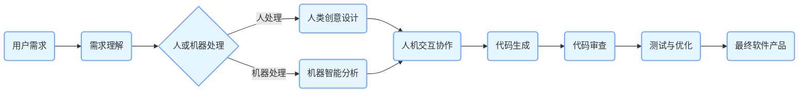

# 人机协同：软件开发的新范式

> 关键词：人机协同、软件开发、新范式、人工智能、协作模式

> 摘要：本文聚焦于人机协同这一软件开发的新范式。首先介绍了该范式产生的背景，包括目的、预期读者、文档结构和相关术语。接着深入探讨了人机协同的核心概念与联系，通过文本示意图和 Mermaid 流程图进行清晰展示。详细阐述了核心算法原理，并结合 Python 源代码说明具体操作步骤，同时给出相关数学模型和公式并举例讲解。通过项目实战案例，从开发环境搭建、源代码实现到代码解读进行了全面分析。还探讨了人机协同在软件开发中的实际应用场景，推荐了相关的学习资源、开发工具框架以及论文著作。最后总结了人机协同未来的发展趋势与挑战，列出常见问题与解答，并提供扩展阅读和参考资料，旨在全面深入地介绍人机协同这一软件开发新范式，为相关从业者和研究者提供有价值的参考。

## 1. 背景介绍 
### 1.1 目的和范围
在当今数字化快速发展的时代，软件开发面临着越来越高的要求和挑战。传统的软件开发模式在效率、质量和创新能力等方面逐渐显现出局限性。人机协同作为一种新兴的软件开发范式，旨在充分发挥人和机器各自的优势，实现高效、智能的软件开发过程。本文的目的在于全面深入地探讨人机协同在软件开发中的应用，包括其核心概念、算法原理、实际应用场景等，范围涵盖从理论基础到实际项目实践的各个方面。

### 1.2 预期读者
本文预期读者包括软件开发人员、软件架构师、人工智能研究人员、技术管理者以及对人机协同和软件开发新趋势感兴趣的相关人员。对于软件开发人员，本文可以为他们在实际项目中应用人机协同提供技术指导和实践经验；对于软件架构师，有助于其设计更符合人机协同理念的软件架构；人工智能研究人员可以从本文中获取人机协同相关的算法和模型等理论知识；技术管理者能够了解人机协同对软件开发流程和团队协作的影响；而对相关趋势感兴趣的人员可以通过本文初步了解人机协同这一新兴范式。

### 1.3 文档结构概述
本文将按照以下结构进行阐述：首先介绍人机协同的背景信息，包括目的、读者和文档结构等；接着深入讲解人机协同的核心概念与联系，通过示意图和流程图进行直观展示；然后详细阐述核心算法原理和具体操作步骤，结合 Python 代码进行说明；再介绍相关的数学模型和公式，并举例讲解；通过项目实战案例，从开发环境搭建到代码解读进行全面分析；探讨人机协同在软件开发中的实际应用场景；推荐相关的学习资源、开发工具框架和论文著作；总结人机协同未来的发展趋势与挑战；列出常见问题与解答；最后提供扩展阅读和参考资料。

### 1.4 术语表
#### 1.4.1 核心术语定义
- **人机协同**：指人和机器通过有效的交互和协作，共同完成软件开发任务的一种模式。在这种模式下，人利用其创造力、判断力和领域知识，机器利用其计算能力、数据处理能力和学习能力，实现优势互补。
- **软件开发范式**：是指软件开发过程中遵循的基本模式、方法和原则的集合，它规定了软件开发的流程、技术和工具的使用方式。
- **人工智能辅助开发**：利用人工智能技术为软件开发过程提供辅助，如代码自动生成、缺陷检测、智能提示等。

#### 1.4.2 相关概念解释
- **自然语言处理（NLP）**：是人工智能的一个重要领域，主要研究如何使计算机能够理解、处理和生成人类语言。在人机协同中，NLP 可用于实现人与机器之间自然语言的交互，如通过自然语言描述需求来生成代码。
- **机器学习（ML）**：是一门多领域交叉学科，涉及概率论、统计学、逼近论、凸分析、算法复杂度理论等多门学科。它专门研究计算机怎样模拟或实现人类的学习行为，以获取新的知识或技能，重新组织已有的知识结构使之不断改善自身的性能。在人机协同中，机器学习可用于代码质量评估、需求预测等任务。
- **深度学习（DL）**：是机器学习的一个分支领域，它是一种基于对数据进行表征学习的方法。深度学习通过构建具有很多层的神经网络模型，自动从大量数据中学习到复杂的模式和特征。在人机协同中，深度学习可用于图像识别、语音识别等方面，以实现更丰富的人机交互方式。

#### 1.4.3 缩略词列表
- **AI**：Artificial Intelligence，人工智能
- **ML**：Machine Learning，机器学习
- **DL**：Deep Learning，深度学习
- **NLP**：Natural Language Processing，自然语言处理

## 2. 核心概念与联系 
人机协同的核心在于实现人和机器之间的有效协作，充分发挥各自的优势。人具有创造力、灵活性、判断力和领域知识，能够处理复杂的问题和做出决策；而机器具有强大的计算能力、数据处理能力和学习能力，能够快速执行重复性任务、处理大量数据和进行模式识别。

### 文本示意图
人机协同的核心概念可以用以下文本示意图来表示：

人（创造力、判断力、领域知识） <==> 交互接口 <==> 机器（计算能力、数据处理能力、学习能力）

在这个示意图中，人和机器通过交互接口进行信息的传递和协作。人通过交互接口向机器提供任务需求、领域知识和决策信息，机器通过交互接口向人反馈计算结果、分析报告和智能建议。

### Mermaid 流程图


这个流程图展示了人机协同在软件开发过程中的主要步骤。首先，用户提出需求，然后进行需求理解。接着，根据任务的性质，由人或机器进行处理。人类进行创意设计，机器进行智能分析，两者通过人机交互协作完成任务。之后进行代码生成、代码审查、测试与优化，最终得到软件产品。

## 3. 核心算法原理 & 具体操作步骤 
### 核心算法原理
在人机协同的软件开发中，有多个核心算法发挥着重要作用，以下以代码自动生成算法为例进行说明。代码自动生成算法通常基于自然语言处理和机器学习技术，其基本原理是将自然语言描述的需求转换为对应的代码。

具体来说，首先需要对大量的代码和对应的自然语言描述进行收集和整理，构建训练数据集。然后使用深度学习模型，如循环神经网络（RNN）、长短时记忆网络（LSTM）或变换器（Transformer）等，对训练数据集进行训练。训练好的模型可以学习到自然语言描述和代码之间的映射关系，从而在输入新的自然语言需求时，能够生成对应的代码。

### 具体操作步骤及 Python 源代码
以下是一个简单的代码自动生成示例，使用 Python 和 TensorFlow 库：

```python
import tensorflow as tf
from tensorflow.keras.preprocessing.text import Tokenizer
from tensorflow.keras.preprocessing.sequence import pad_sequences
import numpy as np

# 示例训练数据
natural_language_descriptions = [
    "创建一个打印 Hello World 的函数",
    "创建一个计算两个数之和的函数"
]
codes = [
    "def print_hello_world(): print('Hello World')",
    "def add_numbers(a, b): return a + b"
]

# 对自然语言描述进行分词
tokenizer_nl = Tokenizer()
tokenizer_nl.fit_on_texts(natural_language_descriptions)
nl_sequences = tokenizer_nl.texts_to_sequences(natural_language_descriptions)
nl_padded = pad_sequences(nl_sequences)

# 对代码进行分词
tokenizer_code = Tokenizer()
tokenizer_code.fit_on_texts(codes)
code_sequences = tokenizer_code.texts_to_sequences(codes)
code_padded = pad_sequences(code_sequences)

# 构建模型
model = tf.keras.Sequential([
    tf.keras.layers.Embedding(input_dim=len(tokenizer_nl.word_index) + 1, output_dim=16, input_length=nl_padded.shape[1]),
    tf.keras.layers.LSTM(128),
    tf.keras.layers.Dense(len(tokenizer_code.word_index) + 1, activation='softmax')
])

# 编译模型
model.compile(loss='sparse_categorical_crossentropy', optimizer='adam', metrics=['accuracy'])

# 训练模型
model.fit(nl_padded, np.array(code_padded), epochs=100)

# 生成代码示例
new_nl_description = "创建一个打印 Goodbye 的函数"
new_nl_sequence = tokenizer_nl.texts_to_sequences([new_nl_description])
new_nl_padded = pad_sequences(new_nl_sequence, maxlen=nl_padded.shape[1])

prediction = model.predict(new_nl_padded)
predicted_sequence = np.argmax(prediction, axis=-1)
predicted_code = tokenizer_code.sequences_to_texts([predicted_sequence])

print("生成的代码:", predicted_code)
```

### 代码解释
1. **数据准备**：首先定义了示例的自然语言描述和对应的代码。然后使用 `Tokenizer` 对自然语言描述和代码进行分词处理，并使用 `pad_sequences` 对分词后的序列进行填充，使其长度一致。
2. **模型构建**：使用 `Sequential` 模型构建一个简单的神经网络，包括嵌入层、LSTM 层和全连接层。嵌入层将输入的自然语言序列转换为向量表示，LSTM 层用于学习序列中的上下文信息，全连接层输出预测的代码序列。
3. **模型编译和训练**：使用 `sparse_categorical_crossentropy` 作为损失函数，`adam` 作为优化器，对模型进行编译。然后使用训练数据对模型进行训练。
4. **代码生成**：输入新的自然语言描述，将其转换为序列并填充，然后使用训练好的模型进行预测，最后将预测的序列转换为代码文本。

## 4. 数学模型和公式 & 详细讲解 & 举例说明 
### 数学模型
在代码自动生成的算法中，常用的数学模型是基于概率的语言模型。语言模型的目标是计算给定输入序列（自然语言描述）下输出序列（代码）的概率 $P(y|x)$，其中 $x$ 表示输入的自然语言序列，$y$ 表示输出的代码序列。

### 公式
最常见的语言模型是 $n$-gram 模型和基于神经网络的语言模型。这里以基于神经网络的语言模型为例，使用交叉熵损失函数来训练模型。交叉熵损失函数的公式为：

$$L = -\frac{1}{N}\sum_{i=1}^{N}\sum_{j=1}^{M}y_{ij}\log(p_{ij})$$

其中，$N$ 是样本数量，$M$ 是词汇表的大小，$y_{ij}$ 是真实标签（代码序列中第 $i$ 个样本的第 $j$ 个词的真实概率，通常为 0 或 1），$p_{ij}$ 是模型预测的第 $i$ 个样本的第 $j$ 个词的概率。

### 详细讲解
交叉熵损失函数的作用是衡量模型预测的概率分布与真实概率分布之间的差异。当模型预测的概率分布与真实概率分布越接近时，交叉熵损失函数的值越小，说明模型的性能越好。在训练过程中，通过最小化交叉熵损失函数来调整模型的参数，使得模型能够更好地学习到自然语言描述和代码之间的映射关系。

### 举例说明
假设我们有一个简单的词汇表 $\{a, b, c\}$，真实的代码序列为 $[1, 0, 0]$（表示第一个词为 $a$），模型预测的概率分布为 $[0.8, 0.1, 0.1]$。则交叉熵损失为：

$$L = - (1\times\log(0.8) + 0\times\log(0.1) + 0\times\log(0.1)) \approx 0.223$$

如果模型预测的概率分布为 $[0.3, 0.3, 0.4]$，则交叉熵损失为：

$$L = - (1\times\log(0.3) + 0\times\log(0.3) + 0\times\log(0.4)) \approx 1.204$$

可以看到，第一个预测的概率分布更接近真实分布，其交叉熵损失更小。

## 5. 项目实战：代码实际案例和详细解释说明 
### 5.1  开发环境搭建
以下是搭建一个基于 Python 的人机协同软件开发项目的开发环境步骤：

1. **安装 Python**：从 Python 官方网站（https://www.python.org/downloads/）下载并安装适合你操作系统的 Python 版本。建议使用 Python 3.6 及以上版本。
2. **创建虚拟环境**：使用 `venv` 或 `conda` 等工具创建虚拟环境，以隔离项目的依赖。例如，使用 `venv` 创建虚拟环境的命令为：

```bash
python -m venv myenv
```

3. **激活虚拟环境**：在 Windows 上，使用以下命令激活虚拟环境：

```bash
myenv\Scripts\activate
```

在 Linux 或 macOS 上，使用以下命令激活虚拟环境：

```bash
source myenv/bin/activate
```

4. **安装依赖库**：安装项目所需的依赖库，如 TensorFlow、NumPy、Scikit-learn 等。可以使用 `pip` 进行安装，例如：

```bash
pip install tensorflow numpy scikit-learn
```

### 5.2  源代码详细实现和代码解读
以下是一个简单的人机协同代码审查项目的源代码实现：

```python
import tensorflow as tf
import numpy as np
from sklearn.model_selection import train_test_split

# 示例代码数据集
code_samples = [
    "def add_numbers(a, b): return a + b",
    "def multiply_numbers(a, b): return a * b",
    "def subtract_numbers(a, b): return a - b"
]
# 示例代码标签（0 表示代码正确，1 表示代码有问题）
labels = [0, 0, 0]

# 对代码进行分词
tokenizer = Tokenizer()
tokenizer.fit_on_texts(code_samples)
code_sequences = tokenizer.texts_to_sequences(code_samples)
code_padded = pad_sequences(code_sequences)

# 划分训练集和测试集
X_train, X_test, y_train, y_test = train_test_split(code_padded, np.array(labels), test_size=0.2, random_state=42)

# 构建模型
model = tf.keras.Sequential([
    tf.keras.layers.Embedding(input_dim=len(tokenizer.word_index) + 1, output_dim=16, input_length=code_padded.shape[1]),
    tf.keras.layers.GlobalAveragePooling1D(),
    tf.keras.layers.Dense(1, activation='sigmoid')
])

# 编译模型
model.compile(loss='binary_crossentropy', optimizer='adam', metrics=['accuracy'])

# 训练模型
model.fit(X_train, y_train, epochs=10, validation_data=(X_test, y_test))

# 代码审查示例
new_code = "def divide_numbers(a, b): return a / b"
new_code_sequence = tokenizer.texts_to_sequences([new_code])
new_code_padded = pad_sequences(new_code_sequence, maxlen=code_padded.shape[1])

prediction = model.predict(new_code_padded)
if prediction[0][0] < 0.5:
    print("代码看起来没问题")
else:
    print("代码可能有问题")
```

### 5.3  代码解读与分析
1. **数据准备**：定义了示例的代码数据集和对应的标签。使用 `Tokenizer` 对代码进行分词处理，并使用 `pad_sequences` 对分词后的序列进行填充，使其长度一致。然后使用 `train_test_split` 函数将数据集划分为训练集和测试集。
2. **模型构建**：使用 `Sequential` 模型构建一个简单的神经网络，包括嵌入层、全局平均池化层和全连接层。嵌入层将输入的代码序列转换为向量表示，全局平均池化层对向量进行平均处理，全连接层输出预测的标签（0 或 1）。
3. **模型编译和训练**：使用 `binary_crossentropy` 作为损失函数，`adam` 作为优化器，对模型进行编译。然后使用训练数据对模型进行训练，并在测试集上进行验证。
4. **代码审查**：输入新的代码，将其转换为序列并填充，然后使用训练好的模型进行预测。根据预测结果判断代码是否有问题。

## 6. 实际应用场景 
### 代码自动生成
在软件开发过程中，开发人员可以通过自然语言描述需求，让机器自动生成对应的代码。例如，在开发一个简单的 Web 应用时，开发人员可以描述“创建一个用户登录页面，包含用户名和密码输入框以及登录按钮”，机器可以根据这个描述自动生成对应的 HTML、CSS 和 JavaScript 代码。

### 代码审查与优化
机器可以对开发人员编写的代码进行审查，检测代码中的语法错误、逻辑错误和潜在的安全漏洞。同时，机器还可以根据代码的风格规范和性能优化建议，对代码进行自动优化。例如，机器可以检测到代码中存在的未使用变量、冗余代码等问题，并提供相应的优化建议。

### 需求分析与理解
在软件开发的需求分析阶段，机器可以帮助开发人员理解用户的需求。通过对用户需求文档进行自然语言处理，机器可以提取关键信息，生成需求模型和用例图等。例如，机器可以分析用户需求文档中的文本，识别出功能需求、非功能需求和约束条件等信息。

### 智能辅助编程
在开发过程中，机器可以为开发人员提供智能提示和建议。例如，当开发人员输入代码时，机器可以根据上下文信息，自动补全代码、推荐合适的函数和类等。同时，机器还可以提供相关的代码示例和文档链接，帮助开发人员快速解决问题。

## 7. 工具和资源推荐
### 7.1 学习资源推荐
#### 7.1.1 书籍推荐
- 《Python 深度学习》：这本书详细介绍了 Python 在深度学习中的应用，包括神经网络的基本原理、模型构建和训练等内容，对于理解人机协同中涉及的深度学习算法有很大帮助。
- 《自然语言处理入门》：全面介绍了自然语言处理的基本概念、算法和应用，适合初学者学习自然语言处理技术，在人机协同中自然语言处理是实现人机交互的重要基础。
- 《人工智能：一种现代的方法》：这是一本经典的人工智能教材，涵盖了人工智能的各个领域，包括搜索算法、知识表示、机器学习等，对于全面了解人工智能在人机协同中的应用有重要意义。

#### 7.1.2 在线课程
- Coursera 上的《深度学习专项课程》：由深度学习领域的知名专家授课，系统地介绍了深度学习的理论和实践，包括卷积神经网络、循环神经网络等内容。
- edX 上的《自然语言处理基础》：提供了自然语言处理的基础知识和技术，包括文本分类、情感分析等，有助于学习人机协同中的自然语言交互技术。
- Udemy 上的《Python 编程从入门到实践》：适合初学者学习 Python 编程，为后续学习和实践人机协同相关项目打下基础。

#### 7.1.3 技术博客和网站
- Medium：上面有很多关于人工智能、机器学习和软件开发的技术博客文章，涵盖了最新的研究成果和实践经验。
- arXiv：是一个开放的预印本平台，提供了大量的学术论文，包括人工智能、人机协同等领域的最新研究成果。
- Stack Overflow：是一个程序员社区，开发人员可以在上面提问、分享经验和解决问题，对于解决人机协同开发中遇到的技术问题很有帮助。

### 7.2 开发工具框架推荐
#### 7.2.1 IDE和编辑器
- PyCharm：是一款专门为 Python 开发设计的集成开发环境，具有代码编辑、调试、自动补全、版本控制等功能，适合开发人机协同相关的 Python 项目。
- Visual Studio Code：是一个轻量级的代码编辑器，支持多种编程语言，拥有丰富的插件生态系统，可以方便地进行人机协同开发。
- Jupyter Notebook：是一个交互式的开发环境，适合进行数据探索、模型训练和代码演示等工作，在人机协同的研究和实践中经常使用。

#### 7.2.2 调试和性能分析工具
- TensorBoard：是 TensorFlow 提供的可视化工具，可以帮助开发人员监控模型的训练过程、分析模型的性能和查看模型的结构，对于调试和优化人机协同中的深度学习模型很有帮助。
- Py-Spy：是一个用于分析 Python 程序性能的工具，可以帮助开发人员找出程序中的性能瓶颈，提高程序的运行效率。
- Pylint：是一个 Python 代码分析工具，可以检查代码中的语法错误、代码风格问题和潜在的逻辑错误，有助于提高代码的质量。

#### 7.2.3 相关框架和库
- TensorFlow：是一个开源的机器学习框架，提供了丰富的工具和库，用于构建和训练深度学习模型，在人机协同的代码自动生成、代码审查等任务中经常使用。
- PyTorch：是另一个流行的深度学习框架，具有动态图的特点，适合进行快速的模型开发和实验，在人机协同的研究和实践中也有广泛的应用。
- Scikit-learn：是一个用于机器学习的 Python 库，提供了各种机器学习算法和工具，如分类、回归、聚类等，对于人机协同中的数据分析和处理很有帮助。

### 7.3 相关论文著作推荐
#### 7.3.1 经典论文
- "Attention Is All You Need"：提出了变换器（Transformer）模型，为自然语言处理和深度学习领域带来了重大突破，在人机协同的自然语言交互中有重要应用。
- "ImageNet Classification with Deep Convolutional Neural Networks"：介绍了 AlexNet 模型，开启了深度学习在计算机视觉领域的热潮，对于人机协同中的图像识别等任务有重要影响。
- "Long Short-Term Memory"：提出了长短时记忆网络（LSTM），解决了循环神经网络中的梯度消失问题，在处理序列数据时表现出色，在人机协同的代码生成等任务中有应用。

#### 7.3.2 最新研究成果
- 关注顶级学术会议如 NeurIPS（神经信息处理系统大会）、ICML（国际机器学习会议）、ACL（计算语言学协会年会）等的最新论文，这些会议涵盖了人工智能、自然语言处理等领域的最新研究成果，对于了解人机协同的前沿技术有重要意义。
- 关注知名学术期刊如 Journal of Artificial Intelligence Research（JAIR）、Artificial Intelligence 等的最新文章，这些期刊发表了高质量的人工智能研究论文，对于深入研究人机协同的理论和方法有帮助。

#### 7.3.3 应用案例分析
- 一些知名科技公司如 Google、Microsoft、OpenAI 等会发布关于人机协同在软件开发中的应用案例和技术报告，可以通过它们的官方网站或技术博客进行了解。这些案例可以为实际项目的开发提供参考和借鉴。

## 8. 总结：未来发展趋势与挑战
### 未来发展趋势
- **更深入的人机融合**：未来人机协同将不仅仅是简单的交互和协作，而是实现更深入的融合。例如，机器可以更好地理解人类的思维方式和情感状态，根据人类的需求和偏好提供更加个性化的服务。
- **跨领域的应用拓展**：人机协同将不仅仅局限于软件开发领域，还将拓展到其他领域，如医疗、金融、教育等。在医疗领域，人机协同可以辅助医生进行疾病诊断和治疗方案制定；在金融领域，人机协同可以进行风险评估和投资决策等。
- **智能自动化程度提高**：随着人工智能技术的不断发展，机器的智能自动化程度将不断提高。在软件开发中，更多的任务将由机器自动完成，开发人员可以将更多的精力放在创意设计和复杂问题的解决上。

### 挑战
- **伦理和法律问题**：人机协同的发展带来了一系列伦理和法律问题，如数据隐私、算法偏见、责任界定等。例如，当机器生成的代码出现问题时，责任应该由开发人员还是机器承担，需要明确的法律界定。
- **技术瓶颈**：虽然人工智能技术取得了很大的进展，但仍然存在一些技术瓶颈，如自然语言理解的准确性、模型的可解释性等。在人机协同中，这些技术瓶颈可能会影响人机交互的效果和协作的效率。
- **人类适应问题**：人类需要适应新的人机协同工作模式，改变传统的工作习惯和思维方式。例如，开发人员需要学会与机器进行有效的协作，充分发挥机器的优势，同时保持自己的创造力和判断力。

## 9. 附录：常见问题与解答
### 问题 1：人机协同会取代人类程序员吗？
解答：不会。人机协同的目的是充分发挥人和机器各自的优势，实现高效、智能的软件开发过程。虽然机器可以完成一些重复性、规律性的任务，但人类程序员的创造力、判断力和领域知识是机器无法替代的。在人机协同中，人类程序员仍然起着关键的作用，如需求分析、创意设计和复杂问题的解决等。

### 问题 2：如何评估人机协同的效果？
解答：可以从多个方面评估人机协同的效果，如开发效率、代码质量、团队协作效率等。开发效率可以通过项目的开发周期、任务完成时间等指标来衡量；代码质量可以通过代码的复杂度、缺陷率等指标来评估；团队协作效率可以通过团队成员之间的沟通频率、协作满意度等指标来评价。

### 问题 3：在人机协同中，如何保证数据的安全和隐私？
解答：在人机协同中，需要采取一系列措施来保证数据的安全和隐私。例如，对数据进行加密处理，限制数据的访问权限，定期备份数据等。同时，需要遵守相关的法律法规和行业标准，确保数据的合法使用和保护。

## 10. 扩展阅读 & 参考资料
### 扩展阅读
- 《智能时代》：探讨了人工智能对社会和经济的影响，对于理解人机协同在未来社会中的地位和作用有帮助。
- 《人类简史：从动物到上帝》：从人类发展的角度出发，思考人类与技术的关系，为理解人机协同的发展趋势提供了宏观的视角。

### 参考资料
- 相关学术论文和研究报告，如在 arXiv、IEEE Xplore 等平台上搜索到的关于人机协同、人工智能、软件开发等领域的论文。
- 开源项目和代码库，如 GitHub 上的相关项目，可以参考其中的代码实现和技术方案。
- 官方文档和技术手册，如 TensorFlow、PyTorch 等框架的官方文档，对于深入学习和使用相关技术有重要指导作用。