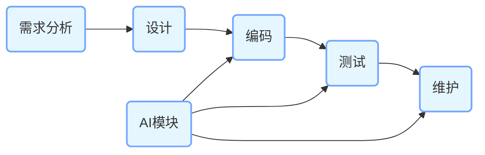

# 从传统编程到AI协同开发的职业转型路径规划

> 关键词：传统编程、AI协同开发、职业转型、路径规划、技能提升

> 摘要：本文聚焦于从传统编程向AI协同开发的职业转型路径规划。随着人工智能技术的飞速发展，AI协同开发逐渐成为编程领域的重要趋势。对于传统编程人员而言，了解转型的必要性、掌握转型所需的技能、明确转型的步骤至关重要。文章深入探讨了相关核心概念，阐述了转型涉及的算法原理，结合数学模型进行分析，通过项目实战展示具体操作，介绍了实际应用场景，推荐了相关工具和资源，最后对未来发展趋势与挑战进行总结，并提供常见问题解答和扩展阅读参考资料，旨在为传统编程人员提供全面且实用的转型指导。

## 1. 背景介绍 
### 1.1 目的和范围
在当今数字化快速发展的时代，人工智能技术已经渗透到各个领域，对软件开发行业产生了深远的影响。传统编程模式在处理复杂的问题和实现智能化功能方面逐渐显现出局限性，而AI协同开发则为解决这些问题提供了新的思路和方法。本文的目的在于为传统编程人员提供一个全面、系统的职业转型路径规划，帮助他们顺利从传统编程领域过渡到AI协同开发领域。范围涵盖了转型所需的理论知识、技能提升、项目实践以及未来发展趋势等方面。

### 1.2 预期读者
本文主要面向有一定传统编程基础，希望了解并实现向AI协同开发职业转型的程序员、软件工程师、技术爱好者等。同时，对于相关技术领域的管理者、教育工作者等也具有一定的参考价值，有助于他们更好地理解这一转型趋势，为团队或学生的职业发展提供指导。

### 1.3 文档结构概述
本文将按照以下结构进行阐述：首先介绍背景知识，包括目的、预期读者和文档结构概述等；接着阐述核心概念与联系，帮助读者理解传统编程和AI协同开发的区别与联系；然后详细讲解核心算法原理及具体操作步骤，通过Python代码进行说明；再介绍相关的数学模型和公式，并举例说明；之后通过项目实战展示代码实现和详细解释；随后介绍实际应用场景；接着推荐相关的工具和资源；最后总结未来发展趋势与挑战，提供常见问题解答和扩展阅读参考资料。

### 1.4 术语表
#### 1.4.1 核心术语定义
- **传统编程**：指使用传统的编程语言（如C、C++、Java等），按照预先设定的规则和逻辑，通过编写代码来实现特定功能的编程方式。
- **AI协同开发**：是指在软件开发过程中，将人工智能技术与传统编程方法相结合，利用AI的智能特性（如机器学习、自然语言处理等）辅助编程人员完成代码编写、调试、优化等任务，提高开发效率和软件质量。
- **机器学习**：是一门多领域交叉学科，涉及概率论、统计学、逼近论、凸分析、算法复杂度理论等多门学科。它专门研究计算机怎样模拟或实现人类的学习行为，以获取新的知识或技能，重新组织已有的知识结构使之不断改善自身的性能。
- **深度学习**：是机器学习的一个分支领域，它是一种基于对数据进行表征学习的方法。深度学习通过构建具有很多层的神经网络模型，自动从大量数据中学习特征和模式，从而实现对数据的分类、预测等任务。

#### 1.4.2 相关概念解释
- **人工智能与编程的融合**：人工智能技术可以为编程提供更智能的辅助，例如自动代码补全、代码错误检测与修复、程序优化建议等。同时，编程也是实现人工智能算法和模型的基础，通过编写代码可以将人工智能的理论和方法应用到实际项目中。
- **协同开发**：强调团队成员之间的协作和沟通，在AI协同开发中，不仅包括编程人员之间的协作，还包括编程人员与AI工具之间的协作。AI工具可以作为团队的一员，为编程人员提供实时的支持和建议。

#### 1.4.3 缩略词列表
- **AI**：Artificial Intelligence（人工智能）
- **ML**：Machine Learning（机器学习）
- **DL**：Deep Learning（深度学习）
- **IDE**：Integrated Development Environment（集成开发环境）

## 2. 核心概念与联系 
### 传统编程与AI协同开发的区别与联系
传统编程主要依赖程序员的经验和知识，通过手动编写代码来实现软件功能。程序员需要详细地定义程序的逻辑和算法，对每一个步骤进行精确的控制。而AI协同开发则引入了人工智能技术，利用机器学习和深度学习等方法，让计算机自动学习和分析大量的数据，从而为编程提供智能的辅助。

在联系方面，传统编程是AI协同开发的基础。AI协同开发需要程序员具备扎实的编程基础，能够理解和实现基本的算法和数据结构。同时，AI协同开发也为传统编程带来了新的机遇和挑战，它可以提高编程效率，减少人为错误，推动软件行业的发展。

### 核心概念原理和架构的文本示意图
传统编程的架构通常包括需求分析、设计、编码、测试和维护等阶段。程序员在每个阶段都需要手动完成相应的任务，通过编写代码来实现软件的功能。

AI协同开发的架构则在传统编程的基础上，增加了AI模块。AI模块可以通过对大量代码数据的学习，自动生成代码片段、检测代码错误、提供优化建议等。同时，AI模块还可以与程序员进行交互，根据程序员的需求和反馈进行调整和优化。

### Mermaid 流程图


## 3. 核心算法原理 & 具体操作步骤 
### 机器学习算法原理
机器学习是AI协同开发中常用的技术之一，它可以通过对大量数据的学习，自动发现数据中的模式和规律，从而实现对未知数据的预测和分类。常见的机器学习算法包括决策树、支持向量机、神经网络等。

以决策树算法为例，决策树是一种基于树结构进行决策的算法。它通过对数据的特征进行分析，构建一个决策树模型，每个内部节点表示一个特征上的测试，每个分支表示一个测试输出，每个叶节点表示一个类别或值。

以下是使用Python实现决策树算法的示例代码：
```python
from sklearn.datasets import load_iris
from sklearn.model_selection import train_test_split
from sklearn.tree import DecisionTreeClassifier
from sklearn.metrics import accuracy_score

# 加载数据集
iris = load_iris()
X = iris.data
y = iris.target

# 划分训练集和测试集
X_train, X_test, y_train, y_test = train_test_split(X, y, test_size=0.3, random_state=42)

# 创建决策树分类器
clf = DecisionTreeClassifier()

# 训练模型
clf.fit(X_train, y_train)

# 预测
y_pred = clf.predict(X_test)

# 计算准确率
accuracy = accuracy_score(y_test, y_pred)
print(f"Accuracy: {accuracy}")
```
### 具体操作步骤
1. **数据收集**：收集与编程相关的数据，例如代码片段、错误信息、性能指标等。
2. **数据预处理**：对收集到的数据进行清洗、转换和归一化等处理，以便于机器学习算法的使用。
3. **模型选择**：根据具体的任务和数据特点，选择合适的机器学习算法和模型。
4. **模型训练**：使用预处理后的数据对模型进行训练，调整模型的参数，使其达到最佳性能。
5. **模型评估**：使用测试数据对训练好的模型进行评估，计算模型的准确率、召回率等指标。
6. **模型应用**：将训练好的模型应用到实际的编程任务中，例如代码自动补全、错误检测等。

## 4. 数学模型和公式 & 详细讲解 & 举例说明 
### 决策树算法的数学模型和公式
决策树算法的核心是构建决策树模型，而构建决策树的关键是选择合适的特征进行划分。常用的特征选择方法是信息增益和基尼指数。

#### 信息增益
信息增益是衡量特征对分类结果影响程度的指标。它的计算公式为：
$$
IG(S, A) = H(S) - \sum_{v \in Values(A)} \frac{|S_v|}{|S|} H(S_v)
$$
其中，$IG(S, A)$ 表示特征 $A$ 对数据集 $S$ 的信息增益，$H(S)$ 表示数据集 $S$ 的熵，$S_v$ 表示数据集 $S$ 中特征 $A$ 取值为 $v$ 的子集，$|S|$ 和 $|S_v|$ 分别表示数据集 $S$ 和子集 $S_v$ 的样本数量。

#### 熵
熵是衡量数据集不确定性的指标，它的计算公式为：
$$
H(S) = -\sum_{i=1}^{n} p_i \log_2 p_i
$$
其中，$p_i$ 表示数据集 $S$ 中第 $i$ 类样本的比例，$n$ 表示数据集 $S$ 中类别的数量。

### 举例说明
假设有一个数据集 $S$ 包含 10 个样本，其中 6 个属于类别 $A$，4 个属于类别 $B$。则数据集 $S$ 的熵为：
$$
H(S) = -\frac{6}{10} \log_2 \frac{6}{10} - \frac{4}{10} \log_2 \frac{4}{10} \approx 0.971
$$
假设有一个特征 $A$，它有两个取值 $v_1$ 和 $v_2$。$S_{v_1}$ 包含 4 个样本，其中 3 个属于类别 $A$，1 个属于类别 $B$；$S_{v_2}$ 包含 6 个样本，其中 3 个属于类别 $A$，3 个属于类别 $B$。则特征 $A$ 对数据集 $S$ 的信息增益为：
$$
\begin{align*}
IG(S, A) &= H(S) - \frac{4}{10} H(S_{v_1}) - \frac{6}{10} H(S_{v_2}) \\
&= 0.971 - \frac{4}{10} \left(-\frac{3}{4} \log_2 \frac{3}{4} - \frac{1}{4} \log_2 \frac{1}{4}\right) - \frac{6}{10} \left(-\frac{3}{6} \log_2 \frac{3}{6} - \frac{3}{6} \log_2 \frac{3}{6}\right) \\
&\approx 0.171
\end{align*}
$$

## 5. 项目实战：代码实际案例和详细解释说明 
### 5.1  开发环境搭建
1. **安装Python**：从Python官方网站（https://www.python.org/downloads/）下载并安装Python 3.x版本。
2. **安装必要的库**：使用pip命令安装机器学习和深度学习相关的库，例如`scikit-learn`、`tensorflow`、`pytorch`等。
```bash
pip install scikit-learn tensorflow pytorch
```
3. **选择开发工具**：可以选择PyCharm、Jupyter Notebook等集成开发环境。

### 5.2  源代码详细实现和代码解读
以下是一个使用深度学习实现代码自动补全的示例项目。

#### 数据准备
首先，我们需要收集大量的代码数据，并将其转换为适合深度学习模型输入的格式。
```python
import os
import numpy as np

# 读取代码文件
def read_code_files(directory):
    code_files = []
    for root, dirs, files in os.walk(directory):
        for file in files:
            if file.endswith('.py'):
                with open(os.path.join(root, file), 'r', encoding='utf-8') as f:
                    code = f.read()
                    code_files.append(code)
    return code_files

# 数据预处理
def preprocess_data(code_files):
    all_code = ''.join(code_files)
    unique_chars = sorted(list(set(all_code)))
    char_to_idx = {char: idx for idx, char in enumerate(unique_chars)}
    idx_to_char = {idx: char for idx, char in enumerate(unique_chars)}
    
    max_length = 100
    input_sequences = []
    target_chars = []
    for code in code_files:
        for i in range(0, len(code) - max_length, 1):
            input_sequence = code[i:i + max_length]
            target_char = code[i + max_length]
            input_sequences.append([char_to_idx[char] for char in input_sequence])
            target_chars.append(char_to_idx[target_char])
    
    input_sequences = np.array(input_sequences)
    target_chars = np.array(target_chars)
    
    return input_sequences, target_chars, char_to_idx, idx_to_char

# 读取代码文件
code_files = read_code_files('code_directory')

# 数据预处理
input_sequences, target_chars, char_to_idx, idx_to_char = preprocess_data(code_files)
```

#### 模型构建
使用LSTM（长短期记忆网络）构建深度学习模型。
```python
from tensorflow.keras.models import Sequential
from tensorflow.keras.layers import LSTM, Dense

# 构建模型
model = Sequential()
model.add(LSTM(128, input_shape=(100, len(char_to_idx))))
model.add(Dense(len(char_to_idx), activation='softmax'))

# 编译模型
model.compile(loss='sparse_categorical_crossentropy', optimizer='adam')
```

#### 模型训练
```python
# 训练模型
model.fit(input_sequences, target_chars, epochs=10, batch_size=128)
```

#### 代码自动补全
```python
# 代码自动补全
def generate_code(model, char_to_idx, idx_to_char, seed_text, num_chars=100):
    input_sequence = [char_to_idx[char] for char in seed_text[-100:]]
    input_sequence = np.array(input_sequence).reshape(1, 100)
    
    generated_code = seed_text
    for _ in range(num_chars):
        predicted_probs = model.predict(input_sequence)[0]
        predicted_idx = np.random.choice(len(char_to_idx), p=predicted_probs)
        predicted_char = idx_to_char[predicted_idx]
        
        generated_code += predicted_char
        input_sequence = np.roll(input_sequence, -1)
        input_sequence[0][-1] = predicted_idx
    
    return generated_code

# 示例
seed_text = 'def add(a, b):'
generated_code = generate_code(model, char_to_idx, idx_to_char, seed_text)
print(generated_code)
```

### 5.3  代码解读与分析
1. **数据准备**：首先读取代码文件，并将所有代码合并为一个字符串。然后统计所有唯一字符，建立字符到索引和索引到字符的映射。接着将代码分割成输入序列和目标字符，将字符转换为对应的索引。
2. **模型构建**：使用LSTM层作为模型的核心，LSTM层可以处理序列数据，能够记忆长期的信息。然后使用全连接层将LSTM层的输出转换为每个字符的概率分布。
3. **模型训练**：使用交叉熵损失函数和Adam优化器对模型进行训练，训练10个epoch，每个batch包含128个样本。
4. **代码自动补全**：根据给定的种子文本，预测下一个字符，并将预测的字符添加到生成的代码中，同时更新输入序列，继续预测下一个字符，直到生成指定数量的字符。

## 6. 实际应用场景 
### 代码自动补全
在编程过程中，AI协同开发工具可以根据程序员输入的代码片段，自动预测下一个可能的代码片段，并提供补全建议。这可以大大提高编程效率，减少程序员的输入工作量。

### 代码错误检测与修复
AI协同开发工具可以对程序员编写的代码进行实时检测，发现代码中的语法错误、逻辑错误等，并提供相应的修复建议。这可以帮助程序员更快地发现和解决问题，提高代码质量。

### 程序性能优化
AI协同开发工具可以对程序的性能进行分析，找出性能瓶颈，并提供优化建议。例如，通过分析代码的复杂度、内存使用情况等，提出优化算法、减少内存占用等建议，提高程序的运行效率。

### 智能代码审查
在团队协作开发中，AI协同开发工具可以对提交的代码进行智能审查，检查代码是否符合团队的编码规范、是否存在安全漏洞等。这可以提高代码审查的效率和准确性，确保团队代码的一致性和安全性。

## 7. 工具和资源推荐
### 7.1 学习资源推荐
#### 7.1.1 书籍推荐
- 《Python机器学习》：全面介绍了Python在机器学习中的应用，包括各种机器学习算法的原理和实现。
- 《深度学习》：由深度学习领域的三位先驱Ian Goodfellow、Yoshua Bengio和Aaron Courville撰写，是深度学习领域的经典教材。
- 《人工智能：一种现代的方法》：系统地介绍了人工智能的基本概念、算法和应用，是人工智能领域的权威著作。

#### 7.1.2 在线课程
- Coursera上的《机器学习》课程：由Andrew Ng教授讲授，是机器学习领域的经典课程，涵盖了机器学习的基本概念、算法和应用。
- edX上的《深度学习》课程：由深度学习领域的专家讲授，深入介绍了深度学习的原理和实践。
- 哔哩哔哩上的相关AI编程教程：有很多免费的AI编程教程，适合初学者学习。

#### 7.1.3 技术博客和网站
- Medium：有很多AI领域的技术博客，涵盖了最新的研究成果和实践经验。
- Towards Data Science：专注于数据科学和机器学习领域的技术博客，提供了很多有价值的文章和教程。
- AI Stack Exchange：一个问答社区，用户可以在这里提问、交流和分享AI相关的知识和经验。

### 7.2 开发工具框架推荐
#### 7.2.1 IDE和编辑器
- PyCharm：一款专门为Python开发设计的集成开发环境，具有强大的代码编辑、调试、智能提示等功能。
- Jupyter Notebook：一个交互式的开发环境，适合进行数据探索、模型训练和可视化等工作。
- Visual Studio Code：一款轻量级的代码编辑器，支持多种编程语言和插件，具有丰富的扩展功能。

#### 7.2.2 调试和性能分析工具
- Py-Spy：一个Python性能分析工具，可以实时分析Python程序的性能瓶颈。
- TensorBoard：TensorFlow的可视化工具，可以帮助用户可视化模型的训练过程、性能指标等。
- cProfile：Python的内置性能分析工具，可以分析Python程序的函数调用时间和次数。

#### 7.2.3 相关框架和库
- TensorFlow：一个开源的深度学习框架，由Google开发，具有强大的计算能力和丰富的工具库。
- PyTorch：一个开源的深度学习框架，由Facebook开发，具有简洁易用的API和动态图机制。
- scikit-learn：一个开源的机器学习库，提供了各种机器学习算法和工具，适合初学者使用。

### 7.3 相关论文著作推荐
#### 7.3.1 经典论文
- 《Gradient-Based Learning Applied to Document Recognition》：由Yann LeCun等人撰写，介绍了卷积神经网络（CNN）在手写数字识别中的应用，是CNN领域的经典论文。
- 《ImageNet Classification with Deep Convolutional Neural Networks》：由Alex Krizhevsky等人撰写，介绍了AlexNet在ImageNet图像分类竞赛中的应用，开创了深度学习在计算机视觉领域的新纪元。
- 《Attention Is All You Need》：由Ashish Vaswani等人撰写，介绍了Transformer模型，是自然语言处理领域的重要突破。

#### 7.3.2 最新研究成果
- 关注顶级学术会议（如NeurIPS、ICML、CVPR等）上的最新研究成果，了解AI领域的前沿技术和发展趋势。
- 关注知名研究机构（如OpenAI、DeepMind等）的官方网站和博客，获取最新的研究报告和技术文章。

#### 7.3.3 应用案例分析
- 分析各大科技公司（如Google、Microsoft、Amazon等）在AI协同开发方面的应用案例，了解实际应用中的技术和经验。
- 参考开源项目（如GitHub上的相关项目），学习其他开发者在AI协同开发中的实践经验。

## 8. 总结：未来发展趋势与挑战
### 未来发展趋势
1. **AI与编程的深度融合**：未来，AI将更加深入地融入到编程的各个环节中，实现更加智能化的编程辅助。例如，AI可以自动生成完整的程序代码，根据用户的需求和场景进行定制化开发。
2. **跨领域协同开发**：AI协同开发将不仅仅局限于软件开发领域，还将与其他领域（如医疗、金融、交通等）进行深度融合，实现跨领域的协同创新。例如，在医疗领域，AI协同开发可以帮助医生快速诊断疾病、制定治疗方案等。
3. **智能编程助手的普及**：随着AI技术的不断发展，智能编程助手将越来越普及，成为程序员的得力助手。智能编程助手可以理解程序员的意图，提供更加个性化的编程建议和支持。

### 挑战
1. **数据隐私和安全问题**：AI协同开发需要大量的数据支持，而这些数据可能包含用户的隐私信息。因此，如何保障数据的隐私和安全是一个重要的挑战。
2. **技术人才短缺**：AI协同开发需要具备传统编程和AI技术的复合型人才，而目前这类人才相对短缺。如何培养和吸引更多的技术人才是推动AI协同开发发展的关键。
3. **伦理和法律问题**：随着AI技术的不断发展，伦理和法律问题也日益凸显。例如，AI生成的代码的版权归属、AI决策的责任认定等问题都需要进一步探讨和解决。

## 9. 附录：常见问题与解答
### 问题1：转型到AI协同开发需要具备哪些基础知识？
答：需要具备扎实的传统编程基础，包括编程语言（如Python）、数据结构、算法等。同时，还需要了解机器学习、深度学习等AI相关的基础知识。

### 问题2：转型过程中遇到困难怎么办？
答：可以通过学习相关的课程、阅读技术书籍和博客、参加技术社区和论坛等方式获取帮助。也可以向有经验的开发者请教，或者参加线下的培训和交流活动。

### 问题3：AI协同开发会取代传统编程吗？
答：不会。AI协同开发是对传统编程的补充和提升，它可以提高编程效率和质量，但不能完全取代程序员的工作。程序员仍然需要具备创新思维、问题解决能力和团队协作能力等。

### 问题4：如何选择适合自己的AI开发框架？
答：可以根据自己的需求和技术背景来选择。如果是初学者，可以选择简单易用的框架，如scikit-learn；如果需要进行深度学习开发，可以选择TensorFlow或PyTorch等框架。

### 问题5：AI协同开发在实际项目中的应用效果如何？
答：AI协同开发在实际项目中已经取得了显著的效果，可以提高编程效率、减少错误、优化程序性能等。但具体的应用效果还需要根据项目的需求和实际情况来评估。

## 10. 扩展阅读 & 参考资料
### 扩展阅读
- 《AI未来进行式》：由李开复和王咏刚撰写，探讨了AI对未来社会和经济的影响。
- 《人类简史：从动物到上帝》：由尤瓦尔·赫拉利撰写，从人类历史的角度探讨了科技发展对人类社会的影响。

### 参考资料
- 《Python官方文档》：https://docs.python.org/
- 《TensorFlow官方文档》：https://www.tensorflow.org/
- 《PyTorch官方文档》：https://pytorch.org/
- 《scikit-learn官方文档》：https://scikit-learn.org/