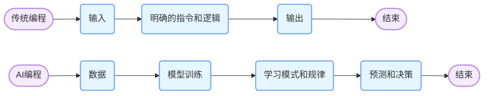

# 从传统编程到AI编程：程序员的转型之路

> 关键词：传统编程、AI编程、程序员转型、机器学习、深度学习、转型策略、应用场景

> 摘要：本文围绕程序员从传统编程向AI编程转型这一主题展开深入探讨。首先介绍了转型的背景，包括目的、预期读者、文档结构和相关术语。接着阐述了传统编程与AI编程的核心概念及其联系，详细讲解了AI编程中的核心算法原理和具体操作步骤，并通过Python代码进行示例。同时，给出了相关的数学模型和公式，并举例说明。在项目实战部分，通过具体案例展示了开发环境搭建、源代码实现和代码解读。分析了AI编程的实际应用场景，推荐了学习资源、开发工具框架和相关论文著作。最后总结了未来发展趋势与挑战，提供了常见问题解答和扩展阅读参考资料，旨在为程序员的转型提供全面且实用的指导。

## 1. 背景介绍 
### 1.1 目的和范围
在当今科技飞速发展的时代，人工智能（AI）已经成为推动各个行业变革的关键力量。对于程序员而言，从传统编程向AI编程转型是顺应时代发展的必然选择。本文的目的在于为广大程序员提供一份全面、系统的转型指南，帮助他们了解转型的必要性、掌握AI编程的核心知识和技能，顺利完成从传统编程到AI编程的过渡。

本文的范围涵盖了传统编程与AI编程的对比、AI编程的核心概念、算法原理、数学模型、项目实战、应用场景、学习资源和工具推荐等方面，旨在为程序员提供一个全方位的转型视角。

### 1.2 预期读者
本文主要面向有一定传统编程基础，希望学习和掌握AI编程技能，实现职业转型的程序员。同时，对于对AI编程感兴趣的计算机专业学生、技术爱好者也具有一定的参考价值。

### 1.3 文档结构概述
本文将按照以下结构进行组织：
- 核心概念与联系：介绍传统编程和AI编程的核心概念，分析两者之间的联系和区别。
- 核心算法原理 & 具体操作步骤：详细讲解AI编程中常用的核心算法原理，并给出具体的操作步骤和Python代码示例。
- 数学模型和公式 & 详细讲解 & 举例说明：介绍AI编程中涉及的数学模型和公式，并通过具体例子进行详细讲解。
- 项目实战：通过实际项目案例，展示从开发环境搭建到源代码实现的全过程，并对代码进行详细解读。
- 实际应用场景：分析AI编程在不同领域的实际应用场景。
- 工具和资源推荐：推荐学习AI编程的相关书籍、在线课程、技术博客、开发工具框架和论文著作。
- 总结：总结未来发展趋势与挑战。
- 附录：提供常见问题与解答。
- 扩展阅读 & 参考资料：列出相关的扩展阅读材料和参考资料。

### 1.4 术语表
#### 1.4.1 核心术语定义
- **传统编程**：指使用传统的编程语言（如C、C++、Java等），通过编写明确的指令和逻辑来实现特定功能的编程方式。
- **AI编程**：指利用人工智能技术，如机器学习、深度学习等，让计算机通过数据学习和模型训练来实现智能决策和任务执行的编程方式。
- **机器学习**：是一门多领域交叉学科，涉及概率论、统计学、逼近论、凸分析、算法复杂度理论等多门学科。它专门研究计算机怎样模拟或实现人类的学习行为，以获取新的知识或技能，重新组织已有的知识结构使之不断改善自身的性能。
- **深度学习**：是机器学习的一个分支领域，它是一种基于对数据进行表征学习的方法。深度学习通过构建具有很多层的神经网络模型，自动从大量数据中学习特征和模式。

#### 1.4.2 相关概念解释
- **数据集**：用于训练和测试机器学习模型的数据集合，通常包含输入数据和对应的标签。
- **模型**：在机器学习和深度学习中，模型是指用于进行预测和决策的数学结构，如神经网络、决策树等。
- **训练**：指使用数据集对模型进行参数调整的过程，目的是让模型能够更好地拟合数据。
- **预测**：指使用训练好的模型对新的数据进行预测和分类的过程。

#### 1.4.3 缩略词列表
- **ML**：Machine Learning，机器学习
- **DL**：Deep Learning，深度学习
- **ANN**：Artificial Neural Network，人工神经网络
- **CNN**：Convolutional Neural Network，卷积神经网络
- **RNN**：Recurrent Neural Network，循环神经网络

## 2. 核心概念与联系 

### 传统编程的核心概念
传统编程的核心是通过编写一系列明确的指令和逻辑来实现特定的功能。程序员需要精确地定义输入、处理过程和输出，计算机按照这些指令依次执行，最终得到预期的结果。例如，一个简单的加法程序：

```python
# 传统编程示例：加法程序
def add_numbers(a, b):
    return a + b

result = add_numbers(3, 5)
print(result)
```

在这个例子中，程序员明确地定义了一个函数 `add_numbers`，该函数接受两个参数 `a` 和 `b`，并返回它们的和。计算机按照这个明确的逻辑执行，最终输出结果 8。

### AI编程的核心概念
AI编程的核心是让计算机通过数据学习和模型训练来实现智能决策和任务执行。与传统编程不同，AI编程不需要程序员手动编写所有的逻辑，而是让计算机从大量的数据中自动学习模式和规律。例如，一个简单的机器学习分类问题：

```python
# AI编程示例：简单的分类问题
from sklearn.datasets import load_iris
from sklearn.model_selection import train_test_split
from sklearn.neighbors import KNeighborsClassifier

# 加载鸢尾花数据集
iris = load_iris()
X = iris.data
y = iris.target

# 划分训练集和测试集
X_train, X_test, y_train, y_test = train_test_split(X, y, test_size=0.2, random_state=42)

# 创建K近邻分类器
knn = KNeighborsClassifier(n_neighbors=3)

# 训练模型
knn.fit(X_train, y_train)

# 进行预测
predictions = knn.predict(X_test)

# 输出预测结果
print(predictions)
```

在这个例子中，我们使用了鸢尾花数据集，通过 `train_test_split` 函数将数据集划分为训练集和测试集。然后，我们创建了一个 `KNeighborsClassifier` 模型，并使用训练集对其进行训练。最后，使用训练好的模型对测试集进行预测，并输出预测结果。

### 传统编程与AI编程的联系
传统编程和AI编程并不是相互独立的，而是相互补充的。传统编程是AI编程的基础，许多AI编程任务仍然需要使用传统编程的知识和技能来实现。例如，在AI编程中，我们需要使用传统编程来处理数据、构建模型、实现算法等。同时，AI编程也为传统编程带来了新的思路和方法，例如，我们可以使用AI技术来优化传统程序的性能、提高程序的智能水平。

### 核心概念原理和架构的文本示意图
```plaintext
传统编程：输入 -> 明确的指令和逻辑 -> 输出

AI编程：数据 -> 模型训练（学习模式和规律） -> 预测和决策
```

### Mermaid流程图


## 3. 核心算法原理 & 具体操作步骤 

### 机器学习算法：线性回归
#### 算法原理
线性回归是一种用于预测连续数值的机器学习算法。它的基本思想是通过寻找一条直线（在二维空间中）或超平面（在多维空间中），使得数据点到这条直线或超平面的距离之和最小。线性回归的数学模型可以表示为：

$$y = \theta_0 + \theta_1x_1 + \theta_2x_2 + \cdots + \theta_nx_n$$

其中，$y$ 是预测值，$x_1, x_2, \cdots, x_n$ 是输入特征，$\theta_0, \theta_1, \cdots, \theta_n$ 是模型的参数。

#### 具体操作步骤
1. **数据准备**：收集和整理用于训练和测试的数据。
2. **模型选择**：选择线性回归模型。
3. **模型训练**：使用训练数据对模型进行训练，调整模型的参数。
4. **模型评估**：使用测试数据对训练好的模型进行评估，计算评估指标。
5. **预测**：使用训练好的模型对新的数据进行预测。

#### Python代码示例
```python
import numpy as np
from sklearn.linear_model import LinearRegression
from sklearn.model_selection import train_test_split
from sklearn.metrics import mean_squared_error

# 生成一些示例数据
np.random.seed(42)
X = 2 * np.random.rand(100, 1)
y = 4 + 3 * X + np.random.randn(100, 1)

# 划分训练集和测试集
X_train, X_test, y_train, y_test = train_test_split(X, y, test_size=0.2, random_state=42)

# 创建线性回归模型
lin_reg = LinearRegression()

# 训练模型
lin_reg.fit(X_train, y_train)

# 进行预测
y_pred = lin_reg.predict(X_test)

# 计算均方误差
mse = mean_squared_error(y_test, y_pred)
print(f"均方误差: {mse}")
```

### 深度学习算法：神经网络
#### 算法原理
神经网络是一种模仿人类神经系统的计算模型，由多个神经元组成。每个神经元接收输入信号，经过加权求和和激活函数处理后，输出一个信号。神经网络通过多层神经元的连接和信息传递，能够学习到复杂的非线性关系。

#### 具体操作步骤
1. **数据准备**：收集和整理用于训练和测试的数据，并进行预处理。
2. **模型构建**：构建神经网络模型，包括定义网络的层数、每层的神经元数量和激活函数。
3. **模型编译**：选择损失函数、优化器和评估指标。
4. **模型训练**：使用训练数据对模型进行训练，调整模型的参数。
5. **模型评估**：使用测试数据对训练好的模型进行评估，计算评估指标。
6. **预测**：使用训练好的模型对新的数据进行预测。

#### Python代码示例
```python
import tensorflow as tf
from tensorflow.keras.datasets import mnist
from tensorflow.keras.models import Sequential
from tensorflow.keras.layers import Dense, Flatten
from tensorflow.keras.utils import to_categorical

# 加载MNIST数据集
(train_images, train_labels), (test_images, test_labels) = mnist.load_data()

# 数据预处理
train_images = train_images / 255.0
test_images = test_images / 255.0
train_labels = to_categorical(train_labels)
test_labels = to_categorical(test_labels)

# 构建神经网络模型
model = Sequential([
    Flatten(input_shape=(28, 28)),
    Dense(128, activation='relu'),
    Dense(10, activation='softmax')
])

# 模型编译
model.compile(optimizer='adam',
              loss='categorical_crossentropy',
              metrics=['accuracy'])

# 模型训练
model.fit(train_images, train_labels, epochs=5, batch_size=64)

# 模型评估
test_loss, test_acc = model.evaluate(test_images, test_labels)
print(f"测试集准确率: {test_acc}")
```

## 4. 数学模型和公式 & 详细讲解 & 举例说明 

### 线性回归的数学模型和公式
线性回归的数学模型可以表示为：

$$y = \theta_0 + \theta_1x_1 + \theta_2x_2 + \cdots + \theta_nx_n$$

其中，$y$ 是预测值，$x_1, x_2, \cdots, x_n$ 是输入特征，$\theta_0, \theta_1, \cdots, \theta_n$ 是模型的参数。

为了找到最优的参数 $\theta$，我们通常使用最小二乘法，即最小化预测值与真实值之间的误差平方和。误差平方和可以表示为：

$$J(\theta) = \frac{1}{2m}\sum_{i=1}^{m}(h_{\theta}(x^{(i)}) - y^{(i)})^2$$

其中，$m$ 是样本数量，$h_{\theta}(x^{(i)})$ 是第 $i$ 个样本的预测值，$y^{(i)}$ 是第 $i$ 个样本的真实值。

通过对 $J(\theta)$ 求偏导数并令其等于 0，我们可以得到最优的参数 $\theta$。

#### 举例说明
假设我们有一组二维数据 $(x_1, y_1), (x_2, y_2), \cdots, (x_m, y_m)$，我们要使用线性回归来预测 $y$ 的值。我们可以将数据表示为矩阵形式：

$$X = \begin{bmatrix}
1 & x_1 \\
1 & x_2 \\
\vdots & \vdots \\
1 & x_m
\end{bmatrix},
y = \begin{bmatrix}
y_1 \\
y_2 \\
\vdots \\
y_m
\end{bmatrix},
\theta = \begin{bmatrix}
\theta_0 \\
\theta_1
\end{bmatrix}$$

则预测值可以表示为：

$$h_{\theta}(X) = X\theta$$

误差平方和可以表示为：

$$J(\theta) = \frac{1}{2m}(X\theta - y)^T(X\theta - y)$$

对 $J(\theta)$ 求偏导数并令其等于 0，得到：

$$\frac{\partial J(\theta)}{\partial \theta} = \frac{1}{m}X^T(X\theta - y) = 0$$

解这个方程可以得到最优的参数 $\theta$：

$$\theta = (X^TX)^{-1}X^Ty$$

### 神经网络的数学模型和公式
神经网络的基本单元是神经元，神经元的输出可以表示为：

$$z = \sum_{i=1}^{n}w_ix_i + b$$

$$a = f(z)$$

其中，$x_1, x_2, \cdots, x_n$ 是输入信号，$w_1, w_2, \cdots, w_n$ 是权重，$b$ 是偏置，$z$ 是加权求和的结果，$f$ 是激活函数，$a$ 是神经元的输出。

在神经网络中，通常使用反向传播算法来训练模型。反向传播算法的核心是通过链式法则计算损失函数对每个参数的梯度，并使用梯度下降法更新参数。

#### 举例说明
假设我们有一个简单的两层神经网络，输入层有 2 个神经元，隐藏层有 3 个神经元，输出层有 1 个神经元。输入信号为 $x_1$ 和 $x_2$，隐藏层的权重矩阵为 $W_1$，偏置向量为 $b_1$，输出层的权重矩阵为 $W_2$，偏置向量为 $b_2$。

隐藏层的输出可以表示为：

$$z_1 = W_1\begin{bmatrix}
x_1 \\
x_2
\end{bmatrix} + b_1$$

$$a_1 = f(z_1)$$

输出层的输出可以表示为：

$$z_2 = W_2a_1 + b_2$$

$$a_2 = f(z_2)$$

假设我们使用均方误差作为损失函数：

$$L = \frac{1}{2}(a_2 - y)^2$$

其中，$y$ 是真实值。

通过反向传播算法，我们可以计算损失函数对每个参数的梯度，并使用梯度下降法更新参数：

$$W_1 = W_1 - \alpha\frac{\partial L}{\partial W_1}$$

$$b_1 = b_1 - \alpha\frac{\partial L}{\partial b_1}$$

$$W_2 = W_2 - \alpha\frac{\partial L}{\partial W_2}$$

$$b_2 = b_2 - \alpha\frac{\partial L}{\partial b_2}$$

其中，$\alpha$ 是学习率。

## 5. 项目实战：代码实际案例和详细解释说明 

### 5.1  开发环境搭建
#### 安装Python
首先，我们需要安装Python。可以从Python官方网站（https://www.python.org/downloads/）下载适合自己操作系统的Python安装包，并按照安装向导进行安装。

#### 安装常用库
在进行AI编程时，我们通常需要使用一些常用的库，如NumPy、Pandas、Scikit-learn、TensorFlow、Keras等。可以使用pip命令来安装这些库：

```sh
pip install numpy pandas scikit-learn tensorflow keras
```

#### 选择开发工具
可以选择使用Jupyter Notebook、PyCharm等开发工具。Jupyter Notebook适合进行交互式开发和数据分析，PyCharm适合进行大型项目的开发和调试。

### 5.2  源代码详细实现和代码解读
#### 项目背景
我们将使用鸢尾花数据集进行分类任务。鸢尾花数据集包含了150个样本，每个样本有4个特征（花萼长度、花萼宽度、花瓣长度、花瓣宽度），分为3个类别（Setosa、Versicolour、Virginica）。

#### 源代码实现
```python
# 导入必要的库
import numpy as np
import pandas as pd
from sklearn.datasets import load_iris
from sklearn.model_selection import train_test_split
from sklearn.preprocessing import StandardScaler
from sklearn.neighbors import KNeighborsClassifier
from sklearn.metrics import accuracy_score

# 加载鸢尾花数据集
iris = load_iris()
X = iris.data
y = iris.target

# 划分训练集和测试集
X_train, X_test, y_train, y_test = train_test_split(X, y, test_size=0.2, random_state=42)

# 数据标准化
scaler = StandardScaler()
X_train = scaler.fit_transform(X_train)
X_test = scaler.transform(X_test)

# 创建K近邻分类器
knn = KNeighborsClassifier(n_neighbors=3)

# 训练模型
knn.fit(X_train, y_train)

# 进行预测
y_pred = knn.predict(X_test)

# 计算准确率
accuracy = accuracy_score(y_test, y_pred)
print(f"模型准确率: {accuracy}")
```

#### 代码解读
1. **导入必要的库**：导入了NumPy、Pandas、Scikit-learn等库，用于数据处理、模型训练和评估。
2. **加载鸢尾花数据集**：使用 `load_iris` 函数加载鸢尾花数据集，并将特征和标签分别存储在 `X` 和 `y` 中。
3. **划分训练集和测试集**：使用 `train_test_split` 函数将数据集划分为训练集和测试集，测试集占比为20%。
4. **数据标准化**：使用 `StandardScaler` 对训练集和测试集进行标准化处理，使得数据具有零均值和单位方差。
5. **创建K近邻分类器**：使用 `KNeighborsClassifier` 创建一个K近邻分类器，设置 `n_neighbors` 为3。
6. **训练模型**：使用训练集对模型进行训练。
7. **进行预测**：使用训练好的模型对测试集进行预测。
8. **计算准确率**：使用 `accuracy_score` 计算模型的准确率，并输出结果。

### 5.3  代码解读与分析
#### 数据预处理的重要性
在机器学习中，数据预处理是非常重要的一步。数据标准化可以使得不同特征具有相同的尺度，避免某些特征对模型的影响过大。例如，在鸢尾花数据集中，花萼长度和花瓣宽度的取值范围可能不同，如果不进行标准化处理，模型可能会更倾向于取值范围较大的特征。

#### 模型选择的影响
在本项目中，我们选择了K近邻分类器。K近邻分类器是一种简单而有效的分类算法，它的基本思想是根据样本之间的距离来进行分类。不同的模型具有不同的特点和适用场景，选择合适的模型对于提高模型的性能至关重要。

#### 评估指标的选择
在本项目中，我们使用了准确率作为评估指标。准确率是指模型预测正确的样本数占总样本数的比例。不同的评估指标适用于不同的任务，例如，在不平衡数据集上，准确率可能不能很好地反映模型的性能，此时可以选择使用召回率、精确率、F1值等指标。

## 6. 实际应用场景 
### 自然语言处理
- **机器翻译**：AI编程可以用于构建机器翻译系统，通过对大量的文本数据进行学习和训练，实现不同语言之间的自动翻译。例如，Google Translate就是一个基于深度学习的机器翻译系统。
- **文本分类**：可以将文本分为不同的类别，如新闻分类、垃圾邮件分类等。通过训练分类模型，可以对新的文本进行自动分类。
- **情感分析**：分析文本中表达的情感倾向，如积极、消极、中性等。这在社交媒体分析、客户反馈分析等领域有广泛的应用。

### 计算机视觉
- **图像识别**：识别图像中的物体、场景、人物等。例如，人脸识别技术可以用于门禁系统、安防监控等领域。
- **目标检测**：在图像或视频中检测出特定的目标，并确定其位置和大小。这在自动驾驶、智能监控等领域有重要的应用。
- **图像生成**：生成逼真的图像，如艺术图像生成、虚拟场景生成等。例如，GAN（生成对抗网络）可以用于图像生成任务。

### 医疗保健
- **疾病诊断**：通过对医学影像（如X光、CT等）和临床数据的分析，辅助医生进行疾病诊断。例如，利用深度学习模型可以检测肺部疾病、乳腺癌等。
- **药物研发**：预测药物的疗效和副作用，加速药物研发的过程。通过对大量的生物数据进行分析，可以发现新的药物靶点和治疗方法。
- **健康管理**：根据个人的健康数据（如心率、血压、运动数据等），提供个性化的健康建议和预警。

### 金融服务
- **风险评估**：评估贷款申请人的信用风险，预测金融市场的走势。通过对历史数据和市场信息的分析，可以建立风险评估模型，帮助金融机构做出决策。
- **欺诈检测**：检测金融交易中的欺诈行为，如信用卡欺诈、保险欺诈等。通过对交易数据的实时分析，可以及时发现异常行为并采取措施。
- **投资决策**：根据市场数据和经济指标，为投资者提供投资建议和决策支持。例如，量化投资策略可以利用AI技术进行优化和调整。

## 7. 工具和资源推荐
### 7.1 学习资源推荐
#### 7.1.1 书籍推荐
- 《Python机器学习》（Sebastian Raschka著）：这本书全面介绍了机器学习的基本概念、算法和实践，使用Python语言进行代码实现，适合初学者入门。
- 《深度学习》（Ian Goodfellow、Yoshua Bengio和Aaron Courville著）：被誉为深度学习领域的“圣经”，深入讲解了深度学习的理论和实践，适合有一定基础的读者深入学习。
- 《动手学深度学习》（李沐等著）：这本书结合了理论和实践，通过大量的代码示例和实际案例，帮助读者快速掌握深度学习的知识和技能。

#### 7.1.2 在线课程
- Coursera上的《机器学习》课程（Andrew Ng教授主讲）：这是一门经典的机器学习课程，涵盖了机器学习的基本概念、算法和应用，适合初学者学习。
- edX上的《深度学习》课程（由MIT等知名高校提供）：该课程深入讲解了深度学习的理论和实践，包括神经网络、卷积神经网络、循环神经网络等内容。
- 哔哩哔哩上的一些AI编程教程：有很多博主分享了AI编程的入门教程和实战案例，内容丰富多样，适合不同层次的学习者。

#### 7.1.3 技术博客和网站
- Medium：上面有很多AI领域的优秀文章和技术分享，涵盖了机器学习、深度学习、自然语言处理等多个方面。
- Towards Data Science：专注于数据科学和机器学习领域的技术博客，提供了很多实用的教程和案例。
- Kaggle：一个数据科学和机器学习竞赛平台，上面有很多优秀的数据集和代码分享，可以学习到很多实际应用的技巧和方法。

### 7.2 开发工具框架推荐
#### 7.2.1 IDE和编辑器
- PyCharm：一款功能强大的Python集成开发环境，提供了代码编辑、调试、版本控制等多种功能，适合大型项目的开发。
- Jupyter Notebook：一种交互式的开发环境，支持Python、R等多种编程语言，适合进行数据分析、模型训练和可视化展示。
- Visual Studio Code：一款轻量级的代码编辑器，支持多种编程语言和插件扩展，具有丰富的功能和良好的用户体验。

#### 7.2.2 调试和性能分析工具
- TensorBoard：TensorFlow提供的可视化工具，可以用于监控模型的训练过程、查看模型的结构和参数等。
- PyTorch Profiler：PyTorch提供的性能分析工具，可以帮助用户找出代码中的性能瓶颈，优化代码性能。
- cProfile：Python内置的性能分析工具，可以分析代码的运行时间和函数调用次数，帮助用户优化代码。

#### 7.2.3 相关框架和库
- TensorFlow：一个开源的深度学习框架，由Google开发，具有强大的计算能力和丰富的工具集，支持分布式训练和模型部署。
- PyTorch：一个开源的深度学习框架，由Facebook开发，具有动态图的特点，易于使用和调试，在学术界和工业界都有广泛的应用。
- Scikit-learn：一个简单易用的机器学习库，提供了丰富的机器学习算法和工具，适合初学者快速上手。

### 7.3 相关论文著作推荐
#### 7.3.1 经典论文
- 《Gradient-Based Learning Applied to Document Recognition》（Yann LeCun等著）：这篇论文提出了卷积神经网络（CNN）的经典架构LeNet，为计算机视觉领域的发展奠定了基础。
- 《Long Short-Term Memory》（Sepp Hochreiter和Jürgen Schmidhuber著）：这篇论文提出了长短期记忆网络（LSTM），解决了循环神经网络（RNN）中的梯度消失问题，在自然语言处理领域有广泛的应用。
- 《Generative Adversarial Networks》（Ian Goodfellow等著）：这篇论文提出了生成对抗网络（GAN），开创了生成模型的新领域，在图像生成、数据增强等方面有重要的应用。

#### 7.3.2 最新研究成果
- 可以关注顶级学术会议（如NeurIPS、ICML、CVPR等）上的最新研究成果，了解AI领域的前沿技术和发展趋势。
- 一些知名的学术期刊（如Journal of Artificial Intelligence Research、Artificial Intelligence等）也会发表AI领域的高质量研究论文。

#### 7.3.3 应用案例分析
- 《AI Superpowers: China, Silicon Valley, and the New World Order》（李开复著）：这本书通过大量的案例分析，介绍了AI在不同领域的应用和发展趋势，以及中美两国在AI领域的竞争和合作。
- 《The Hundred-Page Machine Learning Book》（Andriy Burkov著）：这本书以简洁的方式介绍了机器学习的核心概念和算法，并通过实际案例进行了详细的分析和讲解。

## 8. 总结：未来发展趋势与挑战
### 未来发展趋势
- **AI与其他技术的融合**：AI将与物联网、大数据、云计算等技术深度融合，创造出更多的应用场景和商业价值。例如，在智能城市建设中，AI可以结合物联网技术实现对城市设施的智能管理和监控。
- **自动化和智能化**：随着AI技术的不断发展，越来越多的工作将实现自动化和智能化。例如，自动驾驶技术将逐渐普及，减少交通事故和提高交通效率；智能客服系统将能够更好地理解和回答用户的问题，提高客户服务质量。
- **个性化和定制化**：AI可以根据用户的个性化需求和偏好，提供更加精准的服务和推荐。例如，在电子商务领域，AI可以根据用户的购买历史和浏览记录，为用户推荐个性化的商品。
- **边缘计算和端侧智能**：为了减少数据传输延迟和保护数据隐私，边缘计算和端侧智能将成为未来的发展方向。例如，在智能穿戴设备中，AI可以在设备端进行数据处理和分析，实现实时的健康监测和预警。

### 挑战
- **数据隐私和安全**：AI的发展离不开大量的数据，如何保护数据的隐私和安全是一个重要的挑战。例如，在人脸识别技术中，如何防止个人面部信息的泄露和滥用是一个亟待解决的问题。
- **算法偏见和公平性**：AI算法可能会存在偏见和不公平的问题，例如，在招聘、贷款审批等领域，AI算法可能会对某些群体产生歧视。如何确保AI算法的公平性和公正性是一个重要的研究课题。
- **人才短缺**：AI领域的发展需要大量的专业人才，目前人才短缺是一个普遍存在的问题。如何培养更多的AI专业人才，提高人才的素质和能力是一个重要的挑战。
- **伦理和法律问题**：AI的发展也带来了一系列的伦理和法律问题，例如，自动驾驶汽车在发生事故时，责任如何界定；AI系统产生的决策是否应该承担法律责任等。如何制定相应的伦理和法律规范，引导AI技术的健康发展是一个重要的任务。

## 9. 附录：常见问题与解答
### 问题1：从传统编程转型到AI编程需要具备哪些基础知识？
答：需要具备一定的数学基础，如线性代数、概率论、统计学等，这些知识在机器学习和深度学习中经常会用到。同时，还需要掌握Python编程语言，因为Python是AI编程中最常用的语言，有很多强大的库和工具可以使用。此外，了解传统编程的基本概念和算法也是很有帮助的。

### 问题2：AI编程和传统编程有哪些不同之处？
答：传统编程需要程序员手动编写明确的指令和逻辑，计算机按照这些指令依次执行。而AI编程则是让计算机通过数据学习和模型训练来实现智能决策和任务执行，不需要程序员手动编写所有的逻辑。另外，AI编程通常需要处理大量的数据，对计算资源的要求也比较高。

### 问题3：学习AI编程应该从哪里开始？
答：可以先从学习机器学习的基本概念和算法开始，如线性回归、逻辑回归、决策树等。同时，学习Python编程语言和相关的库，如NumPy、Pandas、Scikit-learn等。可以通过阅读相关的书籍、在线课程和实践项目来加深理解和掌握。

### 问题4：如何选择适合自己的AI编程框架？
答：可以根据自己的需求和学习目标来选择。如果是初学者，建议选择简单易用的框架，如Scikit-learn。如果想深入学习深度学习，可以选择TensorFlow或PyTorch。此外，还可以考虑框架的社区支持、文档完善程度、性能等因素。

### 问题5：AI编程在实际应用中有哪些挑战？
答：AI编程在实际应用中面临着数据质量、模型可解释性、计算资源、算法复杂度等挑战。数据质量是影响模型性能的关键因素，如果数据存在噪声、缺失值等问题，会导致模型的准确性下降。模型可解释性是指模型的决策过程和结果是否能够被人类理解，这在一些关键领域（如医疗、金融等）尤为重要。计算资源是指训练和运行模型所需的硬件资源，如GPU、TPU等。算法复杂度是指模型的训练和推理时间，在实际应用中需要考虑模型的实时性。

## 10. 扩展阅读 & 参考资料
### 扩展阅读
- 《AI未来进行式》（李开复、王咏刚著）：这本书探讨了AI在未来社会的应用和影响，以及人类如何与AI共存和发展。
- 《奇点临近》（雷·库兹韦尔著）：作者预测了未来科技的发展趋势，包括AI的奇点到来，引发了人们对未来的思考。
- 《失控》（凯文·凯利著）：这本书介绍了生物系统、技术系统和社会系统中的自组织、自适应和进化等现象，对理解AI的发展有一定的启示作用。

### 参考资料
- 相关的学术论文和研究报告，可以从学术数据库（如IEEE Xplore、ACM Digital Library等）中获取。
- 开源项目和代码库，如GitHub上有很多优秀的AI编程项目和代码示例，可以参考学习。
- 官方文档和教程，如TensorFlow、PyTorch等框架的官方文档和教程，是学习和使用这些框架的重要参考资料。