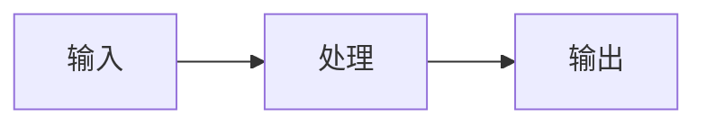
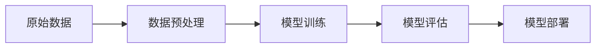

# 从传统编程到AI编程：程序员的进化史

> 关键词：传统编程、AI编程、程序员进化、编程范式转变、人工智能技术、软件开发变革、未来编程趋势

> 摘要：本文全面探讨了从传统编程到AI编程的发展历程，深入剖析了程序员在这一进化过程中所面临的转变、挑战与机遇。详细介绍了传统编程和AI编程的核心概念、算法原理及数学模型，通过项目实战案例展示了两种编程方式的具体应用。同时，阐述了AI编程在不同领域的实际应用场景，推荐了相关的学习资源、开发工具和论文著作。最后，总结了未来编程的发展趋势与挑战，旨在为程序员的职业发展和技术进步提供有价值的参考。

## 1. 背景介绍 
### 1.1 目的和范围
本文旨在梳理从传统编程到AI编程的发展脉络，帮助程序员全面理解这一进化过程，明确不同编程范式的特点和应用场景。通过对核心概念、算法原理、数学模型等方面的深入分析，以及项目实战案例的讲解，使读者能够掌握传统编程和AI编程的关键技术，为在实际工作中灵活运用这些技术提供指导。范围涵盖了传统编程和AI编程的基础知识、技术原理、应用实践以及未来发展趋势等多个方面。

### 1.2 预期读者
本文主要面向广大程序员群体，包括初学者、有一定经验的开发者以及技术管理人员。对于想要了解编程发展趋势、掌握AI编程技术的人员，以及对软件开发变革感兴趣的读者也具有参考价值。

### 1.3 文档结构概述
本文共分为十个部分。第一部分为背景介绍，阐述了文章的目的、范围、预期读者和文档结构概述，并对相关术语进行解释。第二部分介绍核心概念与联系，包括传统编程和AI编程的原理、架构以及两者之间的联系，并通过文本示意图和Mermaid流程图进行展示。第三部分讲解核心算法原理和具体操作步骤，使用Python源代码详细阐述传统编程和AI编程的算法。第四部分介绍数学模型和公式，对相关数学知识进行详细讲解并举例说明。第五部分通过项目实战，展示代码实际案例并进行详细解释说明。第六部分介绍AI编程的实际应用场景。第七部分推荐学习资源、开发工具框架和相关论文著作。第八部分总结未来发展趋势与挑战。第九部分为附录，解答常见问题。第十部分提供扩展阅读和参考资料。

### 1.4 术语表
#### 1.4.1 核心术语定义
- **传统编程**：指基于明确的规则和逻辑，由程序员编写代码来实现特定功能的编程方式。程序的执行流程和结果在很大程度上是可预测的。
- **AI编程**：利用人工智能技术，如机器学习、深度学习等，让计算机通过数据学习和自主决策来实现复杂任务的编程方式。程序的行为和结果具有一定的不确定性和智能性。
- **机器学习**：是AI的一个重要分支，它通过让计算机从数据中学习模式和规律，从而实现预测、分类等任务。
- **深度学习**：一种基于人工神经网络的机器学习方法，通过构建多层神经网络来学习数据的深层次特征。

#### 1.4.2 相关概念解释
- **编程范式**：是指编程的基本风格和方法，常见的编程范式包括面向过程编程、面向对象编程、函数式编程等。传统编程和AI编程在编程范式上存在一定的差异。
- **算法复杂度**：用于衡量算法的效率，包括时间复杂度和空间复杂度。在传统编程和AI编程中，算法复杂度的分析都非常重要。
- **数据预处理**：在AI编程中，数据预处理是指对原始数据进行清洗、转换、归一化等操作，以提高数据的质量和可用性。

#### 1.4.3 缩略词列表
- **API**：Application Programming Interface（应用程序编程接口）
- **CPU**：Central Processing Unit（中央处理器）
- **GPU**：Graphics Processing Unit（图形处理器）
- **ML**：Machine Learning（机器学习）
- **DL**：Deep Learning（深度学习）

## 2. 核心概念与联系 
### 2.1 传统编程的核心概念与架构
传统编程主要基于明确的规则和逻辑，通过编写一系列的指令来实现特定的功能。常见的编程范式包括面向过程编程、面向对象编程和函数式编程。

- **面向过程编程**：将程序看作是一系列的步骤和函数，按照顺序依次执行。程序的主要结构是由函数组成，数据和操作是分离的。
- **面向对象编程**：将数据和操作封装在对象中，通过对象之间的交互来实现程序的功能。面向对象编程具有封装、继承和多态等特性。
- **函数式编程**：将计算看作是函数的求值，避免使用共享状态和可变数据。函数式编程强调函数的纯粹性和不可变性。

传统编程的架构通常包括输入、处理和输出三个部分。输入部分负责接收用户或外部系统提供的数据，处理部分根据预设的规则和逻辑对数据进行处理，输出部分将处理结果返回给用户或外部系统。

**文本示意图**：
```plaintext
输入 --> 处理（函数、对象等） --> 输出
```

**Mermaid流程图**：


### 2.2 AI编程的核心概念与架构
AI编程主要基于人工智能技术，如机器学习和深度学习。其核心概念包括数据、模型和算法。

- **数据**：是AI编程的基础，包括训练数据和测试数据。训练数据用于训练模型，测试数据用于评估模型的性能。
- **模型**：是对数据中模式和规律的抽象表示。常见的模型包括决策树、神经网络等。
- **算法**：用于训练模型和优化模型的参数。常见的算法包括梯度下降、随机森林等。

AI编程的架构通常包括数据预处理、模型训练、模型评估和模型部署四个部分。数据预处理负责对原始数据进行清洗、转换和归一化等操作；模型训练使用预处理后的数据对模型进行训练；模型评估使用测试数据对训练好的模型进行评估；模型部署将训练好的模型应用到实际场景中。

**文本示意图**：
```plaintext
原始数据 --> 数据预处理 --> 模型训练 --> 模型评估 --> 模型部署
```

**Mermaid流程图**：


### 2.3 传统编程与AI编程的联系
传统编程和AI编程并不是相互独立的，而是存在着密切的联系。

- **传统编程是AI编程的基础**：AI编程需要使用传统编程的技术来实现数据处理、模型训练和模型部署等功能。例如，在Python中使用传统的编程语句来读取数据、定义模型结构和编写训练循环。
- **AI编程扩展了传统编程的能力**：AI编程可以处理复杂的任务，如图像识别、自然语言处理等，这些任务使用传统编程很难实现。通过使用AI技术，程序员可以让计算机自动学习和适应新的数据和任务。
- **两者相互促进发展**：传统编程的发展为AI编程提供了更好的开发环境和工具，而AI编程的发展也为传统编程带来了新的思路和方法。例如，AI技术可以用于优化传统编程中的算法和代码。

## 3. 核心算法原理 & 具体操作步骤 
### 3.1 传统编程的核心算法原理及Python实现
#### 3.1.1 排序算法 - 冒泡排序
冒泡排序是一种简单的排序算法，它重复地走访过要排序的数列，一次比较两个元素，如果它们的顺序错误就把它们交换过来。走访数列的工作是重复地进行直到没有再需要交换，也就是说该数列已经排序完成。

**算法原理**：
1. 比较相邻的元素。如果顺序错误就把它们交换过来。
2. 对每一对相邻元素作同样的工作，从开始第一对到结尾的最后一对。这步做完后，最后的元素会是最大的数。
3. 针对所有的元素重复以上的步骤，除了最后一个。
4. 持续每次对越来越少的元素重复上面的步骤，直到没有任何一对数字需要比较。

**Python代码实现**：
```python
def bubble_sort(arr):
    n = len(arr)
    for i in range(n):
        for j in range(0, n - i - 1):
            if arr[j] > arr[j + 1]:
                arr[j], arr[j + 1] = arr[j + 1], arr[j]
    return arr

# 测试代码
arr = [64, 34, 25, 12, 22, 11, 90]
sorted_arr = bubble_sort(arr)
print("排序后的数组:", sorted_arr)
```

#### 3.1.2 搜索算法 - 二分搜索
二分搜索是一种在有序数组中查找某一特定元素的搜索算法。搜索过程从数组的中间元素开始，如果中间元素正好是要查找的元素，则搜索过程结束；如果某一特定元素大于或者小于中间元素，则在数组大于或小于中间元素的那一半中查找，而且跟开始一样从中间元素开始比较。如果在某一步骤数组为空，则代表找不到。

**算法原理**：
1. 确定数组的中间位置。
2. 比较中间位置的元素与目标元素的大小。
3. 如果中间元素等于目标元素，则返回中间位置的索引。
4. 如果中间元素大于目标元素，则在数组的左半部分继续搜索。
5. 如果中间元素小于目标元素，则在数组的右半部分继续搜索。
6. 重复步骤1 - 5，直到找到目标元素或数组为空。

**Python代码实现**：
```python
def binary_search(arr, target):
    left, right = 0, len(arr) - 1
    while left <= right:
        mid = (left + right) // 2
        if arr[mid] == target:
            return mid
        elif arr[mid] < target:
            left = mid + 1
        else:
            right = mid - 1
    return -1

# 测试代码
arr = [1, 2, 3, 4, 5, 6, 7, 8, 9]
target = 5
index = binary_search(arr, target)
if index != -1:
    print("目标元素在数组中的索引为:", index)
else:
    print("目标元素不在数组中")
```

### 3.2 AI编程的核心算法原理及Python实现
#### 3.2.1 机器学习 - 线性回归
线性回归是一种用于预测连续数值的机器学习算法。它假设因变量与自变量之间存在线性关系，通过最小化误差的平方和来确定最佳的回归系数。

**算法原理**：
线性回归的模型可以表示为 $y = \theta_0 + \theta_1x_1 + \theta_2x_2 + \cdots + \theta_nx_n$，其中 $y$ 是因变量，$x_1, x_2, \cdots, x_n$ 是自变量，$\theta_0, \theta_1, \cdots, \theta_n$ 是回归系数。目标是找到一组最佳的回归系数，使得预测值与真实值之间的误差平方和最小。

**Python代码实现**：
```python
import numpy as np
from sklearn.linear_model import LinearRegression

# 生成一些示例数据
X = np.array([[1], [2], [3], [4], [5]])
y = np.array([2, 4, 6, 8, 10])

# 创建线性回归模型
model = LinearRegression()

# 训练模型
model.fit(X, y)

# 预测新数据
new_X = np.array([[6]])
prediction = model.predict(new_X)
print("预测值:", prediction)
```

#### 3.2.2 深度学习 - 简单的神经网络
神经网络是一种模仿人类神经系统的机器学习模型，由输入层、隐藏层和输出层组成。每个神经元接收输入信号，经过加权求和和激活函数处理后，输出信号传递给下一层的神经元。

**算法原理**：
神经网络的训练过程主要包括前向传播和反向传播。前向传播是指输入数据从输入层经过隐藏层传递到输出层，得到预测值；反向传播是指根据预测值与真实值之间的误差，计算每个神经元的梯度，然后更新神经元的权重和偏置。

**Python代码实现**：
```python
import numpy as np

# 定义激活函数 - sigmoid函数
def sigmoid(x):
    return 1 / (1 + np.exp(-x))

# 定义神经网络类
class NeuralNetwork:
    def __init__(self, input_size, hidden_size, output_size):
        self.input_size = input_size
        self.hidden_size = hidden_size
        self.output_size = output_size
        
        # 初始化权重
        self.W1 = np.random.randn(self.input_size, self.hidden_size)
        self.b1 = np.zeros((1, self.hidden_size))
        self.W2 = np.random.randn(self.hidden_size, self.output_size)
        self.b2 = np.zeros((1, self.output_size))
        
    def forward(self, X):
        # 前向传播
        self.z1 = np.dot(X, self.W1) + self.b1
        self.a1 = sigmoid(self.z1)
        self.z2 = np.dot(self.a1, self.W2) + self.b2
        self.a2 = sigmoid(self.z2)
        return self.a2
    
    def backward(self, X, y, output):
        # 反向传播
        self.error = y - output
        self.delta2 = self.error * (output * (1 - output))
        self.d_W2 = np.dot(self.a1.T, self.delta2)
        self.d_b2 = np.sum(self.delta2, axis=0, keepdims=True)
        self.delta1 = np.dot(self.delta2, self.W2.T) * (self.a1 * (1 - self.a1))
        self.d_W1 = np.dot(X.T, self.delta1)
        self.d_b1 = np.sum(self.delta1, axis=0, keepdims=True)
        
    def update_weights(self, learning_rate):
        # 更新权重
        self.W1 += learning_rate * self.d_W1
        self.b1 += learning_rate * self.d_b1
        self.W2 += learning_rate * self.d_W2
        self.b2 += learning_rate * self.d_b2

# 示例数据
X = np.array([[0, 0], [0, 1], [1, 0], [1, 1]])
y = np.array([[0], [1], [1], [0]])

# 创建神经网络模型
nn = NeuralNetwork(input_size=2, hidden_size=2, output_size=1)

# 训练模型
learning_rate = 0.1
for i in range(10000):
    output = nn.forward(X)
    nn.backward(X, y, output)
    nn.update_weights(learning_rate)

# 预测
predictions = nn.forward(X)
print("预测结果:", predictions)
```

## 4. 数学模型和公式 & 详细讲解 & 举例说明 
### 4.1 传统编程中的数学模型和公式
#### 4.1.1 时间复杂度和空间复杂度
时间复杂度和空间复杂度是衡量算法效率的重要指标。

- **时间复杂度**：表示算法执行所需要的时间与输入规模之间的关系。常见的时间复杂度有 $O(1)$、$O(log n)$、$O(n)$、$O(n log n)$、$O(n^2)$ 等。例如，冒泡排序的时间复杂度为 $O(n^2)$，二分搜索的时间复杂度为 $O(log n)$。
- **空间复杂度**：表示算法执行所需要的额外存储空间与输入规模之间的关系。常见的空间复杂度有 $O(1)$、$O(n)$ 等。例如，冒泡排序的空间复杂度为 $O(1)$，因为它只需要常数级的额外存储空间。

#### 4.1.2 图论中的最短路径算法 - Dijkstra算法
Dijkstra算法是一种用于计算图中某个节点到其他所有节点的最短路径的算法。

**数学模型**：
设图 $G = (V, E)$，其中 $V$ 是节点集合，$E$ 是边集合。每条边 $(u, v) \in E$ 有一个非负的权重 $w(u, v)$。设 $s$ 是源节点，$d[v]$ 表示从源节点 $s$ 到节点 $v$ 的最短路径长度。

**算法步骤**：
1. 初始化：将所有节点的 $d[v]$ 初始化为无穷大，$d[s] = 0$。
2. 选择一个未访问的节点 $u$，使得 $d[u]$ 最小。
3. 对于 $u$ 的所有邻接节点 $v$，更新 $d[v] = min(d[v], d[u] + w(u, v))$。
4. 标记节点 $u$ 为已访问。
5. 重复步骤2 - 4，直到所有节点都被访问。

### 4.2 AI编程中的数学模型和公式
#### 4.2.1 机器学习 - 逻辑回归
逻辑回归是一种用于分类的机器学习算法，它通过逻辑函数将线性回归的输出映射到 $[0, 1]$ 之间，用于表示样本属于某个类别的概率。

**数学模型**：
逻辑回归的模型可以表示为 $P(y = 1|x) = \frac{1}{1 + e^{-z}}$，其中 $z = \theta_0 + \theta_1x_1 + \theta_2x_2 + \cdots + \theta_nx_n$，$P(y = 1|x)$ 表示样本 $x$ 属于类别1的概率。

**损失函数**：
逻辑回归的损失函数通常使用对数损失函数，也称为交叉熵损失函数。对于单个样本 $(x, y)$，损失函数为 $L(\theta) = -y \log(P(y = 1|x)) - (1 - y) \log(1 - P(y = 1|x))$。对于整个数据集，损失函数为 $J(\theta) = \frac{1}{m} \sum_{i = 1}^{m} L(\theta^{(i)})$，其中 $m$ 是样本数量。

#### 4.2.2 深度学习 - 卷积神经网络（CNN）
卷积神经网络是一种专门用于处理具有网格结构数据（如图像）的深度学习模型。它主要由卷积层、池化层和全连接层组成。

**卷积操作**：
卷积操作是CNN的核心操作，它通过卷积核在输入数据上滑动，进行卷积运算，提取数据的特征。设输入数据为 $X$，卷积核为 $W$，输出特征图为 $Y$，则卷积操作可以表示为 $Y(i, j) = \sum_{m = 0}^{M - 1} \sum_{n = 0}^{N - 1} X(i + m, j + n) W(m, n)$，其中 $M$ 和 $N$ 是卷积核的大小。

**池化操作**：
池化操作用于减少特征图的尺寸，同时保留重要的特征信息。常见的池化操作有最大池化和平均池化。最大池化操作选择每个池化窗口中的最大值作为输出，平均池化操作选择每个池化窗口中的平均值作为输出。

## 5. 项目实战：代码实际案例和详细解释说明 
### 5.1  开发环境搭建
#### 5.1.1 传统编程开发环境搭建（以Python为例）
- **安装Python**：从Python官方网站（https://www.python.org/downloads/） 下载并安装Python 3.x版本。
- **安装集成开发环境（IDE）**：推荐使用PyCharm或VS Code。PyCharm是一款专门为Python开发设计的IDE，提供了丰富的功能和工具；VS Code是一款轻量级的代码编辑器，通过安装Python扩展可以实现Python开发的功能。
- **安装必要的库**：根据项目需求安装相应的Python库，如`numpy`、`pandas`等。可以使用`pip`命令进行安装，例如：`pip install numpy pandas`。

#### 5.1.2 AI编程开发环境搭建（以Python和TensorFlow为例）
- **安装Python**：同样从Python官方网站下载并安装Python 3.x版本。
- **安装深度学习框架**：推荐使用TensorFlow或PyTorch。以TensorFlow为例，可以使用`pip`命令进行安装：`pip install tensorflow`。
- **安装相关库**：安装`matplotlib`用于数据可视化，`scikit-learn`用于机器学习相关任务等。例如：`pip install matplotlib scikit-learn`。

### 5.2  源代码详细实现和代码解读
#### 5.2.1 传统编程项目 - 学生成绩管理系统
**需求分析**：该系统用于管理学生的成绩信息，包括添加学生信息、查询学生成绩、修改学生成绩和删除学生信息等功能。

**代码实现**：
```python
# 定义学生类
class Student:
    def __init__(self, id, name, score):
        self.id = id
        self.name = name
        self.score = score

# 定义学生成绩管理系统类
class StudentScoreManagementSystem:
    def __init__(self):
        self.students = []

    def add_student(self, student):
        self.students.append(student)
        print("学生信息添加成功！")

    def query_student(self, id):
        for student in self.students:
            if student.id == id:
                print(f"学生ID: {student.id}, 姓名: {student.name}, 成绩: {student.score}")
                return
        print("未找到该学生信息！")

    def modify_student_score(self, id, new_score):
        for student in self.students:
            if student.id == id:
                student.score = new_score
                print("学生成绩修改成功！")
                return
        print("未找到该学生信息！")

    def delete_student(self, id):
        for student in self.students:
            if student.id == id:
                self.students.remove(student)
                print("学生信息删除成功！")
                return
        print("未找到该学生信息！")

# 主程序
if __name__ == "__main__":
    system = StudentScoreManagementSystem()

    while True:
        print("\n学生成绩管理系统")
        print("1. 添加学生信息")
        print("2. 查询学生成绩")
        print("3. 修改学生成绩")
        print("4. 删除学生信息")
        print("5. 退出系统")

        choice = input("请输入你的选择: ")

        if choice == "1":
            id = input("请输入学生ID: ")
            name = input("请输入学生姓名: ")
            score = float(input("请输入学生成绩: "))
            student = Student(id, name, score)
            system.add_student(student)
        elif choice == "2":
            id = input("请输入要查询的学生ID: ")
            system.query_student(id)
        elif choice == "3":
            id = input("请输入要修改成绩的学生ID: ")
            new_score = float(input("请输入新的成绩: "))
            system.modify_student_score(id, new_score)
        elif choice == "4":
            id = input("请输入要删除的学生ID: ")
            system.delete_student(id)
        elif choice == "5":
            print("退出系统！")
            break
        else:
            print("无效的选择，请重新输入！")
```

**代码解读**：
- `Student`类用于表示学生信息，包含学生的ID、姓名和成绩。
- `StudentScoreManagementSystem`类用于管理学生成绩信息，包含添加学生信息、查询学生成绩、修改学生成绩和删除学生信息等方法。
- 主程序通过一个无限循环，根据用户的输入调用相应的方法，实现学生成绩管理系统的功能。

#### 5.2.2 AI编程项目 - 手写数字识别
**需求分析**：该项目使用深度学习模型对MNIST手写数字数据集进行训练，实现对手写数字的识别。

**代码实现**：
```python
import tensorflow as tf
from tensorflow.keras.datasets import mnist
from tensorflow.keras.models import Sequential
from tensorflow.keras.layers import Flatten, Dense
from tensorflow.keras.utils import to_categorical
import matplotlib.pyplot as plt

# 加载MNIST数据集
(x_train, y_train), (x_test, y_test) = mnist.load_data()

# 数据预处理
x_train = x_train / 255.0
x_test = x_test / 255.0

y_train = to_categorical(y_train)
y_test = to_categorical(y_test)

# 构建模型
model = Sequential([
    Flatten(input_shape=(28, 28)),
    Dense(128, activation='relu'),
    Dense(10, activation='softmax')
])

# 编译模型
model.compile(optimizer='adam',
              loss='categorical_crossentropy',
              metrics=['accuracy'])

# 训练模型
history = model.fit(x_train, y_train, epochs=10, validation_data=(x_test, y_test))

# 评估模型
test_loss, test_acc = model.evaluate(x_test, y_test)
print(f"测试集损失: {test_loss}, 测试集准确率: {test_acc}")

# 可视化训练过程
plt.plot(history.history['accuracy'])
plt.plot(history.history['val_accuracy'])
plt.title('Model accuracy')
plt.ylabel('Accuracy')
plt.xlabel('Epoch')
plt.legend(['Train', 'Test'], loc='upper left')
plt.show()

plt.plot(history.history['loss'])
plt.plot(history.history['val_loss'])
plt.title('Model loss')
plt.ylabel('Loss')
plt.xlabel('Epoch')
plt.legend(['Train', 'Test'], loc='upper left')
plt.show()
```

**代码解读**：
- 加载MNIST数据集，该数据集包含60000个训练样本和10000个测试样本。
- 对数据进行预处理，将像素值归一化到 $[0, 1]$ 之间，并将标签进行one - hot编码。
- 构建一个简单的神经网络模型，包含一个Flatten层、一个全连接层和一个输出层。
- 编译模型，指定优化器、损失函数和评估指标。
- 训练模型，并记录训练过程中的准确率和损失值。
- 评估模型在测试集上的性能。
- 使用`matplotlib`库可视化训练过程中的准确率和损失值的变化。

### 5.3  代码解读与分析
#### 5.3.1 传统编程项目分析
- **优点**：代码结构清晰，逻辑明确，易于理解和维护。通过面向对象的编程思想，将学生信息和管理功能封装在类中，提高了代码的可复用性和可扩展性。
- **缺点**：该系统是一个简单的控制台程序，没有图形用户界面，用户体验较差。并且数据是存储在内存中的，程序退出后数据会丢失，没有实现数据的持久化。

#### 5.3.2 AI编程项目分析
- **优点**：使用深度学习模型可以自动学习手写数字的特征，具有较高的识别准确率。通过可视化训练过程，可以直观地观察模型的训练效果，方便调整模型参数。
- **缺点**：模型的训练时间较长，需要大量的计算资源。并且模型的可解释性较差，很难理解模型是如何做出决策的。

## 6. 实际应用场景 
### 6.1 传统编程的应用场景
- **系统软件开发**：如操作系统、数据库管理系统等。传统编程可以直接与计算机硬件进行交互，实现高效的系统管理和资源分配。
- **嵌入式系统开发**：在智能家电、汽车电子、工业控制等领域，传统编程可以实现对硬件设备的精确控制和实时处理。
- **企业级应用开发**：如企业资源规划（ERP）系统、客户关系管理（CRM）系统等。传统编程可以满足企业对数据安全、业务逻辑复杂等方面的需求。

### 6.2 AI编程的应用场景
- **图像识别**：在安防监控、自动驾驶、医学影像分析等领域，AI编程可以实现对图像中的目标物体进行识别和分类。
- **自然语言处理**：在智能客服、机器翻译、文本生成等领域，AI编程可以实现人与计算机之间的自然语言交互。
- **推荐系统**：在电商、社交、新闻等领域，AI编程可以根据用户的行为和偏好，为用户推荐个性化的内容和商品。

## 7. 工具和资源推荐
### 7.1 学习资源推荐
#### 7.1.1 书籍推荐
- **传统编程**：《Python编程：从入门到实践》《Effective Java》《C++ Primer》等。
- **AI编程**：《深度学习》（花书）、《Python机器学习》、《动手学深度学习》等。

#### 7.1.2 在线课程
- **传统编程**：Coursera上的“Python for Everybody”、edX上的“Introduction to Java Programming”等。
- **AI编程**：吴恩达的“Machine Learning”课程、DeepLearning.ai的“Deep Learning Specialization”课程等。

#### 7.1.3 技术博客和网站
- **传统编程**：Stack Overflow、CSDN、博客园等。
- **AI编程**：Medium上的AI相关博客、Kaggle社区等。

### 7.2 开发工具框架推荐
#### 7.2.1 IDE和编辑器
- **传统编程**：PyCharm、Visual Studio、Eclipse等。
- **AI编程**：Jupyter Notebook、Google Colab、PyTorch Lightning等。

#### 7.2.2 调试和性能分析工具
- **传统编程**：GDB、Visual Studio Profiler等。
- **AI编程**：TensorBoard、PyTorch Profiler等。

#### 7.2.3 相关框架和库
- **传统编程**：`numpy`、`pandas`、`Django`等。
- **AI编程**：`TensorFlow`、`PyTorch`、`Scikit - learn`等。

### 7.3 相关论文著作推荐
#### 7.3.1 经典论文
- **传统编程**：Edsger W. Dijkstra的“Go To Statement Considered Harmful”。
- **AI编程**：Yoshua Bengio、Geoffrey Hinton和Yann LeCun的“Deep Learning”（Nature杂志）。

#### 7.3.2 最新研究成果
- **传统编程**：关注ACM SIGPLAN等会议的最新研究成果。
- **AI编程**：关注NeurIPS、ICML、CVPR等会议的最新研究成果。

#### 7.3.3 应用案例分析
- **传统编程**：可以参考一些开源项目的文档和代码，了解实际应用中的编程技巧和最佳实践。
- **AI编程**：Kaggle上的各种竞赛案例和解决方案，以及各大科技公司的AI应用案例。

## 8. 总结：未来发展趋势与挑战
### 8.1 未来发展趋势
- **融合发展**：传统编程和AI编程将越来越紧密地融合在一起。传统编程为AI编程提供基础的开发环境和工具，AI编程为传统编程带来新的思路和方法。例如，在软件开发中，使用AI技术进行代码生成、代码优化和缺陷检测等。
- **自动化和智能化**：未来的编程将越来越自动化和智能化。程序员可以使用AI工具自动生成代码、进行代码调试和优化，提高开发效率和代码质量。同时，AI系统可以自动学习和适应新的数据和任务，实现自主决策和优化。
- **跨领域应用**：AI编程将在更多的领域得到应用，如医疗、教育、金融等。通过结合不同领域的知识和数据，开发出更加智能和高效的应用系统。

### 8.2 挑战
- **技术更新换代快**：AI技术发展迅速，新的算法和模型不断涌现。程序员需要不断学习和更新自己的知识，跟上技术发展的步伐。
- **数据安全和隐私问题**：AI编程需要大量的数据进行训练，这些数据可能包含用户的敏感信息。如何保障数据的安全和隐私是一个重要的挑战。
- **伦理和道德问题**：随着AI系统的广泛应用，伦理和道德问题也越来越受到关注。例如，AI系统的决策可能会对人类产生影响，如何确保AI系统的决策是公正和合理的是一个亟待解决的问题。

## 9. 附录：常见问题与解答
### 9.1 传统编程和AI编程哪个更难学？
传统编程和AI编程都有其难度所在。传统编程需要掌握编程语言的语法和编程范式，理解计算机的底层原理。AI编程需要掌握机器学习、深度学习等相关知识，理解复杂的数学模型和算法。对于初学者来说，传统编程可能更容易入门，而AI编程需要有一定的数学基础和编程经验。

### 9.2 AI编程是否会取代传统编程？
AI编程不会取代传统编程。虽然AI编程可以处理一些复杂的任务，但传统编程在系统软件开发、嵌入式系统开发等领域仍然具有不可替代的作用。并且，AI编程需要使用传统编程的技术来实现数据处理、模型训练和模型部署等功能。两者将相互补充，共同发展。

### 9.3 学习AI编程需要具备哪些数学知识？
学习AI编程需要具备一定的数学知识，主要包括线性代数、概率论与数理统计、微积分等。线性代数用于处理矩阵和向量的运算，概率论与数理统计用于处理数据的概率分布和统计特征，微积分用于优化模型的参数。

## 10. 扩展阅读 & 参考资料
- 《计算机程序的构造和解释》
- 《人工智能：一种现代的方法》
- 相关的学术论文和研究报告，如IEEE、ACM等会议和期刊上的文章。
- 各大科技公司的官方博客和技术文档，如Google AI Blog、Facebook AI Research等。