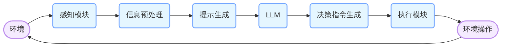

# 从零构建 AI Agent：LLM 大模型应用开发实践

> 关键词：AI Agent、LLM 大模型、应用开发、智能体、实践

> 摘要：本文旨在深入探讨从零开始构建 AI Agent 的 LLM 大模型应用开发实践。首先介绍相关背景知识，包括目的、预期读者等内容。接着详细阐述核心概念与联系，深入剖析核心算法原理并给出具体操作步骤，同时借助数学模型和公式进行理论支持。通过项目实战展示代码实际案例及详细解释，分析其在实际应用场景中的表现。还推荐了一系列学习资源、开发工具框架以及相关论文著作。最后总结未来发展趋势与挑战，并给出常见问题解答和扩展阅读参考资料，帮助读者全面掌握构建 AI Agent 的开发实践要点。

## 1. 背景介绍 
### 1.1 目的和范围
随着人工智能技术的飞速发展，AI Agent 作为一种能够自主感知环境、决策并执行任务的智能实体，在各个领域展现出巨大的应用潜力。LLM（大语言模型）的出现为 AI Agent 的发展提供了强大的语言处理能力。本实践的目的在于引导开发者从零开始构建一个基于 LLM 的 AI Agent，涵盖从理论基础到实际开发的全过程。范围包括核心概念的介绍、算法原理的讲解、数学模型的分析、项目实战的演练以及实际应用场景的探讨等。

### 1.2 预期读者
本文预期读者主要包括对人工智能、自然语言处理有一定了解的开发者、研究人员以及对 AI Agent 技术感兴趣的爱好者。具备基本的编程知识（如 Python 基础）将有助于更好地理解和实践文中的内容。

### 1.3 文档结构概述
本文将按照以下结构展开：首先介绍背景知识，让读者了解实践的目的和相关概念；接着阐述核心概念与联系，帮助读者建立清晰的知识体系；然后深入讲解核心算法原理并给出具体操作步骤，通过 Python 代码详细展示；之后介绍数学模型和公式，为算法提供理论支持；通过项目实战部分展示代码实际案例并进行详细解释；分析实际应用场景；推荐相关的学习资源、开发工具框架和论文著作；最后总结未来发展趋势与挑战，给出常见问题解答和扩展阅读参考资料。

### 1.4 术语表
#### 1.4.1 核心术语定义
- **AI Agent（人工智能智能体）**：是一种能够感知环境、根据感知信息进行决策并执行相应动作的智能实体。它可以与环境进行交互，以实现特定的目标。
- **LLM（大语言模型）**：是基于深度学习的语言模型，通常具有大量的参数和强大的语言理解与生成能力，如 GPT 系列、BERT 等。
- **智能体架构**：指 AI Agent 的整体结构和组成部分，包括感知模块、决策模块、执行模块等。
- **提示工程**：是一种通过设计合适的输入提示来引导 LLM 产生期望输出的技术。

#### 1.4.2 相关概念解释
- **环境**：AI Agent 所处的外部世界，它可以是虚拟的（如游戏环境）或现实的（如智能客服系统的用户交互环境）。
- **状态**：环境在某一时刻的描述，AI Agent 根据当前状态进行决策。
- **动作**：AI Agent 可以执行的操作，用于改变环境状态。
- **奖励**：是环境对 AI Agent 执行动作的反馈，用于评估动作的好坏，引导智能体学习最优策略。

#### 1.4.3 缩略词列表
- **LLM**：Large Language Model（大语言模型）
- **API**：Application Programming Interface（应用程序编程接口）
- **RL**：Reinforcement Learning（强化学习）
- **NLP**：Natural Language Processing（自然语言处理）

## 2. 核心概念与联系 
### 核心概念原理
AI Agent 是人工智能领域的一个重要概念，它模拟了人类在环境中的行为模式。一个典型的 AI Agent 由感知模块、决策模块和执行模块组成。感知模块负责收集环境信息，决策模块根据感知到的信息进行推理和决策，执行模块则将决策转化为具体的动作。

LLM 在 AI Agent 中扮演着重要的角色，它可以为决策模块提供强大的语言理解和生成能力。通过提示工程，我们可以引导 LLM 对感知到的信息进行分析，并生成合适的决策指令。

### 架构的文本示意图
AI Agent 基于 LLM 的架构可以描述如下：

环境通过传感器向 AI Agent 的感知模块提供信息。感知模块对信息进行预处理，将其转化为适合 LLM 处理的格式。然后将处理后的信息作为提示输入到 LLM 中。LLM 根据提示生成决策指令，决策指令被发送到执行模块。执行模块根据指令对环境进行操作，环境的状态发生改变后，又会产生新的信息，从而形成一个闭环的交互过程。

### Mermaid 流程图


## 3. 核心算法原理 & 具体操作步骤 
### 核心算法原理
在构建基于 LLM 的 AI Agent 中，主要涉及到提示工程和简单的决策算法。提示工程的目的是设计合适的输入提示，让 LLM 能够更好地理解任务并生成准确的决策指令。

以下是一个简单的决策算法示例，假设我们的 AI Agent 是一个智能客服，需要根据用户的问题进行回答。我们可以通过以下步骤实现：

1. 接收用户问题作为感知信息。
2. 对用户问题进行预处理，如去除多余的符号、进行分词等。
3. 生成提示，提示中包含问题和一些引导性的信息，如要求 LLM 给出准确、简洁的回答。
4. 将提示输入到 LLM 中，获取 LLM 的输出。
5. 对 LLM 的输出进行后处理，如格式调整、内容筛选等，得到最终的回答。

### 具体操作步骤及 Python 源代码
以下是一个简单的 Python 代码示例，使用 OpenAI 的 GPT 模型作为 LLM 进行智能客服的模拟：

```python
import openai

# 设置 OpenAI API 密钥
openai.api_key = "your_api_key"

def preprocess_question(question):
    """
    预处理用户问题
    """
    # 去除多余的空格
    question = question.strip()
    return question

def generate_prompt(question):
    """
    生成提示
    """
    prompt = f"用户问题：{question}\n请给出准确、简洁的回答。"
    return prompt

def get_llm_response(prompt):
    """
    获取 LLM 的输出
    """
    try:
        response = openai.Completion.create(
            engine="text-davinci-003",
            prompt=prompt,
            max_tokens=100,
            temperature=0.2
        )
        answer = response.choices[0].text.strip()
        return answer
    except Exception as e:
        print(f"请求 LLM 时出错：{e}")
        return "抱歉，暂时无法回答。"

def postprocess_answer(answer):
    """
    后处理回答
    """
    # 简单的格式调整，去除多余的换行符
    answer = answer.replace("\n", " ")
    return answer

def run_chatbot():
    while True:
        question = input("请输入你的问题（输入 '退出' 结束对话）：")
        if question == "退出":
            break
        question = preprocess_question(question)
        prompt = generate_prompt(question)
        answer = get_llm_response(prompt)
        answer = postprocess_answer(answer)
        print(f"客服回答：{answer}")

if __name__ == "__main__":
    run_chatbot()
```

### 代码解释
- `preprocess_question` 函数：对用户输入的问题进行预处理，去除多余的空格。
- `generate_prompt` 函数：根据用户问题生成提示，提示中包含问题和引导性信息。
- `get_llm_response` 函数：使用 OpenAI 的 API 向 LLM 发送提示，获取输出结果。
- `postprocess_answer` 函数：对 LLM 的输出进行后处理，去除多余的换行符。
- `run_chatbot` 函数：实现一个简单的对话循环，不断接收用户问题并给出回答，直到用户输入“退出”。

## 4. 数学模型和公式 & 详细讲解 & 举例说明 
### 数学模型
在基于 LLM 的 AI Agent 中，虽然 LLM 本身的训练过程涉及到复杂的深度学习模型，但在应用层面，我们可以使用简单的概率模型来描述决策过程。

假设我们有一个状态空间 $S$ 表示环境的所有可能状态，动作空间 $A$ 表示 AI Agent 可以执行的所有动作。对于给定的状态 $s \in S$，AI Agent 选择动作 $a \in A$ 的概率可以表示为 $P(a|s)$。

### 公式
在简单的决策场景中，我们可以使用最大概率决策规则，即选择使 $P(a|s)$ 最大的动作：

$$a^* = \arg\max_{a \in A} P(a|s)$$

其中 $a^*$ 表示最优动作。

### 详细讲解
在实际应用中，$P(a|s)$ 可以通过 LLM 的输出进行估计。例如，在智能客服场景中，状态 $s$ 可以表示用户的问题，动作 $a$ 可以表示客服的回答。LLM 会根据输入的问题生成多个可能的回答，我们可以通过一些方法（如计算回答的置信度）来估计每个回答的概率 $P(a|s)$，然后选择概率最大的回答作为最终的动作。

### 举例说明
假设用户的问题是“如何安装软件？”，LLM 生成了三个可能的回答：
- 回答 1：“先下载安装包，然后双击运行。”
- 回答 2：“在应用商店中搜索并安装。”
- 回答 3：“不清楚，建议查看官方网站。”

通过某种方法（如统计历史数据中类似问题的回答准确率），我们估计这三个回答的概率分别为 $P(回答 1|问题) = 0.6$，$P(回答 2|问题) = 0.3$，$P(回答 3|问题) = 0.1$。根据最大概率决策规则，我们选择回答 1 作为最终的动作，因为它的概率最大。

## 5. 项目实战：代码实际案例和详细解释说明 
### 5.1  开发环境搭建
#### 操作系统
本项目可以在多种操作系统上进行开发，如 Windows、Linux（Ubuntu 等）、macOS。

#### Python 环境
建议使用 Python 3.7 及以上版本。可以从 Python 官方网站（https://www.python.org/downloads/） 下载并安装。

#### 依赖库安装
使用 `pip` 安装所需的依赖库，主要包括 `openai` 库：
```sh
pip install openai
```

#### API 密钥获取
如果使用 OpenAI 的 LLM，需要在 OpenAI 官网（https://platform.openai.com/） 注册并获取 API 密钥。将获取到的 API 密钥替换代码中的 `"your_api_key"`。

### 5.2  源代码详细实现和代码解读
以下是一个扩展的智能客服项目代码示例，增加了用户历史问题记录和回答的分类功能：

```python
import openai

# 设置 OpenAI API 密钥
openai.api_key = "your_api_key"

# 存储用户历史问题和回答
user_history = []

def preprocess_question(question):
    """
    预处理用户问题
    """
    question = question.strip()
    return question

def generate_prompt(question, history):
    """
    生成提示，包含用户历史问题和回答
    """
    history_text = ""
    for q, a in history:
        history_text += f"用户问题：{q}\n客服回答：{a}\n"
    prompt = f"{history_text}用户问题：{question}\n请给出准确、简洁的回答。"
    return prompt

def get_llm_response(prompt):
    """
    获取 LLM 的输出
    """
    try:
        response = openai.Completion.create(
            engine="text-davinci-003",
            prompt=prompt,
            max_tokens=100,
            temperature=0.2
        )
        answer = response.choices[0].text.strip()
        return answer
    except Exception as e:
        print(f"请求 LLM 时出错：{e}")
        return "抱歉，暂时无法回答。"

def postprocess_answer(answer):
    """
    后处理回答
    """
    answer = answer.replace("\n", " ")
    return answer

def classify_answer(answer):
    """
    简单的回答分类，这里以是否包含特定关键词为例
    """
    if "下载" in answer:
        return "下载类回答"
    elif "安装" in answer:
        return "安装类回答"
    else:
        return "其他类回答"

def run_chatbot():
    while True:
        question = input("请输入你的问题（输入 '退出' 结束对话）：")
        if question == "退出":
            break
        question = preprocess_question(question)
        prompt = generate_prompt(question, user_history)
        answer = get_llm_response(prompt)
        answer = postprocess_answer(answer)
        answer_type = classify_answer(answer)
        print(f"客服回答：{answer}")
        print(f"回答类型：{answer_type}")
        user_history.append((question, answer))

if __name__ == "__main__":
    run_chatbot()
```

### 5.3  代码解读与分析
- `user_history` 列表：用于存储用户的历史问题和对应的回答，以便在生成提示时提供更多的上下文信息。
- `generate_prompt` 函数：在生成提示时，将用户的历史问题和回答添加到提示中，让 LLM 能够更好地理解对话的上下文。
- `classify_answer` 函数：简单地对回答进行分类，根据回答中是否包含特定关键词（如“下载”、“安装”）来判断回答的类型。
- `run_chatbot` 函数：在循环中不断接收用户问题，生成提示，获取 LLM 的回答，进行后处理和分类，并将问题和回答添加到历史记录中。

通过这种方式，我们可以让智能客服更好地理解用户的意图，并对回答进行分类管理。

## 6. 实际应用场景 
### 智能客服
在智能客服场景中，AI Agent 可以根据用户的问题快速生成准确的回答，提高客服效率和服务质量。通过不断学习用户的历史问题和回答，AI Agent 可以更好地理解用户需求，提供个性化的服务。

### 智能助手
智能助手可以帮助用户完成各种任务，如日程安排、信息查询、文件处理等。AI Agent 可以根据用户的语音或文本指令，调用相应的功能模块，实现任务的自动化执行。

### 游戏 AI
在游戏中，AI Agent 可以作为游戏角色的智能控制者，根据游戏环境的变化做出决策，与玩家进行互动。例如，在策略游戏中，AI Agent 可以制定战略、指挥部队行动。

### 教育辅导
AI Agent 可以作为教育辅导工具，根据学生的问题提供知识点讲解、解题思路等。通过与学生的互动，AI Agent 可以了解学生的学习情况，提供个性化的学习建议。

## 7. 工具和资源推荐
### 7.1 学习资源推荐
#### 7.1.1 书籍推荐
- 《人工智能：一种现代的方法》：全面介绍了人工智能的基本概念、算法和应用，是人工智能领域的经典教材。
- 《Python 自然语言处理》：详细讲解了使用 Python 进行自然语言处理的技术和方法，适合初学者入门。
- 《深度学习》：深入介绍了深度学习的理论和实践，对于理解 LLM 的原理有很大帮助。

#### 7.1.2 在线课程
- Coursera 上的“人工智能基础”课程：由知名高校教授授课，系统地介绍了人工智能的基础知识。
- edX 上的“自然语言处理”课程：提供了丰富的自然语言处理案例和实践项目。
- 吴恩达的“深度学习专项课程”：深入讲解了深度学习的核心技术和应用。

#### 7.1.3 技术博客和网站
- Medium：上面有很多关于人工智能、自然语言处理的技术文章和案例分享。
- arXiv：提供了大量的学术论文，包括最新的 LLM 研究成果。
- 机器之心：专注于人工智能领域的资讯和技术解读。

### 7.2 开发工具框架推荐
#### 7.2.1 IDE和编辑器
- PyCharm：功能强大的 Python 集成开发环境，提供代码编辑、调试、版本控制等功能。
- Visual Studio Code：轻量级的代码编辑器，支持多种编程语言和插件扩展。

#### 7.2.2 调试和性能分析工具
- PDB：Python 自带的调试工具，可以帮助开发者定位代码中的问题。
- cProfile：Python 标准库中的性能分析工具，用于分析代码的性能瓶颈。

#### 7.2.3 相关框架和库
- Hugging Face Transformers：提供了丰富的预训练语言模型和工具，方便开发者进行自然语言处理任务。
- TensorFlow 和 PyTorch：流行的深度学习框架，用于构建和训练神经网络模型。

### 7.3 相关论文著作推荐
#### 7.3.1 经典论文
- “Attention Is All You Need”：介绍了 Transformer 架构，是现代 LLM 的基础。
- “BERT: Pre-training of Deep Bidirectional Transformers for Language Understanding”：提出了 BERT 模型，推动了自然语言处理技术的发展。

#### 7.3.2 最新研究成果
- 关注 arXiv 上关于 LLM 和 AI Agent 的最新研究论文，了解技术的前沿动态。

#### 7.3.3 应用案例分析
- 一些知名科技公司的技术博客会分享他们在 AI Agent 应用方面的案例和经验，如 Google、Microsoft 等。

## 8. 总结：未来发展趋势与挑战
### 未来发展趋势
- **多模态融合**：未来的 AI Agent 将不仅仅局限于语言处理，还会融合图像、语音、视频等多种模态的信息，实现更加全面和智能的交互。
- **自主学习与进化**：AI Agent 将具备更强的自主学习能力，能够在不断的交互中自动优化决策策略，适应不同的环境和任务。
- **大规模协作**：多个 AI Agent 之间将实现大规模的协作，共同完成复杂的任务，如智慧城市的管理、大型科研项目的开展等。

### 挑战
- **数据隐私与安全**：AI Agent 在运行过程中会处理大量的用户数据，如何保障数据的隐私和安全是一个重要的挑战。
- **可解释性**：LLM 通常是一个黑盒模型，其决策过程难以解释。提高 AI Agent 的可解释性，让用户理解其决策依据，是亟待解决的问题。
- **伦理与道德**：随着 AI Agent 的广泛应用，涉及到的伦理和道德问题也越来越多，如算法偏见、责任认定等，需要建立相应的规范和准则。

## 9. 附录：常见问题与解答
### 问题 1：如何选择合适的 LLM？
解答：选择 LLM 时需要考虑多个因素，如模型的性能、适用场景、成本等。对于一些简单的应用，可以选择开源的预训练模型，如 Hugging Face 上的模型；对于对性能要求较高的应用，可以考虑使用商业模型，如 OpenAI 的 GPT 系列。

### 问题 2：如果 LLM 的输出不准确怎么办？
解答：可以尝试调整提示的内容，提供更多的上下文信息和引导性指令。也可以对 LLM 的输出进行后处理，如筛选、验证等。另外，还可以结合其他技术（如知识图谱）来提高输出的准确性。

### 问题 3：如何提高 AI Agent 的效率？
解答：可以采用模型压缩、量化等技术来减少 LLM 的计算量。优化提示工程，减少不必要的信息输入。还可以使用分布式计算等方法来提高计算效率。

## 10. 扩展阅读 & 参考资料
- OpenAI 官方文档：https://platform.openai.com/docs/
- Hugging Face 官方文档：https://huggingface.co/docs/
- 《自然语言处理入门》作者：何晗
- 《动手学深度学习》作者： Aston Zhang 等

通过以上的学习和实践，相信读者对从零构建 AI Agent 的 LLM 大模型应用开发有了更深入的理解和掌握。在实际应用中，可以根据具体需求不断优化和扩展 AI Agent 的功能，推动人工智能技术的发展和应用。 