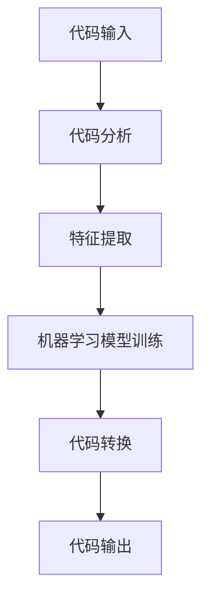

# 代码迁移的智能化实践

> 关键词：代码迁移、智能化、自动化工具、机器学习、软件复用

> 摘要：本文围绕代码迁移的智能化实践展开深入探讨。首先介绍代码迁移的背景，包括其目的、预期读者等内容。接着阐述代码迁移涉及的核心概念与联系，详细说明核心算法原理及具体操作步骤，并结合数学模型和公式进行深入分析。通过项目实战案例，展示代码迁移智能化的实际应用，包括开发环境搭建、源代码实现及解读。还介绍了代码迁移在不同场景下的实际应用，推荐相关的工具和资源。最后总结代码迁移智能化的未来发展趋势与挑战，提供常见问题解答和扩展阅读参考资料，旨在为开发者和相关研究人员提供全面且深入的代码迁移智能化实践指导。

## 1. 背景介绍 
### 1.1 目的和范围
代码迁移在软件开发领域具有重要意义。随着技术的不断发展，新的编程语言、框架和平台不断涌现，为了提升软件的性能、可维护性和兼容性，或者为了适应新的业务需求，常常需要将现有的代码从一个环境迁移到另一个环境。本文章的目的在于探讨如何实现代码迁移的智能化，通过运用先进的技术和方法，提高代码迁移的效率和质量，减少人工干预和错误。

本文章的范围涵盖了代码迁移的各个方面，包括核心概念、算法原理、数学模型、实际应用案例以及相关的工具和资源推荐等。旨在为读者提供一个全面的代码迁移智能化实践指南。

### 1.2 预期读者
本文预期读者包括软件开发人员、软件工程师、软件架构师、技术管理人员以及对代码迁移和智能化技术感兴趣的研究人员。对于软件开发人员来说，本文可以帮助他们掌握代码迁移的智能化方法和技术，提高工作效率和代码质量；对于软件架构师和技术管理人员，本文可以为他们在进行软件系统升级和迁移时提供决策参考；对于研究人员，本文可以为他们在代码迁移智能化领域的研究提供理论和实践基础。

### 1.3 文档结构概述
本文共分为十个部分。第一部分为背景介绍，包括目的和范围、预期读者、文档结构概述和术语表；第二部分介绍代码迁移的核心概念与联系，包括原理和架构的文本示意图及 Mermaid 流程图；第三部分详细讲解核心算法原理和具体操作步骤，并使用 Python 源代码进行阐述；第四部分介绍数学模型和公式，并进行详细讲解和举例说明；第五部分通过项目实战，展示代码迁移智能化的实际应用，包括开发环境搭建、源代码详细实现和代码解读；第六部分介绍代码迁移的实际应用场景；第七部分推荐相关的工具和资源，包括学习资源、开发工具框架和相关论文著作；第八部分总结代码迁移智能化的未来发展趋势与挑战；第九部分为附录，提供常见问题与解答；第十部分提供扩展阅读和参考资料。

### 1.4 术语表
#### 1.4.1 核心术语定义
- **代码迁移**：将现有的代码从一个编程环境（如编程语言、框架、平台等）转换到另一个编程环境的过程。
- **智能化代码迁移**：利用人工智能技术（如机器学习、自然语言处理等）实现代码迁移的自动化和智能化，减少人工干预和提高迁移效率。
- **代码复用**：在新的软件开发过程中，直接使用已有的代码片段或模块，以提高开发效率和代码质量。
- **抽象语法树（AST）**：源代码的一种树形表示形式，它以一种结构化的方式展示了代码的语法结构。

#### 1.4.2 相关概念解释
- **编译器**：将高级编程语言编写的源代码翻译成目标机器能够理解和执行的机器代码的程序。
- **解释器**：直接执行源代码的程序，不需要事先将源代码翻译成机器代码。
- **静态分析**：在不执行代码的情况下，对代码进行分析，以发现潜在的错误和问题。
- **动态分析**：在代码执行过程中，对代码的行为和性能进行分析。

#### 1.4.3 缩略词列表
- **AST**：抽象语法树（Abstract Syntax Tree）
- **ML**：机器学习（Machine Learning）
- **NLP**：自然语言处理（Natural Language Processing）

## 2. 核心概念与联系 
### 核心概念原理
代码迁移的核心在于理解源代码和目标环境的差异，并通过一定的方法将源代码转换为适合目标环境的代码。智能化代码迁移则是在这个过程中引入人工智能技术，以提高迁移的效率和准确性。

智能化代码迁移通常涉及以下几个关键步骤：
1. **代码分析**：对源代码进行静态分析，提取代码的结构、语义和依赖关系等信息。这可以通过解析源代码生成抽象语法树（AST）来实现。
2. **特征提取**：从代码分析的结果中提取有代表性的特征，这些特征可以用于后续的机器学习模型训练。
3. **模型训练**：使用机器学习算法对提取的特征进行训练，建立代码迁移的模型。
4. **代码转换**：根据训练好的模型，将源代码转换为目标环境的代码。

### 架构的文本示意图
智能化代码迁移的架构可以分为以下几个主要部分：
1. **代码输入模块**：接收源代码作为输入。
2. **代码分析模块**：对源代码进行静态分析，生成抽象语法树（AST），并提取代码的特征。
3. **机器学习模块**：使用提取的特征进行模型训练，并根据训练好的模型进行代码转换。
4. **代码输出模块**：输出转换后的代码。

### Mermaid 流程图


## 3. 核心算法原理 & 具体操作步骤 
### 核心算法原理
智能化代码迁移中常用的机器学习算法包括决策树、支持向量机、神经网络等。这里以神经网络为例，介绍其在代码迁移中的应用原理。

神经网络是一种模仿人类神经系统的计算模型，它由多个神经元组成，可以自动学习输入数据和输出数据之间的映射关系。在代码迁移中，神经网络的输入可以是源代码的特征，输出可以是目标代码的表示。

### 具体操作步骤
1. **数据收集**：收集大量的源代码和对应的目标代码作为训练数据。
2. **数据预处理**：对收集到的数据进行清洗、归一化等预处理操作，以提高数据的质量和可用性。
3. **特征提取**：从预处理后的数据中提取有代表性的特征，如代码的结构特征、语义特征等。
4. **模型构建**：构建神经网络模型，确定模型的结构和参数。
5. **模型训练**：使用训练数据对神经网络模型进行训练，调整模型的参数，以最小化预测误差。
6. **模型评估**：使用测试数据对训练好的模型进行评估，计算模型的准确率、召回率等指标。
7. **代码迁移**：使用训练好的模型对新的源代码进行迁移，得到目标代码。

### Python 源代码实现
```python
import numpy as np
import tensorflow as tf
from tensorflow.keras.models import Sequential
from tensorflow.keras.layers import Dense

# 数据收集和预处理
# 这里假设已经有了源代码特征和目标代码标签
source_features = np.random.rand(100, 10)  # 100 个样本，每个样本 10 个特征
target_labels = np.random.randint(0, 2, 100)  # 100 个样本，每个样本的标签为 0 或 1

# 划分训练集和测试集
train_size = int(0.8 * len(source_features))
train_features = source_features[:train_size]
train_labels = target_labels[:train_size]
test_features = source_features[train_size:]
test_labels = target_labels[train_size:]

# 模型构建
model = Sequential()
model.add(Dense(64, activation='relu', input_shape=(10,)))
model.add(Dense(32, activation='relu'))
model.add(Dense(1, activation='sigmoid'))

# 模型编译
model.compile(optimizer='adam', loss='binary_crossentropy', metrics=['accuracy'])

# 模型训练
model.fit(train_features, train_labels, epochs=10, batch_size=32, validation_data=(test_features, test_labels))

# 模型评估
test_loss, test_acc = model.evaluate(test_features, test_labels)
print(f"Test accuracy: {test_acc}")

# 代码迁移（预测）
new_source_features = np.random.rand(10, 10)
predictions = model.predict(new_source_features)
print(predictions)
```

## 4. 数学模型和公式 & 详细讲解 & 举例说明 
### 数学模型
在神经网络中，常用的数学模型是多层感知机（Multilayer Perceptron，MLP）。多层感知机由输入层、隐藏层和输出层组成，每层由多个神经元组成。

### 数学公式
对于一个简单的多层感知机，第 $l$ 层的第 $j$ 个神经元的输出 $a_j^l$ 可以通过以下公式计算：
$$
z_j^l = \sum_{i=0}^{n_{l-1}} w_{ji}^l a_i^{l-1} + b_j^l
$$
$$
a_j^l = f(z_j^l)
$$
其中，$w_{ji}^l$ 是第 $l$ 层的第 $j$ 个神经元与第 $l-1$ 层的第 $i$ 个神经元之间的权重，$b_j^l$ 是第 $l$ 层的第 $j$ 个神经元的偏置，$f$ 是激活函数。

### 详细讲解
- **权重 $w_{ji}^l$**：表示神经元之间的连接强度，通过训练过程不断调整，以使得模型能够更好地拟合数据。
- **偏置 $b_j^l$**：用于调整神经元的激活阈值，增加模型的灵活性。
- **激活函数 $f$**：引入非线性因素，使得模型能够学习到复杂的映射关系。常用的激活函数包括 sigmoid 函数、ReLU 函数等。

### 举例说明
假设我们有一个简单的多层感知机，输入层有 2 个神经元，隐藏层有 3 个神经元，输出层有 1 个神经元。输入层的输入为 $x_1$ 和 $x_2$，隐藏层的权重和偏置分别为 $w_{11}^1, w_{12}^1, b_1^1$，$w_{21}^1, w_{22}^1, b_2^1$，$w_{31}^1, w_{32}^1, b_3^1$，输出层的权重和偏置为 $w_{11}^2, w_{12}^2, w_{13}^2, b_1^2$。

首先计算隐藏层的输入：
$$
z_1^1 = w_{11}^1 x_1 + w_{12}^1 x_2 + b_1^1
$$
$$
z_2^1 = w_{21}^1 x_1 + w_{22}^1 x_2 + b_2^1
$$
$$
z_3^1 = w_{31}^1 x_1 + w_{32}^1 x_2 + b_3^1
$$

然后计算隐藏层的输出：
$$
a_1^1 = f(z_1^1)
$$
$$
a_2^1 = f(z_2^1)
$$
$$
a_3^1 = f(z_3^1)
$$

最后计算输出层的输入和输出：
$$
z_1^2 = w_{11}^2 a_1^1 + w_{12}^2 a_2^1 + w_{13}^2 a_3^1 + b_1^2
$$
$$
a_1^2 = f(z_1^2)
$$

## 5. 项目实战：代码实际案例和详细解释说明 
### 5.1  开发环境搭建
1. **安装 Python**：确保系统中安装了 Python 3.x 版本。可以从 Python 官方网站（https://www.python.org/downloads/） 下载并安装。
2. **安装相关库**：使用 pip 安装所需的库，如 tensorflow、numpy 等。
```sh
pip install tensorflow numpy
```
3. **选择开发工具**：可以选择 PyCharm、VS Code 等集成开发环境（IDE）进行代码开发。

### 5.2  源代码详细实现和代码解读
```python
import numpy as np
import tensorflow as tf
from tensorflow.keras.models import Sequential
from tensorflow.keras.layers import Dense

# 数据收集和预处理
# 这里以一个简单的示例数据为例
source_features = np.array([[1, 2, 3], [4, 5, 6], [7, 8, 9], [10, 11, 12]])
target_labels = np.array([0, 1, 0, 1])

# 划分训练集和测试集
train_size = int(0.75 * len(source_features))
train_features = source_features[:train_size]
train_labels = target_labels[:train_size]
test_features = source_features[train_size:]
test_labels = target_labels[train_size:]

# 模型构建
model = Sequential()
model.add(Dense(16, activation='relu', input_shape=(3,)))
model.add(Dense(8, activation='relu'))
model.add(Dense(1, activation='sigmoid'))

# 模型编译
model.compile(optimizer='adam', loss='binary_crossentropy', metrics=['accuracy'])

# 模型训练
model.fit(train_features, train_labels, epochs=20, batch_size=1, validation_data=(test_features, test_labels))

# 模型评估
test_loss, test_acc = model.evaluate(test_features, test_labels)
print(f"Test accuracy: {test_acc}")

# 代码迁移（预测）
new_source_features = np.array([[13, 14, 15], [16, 17, 18]])
predictions = model.predict(new_source_features)
print(predictions)
```

### 代码解读与分析
1. **数据收集和预处理**：定义了一个简单的源代码特征数组 `source_features` 和对应的目标代码标签数组 `target_labels`，并将数据划分为训练集和测试集。
2. **模型构建**：使用 `Sequential` 模型构建了一个简单的多层感知机，包含一个输入层、两个隐藏层和一个输出层。
3. **模型编译**：使用 `adam` 优化器和 `binary_crossentropy` 损失函数对模型进行编译，并设置了评估指标为准确率。
4. **模型训练**：使用训练数据对模型进行训练，设置了训练的轮数和批次大小，并使用测试数据进行验证。
5. **模型评估**：使用测试数据对训练好的模型进行评估，计算模型的准确率。
6. **代码迁移（预测）**：使用训练好的模型对新的源代码特征进行预测，得到目标代码的预测结果。

## 6. 实际应用场景 
### 编程语言迁移
在软件开发过程中，有时需要将代码从一种编程语言迁移到另一种编程语言。例如，将 Java 代码迁移到 Python 代码，或者将 C++ 代码迁移到 JavaScript 代码。智能化代码迁移可以帮助开发人员快速、准确地完成这种迁移任务，减少人工编写代码的工作量和错误。

### 框架升级
随着技术的发展，软件框架也在不断更新和升级。为了享受新框架的优势，开发人员需要将现有的代码迁移到新的框架上。智能化代码迁移可以自动识别旧框架和新框架之间的差异，并将代码进行相应的转换，提高框架升级的效率和质量。

### 平台迁移
当软件需要从一个平台迁移到另一个平台时，如从 Windows 平台迁移到 Linux 平台，或者从本地服务器迁移到云端服务器，代码也需要进行相应的迁移。智能化代码迁移可以考虑不同平台之间的差异，如文件系统、网络协议等，将代码转换为适合目标平台的代码。

### 软件复用
在软件开发过程中，为了提高开发效率和代码质量，常常会复用已有的代码。智能化代码迁移可以帮助开发人员快速找到适合复用的代码，并将其迁移到新的项目中，实现代码的复用。

## 7. 工具和资源推荐
### 7.1 学习资源推荐
#### 7.1.1 书籍推荐
- 《Python 机器学习》：介绍了 Python 中常用的机器学习算法和工具，适合初学者入门。
- 《深度学习》：由深度学习领域的三位顶尖专家撰写，系统地介绍了深度学习的理论和实践。
- 《编译原理》：讲解了编译器的基本原理和实现方法，对于理解代码分析和转换有很大帮助。

#### 7.1.2 在线课程
- Coursera 上的 “机器学习” 课程：由斯坦福大学教授 Andrew Ng 授课，是机器学习领域的经典课程。
- edX 上的 “深度学习基础” 课程：介绍了深度学习的基本概念和算法，适合初学者学习。
- Udemy 上的 “Python 编程从入门到实践” 课程：帮助学习者快速掌握 Python 编程的基础知识和技能。

#### 7.1.3 技术博客和网站
- Medium：有很多关于机器学习、人工智能和代码迁移的技术文章和博客。
- Towards Data Science：专注于数据科学和机器学习领域的技术分享和讨论。
- Stack Overflow：一个程序员社区，提供了大量的代码迁移和编程相关的问题解答和经验分享。

### 7.2 开发工具框架推荐
#### 7.2.1 IDE和编辑器
- PyCharm：一款专业的 Python 集成开发环境，提供了丰富的代码编辑、调试和版本控制功能。
- VS Code：一款轻量级的代码编辑器，支持多种编程语言和插件扩展，适合快速开发和调试。
- IntelliJ IDEA：一款功能强大的 Java 集成开发环境，也支持其他多种编程语言。

#### 7.2.2 调试和性能分析工具
- PyCharm Debugger：可以帮助开发人员调试 Python 代码，定位和解决问题。
- TensorBoard：TensorFlow 提供的可视化工具，用于监控模型训练过程和分析模型性能。
- cProfile：Python 内置的性能分析工具，可以帮助开发人员找出代码中的性能瓶颈。

#### 7.2.3 相关框架和库
- TensorFlow：一个开源的机器学习框架，提供了丰富的工具和算法，用于构建和训练神经网络模型。
- PyTorch：另一个流行的深度学习框架，具有动态图和易于使用的特点。
- Scikit-learn：一个简单而高效的机器学习库，提供了多种机器学习算法和工具，适合快速开发和实验。

### 7.3 相关论文著作推荐
#### 7.3.1 经典论文
- “Gradient-Based Learning Applied to Document Recognition”：由 Yann LeCun 等人撰写，介绍了卷积神经网络在手写字符识别中的应用，是深度学习领域的经典论文之一。
- “ImageNet Classification with Deep Convolutional Neural Networks”：由 Alex Krizhevsky 等人撰写，介绍了 AlexNet 模型，开创了深度学习在图像分类领域的先河。
- “Long Short-Term Memory”：由 Sepp Hochreiter 和 Jürgen Schmidhuber 撰写，介绍了长短期记忆网络（LSTM）的原理和应用，是循环神经网络领域的经典论文。

#### 7.3.2 最新研究成果
- 关注顶级学术会议如 NeurIPS、ICML、CVPR 等的最新论文，了解代码迁移智能化领域的最新研究进展。
- 查阅相关领域的学术期刊，如 Journal of Artificial Intelligence Research、ACM Transactions on Intelligent Systems and Technology 等。

#### 7.3.3 应用案例分析
- 研究开源项目中的代码迁移案例，了解实际应用中遇到的问题和解决方案。
- 关注科技公司的技术博客，如 Google AI Blog、Facebook AI Research 等，了解他们在代码迁移智能化方面的实践经验。

## 8. 总结：未来发展趋势与挑战
### 未来发展趋势
1. **更强大的智能化能力**：随着人工智能技术的不断发展，代码迁移的智能化能力将不断提升。未来的智能化代码迁移工具将能够更好地理解代码的语义和上下文，实现更准确、高效的代码迁移。
2. **跨领域融合**：代码迁移将与其他领域如自然语言处理、计算机视觉等进行更深入的融合。例如，通过自然语言处理技术，实现对代码注释和文档的理解，帮助更好地进行代码迁移。
3. **自动化程度提高**：未来的代码迁移工具将实现更高程度的自动化，减少人工干预。例如，自动检测代码的变更和差异，自动生成迁移脚本等。
4. **云服务支持**：随着云计算技术的发展，代码迁移将更多地借助云服务进行。云服务可以提供强大的计算资源和存储能力，支持大规模的代码迁移任务。

### 挑战
1. **代码语义理解**：准确理解代码的语义是代码迁移的关键，但也是一个具有挑战性的问题。不同的编程语言和框架可能具有不同的语义和语法规则，如何实现跨语言和跨框架的代码语义理解是一个亟待解决的问题。
2. **数据质量和规模**：智能化代码迁移需要大量的高质量数据进行模型训练。然而，收集和标注这些数据是一个耗时、耗力的过程，并且数据的质量也会影响模型的性能。
3. **兼容性问题**：在代码迁移过程中，需要考虑目标环境的兼容性问题。不同的操作系统、硬件平台和软件版本可能对代码有不同的要求，如何确保迁移后的代码在目标环境中能够正常运行是一个挑战。
4. **安全问题**：代码迁移过程中可能会涉及到敏感信息的传输和处理，如何确保数据的安全性和隐私性是一个重要的问题。

## 9. 附录：常见问题与解答
### 问题 1：智能化代码迁移工具是否可以完全替代人工迁移？
解答：目前的智能化代码迁移工具还不能完全替代人工迁移。虽然智能化工具可以提高迁移的效率和准确性，但在一些复杂的情况下，如代码语义的理解、业务逻辑的处理等，仍然需要人工的参与和干预。

### 问题 2：如何选择适合的机器学习算法进行代码迁移？
解答：选择适合的机器学习算法需要考虑多个因素，如数据的特点、问题的复杂度、模型的可解释性等。一般来说，可以先尝试一些常见的算法，如决策树、支持向量机、神经网络等，然后根据实验结果选择性能最优的算法。

### 问题 3：在代码迁移过程中，如何处理代码的依赖关系？
解答：处理代码的依赖关系是代码迁移中的一个重要问题。可以通过分析代码的依赖关系图，找出代码的依赖项，并确保这些依赖项在目标环境中也能够正常使用。如果某些依赖项在目标环境中不可用，需要考虑进行替换或重构。

### 问题 4：智能化代码迁移工具是否适用于所有类型的代码？
解答：智能化代码迁移工具适用于大多数类型的代码，但对于一些特殊类型的代码，如汇编代码、嵌入式系统代码等，可能需要进行特殊的处理。此外，代码的质量和复杂度也会影响迁移工具的性能。

## 10. 扩展阅读 & 参考资料
### 扩展阅读
- 《人工智能：一种现代的方法》：全面介绍了人工智能的理论和应用，对于深入理解代码迁移的智能化技术有很大帮助。
- 《代码大全》：一本关于软件开发的经典著作，提供了很多关于代码编写、维护和迁移的实用建议。

### 参考资料
- 相关的学术论文和研究报告。
- 开源项目的文档和代码。
- 技术博客和论坛上的讨论和经验分享。